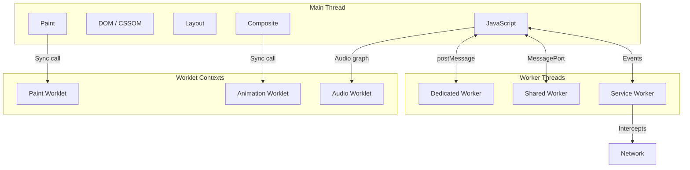

# Web Workers and Worklets for Off-Main-Thread Work

Concurrency primitives for keeping the main thread responsive. Workers provide general-purpose parallelism via message passing; worklets integrate directly into the browser's rendering pipeline for synchronized paint, animation, and audio processing.

<figure>



<figcaption>Workers communicate asynchronously via message passing. Worklets integrate synchronously at specific rendering pipeline stages.</figcaption>
</figure>

## Abstract

The browser's main thread handles JavaScript execution, DOM updates, style calculation, layout, paint, and compositing in a single event loop. Long-running JavaScript blocks this entire pipeline, causing dropped frames and unresponsive UI.

**Workers** solve this by running JavaScript in separate threads with isolated memory. Communication happens through `postMessage()` and the Structured Clone Algorithm—data is copied by default, or ownership can be transferred for zero-copy performance. Three worker types serve different purposes: Dedicated Workers for compute-heavy tasks, Shared Workers for cross-tab coordination, and Service Workers for network interception and offline support.

**Worklets** address a different problem: integrating custom code into the rendering pipeline itself. Paint Worklets generate custom CSS images during the paint phase. Animation Worklets produce frames off-thread while staying synchronized with compositing. Audio Worklets process samples on the audio rendering thread with sub-millisecond timing requirements. Worklets sacrifice API flexibility (no DOM, limited globals) for guaranteed synchronization with their pipeline stage.

**SharedArrayBuffer** enables true shared memory when cross-origin isolation is configured, allowing lock-free algorithms via Atomics—but the security requirements and complexity make it suitable only for specific high-performance scenarios.

## Worker Types and Lifecycle

### Dedicated Workers

A Dedicated Worker creates a one-to-one relationship between a script and a worker thread. The worker has its own global scope (`DedicatedWorkerGlobalScope`), event loop, and JavaScript heap.

```js title="Creating a dedicated worker" collapse={1-2,10-15}
// main.js
// Dedicated workers are bound to their creator

const worker = new Worker("/compute-worker.js", {
  type: "module", // Enable ES modules (default: 'classic')
  name: "compute", // Optional name for debugging
})

worker.postMessage({ task: "factorial", n: 1000000n })

// compute-worker.js
self.onmessage = (e) => {
  const result = computeFactorial(e.data.n)
  self.postMessage(result)
}
```

**Lifecycle states** (per WHATWG HTML spec):

| State               | Condition                                                                     | Behavior                    |
| ------------------- | ----------------------------------------------------------------------------- | --------------------------- |
| **Actively needed** | Has a fully active Document owner, or owned by another actively needed worker | Full execution permitted    |
| **Protected**       | Actively needed AND (is SharedWorker, has open ports, or has timers/network)  | Cannot be garbage collected |
| **Permissible**     | Has owners in owner set, or SharedWorker within between-loads timeout         | May be suspended            |
| **Suspendable**     | Permissible but not actively needed                                           | UA may pause event loop     |

Termination occurs when `terminate()` is called or the worker becomes impermissible. Calling `terminate()` immediately sets the closing flag, discards queued tasks, and aborts running scripts—there is no graceful shutdown.

### Shared Workers

Shared Workers implement many-to-one communication: multiple browsing contexts within the same origin connect to a single worker instance.

```js title="Shared worker connection" collapse={1-2,11-20}
// main.js (in multiple tabs)
// Multiple tabs connect to the same named worker

const worker = new SharedWorker("/shared-state.js", "session-state")
worker.port.start()
worker.port.postMessage({ action: "subscribe", channel: "updates" })
worker.port.onmessage = (e) => {
  console.log("Update:", e.data)
}

// shared-state.js
const connections = new Set()

self.onconnect = (e) => {
  const port = e.ports[0]
  connections.add(port)
  port.onmessage = (msg) => {
    // Broadcast to all connected ports
    for (const p of connections) p.postMessage(msg.data)
  }
}
```

Key differences from Dedicated Workers:

- Communication uses explicit `MessagePort` (accessed via `worker.port`)
- The worker survives as long as at least one port remains connected
- `onconnect` fires each time a new context connects
- State persists across page navigations within the same origin

Shared Workers remain alive during the "between-loads shared worker timeout" when a page navigates—allowing reconnection without losing state.

### Service Workers

Service Workers operate under browser control rather than page control. The browser starts them for network events and terminates them when idle.

```js title="Service worker registration" collapse={1-3,12-20}
// main.js
// Service workers are registered, not constructed
// They control pages matching their scope

if ("serviceWorker" in navigator) {
  const reg = await navigator.serviceWorker.register("/sw.js", {
    scope: "/",
    type: "module",
  })
}

// sw.js
self.addEventListener("install", (e) => {
  e.waitUntil(caches.open("v1").then((c) => c.addAll(["/app.js", "/styles.css"])))
})

self.addEventListener("fetch", (e) => {
  e.respondWith(caches.match(e.request).then((r) => r || fetch(e.request)))
})
```

Critical behavioral differences:

| Aspect        | Dedicated/Shared Worker                  | Service Worker                                  |
| ------------- | ---------------------------------------- | ----------------------------------------------- |
| Lifetime      | Developer controls via `new`/`terminate` | Browser controls; may terminate any time        |
| Persistence   | Lives while page is open                 | Persists across page loads and browser restarts |
| Network       | Regular fetch access                     | Intercepts all network requests in scope        |
| DOM access    | None                                     | None (but can communicate with clients)         |
| Start trigger | Explicit construction                    | Network request, push notification, sync event  |

Service Workers must complete event handlers quickly. Long-running operations should use `event.waitUntil()` to extend the worker's lifetime, but the browser may still terminate after a timeout (typically 30 seconds to 5 minutes depending on the event type).

### Module Workers vs Classic Workers

The `type` option determines script loading semantics:

**Classic Workers** (default):

- `importScripts()` synchronously loads and executes scripts
- No `import`/`export` statements (throws `SyntaxError`)
- No strict mode by default
- Top-level `this` refers to the global scope

**Module Workers** (`type: 'module'`):

- Standard ES module semantics with `import`/`export`
- `importScripts()` always throws `TypeError`
- Strict mode enabled, cannot be disabled
- Top-level `this` is `undefined`
- Supports `import.meta.url` for script location
- Enables `<link rel="modulepreload">` for preloading

```js title="Module worker with dynamic import" collapse={1-2,9-12}
// worker.js (type: 'module')
// Dynamic imports work in module workers

import { heavyCompute } from "./compute.js"

self.onmessage = async (e) => {
  // Dynamic import for code splitting
  const { processImage } = await import("./image-processor.js")
  const result = await processImage(e.data)
  self.postMessage(result)
}
```

Module workers have slightly higher initialization overhead due to module resolution, but provide better code organization and tree-shaking opportunities.

## Communication and Data Transfer

### Structured Clone Algorithm

`postMessage()` serializes data using the Structured Clone Algorithm, which recursively copies objects while tracking references to handle cycles:

**Supported types:**

- Primitives (except `Symbol`)
- `Object`, `Array`, `Map`, `Set`
- `Date`, `RegExp`
- `ArrayBuffer`, `TypedArray`, `DataView`
- `Blob`, `File`, `FileList`
- `ImageData`, `ImageBitmap`
- Error objects (limited properties)

**Cannot be cloned:**

- Functions (throws `DataCloneError`)
- DOM nodes
- Property descriptors, getters/setters
- Prototype chain (only own enumerable properties)
- Symbols

```js title="Structured cloning behavior" collapse={1-3,15-20}
// Cycles are preserved
const obj = { name: "circular" }
obj.self = obj
worker.postMessage(obj) // Works—cycle is maintained

// Functions fail
worker.postMessage({ fn: () => {} }) // DataCloneError

// Class instances lose their prototype
class Point {
  constructor(x, y) {
    this.x = x
    this.y = y
  }
}
worker.postMessage(new Point(1, 2))
// Worker receives: { x: 1, y: 2 } (plain object, no Point prototype)

// Maps and Sets are preserved
worker.postMessage(new Map([["key", "value"]]))
// Worker receives: Map { 'key' => 'value' }
```

### Transferable Objects

Transferables move ownership rather than copying—the source context loses access, but transfer is nearly instantaneous regardless of size.

**Transferable types:**

- `ArrayBuffer`
- `MessagePort`
- `ImageBitmap`
- `OffscreenCanvas`
- `ReadableStream`, `WritableStream`, `TransformStream`

```js title="Transferring an ArrayBuffer" collapse={1-2,12-18}
// Create a 100MB buffer
const buffer = new ArrayBuffer(100 * 1024 * 1024)

console.log(buffer.byteLength) // 104857600

// Transfer ownership to worker
worker.postMessage(buffer, [buffer])

console.log(buffer.byteLength) // 0 (detached)

// Worker receives the buffer instantly
// In worker:
self.onmessage = (e) => {
  const received = e.data
  console.log(received.byteLength) // 104857600
  // Worker now owns this buffer
}
```

### Performance Characteristics

Cloning overhead scales with data complexity:

| Data Size | Clone Time | Transfer Time | Recommendation                             |
| --------- | ---------- | ------------- | ------------------------------------------ |
| < 10 KB   | < 1ms      | ~0ms          | Either method acceptable                   |
| 50 KB     | ~5ms       | < 1ms         | Clone for infrequent, transfer for > 60 Hz |
| 100 KB    | ~10ms      | < 1ms         | Transfer if within 16ms frame budget       |
| 1 MB      | ~100ms     | < 1ms         | Must transfer                              |
| 32 MB     | ~300ms     | ~6ms          | Must transfer                              |
| > 200 MB  | Unreliable | ~20-50ms      | Consider streaming/chunking                |

For high-frequency communication (e.g., 60 Hz animation data), even small cloning overhead accumulates. Transfer 64-byte typed arrays if sending them 60 times per second.

### Error Handling

Worker errors propagate via the `error` event:

```js title="Worker error handling" collapse={1-3,14-20}
// Main thread
worker.onerror = (event) => {
  // ErrorEvent properties:
  console.error(`${event.filename}:${event.lineno}:${event.colno}`)
  console.error(event.message)
  event.preventDefault() // Suppress default console error
}

worker.onmessageerror = (event) => {
  // Fires when deserialization fails
  console.error("Failed to deserialize message")
}

// Worker can catch its own errors
self.onerror = (message, filename, lineno, colno, error) => {
  // Return true to prevent propagation to main thread
  return true
}
```

Unhandled promise rejections in workers generate `unhandledrejection` events on the worker global scope, similar to main thread behavior.

## SharedArrayBuffer and Atomics

SharedArrayBuffer enables true concurrent memory access between contexts—but requires cross-origin isolation due to Spectre mitigation requirements.

### Cross-Origin Isolation Requirements

Two HTTP headers must be present:

```
Cross-Origin-Opener-Policy: same-origin
Cross-Origin-Embedder-Policy: require-corp
```

`COOP: same-origin` breaks the relationship between your page and cross-origin popups (they can't access each other's windows). `COEP: require-corp` requires all cross-origin resources to explicitly opt in via `Cross-Origin-Resource-Policy` headers.

```js title="Checking cross-origin isolation" collapse={1-3}
// Runtime check before using SharedArrayBuffer
if (!crossOriginIsolated) {
  throw new Error("SharedArrayBuffer requires cross-origin isolation")
}

const sab = new SharedArrayBuffer(1024)
const view = new Int32Array(sab)
```

The `credentialless` variant of COEP relaxes requirements by allowing cross-origin resources without CORP headers but stripping their cookies and credentials:

```
Cross-Origin-Embedder-Policy: credentialless
```

### Atomics Operations

Atomics provide synchronization primitives for concurrent access:

```js title="Producer-consumer with Atomics" collapse={1-5,25-35}
// Shared buffer layout:
// [0]: ready flag (0 = not ready, 1 = data available)
// [1-n]: data

const sab = new SharedArrayBuffer(1024)
const control = new Int32Array(sab, 0, 1)
const data = new Float64Array(sab, 8)

// In producer worker:
function produce(value) {
  data[0] = value
  Atomics.store(control, 0, 1) // Mark ready
  Atomics.notify(control, 0, 1) // Wake one waiter
}

// In consumer worker:
function consume() {
  while (Atomics.load(control, 0) === 0) {
    Atomics.wait(control, 0, 0) // Block until notified
  }
  const value = data[0]
  Atomics.store(control, 0, 0) // Mark consumed
  return value
}

// Available atomic operations:
// Atomics.load(ta, index) - atomic read
// Atomics.store(ta, index, value) - atomic write
// Atomics.add(ta, index, value) - atomic add, returns old value
// Atomics.sub(ta, index, value) - atomic subtract
// Atomics.and/or/xor(ta, index, value) - bitwise operations
// Atomics.compareExchange(ta, index, expected, replacement)
// Atomics.exchange(ta, index, value) - atomic swap
// Atomics.wait(ta, index, value, timeout?) - block until changed
// Atomics.notify(ta, index, count?) - wake waiting threads
```

**Critical constraint:** `Atomics.wait()` blocks the calling thread. On the main thread, this blocks rendering entirely. Never use `Atomics.wait()` on the main thread—use `Atomics.waitAsync()` (returns a Promise) instead.

### Design Rationale: Why Cross-Origin Isolation?

SharedArrayBuffer enables high-resolution timing attacks (Spectre-style):

```js title="High-resolution timing via SharedArrayBuffer" collapse={1-2,8-12}
// Attacker spins in a worker, incrementing a counter
// Main thread reads the counter before/after a memory access
// The delta reveals cache timing, potentially leaking memory contents

const sab = new SharedArrayBuffer(4)
const counter = new Int32Array(sab)

// Worker thread (spinning)
while (true) Atomics.add(counter, 0, 1)

// Main thread measures timing
const start = Atomics.load(counter, 0)
// ... memory access ...
const elapsed = Atomics.load(counter, 0) - start
```

Cross-origin isolation contains this threat by:

1. Preventing cross-origin iframes from accessing your browsing context
2. Ensuring no cross-origin window can observe timing side channels
3. Limiting potential information leakage to same-origin resources

## Worklets: Rendering Pipeline Integration

Worklets differ fundamentally from workers: they execute synchronously within specific rendering pipeline stages rather than as independent concurrent threads.

### Why Worklets Exist

Workers cannot solve synchronous rendering needs:

```js title="Why workers fail for paint" collapse={1-4}
// Problem: Worker results arrive too late
worker.postMessage({ width: 100, height: 100 })
worker.onmessage = (e) => {
  // This runs AFTER the current frame has painted
  element.style.backgroundImage = `url(${e.data})`
  // User sees a frame with the OLD background
}
```

Worklets execute during the rendering phase itself:

```css
/* Paint worklet runs during paint phase */
.custom-bg {
  background: paint(custom-gradient);
}
/* Browser calls paint() synchronously before compositing */
```

### Worklet Restrictions

To enable synchronous pipeline integration, worklets sacrifice flexibility:

| Restriction                   | Reason                                     |
| ----------------------------- | ------------------------------------------ |
| No DOM access                 | Would require cross-thread synchronization |
| No `fetch()` or network       | Would block rendering                      |
| No `setTimeout`/`setInterval` | Timing tied to render events               |
| Limited global scope          | Prevents accidental expensive operations   |
| Multiple instances            | Browser may parallelize execution          |

The browser can create multiple worklet global scopes and instantiate your class multiple times. Never rely on instance state persisting across invocations.

### Paint Worklet (CSS Painting API)

Paint Worklets generate custom CSS `<image>` values during the paint phase.

```js title="Registering a paint worklet" collapse={1-4,25-35}
// paint-checkerboard.js
// Paint worklets define custom CSS image generators

class CheckerboardPainter {
  static get inputProperties() {
    return ["--checker-size", "--checker-color-1", "--checker-color-2"]
  }

  paint(ctx, geom, props) {
    const size = parseInt(props.get("--checker-size")) || 32
    const color1 = props.get("--checker-color-1").toString() || "#fff"
    const color2 = props.get("--checker-color-2").toString() || "#000"

    for (let y = 0; y < geom.height; y += size) {
      for (let x = 0; x < geom.width; x += size) {
        const isEven = (x / size + y / size) % 2 === 0
        ctx.fillStyle = isEven ? color1 : color2
        ctx.fillRect(x, y, size, size)
      }
    }
  }
}

registerPaint("checkerboard", CheckerboardPainter)

// main.js - register the worklet
CSS.paintWorklet.addModule("/paint-checkerboard.js")
```

```css title="Using the paint worklet" collapse={1-2}
/* CSS usage */
.checkerboard {
  --checker-size: 20;
  --checker-color-1: #f0f0f0;
  --checker-color-2: #333;
  background: paint(checkerboard);
}
```

**PaintRenderingContext2D** is a subset of `CanvasRenderingContext2D`:

- Supported: `fillRect`, `strokeRect`, `drawImage`, `arc`, `bezierCurveTo`, path operations, transforms
- Not supported: Text rendering (`fillText`, `strokeText`), `getImageData`, `putImageData`

**Browser behavior:**

- Browser may cache results when size, styles, and arguments are unchanged
- Elements outside the viewport may defer painting
- Long-running `paint()` calls may be terminated

**Support (as of 2025):** Chrome/Edge (full), Safari (partial), Firefox (in development).

### Animation Worklet

Animation Worklets produce animation frames off-thread, synchronized with compositing.

```js title="Scroll-linked animation worklet" collapse={1-4,20-30}
// parallax-animator.js
// Animation worklet for scroll-driven effects

class ParallaxAnimator {
  constructor(options) {
    this.rate = options.rate || 0.5
  }

  animate(currentTime, effect) {
    // currentTime comes from the timeline (e.g., scroll position)
    // effect.localTime controls the animation progress
    effect.localTime = currentTime * this.rate
  }
}

registerAnimator("parallax", ParallaxAnimator)

// main.js
await CSS.animationWorklet.addModule("/parallax-animator.js")

const scroller = document.querySelector(".scroll-container")
const target = document.querySelector(".parallax-element")

const animation = new WorkletAnimation(
  "parallax",
  new KeyframeEffect(target, [{ transform: "translateY(0)" }, { transform: "translateY(-200px)" }], {
    duration: 1,
    fill: "both",
  }),
  new ScrollTimeline({ source: scroller }),
  { rate: 0.3 },
)
animation.play()
```

Key differences from Web Animations:

- Animator instances directly control `effect.localTime` rather than inheriting from timeline
- Execution may occur on a separate thread (compositor thread)
- Main thread jank does not affect animation smoothness
- `ScrollTimeline` integration enables scroll-linked effects without scroll event handlers

**Support (as of 2025):** Chrome/Edge (full), Safari/Firefox (not yet implemented).

### Audio Worklet

Audio Worklets process audio samples on the Web Audio rendering thread with strict real-time constraints.

```js title="Custom gain processor" collapse={1-4,25-40}
// gain-processor.js
// Audio worklet for custom sample processing

class GainProcessor extends AudioWorkletProcessor {
  static get parameterDescriptors() {
    return [
      {
        name: "gain",
        defaultValue: 1.0,
        minValue: 0,
        maxValue: 2,
        automationRate: "a-rate", // per-sample automation
      },
    ]
  }

  process(inputs, outputs, parameters) {
    const input = inputs[0]
    const output = outputs[0]
    const gain = parameters.gain

    for (let channel = 0; channel < output.length; channel++) {
      for (let i = 0; i < output[channel].length; i++) {
        // gain may be k-rate (single value) or a-rate (per-sample)
        const g = gain.length > 1 ? gain[i] : gain[0]
        output[channel][i] = input[channel]?.[i] * g || 0
      }
    }
    return true // Continue processing
  }
}

registerProcessor("gain-processor", GainProcessor)

// main.js
const ctx = new AudioContext()
await ctx.audioWorklet.addModule("/gain-processor.js")

const gainNode = new AudioWorkletNode(ctx, "gain-processor")
gainNode.parameters.get("gain").value = 0.5

source.connect(gainNode)
gainNode.connect(ctx.destination)
```

**Render quantum:** Fixed at 128 samples. At 48 kHz sample rate, this is ~2.67ms per callback. Your `process()` must complete within this time or audio glitches occur.

**Communication:** Use `MessagePort` (accessed via `node.port` / `this.port`) for control messages. Never allocate memory or perform I/O in `process()`.

**Support (as of 2025):** All modern browsers (mature API).

### Layout Worklet (Experimental)

Layout Worklets enable custom CSS layout algorithms. The API is under development and not production-ready.

```js title="Layout worklet (experimental)" collapse={1-3}
// Experimental - API may change
// Available in Chrome behind experimental flag

class MasonryLayout {
  static get inputProperties() {
    return ["--columns"]
  }

  async intrinsicSizes(children, edges, styleMap) {
    // Return intrinsic sizing
  }

  async layout(children, edges, constraints, styleMap) {
    // Position children, return fragment
  }
}

registerLayout("masonry", MasonryLayout)
```

**Status (as of 2025):** Hidden behind flags in Chromium. Specification still evolving. Not recommended for production.

## Use-Case Decision Matrix

| Scenario                                  | Recommended                 | Why                                          |
| ----------------------------------------- | --------------------------- | -------------------------------------------- |
| Heavy computation (WASM, crypto, parsing) | Dedicated Worker            | Isolates CPU work from UI                    |
| Cross-tab shared state                    | Shared Worker               | Single instance serves multiple tabs         |
| Offline support, caching                  | Service Worker              | Intercepts network, persists across sessions |
| Custom CSS backgrounds/borders            | Paint Worklet               | Synchronous with paint phase                 |
| Scroll-linked animations                  | Animation Worklet           | Off-compositor-thread, jank-free             |
| Real-time audio effects                   | Audio Worklet               | Runs on audio thread, < 3ms latency          |
| Large binary transfers (> 1 MB)           | Worker + Transferables      | Zero-copy transfer                           |
| Lock-free shared state                    | SharedArrayBuffer + Atomics | True shared memory (requires COOP/COEP)      |

## Debugging and Profiling

### Chrome DevTools

**Workers:**

- Sources panel → Threads sidebar shows all workers
- Console can target specific worker contexts
- Performance panel includes worker activity in flame chart
- Memory panel can snapshot worker heaps

**Worklets:**

- Paint worklets: Use "Rendering" drawer → "Paint flashing" to see repaints
- Audio worklets: `chrome://webaudio-internals` shows audio graph
- Performance panel shows worklet execution in appropriate tracks

### Common Issues

**Worker not starting:**

- Check console for script fetch errors (404, CORS)
- Module workers require correct MIME type (`text/javascript`)
- Mixed content blocks HTTP workers on HTTPS pages

**Messages not received:**

- Verify `port.start()` called for SharedWorker ports
- Check for `DataCloneError` in console (non-clonable data)
- Confirm worker hasn't terminated (`worker.terminate()` is immediate)

**SharedArrayBuffer unavailable:**

- Verify `crossOriginIsolated === true` in console
- Check response headers for COOP/COEP
- Ensure all cross-origin resources have CORP headers

## Conclusion

Workers and worklets serve distinct concurrency needs. Workers provide general-purpose parallelism with message-passing isolation—safe by default, with SharedArrayBuffer available when true shared memory is required. Worklets integrate into the rendering pipeline for use cases where asynchronous communication cannot meet timing requirements.

Choose workers for compute offloading and background tasks. Choose worklets when you need synchronization with paint, animation, or audio rendering phases. For most applications, Dedicated Workers with Transferables provide the best balance of simplicity and performance.

## Appendix

### Prerequisites

- JavaScript event loop and asynchronous execution model
- Basic understanding of browser rendering pipeline (style → layout → paint → composite)
- Familiarity with Promises and async/await
- For SharedArrayBuffer: Understanding of concurrent programming concepts

### Terminology

- **Structured Clone Algorithm:** The serialization mechanism used by `postMessage()` to copy JavaScript values between contexts
- **Transferable:** An object type whose ownership can be moved (not copied) between contexts via `postMessage()`
- **Render Quantum:** The fixed block size (128 samples) processed per Audio Worklet callback
- **Cross-Origin Isolation:** A security mode requiring COOP and COEP headers that enables SharedArrayBuffer

### Summary

- **Dedicated Workers** create 1:1 thread relationships with explicit `terminate()` control
- **Shared Workers** serve multiple tabs with port-based communication and shared state
- **Service Workers** run under browser control for network interception and offline support
- **Module workers** (`type: 'module'`) enable ES module syntax; classic workers use `importScripts()`
- **Structured cloning** copies data; **transferables** move ownership for zero-copy performance
- **SharedArrayBuffer** requires cross-origin isolation (COOP + COEP headers) due to Spectre mitigations
- **Paint Worklets** generate custom CSS images synchronously during paint
- **Animation Worklets** produce frames off-thread, integrated with scroll timelines
- **Audio Worklets** process samples in 128-sample blocks with < 3ms timing requirements

### References

- [WHATWG HTML Living Standard - Workers](https://html.spec.whatwg.org/multipage/workers.html) - Authoritative worker lifecycle and API specification
- [WHATWG HTML - Structured Clone Algorithm](https://html.spec.whatwg.org/multipage/structured-data.html) - Data serialization specification
- [W3C CSS Painting API Level 1](https://drafts.css-houdini.org/css-paint-api-1/) - Paint Worklet specification
- [W3C CSS Animation Worklet API](https://www.w3.org/TR/css-animation-worklet-1/) - Animation Worklet specification
- [W3C Web Audio API - AudioWorklet](https://www.w3.org/TR/webaudio/#audioworklet) - Audio Worklet specification
- [MDN - Web Workers API](https://developer.mozilla.org/en-US/docs/Web/API/Web_Workers_API) - Comprehensive API reference
- [MDN - Transferable Objects](https://developer.mozilla.org/en-US/docs/Web/API/Web_Workers_API/Transferable_objects) - Transferable types reference
- [web.dev - Cross-Origin Isolation Guide](https://web.dev/articles/cross-origin-isolation-guide) - COOP/COEP implementation guide
- [web.dev - Module Workers](https://web.dev/articles/module-workers) - Module worker usage patterns
- [MDN - Houdini APIs](https://developer.mozilla.org/en-US/docs/Web/API/Houdini_APIs) - Worklet ecosystem overview
