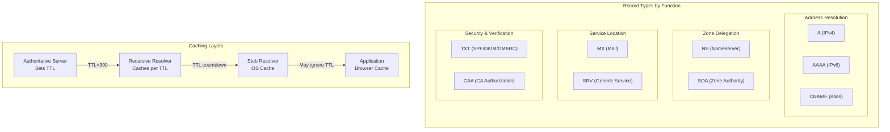

# DNS Records, TTL Strategy, and Cache Behavior

DNS records encode more than addresses—they define routing policies, ownership verification, security constraints, and service discovery. TTL (Time To Live) values control how long resolvers cache these records, creating a fundamental trade-off between propagation speed and query load. This article covers record types in depth, TTL design decisions for different operational scenarios, and the caching behaviors that determine how quickly DNS changes take effect.

<figure>



<figcaption>DNS record types grouped by function, and the caching layers that determine propagation timing.</figcaption>
</figure>

## Abstract

DNS records fall into four functional categories: address resolution (A, AAAA, CNAME), zone delegation (NS, SOA), service location (MX, SRV), and security/verification (TXT, CAA). Each type has specific constraints—CNAME cannot coexist with other records at the same name, MX targets must be A/AAAA records (never CNAMEs), and SOA's MINIMUM field controls negative caching duration.

TTL strategy depends on the operational scenario:

- **Static infrastructure**: 3600-86400s (1-24 hours) reduces resolver load
- **CDN/anycast**: 300s or less enables rapid failover
- **Migrations**: Lower TTL 24-48 hours before the change, wait for old TTL to expire, then make the change

"DNS propagation" is a misnomer—there is no active push mechanism. Changes take effect as cached records expire across resolver layers. The effective propagation time equals the maximum of: the old record's remaining TTL, negative cache TTL (SOA MINIMUM), and any resolver TTL floors that ignore authoritative values.

## Address Resolution Records

### A and AAAA Records

The A record (RFC 1035) maps a hostname to a 32-bit IPv4 address. The AAAA record (RFC 3596) maps to a 128-bit IPv6 address—the name "quad-A" reflects the fourfold size increase.

**Key behaviors:**

- Multiple A/AAAA records for the same name enable round-robin load distribution
- Records cannot point to other hostnames; they contain literal IP addresses
- The query transport protocol is independent of record type—you can query AAAA records over IPv4

**Design decision—why separate record types?** IPv6 addresses are four times larger than IPv4. Rather than overloading the A record with a variable-length format, RFC 3596 introduced a distinct type. This simplifies parsing and allows resolvers to query specifically for the address family they need.

```dns title="Multiple A records for load distribution"
api.example.com.    300    IN    A    192.0.2.10
api.example.com.    300    IN    A    192.0.2.11
api.example.com.    300    IN    A    192.0.2.12
```

Per RFC 2181, all records in an RRSet (Resource Record Set) must have identical TTLs. If a resolver receives differing TTLs for the same name and type, it must treat this as an error and use the lowest value.

### CNAME Records

A CNAME (Canonical Name) record declares that one name is an alias for another. Per RFC 1034 Section 3.6.2: "If a CNAME RR is present at a node, no other data should be present."

**The zone apex restriction:** CNAME cannot exist at the zone apex (e.g., `example.com`) because:

1. Every zone apex must have SOA and NS records (RFC 1034 Section 4.2.1)
2. CNAME cannot coexist with any other record type
3. Therefore, placing CNAME at apex violates the protocol

**Why this constraint exists:** When a resolver encounters a CNAME, it restarts the query using the target name. If other records existed at the same name, the resolver couldn't determine whether to follow the CNAME or return the other records. The exclusivity rule eliminates this ambiguity.

**Workarounds for apex aliasing:**

| Solution | Mechanism | Trade-off |
|----------|-----------|-----------|
| **ALIAS/ANAME** | Provider resolves CNAME server-side, returns synthesized A/AAAA | Geo-routing based on server location, not client |
| **CNAME flattening** | Same as ALIAS, Cloudflare terminology | Adds latency to authoritative responses |
| **Multiple A records** | Manually replicate target's IPs | Must update when target changes |

Cloudflare's CNAME flattening and Route 53's Alias records work by resolving the CNAME chain at query time and returning the resulting A/AAAA records directly. The limitation: location-dependent responses (GeoDNS) will be based on the authoritative server's location, not the end user's resolver.

### PTR Records

PTR (Pointer) records provide reverse DNS—mapping IP addresses to hostnames. The address is encoded in reverse order under a special domain:

- IPv4: `192.0.2.5` → `5.2.0.192.in-addr.arpa`
- IPv6: Uses `ip6.arpa` with nibbles (4-bit values) reversed

**Why reverse order?** DNS is hierarchical from right to left (`com` → `example` → `api`). IP addresses are hierarchical from left to right (network → host). Reversing the IP aligns with DNS delegation—the `/8` network owner controls `192.in-addr.arpa` and can delegate `/16` blocks.

**Operational impact:** Many mail servers reject connections from IPs without valid PTR records or where forward and reverse DNS don't match. Cloud providers typically manage PTR records for their IP ranges; you must request updates through their interface.

## Zone Delegation Records

### NS Records

NS (Name Server) records identify the authoritative DNS servers for a zone. They serve two distinct purposes:

1. **At zone apex:** Declare which servers are authoritative for this zone
2. **At delegation points:** Direct resolvers to child zone nameservers

**The delegation distinction:** NS records in the parent zone (e.g., `.com` zone containing `example.com NS`) are not authoritative—they're "delegation hints." The authoritative NS records are those served by the zone's own nameservers.

**Glue records** solve a circular dependency: if `ns1.example.com` is the nameserver for `example.com`, you'd need to resolve `example.com` to find `ns1.example.com`. Glue records—A/AAAA records embedded in the parent zone's delegation—break this cycle.

Per RFC 9471, glue is required when nameservers are "in-bailiwick" (within or below the delegated zone). The IP addresses in glue must match the authoritative A/AAAA records for those nameservers.

```dns title="Delegation with glue records in parent zone"
; In the .com zone (parent)
example.com.        172800  IN  NS  ns1.example.com.
example.com.        172800  IN  NS  ns2.example.com.
ns1.example.com.    172800  IN  A   192.0.2.1
ns2.example.com.    172800  IN  A   192.0.2.2
```

### SOA Records

Every DNS zone must have exactly one SOA (Start of Authority) record at the zone apex. It contains zone metadata critical for replication and caching:

| Field | Purpose | Recommended Value |
|-------|---------|-------------------|
| MNAME | Primary nameserver hostname | Your primary NS |
| RNAME | Responsible person email (`@` → `.`) | `hostmaster.example.com.` |
| Serial | Zone version (must increment on change) | `YYYYMMDDnn` format |
| Refresh | Secondary check interval | 7200-86400s (2-24h) |
| Retry | Retry after failed refresh | 1800-3600s (30m-1h) |
| Expire | Stop serving if no refresh | 1209600-2419200s (14-28d) |
| Minimum | **Negative caching TTL** | 3600s (1h) |

**The MINIMUM field evolution:** Originally (RFC 1035), this specified the minimum TTL for all records in the zone. RFC 2308 redefined it exclusively for negative caching—the TTL for NXDOMAIN and NODATA responses. The field name is now misleading, but changing it would break compatibility.

```dns title="SOA record example"
example.com.  86400  IN  SOA  ns1.example.com. hostmaster.example.com. (
                          2024011501  ; Serial
                          7200        ; Refresh (2 hours)
                          3600        ; Retry (1 hour)
                          1209600     ; Expire (14 days)
                          3600        ; Minimum (negative cache TTL)
                          )
```

## Service Location Records

### MX Records

MX (Mail Exchange) records direct email delivery. The format includes a preference value:

```dns
example.com.    300    IN    MX    10    mail1.example.com.
example.com.    300    IN    MX    20    mail2.example.com.
```

**Priority semantics:** Lower preference values indicate higher priority. When multiple servers share the same preference, RFC 5321 requires the sending server to randomize selection for load distribution.

**Fallback behavior:** If a domain has no MX records, RFC 5321 specifies an implicit MX of preference 0 pointing to the domain itself (the A/AAAA records). However, if MX records exist, the domain's A/AAAA records must not be used for mail delivery.

**Critical constraint:** MX targets must resolve to A/AAAA records, never CNAMEs. Per RFC 2181 and RFC 5321, an MX pointing to a CNAME is invalid. Some implementations follow the CNAME anyway, but this behavior is non-standard and unreliable.

### SRV Records

SRV (Service) records generalize service discovery beyond email. RFC 2782 defines the format:

```dns
_sip._tcp.example.com.  300  IN  SRV  10 60 5060 sipserver.example.com.
;                                     ^  ^  ^    ^
;                                     |  |  |    +-- Target
;                                     |  |  +------- Port
;                                     |  +---------- Weight
;                                     +------------- Priority
```

**The underscore prefix:** Service and protocol labels start with `_` to avoid collisions with natural DNS labels. This was a design choice to keep SRV in the same namespace as other records.

**Weight-based load balancing:** Among servers with equal priority, weight determines selection probability. A server with weight 60 receives three times the traffic of weight 20. Weight 0 indicates a backup server—use only when all higher-weight servers are unavailable.

**Common uses:**

- Microsoft Active Directory (domain controller discovery)
- SIP/VoIP (`_sip._tcp`, `_sip._udp`)
- XMPP/Jabber (`_xmpp-client._tcp`)
- CalDAV/CardDAV (`_caldavs._tcp`, `_carddavs._tcp`)

**Target constraint:** Like MX, SRV targets must be A/AAAA records. A target of `.` (root) explicitly indicates the service is not available at this domain.

## Security and Verification Records

### TXT Records

TXT records store arbitrary text, originally intended for human-readable information. Today they're primarily used for machine-readable verification and policy:

**Size constraints:**

- Each string within a TXT record: 255 bytes maximum (RFC 1035)
- Multiple strings are concatenated without separators
- Total record size limited by DNS message size (512 bytes UDP, ~65KB with EDNS0)

```dns title="Multi-string TXT record"
example.com.  300  IN  TXT  "v=spf1 include:_spf.google.com " "include:amazonses.com -all"
```

The strings are concatenated to: `v=spf1 include:_spf.google.com include:amazonses.com -all`

**Email authentication records:**

| Record | Location | Purpose |
|--------|----------|---------|
| **SPF** (RFC 7208) | `example.com` | Authorized mail senders |
| **DKIM** (RFC 6376) | `selector._domainkey.example.com` | Public key for signature verification |
| **DMARC** (RFC 7489) | `_dmarc.example.com` | Policy for SPF/DKIM failures |

**SPF lookup limit:** SPF evaluation allows maximum 10 DNS lookups (including `include:`, `a:`, `mx:`, `redirect=`). Exceeding this limit causes a permanent error (`permerror`), potentially causing mail rejection. Flatten SPF records by replacing includes with direct IP ranges for high-volume domains.

**Domain verification:** Services like Google Workspace, Microsoft 365, and AWS SES use TXT records to verify domain ownership. The record typically contains a unique token: `google-site-verification=abc123...`

### CAA Records

CAA (Certification Authority Authorization) records specify which Certificate Authorities may issue certificates for a domain. RFC 8659 defines the format:

```dns title="CAA records restricting certificate issuance"
example.com.  300  IN  CAA  0  issue  "letsencrypt.org"
example.com.  300  IN  CAA  0  issuewild  "digicert.com"
example.com.  300  IN  CAA  0  iodef  "mailto:security@example.com"
```

**Property tags:**

- `issue`: CAs authorized to issue non-wildcard certificates
- `issuewild`: CAs authorized for wildcard certificates (if absent, `issue` applies)
- `iodef`: URL or email for violation reports

**CA/Browser Forum mandate:** Since September 2017, CAs must check CAA records before issuance. If CAA records exist and don't authorize the CA, issuance must fail.

**Inheritance:** CAA records at `example.com` apply to all subdomains unless overridden. To allow any CA for a subdomain while restricting the parent:

```dns
example.com.      300  IN  CAA  0  issue  "letsencrypt.org"
dev.example.com.  300  IN  CAA  0  issue  ";"  ; Allow any CA
```

The value `";"` explicitly permits any CA.

## TTL Strategy and Design Decisions

### TTL Mechanics

TTL is a 32-bit unsigned integer specifying how long a record may be cached, in seconds. Per RFC 1035: "TTL specifies the time interval that the resource record may be cached before the source of the information should again be consulted."

**Bounds (RFC 2181):**

- Minimum: 0 (use only for current transaction, do not cache)
- Maximum: 2147483647 (2³¹ - 1 seconds, ~68 years)
- Practical maximum: 604800 (7 days, per RFC 8767 recommendation)

**Zero TTL behavior:** The record may only be used for the transaction in progress and must not be cached. Use case: SOA records during zone transfers, or extremely volatile data like real-time load balancer targets.

### TTL by Scenario

| Scenario | Recommended TTL | Rationale |
|----------|-----------------|-----------|
| **Static infrastructure** | 3600-86400s | Reduces query load; changes are rare |
| **CDN/anycast endpoints** | 60-300s | Enables health-check-driven failover |
| **Active migrations** | 60-300s | Minimizes stale cache during cutover |
| **Development/testing** | 60s | Rapid iteration without cache delays |
| **NS records** | 86400-172800s | Nameserver changes are rare, high TTL reduces root/TLD load |

**CDN provider behavior:** Cloudflare automatically sets 300s TTL for proxied records (orange cloud) and doesn't allow customization. This ensures their anycast routing changes propagate within 5 minutes.

**Failover and health checks:** AWS Route 53 recommends 60s or less for health-checked records. Lower TTL means faster failover but higher query volume—a 60s TTL generates 1440 queries per day per caching resolver versus 24 queries for 3600s.

### Migration TTL Strategy

DNS migrations require careful TTL management to minimize both stale cache impact and query load:

**Pre-migration (24-48 hours before):**

1. Lower TTL to 300-600s on records that will change
2. Wait for the old TTL to expire everywhere
3. Verify TTL change propagated: `dig +norecurse @8.8.8.8 example.com`

**During migration:**

4. Make the DNS change
5. Verify new records are served by authoritative servers
6. Monitor for traffic shift (may take up to new TTL duration)

**Post-migration (after verification):**

7. Restore higher TTL for normal operation
8. Keep lower TTL for 24-48 hours if rollback might be needed

**NS record migrations are special:** NS records often have 172800s (48h) TTL. You must lower TTL at both old and new DNS providers. Plan for 2-3 days minimum migration window.

```dns title="TTL lowering sequence for migration"
; Step 1: Lower TTL (wait 24h if original was 86400s)
api.example.com.    300    IN    A    192.0.2.10

; Step 2: After old TTL expires, change the record
api.example.com.    300    IN    A    198.51.100.20

; Step 3: After verification, restore normal TTL
api.example.com.    3600   IN    A    198.51.100.20
```

## Caching Behavior and Propagation

### Caching Layers

DNS responses pass through multiple caching layers, each with distinct behavior:

| Layer | Typical Cache Duration | Behavior |
|-------|------------------------|----------|
| **Authoritative** | N/A (source of truth) | Sets TTL in responses |
| **Recursive resolver** | Honors TTL | Decrements cached TTL; prefetches popular records |
| **OS stub resolver** | Seconds to minutes | Platform-dependent; may have minimum TTL floor |
| **Browser** | 1-60 minutes | Chrome: 1 minute; Firefox: respects TTL; Safari: varies |
| **Application** | Varies | Some HTTP clients cache DNS independently |

**Resolver TTL floors:** Some resolvers enforce minimum TTLs regardless of authoritative values. ISP resolvers may cache for longer than specified. Google Public DNS (8.8.8.8) generally respects TTLs but may serve stale data during authoritative outages (RFC 8767 serve-stale).

### Negative Caching

When a name doesn't exist (NXDOMAIN) or exists but has no records of the requested type (NODATA), resolvers cache this negative result. RFC 2308 specifies:

**Negative cache TTL = min(SOA.MINIMUM, SOA TTL)**

Authoritative servers must include the SOA record in the Authority section of negative responses. Without SOA, the response should not be cached—this prevents infinite negative caching loops.

**Operational impact:** If you delete a DNS record, resolvers may cache the NXDOMAIN response for up to SOA.MINIMUM seconds. Before deleting, consider:

1. Check your SOA.MINIMUM value
2. Lower it temporarily if the default is high
3. Or change the record to point elsewhere rather than deleting

```dns title="SOA MINIMUM affects negative caching"
; If SOA.MINIMUM is 3600 (1 hour):
; Deleting api.example.com means NXDOMAIN cached for up to 1 hour
; Resolver won't re-query until negative cache expires
```

### The "Propagation" Reality

"DNS propagation" suggests an active push mechanism—it doesn't exist. DNS changes take effect passively as caches expire.

What people mean by "propagation time":

1. **Maximum of all cache TTLs**: The old record's remaining TTL across all resolver caches
2. **Negative cache duration**: If the name was queried before creation (NXDOMAIN cached)
3. **Resolver refresh behavior**: Some resolvers batch updates or have minimum TTL floors

**Why changes seem slow:**

- You lowered TTL to 300s, but the old 86400s TTL hasn't expired everywhere
- ISP resolver ignores TTL and caches for 24 hours regardless
- Browser DNS cache retains old entry independent of system resolver
- Application-level DNS caching (Java, .NET) with separate TTL handling

**Verification approach:**

```bash
# Query authoritative server directly
dig @ns1.example.com api.example.com

# Check what recursive resolver has cached
dig +norecurse @8.8.8.8 api.example.com

# If +norecurse returns nothing, force a fresh lookup
dig @8.8.8.8 api.example.com
```

## Split-Horizon DNS

Split-horizon (split-brain) DNS returns different responses based on query source—typically internal vs. external networks.

### Use Cases

1. **Internal services**: `api.internal.example.com` resolves to `10.0.1.50` internally, NXDOMAIN externally
2. **Security**: Hide internal infrastructure from external reconnaissance
3. **Performance**: Internal clients reach services via private network, not hairpinning through public IPs
4. **Compliance**: Prevent internal DNS information from leaking externally

### Implementation Approaches

**Separate servers:**

```
                    ┌─────────────────┐
    Internal DNS ───│ 10.0.0.53       │─── Internal zone files
                    └─────────────────┘

                    ┌─────────────────┐
    External DNS ───│ 203.0.113.53    │─── External zone files
                    └─────────────────┘
```

**DNS views (BIND):**

```bind title="BIND split-horizon configuration" collapse={1-2, 15-20}
acl "internal" { 10.0.0.0/8; 172.16.0.0/12; 192.168.0.0/16; };

view "internal" {
    match-clients { internal; };
    zone "example.com" {
        type master;
        file "zones/example.com.internal";
    };
};

view "external" {
    match-clients { any; };
    zone "example.com" {
        type master;
        file "zones/example.com.external";
    };
};
```

### Operational Pitfalls

**Record drift:** Internal and external zone files can diverge. Automate zone generation from a single source of truth, or use infrastructure-as-code (Terraform, Pulumi) to manage both.

**VPN transitions:** A laptop connecting to VPN may have cached external IPs. Symptoms: internal services unreachable until DNS cache expires. Mitigation: shorter TTLs (300s) for records that differ between views.

**Debugging complexity:** "It works on my machine" gains a new dimension when DNS responses vary by network. Document which records differ and include source IP in troubleshooting procedures.

**DNSSEC challenges:** Each view must maintain consistent signatures. Zone signing must happen separately for each view's zone file, complicating key management.

## Operational Checklists

### Record Change Checklist

- [ ] Verify current TTL: `dig +noall +answer example.com`
- [ ] If TTL > 300s and change is time-sensitive, lower TTL and wait
- [ ] Make change on authoritative servers
- [ ] Verify authoritative response: `dig @ns1.example.com example.com`
- [ ] Verify recursive resolver sees change: `dig @8.8.8.8 example.com`
- [ ] For critical changes, check multiple public resolvers (8.8.8.8, 1.1.1.1, 9.9.9.9)
- [ ] Restore normal TTL after verification period

### New Domain Setup Checklist

- [ ] NS records delegated at registrar (match authoritative NS records)
- [ ] Glue records present if nameservers are in-bailiwick
- [ ] SOA record with appropriate MINIMUM for negative caching (typically 3600s)
- [ ] A/AAAA records for web traffic
- [ ] MX records pointing to A/AAAA targets (not CNAMEs)
- [ ] SPF TXT record for email authentication
- [ ] DKIM TXT record(s) for each email provider
- [ ] DMARC TXT record with policy
- [ ] CAA records restricting certificate issuance

### Migration Checklist

- [ ] Document current records: `dig +noall +answer example.com ANY`
- [ ] Lower TTL to 300s on changing records
- [ ] Wait for old TTL duration (check: `dig +norecurse @8.8.8.8`)
- [ ] For NS changes: lower TTL at both old and new providers
- [ ] Make DNS changes
- [ ] Verify from multiple locations/resolvers
- [ ] Monitor for traffic shift and errors
- [ ] Keep rollback option for 24-48 hours
- [ ] Restore normal TTLs after stabilization

## Conclusion

DNS record types encode specific semantics—A/AAAA for addresses, CNAME for aliases (with zone apex restrictions), NS/SOA for delegation, MX/SRV for service discovery, and TXT/CAA for verification and security policy. Each type has constraints that reflect protocol design decisions: CNAME exclusivity prevents ambiguity, MX/SRV targets must be A/AAAA to avoid resolution loops, and SOA.MINIMUM controls negative caching duration.

TTL strategy is a trade-off between cache efficiency and change velocity. Static infrastructure benefits from high TTLs (3600-86400s) that reduce resolver load. Failover scenarios require low TTLs (60-300s) to enable rapid traffic shifts. Migrations demand TTL lowering before the change, waiting for old caches to expire, then executing the change.

"DNS propagation" is cache expiry, not active distribution. Changes take effect as cached records reach TTL zero across the resolver hierarchy. When changes seem stuck, check: authoritative servers are returning new data, recursive resolvers have refreshed their cache, and client-side caches (OS, browser, application) have expired.

## Appendix

### Prerequisites

- DNS resolution fundamentals (see [DNS Resolution Path](/articles/web-foundations/networking-protocols/dns-resolution-path))
- Basic understanding of IP addressing (IPv4/IPv6)
- Familiarity with command-line DNS tools (`dig`, `nslookup`)

### Terminology

| Term | Definition |
|------|------------|
| **RRSet** | Resource Record Set—all records of the same name and type |
| **Zone apex** | The root of a DNS zone (e.g., `example.com` for the example.com zone) |
| **Glue record** | A/AAAA record in parent zone for in-bailiwick nameservers |
| **In-bailiwick** | Nameserver hostname within or below the delegated zone |
| **Negative caching** | Caching of NXDOMAIN/NODATA responses per SOA.MINIMUM |
| **Split-horizon** | Returning different DNS responses based on query source |
| **EDNS0** | Extension Mechanisms for DNS; enables larger UDP responses |

### Summary

- **A/AAAA** map hostnames to IPv4/IPv6 addresses; multiple records enable round-robin
- **CNAME** creates aliases but cannot coexist with other records; forbidden at zone apex
- **NS** records delegate zones; glue records break circular dependencies for in-bailiwick nameservers
- **SOA.MINIMUM** controls negative caching duration—check before deleting records
- **MX/SRV** targets must be A/AAAA, never CNAMEs; lower preference = higher priority
- **TXT** records support SPF, DKIM, DMARC; SPF has 10-lookup limit
- **CAA** restricts certificate issuance; mandatory CA check since September 2017
- **TTL strategy**: High for static (3600-86400s), low for failover (60-300s), temporarily low for migrations
- **Propagation = cache expiry**; lower TTL before changes, wait for old TTL to expire

### References

- [RFC 1035 - Domain Names: Implementation and Specification](https://www.rfc-editor.org/rfc/rfc1035) - Core record types, TTL definition
- [RFC 1034 - Domain Names: Concepts and Facilities](https://www.rfc-editor.org/rfc/rfc1034) - CNAME semantics, zone structure
- [RFC 2181 - Clarifications to the DNS Specification](https://datatracker.ietf.org/doc/html/rfc2181) - TTL bounds, RRSet consistency
- [RFC 2308 - Negative Caching of DNS Queries](https://datatracker.ietf.org/doc/html/rfc2308) - NXDOMAIN/NODATA caching, SOA.MINIMUM redefinition
- [RFC 1912 - Common DNS Operational and Configuration Errors](https://www.rfc-editor.org/rfc/rfc1912) - Best practices, SOA values
- [RFC 3596 - DNS Extensions to Support IP Version 6](https://datatracker.ietf.org/doc/html/rfc3596) - AAAA records
- [RFC 2782 - A DNS RR for specifying the location of services (SRV)](https://datatracker.ietf.org/doc/html/rfc2782) - SRV record format and semantics
- [RFC 5321 - Simple Mail Transfer Protocol](https://datatracker.ietf.org/doc/html/rfc5321) - MX record usage, implicit MX
- [RFC 8659 - DNS Certification Authority Authorization (CAA)](https://www.rfc-editor.org/rfc/rfc8659.html) - CAA record specification
- [RFC 9471 - DNS Glue Requirements in Referral Responses](https://datatracker.ietf.org/doc/rfc9471/) - Glue record requirements
- [RFC 7208 - Sender Policy Framework (SPF)](https://datatracker.ietf.org/doc/html/rfc7208) - SPF TXT record format
- [RFC 6376 - DomainKeys Identified Mail (DKIM)](https://datatracker.ietf.org/doc/html/rfc6376) - DKIM TXT record format
- [RFC 7489 - Domain-based Message Authentication, Reporting, and Conformance (DMARC)](https://datatracker.ietf.org/doc/html/rfc7489) - DMARC policy
- [RFC 8767 - Serving Stale Data to Improve DNS Resiliency](https://datatracker.ietf.org/doc/html/rfc8767) - Stale serving, TTL cap recommendation
- [Cloudflare - CNAME Flattening](https://blog.cloudflare.com/introducing-cname-flattening-rfc-compliant-cnames-at-a-domains-root/) - Zone apex CNAME workaround
- [AWS Route 53 Best Practices](https://docs.aws.amazon.com/Route53/latest/DeveloperGuide/best-practices-dns.html) - TTL recommendations for failover
- [Julia Evans - DNS doesn't propagate](https://jvns.ca/blog/2021/12/06/dns-doesn-t-propagate/) - Propagation misconceptions explained
