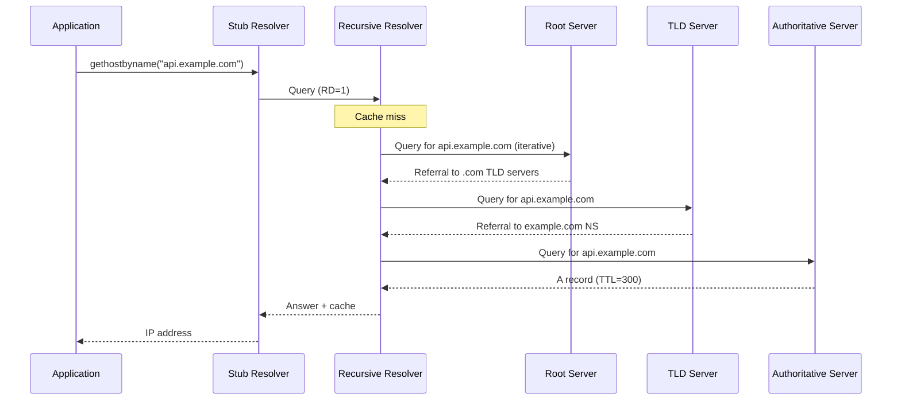

# DNS Resolution Path: Stub to Recursive to Authoritative

A DNS query traverses multiple actors before returning an answer: stub resolver, recursive resolver, and a chain of authoritative servers (root, TLD, domain). Each hop introduces latency, caching decisions, and potential failure modes. Understanding this path is essential for diagnosing resolution delays, debugging SERVFAIL responses, and architecting systems that depend on DNS availability.

<figure>



<figcaption>End-to-end DNS resolution flow showing iterative queries from recursive resolver to authoritative chain.</figcaption>
</figure>

## Abstract

DNS resolution is a hierarchical delegation system. The stub resolver on your machine forwards queries to a recursive resolver, which iteratively walks the namespace tree—root servers delegate to TLD servers, which delegate to authoritative servers for the target domain. Each response is cached according to its TTL (Time To Live), and subsequent queries for the same name hit cache until expiry.

Key mental model:

- **Stub**: Forwards queries, minimal caching, sets RD (Recursion Desired) flag
- **Recursive**: Performs iterative resolution, maintains authoritative cache, enforces TTLs
- **Authoritative**: Holds zone data, returns definitive answers or referrals
- **Caching**: Dominates real-world latency; a cached response returns in <1ms, uncached may take 100-400ms
- **Failure modes**: NXDOMAIN (domain doesn't exist), SERVFAIL (upstream failure), REFUSED (policy rejection), timeouts (network/server issues)

## DNS Actors and Their Roles

### Stub Resolver

The stub resolver is the DNS client library on your machine—`gethostbyname()`, `getaddrinfo()`, or the resolver in `/etc/resolv.conf`. Per RFC 1034 Section 5.3.1, a stub resolver "cannot perform full resolution itself; it depends on a recursive resolver."

**Behavior:**

- Sets the RD (Recursion Desired) flag in outgoing queries
- Forwards queries to configured recursive resolvers (typically 1-3 servers)
- Validates that RA (Recursion Available) is set in responses
- Maintains minimal cache (OS-dependent, typically seconds to minutes)

**Timeout behavior varies by platform:**

| Platform      | Default Timeout | Retries | Notes                                               |
| ------------- | --------------- | ------- | --------------------------------------------------- |
| Linux (glibc) | 5 seconds       | 2       | Configurable via `options timeout:N` in resolv.conf |
| macOS         | 5 seconds       | 2       | mDNSResponder adds complexity                       |
| Windows       | 1 second        | 2       | Per-server, then cycles                             |

The stub resolver is intentionally simple. It offloads complexity to the recursive resolver, which has the resources to cache, validate DNSSEC, and handle iterative resolution.

### Recursive Resolver

The recursive resolver (also called a full-service resolver or caching resolver) performs the actual work of walking the DNS tree. Per RFC 9499: "A server operating in recursive mode receives DNS queries and either responds from local cache or sends queries to other servers to get final answers."

**Key characteristics:**

- Maintains a cache of previously resolved records
- Performs iterative queries to authoritative servers
- Enforces TTLs and negative caching
- May validate DNSSEC signatures
- Implements rate limiting, prefetching, and serve-stale policies

**Design decision—why iterative, not recursive all the way down?**

RFC 1034 specifies that recursive resolvers use iterative queries to authoritative servers. The recursive resolver asks "where should I go next?" and follows referrals itself, rather than asking each server to do the full resolution. This design:

- **Optimizes caching**: The recursive resolver sees all intermediate referrals and caches them
- **Limits trust**: Authoritative servers only answer for their zones, not arbitrary queries
- **Reduces load on authoritative servers**: They don't need to implement recursive logic

Popular recursive resolvers include BIND, Unbound, PowerDNS Recursor, and public services like Google Public DNS (8.8.8.8), Cloudflare (1.1.1.1), and Quad9 (9.9.9.9).

### Authoritative Servers

Authoritative servers hold the definitive DNS records for zones they serve. They respond to queries with either:

1. **Authoritative answer**: AA (Authoritative Answer) flag set, contains the requested record
2. **Referral**: NS records pointing to child zone nameservers (for delegated subdomains)
3. **Negative response**: NXDOMAIN or NODATA, with SOA record in Authority section for negative caching

**The authoritative hierarchy:**

```
. (root)
├── com. (TLD)
│   └── example.com. (domain)
│       └── api.example.com. (subdomain)
└── org. (TLD)
    └── example.org.
```

Each level delegates to the next. Root servers know TLD servers; TLD servers know domain nameservers; domain nameservers know their subdomains.

**Root servers** are the entry point when the recursive resolver has no cached data. There are 13 logical root servers (A through M), operated by 12 independent organizations. As of 2024, over 1,700 physical instances exist worldwide, all using anycast for geographic distribution.

**TLD servers** handle generic TLDs (.com, .org, .net) and country-code TLDs (.uk, .de, .jp). They return referrals to the authoritative nameservers for second-level domains.

## Iterative Resolution: Step by Step

When a recursive resolver receives a query for `api.example.com` with an empty cache, it performs iterative resolution:

### Step 1: Root Priming

Before the first query, the resolver loads root hints—a file containing the names and IP addresses of root servers. RFC 9609 specifies the priming process:

1. Resolver sends: `QNAME=".", QTYPE=NS` to a randomly selected root server address
2. Root server responds with authoritative NS records for the root zone
3. Resolver caches these records, replacing the hints

This priming query ensures the resolver has accurate root server data, not stale hints.

### Step 2: Query the Root

```
Query:  api.example.com. IN A
From:   Recursive resolver
To:     Root server (e.g., 198.41.0.4, A-root)

Response:
  Header: RCODE=NOERROR, AA=0 (not authoritative for this name)
  Authority section:
    com.  172800  IN  NS  a.gtld-servers.net.
    com.  172800  IN  NS  b.gtld-servers.net.
    ...
  Additional section:
    a.gtld-servers.net.  172800  IN  A  192.5.6.30
    ...
```

The root server returns a referral—NS records for the `.com` TLD along with glue records (A/AAAA records for the nameservers themselves).

**Why glue records?** If `a.gtld-servers.net` is the nameserver for `.net`, you'd need to resolve `.net` to find `a.gtld-servers.net`, creating a circular dependency. Glue records break this cycle by embedding IP addresses directly in the referral.

### Step 3: Query the TLD

```
Query:  api.example.com. IN A
From:   Recursive resolver
To:     a.gtld-servers.net (192.5.6.30)

Response:
  Header: RCODE=NOERROR, AA=0
  Authority section:
    example.com.  172800  IN  NS  ns1.example.com.
    example.com.  172800  IN  NS  ns2.example.com.
  Additional section:
    ns1.example.com.  172800  IN  A  93.184.216.34
    ...
```

The TLD server returns another referral, pointing to the authoritative nameservers for `example.com`.

### Step 4: Query the Authoritative Server

```
Query:  api.example.com. IN A
From:   Recursive resolver
To:     ns1.example.com (93.184.216.34)

Response:
  Header: RCODE=NOERROR, AA=1 (authoritative)
  Answer section:
    api.example.com.  300  IN  A  93.184.216.50
```

The authoritative server returns the final answer with the AA flag set. The recursive resolver caches this record for 300 seconds (the TTL) and returns it to the stub resolver.

### Resolution Latency Breakdown

| Hop                       | Typical Latency | Notes                           |
| ------------------------- | --------------- | ------------------------------- |
| Stub → Recursive          | 1-50ms          | LAN or ISP network              |
| Cache lookup              | <1ms            | In-memory hash table            |
| Recursive → Root          | 10-30ms         | Anycast, well-distributed       |
| Recursive → TLD           | 10-50ms         | .com has many anycast instances |
| Recursive → Authoritative | 10-200ms        | Depends on server location      |
| **Total (uncached)**      | **50-400ms**    | Varies significantly            |
| **Total (cached)**        | **1-50ms**      | Cache hit at recursive          |

## Caching Layers and TTL Mechanics

### TTL Semantics

TTL (Time To Live) is a 32-bit unsigned integer specifying the maximum duration a record may be cached, in seconds. Per RFC 1035, TTL "specifies the time interval that the resource record may be cached before the source of the information should again be consulted."

**Key behaviors:**

- **Zero TTL**: Use only for the current transaction; do not cache
- **TTL countdown**: Cached records decrement TTL; at zero, the entry expires
- **TTL cap**: RFC 8767 recommends capping at 604,800 seconds (7 days) to limit stale data risk

**TTL at each layer:**

| Layer         | Behavior                                        | Typical Values             |
| ------------- | ----------------------------------------------- | -------------------------- |
| Authoritative | Sets TTL in zone file; value is constant        | 300-86400 seconds          |
| Recursive     | Caches with countdown; honors TTL from response | Respects authoritative TTL |
| Stub          | Minimal caching, OS-dependent                   | Seconds to minutes         |

### Negative Caching

Negative responses (NXDOMAIN, NODATA) are cached to reduce load on authoritative servers. RFC 2308 specifies that the negative cache TTL is:

```
Negative TTL = min(SOA.MINIMUM, SOA TTL)
```

Authoritative servers MUST include the SOA record in the Authority section of negative responses. Without it, the negative response SHOULD NOT be cached.

**Historical note:** The SOA MINIMUM field originally specified the minimum TTL for all zone records. RFC 2308 repurposed it specifically for negative caching.

### Resolution Failure Caching

RFC 9520 (December 2023) introduces mandatory caching of resolution failures—situations where no useful response was received (timeouts, SERVFAIL from all servers). This prevents "query storms" where failed authoritative servers receive 10x normal load from retrying resolvers.

**Distinction:**

- **NXDOMAIN/NODATA**: Not failures—the server provided a useful (negative) answer
- **Resolution failure**: No useful response received; cache to prevent retry floods

### Prefetching

Modern resolvers prefetch records before TTL expiry to eliminate cache-miss latency for popular domains:

| Resolver | Trigger Condition             | Eligibility              |
| -------- | ----------------------------- | ------------------------ |
| BIND     | 2 seconds remaining TTL       | Original TTL > 9 seconds |
| Unbound  | 10% of original TTL remaining | All records              |
| PowerDNS | Configurable percentage       | Popular domains          |

### Serve-Stale (RFC 8767)

When an authoritative server is unreachable, resolvers MAY serve expired cache data rather than returning SERVFAIL:

- Stale response TTL: 30 seconds (recommended)
- Maximum stale timer: Configurable upper bound on how long past-TTL data is served
- Resolver continues refresh attempts in background

This improves resilience during authoritative outages at the cost of potentially serving outdated data.

## Failure Modes and Response Codes

### RCODE Values

DNS responses include a 4-bit RCODE (Response Code) field. The primary values from RFC 1035:

| RCODE | Name     | Meaning                                           |
| ----- | -------- | ------------------------------------------------- |
| 0     | NOERROR  | Query succeeded (may or may not have answer data) |
| 1     | FORMERR  | Server couldn't parse the query                   |
| 2     | SERVFAIL | Server failed to complete the query               |
| 3     | NXDOMAIN | Domain does not exist                             |
| 4     | NOTIMP   | Query type not implemented                        |
| 5     | REFUSED  | Server refuses to answer (policy)                 |

### When Each Failure Occurs

**NXDOMAIN (Non-Existent Domain)**

The queried name does not exist anywhere in DNS. The authoritative server for the parent zone confirms non-existence.

```bash
$ dig nonexistent.example.com
;; ->>HEADER<<- opcode: QUERY, status: NXDOMAIN
```

RFC 8020 clarifies NXDOMAIN behavior: if a resolver receives NXDOMAIN for `foo.example.com`, it MAY assume that `bar.foo.example.com` also doesn't exist (NXDOMAIN cut), reducing unnecessary queries.

**SERVFAIL (Server Failure)**

The recursive resolver couldn't complete resolution. Common causes:

- All authoritative servers timed out
- DNSSEC validation failed
- Lame delegation (NS records point to servers that don't serve the zone)
- Upstream server returned malformed response

SERVFAIL is the catch-all for "something went wrong." Debugging requires checking resolver logs.

**REFUSED**

The server refuses to answer based on policy:

- Query from unauthorized IP (ACL restriction)
- Rate limiting triggered
- Recursive query to authoritative-only server

**Timeout (no response)**

No RCODE—the query never received a response. Causes:

- Network connectivity issues
- Firewall blocking UDP/53 or TCP/53
- Server overloaded or crashed
- Anycast routing issues

### Timeout and Retry Behavior

RFC 1035 leaves retry logic to implementations. Typical patterns:

1. Send query to first configured server
2. Wait timeout period (1-5 seconds)
3. No response → try next server
4. Cycle through all servers
5. End of cycle → double timeout (exponential backoff)
6. Maximum retries (typically 2-4)

**Early termination:** Any NXDOMAIN response stops retries—it's a definitive negative answer.

## Latency Bottlenecks and Mitigation

### Where Latency Hides

1. **Cache misses**: Dominant factor. Cold cache resolution takes 100-400ms; cached response <1ms
2. **Geographic distance**: Authoritative servers on another continent add 100-200ms RTT
3. **Packet loss**: Triggers retries with exponential backoff; one lost packet can add seconds
4. **Lame delegations**: NS records pointing to non-responsive servers waste query attempts
5. **DNSSEC validation**: Additional queries for DNSKEY and DS records

### Anycast

All root servers and most major TLD/public resolvers use anycast—multiple servers share a single IP address, and BGP routes queries to the topologically nearest instance.

**Benefits:**

- Reduces RTT by routing to nearby instances
- Distributes DDoS traffic across instances
- Improves availability (instance failure → traffic reroutes)

**Caveat:** "Nearest" means fewest network hops, not geographic distance. A query from Tokyo might route to a Singapore instance even if there's one in Tokyo, depending on BGP policies.

### Mitigation Strategies

| Strategy                           | Mechanism                          | Trade-off                     |
| ---------------------------------- | ---------------------------------- | ----------------------------- |
| **Aggressive caching**             | Longer TTLs                        | Slower propagation of changes |
| **Prefetching**                    | Refresh before expiry              | Additional background queries |
| **Serve-stale**                    | Return expired data during outages | Risk of stale data            |
| **Multiple authoritative servers** | Geographic distribution            | Operational complexity        |
| **Low TTL during migrations**      | 60-300 seconds temporarily         | Higher authoritative load     |

### Browser DNS Prefetching

Browsers speculatively resolve hostnames found in page links:

- Reduces perceived latency by parallelizing DNS with page load
- Disabled by default on HTTPS pages (privacy concern)
- Controlled via `X-DNS-Prefetch-Control` header or `<link rel="dns-prefetch">`

## Diagnostics with dig and drill

### Basic Query

```bash
$ dig api.example.com

; <<>> DiG 9.18.18 <<>> api.example.com
;; ->>HEADER<<- opcode: QUERY, status: NOERROR, id: 12345
;; flags: qr rd ra; QUERY: 1, ANSWER: 1, AUTHORITY: 0, ADDITIONAL: 1

;; ANSWER SECTION:
api.example.com.    300    IN    A    93.184.216.50

;; Query time: 23 msec
;; SERVER: 8.8.8.8#53(8.8.8.8)
```

Key fields:

- `status: NOERROR` — Query succeeded
- `flags: qr rd ra` — Query Response, Recursion Desired, Recursion Available
- `Query time: 23 msec` — Round-trip to recursive resolver

### Trace Mode

```bash
$ dig +trace api.example.com
```

Trace mode bypasses the recursive resolver and performs iterative resolution directly, showing each hop:

```
.                       518400  IN  NS  a.root-servers.net.
...
com.                    172800  IN  NS  a.gtld-servers.net.
...
example.com.            172800  IN  NS  ns1.example.com.
...
api.example.com.        300     IN  A   93.184.216.50
```

This reveals which server returned each referral and helps identify where resolution stalls.

### Check Specific Server

```bash
$ dig @ns1.example.com api.example.com
```

Query a specific nameserver directly. Useful for verifying authoritative server configuration or comparing responses across replicas.

### Inspect TTL and Caching

```bash
$ dig +norecurse @8.8.8.8 api.example.com
```

The `+norecurse` flag asks the resolver to return only cached data. If the record isn't cached, you'll get a referral or empty response.

### DNSSEC Validation

```bash
$ dig +dnssec example.com
```

Requests DNSSEC records (RRSIG, DNSKEY) in the response. Check the `ad` (Authenticated Data) flag in the response header—if set, the resolver validated the DNSSEC chain.

## Modern DNS: Encryption and Security

### DNS over HTTPS (DoH) — RFC 8484

DoH encapsulates DNS queries in HTTPS, providing:

- **Confidentiality**: TLS encrypts the query and response
- **Integrity**: TLS prevents tampering
- **Authentication**: Server certificate validates resolver identity

DoH uses the `application/dns-message` media type with standard DNS wire format. It integrates with HTTP caching—HTTP freshness lifetime MUST be ≤ smallest Answer TTL.

**Trade-offs:**

- Pro: Bypasses network-level DNS interception/filtering
- Con: Centralizes DNS at browser-configured resolver (often Cloudflare or Google)
- Con: Breaks enterprise DNS policies and split-horizon setups

### DNS over TLS (DoT) — RFC 7858

DoT runs DNS over TLS on port 853. Unlike DoH, it's a dedicated protocol, not tunneled through HTTP.

**Design decision:** RFC 7858 mandates port 853 for DoT and prohibits port 53. This separation reduces downgrade attack risk but makes DoT easier to block at the network level.

### DNSSEC — RFC 4033-4035

DNSSEC provides cryptographic authentication of DNS responses:

1. Zone operator signs records with private key
2. Signatures published as RRSIG records
3. Public key published as DNSKEY record
4. Parent zone publishes DS record (hash of child's DNSKEY)
5. Resolver follows chain of trust from root to target

**NSEC/NSEC3** provide authenticated denial—proof that a name doesn't exist, preventing attackers from forging NXDOMAIN responses.

**Adoption:** DNSSEC is widely deployed at TLDs but inconsistently at domain level. Validation failures result in SERVFAIL, which can break resolution for misconfigured zones.

## Conclusion

DNS resolution is deceptively simple on the surface—a name goes in, an IP comes out. The underlying system is a distributed, hierarchical database with caching at every layer. Performance depends on cache hit rates; reliability depends on redundant authoritative servers and proper delegation. When debugging DNS issues, trace the path: stub → recursive → root → TLD → authoritative. Check TTLs, verify RCODE, and use `+trace` to pinpoint where resolution fails.

## Appendix

### Prerequisites

- TCP/IP networking fundamentals
- Basic command-line familiarity (`dig`, `nslookup`)
- Understanding of client-server architecture

### Terminology

| Term                     | Definition                                                        |
| ------------------------ | ----------------------------------------------------------------- |
| **Stub resolver**        | DNS client library that forwards queries to a recursive resolver  |
| **Recursive resolver**   | Server that performs iterative resolution and maintains cache     |
| **Authoritative server** | Server that holds definitive records for a zone                   |
| **TTL**                  | Time To Live; seconds a record may be cached                      |
| **RCODE**                | Response Code; 4-bit field indicating query result                |
| **Glue record**          | A/AAAA record embedded in referral to break circular dependencies |
| **Anycast**              | Routing technique where multiple servers share one IP address     |
| **DNSSEC**               | DNS Security Extensions; cryptographic authentication of DNS data |
| **DoH**                  | DNS over HTTPS (RFC 8484)                                         |
| **DoT**                  | DNS over TLS (RFC 7858)                                           |

### Summary

- DNS resolution flows from stub → recursive → root → TLD → authoritative, following referrals down the namespace tree
- Caching at the recursive resolver dominates latency; TTLs control cache lifetime
- Negative responses (NXDOMAIN, NODATA) are cached using SOA.MINIMUM
- SERVFAIL indicates resolution failure; use `dig +trace` to identify the failing hop
- Modern DNS adds encryption (DoH, DoT) and authentication (DNSSEC)
- Anycast distributes load and reduces latency for root/TLD servers

### References

- [RFC 1034 - Domain Names: Concepts and Facilities](https://www.rfc-editor.org/rfc/rfc1034) - Foundational DNS architecture
- [RFC 1035 - Domain Names: Implementation and Specification](https://www.rfc-editor.org/rfc/rfc1035) - Wire format, message structure
- [RFC 9499 - DNS Terminology](https://datatracker.ietf.org/doc/rfc9499/) - Current terminology definitions (BCP 219)
- [RFC 2308 - Negative Caching of DNS Queries](https://datatracker.ietf.org/doc/html/rfc2308) - NXDOMAIN/NODATA caching
- [RFC 9520 - Negative Caching of DNS Resolution Failures](https://datatracker.ietf.org/doc/rfc9520/) - Failure caching (December 2023)
- [RFC 6891 - Extension Mechanisms for DNS (EDNS0)](https://datatracker.ietf.org/doc/html/rfc6891) - Larger UDP payloads, extended RCODE
- [RFC 8484 - DNS Queries over HTTPS (DoH)](https://datatracker.ietf.org/doc/html/rfc8484) - DoH specification
- [RFC 7858 - DNS over Transport Layer Security (DoT)](https://datatracker.ietf.org/doc/html/rfc7858) - DoT specification
- [RFC 4033 - DNSSEC Introduction and Requirements](https://datatracker.ietf.org/doc/html/rfc4033) - DNSSEC overview
- [RFC 4034 - DNSSEC Resource Records](https://www.rfc-editor.org/rfc/rfc4034.html) - DNSKEY, DS, RRSIG, NSEC
- [RFC 4035 - DNSSEC Protocol Modifications](https://datatracker.ietf.org/doc/html/rfc4035) - DNSSEC validation process
- [RFC 8767 - Serving Stale Data to Improve DNS Resiliency](https://datatracker.ietf.org/doc/html/rfc8767) - Stale data serving
- [RFC 9609 - Initializing a DNS Resolver with Priming Queries](https://datatracker.ietf.org/doc/rfc9609/) - Root priming (obsoletes RFC 8109)
- [RFC 8020 - NXDOMAIN: There Really Is Nothing Underneath](https://www.rfc-editor.org/rfc/rfc8020) - NXDOMAIN cut behavior
- [IANA DNS Parameters](https://www.iana.org/assignments/dns-parameters) - Authoritative RCODE, QTYPE registries
