# DNS Security and Privacy: DNSSEC, DoH, and DoT

Traditional DNS transmits queries in plaintext over UDP port 53—visible to any network observer and trivially spoofable. This created two distinct security gaps: authenticity (how do you know the response is legitimate?) and confidentiality (who can see what you're querying?). DNSSEC (Domain Name System Security Extensions) addresses authenticity through cryptographic signatures. DoH (DNS over HTTPS) and DoT (DNS over TLS) address confidentiality through encryption. These technologies solve different problems and operate independently—a zone can be DNSSEC-signed without using encrypted transport, and encrypted DNS works without DNSSEC validation.

```mermaid
flowchart TB
    subgraph Traditional["Traditional DNS (Insecure)"]
        direction LR
        T1["Stub Resolver"]
        T2["Recursive Resolver"]
        T3["Authoritative Server"]
        T1 -->|"UDP/53<br/>Plaintext"| T2
        T2 -->|"UDP/53<br/>Plaintext"| T3
    end

    subgraph Encrypted["Encrypted Transport"]
        direction LR
        E1["Stub Resolver"]
        E2["Recursive Resolver"]
        E3["Authoritative Server"]
        E1 -->|"DoH (443) / DoT (853)<br/>TLS Encrypted"| E2
        E2 -->|"UDP/53<br/>Still plaintext"| E3
    end

    subgraph Signed["DNSSEC Signed"]
        direction LR
        S1["Stub Resolver"]
        S2["Validating Resolver"]
        S3["Authoritative Server"]
        S1 -->|"Any transport"| S2
        S2 -->|"Query + DNSSEC"| S3
        S3 -->|"Response + RRSIG"| S2
        S2 -->|"Validated response"| S1
    end

    subgraph Combined["Full Protection"]
        direction LR
        C1["Stub Resolver"]
        C2["Validating Resolver"]
        C3["Signed Authoritative"]
        C1 -->|"DoH/DoT<br/>Encrypted"| C2
        C2 -->|"Validates signatures"| C3
    end
```

<figure>



<figcaption>DNS security layers: encrypted transport protects the client-to-resolver path; DNSSEC authenticates responses from authoritative servers. Full protection requires both.</figcaption>
</figure>

## Abstract

DNS security operates on two orthogonal axes:

**Authenticity (DNSSEC)**: Cryptographic signatures prove that DNS responses originate from the zone owner and haven't been tampered with. The chain of trust starts at the DNS root, where a pre-configured trust anchor validates signatures down through TLD servers to individual domains. Validation happens at the recursive resolver—if signatures don't verify, the resolver returns SERVFAIL rather than a potentially poisoned response.

**Confidentiality (DoH/DoT/DoQ)**: Encryption prevents network observers from seeing DNS queries. This protects against passive surveillance but doesn't authenticate responses—a malicious resolver could still return false data over an encrypted channel. DoH tunnels DNS through HTTPS (port 443), making it indistinguishable from web traffic. DoT uses a dedicated port (853), which is easier to manage but also easier to block.

Key trade-offs:

| Goal | DNSSEC | DoH | DoT |
|------|--------|-----|-----|
| **Prevents response spoofing** | ✓ | ✗ | ✗ |
| **Prevents eavesdropping** | ✗ | ✓ | ✓ |
| **Works with existing infrastructure** | ✓ (authoritative signing) | Requires resolver support | Requires resolver support |
| **Enterprise policy compatible** | ✓ | Problematic (port 443) | Manageable (port 853) |

Mental model: DNSSEC is like a notarized signature on a letter—anyone can read it, but you can verify the sender. DoH/DoT is like a sealed envelope—observers can't read the contents, but you're trusting whoever opens it.

## DNSSEC: Cryptographic Authentication

### Chain of Trust Architecture

DNSSEC authenticates DNS responses through a hierarchy of cryptographic signatures. Each signed zone publishes:

1. **DNSKEY records**: Public keys for the zone
2. **RRSIG records**: Signatures over each record set (RRset)
3. **DS records**: Hash of child zone's key, published in parent zone

The chain of trust flows from the root zone downward:

```
Root Zone (trust anchor)
    │
    ├─ DS record for .com
    │       │
    │       └─ .com DNSKEY (verified by root's DS)
    │               │
    │               ├─ DS record for example.com
    │               │       │
    │               │       └─ example.com DNSKEY (verified by .com's DS)
    │               │               │
    │               │               └─ RRSIG over example.com A record
```

**Root trust anchor**: Validating resolvers are pre-configured with the root zone's public key (KSK). This is the only key that must be trusted implicitly—everything else is cryptographically derived. The current root KSK (KSK-2017) was rolled in 2017; the next rollover (KSK-2024) was introduced in January 2025 and will begin signing in October 2026.

**DS (Delegation Signer) records**: The parent zone publishes a DS record containing a hash of the child zone's KSK (Key Signing Key). This creates the cryptographic link between zones. When a resolver validates `example.com`, it fetches the DS record from `.com`, verifies it against `.com`'s signature, then uses it to validate `example.com`'s DNSKEY.

### Key Types: KSK and ZSK

DNSSEC uses two key types per RFC 4033:

| Key Type | Purpose | Rollover Impact | Typical Validity |
|----------|---------|-----------------|------------------|
| **KSK** (Key Signing Key) | Signs the DNSKEY RRset | Requires DS update at parent | 1-2 years |
| **ZSK** (Zone Signing Key) | Signs all other zone data | No parent interaction | 1-3 months |

**Why two keys?** Separating responsibilities allows frequent ZSK rotation (limiting exposure if compromised) without the operational overhead of updating DS records at the registrar. The KSK only signs the DNSKEY RRset, so it can be kept more secure (HSM, offline) and rolled less frequently.

**Key rollover timing (RFC 7583)**: The critical constraint is cache timing. During rollover:

1. Both old and new keys must be published long enough for all caches to see them
2. Signatures must overlap so validators with either key can verify
3. For KSK rollover, the old DS must remain until the new DNSKEY has propagated

**Emergency considerations**: RFC 7583 recommends maintaining standby keys in ready state. A compromised ZSK can be replaced within hours; a compromised KSK requires DS updates that may take 24-48 hours to propagate.

### Algorithm Selection (RFC 8624)

RFC 8624 specifies algorithm requirements for DNSSEC implementations:

| Algorithm | ID | Signing Status | Validation Status | Notes |
|-----------|-----|----------------|-------------------|-------|
| **RSASHA256** | 8 | MUST | MUST | Legacy, larger signatures |
| **ECDSAP256SHA256** | 13 | MUST | MUST | Recommended for new deployments |
| **ECDSAP384SHA384** | 14 | MAY | RECOMMENDED | Higher security margin |
| **ED25519** | 15 | RECOMMENDED | RECOMMENDED | Smallest signatures, modern |
| **ED448** | 16 | MAY | RECOMMENDED | Highest security |

**Design decision—why ECDSA over RSA?** ECDSA P-256 produces 64-byte signatures versus 256+ bytes for RSA-2048. Smaller signatures mean smaller DNS responses, reducing truncation and TCP fallback. For a zone with 1000 records, ECDSA can reduce signed zone size by 50-70%.

**ED25519 advantages**: No requirement for unique random numbers per signature (deterministic), no padding/truncation issues, resistance to certain side-channel attacks. However, validator support is ~85% as of 2024, so ECDSAP256 remains the safest choice for maximum compatibility.

### Authenticated Denial: NSEC vs NSEC3

When a name doesn't exist, DNSSEC must prove the absence—otherwise an attacker could forge NXDOMAIN responses. Two mechanisms exist:

**NSEC (RFC 4034)**: Links existing names in canonical order. To prove `nonexistent.example.com` doesn't exist, the server returns NSEC records showing the names that bracket it:

```dns
alpha.example.com.    NSEC    beta.example.com. A AAAA RRSIG NSEC
```

This proves no names exist between `alpha` and `beta`. **Problem**: An attacker can "zone walk" by requesting random names and following NSEC chains to enumerate every name in the zone.

**NSEC3 (RFC 5155)**: Hashes names before ordering, obscuring the actual domain names:

```dns
1AVVQN7M7R...(hash).example.com.    NSEC3    J8DF92KL...(hash).example.com.
```

Zone walking requires reversing cryptographic hashes—computationally expensive but not impossible for short names.

**RFC 9276 recommendations** (August 2022, BCP 236): Use iterations=0 and empty salt. Higher iteration counts were once thought to increase zone-walking difficulty, but RFC 9276 determined they provide negligible security benefit while creating denial-of-service vectors. CVE-2023-50868 demonstrated CPU exhaustion via high-iteration NSEC3 processing.

**Current compliance**: APNIC research (December 2024) found 87.8% of NSEC3-enabled domains don't follow RFC 9276 recommendations. BIND 9.19+ treats responses with iterations >50 as insecure.

### Validation Behavior and Failure Modes

When DNSSEC validation fails, resolvers return SERVFAIL—the same error code used for unreachable servers, timeout, and other failures. RFC 8914 Extended DNS Errors (EDE) provides more detail:

| EDE Code | Meaning |
|----------|---------|
| 6 | DNSSEC Bogus (validation failed) |
| 7 | Signature Expired |
| 8 | Signature Not Yet Valid |
| 9 | DNSKEY Missing |
| 10 | RRSIGs Missing |

**Checking for DNSSEC issues**:

```bash
# Normal query (validation enabled)
dig example.com
# If SERVFAIL, try with validation disabled:
dig example.com +cd

# +cd succeeds = DNSSEC problem
# Both fail = authoritative/network problem
```

**The AD (Authenticated Data) flag**: When a resolver validates DNSSEC successfully, it sets the AD flag in the response. Stub resolvers can check this flag to know the data was authenticated—but only if they trust their recursive resolver.

**CD (Checking Disabled) flag**: Clients can set this flag to request that the resolver skip validation. Useful for debugging, but it means the response is unauthenticated.

### DNSSEC Adoption and Operational Reality

As of 2024:

| Metric | Rate | Notes |
|--------|------|-------|
| **Global validation** | ~35% | Percentage of users behind validating resolvers |
| **EU validation** | ~49% | Higher in regions with regulatory drivers |
| **.com signing** | ~4% | Low despite TLD support |
| **Sweden validation** | >80% | Highest national adoption |
| **Netherlands .nl signing** | >50% | Incentive program (lower registry fees) |

**Why low adoption?** DNSSEC adds operational complexity (key management, rollover procedures, signature expiration monitoring) with no visible user benefit when it works correctly. Failures are catastrophic—a misconfigured zone becomes unreachable to validating resolvers. Risk/reward calculus discourages adoption.

**Incentive programs work**: The Netherlands' SIDN offers lower registration fees for DNSSEC-signed domains. This created measurable adoption increase. Without financial or regulatory incentives, adoption stagnates.

## DNS over HTTPS (DoH)

### Protocol Design (RFC 8484)

DoH encapsulates DNS queries within HTTPS, using standard HTTP semantics. Two encodings are defined:

**Wire format (`application/dns-message`)**: The binary DNS message (same format as UDP) is transmitted directly. For GET requests, the message is base64url-encoded in a `dns=` query parameter:

```http
GET /dns-query?dns=AAABAAABAAAAAAAAA3d3dwdleGFtcGxlA2NvbQAAAQAB HTTP/1.1
Host: cloudflare-dns.com
Accept: application/dns-message
```

For POST requests, the raw binary is sent as the HTTP body:

```http
POST /dns-query HTTP/1.1
Host: cloudflare-dns.com
Content-Type: application/dns-message
Content-Length: 32

[binary DNS query]
```

**JSON format** (`application/dns-json`): Not part of RFC 8484 but supported by some resolvers (Google, Cloudflare). Human-readable but less cache-friendly:

```http
GET /resolve?name=example.com&type=A HTTP/1.1
Host: dns.google
Accept: application/dns-json
```

**Design decision—why both GET and POST?** RFC 8484 recommends GET for queries that benefit from caching and POST for privacy-sensitive queries. GET requests can be cached by HTTP intermediaries; POST requests typically aren't. However, the query name is still visible in the HTTP request for both methods.

### HTTP Caching Semantics

DoH leverages HTTP caching, but with DNS-specific constraints:

**TTL interaction**: The effective cache lifetime is the minimum of the DNS TTL and HTTP freshness. If a record has TTL 600 seconds and the HTTP response has `Age: 250`, the remaining lifetime is 350 seconds.

**DNS ID field**: RFC 8484 recommends clients use DNS ID 0 for cache-friendliness. Since HTTP correlates requests and responses, the DNS ID serves no purpose and varying it reduces cache hit rates.

**Conditional requests (RFC 7232)**: Limited utility for DoH because DNS responses change frequently and the latency cost of a conditional request often exceeds fetching fresh data.

### Browser Implementation

Major browsers implemented DoH between 2019-2020:

| Browser | Default Behavior | Fallback | Enterprise Control |
|---------|------------------|----------|-------------------|
| **Firefox** | Enabled in US (2020) | Falls back to OS resolver | Group Policy, canary domain |
| **Chrome** | Enabled if resolver supports DoH | Upgrades existing resolver | Group Policy, managed devices |
| **Safari** | No built-in toggle | System configuration profiles | MDM profiles |
| **Edge** | Configurable | Upgrades existing resolver | Group Policy |

**Canary domain** (`use-application-dns.net`): Networks can return NXDOMAIN for this domain to signal that DoH should be disabled. Browsers check this domain before enabling DoH automatically. This only affects automatic enablement—users who manually configure DoH bypass the check.

**Chrome's approach**: Chrome doesn't change the DNS server—it upgrades the connection to the configured system resolver if that resolver supports DoH. This preserves split-horizon DNS behavior but limits privacy benefits (ISP resolver still sees queries, just encrypted).

**Firefox's approach**: Firefox defaults to Cloudflare (1.1.1.1), effectively changing the resolver. This provides more privacy from ISP surveillance but breaks split-horizon setups.

### Privacy Trade-offs

DoH provides confidentiality between client and resolver—network observers see only HTTPS traffic to the resolver's IP. However:

**Resolver trust**: The DoH resolver sees all your queries. Using a third-party resolver (Cloudflare, Google) centralizes DNS traffic with that provider rather than distributing it across ISPs and corporate resolvers.

**Traffic analysis**: The resolver's IP address identifies DoH traffic. An observer can't see the queries but knows you're using that resolver. DoH doesn't hide the final destination—the client still connects to the resolved IP address.

**Server Name Indication (SNI)**: After DNS resolution, the TLS handshake exposes the target hostname in the ClientHello. DoH protects DNS but not the subsequent TLS connection—until ECH (Encrypted ClientHello) is deployed.

### Oblivious DoH (RFC 9230)

ODoH adds a privacy proxy between client and resolver:

```
Client → Proxy (sees client IP, encrypted query) → Target (sees query, not client IP)
```

The proxy knows who you are but not what you're querying. The target knows the query but not who asked. Neither party has both pieces.

**Architecture**:

1. Client encrypts query with target's public key (obtained via HTTPS)
2. Client sends encrypted query to proxy
3. Proxy forwards to target without seeing contents
4. Target decrypts, resolves, encrypts response
5. Response returns through proxy to client

**Deployment**: Cloudflare offers ODoH at `odoh.cloudflare-dns.com`. Apple iCloud Private Relay uses ODoH with Cloudflare as the resolver.

**Limitation**: Adds latency (extra hop) and requires trust in both proxy and target. If proxy and target collude, privacy is lost.

## DNS over TLS (DoT)

### Protocol Design (RFC 7858)

DoT wraps DNS in TLS on a dedicated port (853). Unlike DoH, there's no HTTP layer—DNS messages are sent directly over the TLS connection with a 2-byte length prefix.

**Port 853 rationale**: RFC 7858 mandates port 853 and prohibits DNS over TLS on port 53. This separation allows network administrators to distinguish encrypted DNS from cleartext DNS—they can allow or block DoT independently.

**Connection reuse**: Multiple DNS queries can share a single TLS connection, amortizing handshake overhead. TCP keepalives maintain idle connections. This differs from traditional DNS where each query is a separate UDP datagram.

### Usage Profiles (RFC 8310)

RFC 8310 defines two security profiles:

**Opportunistic mode**: Client attempts DoT (port 853), falls back to cleartext (port 53) if unavailable. Provides protection against passive eavesdroppers but not active attackers who can block port 853.

```
Client → try port 853 → success? use DoT : fallback to port 53
```

**Strict mode**: Client requires authenticated TLS. No fallback—if DoT fails, DNS fails. The client validates the server certificate against a configured hostname or SPKI pin.

**Design trade-off**: Opportunistic mode is easier to deploy (works without configuration) but vulnerable to downgrade attacks. Strict mode requires explicit configuration but guarantees encryption.

### DoT vs DoH Comparison

| Aspect | DoT | DoH |
|--------|-----|-----|
| **Port** | 853 (dedicated) | 443 (shared with HTTPS) |
| **Network visibility** | Identifiable as DNS | Indistinguishable from HTTPS |
| **Blocking** | Block port 853 | Requires blocking all HTTPS |
| **Enterprise management** | Can firewall/monitor | Difficult to distinguish |
| **HTTP features** | None | Caching, multiplexing (HTTP/2) |
| **Latency** | TLS handshake per connection | HTTP/2 multiplexing reduces RTTs |

**Enterprise preference**: DoT's dedicated port makes it manageable. Security teams can allow DoT to approved resolvers while blocking it to unknown destinations. DoH's use of port 443 makes this impossible without deep packet inspection.

**Privacy preference**: DoH blends with web traffic, making it harder to identify and block. In adversarial networks (surveillance, censorship), DoH provides better protection.

## DNS over QUIC (DoQ)

### Protocol Design (RFC 9250)

DoQ runs DNS over QUIC on UDP port 853 (same port number as DoT's TCP port, different protocol). QUIC provides:

**0-RTT resumption**: Returning clients can send queries immediately, without waiting for a handshake. Reduces latency for subsequent connections.

**No head-of-line blocking**: QUIC streams are independent. A lost packet delays only the affected query, not all queries on the connection—unlike TCP where loss blocks all data.

**Connection migration**: QUIC connections survive network changes (WiFi to cellular). The connection ID, not the IP tuple, identifies the connection.

**Performance**: ACM research (October 2022) found DoQ web page loads 10% faster than DoH, only 2% slower than cleartext UDP DNS.

### Implementation Status

DoQ is newer than DoH/DoT with limited deployment:

| Component | DoQ Support |
|-----------|-------------|
| **AdGuard DNS** | Production (first major public resolver) |
| **dnsdist 1.9+** | Production |
| **Technitium DNS Server** | Production |
| **dnspython 2.7+** | Library support |
| **Major browsers** | Not yet (as of January 2025) |

**Adoption barrier**: QUIC stack complexity. DoH leverages existing HTTP/2 implementations; DoQ requires QUIC support that many systems lack.

## Encrypted ClientHello (ECH)

### Completing the Privacy Stack

Even with encrypted DNS, the TLS handshake exposes the destination hostname in the SNI (Server Name Indication) field. Network observers can't see DNS queries (DoH/DoT) but can see which sites you connect to via SNI.

ECH encrypts the ClientHello's SNI using a key obtained from DNS:

```
1. Resolve example.com → HTTPS record contains ECH public key
2. TLS ClientHelloOuter: SNI = shared/cover hostname
3. TLS ClientHelloInner (encrypted): SNI = example.com
4. Server decrypts, completes handshake for actual destination
```

**DNS dependency**: ECH keys are published in HTTPS/SVCB DNS records. These must be fetched securely (DoH) to prevent tampering. If an attacker can modify DNS, they can strip ECH keys.

**Browser support (2024-2025)**:

| Browser | Status |
|---------|--------|
| Chrome | Ramping up |
| Firefox | Ramping up |
| Edge | Depends on server availability |

Approximately 59% of browsers support ECH. Server-side support is concentrated at Cloudflare (~70% of ECH-capable sites).

**Censorship response**: Russia began blocking Cloudflare's ECH in November 2024. ECH is also blocked in Iran and China via encrypted DNS blocking.

## Enterprise Deployment Considerations

### Split-Horizon DNS Challenges

Split-horizon (split-brain) DNS returns different responses based on query source—typically internal versus external networks. Encrypted DNS breaks this:

**Problem**: When a laptop uses Firefox's default DoH (Cloudflare), queries for `internal.corp.example.com` go to Cloudflare instead of the corporate resolver. Cloudflare returns NXDOMAIN because internal zones aren't published externally.

**Symptoms**:
- Internal applications fail to resolve
- Internal DNS names leak to external providers
- Security monitoring gaps (DNS queries bypass internal logging)

### Policy Enforcement Options

NSA guidance (January 2021) outlines enterprise options:

| Approach | Mechanism | Trade-off |
|----------|-----------|-----------|
| **Block DoT** | Firewall TCP/UDP 853 | Works for DoT; ineffective for DoH |
| **Block known DoH endpoints** | IP/domain blocking | Cat-and-mouse; endpoints proliferate |
| **Internal encrypted resolver** | DoH/DoT to internal resolver | Best balance; requires infrastructure |
| **Endpoint policy** | MDM/GPO disable per-app DoH | Requires managed devices |
| **Canary domain** | NXDOMAIN for `use-application-dns.net` | Only affects auto-enabled DoH |

**Practical approach**: Deploy an internal resolver that supports DoH/DoT. Configure endpoints to use it. Block external DoT (port 853). Accept that DoH to port 443 is unblockable without breaking the web.

### Resolver Selection Strategy

| Use Case | Resolver Choice | Rationale |
|----------|-----------------|-----------|
| **Enterprise managed devices** | Internal resolver with DoH/DoT | Maintains split-horizon, logging |
| **Privacy-focused users** | Cloudflare (1.1.1.1) or Quad9 | No ECS, privacy policies |
| **CDN-optimal routing** | Google (8.8.8.8) with ECS | ECS improves GeoDNS accuracy |
| **Malware blocking** | Quad9 (9.9.9.9) | Threat intelligence filtering |

**EDNS Client Subnet (ECS)**: Cloudflare intentionally doesn't send ECS (privacy). Google does. ECS improves CDN routing by letting authoritative servers know the client's approximate location—but leaks that information to the authoritative server.

## Operational Verification

### Testing DNSSEC

```bash
# Check if domain is signed
dig example.com DNSKEY +dnssec

# Verify validation (AD flag should be set)
dig example.com +dnssec
# Look for: flags: qr rd ra ad

# Test with validation disabled
dig example.com +cd
# If this succeeds but normal dig fails → DNSSEC problem

# Detailed validation trace
delv example.com +vtrace

# Visual chain analysis
# https://dnsviz.net/d/example.com/analyze/
```

### Testing DoH/DoT

```bash
# Test DoT with kdig (Knot DNS)
kdig @1.1.1.1 example.com +tls

# Test DoH with kdig
kdig @1.1.1.1 example.com +https

# Test DoH with curl
curl -H 'accept: application/dns-json' \
  'https://cloudflare-dns.com/dns-query?name=example.com'

# Test DoQ with kdig
kdig @dns.adguard-dns.com example.com +quic
```

### Monitoring DNS Security Posture

Key metrics for DNS security monitoring:

| Metric | Healthy Value | Alert Condition |
|--------|---------------|-----------------|
| DNSSEC validation success rate | >99.9% | <99% |
| RRSIG time to expiry | >7 days | <3 days |
| DS record match | 100% | Any mismatch |
| DoH/DoT connection failures | <1% | >5% |

**RRSIG expiration**: The most common DNSSEC outage is expired signatures. Monitor `RRSIG` expiration dates and alert before they expire:

```bash
dig example.com RRSIG +dnssec +multiline | grep -A1 "RRSIG.*A"
# Shows: inception and expiration timestamps
```

## Conclusion

DNS security addresses two orthogonal concerns: authenticity (DNSSEC) and confidentiality (encrypted transport). DNSSEC proves responses haven't been tampered with through cryptographic signatures anchored at the DNS root. DoH, DoT, and DoQ encrypt the query/response path between client and recursive resolver.

DNSSEC adoption remains low (~35% of users behind validating resolvers, ~5% of domains signed) due to operational complexity and silent-failure risk. When it fails, resolution breaks entirely for validating clients. Deployment requires careful key management, signature monitoring, and rollover planning.

Encrypted DNS adoption is higher, driven by browser defaults. Firefox and Chrome enable DoH automatically in many regions. The trade-off: improved privacy from network surveillance but potential breakage for enterprise split-horizon setups and loss of network-level security monitoring.

For enterprises: deploy internal resolvers supporting DoH/DoT, configure endpoints to use them, and use canary domains to prevent automatic DoH to external resolvers. For individual privacy: enable DoH in your browser and consider ODoH for stronger unlinkability between identity and queries.

The complete privacy stack—DNSSEC + DoH + ECH—protects DNS authenticity, query confidentiality, and TLS SNI. As of 2025, full deployment of this stack remains rare but is technically achievable.

## Appendix

### Prerequisites

- DNS resolution fundamentals (see [DNS Resolution Path](/articles/web-foundations/networking-protocols/dns-resolution-path))
- TLS handshake basics (see [TLS 1.3 Handshake](/articles/web-foundations/networking-protocols/tls-1-3-handshake-and-https))
- Understanding of public key cryptography (asymmetric keys, digital signatures)

### Terminology

| Term | Definition |
|------|------------|
| **DNSSEC** | Domain Name System Security Extensions; cryptographic authentication of DNS responses |
| **KSK** | Key Signing Key; signs the DNSKEY RRset, hash published as DS in parent zone |
| **ZSK** | Zone Signing Key; signs zone data, rolled more frequently than KSK |
| **DS** | Delegation Signer; hash of child zone's KSK, published in parent zone |
| **RRSIG** | Resource Record Signature; cryptographic signature over an RRset |
| **DNSKEY** | DNS public key record; contains KSK and ZSK public keys |
| **NSEC/NSEC3** | Next Secure; records proving non-existence of names |
| **DoH** | DNS over HTTPS (RFC 8484); DNS queries tunneled through HTTPS |
| **DoT** | DNS over TLS (RFC 7858); DNS queries over TLS on port 853 |
| **DoQ** | DNS over QUIC (RFC 9250); DNS queries over QUIC |
| **ODoH** | Oblivious DoH (RFC 9230); privacy-preserving DoH with proxy separation |
| **ECH** | Encrypted ClientHello; encrypts TLS SNI field |
| **ECS** | EDNS Client Subnet (RFC 7871); forwards client subnet to authoritative for GeoDNS |
| **AD flag** | Authenticated Data; set when DNSSEC validation succeeded |
| **CD flag** | Checking Disabled; client requests validation be skipped |
| **Trust anchor** | Pre-configured trusted public key (root zone KSK) |

### Summary

- **DNSSEC** authenticates responses through cryptographic signatures; chain of trust flows from root → TLD → domain
- **KSK** signs DNSKEY records and has DS in parent zone; **ZSK** signs zone data and rolls more frequently
- **NSEC3** with iterations=0, empty salt (RFC 9276) is the current recommendation for authenticated denial
- **DoH** (port 443) blends with web traffic; **DoT** (port 853) is identifiable but manageable
- **DoQ** provides 0-RTT and no head-of-line blocking; limited deployment as of 2025
- **ECH** encrypts TLS SNI, completing the privacy stack when combined with DoH
- **Enterprise**: Deploy internal DoH/DoT resolver; use canary domain; accept DoH on 443 is unblockable
- **Root KSK rollover**: KSK-2024 introduced January 2025, begins signing October 2026
- **Validation rate**: ~35% globally; signing rate: ~5% of domains
- **Browser DoH**: Firefox defaults to Cloudflare; Chrome upgrades existing resolver

### References

- [RFC 4033 - DNSSEC Introduction and Requirements](https://datatracker.ietf.org/doc/html/rfc4033) - DNSSEC architecture
- [RFC 4034 - DNSSEC Resource Records](https://datatracker.ietf.org/doc/html/rfc4034) - DNSKEY, DS, RRSIG, NSEC record formats
- [RFC 4035 - DNSSEC Protocol Modifications](https://datatracker.ietf.org/doc/html/rfc4035) - Validation process, resolver behavior
- [RFC 5155 - NSEC3 Hashed Authenticated Denial](https://datatracker.ietf.org/doc/html/rfc5155) - NSEC3 specification
- [RFC 7583 - DNSSEC Key Rollover Timing Considerations](https://datatracker.ietf.org/doc/html/rfc7583) - Rollover procedures
- [RFC 8624 - Algorithm Implementation Requirements for DNSSEC](https://datatracker.ietf.org/doc/html/rfc8624) - Current algorithm status
- [RFC 9276 - Guidance for NSEC3 Parameter Settings](https://datatracker.ietf.org/doc/html/rfc9276) - iterations=0, empty salt recommendation
- [RFC 7858 - DNS over TLS](https://datatracker.ietf.org/doc/html/rfc7858) - DoT specification
- [RFC 8310 - Usage Profiles for DNS over TLS](https://datatracker.ietf.org/doc/html/rfc8310) - Opportunistic vs strict mode
- [RFC 8484 - DNS Queries over HTTPS](https://datatracker.ietf.org/doc/html/rfc8484) - DoH specification
- [RFC 9230 - Oblivious DNS over HTTPS](https://datatracker.ietf.org/doc/html/rfc9230) - ODoH specification
- [RFC 9250 - DNS over Dedicated QUIC Connections](https://datatracker.ietf.org/doc/html/rfc9250) - DoQ specification
- [RFC 8914 - Extended DNS Errors](https://datatracker.ietf.org/doc/html/rfc8914) - Detailed error codes
- [RFC 7871 - Client Subnet in DNS Queries](https://datatracker.ietf.org/doc/html/rfc7871) - ECS specification
- [ICANN Root KSK Rollover](https://www.icann.org/resources/pages/ksk-rollover) - Root key management
- [DNSViz](https://dnsviz.net/) - DNSSEC visualization and analysis
- [APNIC DNSSEC Statistics](https://stats.labs.apnic.net/dnssec) - Global validation rates
- [NSA Encrypted DNS Guidance](https://media.defense.gov/2021/Jan/14/2002564889/-1/-1/0/CSI_ADOPTING_ENCRYPTED_DNS_U_OO_102904_21.PDF) - Enterprise deployment recommendations
- [Cloudflare DNSSEC Guide](https://www.cloudflare.com/learning/dns/dnssec/how-dnssec-works/) - Chain of trust explanation
- [Mozilla DoH Rollout](https://blog.mozilla.org/futurereleases/2019/09/06/whats-next-in-making-dns-over-https-the-default/) - Firefox DoH implementation
