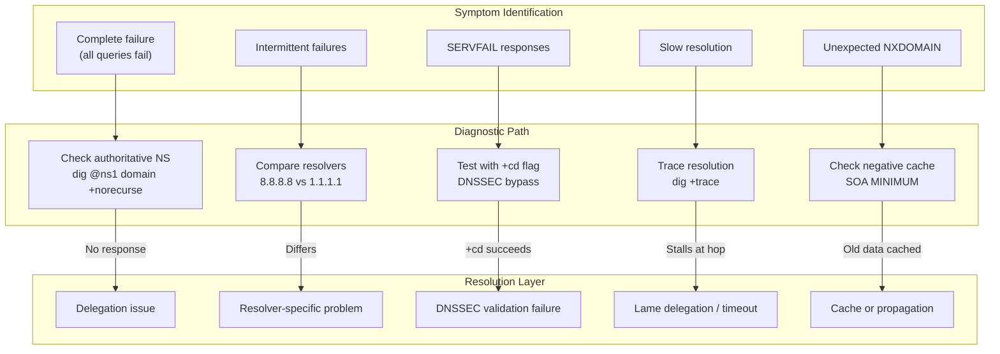

# DNS Troubleshooting Playbook

A systematic approach to diagnosing DNS outages, propagation delays, and resolution failures. This playbook provides decision trees for symptom-driven triage, command recipes for isolating failures across the resolution chain, and DNSSEC (Domain Name System Security Extensions) debugging workflows for the most common signing failures.

<figure>



<figcaption>Symptom-driven triage flow for DNS failures, mapping symptoms to diagnostic commands and root cause categories.</figcaption>
</figure>

## Abstract

DNS troubleshooting requires isolating failures across three layers: authoritative infrastructure, recursive resolvers, and client-side caches. The diagnostic workflow:

1. **Identify the symptom**: SERVFAIL, NXDOMAIN, timeout, or slow resolution
2. **Isolate the layer**: Query authoritative servers directly (`+norecurse`), bypass validation (`+cd`), trace the path (`+trace`)
3. **Interpret the response**: Check RCODE, flags (AA, AD), and Extended DNS Errors (EDE)
4. **Fix at the source**: Zone data, DNSSEC signatures, delegation, or cache

Key mental model:

- **SERVFAIL** often means DNSSEC validation failure—test with `dig +cd` to confirm
- **NXDOMAIN** vs **NODATA**: NXDOMAIN means the name doesn't exist; NODATA means it exists but has no records of the requested type
- **Propagation delays** are cache expiry, not active distribution—wait for TTL (Time To Live), or flush specific resolvers
- **Lame delegation** produces timeouts or referral loops—verify each NS responds authoritatively

## Diagnostic Tools and Their Purpose

### dig: The Primary Tool

`dig` (Domain Information Groper) is the standard DNS diagnostic tool. Understanding its flags and output interpretation is essential.

**Essential flags:**

| Flag         | Purpose                           | When to Use                                    |
| ------------ | --------------------------------- | ---------------------------------------------- |
| `+trace`     | Trace from root servers           | Identify which NS (Name Server) in chain fails |
| `+norecurse` | Skip recursion, query directly    | Test authoritative server response             |
| `+cd`        | Checking Disabled (bypass DNSSEC) | Confirm DNSSEC-related SERVFAIL                |
| `+dnssec`    | Request DNSSEC records            | Verify signatures exist                        |
| `+short`     | Concise output                    | Quick answer verification                      |
| `+tcp`       | Force TCP                         | Test when UDP fails                            |
| `+nsid`      | Request Name Server ID            | Identify anycast instance                      |
| `-4` / `-6`  | Force IPv4/IPv6                   | Test address family issues                     |

**Interpreting dig output:**

```bash collapse={1-2}
$ dig example.com

; <<>> DiG 9.18.18 <<>> example.com
;; ->>HEADER<<- opcode: QUERY, status: NOERROR, id: 54321
;; flags: qr rd ra ad; QUERY: 1, ANSWER: 1, AUTHORITY: 0, ADDITIONAL: 1

;; ANSWER SECTION:
example.com.        86400   IN  A   93.184.216.34

;; Query time: 23 msec
;; SERVER: 8.8.8.8#53(8.8.8.8)
```

**Header flags decoded:**

| Flag | Meaning                                         |
| ---- | ----------------------------------------------- |
| `qr` | Query Response (this is a response)             |
| `rd` | Recursion Desired (client requested recursion)  |
| `ra` | Recursion Available (server supports recursion) |
| `aa` | Authoritative Answer (from the zone's NS)       |
| `ad` | Authenticated Data (DNSSEC validated)           |
| `cd` | Checking Disabled (validation skipped)          |

**RCODE values:**

| Status     | Meaning            | Common Causes                                              |
| ---------- | ------------------ | ---------------------------------------------------------- |
| `NOERROR`  | Success            | Query succeeded (may have zero answers)                    |
| `SERVFAIL` | Server failure     | DNSSEC validation error, upstream timeout, lame delegation |
| `NXDOMAIN` | Name doesn't exist | Domain not registered, typo, deleted record                |
| `REFUSED`  | Query refused      | ACL (Access Control List) restriction, rate limiting       |
| `FORMERR`  | Format error       | Malformed query (rare)                                     |

### delv: DNSSEC Validation

`delv` (DNS Lookup and Validation) provides detailed DNSSEC validation output—use it when `dig +cd` succeeds but plain `dig` fails.

```bash collapse={1-2}
$ delv example.com

; fully validated
example.com.        86400   IN  A   93.184.216.34
```

**Key delv flags:**

| Flag         | Purpose                             |
| ------------ | ----------------------------------- |
| `+rtrace`    | Show resolver fetch logging         |
| `+vtrace`    | Show validation chain               |
| `-i`         | Disable validation (like `dig +cd`) |
| `+multiline` | Readable multi-line output          |

When validation fails, `delv` prints detailed errors:

```bash
$ delv dnssec-failed.org
;; resolution failed: SERVFAIL
;; DNSSEC validation failure
```

### kdig: Encrypted DNS Testing

`kdig` (Knot DNS dig) supports DoT (DNS over TLS), DoH (DNS over HTTPS), and DoQ (DNS over QUIC):

```bash
# Test DNS over TLS
kdig @1.1.1.1 example.com +tls

# Test DNS over HTTPS
kdig @1.1.1.1 example.com +https

# Test DNS over QUIC
kdig @1.1.1.1 example.com +quic
```

### drill: DNSSEC Tracing

`drill` from NLnet Labs provides cleaner DNSSEC chain visualization:

```bash
# Trace with DNSSEC from root
drill -TDS example.com
```

The `-D` flag displays the DNSSEC validation path, `-T` traces from root, and `-S` shows security status.

## Symptom-Driven Triage

### Complete Resolution Failure

**Symptom:** All queries to a domain fail—no responses from any resolver.

**Diagnostic sequence:**

```bash
# 1. Verify the domain's nameservers are responding
dig example.com NS +short
# Returns: ns1.example.com, ns2.example.com

# 2. Query each NS directly
dig @ns1.example.com example.com A +norecurse
dig @ns2.example.com example.com A +norecurse

# 3. If no response, check if NS IPs are reachable
dig ns1.example.com A +short
# Returns: 192.0.2.1

# 4. Test network connectivity
nc -zv 192.0.2.1 53
```

**Failure patterns:**

| Pattern                      | Likely Cause                               |
| ---------------------------- | ------------------------------------------ |
| No response from any NS      | Authoritative servers down or unreachable  |
| Response but no AA flag      | Lame delegation—NS doesn't serve this zone |
| Response but REFUSED         | ACL blocking your source IP                |
| Timeout to NS but ping works | Firewall blocking port 53                  |

**Lame delegation check:**

```bash
# Query NS directly without recursion
dig @ns1.example.com example.com SOA +norecurse

# Expected: status: NOERROR, flags include 'aa'
# Lame: REFUSED, SERVFAIL, or no 'aa' flag
```

### SERVFAIL Responses

**Symptom:** Resolver returns SERVFAIL for a domain that should resolve.

SERVFAIL is a catch-all for "something went wrong." The most common causes in 2024:

1. **DNSSEC validation failure** (most common)
2. **All authoritative servers unreachable**
3. **Lame delegation**
4. **Resolver-side timeout or overload**

**Decision tree:**

```bash
# Step 1: Test with DNSSEC validation disabled
dig example.com +cd

# If +cd succeeds but without +cd fails → DNSSEC problem
# If both fail → Non-DNSSEC issue (authoritative/network)
```

**DNSSEC-related SERVFAIL diagnosis:**

```bash
# Check Extended DNS Errors (RFC 8914)
dig @1.1.1.1 example.com

# Look for EDE in response:
;; OPT PSEUDOSECTION:
; EDE: 6 (DNSSEC Bogus)

# EDE codes for DNSSEC failures:
# 6 - DNSSEC Bogus (validation failed)
# 7 - Signature Expired
# 8 - Signature Not Yet Valid
# 9 - DNSKEY Missing
# 10 - RRSIGs Missing
```

**Trace to find the failing hop:**

```bash
dig +trace example.com
```

Look for where the trace stops or returns SERVFAIL. The last successful referral identifies the layer above the failure.

### Intermittent Failures

**Symptom:** Queries succeed sometimes, fail other times.

**Common causes:**

1. **Inconsistent authoritative servers** (different data across NS)
2. **Anycast routing instability**
3. **Partial outage** (some NS instances down)
4. **Network path issues** (packet loss)

**Diagnosis:**

```bash
# Compare responses from each authoritative NS
for ns in $(dig example.com NS +short); do
    echo "=== $ns ==="
    dig @$ns example.com A +norecurse +short
done

# Check SOA serial consistency
for ns in $(dig example.com NS +short); do
    echo "$ns: $(dig @$ns example.com SOA +short | awk '{print $3}')"
done

# Different serials = zone transfer issue or inconsistent updates
```

**Anycast instance identification:**

```bash
# Request NSID (Name Server Identifier)
dig +nsid @1.1.1.1 example.com

# Response includes:
;; OPT PSEUDOSECTION:
; NSID: 4c 41 58 ("LAX" = Los Angeles instance)
```

### Slow Resolution

**Symptom:** Queries take seconds instead of milliseconds.

**Causes:**

1. **Cache miss with long chain** (normal for first query)
2. **Timeout to one NS before failover**
3. **Lame delegation requiring retries**
4. **DNSSEC validation fetching additional records**

**Measure each hop:**

```bash
# Time the full resolution
dig example.com | grep "Query time"

# Trace to see per-hop latency
dig +trace +stats example.com
```

**Compare cached vs uncached:**

```bash
# Force fresh resolution (flush Google's cache first)
# https://developers.google.com/speed/public-dns/cache

# Check if record is cached (low TTL = recently fetched)
dig @8.8.8.8 example.com | grep -E "^example.com.*IN"
# example.com.        142   IN  A  ...
# TTL 142 means it was fetched ~158 seconds ago (original TTL 300)
```

### Unexpected NXDOMAIN

**Symptom:** A domain that should exist returns NXDOMAIN.

**Causes:**

1. **Record actually deleted**
2. **Negative caching** (NXDOMAIN cached from previous query)
3. **Split-horizon DNS** (different answers based on source)
4. **Registrar/registry issue** (delegation removed)

**Diagnosis:**

```bash
# 1. Query authoritative server directly
dig @ns1.example.com api.example.com A +norecurse

# 2. If authoritative returns NXDOMAIN, record is truly gone

# 3. If authoritative returns answer but resolver returns NXDOMAIN:
#    → Negative cache issue

# 4. Check delegation at parent
dig example.com NS @$(dig com NS +short | head -1)

# 5. Check if domain is registered
whois example.com
```

**Negative cache duration:**

```bash
# Check SOA MINIMUM (controls negative cache TTL)
dig example.com SOA +short
# ns1.example.com. hostmaster.example.com. 2024011501 7200 3600 1209600 3600
#                                                                        ^^^^
# Last value (3600) = negative cache TTL in seconds

# RFC 2308: Negative TTL = min(SOA.MINIMUM, SOA TTL)
```

## Resolver vs Authoritative Isolation

### Testing Authoritative Servers

Always verify authoritative servers are returning correct data before blaming resolvers:

```bash
# Find authoritative nameservers
dig example.com NS +short

# Query each directly (bypass recursion)
dig @ns1.example.com example.com A +norecurse

# Expected response:
# - status: NOERROR
# - flags include 'aa' (authoritative answer)
# - Answer section contains the record
```

**Red flags in authoritative response:**

| Issue                               | Meaning                                                      |
| ----------------------------------- | ------------------------------------------------------------ |
| No 'aa' flag                        | Server doesn't consider itself authoritative—lame delegation |
| REFUSED                             | ACL blocking or server misconfiguration                      |
| SERVFAIL                            | Server can't load zone (syntax error, missing file)          |
| Different answers from different NS | Zone transfer failure or inconsistent updates                |

### Comparing Public Resolvers

Different resolvers can have different cache states and policies:

```bash
# Compare major public resolvers
echo "Google:    $(dig @8.8.8.8 example.com +short)"
echo "Cloudflare: $(dig @1.1.1.1 example.com +short)"
echo "Quad9:     $(dig @9.9.9.9 example.com +short)"
echo "OpenDNS:   $(dig @208.67.222.222 example.com +short)"
```

**Interpretation:**

| Result               | Meaning                                              |
| -------------------- | ---------------------------------------------------- |
| All match            | Likely correct; check authoritative if unexpected    |
| One differs          | That resolver has stale cache or different policy    |
| All differ           | Check authoritative servers—likely inconsistent zone |
| Some return SERVFAIL | DNSSEC issue or resolver-specific problem            |

**Resolver-specific behaviors:**

| Resolver             | DNSSEC | ECS     | Notes                        |
| -------------------- | ------ | ------- | ---------------------------- |
| Google (8.8.8.8)     | Yes    | Yes     | Supports Extended DNS Errors |
| Cloudflare (1.1.1.1) | Yes    | No      | Privacy-focused, no ECS      |
| Quad9 (9.9.9.9)      | Yes    | No      | Malware blocking enabled     |
| OpenDNS              | Yes    | Partial | Content filtering available  |

### Tracing the Resolution Path

`dig +trace` performs iterative resolution from your machine, showing each referral:

```bash collapse={1-3}
$ dig +trace api.example.com

.                       518400  IN  NS  a.root-servers.net.
.                       518400  IN  NS  b.root-servers.net.
;; Received 239 bytes from 192.168.1.1#53(192.168.1.1) in 12 ms

com.                    172800  IN  NS  a.gtld-servers.net.
com.                    172800  IN  NS  b.gtld-servers.net.
;; Received 772 bytes from 198.41.0.4#53(a.root-servers.net) in 24 ms

example.com.            172800  IN  NS  ns1.example.com.
example.com.            172800  IN  NS  ns2.example.com.
;; Received 112 bytes from 192.5.6.30#53(a.gtld-servers.net) in 32 ms

api.example.com.        300     IN  A   93.184.216.50
;; Received 56 bytes from 192.0.2.1#53(ns1.example.com) in 45 ms
```

**Interpreting trace output:**

1. Each section shows a referral from one NS to the next
2. The final section should have the answer with `aa` flag
3. If trace stalls at a level, that's where the problem is
4. Check the source IP and latency for each hop

**Trace failure patterns:**

| Pattern                   | Cause                                       |
| ------------------------- | ------------------------------------------- |
| Stops at TLD              | Delegation not registered or NS unreachable |
| SERVFAIL at authoritative | Zone not loaded or DNSSEC issue             |
| Timeout at specific NS    | That server is down                         |
| Loop in referrals         | Misconfigured delegation                    |

## DNSSEC Troubleshooting

### DNSSEC Validation Failure Workflow

When DNSSEC validation fails, resolvers return SERVFAIL. Use this workflow to identify the specific failure:

```bash
# Step 1: Confirm DNSSEC is the cause
dig example.com +cd       # Should succeed (validation disabled)
dig example.com           # Fails with SERVFAIL

# Step 2: Check for Extended DNS Errors
dig @1.1.1.1 example.com
# Look for EDE in response

# Step 3: Use delv for detailed validation
delv example.com +rtrace

# Step 4: Visualize the chain
# https://dnsviz.net/d/example.com/analyze/
```

### Common DNSSEC Failures

**Expired signatures:**

```bash
# Check RRSIG expiration
dig example.com RRSIG +dnssec +multiline

# Look for expiration date:
example.com.  300 IN RRSIG A 13 2 300 (
                20240215000000 20240115000000 12345 example.com.
                abc123...signature... )
#               ^^^^^^^^^^^^^^
#               Signature expires 2024-02-15
```

**Fix:** Re-sign the zone. Check if automatic signing (BIND inline-signing, PowerDNS NSEC3PARAM) is working.

**DS record mismatch:**

The DS (Delegation Signer) record in the parent zone must match the DNSKEY in your zone.

```bash
# Get DS from parent zone (TLD)
dig example.com DS @$(dig com NS +short | head -1)

# Get DNSKEY from your zone
dig @ns1.example.com example.com DNSKEY +dnssec

# The DS should be a hash of one of the DNSKEY records (typically KSK)
```

**Fix:** Update DS at registrar after key changes. During key rollover, both old and new DS records should exist briefly.

**Algorithm mismatch:**

```bash
# Check algorithm numbers
dig example.com DNSKEY +short
# 257 3 13 abc123...  (257 = KSK, 13 = ECDSAP256SHA256)
# 256 3 13 def456...  (256 = ZSK)

dig example.com DS +short
# 12345 13 2 abc...  (13 = algorithm, 2 = digest type)
```

**Common algorithms:**

| ID  | Name            | Status           |
| --- | --------------- | ---------------- |
| 8   | RSASHA256       | Widely supported |
| 13  | ECDSAP256SHA256 | Recommended      |
| 14  | ECDSAP384SHA384 | Recommended      |
| 15  | ED25519         | Modern, compact  |

**Chain of trust broken:**

Use DNSViz for visual analysis: https://dnsviz.net/

```bash
# Command-line DNSViz
dnsviz probe example.com | dnsviz graph -Thtml -O
```

The visualization shows where the chain breaks—typically a missing DS record at the parent or a key that was rolled without updating DS.

### DNSSEC Key Rollover Issues

Key rollovers are the most common source of DNSSEC outages. The process requires careful timing:

**ZSK (Zone Signing Key) rollover:**

1. Generate new ZSK
2. Publish new DNSKEY (both old and new active)
3. Wait for DNSKEY TTL to expire
4. Sign zone with new ZSK
5. Wait for signature TTL to expire
6. Remove old ZSK

**KSK (Key Signing Key) rollover:**

1. Generate new KSK
2. Publish new DNSKEY
3. Wait for DNSKEY TTL
4. Submit new DS to parent (registrar)
5. Wait for DS propagation
6. Remove old KSK and DS

**Failure symptoms during rollover:**

| Symptom                     | Cause                                     | Fix                                    |
| --------------------------- | ----------------------------------------- | -------------------------------------- |
| SERVFAIL after DS update    | Old DS removed before propagation         | Restore old DS, wait longer            |
| SERVFAIL on new key publish | RRSIG uses key not in DNSKEY set          | Ensure DNSKEY published before signing |
| Intermittent SERVFAIL       | Cached DNSKEY doesn't include signing key | Wait for cache expiry                  |

## Cache and Propagation Debugging

### Understanding "DNS Propagation"

"DNS propagation" is a misnomer—DNS doesn't actively push updates. Changes take effect as cached records expire.

**What controls propagation time:**

1. **Record TTL**: How long resolvers cache the old value
2. **Negative cache TTL** (SOA MINIMUM): How long NXDOMAIN is cached
3. **Resolver minimum TTL**: Some resolvers ignore low TTLs
4. **Browser/OS cache**: Application-level caching

**Propagation verification:**

```bash
# 1. Verify authoritative servers have the new record
dig @ns1.example.com example.com A +norecurse

# 2. Check what public resolvers have cached
dig @8.8.8.8 example.com +norecurse
# Empty response = not cached; will fetch fresh on next query
# Answer with TTL = cached; TTL shows time remaining

# 3. Force fresh lookup (without +norecurse)
dig @8.8.8.8 example.com
```

### Flushing Caches

**Public resolver cache flush:**

| Resolver   | Method                                               |
| ---------- | ---------------------------------------------------- |
| Google     | https://developers.google.com/speed/public-dns/cache |
| Cloudflare | https://1.1.1.1/purge-cache/                         |
| OpenDNS    | https://cachecheck.opendns.com/                      |

**Browser cache flush:**

| Browser | Method                                           |
| ------- | ------------------------------------------------ |
| Chrome  | `chrome://net-internals/#dns` → Clear host cache |
| Firefox | `about:networking#dns` → Clear DNS Cache         |
| Edge    | `edge://net-internals/#dns` → Clear host cache   |
| Safari  | Clear via system (macOS)                         |

**Operating system cache flush:**

```bash
# macOS
sudo dscacheutil -flushcache
sudo killall -HUP mDNSResponder

# Linux (systemd-resolved)
sudo resolvectl flush-caches

# Windows
ipconfig /flushdns
```

### Pre-Migration TTL Strategy

Before making DNS changes, lower TTL to minimize stale cache impact:

```bash
# 1. Check current TTL
dig example.com +short   # Note the TTL value

# 2. Lower TTL to 300 seconds (or desired migration TTL)
# (Update in your DNS provider/zone file)

# 3. Wait for OLD TTL to expire
# If old TTL was 86400 (24h), wait 24 hours

# 4. Verify new TTL is in effect
dig @8.8.8.8 example.com   # TTL should be ≤300

# 5. Make the actual change

# 6. After verification, restore higher TTL
```

**Common mistake:** Lowering TTL and immediately making the change. Resolvers still have the old record cached with the old (high) TTL.

## CDN and GeoDNS Pitfalls

### GeoDNS Resolver Location Issue

GeoDNS uses the resolver's IP, not the client's IP, to determine location. When using public resolvers (8.8.8.8, 1.1.1.1), routing may be suboptimal.

**EDNS Client Subnet (ECS):**

ECS (RFC 7871) allows resolvers to forward client subnet to authoritative servers:

```bash
# Test ECS support
dig +subnet=203.0.113.0/24 example.com @8.8.8.8

# Check if authoritative returns different answers per source
```

**ECS privacy note:** Cloudflare (1.1.1.1) intentionally doesn't send ECS for privacy. Google (8.8.8.8) does.

### Health Check and Failover Delays

CDN/load balancer DNS can serve stale records if:

1. Health checks haven't detected failure
2. DNS TTL hasn't expired
3. Resolver is serving stale data (RFC 8767)

**Diagnosis:**

```bash
# Compare authoritative answer with cached
dig @authoritative-ns.example.com www.example.com +short
dig @8.8.8.8 www.example.com +short

# If different, cached record is stale
```

**Mitigation:**

- Use lower TTL (60-300s) for health-checked records
- Configure aggressive health check intervals
- Consider anycast at HTTP layer instead of DNS-based routing

### CNAME Flattening Complications

CNAME at zone apex is forbidden by RFC 1034 (conflicts with required SOA/NS). Providers work around this with CNAME flattening (Cloudflare) or ALIAS records (Route 53).

**Complications:**

1. **Domain verification fails**: TXT record lookups may not find expected values
2. **Certificate renewal issues**: ACME challenges may fail
3. **GeoDNS accuracy**: Flattening happens at authoritative server location

**Diagnosis:**

```bash
# Check if CNAME is being flattened
dig example.com CNAME   # No answer (flattened)
dig example.com A       # Returns resolved IP

# For debugging, some providers expose the underlying CNAME:
dig _underlying.example.com CNAME  # Provider-specific
```

## Incident Playbook

### Initial Triage Script

```bash title="dns-triage.sh" collapse={1-3}
#!/bin/bash
DOMAIN=${1:?Usage: $0 domain.com}

echo "=== DNS Triage for $DOMAIN ==="
echo ""

echo "--- Authoritative Nameservers ---"
dig $DOMAIN NS +short
echo ""

echo "--- Direct Query to Each NS ---"
for ns in $(dig $DOMAIN NS +short 2>/dev/null); do
    echo "$ns:"
    dig @$ns $DOMAIN A +norecurse +short 2>/dev/null || echo "  FAILED"
done
echo ""

echo "--- SOA Serial Consistency ---"
for ns in $(dig $DOMAIN NS +short 2>/dev/null); do
    serial=$(dig @$ns $DOMAIN SOA +short 2>/dev/null | awk '{print $3}')
    echo "$ns: $serial"
done
echo ""

echo "--- Public Resolver Comparison ---"
echo "Google 8.8.8.8:     $(dig @8.8.8.8 $DOMAIN A +short 2>/dev/null)"
echo "Cloudflare 1.1.1.1: $(dig @1.1.1.1 $DOMAIN A +short 2>/dev/null)"
echo "Quad9 9.9.9.9:      $(dig @9.9.9.9 $DOMAIN A +short 2>/dev/null)"
echo ""

echo "--- DNSSEC Status ---"
dig $DOMAIN +dnssec +short 2>/dev/null
echo ""
echo "With +cd (validation disabled):"
dig $DOMAIN +cd +short 2>/dev/null
echo ""

echo "--- TTL Check ---"
dig $DOMAIN | grep -E "^$DOMAIN.*IN" | head -1
```

### Escalation Decision Tree

| Finding                     | Escalation Path                        |
| --------------------------- | -------------------------------------- |
| All NS unreachable          | Infrastructure team / DNS provider     |
| Lame delegation             | DNS administrator (zone not loaded)    |
| DNSSEC validation failure   | DNSSEC key management / registrar (DS) |
| Resolver-specific issue     | ISP / public resolver (rare)           |
| Inconsistent NS responses   | Zone transfer / replication issue      |
| Registry delegation missing | Registrar account / domain status      |

### Rollback Strategies

**Record change rollback:**

```bash
# If you lowered TTL before the change: just revert the record
# Propagation time = new (low) TTL

# If you didn't lower TTL: revert and wait for old TTL
# or flush major resolver caches manually
```

**Nameserver change rollback:**

NS changes propagate slowly (typically 48-hour TTL at TLD). Rollback options:

1. **Revert at registrar**: Update NS back to old servers
2. **Keep new NS, fix zone**: Often faster than waiting for NS propagation
3. **Update both old and new NS**: Serve consistent data everywhere

**DNSSEC rollback:**

If DNSSEC breaks resolution:

1. **Emergency DS removal** at registrar makes zone unsigned but resolvable
2. **Wait for DS negative cache** (SOA MINIMUM at parent, typically 1 hour for TLDs)
3. **Re-enable DNSSEC** after fixing signing

### Postmortem Checklist

After resolving a DNS incident, document:

- [ ] **Timeline**: When did the issue start? When was it detected? When was it resolved?
- [ ] **Symptoms**: What queries failed? What responses were seen?
- [ ] **Root cause**: Specific misconfiguration, expired key, etc.
- [ ] **Resolution**: What changes fixed the issue?
- [ ] **TTL impact**: How long were stale records served?
- [ ] **Detection gap**: How could monitoring catch this sooner?
- [ ] **Prevention**: What process change prevents recurrence?

## Conclusion

DNS troubleshooting follows a systematic isolation approach: start with symptoms, verify authoritative servers respond correctly, compare resolver behavior, and trace the resolution path to identify the failing component. The key diagnostic commands—`dig +norecurse`, `dig +trace`, and `dig +cd`—isolate authoritative, path, and DNSSEC issues respectively.

SERVFAIL in modern DNS often indicates DNSSEC validation failure. Always test with `+cd` first. Extended DNS Errors (RFC 8914) provide specific failure codes when supported by the resolver.

"Propagation" is cache expiry. Lower TTL before changes, wait for old TTL to expire, make the change, then restore TTL. Flushing individual resolver caches accelerates propagation for testing but doesn't affect the broader internet.

For DNSSEC issues, use `delv` for validation details and DNSViz for chain visualization. Most DNSSEC outages stem from key rollover timing—ensure DS records at the registrar match current DNSKEY, and that signatures haven't expired.

## Appendix

### Prerequisites

- Familiarity with DNS resolution flow (see [DNS Resolution Path](../dns-resolution-path/README.md))
- Understanding of DNS record types and TTL (see [DNS Records, TTL, and Caching](../dns-records-ttl-and-caching/README.md))
- Command-line access with `dig` installed

### Terminology

| Term                | Definition                                                                |
| ------------------- | ------------------------------------------------------------------------- |
| **RCODE**           | Response Code; 4-bit field in DNS header indicating query result          |
| **EDE**             | Extended DNS Error (RFC 8914); detailed error information via EDNS option |
| **SERVFAIL**        | Server failure response; catch-all for resolution errors                  |
| **NXDOMAIN**        | Non-Existent Domain; name does not exist                                  |
| **NODATA**          | Name exists but no records of requested type; NOERROR with empty answer   |
| **Lame delegation** | NS records point to server that doesn't serve the zone                    |
| **AA flag**         | Authoritative Answer; set when response comes from zone's nameserver      |
| **AD flag**         | Authenticated Data; set when DNSSEC validation succeeded                  |
| **CD flag**         | Checking Disabled; client requests validation be skipped                  |
| **+trace**          | dig flag to perform iterative resolution from root                        |
| **KSK**             | Key Signing Key; signs DNSKEY RRset, referenced by DS at parent           |
| **ZSK**             | Zone Signing Key; signs zone data                                         |

### Summary

- **SERVFAIL + `+cd` succeeds** → DNSSEC validation failure; check signatures and DS records
- **SERVFAIL + `+cd` fails** → Authoritative issue; query NS directly with `+norecurse`
- **Intermittent failures** → Compare NS responses; check SOA serial consistency
- **Slow resolution** → Use `+trace` to identify slow hop; check for lame delegation
- **Unexpected NXDOMAIN** → Verify authoritative servers; check negative cache (SOA MINIMUM)
- **Propagation delays** → Verify authoritative has new data; wait for TTL expiry; flush caches
- **Key rollover failures** → Ensure DS matches DNSKEY; don't remove old DS until new propagates

### References

- [RFC 1035 - Domain Names: Implementation and Specification](https://www.rfc-editor.org/rfc/rfc1035) - DNS message format, RCODE definitions
- [RFC 2308 - Negative Caching of DNS Queries](https://www.rfc-editor.org/rfc/rfc2308) - NXDOMAIN vs NODATA, negative cache TTL
- [RFC 8914 - Extended DNS Errors](https://www.rfc-editor.org/rfc/rfc8914) - Detailed error codes via EDNS
- [RFC 9520 - Negative Caching of DNS Resolution Failures](https://www.rfc-editor.org/rfc/rfc9520) - Resolution failure caching requirements
- [RFC 6781 - DNSSEC Operational Practices, Version 2](https://www.rfc-editor.org/rfc/rfc6781) - Key rollover procedures
- [RFC 8767 - Serving Stale Data to Improve DNS Resiliency](https://www.rfc-editor.org/rfc/rfc8767) - Serve-stale behavior
- [RFC 7871 - Client Subnet in DNS Queries](https://www.rfc-editor.org/rfc/rfc7871) - EDNS Client Subnet (ECS)
- [BIND 9 Administrator Reference Manual](https://bind9.readthedocs.io/) - Resolver configuration and debugging
- [DNSViz](https://dnsviz.net/) - DNSSEC visualization and analysis tool
- [Cloudflare - Unwrap the SERVFAIL](https://blog.cloudflare.com/unwrap-the-servfail/) - Extended DNS Errors explanation
- [Julia Evans - How to use dig](https://jvns.ca/blog/2021/12/04/how-to-use-dig/) - Practical dig usage guide
- [Google Public DNS Cache Flush](https://developers.google.com/speed/public-dns/cache) - Manual cache purge
- [Cloudflare Cache Purge](https://1.1.1.1/purge-cache/) - Manual cache purge
