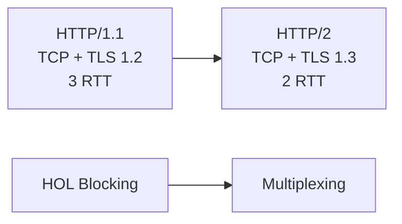
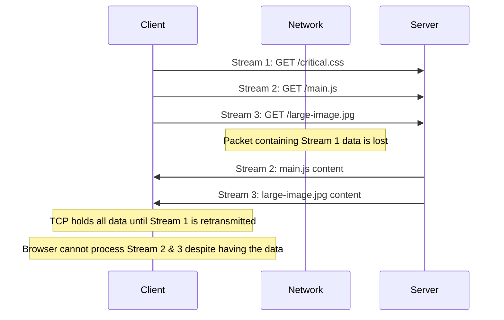

# HTTP/1.1 to HTTP/2: Bottlenecks and Multiplexing

An in-depth look at how HTTP/1.1's request/response model and head-of-line blocking led to HTTP/2's multiplexing, header compression, and stream prioritization. This article focuses on architectural bottlenecks, connection behavior, and performance implications across HTTP/1.1 and HTTP/2.

<figure>



<figcaption>Evolution from HTTP/1.1 to HTTP/2 highlighting latency reduction and multiplexing</figcaption>

</figure>

## TLDR

**HTTP/1.1 to HTTP/2** addresses application-layer head-of-line blocking, header overhead, and connection limits by introducing multiplexing and binary framing over a single TCP connection.

### Key Differences

- **HTTP/1.1**: multiple parallel TCP connections, sequential responses, application-layer HOL blocking
- **HTTP/2**: multiplexed streams, HPACK header compression, stream prioritization, but TCP HOL remains
- **TLS + ALPN**: negotiate HTTP/2 during handshake without extra RTT; browsers require TLS for HTTP/2

### Practical Takeaways

- **Fewer connections**: consolidate domains to maximize multiplexing benefits
- **Smaller critical payloads**: TCP HOL still hurts on loss; optimize bundles and critical paths
- **Server support**: enable `h2` + TLS 1.3 + ALPN and verify browser negotiation

## Terminology

### HTTP & Web Protocols

- **HTTP** — _HyperText Transfer Protocol_
  Application-layer protocol for transferring web resources.

- **HTTP/1.0** — _HyperText Transfer Protocol Version 1.0_
  Early HTTP version with non-persistent connections by default.

- **HTTP/1.1** — _HyperText Transfer Protocol Version 1.1_
  Introduced persistent connections, chunked transfer encoding, and pipelining (with HOL issues).

- **HTTP/2 (h2)** — _HyperText Transfer Protocol Version 2_
  Binary protocol with multiplexing, header compression (HPACK), and stream prioritization over TCP.

- **HTTP/3 (h3)** — _HyperText Transfer Protocol Version 3_
  Runs over QUIC (UDP-based), eliminating transport-layer head-of-line blocking.

- **h2c** — _HTTP/2 Cleartext_
  HTTP/2 over plaintext TCP using the HTTP Upgrade mechanism (not used by browsers).

### Transport & Networking

- **TCP** — _Transmission Control Protocol_
  Reliable, ordered, congestion-controlled transport protocol.

- **UDP** — _User Datagram Protocol_
  Connectionless transport protocol used as the foundation for QUIC.

- **QUIC** — _Quick UDP Internet Connections_
  UDP-based transport with built-in TLS 1.3, stream multiplexing, and connection migration.

- **RTT** — _Round-Trip Time_
  Time for a packet to travel from client to server and back.

- **0-RTT** — _Zero Round-Trip Time_
  Allows sending application data immediately during session resumption (with replay risks).

- **1-RTT** — _One Round-Trip Time_
  Single round-trip handshake used by TLS 1.3 and QUIC for new connections.

- **HOL (HoL)** — _Head-of-Line Blocking_
  A condition where one blocked request delays others.

### Security & Cryptography

- **TLS** — _Transport Layer Security_
  Cryptographic protocol providing confidentiality, integrity, and authentication.

- **TLS 1.0 / 1.1 / 1.2 / 1.3** — _Transport Layer Security Versions_
  Successive TLS versions; TLS 1.3 significantly reduces handshake latency and enforces forward secrecy.

- **PSK** — _Pre-Shared Key_
  Used for TLS/QUIC session resumption and 0-RTT data.

- **AEAD** — _Authenticated Encryption with Associated Data_
  Encryption scheme providing confidentiality and integrity (mandatory in TLS 1.3).

- **RSA** — _Rivest–Shamir–Adleman_
  Asymmetric cryptographic algorithm (removed from TLS 1.3 key exchange).

- **DHE / ECDHE** — _Diffie–Hellman / Elliptic Curve Diffie–Hellman Ephemeral_
  Key exchange mechanisms providing forward secrecy.

- **MAC** — _Message Authentication Code_
  Ensures data integrity and authenticity.

### Protocol Negotiation & Discovery

- **ALPN** — _Application-Layer Protocol Negotiation_
  TLS extension allowing client and server to agree on HTTP/1.1 vs HTTP/2 during handshake.

- **Alt-Svc** — _Alternative Services_
  HTTP header indicating alternative protocols/endpoints (e.g., HTTP/3 over QUIC).

- **ALTSVC** — _HTTP/2 Alternative Service Frame_
  HTTP/2 framing equivalent of the Alt-Svc header.

- **DNS** — _Domain Name System_
  Resolves domain names to IP addresses and advertises protocol capabilities.

- **SVCB** — _Service Binding DNS Record_
  DNS record for advertising service endpoints and protocol support.

- **HTTPS (DNS record type)** — _HTTPS Service Binding Record_
  Alias of SVCB optimized for HTTPS services.

- **ECH** — _Encrypted Client Hello_
  TLS feature to encrypt the ClientHello and hide metadata (e.g., SNI).

### HTTP/2 & HTTP/3 Internals

- **HPACK** — _Header Compression for HTTP/2_
  Compresses HTTP headers to reduce overhead.

- **QPACK** — _QUIC Header Compression_
  Header compression mechanism for HTTP/3 designed to avoid HOL blocking.

- **CID** — _Connection ID_
  QUIC identifier allowing connection migration across IP/port changes.

### Congestion Control

- **CUBIC** — _CUBIC Congestion Control Algorithm_
  Loss-based TCP/QUIC congestion control optimized for high-bandwidth networks.

- **BBR** — _Bottleneck Bandwidth and Round-trip propagation time_
  Model-based congestion control focusing on throughput and latency.

- **NewReno** — _TCP NewReno_
  Improved loss recovery algorithm over classic TCP Reno.

- **cwnd** — _Congestion Window_
  Limits the amount of in-flight data a sender can transmit.

- **ssthresh** — _Slow Start Threshold_
  Boundary between slow start and congestion avoidance.

### Browser & Infrastructure Concepts

- **CDN** — _Content Delivery Network_
  Distributed servers delivering content closer to users.

- **IP** — _Internet Protocol_
  Network-layer protocol for addressing and routing packets.

- **IPv4 / IPv6** — _Internet Protocol Version 4 / 6_
  Addressing standards for identifying devices on networks.

- **SNI** — _Server Name Indication_
  TLS extension indicating the target hostname (partially protected by ECH).

### General Web Terms

- **JS** — _JavaScript_
  Client-side scripting language for web applications.

- **CSS** — _Cascading Style Sheets_
  Stylesheet language for describing document presentation.

- **API** — _Application Programming Interface_
  Interface enabling software components to communicate.

## Protocol Evolution and Architectural Foundations

The evolution of HTTP from version 1.1 to 3 represents a systematic approach to solving performance bottlenecks at successive layers of the network stack. Each iteration addresses specific limitations while introducing new architectural paradigms that fundamentally change how browsers and servers communicate.

### 3.1 The Bottleneck Shifting Principle

A fundamental principle in protocol design is that solving a performance issue at one layer often reveals a new constraint at a lower layer. This is precisely what happened in the HTTP evolution:

1. **HTTP/1.1**: Application-layer Head-of-Line (HOL) blocking
2. **HTTP/2**: Transport-layer HOL blocking (TCP-level)
3. **HTTP/3**: Eliminates transport-layer blocking entirely

### 3.2 HTTP Protocol Versions Overview

| Version | Transport | Framing | Multiplexing     | Header Codec | Key Features                                                            |
| ------- | --------- | ------- | ---------------- | ------------ | ----------------------------------------------------------------------- |
| 0.9     | TCP       | Plain   | No               | N/A          | GET only; single resource per connection.                               |
| 1.0     | TCP       | Text    | No               | No           | Methods (GET,POST,HEAD); conditional keep-alive.                        |
| 1.1     | TCP       | Text    | Pipelining (HOL) | No           | Default persistent; chunked encoding.                                   |
| 2       | TCP       | Binary  | Yes (streams)    | HPACK        | Multiplexing; server push; header compression.                          |
| 3       | QUIC/UDP  | Binary  | Yes (streams)    | QPACK        | Zero HOL at transport; 0-RTT; connection migration; TLS 1.3 integrated. |

### 3.3 TLS Protocol Versions Overview

| Version | Handshake RTTs    | Key Exchange     | Ciphers & MAC        | Forward Secrecy | Notes                                                   |
| ------- | ----------------- | ---------------- | -------------------- | --------------- | ------------------------------------------------------- |
| TLS 1.0 | 2                 | RSA/DHE optional | CBC+HMAC-SHA1        | Optional        | Vulnerable to BEAST                                     |
| TLS 1.1 | 2                 | RSA/DHE          | CBC with explicit IV | Optional        | BEAST mitigations                                       |
| TLS 1.2 | 2                 | RSA/DHE/ECDHE    | AEAD (AES-GCM)       | Optional        | Widely supported; more cipher suite complexity          |
| TLS 1.3 | 1 (0-RTT resumes) | (EC)DHE only     | AEAD only            | Mandatory       | Reduced latency; PSK resumption; no insecure primitives |

**TLS 1.2 vs TLS 1.3**:

- **Handshake Cost**: 2 RTTs vs 1 RTT.
- **Security**: TLS 1.3 enforces forward secrecy and drops legacy weak ciphers.
- **Trade-off**: TLS 1.3 adoption requires updates; session resumption 0-RTT introduces replay risks.

## HTTP/1.1: The Foundation and Its Inherent Bottlenecks

Standardized in 1997, HTTP/1.1 has been the workhorse of the web for decades. Its core mechanism is a text-based, sequential request-response protocol over TCP.

### 4.1 Architectural Limitations

**Head-of-Line Blocking at Application Layer**: The most significant architectural flaw is that a single TCP connection acts as a single-lane road. If a large resource (e.g., a 5MB image) is being transmitted, all subsequent requests for smaller resources (CSS, JS, small images) are blocked until the large transfer completes.

**Connection Overhead**: To circumvent HOL blocking, browsers open multiple parallel TCP connections (typically 6 per hostname). Each connection incurs:

- TCP 3-way handshake overhead
- TLS handshake overhead (for HTTPS)
- Slow-start algorithm penalties
- Memory and CPU overhead on both client and server

**Inefficient Resource Utilization**: Multiple connections often close before reaching maximum throughput, leaving substantial bandwidth unused.

### 4.2 Browser Workarounds

```javascript collapse={1-11}
// HTTP/1.1 era optimizations that browsers and developers used:
// 1. Domain sharding
const domains = ["cdn1.example.com", "cdn2.example.com", "cdn3.example.com"]

// 2. File concatenation
const megaBundle = css1 + css2 + css3 + js1 + js2 + js3

// 3. Image spriting
const spriteSheet = combineImages([icon1, icon2, icon3, icon4])

// 4. Connection pooling implementation
class HTTP11ConnectionPool {
  constructor(maxConnections = 6) {
    this.connections = new Map()
    this.maxConnections = maxConnections
  }

  async getConnection(hostname) {
    if (this.connections.has(hostname)) {
      const conn = this.connections.get(hostname)
      if (conn.isAvailable()) return conn
    }

    if (this.connections.size < this.maxConnections) {
      const conn = await this.createConnection(hostname)
      this.connections.set(hostname, conn)
      return conn
    }

    // Wait for available connection
    return this.waitForAvailableConnection()
  }
}
```

### 4.3 Protocol Negotiation in HTTP/1.1

HTTP/1.1 uses a simple, text-based negotiation mechanism:

```http
GET /index.html HTTP/1.1
Host: example.com
Connection: keep-alive
```

The server responds with its supported version and features:

```http
HTTP/1.1 200 OK
Connection: keep-alive
Content-Type: text/html
```

**Key Points**:

- Both HTTP/1.1 and HTTP/1.0 use compatible request formats
- The server's response indicates the version it supports
- Headers like "Connection: keep-alive" indicate available features
- No complex negotiation - the server simply responds with its capabilities

## HTTP/2: Multiplexing and Its Transport-Layer Limitations

Finalized in 2015, HTTP/2 introduced a binary framing layer that fundamentally changed data exchange patterns.

### 5.1 Core Innovations

**Binary Framing Layer**: Replaces text-based messages with binary-encoded frames, enabling:

- **True Multiplexing**: Multiple request-response pairs can be interleaved over a single TCP connection
- **Header Compression (HPACK)**: Reduces protocol overhead through static and dynamic tables
- **Stream Prioritization**: Allows clients to signal relative importance of resources

**Server Push**: Enables proactive resource delivery, though implementation maturity has been inconsistent.

### 5.2 The TCP Bottleneck Emerges

While HTTP/2 solved application-layer HOL blocking, it exposed a more fundamental issue: **TCP-level Head-of-Line Blocking**.



**Technical Analysis of TCP HOL Blocking**

```javascript
// HTTP/2 frame structure showing the problem
const http2Frame = {
  length: 16384, // 16KB frame
  type: 0x0, // DATA frame
  flags: 0x1, // END_STREAM
  streamId: 1, // Stream identifier
  payload: "...", // Actual data
}

// When a packet is lost, TCP retransmission affects all streams
class TCPRetransmission {
  handlePacketLoss(lostPacket) {
    // TCP must retransmit before delivering subsequent packets
    // This blocks ALL HTTP/2 streams, not just the affected one
    this.retransmit(lostPacket)
    this.blockDeliveryUntilRetransmit()
  }
}

// HTTP/2 stream prioritization can't overcome TCP HOL
const streamPriorities = {
  critical: { weight: 256, dependency: 0 }, // CSS, JS
  important: { weight: 128, dependency: 0 }, // Images
  normal: { weight: 64, dependency: 0 }, // Analytics
}
```

**The Problem**: TCP guarantees in-order delivery. If a single packet is lost, all subsequent packets (even those containing data for different HTTP/2 streams) are held back until the lost packet is retransmitted and received.

### 5.3 HTTP/2 Upgrade Mechanism

Browsers have standardized on using HTTP/2 exclusively over TLS connections, leveraging the **ALPN (Application-Layer Protocol Negotiation)** extension.

#### TLS ALPN Negotiation Process

```javascript
// Browser initiates TLS connection with ALPN extension
const tlsConnection = {
  clientHello: {
    supportedProtocols: ["h2", "http/1.1"],
    alpnExtension: true,
  },
}

// Server responds with its preferred protocol
const serverResponse = {
  serverHello: {
    selectedProtocol: "h2", // Server chooses HTTP/2
    alpnExtension: true,
  },
}
```

#### HTTP Upgrade Mechanism (Theoretical)

While browsers don't use it, HTTP/2 does support plaintext connections via the HTTP Upgrade mechanism:

```http
GET /index.html HTTP/1.1
Host: example.com
Connection: Upgrade, HTTP2-Settings
Upgrade: h2c
HTTP2-Settings: <base64url encoding of HTTP/2 SETTINGS payload>
```

**Server Response Options**:

```http
# Accepts upgrade
HTTP/1.1 101 Switching Protocols
Connection: Upgrade
Upgrade: h2c

# Rejects upgrade
HTTP/1.1 200 OK
Content-Type: text/html
# ... normal HTTP/1.1 response
```

**Key Points**:

- Browsers require TLS for HTTP/2 (no plaintext support)
- ALPN provides seamless protocol negotiation during TLS handshake
- HTTP Upgrade mechanism exists but is unused by browsers
- Server must support ALPN extension for HTTP/2 to work
