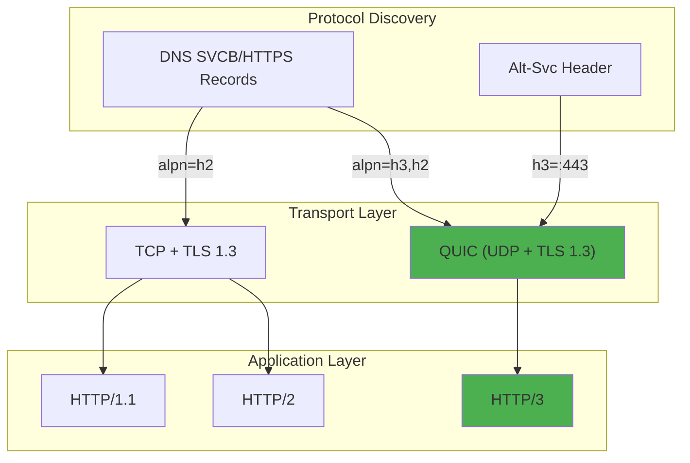
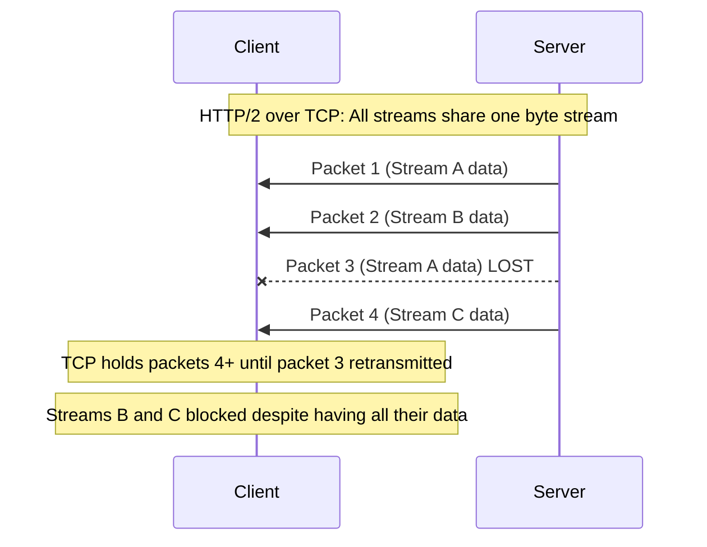
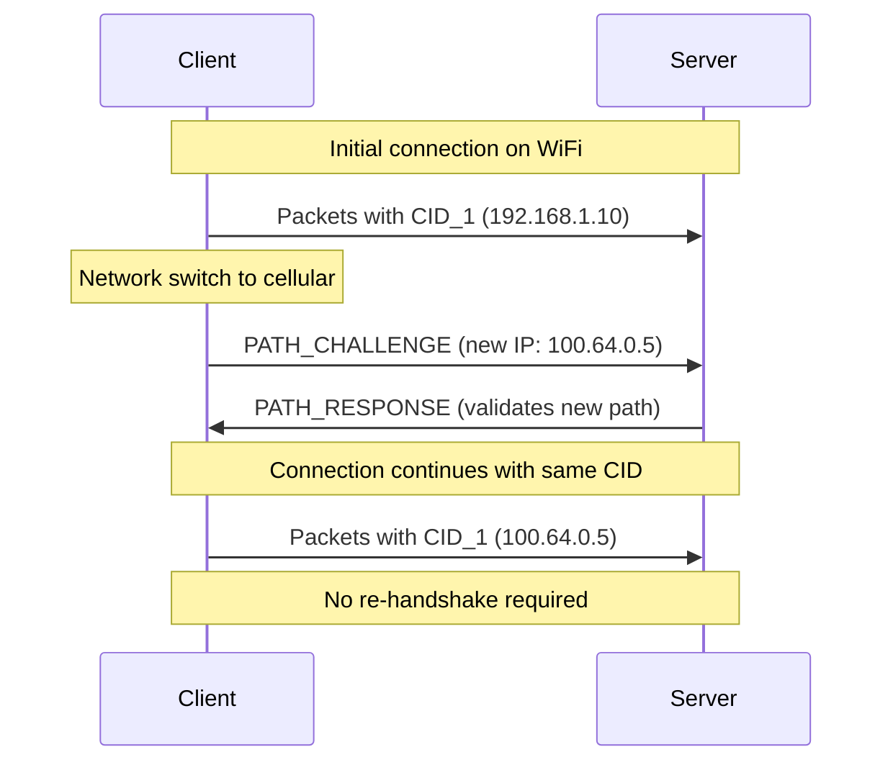
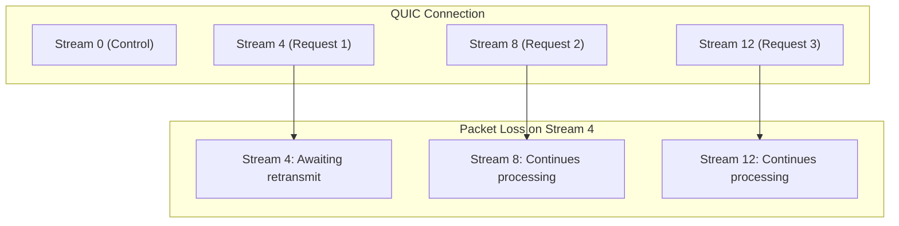
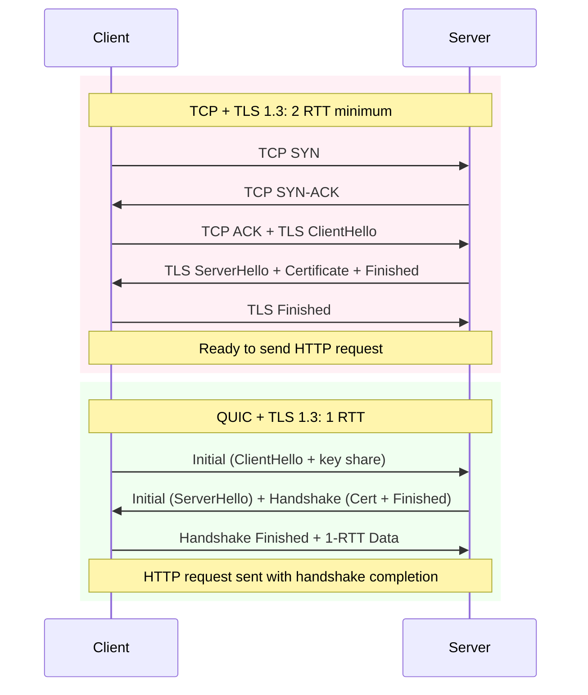
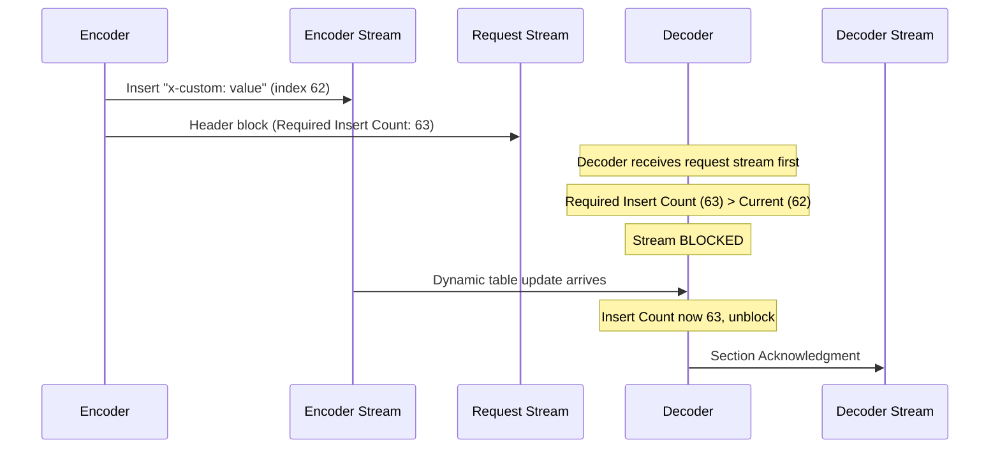
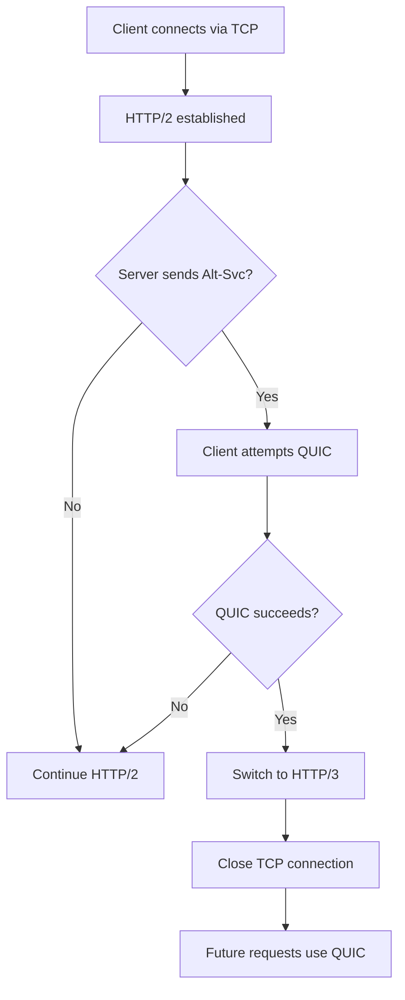
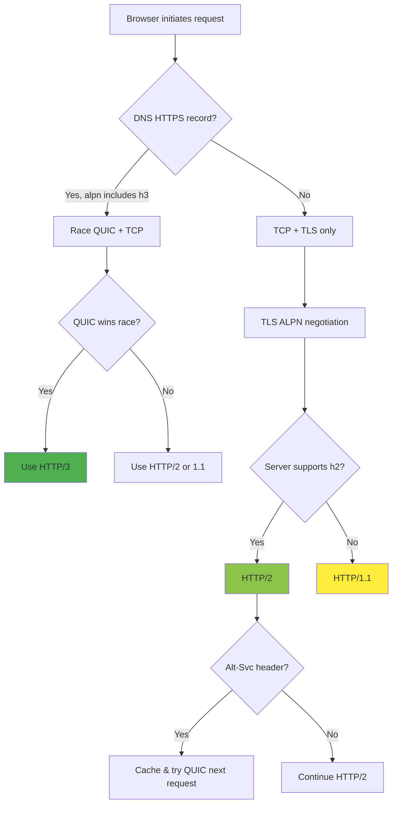

# HTTP/3 and QUIC: Transport Layer Revolution

HTTP/3 eliminates TCP's head-of-line blocking by building HTTP directly on QUIC, a UDP-based transport with integrated TLS 1.3. This article covers QUIC's design rationale, the TLS 1.3 integration that enables 1-RTT handshakes, 0-RTT security trade-offs, and the DNS/Alt-Svc discovery mechanisms browsers use for protocol negotiation.

<figure>



<figcaption>HTTP/3 runs over QUIC, which integrates TLS 1.3 into UDP-based transport. Discovery occurs via DNS SVCB/HTTPS records or Alt-Svc headers.</figcaption>
</figure>

## Abstract

HTTP/3 exists because TCP's design creates unavoidable head-of-line (HOL) blocking—when one packet is lost, all streams sharing that TCP connection stall waiting for retransmission. QUIC solves this by implementing reliable, ordered delivery per-stream rather than per-connection.

**Core mental model:**

- **QUIC = UDP + TLS 1.3 + Stream Multiplexing**: A user-space transport that encrypts everything except the connection ID, enabling both rapid protocol evolution and ossification resistance
- **Stream Independence**: Each QUIC stream has its own retransmission buffer. Lost packets on stream A don't block streams B or C—the exact property HTTP/2-over-TCP lacks
- **Connection Migration**: Connections are identified by Connection IDs, not IP:port tuples. Network changes (WiFi→cellular) don't require re-handshaking
- **1-RTT/0-RTT Handshakes**: TLS 1.3 is integrated into QUIC's transport handshake, not layered on top. New connections complete in 1-RTT; resumption can send data in 0-RTT (with replay risk for non-idempotent requests)

**Protocol discovery flow:**

1. DNS SVCB/HTTPS records advertise HTTP/3 support before connection (preferred)
2. Alt-Svc headers advertise HTTP/3 on existing TCP connections (fallback)
3. Browsers race QUIC and TCP, preferring QUIC when both succeed

## Why QUIC Exists: TCP's Fundamental Limitations

### Head-of-Line Blocking

HTTP/2 multiplexes streams over a single TCP connection. TCP guarantees in-order, reliable delivery—but this guarantee applies to the entire byte stream, not individual HTTP streams.



**The problem**: When packet 3 (belonging to Stream A) is lost, TCP cannot deliver packets 4+ to the application until packet 3 arrives. Streams B and C stall even though they have complete data waiting in the receive buffer.

**Quantified impact**: On lossy networks (2% packet loss), HTTP/2 can perform worse than HTTP/1.1 with multiple connections because all multiplexed streams suffer from every lost packet.

### TCP Ossification

TCP's success created a deployment problem: middleboxes (firewalls, NATs, load balancers) inspect TCP headers and make routing decisions based on specific field values. When TCP implementations try to use new features or modify header behavior, middleboxes drop or corrupt these packets.

**Real-world ossification examples:**

- TCP Fast Open (TFO): Despite RFC 7413 (2014), deployment stalled because ~6.5% of network paths encounter harmful middlebox interference
- ECN (Explicit Congestion Notification): Middleboxes drop packets with ECN bits set
- Multipath TCP: Requires complex handshakes to work around middlebox inspection

**QUIC's solution**: Build on UDP, which middleboxes generally pass through unchanged, and encrypt everything that could be ossified.

### Kernel-Space Constraints

TCP lives in the OS kernel. Protocol changes require kernel updates, which means:

- Years for new features to reach users (OS upgrade cycles)
- No A/B testing of transport algorithms
- Platform-specific implementations diverge

QUIC runs in user space, enabling browser/server updates to deploy new congestion control algorithms (CUBIC→BBR), flow control mechanisms, or security fixes without OS changes.

## QUIC Architecture

### Packet Structure and Encryption

QUIC encrypts almost everything. Per RFC 9000, only these fields are visible to network observers:

| Field             | Visibility              | Purpose                      |
| ----------------- | ----------------------- | ---------------------------- |
| Version (4 bytes) | Visible in long headers | Protocol version negotiation |
| Connection ID     | Visible                 | Routing to correct endpoint  |
| Packet Number     | Encrypted               | Replay protection, ordering  |
| Payload           | Encrypted               | All application data         |

**Design rationale**: Encrypting packet numbers and payload prevents middleboxes from making decisions based on these values, avoiding ossification. The Connection ID must remain visible for routing but changes periodically to prevent tracking.

### Connection IDs and Migration

TCP identifies connections by the 4-tuple: (source IP, source port, destination IP, destination port). When any value changes—common during WiFi→cellular handoffs—the connection dies.

QUIC uses Connection IDs instead. Per RFC 9000 Section 5.1:

> "The primary function of a connection ID is to ensure that changes in addressing at lower protocol layers (UDP, IP) do not cause packets for a QUIC connection to be delivered to the wrong endpoint."

**Security requirement**: Connection IDs "MUST NOT contain any information that can be used by an external observer... to correlate them with other connection IDs for the same connection."



**PATH_CHALLENGE/PATH_RESPONSE** (RFC 9000 Sections 8.2, 19.17-19.18):

1. Initiating endpoint sends PATH_CHALLENGE with 8 random bytes on new path
2. Receiving endpoint echoes identical bytes in PATH_RESPONSE
3. Successful response confirms peer controls that address and path is viable
4. This exchange also measures RTT for the new path

**When connection migration works:**

- NAT rebinding (external address changes)
- WiFi→cellular handoffs
- IPv6 temporary address expiration

**When it doesn't:**

- Server-initiated migration (not supported in RFC 9000)
- Zero-length Connection IDs (can't demultiplex)
- Anycast/ECMP routing (packets may hit different servers)
- Load balancers without QUIC-aware routing

### Stream Multiplexing

Each QUIC stream maintains independent state: flow control windows, retransmission buffers, and delivery ordering.



**Stream ID structure** (RFC 9114 Section 6.1):

- Bits 0-1 encode stream type: client/server initiated, bidirectional/unidirectional
- Client-initiated bidirectional streams: 0, 4, 8, 12... (used for HTTP requests)
- Server-initiated unidirectional streams: 3, 7, 11... (used for server push, control)

**HTTP/3 stream requirements:**

- Servers MUST allow at least 100 concurrent client-initiated bidirectional streams
- Each endpoint MUST create exactly one control stream (type 0x00) and one QPACK encoder/decoder stream pair

## TLS 1.3 Integration

### Why Integration Matters

Traditional HTTPS requires sequential handshakes: TCP (1-RTT) then TLS (1-2 RTT). QUIC integrates TLS 1.3 directly into the transport handshake.



**Latency comparison:**

| Protocol Stack | New Connection | Resumption                  |
| -------------- | -------------- | --------------------------- |
| TCP + TLS 1.2  | 3 RTT          | 2 RTT                       |
| TCP + TLS 1.3  | 2 RTT          | 1 RTT (0-RTT data possible) |
| QUIC + TLS 1.3 | 1 RTT          | 0 RTT (early data)          |

### Encryption Levels

QUIC uses four encryption levels, each with distinct keys (RFC 9001 Section 4):

1. **Initial**: Connection establishment. Keys derived from Connection ID (publicly derivable—provides no confidentiality, only integrity)
2. **0-RTT**: Early data on resumption. Keys from previous session's PSK
3. **Handshake**: Key exchange completion. Keys from ECDHE shared secret
4. **1-RTT (Application)**: All application data after handshake

**Important**: Initial packets are encrypted but not confidential. Anyone can derive the keys from the Connection ID. This is by design—it prevents middlebox ossification while still providing integrity.

### 0-RTT: Speed vs. Security Trade-off

0-RTT resumption lets clients send data immediately, saving a full round trip. But it introduces replay vulnerability.

**The replay attack:**

1. Client sends 0-RTT request: "Transfer $100 to Alice"
2. Attacker records encrypted packet
3. Attacker replays packet to server
4. Server processes request twice—$200 transferred

**Why 0-RTT is vulnerable** (RFC 9001 Section 9.2): "0-RTT provides no protection against replay attacks." The server cannot cryptographically distinguish original from replayed 0-RTT data.

**Required mitigations:**

```javascript collapse={1-5, 25-35}
// 0-RTT security policy implementation
class ZeroRTTPolicy {
  allowedMethods = ["GET", "HEAD", "OPTIONS"]
  replayWindow = 60_000 // 60 seconds

  validate(request) {
    // 1. Only idempotent methods
    if (!this.allowedMethods.includes(request.method)) {
      return { allowed: false, reason: "Non-idempotent method in 0-RTT" }
    }

    // 2. Check Early-Data header (RFC 8470)
    // Intermediaries add this; origin can reject with 425 Too Early
    if (request.headers["early-data"] === "1") {
      // Origin must decide if request is safe to process
    }

    // 3. Application-level idempotency key
    if (request.idempotencyKey) {
      const cached = this.replayCache.get(request.idempotencyKey)
      if (cached) return { allowed: false, reason: "Replay detected", cachedResponse: cached }
    }

    return { allowed: true }
  }
}

// RFC 8470: 425 Too Early response
const handleEarlyData = (req, res) => {
  if (req.headers["early-data"] === "1" && !isIdempotent(req)) {
    res.status(425).set("Retry-After", "0").send("Too Early")
    return
  }
  // Process request normally
}
```

**Production guidance:**

- Cloudflare: 0-RTT allowed only for GET requests with no query parameters
- Most CDNs: 0-RTT disabled for POST/PUT/DELETE
- Financial APIs: Require idempotency keys regardless of 0-RTT

**Forward secrecy limitation**: 0-RTT data uses keys derived from the PSK (Pre-Shared Key), not fresh ECDHE. If the PSK is compromised, all 0-RTT data encrypted with it can be decrypted.

## QPACK: Header Compression for Out-of-Order Delivery

### Why HPACK Doesn't Work for HTTP/3

HTTP/2's HPACK header compression assumes in-order delivery—it maintains synchronized encoder/decoder state through implicit acknowledgment of processed frames.

Per RFC 9204 Section 1:

> "If HPACK were used for HTTP/3, it would induce head-of-line blocking for field sections due to built-in assumptions of a total ordering across frames on all streams."

The problem: HPACK references previous headers by index into a dynamic table. If stream B references an entry added by stream A, but stream A's packets haven't arrived, stream B blocks.

### QPACK's Solution

QPACK uses explicit synchronization via dedicated unidirectional streams:

| Stream Type    | Direction       | Purpose               |
| -------------- | --------------- | --------------------- |
| Encoder (0x02) | Encoder→Decoder | Dynamic table updates |
| Decoder (0x03) | Decoder→Encoder | Acknowledgments       |

**Key mechanism**: Each encoded header block includes a "Required Insert Count"—the minimum dynamic table state needed to decode it. If the decoder's current insert count is lower, the stream blocks until encoder stream updates arrive.



**Design trade-off**: QPACK can still cause blocking if encoder stream packets are delayed. But this blocking is localized to streams that actually reference the missing dynamic table entries, not all streams.

### Static Table Differences

| Feature                    | HPACK      | QPACK      |
| -------------------------- | ---------- | ---------- |
| Static table start index   | 1          | 0          |
| Static table size          | 61 entries | 99 entries |
| `:authority` pseudo-header | Index 1    | Index 0    |

QPACK's larger static table reduces dynamic table pressure for common HTTP/3 headers like `alt-svc` and `content-security-policy`.

## Protocol Discovery and Negotiation

### DNS SVCB/HTTPS Records (RFC 9460)

DNS-based discovery enables protocol selection before any TCP/QUIC connection attempt.

```bash
# HTTPS record advertising HTTP/3 and HTTP/2 support
example.com. 3600 IN HTTPS 1 . alpn="h3,h2" port=443

# With IP hints for consistent routing
example.com. 3600 IN HTTPS 1 . alpn="h3,h2" ipv4hint="192.0.2.1" ipv6hint="2001:db8::1"

# Encrypted Client Hello (ECH) configuration
example.com. 3600 IN HTTPS 1 . alpn="h3,h2" ech="..."
```

**Key SvcParams:**

| Parameter             | Purpose                                            |
| --------------------- | -------------------------------------------------- |
| `alpn`                | Supported application protocols (h3, h2, http/1.1) |
| `port`                | Alternative port (default 443)                     |
| `ipv4hint`/`ipv6hint` | IP addresses for the service                       |
| `ech`                 | Encrypted Client Hello configuration               |
| `no-default-alpn`     | Disable implicit protocol support                  |

**Why HTTPS records matter:**

1. **Pre-connection discovery**: Client knows server supports HTTP/3 before opening any connection
2. **Apex domain support**: Unlike CNAME, HTTPS records work at zone apex
3. **ECH integration**: Encrypted SNI requires DNS-based key distribution

Per RFC 9460 Section 7.1.2:

> "if the SVCB ALPN set is ["http/1.1", "h3"] and the client supports HTTP/1.1, HTTP/2, and HTTP/3, the client could attempt to connect using TLS over TCP with a ProtocolNameList of ["http/1.1", "h2"] and could also attempt a connection using QUIC with a ProtocolNameList of ["h3"]."

### Alt-Svc Header (Fallback Discovery)

When DNS records aren't available, servers advertise HTTP/3 via HTTP headers:

```http
HTTP/2 200 OK
Alt-Svc: h3=":443"; ma=86400, h3-29=":443"; ma=86400
```

| Parameter  | Meaning                     |
| ---------- | --------------------------- |
| `h3`       | HTTP/3 (QUIC v1, RFC 9114)  |
| `h3-29`    | HTTP/3 draft-29 (legacy)    |
| `:443`     | Port (same origin)          |
| `ma=86400` | Max-age: cache for 24 hours |

**Upgrade flow:**



### Browser Protocol Selection



**Happy Eyeballs for QUIC**: Browsers race QUIC and TCP connections simultaneously. If QUIC fails (UDP blocked, middlebox interference), TCP provides immediate fallback without user-visible delay.

## Middlebox Interference and Ossification Resistance

### The UDP Deployment Advantage

QUIC uses UDP because deploying new IP-level protocols is effectively impossible on today's internet.

**Historical failures:**

- SCTP (RFC 4960, 2007): Blocked by most middleboxes despite years of existence
- DCCP (RFC 4340, 2006): Never achieved meaningful deployment
- New IP protocol numbers: Firewalls default-deny unknown protocols

UDP passes through nearly all middleboxes because it's been in use since 1980 (RFC 768). QUIC exploits this deployability while implementing its own reliability.

### Encryption as Anti-Ossification

QUIC encrypts everything middleboxes might inspect and make decisions on:

- **Packet numbers**: Encrypted to prevent selective dropping based on sequence
- **ACK frames**: Encrypted to prevent RTT estimation by observers
- **Stream IDs**: Encrypted to prevent stream-based traffic shaping

**What remains visible** (by necessity):

- Version field in long headers (for version negotiation)
- Connection IDs (for routing—but rotate to prevent tracking)
- Packet type bits (Initial, Handshake, 0-RTT, 1-RTT)

### GREASE and Version 2

GREASE (Generate Random Extensions And Sustain Extensibility) sends random values in reserved fields to prevent middleboxes from assuming specific values.

**QUIC Version 2** (RFC 9369, May 2023) exists primarily for ossification resistance:

> "The purpose of this change is to combat ossification"

Version 2 uses different cryptographic constants but is otherwise identical to Version 1. Its existence forces middleboxes to handle multiple version values, preventing v1-specific ossification.

**Deployment reality** (2024):

- QUICv2 adoption: <0.003% of domains
- QUIC Bit greasing: <0.013% of QUICv1 domains
- Ossification already observed: First byte flags field was "promptly ossified by a middlebox vendor, leading to packets being dropped when a new flag was set"

### Nation-State Interference

QUIC's encryption doesn't prevent all inspection:

- **China (GFW)**: Since April 2024, decrypts QUIC Initial packets at scale (keys derivable from Connection ID). Blocked 58,207 FQDNs via QUIC DPI (Oct 2024 - Jan 2025)
- **Iran**: DPI filtering on UDP ports with QUIC payloads in select autonomous systems

Initial packet encryption provides integrity, not confidentiality. SNI remains visible in the ClientHello within Initial packets until Encrypted Client Hello (ECH) achieves broader deployment.

## Server Support and Configuration

### Support Matrix (2025)

| Server  | HTTP/3 Support | Notes                                            |
| ------- | -------------- | ------------------------------------------------ |
| Nginx   | 1.25.0+        | Requires `--with-http_v3_module` at compile time |
| Caddy   | Default        | Zero-config HTTP/3, automatic cert management    |
| Apache  | None           | Requires reverse proxy (Cloudflare, nginx)       |
| HAProxy | 2.6+           | Experimental in 2.6, stable in 2.8+              |
| Envoy   | 1.19+          | Full support via QUICHE library                  |

### Nginx Configuration

```nginx collapse={1-5, 20-25}
# nginx.conf - HTTP/3 configuration
http {
    # ... other settings

    server {
        listen 443 ssl;
        listen 443 quic reuseport;  # QUIC listener

        http2 on;
        http3 on;

        ssl_certificate     /etc/ssl/cert.pem;
        ssl_certificate_key /etc/ssl/key.pem;

        # Advertise HTTP/3 availability
        add_header Alt-Svc 'h3=":443"; ma=86400';

        # QUIC-specific settings
        ssl_early_data on;  # Enable 0-RTT
        quic_retry on;      # Address validation

        location / {
            # ... location config
        }
    }
}
```

**Key settings:**

- `listen 443 quic reuseport`: Enable QUIC on UDP 443 with kernel load balancing
- `quic_retry on`: Require address validation token (prevents amplification attacks)
- `ssl_early_data on`: Enable 0-RTT (ensure application handles replay)

### CDN Strategy

For most deployments, CDN-based HTTP/3 is simpler:

| CDN            | HTTP/3  | 0-RTT      | Notes                            |
| -------------- | ------- | ---------- | -------------------------------- |
| Cloudflare     | Default | Restricted | 0-RTT only for safe GET requests |
| AWS CloudFront | Opt-in  | Yes        | Via distribution settings        |
| Fastly         | Default | Yes        | Full QUIC implementation         |
| Akamai         | Default | Yes        | Extensive QUIC deployment        |

**Trade-off**: CDN handles protocol complexity; you lose visibility into origin connection characteristics.

## Performance Monitoring

### Key Metrics

| Metric                       | HTTP/2 Baseline     | HTTP/3 Target       | Why It Matters            |
| ---------------------------- | ------------------- | ------------------- | ------------------------- |
| TTFB (Time to First Byte)    | 2× RTT + processing | 1× RTT + processing | Handshake reduction       |
| Connection migration success | N/A                 | >95%                | Mobile user experience    |
| 0-RTT acceptance rate        | N/A                 | 60-80%              | Returning visitor speedup |
| QUIC fallback rate           | N/A                 | <5%                 | UDP blocking detection    |

### Monitoring Implementation

```javascript collapse={1-10, 40-55}
// Protocol performance monitoring
class ProtocolMetrics {
  constructor() {
    this.metrics = new Map()
    this.thresholds = {
      quicFallbackRate: 0.05,
      zeroRTTAcceptance: 0.6,
      migrationSuccess: 0.95,
    }
  }

  recordConnection(event) {
    const { protocol, handshakeTime, ttfb, wasResumed, usedZeroRTT } = event

    // Track protocol distribution
    this.increment(`protocol.${protocol}`)

    // Track handshake performance
    this.histogram(`handshake.${protocol}`, handshakeTime)

    // Track 0-RTT usage
    if (protocol === "h3" && wasResumed) {
      this.increment(usedZeroRTT ? "0rtt.accepted" : "0rtt.rejected")
    }

    // Detect QUIC failures
    if (event.quicAttempted && protocol !== "h3") {
      this.increment("quic.fallback")
      this.recordFallbackReason(event.fallbackReason)
    }
  }

  recordMigration(event) {
    this.increment(event.success ? "migration.success" : "migration.failed")
    if (!event.success) {
      this.recordMigrationFailure(event.reason)
    }
  }

  getAlerts() {
    const alerts = []

    const fallbackRate = this.getRate("quic.fallback", "quic.attempted")
    if (fallbackRate > this.thresholds.quicFallbackRate) {
      alerts.push({
        severity: "warning",
        message: `QUIC fallback rate ${(fallbackRate * 100).toFixed(1)}% exceeds threshold`,
        action: "Check UDP 443 accessibility and middlebox interference",
      })
    }

    return alerts
  }
}
```

**What to alert on:**

- QUIC fallback rate >5%: Indicates UDP blocking or middlebox issues
- 0-RTT rejection rate >40%: Check session ticket configuration or clock skew
- Connection migration failures: May indicate load balancer misconfiguration

## Conclusion

HTTP/3 and QUIC represent a fundamental architectural shift: moving transport logic from kernel space to user space, integrating encryption as a first-class concern, and designing for network ossification from the start.

**When HTTP/3 provides significant benefit:**

- High-latency networks (satellite, intercontinental)
- Lossy networks (mobile, congested WiFi)
- Users who switch networks frequently
- Applications sensitive to tail latency

**When it provides minimal benefit:**

- Low-latency, reliable networks
- Single long-lived connections
- Applications already optimized for HTTP/2

**Implementation priorities:**

1. Enable TLS 1.3 on existing infrastructure (immediate latency win)
2. Publish DNS HTTPS records for protocol discovery
3. Deploy HTTP/3 via CDN for lowest operational burden
4. Monitor fallback rates to detect UDP blocking
5. Implement strict 0-RTT policies for non-idempotent requests

## Appendix

### Prerequisites

- TCP/IP fundamentals (3-way handshake, flow control)
- TLS 1.2/1.3 handshake mechanics
- HTTP/2 multiplexing and stream concepts
- DNS record types and resolution

### Terminology

| Term             | Definition                                                                        |
| ---------------- | --------------------------------------------------------------------------------- |
| **HOL Blocking** | Head-of-Line Blocking: when processing of later items is delayed by earlier items |
| **ALPN**         | Application-Layer Protocol Negotiation: TLS extension for protocol selection      |
| **CID**          | Connection ID: QUIC's connection identifier enabling migration                    |
| **PSK**          | Pre-Shared Key: cached session secret for resumption                              |
| **SVCB**         | Service Binding DNS record type (RR type 64)                                      |
| **ECH**          | Encrypted Client Hello: encrypts SNI in TLS handshake                             |
| **QPACK**        | HTTP/3 header compression (replaces HPACK)                                        |
| **RTT**          | Round-Trip Time: network latency measure                                          |

### Summary

- QUIC eliminates TCP HOL blocking by maintaining per-stream retransmission buffers
- TLS 1.3 integration reduces new connections to 1-RTT, resumption to 0-RTT
- 0-RTT enables immediate data transmission but requires application-level replay protection
- Connection IDs enable seamless network migration without re-handshaking
- QPACK replaces HPACK with explicit synchronization for out-of-order delivery
- DNS SVCB/HTTPS records enable pre-connection protocol discovery
- Encryption and GREASE combat middlebox ossification
- CDN deployment provides HTTP/3 with minimal operational overhead

### References

**Specifications:**

- [RFC 9000: QUIC Transport](https://datatracker.ietf.org/doc/html/rfc9000) - Core QUIC protocol (May 2021)
- [RFC 9001: Using TLS to Secure QUIC](https://datatracker.ietf.org/doc/html/rfc9001) - TLS 1.3 integration (May 2021)
- [RFC 9002: QUIC Loss Detection and Congestion Control](https://datatracker.ietf.org/doc/html/rfc9002) - Recovery mechanisms (May 2021)
- [RFC 9114: HTTP/3](https://datatracker.ietf.org/doc/html/rfc9114) - HTTP/3 specification (June 2022)
- [RFC 9204: QPACK](https://datatracker.ietf.org/doc/rfc9204/) - Header compression (June 2022)
- [RFC 9368: Compatible Version Negotiation](https://datatracker.ietf.org/doc/html/rfc9368) - Version negotiation (May 2023)
- [RFC 9369: QUIC Version 2](https://datatracker.ietf.org/doc/rfc9369/) - Ossification resistance (May 2023)
- [RFC 9460: SVCB and HTTPS DNS Records](https://datatracker.ietf.org/doc/html/rfc9460) - Protocol discovery (November 2023)
- [RFC 8999: Version-Independent Properties of QUIC](https://www.rfc-editor.org/rfc/rfc8999.html) - Protocol invariants (May 2021)
- [RFC 8470: Using Early Data in HTTP](https://datatracker.ietf.org/doc/html/rfc8470) - 0-RTT handling (September 2018)

**Implementation Guides:**

- [Nginx QUIC and HTTP/3](https://nginx.org/en/docs/quic.html) - Server configuration
- [Cloudflare HTTP/3](https://blog.cloudflare.com/http3-the-past-present-and-future/) - Production deployment
- [Can I Use: HTTP/3](https://caniuse.com/http3) - Browser support matrix

**Technical Analysis:**

- [QUIC Ossification Measurements](https://pulse.internetsociety.org/blog/now-theres-a-way-to-measure-quic-targeting-by-middleboxes) - Middlebox interference data
- [Protocol Ossification](https://en.wikipedia.org/wiki/Protocol_ossification) - TCP deployment challenges
