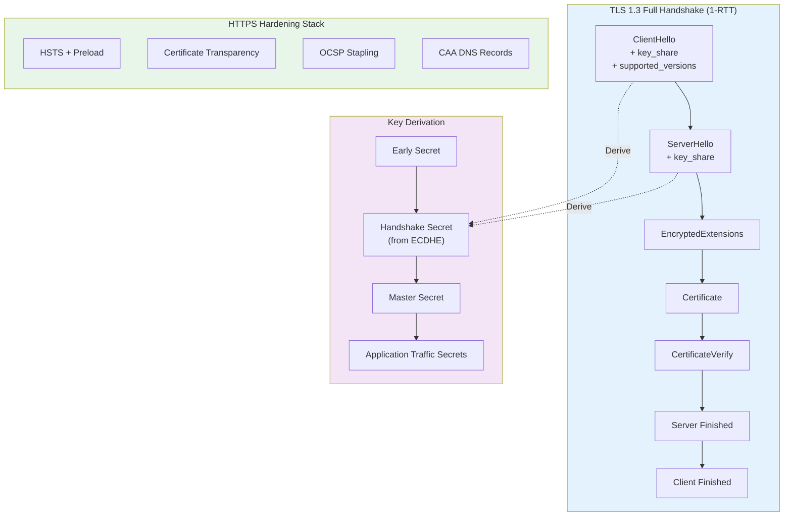
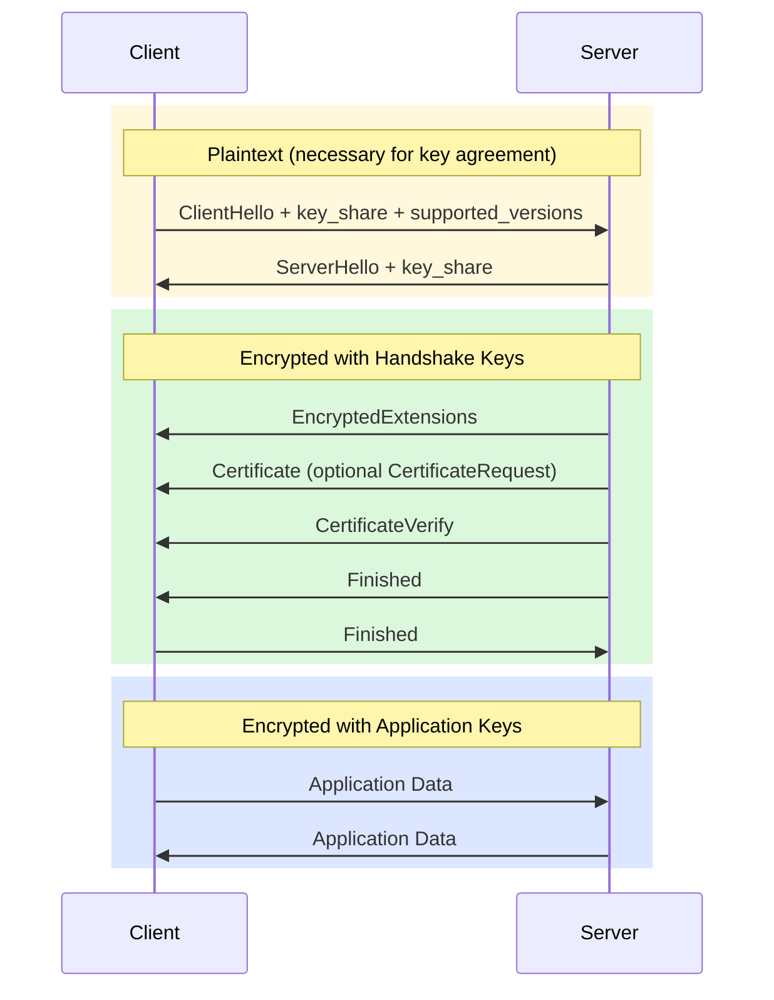
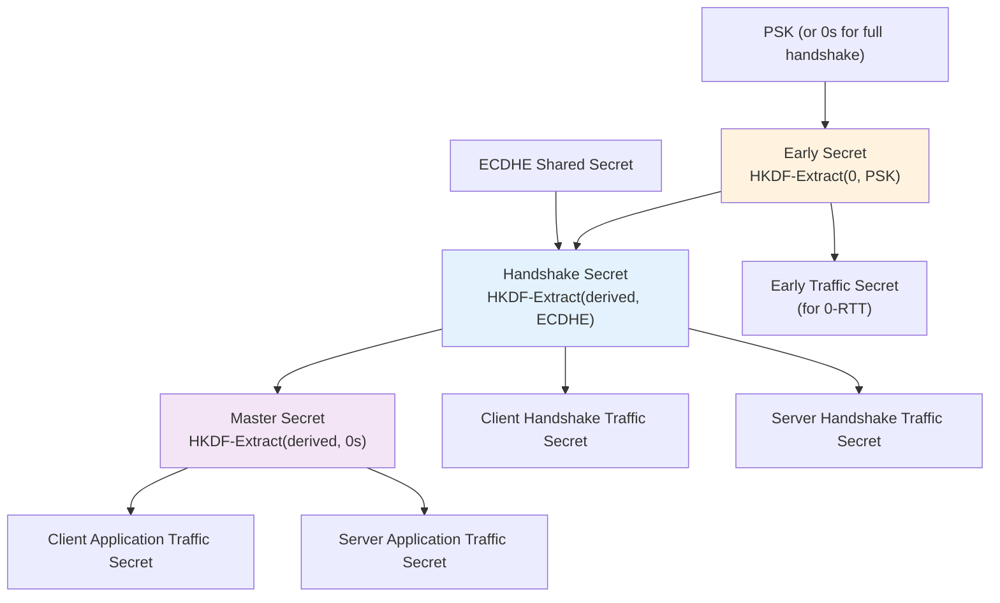
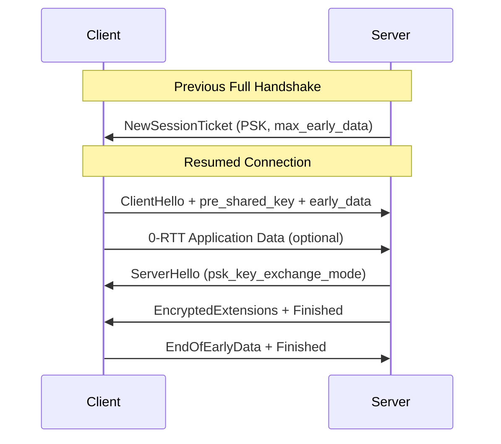
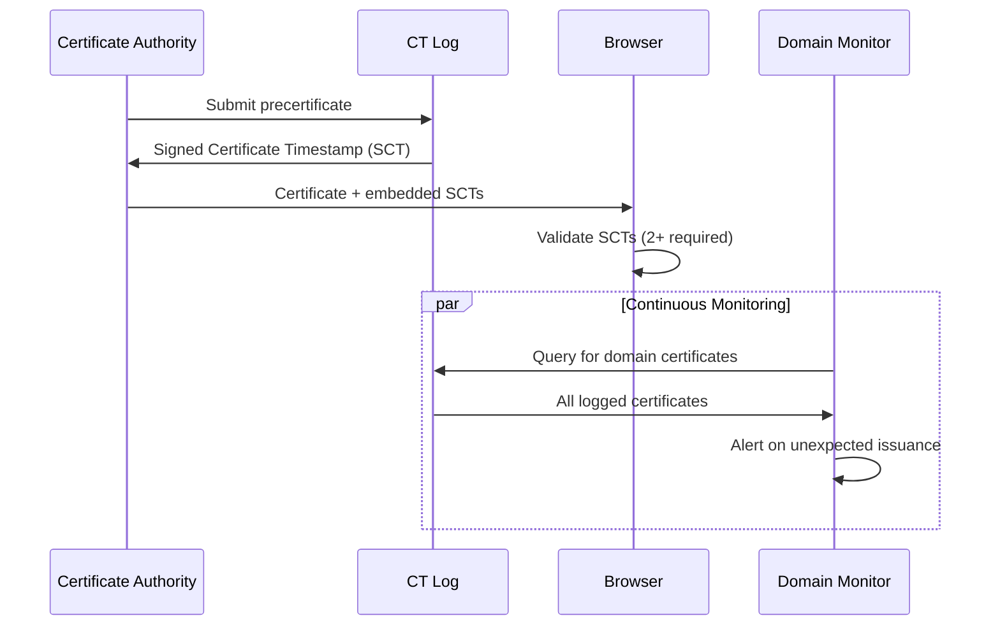
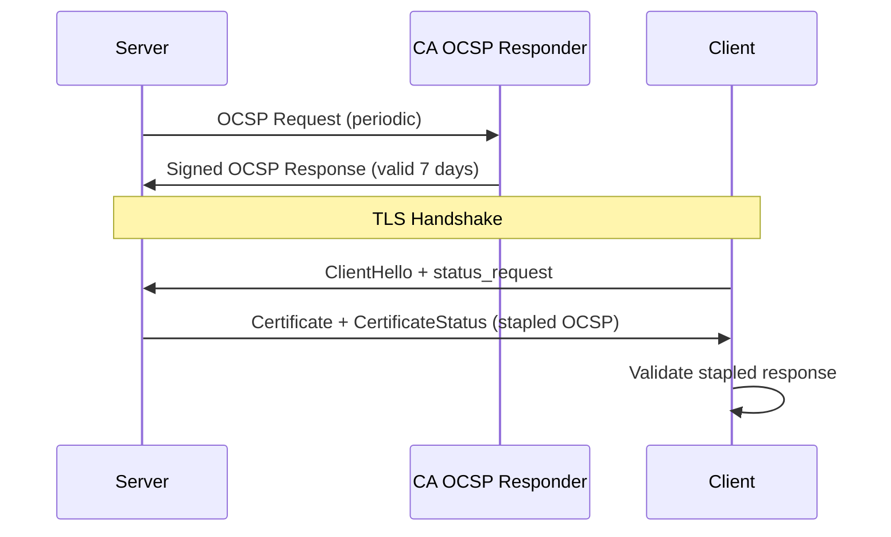

# TLS 1.3 Handshake and HTTPS Hardening

How TLS 1.3 achieves 1-RTT handshakes, enforces forward secrecy by design, and what production HTTPS hardening actually requires—from certificate chains and OCSP stapling to HSTS preload and 0-RTT replay risks.

<figure>



<figcaption>TLS 1.3 handshake flow, key derivation hierarchy, and the HTTPS hardening stack that protects production deployments.</figcaption>
</figure>

## Abstract

TLS 1.3 is a clean-slate redesign that mandates forward secrecy, removes legacy cryptographic baggage, and cuts handshake latency in half. The core insight: by restricting key exchange to ephemeral (EC)DHE and having clients speculatively send key shares in ClientHello, both parties can derive session keys after a single round-trip. Everything after ServerHello is encrypted—including certificates—and the only cipher suites allowed are AEAD (Authenticated Encryption with Associated Data) constructions.

HTTPS hardening extends beyond TLS configuration. HSTS (HTTP Strict Transport Security) prevents protocol downgrade attacks but has a first-visit vulnerability that only preload lists solve. Certificate Transparency makes misissued certificates publicly detectable. OCSP (Online Certificate Status Protocol) stapling was designed to fix revocation checking's privacy and performance problems, but browsers soft-fail on OCSP errors anyway—rendering revocation checking largely theatrical. The industry has shifted toward short-lived certificates as the practical solution.

0-RTT resumption trades security for latency: early data can be replayed across connections, so it's safe only for idempotent requests—and even then, information disclosure remains a risk.

## TLS 1.3 Handshake: Why 1-RTT Is Possible

### The Design Constraint That Changed Everything

TLS 1.2 required two round-trips because key exchange parameters were negotiated before key material was sent. The client proposed cipher suites, the server selected one, then the client generated key exchange values based on that selection. This sequential dependency forced an extra RTT.

TLS 1.3 eliminates this dependency through two design decisions:

1. **Restricted key exchange to (EC)DHE only**—no RSA key transport, no static Diffie-Hellman
2. **Clients speculatively send key shares** for likely curves in the initial ClientHello

Since the set of acceptable curves is small and well-known (X25519, P-256, P-384), clients can predict which the server will accept. If the prediction is wrong, the server sends a HelloRetryRequest—but this is rare in practice.

> RFC 8446: "The client can simply choose to send DH key shares in the first message instead of waiting until the server has confirmed which key shares it is willing to support."

### Message Sequence: What Crosses the Wire



**Phase 1: Key Exchange (Plaintext)**

The ClientHello contains:

- Random 256-bit nonce
- Supported cipher suites (AEAD + hash pairs)
- `supported_versions` extension (must include 0x0304 for TLS 1.3)
- `key_share` extension with (EC)DHE public values
- Optional `pre_shared_key` for resumption

The ServerHello responds with:

- Selected cipher suite
- Server's (EC)DHE key share
- `supported_versions` confirming TLS 1.3

At this point, both parties can compute the shared secret and derive handshake traffic keys.

**Phase 2: Server Parameters (Encrypted)**

EncryptedExtensions carries metadata that was plaintext in TLS 1.2:

- ALPN (Application-Layer Protocol Negotiation) selection
- Server name handling
- Other extensions not required for key exchange

This encryption protects metadata that reveals application behavior—which protocols are in use, which hostname was requested.

**Phase 3: Authentication (Encrypted)**

The Certificate message contains the server's certificate chain. CertificateVerify proves private key ownership by signing the entire handshake transcript hash:

> RFC 8446: "This message provides key confirmation, binds the endpoint's identity to the exchanged keys."

The Finished messages are HMAC-based MACs over the handshake transcript, confirming integrity and providing key confirmation.

### What TLS 1.3 Removed (and Why)

| Removed Feature              | Vulnerability                                                                                            | RFC 8446 Rationale                                                         |
| ---------------------------- | -------------------------------------------------------------------------------------------------------- | -------------------------------------------------------------------------- |
| Static RSA key transport     | No forward secrecy; passive attackers who later compromise the server key can decrypt historical traffic | "All public-key based key exchange mechanisms now provide forward secrecy" |
| Static Diffie-Hellman        | Same forward secrecy problem                                                                             | Ephemeral keys required for all handshakes                                 |
| Server-chosen DHE parameters | LogJam, WeakDH attacks using weak primes                                                                 | Fixed named curves only (P-256, P-384, P-521, X25519, X448)                |
| Compression                  | CRIME attack extracts secrets via compression ratio oracle                                               | Removed entirely                                                           |
| Renegotiation                | Downgrade attacks, injection vulnerabilities                                                             | "Renegotiation is not possible when TLS 1.3 has been negotiated"           |
| CBC mode ciphers             | POODLE, Lucky Thirteen padding oracles                                                                   | AEAD only                                                                  |
| SHA-1 signatures             | Collision attacks (SHAttered, 2017)                                                                      | SHA-256 minimum                                                            |
| DSA                          | Performance, security concerns                                                                           | ECDSA, EdDSA, RSA-PSS only                                                 |

## Forward Secrecy: Non-Negotiable by Design

### Why Ephemeral Keys Matter

In RSA key transport (TLS 1.2), the client encrypts the premaster secret with the server's RSA public key. If an attacker:

1. Records encrypted sessions today
2. Compromises the server's RSA private key years later
3. Can decrypt all historical traffic

This is devastating against nation-state adversaries who archive encrypted traffic for later cryptanalysis.

TLS 1.3 mandates ephemeral (EC)DHE for every connection:

```
Session Key = HKDF(
  ECDHE_shared_secret,  // Ephemeral—discarded after use
  handshake_transcript, // Binds to this specific connection
  context_labels        // Domain separation
)
```

Both client and server generate fresh key pairs per connection. Even if the server's certificate private key is later compromised, past session keys cannot be derived—the ephemeral private keys have been destroyed.

### Key Schedule: Domain Separation

TLS 1.3 derives multiple independent keys from a single handshake using HKDF (HMAC-based Key Derivation Function) with different labels:



Each derived key is cryptographically independent. Compromising one doesn't compromise others. This is why handshake encryption uses different keys than application data encryption.

## Cipher Suites: AEAD Only

TLS 1.3 defines exactly five cipher suites, all using Authenticated Encryption with Associated Data (AEAD):

| Cipher Suite                 | Algorithm         | Hash    | Use Case                    |
| ---------------------------- | ----------------- | ------- | --------------------------- |
| TLS_AES_128_GCM_SHA256       | AES-128-GCM       | SHA-256 | Default, widely supported   |
| TLS_AES_256_GCM_SHA384       | AES-256-GCM       | SHA-384 | Higher security margin      |
| TLS_CHACHA20_POLY1305_SHA256 | ChaCha20-Poly1305 | SHA-256 | Mobile, non-AES-NI hardware |
| TLS_AES_128_CCM_SHA256       | AES-128-CCM       | SHA-256 | NIST compliance             |
| TLS_AES_128_CCM_8_SHA256     | AES-128-CCM-8     | SHA-256 | IoT, constrained devices    |

> RFC 8446: "The list of supported symmetric encryption algorithms has been pruned of all algorithms that are considered legacy. Those that remain are all Authenticated Encryption with Associated Data (AEAD) algorithms."

### Cipher Suite Structure Change

TLS 1.2 cipher suites were monolithic, specifying everything in one identifier:

```
TLS_ECDHE_RSA_WITH_AES_128_GCM_SHA256
└─────┬────┘ └─┬─┘     └────┬────┘ └───┬──┘
  Key Exch   Auth      Encryption   MAC
```

TLS 1.3 splits negotiation into three independent selections:

1. **AEAD + Hash** (cipher suite) — symmetric encryption
2. **Key Exchange** — always (EC)DHE, negotiated via `supported_groups`
3. **Signature** — RSA-PSS, ECDSA, EdDSA, negotiated via `signature_algorithms`

This separation enables cleaner security analysis and simpler implementation.

## Session Resumption: PSK and 0-RTT

### How PSK Resumption Works

After a successful handshake, the server sends NewSessionTicket messages containing:

- **ticket**: Opaque blob (server-encrypted session state)
- **ticket_lifetime**: Maximum validity (up to 7 days)
- **ticket_age_add**: Random value to obscure ticket age
- **early_data**: Maximum size of 0-RTT data the server will accept

The client stores this and includes the PSK identity in subsequent ClientHello messages via the `pre_shared_key` extension.



### PSK Binder: Cryptographic Binding

The PSK binder prevents attackers from replaying ClientHello messages with different PSKs:

```
binder = HMAC(
  binder_key,           // Derived from PSK
  Transcript(ClientHello[:-binders])  // Everything except binders
)
```

The server validates the binder before accepting the PSK. This binds the PSK to the specific handshake transcript.

### 0-RTT Early Data: The Security Trade-off

0-RTT allows clients to send application data in the first flight, encrypted with keys derived only from the PSK. This data has weaker security properties:

> RFC 8446: "The security properties for 0-RTT data are weaker than those for other kinds of TLS data. Specifically, this data is not forward secret, as it is encrypted solely under keys derived using the offered PSK."

**Critical vulnerability**: 0-RTT data can be replayed.

Unlike regular TLS data (which incorporates the server's random value), 0-RTT data depends only on:

- The PSK
- The client's random value

An attacker who captures 0-RTT packets can replay them to the server. The server has no way to distinguish the replay from the original.

### When 0-RTT Is Dangerous

**Replay attack scenario**:

1. User sends `POST /transfer {"amount": 1000, "to": "attacker"}` via 0-RTT
2. Attacker captures the encrypted ClientHello + early data
3. Attacker replays it within the ticket age window (typically 10 seconds)
4. Server processes the duplicate transfer

**Even idempotent requests have risks**:

- **Information disclosure**: Replaying GET requests reveals the target URL and response to attackers
- **Side effects**: Logging, rate limiting, cache updates still occur
- **Timing attacks**: Response time differences can leak information

### Server-Side Protections

RFC 8446 suggests several anti-replay mechanisms:

1. **Single-use tickets**: Mark tickets as consumed after first use
2. **Timestamp validation**: Reject early data with implausible `obfuscated_ticket_age`
3. **ClientHello recording**: Store unique identifiers and reject duplicates

RFC 8470 adds HTTP-level protections:

- **Early-Data header**: Signals to origin servers that replay is possible
- **425 Too Early**: Servers reject requests they can't safely process via 0-RTT

```http
HTTP/1.1 425 Too Early
Content-Type: text/plain

This request cannot be processed in 0-RTT mode.
Please retry without early data.
```

**CDN behavior** (Cloudflare, Akamai, AWS):

- Accept 0-RTT only for GET, HEAD, OPTIONS
- Reject state-changing methods (POST, PUT, DELETE)
- Add `CF-0RTT-Unique` or similar headers for origin tracking
- Implement short replay windows (shorter than ticket lifetime)

### Forward Secrecy with PSK: (EC)DHE + PSK Mode

PSK-only mode lacks forward secrecy—if the PSK is compromised, all sessions using it can be decrypted.

PSK-(EC)DHE mode combines both:

- PSK provides authentication
- (EC)DHE provides forward secrecy

The session key depends on both the PSK and ephemeral (EC)DHE values. Compromising the PSK alone doesn't allow decryption of past sessions.

## HSTS: Preventing Protocol Downgrade

### The Mechanism

HSTS (HTTP Strict Transport Security, RFC 6797) directs browsers to:

1. Upgrade all HTTP requests to HTTPS automatically
2. Refuse to proceed on certificate errors (no user override)
3. Remember the policy for `max-age` seconds

```http
Strict-Transport-Security: max-age=63072000; includeSubDomains; preload
```

| Directive           | Purpose                                         |
| ------------------- | ----------------------------------------------- |
| `max-age`           | Policy duration in seconds (2 years = 63072000) |
| `includeSubDomains` | Apply to all subdomains                         |
| `preload`           | Signal intent for browser preload lists         |

### The First-Visit Vulnerability

HSTS has a bootstrap problem: browsers can't know about a site's policy until after the first visit. If an attacker intercepts that first connection (SSL stripping, protocol downgrade), the policy never reaches the browser.

**Attack scenario**:

1. User types `example.com` (no explicit https://)
2. Attacker intercepts the initial HTTP request
3. Attacker establishes HTTPS to the real server
4. Attacker serves HTTP to the user
5. User never receives HSTS header

### Preload Lists: The Solution

Browser preload lists (maintained by Google, shared across Chrome, Firefox, Safari, Edge) contain domains that must always use HTTPS—before any network request.

**Submission requirements** (hstspreload.org):

- Valid HTTPS on the apex domain
- `max-age` at least 31536000 (1 year)
- `includeSubDomains` directive
- `preload` directive
- All subdomains must support HTTPS

**Operational consideration**: Once preloaded, removal takes months. Ensure all subdomains (including staging, internal tools) support HTTPS before submitting.

## Certificate Transparency: Detecting Misissued Certificates

### The Problem CT Solves

The PKI's fundamental weakness: any trusted Certificate Authority (CA) can issue a certificate for any domain. A compromised or coerced CA can issue a certificate for `google.com` to an attacker.

CT (RFC 9162, replacing RFC 6962) makes all certificate issuance publicly auditable.

### How CT Works



**Components**:

1. **CT Logs**: Append-only Merkle trees of certificates
2. **SCTs** (Signed Certificate Timestamps): Promises to include certificate within Maximum Merge Delay (24 hours)
3. **Monitors**: Watch logs for certificates issued to specific domains

**Browser enforcement**:

- Chrome requires SCTs from 2+ independent logs
- SCTs can be delivered via:
  - X.509 extension (embedded by CA)
  - TLS extension (`signed_certificate_timestamp`)
  - OCSP response

### What CT Doesn't Do

CT is detective, not preventive. A misissued certificate can be used for up to 24 hours (the MMD) before appearing in logs. CT enables domain owners to discover misissued certificates—it doesn't prevent their use.

## OCSP and Revocation: The Uncomfortable Truth

### Why Revocation Matters (In Theory)

When a certificate's private key is compromised, revocation should invalidate it before expiration. Two mechanisms exist:

**CRL (Certificate Revocation Lists)**:

- CA publishes list of revoked serial numbers
- Clients download and cache periodically
- Scales well, privacy-preserving
- Stale revocation data

**OCSP (Online Certificate Status Protocol)**:

- Real-time status queries to CA
- Fresh revocation data
- Privacy concern: CA sees which sites you visit
- Reliability concern: OCSP responder becomes critical path

### OCSP Stapling: The Attempted Fix

OCSP stapling (RFC 6066) lets servers fetch OCSP responses and bundle them with the TLS handshake:



**Benefits**:

- Privacy: CA doesn't see which clients connect
- Performance: No extra RTT for OCSP
- Reliability: Server can cache responses

### Why Browsers Soft-Fail

The critical design flaw: if OCSP fails (network error, timeout, stapled response missing), browsers proceed anyway.

**Why soft-fail**:

- OCSP responder outages would break the web
- Captive portals block OCSP
- Network latency adds user-visible delay

**The security implication**: An attacker who can MITM the connection can also block OCSP traffic. Soft-fail provides zero protection against active attackers.

> "OCSP is not making anyone more secure. Browsers are either not checking it or implementing it in a way that provides no security benefits." — Let's Encrypt, December 2024

### OCSP Must-Staple: The Failed Experiment

The `OCSP Must-Staple` certificate extension signals that connections without stapled OCSP responses should fail. This would convert soft-fail to hard-fail.

**Why it failed**:

- Unreliable server stapling implementations
- If stapled response expires, site goes down
- No major browser adopted enforcement
- Let's Encrypt never supported it

### The Industry Solution: Short-Lived Certificates

Rather than fixing revocation, the industry moved to certificates valid for days instead of years:

- **90-day certificates**: Let's Encrypt default
- **Automated renewal**: Certbot, ACME protocol
- **Limited exposure**: Compromised key is useful for short window

Let's Encrypt announced OCSP service shutdown (August 2025) because revocation checking provides no real security benefit.

## CAA Records: Authorization Before Issuance

### How CAA Works

CAA (Certification Authority Authorization, RFC 8659) DNS records specify which CAs may issue certificates for a domain:

```dns
example.com.    CAA 0 issue "letsencrypt.org"
example.com.    CAA 0 issuewild "digicert.com"
example.com.    CAA 0 iodef "mailto:security@example.com"
```

| Property    | Purpose                                |
| ----------- | -------------------------------------- |
| `issue`     | Authorize CA for standard certificates |
| `issuewild` | Authorize CA for wildcard certificates |
| `iodef`     | Report unauthorized issuance attempts  |

### CA Compliance

The CA/Browser Forum Baseline Requirements mandate CAA checking before issuance. CAs must:

1. Query CAA records for the requested domain
2. Walk up the DNS hierarchy if no records found
3. Refuse issuance if not authorized

**Limitation**: CAA is preventive only. It doesn't invalidate already-issued certificates.

### DNSSEC Integration (2026)

Starting February 2026 (CA/Browser Forum Ballot SC-085v2), CAs must validate DNSSEC for:

- Domain control verification
- CAA checks

If DNSSEC is deployed but validation fails, CAs must refuse issuance. This prevents DNS hijacking attacks on CAA.

## Operational Hardening Checklist

### TLS Configuration

- [ ] Enable TLS 1.3, disable TLS 1.0/1.1
- [ ] Prefer TLS_AES_128_GCM_SHA256, TLS_CHACHA20_POLY1305_SHA256
- [ ] Configure ECDHE curves: X25519, P-256
- [ ] Enable 0-RTT only for sites without state-changing GET requests
- [ ] Set session ticket lifetime ≤ 7 days
- [ ] Rotate session ticket encryption keys regularly

### HTTPS Hardening

- [ ] Deploy HSTS with `max-age=63072000; includeSubDomains`
- [ ] Submit to HSTS preload after verifying all subdomains
- [ ] Enable OCSP stapling (even though browsers soft-fail)
- [ ] Configure CAA records authorizing only your CAs
- [ ] Monitor CT logs for unexpected certificates (crt.sh, Cert Spotter)
- [ ] Use short-lived certificates (90 days or less)

### 0-RTT Policy

- [ ] Accept 0-RTT only for idempotent methods (GET, HEAD, OPTIONS)
- [ ] Configure `Early-Data` header forwarding to origin
- [ ] Implement 425 responses for non-idempotent endpoints
- [ ] Consider disabling 0-RTT entirely for high-security applications

### Certificate Management

- [ ] Automate certificate renewal (ACME/Certbot)
- [ ] Include full certificate chain (leaf + intermediates)
- [ ] Monitor certificate expiration
- [ ] Test certificate deployment with SSL Labs

## Conclusion

TLS 1.3 represents a decade of lessons learned from attacks on TLS 1.2. The protocol eliminates legacy cryptographic modes, mandates forward secrecy, and reduces handshake latency—all through careful design constraints rather than optional best practices.

HTTPS hardening beyond TLS requires understanding what each mechanism actually provides:

- **HSTS** prevents downgrade but needs preload for first-visit protection
- **Certificate Transparency** enables detection but not prevention of misissued certificates
- **OCSP stapling** improves privacy and performance but browsers soft-fail anyway
- **CAA** prevents unauthorized issuance but doesn't revoke existing certificates

The uncomfortable truth: revocation checking has largely failed. Short-lived certificates and CT monitoring provide more practical security than OCSP ever did.

0-RTT offers real latency benefits but introduces replay risks that require application-level mitigation. For most sites, the trade-off isn't worth it unless you've carefully analyzed which endpoints can safely accept replayed requests.

## Appendix

### Prerequisites

- TCP/IP fundamentals
- Public key cryptography basics (RSA, ECDH, signatures)
- X.509 certificate structure
- HTTP/1.1 and HTTP/2 understanding

### Terminology

- **AEAD**: Authenticated Encryption with Associated Data—encryption providing confidentiality and integrity in a single operation
- **(EC)DHE**: Elliptic Curve Diffie-Hellman Ephemeral—key exchange generating fresh keys per session
- **Forward Secrecy**: Property where compromise of long-term keys doesn't compromise past session keys
- **HKDF**: HMAC-based Key Derivation Function—derives multiple cryptographic keys from a single secret
- **OCSP**: Online Certificate Status Protocol—real-time certificate revocation checking
- **PSK**: Pre-Shared Key—symmetric key established in a previous session for resumption
- **SCT**: Signed Certificate Timestamp—proof of submission to a Certificate Transparency log
- **STEK**: Session Ticket Encryption Key—server key used to encrypt session tickets

### Summary

- TLS 1.3 achieves 1-RTT handshakes by having clients speculatively send (EC)DHE key shares
- Forward secrecy is mandatory—no cipher suites without ephemeral key exchange exist
- Everything after ServerHello is encrypted, including certificates and metadata
- 0-RTT early data trades security (replayable) for latency; safe only for idempotent requests
- HSTS prevents protocol downgrade but preload is required for first-visit protection
- Certificate Transparency detects misissued certificates post-facto; doesn't prevent use
- Browser OCSP soft-fail means revocation checking provides no security against active attackers
- Short-lived certificates are the industry's practical answer to revocation's failure

### References

- [RFC 8446 - The Transport Layer Security (TLS) Protocol Version 1.3](https://datatracker.ietf.org/doc/html/rfc8446) — Authoritative TLS 1.3 specification
- [RFC 8470 - Using Early Data in HTTP](https://datatracker.ietf.org/doc/html/rfc8470) — HTTP integration for 0-RTT, Early-Data header, 425 status code
- [RFC 6797 - HTTP Strict Transport Security (HSTS)](https://datatracker.ietf.org/doc/html/rfc6797) — HSTS specification
- [RFC 9162 - Certificate Transparency Version 2.0](https://datatracker.ietf.org/doc/html/rfc9162) — Current CT specification (replaces RFC 6962)
- [RFC 8659 - DNS Certification Authority Authorization (CAA) Resource Record](https://datatracker.ietf.org/doc/html/rfc8659) — CAA record specification
- [RFC 6066 - Transport Layer Security (TLS) Extensions](https://datatracker.ietf.org/doc/html/rfc6066) — OCSP stapling (status_request extension)
- [RFC 6961 - TLS Multiple Certificate Status Request Extension](https://datatracker.ietf.org/doc/html/rfc6961) — status_request_v2 for multiple OCSP responses
- [HSTS Preload Submission](https://hstspreload.org/) — Browser preload list submission portal
- [Cloudflare: A Detailed Look at RFC 8446](https://blog.cloudflare.com/rfc-8446-aka-tls-1-3/) — Practical TLS 1.3 deployment insights
- [Cloudflare: Introducing 0-RTT](https://blog.cloudflare.com/introducing-0-rtt/) — 0-RTT implementation and replay protection
- [Let's Encrypt: Ending OCSP Support](https://letsencrypt.org/2024/12/05/ending-ocsp) — Industry rationale for abandoning OCSP
- [Trail of Bits: What Developers Need to Know About TLS Early Data](https://blog.trailofbits.com/2019/03/25/what-application-developers-need-to-know-about-tls-early-data-0rtt/) — Application-level 0-RTT security guidance
