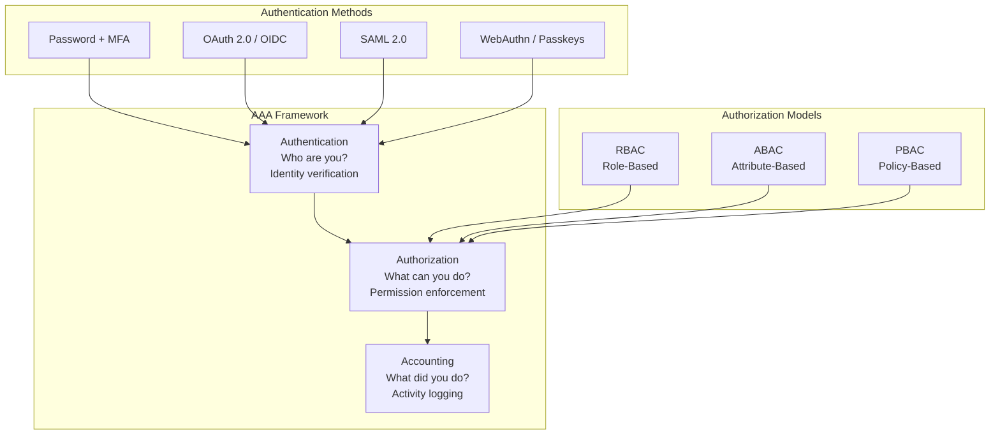
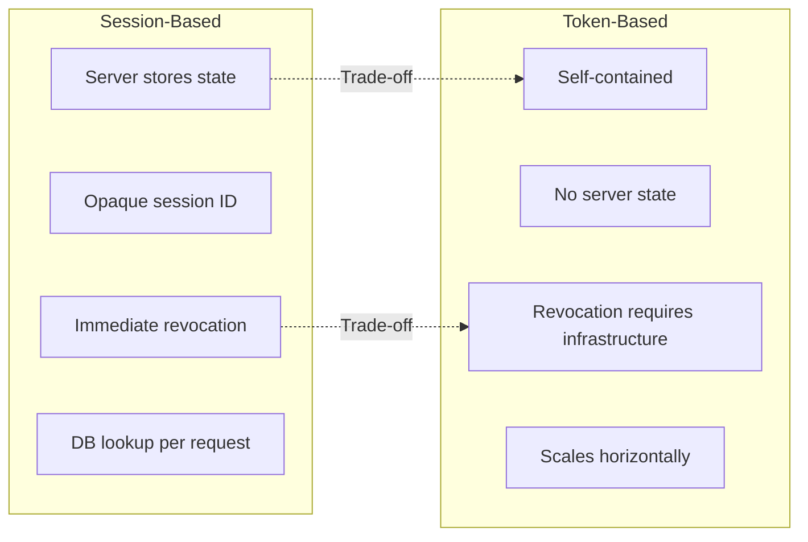

# Authentication Foundations: Sessions, Tokens, and Trust

An in-depth technical analysis of AAA frameworks for expert practitioners, exploring modern authentication mechanisms, authorization models, access control paradigms, and their implementation patterns with Node.js examples.

<figure>



<figcaption>AAA (Authentication, Authorization, Accounting) framework with authentication methods and authorization models</figcaption>

</figure>

## Abstract

**Mental model**: Authentication establishes _who you are_; authorization determines _what you can do_; accounting records _what you did_. The core tension in auth systems is **security vs. usability vs. operational complexity**—every design choice trades between these.



### Core Design Trade-offs

| Decision           | Option A                 | Option B                | When to Choose A                         |
| ------------------ | ------------------------ | ----------------------- | ---------------------------------------- |
| **State**          | Sessions (server stores) | Tokens (self-contained) | Need immediate revocation, single domain |
| **Credential**     | Password + MFA           | Passwordless (WebAuthn) | Legacy systems, recovery requirements    |
| **Authorization**  | RBAC (role-based)        | ABAC (attribute-based)  | Permission model is relatively static    |
| **Token lifetime** | Short (5-15 min)         | Long (1+ hour)          | High-security APIs, sensitive operations |
| **Storage**        | HttpOnly cookies         | Memory + refresh token  | Traditional web apps without CORS needs  |

### Key Invariants

- **Tokens cannot be truly revoked** without infrastructure (blocklist or short expiry + refresh rotation)
- **Sessions scale vertically**; tokens scale horizontally
- **Passwords are phishable**; WebAuthn is origin-bound and phishing-resistant
- **RBAC is simple but rigid**; ABAC is flexible but operationally complex

## Core Concepts and Definitions

### Authentication vs Authorization vs Access Control

**Authentication** is the process of verifying the identity of a user, device, or system to ensure they are who they claim to be. It answers the question "Who are you?" and involves validating credentials such as passwords, biometric data, or cryptographic tokens.

**Authorization** determines what an authenticated entity is permitted to access or what actions they can perform within a system. It answers the question "What are you allowed to do?" and occurs after successful authentication.

**Access Control** encompasses the broader framework that combines authentication and authorization policies to enforce security decisions. It includes the mechanisms, policies, and technologies used to manage and control access to resources.

### The AAA Framework

The AAA framework extends beyond basic authentication and authorization:

- **Authentication**: Identity verification
- **Authorization**: Permission enforcement
- **Accounting/Auditing**: Activity logging and monitoring

This framework ensures comprehensive security coverage from initial identity verification through ongoing activity monitoring.

---

## Session vs Token Architecture

The fundamental architectural decision in authentication is whether to store session state server-side or encode it in client-held tokens.

### Design Rationale

**Sessions** emerged from traditional server-rendered applications where the server controlled the entire request lifecycle. The server maintains a session store (in-memory, Redis, database), generates an opaque session ID, and sets it in a cookie. Each request includes the cookie; the server looks up associated state.

**Tokens** (particularly JWTs) emerged with the rise of SPAs (Single-Page Applications), mobile apps, and microservices. The token contains all necessary claims (user ID, roles, expiration), cryptographically signed by the issuer. Validation requires only the public key—no database lookup.

### Trade-off Matrix

| Aspect                     | Sessions                      | Tokens                                   |
| -------------------------- | ----------------------------- | ---------------------------------------- |
| **State location**         | Server                        | Client                                   |
| **Revocation**             | Immediate (delete session)    | Difficult (wait for expiry or blocklist) |
| **Scalability**            | Requires shared session store | Stateless, scales horizontally           |
| **Cross-domain**           | Cookie scope limitations      | CORS-friendly (Bearer header)            |
| **Token size**             | Small (opaque ID)             | Large (encoded claims)                   |
| **Security on compromise** | Attacker needs session ID     | Attacker has all claims until expiry     |
| **Database dependency**    | Every request                 | None for validation                      |

### When to Choose Sessions

1. **Immediate revocation required**: Logout must instantly invalidate access (financial, healthcare)
2. **Single-domain application**: No CORS complexity
3. **Sensitive data**: Minimize client-side exposure of claims
4. **Existing infrastructure**: Session stores already in place

### When to Choose Tokens

1. **Microservices**: Services validate tokens independently without coordination
2. **Mobile apps**: No cookie support; tokens in secure storage (Keychain/Keystore)
3. **Third-party API access**: OAuth flows with external consumers
4. **Horizontal scaling**: No shared session store required

### Hybrid Approach (Recommended for Web SPAs)

Modern best practice combines both:

- **Access token**: Short-lived (5-15 min), stored in memory (React state/context)
- **Refresh token**: Long-lived, stored in HttpOnly Secure SameSite=Strict cookie

Memory storage protects against XSS (no JavaScript access to tokens on disk); HttpOnly cookies protect refresh tokens from script access while enabling silent renewal.

---

## Authentication Mechanisms

### Password-Based Authentication

Traditional username/password authentication remains prevalent despite inherent vulnerabilities. Modern implementations require secure password storage using memory-hard hashing functions.

#### Password Hashing: Argon2id vs Bcrypt

**Argon2id** (winner of the 2015 Password Hashing Competition) is the current OWASP recommendation for new systems. It resists both GPU attacks (via memory hardness) and side-channel attacks (via the "id" variant combining Argon2i and Argon2d).

> **Prior to 2015:** Bcrypt was the recommended standard. Systems using bcrypt remain secure but should plan migration to Argon2id for new implementations.

**OWASP recommended parameters (as of 2025):**

| Algorithm                  | Configuration                              | Target                            |
| -------------------------- | ------------------------------------------ | --------------------------------- |
| **Argon2id**               | 19 MiB memory, 2 iterations, parallelism 1 | Primary recommendation            |
| **Argon2id (high memory)** | 46 MiB memory, 1 iteration, parallelism 1  | When resources allow              |
| **Bcrypt**                 | Cost factor 10+ (12 recommended)           | Legacy systems, FIPS not required |
| **PBKDF2-HMAC-SHA256**     | 600,000+ iterations                        | FIPS-140 compliance required      |

**Tuning principle**: Hash computation should take under 1 second to avoid DoS vulnerabilities from repeated auth attempts.

```javascript title="password-manager.js" collapse={1-2, 26-33}
const bcrypt = require("bcrypt")

class PasswordManager {
  constructor() {
    this.saltRounds = 12 // OWASP minimum as of 2025; adjust based on hardware
  }

  async hashPassword(plainPassword) {
    try {
      const salt = await bcrypt.genSalt(this.saltRounds)
      const hashedPassword = await bcrypt.hash(plainPassword, salt)
      return hashedPassword
    } catch (error) {
      throw new Error("Password hashing failed")
    }
  }

  async verifyPassword(plainPassword, hashedPassword) {
    try {
      return await bcrypt.compare(plainPassword, hashedPassword)
    } catch (error) {
      throw new Error("Password verification failed")
    }
  }
}

// Usage example
const passwordManager = new PasswordManager()

// During registration
const hashedPassword = await passwordManager.hashPassword("userPassword123")

// During login
const isValid = await passwordManager.verifyPassword("userPassword123", hashedPassword)
```

**Bcrypt limitation**: Maximum 72 bytes input. For longer passwords, pre-hash with HMAC-SHA384 and Base64 encode before bcrypt.

### Multi-Factor Authentication (MFA)

MFA implementations leverage multiple authentication factors categorized into:

1. **Something You Know** (Knowledge): Passwords, PINs, security questions
2. **Something You Have** (Possession): Hardware tokens, mobile devices, smart cards
3. **Something You Are** (Inherence): Biometric traits like fingerprints, facial recognition

#### Time-based One-Time Password (TOTP) Implementation

TOTP generates time-based codes using a shared secret and current timestamp. The `window` parameter allows for clock drift between client and server ([RFC 6238](https://datatracker.ietf.org/doc/html/rfc6238)).

```javascript title="totp-manager.js" collapse={1-3, 33-58}
const speakeasy = require("speakeasy")
const QRCode = require("qrcode")

class TOTPManager {
  generateSecret(userEmail, serviceName) {
    return speakeasy.generateSecret({
      name: userEmail,
      issuer: serviceName,
      length: 32,
    })
  }

  async generateQRCode(secret) {
    const otpauthURL = speakeasy.otpauthURL({
      secret: secret.ascii,
      label: secret.name,
      issuer: secret.issuer,
      algorithm: "sha1",
    })

    return await QRCode.toDataURL(otpauthURL)
  }

  verifyTOTP(token, secret) {
    return speakeasy.totp.verify({
      secret: secret,
      encoding: "ascii",
      token: token,
      window: 2, // Allow 2-step tolerance for clock drift
    })
  }
}

// Usage in Express middleware
const totpManager = new TOTPManager()

app.post("/enable-mfa", async (req, res) => {
  const { userId } = req.body
  const secret = totpManager.generateSecret(req.user.email, "YourServiceName")

  // Store secret in database associated with user
  await User.updateOne({ _id: userId }, { totpSecret: secret.base32, mfaEnabled: false })

  const qrCode = await totpManager.generateQRCode(secret)
  res.json({ qrCode, secret: secret.base32 })
})

app.post("/verify-mfa", async (req, res) => {
  const { token } = req.body
  const user = await User.findById(req.user.id)

  const verified = totpManager.verifyTOTP(token, user.totpSecret)

  if (verified) {
    await User.updateOne({ _id: req.user.id }, { mfaEnabled: true })
    res.json({ success: true })
  } else {
    res.status(400).json({ error: "Invalid token" })
  }
})
```

### WebAuthn and Passkeys

WebAuthn (Web Authentication API) uses asymmetric cryptography—the private key never leaves the authenticator, and credentials are origin-bound, making them phishing-resistant.

> **WebAuthn Level 3 (W3C Candidate Recommendation, January 2026)** adds credential backup state signaling, cross-origin authentication, supplemental public keys, and client capability discovery.

#### Passkey Syncing (Multi-Device Credentials)

Traditional WebAuthn credentials were bound to a single device. **Passkeys** (synced credentials) enable cross-device availability:

| Provider      | Sync Scope                               | Mechanism                               |
| ------------- | ---------------------------------------- | --------------------------------------- |
| **Apple**     | Apple devices only                       | iCloud Keychain (E2E encrypted)         |
| **Google**    | Android, Chrome (all platforms), iOS 17+ | Google Password Manager (E2E encrypted) |
| **Microsoft** | Windows, Android                         | Microsoft account                       |

**Critical limitation**: Apple and Google do not sync passkeys between their ecosystems. Google currently offers the broadest cross-platform sync (Android + Apple + Windows via Chrome).

**Design rationale for origin binding**: The credential's `rpId` (Relying Party ID) is bound to the origin. If a user is phished to `evil-bank.com`, the credential registered for `bank.com` cannot be used—the authenticator refuses to sign a challenge for a different origin.

```javascript title="webauthn-manager.js" collapse={1-2, 35-52}
// Client-side WebAuthn registration
class WebAuthnManager {
  async registerCredential(userInfo) {
    try {
      // Get challenge from server
      const challengeResponse = await fetch("/webauthn/register/begin", {
        method: "POST",
        headers: { "Content-Type": "application/json" },
        body: JSON.stringify({ username: userInfo.username }),
      })

      const challenge = await challengeResponse.json()

      // Create credential - origin-bound, preventing phishing attacks
      const credential = await navigator.credentials.create({
        publicKey: {
          challenge: new Uint8Array(challenge.challenge),
          rp: { name: "Your Service" },
          user: {
            id: new TextEncoder().encode(userInfo.username),
            name: userInfo.username,
            displayName: userInfo.displayName,
          },
          pubKeyCredParams: [{ alg: -7, type: "public-key" }], // ES256
          authenticatorSelection: {
            authenticatorAttachment: "platform",
            userVerification: "required",
          },
        },
      })

      return credential
    } catch (error) {
      console.error("WebAuthn registration failed:", error)
      throw error
    }
  }

  // Send credential to server for storage
  async completeRegistration(credential) {
    const registrationResponse = await fetch("/webauthn/register/finish", {
      method: "POST",
      headers: { "Content-Type": "application/json" },
      body: JSON.stringify({
        id: credential.id,
        rawId: Array.from(new Uint8Array(credential.rawId)),
        response: {
          clientDataJSON: Array.from(new Uint8Array(credential.response.clientDataJSON)),
          attestationObject: Array.from(new Uint8Array(credential.response.attestationObject)),
        },
      }),
    })
    return await registrationResponse.json()
  }
}
```

---

## Authorization Models and Frameworks

### Role-Based Access Control (RBAC)

RBAC assigns permissions to roles rather than individual users, simplifying permission management in large organizations.

**Design rationale**: RBAC emerged from the observation that permission requirements correlate with job functions, not individuals. By mapping users → roles → permissions, administration scales with organizational structure rather than user count ([NIST RBAC Model](https://csrc.nist.gov/projects/role-based-access-control)).

**When RBAC works well**:

- Permission model maps to organizational hierarchy
- Roles are relatively stable
- Audit requirements focus on role membership

**When RBAC struggles**:

- Dynamic permissions based on resource attributes (e.g., "own documents only")
- Context-dependent access (time of day, location)
- Fine-grained permissions that would require role explosion

```javascript title="rbac-manager.js" collapse={1-6, 56-77}
class RBACManager {
  constructor() {
    this.roles = new Map()
    this.userRoles = new Map()
    this.permissions = new Map()
  }

  defineRole(roleName, permissions = []) {
    this.roles.set(roleName, new Set(permissions))
    return this
  }

  assignRoleToUser(userId, roleName) {
    if (!this.userRoles.has(userId)) {
      this.userRoles.set(userId, new Set())
    }
    this.userRoles.get(userId).add(roleName)
    return this
  }

  getUserPermissions(userId) {
    const userRoles = this.userRoles.get(userId) || new Set()
    const permissions = new Set()

    for (const role of userRoles) {
      const rolePermissions = this.roles.get(role) || new Set()
      for (const permission of rolePermissions) {
        permissions.add(permission)
      }
    }

    return permissions
  }

  hasPermission(userId, requiredPermission) {
    const userPermissions = this.getUserPermissions(userId)
    return userPermissions.has(requiredPermission)
  }

  middleware(requiredPermission) {
    return (req, res, next) => {
      const userId = req.user?.id

      if (!userId) {
        return res.status(401).json({ error: "Authentication required" })
      }

      if (!this.hasPermission(userId, requiredPermission)) {
        return res.status(403).json({ error: "Insufficient permissions" })
      }

      next()
    }
  }
}

// Usage example
const rbac = new RBACManager()

// Define roles and permissions
rbac
  .defineRole("admin", ["user:create", "user:read", "user:update", "user:delete"])
  .defineRole("moderator", ["user:read", "user:update"])
  .defineRole("user", ["user:read"])

// Assign roles to users
rbac.assignRoleToUser("user123", "admin").assignRoleToUser("user456", "moderator")

// Use in Express routes
app.get("/admin/users", rbac.middleware("user:read"), (req, res) => {
  // Handle admin user listing
})

app.delete("/admin/users/:id", rbac.middleware("user:delete"), (req, res) => {
  // Handle user deletion
})
```

### Attribute-Based Access Control (ABAC)

ABAC provides fine-grained access control using attributes of users, resources, and environmental factors.

**Design rationale**: ABAC addresses RBAC's rigidity by evaluating policies against dynamic attributes at decision time. Instead of pre-assigning permissions, ABAC asks: "Given these subject attributes, resource attributes, action, and environment, should this request be permitted?" ([NIST ABAC Guide SP 800-162](https://csrc.nist.gov/publications/detail/sp/800-162/final)).

**Attribute categories**:

- **Subject**: User ID, role, department, clearance level, group membership
- **Resource**: Type, owner, classification, sensitivity
- **Action**: Read, write, delete, approve
- **Environment**: Time, location, device trust, network

```javascript title="abac-engine.js" collapse={1-4, 42-66, 72-97}
class ABACPolicyEngine {
  constructor() {
    this.policies = []
  }

  addPolicy(policy) {
    this.policies.push(policy)
    return this
  }

  evaluate(subject, resource, action, environment = {}) {
    for (const policy of this.policies) {
      const result = this.evaluatePolicy(policy, subject, resource, action, environment)
      if (result === "PERMIT") return true
      if (result === "DENY") return false
    }
    return false // Default deny - fail closed
  }

  evaluatePolicy(policy, subject, resource, action, environment) {
    try {
      const context = {
        subject,
        resource,
        action,
        environment,
        time: new Date(),
        hasAttribute: (obj, attr) => obj && obj[attr] !== undefined,
        inRange: (value, min, max) => value >= min && value <= max,
      }

      return policy.condition(context) ? policy.effect : "NOT_APPLICABLE"
    } catch (error) {
      console.error("Policy evaluation error:", error)
      return "DENY" // Fail closed on error
    }
  }

  // ... middleware implementation
}

  middleware() {
    return (req, res, next) => {
      const subject = {
        id: req.user?.id,
        role: req.user?.role,
        department: req.user?.department,
        clearanceLevel: req.user?.clearanceLevel,
      }

      const resource = {
        type: req.route?.path,
        owner: req.params?.userId,
        classification: req.body?.classification,
      }

      const action = req.method.toLowerCase()

      const environment = {
        ipAddress: req.ip,
        time: new Date(),
        userAgent: req.get("User-Agent"),
      }

      if (this.evaluate(subject, resource, action, environment)) {
        next()
      } else {
        res.status(403).json({ error: "Access denied by policy" })
      }
    }
  }

// Usage example - policy definitions
const abac = new ABACPolicyEngine()

abac.addPolicy({
  name: "AdminFullAccess",
  condition: ({ subject }) => subject.role === "admin",
  effect: "PERMIT",
})

abac.addPolicy({
  name: "UserSelfAccess",
  condition: ({ subject, resource, action }) =>
    subject.role === "user" && resource.owner === subject.id && ["get", "put"].includes(action),
  effect: "PERMIT",
})

abac.addPolicy({
  name: "WorkingHoursOnly",
  condition: ({ environment }) => {
    const hour = environment.time.getHours()
    return hour >= 9 && hour <= 17
  },
  effect: "DENY",
})

app.use("/api/sensitive", abac.middleware())
```

---

## Formal Access Control Models

These models provide mathematical foundations for reasoning about security properties. While rarely implemented directly, they inform the design of practical systems.

### Bell-LaPadula Model (Confidentiality)

**Design rationale**: Developed in 1973 for the US Department of Defense to prevent information leakage from higher classification levels to lower ones. Optimizes for _confidentiality_ at the expense of integrity.

**Core rules**:

- **No Read Up (Simple Security)**: A subject cannot read data at a higher classification level
- **No Write Down (Star Property)**: A subject cannot write data to a lower classification level

**Why "no write down"**: Prevents a high-clearance user from copying classified data to an unclassified location. Also prevents Trojan horses from leaking data by writing to lower levels.

**Limitation**: Ignores integrity. A low-clearance user can write to a high-classification document, potentially corrupting it.

### Biba Integrity Model

**Design rationale**: Developed in 1977 as the "dual" of Bell-LaPadula, optimizing for _integrity_ instead of confidentiality. Prevents corruption of high-integrity data by lower-integrity sources.

**Core rules** (inverted from Bell-LaPadula):

- **No Read Down**: A subject cannot read data at a lower integrity level (prevents contamination)
- **No Write Up**: A subject cannot write data to a higher integrity level (prevents corruption)

**Why this matters**: A financial system shouldn't allow unverified external data to modify audited records. A privileged process shouldn't read from untrusted sources.

### Clark-Wilson Model (Commercial Integrity)

**Design rationale**: Developed in 1987 for commercial environments where integrity is paramount but formal clearance levels don't exist. Focuses on well-formed transactions and separation of duties.

**Core concepts**:

- **Constrained Data Items (CDIs)**: Data that must maintain integrity
- **Transformation Procedures (TPs)**: The only way to modify CDIs
- **Integrity Verification Procedures (IVPs)**: Validate CDI integrity
- **Separation of Duties**: No single user can certify and execute a TP

**Example**: In an accounting system, a journal entry (CDI) can only be created by the "create entry" procedure (TP), which requires different users for creation and approval (separation of duties).

---

## Modern Authentication Protocols

### JSON Web Tokens (JWT)

JWT provides a compact, URL-safe means of representing claims between parties.

**Design rationale**: JWTs emerged from the need to pass authenticated state between services without shared session storage. The token is self-contained—all claims are inside—and cryptographically signed to prevent tampering ([RFC 7519](https://datatracker.ietf.org/doc/html/rfc7519)).

**Critical limitation**: JWTs cannot be revoked after issuance without additional infrastructure. If an access token is stolen, it remains valid until expiration.

#### Token Lifetime Recommendations (2025)

| Token Type                       | Lifetime  | Rationale                                       |
| -------------------------------- | --------- | ----------------------------------------------- |
| **Access token (high security)** | 5-15 min  | Minimize exposure window for stolen tokens      |
| **Access token (general)**       | 15-30 min | Balance security with UX (fewer refresh cycles) |
| **Refresh token**                | 1-7 days  | User experience; rotate on each use             |
| **ID token (OIDC)**              | 1 hour    | Per OIDC spec; used only at authentication time |

#### Algorithm Selection

| Algorithm | Type               | Recommendation                                          |
| --------- | ------------------ | ------------------------------------------------------- |
| **EdDSA** | Asymmetric         | First choice for new systems (62x faster than RSA-2048) |
| **ES256** | Asymmetric (ECDSA) | Good balance; widely supported                          |
| **RS256** | Asymmetric (RSA)   | Legacy compatibility; larger keys                       |
| **HS256** | Symmetric          | Avoid in distributed systems (shared secret)            |

**Security rule**: Always verify the `alg` header against an allowlist. The infamous `alg: none` attack exploits servers that accept any algorithm.

```javascript title="jwt-manager.js" collapse={1-3, 15-51, 68-88, 92-130}
const jwt = require("jsonwebtoken")
const crypto = require("crypto")

class JWTManager {
  constructor(options = {}) {
    this.accessTokenSecret = options.accessTokenSecret || process.env.JWT_ACCESS_SECRET
    this.refreshTokenSecret = options.refreshTokenSecret || process.env.JWT_REFRESH_SECRET
    this.accessTokenExpiry = options.accessTokenExpiry || "15m" // Short-lived
    this.refreshTokenExpiry = options.refreshTokenExpiry || "7d"
    this.issuer = options.issuer || "your-service"
    this.audience = options.audience || "your-app"
  }

  // Token generation with jti for revocation tracking
  generateTokenPair(payload) {
    const jti = crypto.randomUUID()
    const now = Math.floor(Date.now() / 1000)

    const accessToken = jwt.sign(
      {
        ...payload,
        type: "access",
        jti,
        iat: now,
        iss: this.issuer,
        aud: this.audience,
      },
      this.accessTokenSecret,
      {
        expiresIn: this.accessTokenExpiry,
        algorithm: "HS256",
      },
    )

    const refreshToken = jwt.sign(
      {
        userId: payload.userId,
        type: "refresh",
        jti,
        iat: now,
        iss: this.issuer,
        aud: this.audience,
      },
      this.refreshTokenSecret,
      {
        expiresIn: this.refreshTokenExpiry,
        algorithm: "HS256",
      },
    )

    return { accessToken, refreshToken, jti }
  }

  verifyAccessToken(token) {
    try {
      const decoded = jwt.verify(token, this.accessTokenSecret, {
        issuer: this.issuer,
        audience: this.audience,
        algorithms: ["HS256"], // Explicitly allowlist algorithm
      })

      if (decoded.type !== "access") {
        throw new Error("Invalid token type")
      }

      return decoded
    } catch (error) {
      throw new Error("Invalid access token")
    }
  }

  middleware() {
    return (req, res, next) => {
      const authHeader = req.headers.authorization

      if (!authHeader || !authHeader.startsWith("Bearer ")) {
        return res.status(401).json({ error: "No token provided" })
      }

      const token = authHeader.substring(7)

      try {
        const decoded = this.verifyAccessToken(token)
        req.user = decoded
        next()
      } catch (error) {
        return res.status(401).json({ error: "Invalid token" })
      }
    }
  }
}

// Refresh token rotation - issue new refresh token on each use
const jwtManager = new JWTManager()

app.post("/auth/refresh", async (req, res) => {
  const { refreshToken } = req.body

  if (!refreshToken) {
    return res.status(401).json({ error: "Refresh token required" })
  }

  try {
    const decoded = jwtManager.verifyRefreshToken(refreshToken)

    // Check revocation - detect token reuse attacks
    const isRevoked = await checkTokenRevocation(decoded.jti)
    if (isRevoked) {
      return res.status(401).json({ error: "Token revoked" })
    }

    const user = await User.findById(decoded.userId)
    if (!user) {
      return res.status(401).json({ error: "User not found" })
    }

    const { accessToken, refreshToken: newRefreshToken } = jwtManager.generateTokenPair({
      userId: user._id,
      email: user.email,
      role: user.role,
    })

    // Revoke old refresh token - rotation prevents reuse
    await revokeToken(decoded.jti)

    res.json({
      accessToken,
      refreshToken: newRefreshToken,
    })
  } catch (error) {
    res.status(401).json({ error: "Invalid refresh token" })
  }
})
```

### OAuth 2.0 and OAuth 2.1

OAuth 2.0 provides an authorization framework enabling third-party applications to obtain limited access to user accounts without exposing credentials.

> **OAuth 2.1 (IETF Draft 14, as of October 2025)** consolidates OAuth 2.0 and its security extensions (PKCE, removal of implicit flow). While not yet finalized, its requirements are widely adopted.

**Key OAuth 2.1 changes from OAuth 2.0**:

| Change                                   | Rationale                                                                |
| ---------------------------------------- | ------------------------------------------------------------------------ |
| **Implicit flow removed**                | Tokens in URL fragments are exposed in browser history, referrer headers |
| **Resource owner password flow removed** | Users should never share passwords with third-party apps                 |
| **PKCE required for all clients**        | Prevents authorization code interception, even for confidential clients  |
| **Strict redirect URI matching**         | Prevents open redirect attacks                                           |
| **Refresh token rotation recommended**   | Detects token theft                                                      |

```javascript title="oauth2-provider.js" collapse={1-4, 17-18, 63-78}
const express = require("express")
const crypto = require("crypto")
const axios = require("axios")

class OAuth2Provider {
  constructor(options) {
    this.clientId = options.clientId
    this.clientSecret = options.clientSecret
    this.redirectUri = options.redirectUri
    this.authorizationEndpoint = options.authorizationEndpoint
    this.tokenEndpoint = options.tokenEndpoint
    this.userInfoEndpoint = options.userInfoEndpoint
    this.scope = options.scope || "openid profile email"
  }

  // Generate auth URL with PKCE and CSRF protection
  generateAuthorizationUrl() {
    const state = crypto.randomBytes(16).toString("hex")
    const nonce = crypto.randomBytes(16).toString("hex")

    // PKCE: Generate code verifier and challenge
    const codeVerifier = crypto.randomBytes(32).toString("base64url")
    const codeChallenge = crypto.createHash("sha256").update(codeVerifier).digest("base64url")

    const params = new URLSearchParams({
      response_type: "code",
      client_id: this.clientId,
      redirect_uri: this.redirectUri,
      scope: this.scope,
      state, // CSRF protection
      nonce, // Replay protection (OIDC)
      code_challenge: codeChallenge,
      code_challenge_method: "S256",
    })

    return {
      url: `${this.authorizationEndpoint}?${params}`,
      state,
      nonce,
      codeVerifier, // Store server-side for token exchange
    }
  }

  async exchangeCodeForTokens(code, state, savedState, codeVerifier) {
    // Verify state to prevent CSRF
    if (state !== savedState) {
      throw new Error("Invalid state parameter")
    }

    try {
      const response = await axios.post(
        this.tokenEndpoint,
        new URLSearchParams({
          grant_type: "authorization_code",
          client_id: this.clientId,
          client_secret: this.clientSecret,
          code,
          redirect_uri: this.redirectUri,
          code_verifier: codeVerifier, // PKCE
        }),
        {
          headers: {
            "Content-Type": "application/x-www-form-urlencoded",
          },
        },
      )

      return response.data
    } catch (error) {
      throw new Error("Token exchange failed")
    }
  }
}

// Express routes for OAuth flow
const oauth2 = new OAuth2Provider({
  clientId: process.env.OAUTH_CLIENT_ID,
  clientSecret: process.env.OAUTH_CLIENT_SECRET,
  redirectUri: process.env.OAUTH_REDIRECT_URI,
  authorizationEndpoint: "https://accounts.google.com/o/oauth2/v2/auth",
  tokenEndpoint: "https://oauth2.googleapis.com/token",
  userInfoEndpoint: "https://www.googleapis.com/oauth2/v2/userinfo",
})

app.get("/auth/oauth/login", (req, res) => {
  const { url, state, nonce, codeVerifier } = oauth2.generateAuthorizationUrl()
  req.session.oauthState = state
  req.session.oauthNonce = nonce
  req.session.codeVerifier = codeVerifier // Store for PKCE
  res.redirect(url)
})
```

---

## Implementation Patterns with Node.js

### Comprehensive Authentication Middleware

Passport.js supports multiple authentication strategies. The JWT strategy validates tokens on each request, while the Local strategy handles username/password login.

```javascript title="auth-manager.js" collapse={1-5, 16-42, 68-76}
const passport = require("passport")
const LocalStrategy = require("passport-local").Strategy
const JwtStrategy = require("passport-jwt").Strategy
const ExtractJwt = require("passport-jwt").ExtractJwt

class AuthenticationManager {
  constructor(options = {}) {
    this.jwtManager = options.jwtManager
    this.rbacManager = options.rbacManager
    this.setupStrategies()
  }

  setupStrategies() {
    // Local Strategy - username/password authentication
    passport.use(
      new LocalStrategy(
        {
          usernameField: "email",
          passwordField: "password",
        },
        async (email, password, done) => {
          try {
            const user = await User.findOne({ email }).select("+password")
            if (!user) {
              return done(null, false, { message: "Invalid credentials" })
            }

            const isValid = await user.comparePassword(password)
            if (!isValid) {
              return done(null, false, { message: "Invalid credentials" })
            }

            return done(null, user)
          } catch (error) {
            return done(error)
          }
        },
      ),
    )

    // JWT Strategy - token-based authentication
    passport.use(
      new JwtStrategy(
        {
          jwtFromRequest: ExtractJwt.fromExtractors([
            ExtractJwt.fromAuthHeaderAsBearerToken(),
            ExtractJwt.fromBodyField("token"),
            this.extractFromCookie,
          ]),
          secretOrKey: process.env.JWT_ACCESS_SECRET,
          issuer: "your-service",
          audience: "your-app",
          algorithms: ["HS256"], // Explicitly allowlist
        },
        async (payload, done) => {
          try {
            const user = await User.findById(payload.userId)
            if (user) {
              return done(null, user)
            }
            return done(null, false)
          } catch (error) {
            return done(error, false)
          }
        },
      ),
    )
  }

  extractFromCookie(req) {
    return req.cookies?.accessToken || null
  }

  requireAuth(strategy = "jwt") {
    return passport.authenticate(strategy, { session: false })
  }

  requirePermission(permission) {
    return [
      this.requireAuth(),
      (req, res, next) => {
        if (this.rbacManager.hasPermission(req.user.id, permission)) {
          next()
        } else {
          res.status(403).json({ error: "Insufficient permissions" })
        }
      },
    ]
  }
}
```

### API Security Middleware Stack

Defense in depth requires multiple security layers. Helmet sets security headers, CORS restricts cross-origin requests, and input sanitization prevents injection attacks.

```javascript title="security-middleware.js" collapse={1-4, 43-77}
const helmet = require("helmet")
const cors = require("cors")
const compression = require("compression")

class SecurityMiddleware {
  static getStack(options = {}) {
    return [
      // Security headers via Helmet
      helmet({
        contentSecurityPolicy: {
          directives: {
            defaultSrc: ["'self'"],
            styleSrc: ["'self'", "'unsafe-inline'"],
            scriptSrc: ["'self'"],
            imgSrc: ["'self'", "data:", "https:"],
          },
        },
        hsts: {
          maxAge: 31536000, // 1 year
          includeSubDomains: true,
          preload: true,
        },
      }),

      // CORS - restrict allowed origins
      cors({
        origin: options.allowedOrigins || ["http://localhost:3000"],
        credentials: true,
        optionsSuccessStatus: 200,
      }),

      compression(),

      // Request size limits - prevent DoS
      express.json({ limit: options.jsonLimit || "10mb" }),
      express.urlencoded({
        extended: false,
        limit: options.urlEncodedLimit || "10mb",
      }),

      this.xssProtection(),
    ]
  }

  static xssProtection() {
    return (req, res, next) => {
      const xss = require("xss")

      if (req.body && typeof req.body === "object") {
        req.body = this.sanitizeObject(req.body, xss)
      }

      if (req.query && typeof req.query === "object") {
        req.query = this.sanitizeObject(req.query, xss)
      }

      next()
    }
  }

  static sanitizeObject(obj, xss) {
    const sanitized = {}
    for (const [key, value] of Object.entries(obj)) {
      if (typeof value === "string") {
        sanitized[key] = xss(value)
      } else if (typeof value === "object" && value !== null) {
        sanitized[key] = this.sanitizeObject(value, xss)
      } else {
        sanitized[key] = value
      }
    }
    return sanitized
  }
}
```

---

## Security Best Practices

### Password Security

1. **Use Memory-Hard Hashing**: Argon2id (primary) or bcrypt (legacy) with appropriate cost factors
2. **Enforce Reasonable Password Policies**: Minimum 12 characters; check against breach databases (Have I Been Pwned API); avoid composition rules (uppercase/symbols) which reduce entropy through predictable patterns
3. **Rate Limiting**: Exponential backoff on failed attempts; temporary lockout (5-30 min) after 5-10 failures
4. **Secure Recovery**: Time-limited tokens; don't reveal whether email exists

### Token Security

1. **Short-lived Access Tokens**: 5-30 minutes depending on sensitivity
2. **Refresh Token Rotation**: Issue new refresh token on each use; detect reuse attacks
3. **Secure Storage**: HttpOnly cookies for web; Keychain (iOS) / Keystore (Android) for mobile; never localStorage
4. **Algorithm Allowlist**: Verify `alg` header; reject `none`; prefer asymmetric (EdDSA, ES256) for distributed systems

### Transport Security

1. **TLS Everywhere**: Minimum TLS 1.2; prefer TLS 1.3 for 1-RTT handshakes
2. **HSTS**: `Strict-Transport-Security: max-age=31536000; includeSubDomains; preload`
3. **Certificate Pinning**: For mobile apps accessing known backends
4. **Perfect Forward Secrecy**: ECDHE cipher suites

### Input Validation and Sanitization

Schema validation at the API boundary prevents malformed data from reaching business logic.

```javascript title="validation-middleware.js" collapse={1-2, 27-47}
const joi = require("joi")

class ValidationMiddleware {
  static validate(schema, property = "body") {
    return (req, res, next) => {
      const { error, value } = schema.validate(req[property])

      if (error) {
        const details = error.details.map((detail) => ({
          field: detail.path.join("."),
          message: detail.message,
        }))

        return res.status(400).json({
          error: "Validation failed",
          details,
        })
      }

      req[property] = value
      next()
    }
  }
}

// Schema definitions
const schemas = {
  login: joi.object({
    email: joi.string().email().required(),
    password: joi.string().min(8).required(),
    rememberMe: joi.boolean().optional(),
  }),

  register: joi.object({
    email: joi.string().email().required(),
    password: joi
      .string()
      .min(12) // NIST recommends 8+; 12+ for sensitive systems
      .required(),
    confirmPassword: joi.ref("password"),
    name: joi.string().min(2).max(50).required(),
  }),
}

// Apply validation
app.post("/auth/login", ValidationMiddleware.validate(schemas.login), authController.login)
```

---

## Emerging Paradigms and Zero Trust

### Zero Trust Architecture Principles

Zero Trust emerged from the recognition that perimeter-based security fails when attackers breach the network boundary—or when the boundary doesn't exist (remote work, cloud). The core principle: **never trust, always verify** ([NIST SP 800-207](https://csrc.nist.gov/publications/detail/sp/800-207/final)).

1. **Verify Explicitly**: Authenticate and authorize every request using all available signals (identity, device, location, behavior)
2. **Least Privilege Access**: Minimum required permissions; just-in-time access
3. **Assume Breach**: Design for compromise; limit blast radius; log everything
4. **Continuous Verification**: Don't trust based on previous authentication alone

### Zero Trust Implementation

```javascript title="zero-trust-gateway.js" collapse={1-7, 44-73}
class ZeroTrustGateway {
  constructor(options = {}) {
    this.riskEngine = options.riskEngine
    this.policyEngine = options.policyEngine
    this.contextAnalyzer = options.contextAnalyzer
  }

  async evaluateRequest(req, res, next) {
    try {
      const context = await this.contextAnalyzer.analyze(req)
      const riskScore = await this.riskEngine.calculate(context)
      const policyDecision = await this.policyEngine.evaluate(context, riskScore)

      switch (policyDecision.action) {
        case "allow":
          req.zeroTrust = { riskScore, context }
          next()
          break

        case "challenge":
          // Step-up authentication required
          this.requireAdditionalAuth(req, res, policyDecision)
          break

        case "deny":
          res.status(403).json({
            error: "Access denied",
            reason: policyDecision.reason,
          })
          break

        default:
          res.status(500).json({ error: "Policy evaluation failed" })
      }
    } catch (error) {
      console.error("Zero Trust evaluation error:", error)
      res.status(500).json({ error: "Security evaluation failed" })
    }
  }
}

// Risk scoring based on multiple signals
class RiskEngine {
  async calculate(context) {
    let riskScore = 0

    // Location anomaly
    if (context.geolocation?.isUnusualLocation) {
      riskScore += 30
    }

    // Unrecognized device
    if (!context.device?.isRecognized) {
      riskScore += 25
    }

    // Behavioral anomaly (unusual access patterns)
    if (context.behavior?.isAnomalous) {
      riskScore += 35
    }

    // Network risk (TOR, VPN, known bad IP)
    if (context.network?.isSuspicious) {
      riskScore += 40
    }

    return Math.min(riskScore, 100)
  }
}
```

---

## Conclusion

### Key Takeaways

1. **Session vs Token is an architectural decision**: Sessions for immediate revocation and single-domain; tokens for stateless scalability and cross-domain
2. **Defense in Depth**: Layer multiple mechanisms—MFA, short token lifetimes, refresh rotation, anomaly detection
3. **Phishing-resistant auth**: WebAuthn/passkeys are origin-bound; passwords are inherently phishable
4. **RBAC vs ABAC**: Start with RBAC; migrate to ABAC when role explosion occurs or dynamic policies are needed
5. **Zero Trust**: Continuous verification; assume breach; minimize blast radius

### Implementation Priorities

1. **Foundation**: Argon2id/bcrypt (12+ rounds), HTTPS everywhere, proper session/token management
2. **MFA**: Require for privileged accounts; prefer phishing-resistant methods (WebAuthn)
3. **Protocols**: OAuth 2.1 patterns (PKCE always); OIDC for identity
4. **Token Security**: Short access tokens (5-15 min), refresh rotation, HttpOnly cookies
5. **Audit**: Log all auth events; detect anomalies; regular security assessments

## Appendix

### Prerequisites

- HTTP fundamentals (cookies, headers, CORS)
- Cryptographic basics (symmetric vs asymmetric encryption, hashing)
- Node.js/Express middleware patterns

### Terminology

| Term         | Definition                                                                                                     |
| ------------ | -------------------------------------------------------------------------------------------------------------- |
| **AAA**      | Authentication, Authorization, Accounting—security framework triad                                             |
| **ABAC**     | Attribute-Based Access Control—dynamic authorization using subject/resource/environment attributes             |
| **JWT**      | JSON Web Token—self-contained, signed token format ([RFC 7519](https://datatracker.ietf.org/doc/html/rfc7519)) |
| **MFA**      | Multi-Factor Authentication—requiring 2+ authentication factors                                                |
| **OIDC**     | OpenID Connect—identity layer built on OAuth 2.0                                                               |
| **PKCE**     | Proof Key for Code Exchange—OAuth extension preventing authorization code interception                         |
| **RBAC**     | Role-Based Access Control—permissions assigned to roles, not users                                             |
| **TOTP**     | Time-based One-Time Password—algorithm generating codes from shared secret + time                              |
| **WebAuthn** | Web Authentication API—W3C standard for passwordless authentication using public key cryptography              |

### Summary

- Sessions store state server-side (immediate revocation, scaling requires shared store); tokens are self-contained (stateless, revocation requires infrastructure)
- Argon2id is the current OWASP recommendation for password hashing; bcrypt remains acceptable for existing systems
- WebAuthn/passkeys are phishing-resistant due to origin binding; passkey sync varies by provider ecosystem
- RBAC maps permissions to roles; ABAC evaluates policies against dynamic attributes
- OAuth 2.1 requires PKCE for all clients and removes implicit/password flows
- JWT access tokens should be short-lived (5-30 min); refresh tokens should rotate on each use
- Zero Trust assumes breach and verifies every request using multiple signals

### References

**Specifications:**

- [RFC 6238: TOTP](https://datatracker.ietf.org/doc/html/rfc6238) - Time-Based One-Time Password Algorithm
- [RFC 6749: OAuth 2.0](https://datatracker.ietf.org/doc/html/rfc6749) - Authorization Framework
- [RFC 7519: JWT](https://datatracker.ietf.org/doc/html/rfc7519) - JSON Web Token specification
- [RFC 7636: PKCE](https://datatracker.ietf.org/doc/html/rfc7636) - Proof Key for Code Exchange
- [OAuth 2.1 Draft](https://datatracker.ietf.org/doc/html/draft-ietf-oauth-v2-1-14) - IETF Draft 14 (October 2025)
- [OpenID Connect Core 1.0](https://openid.net/specs/openid-connect-core-1_0.html) - Identity layer on OAuth 2.0
- [WebAuthn Level 3](https://www.w3.org/TR/webauthn-3/) - W3C Web Authentication API (Candidate Recommendation, January 2026)

**NIST Publications:**

- [NIST SP 800-63-3: Digital Identity Guidelines](https://pages.nist.gov/800-63-3/) - Authentication assurance levels
- [NIST SP 800-162: ABAC Guide](https://csrc.nist.gov/publications/detail/sp/800-162/final) - Attribute-Based Access Control
- [NIST SP 800-207: Zero Trust Architecture](https://csrc.nist.gov/publications/detail/sp/800-207/final) - Zero Trust framework
- [NIST RBAC Model](https://csrc.nist.gov/projects/role-based-access-control) - Role-Based Access Control

**OWASP Guidelines:**

- [OWASP Password Storage Cheat Sheet](https://cheatsheetseries.owasp.org/cheatsheets/Password_Storage_Cheat_Sheet.html) - Hashing recommendations
- [OWASP Authentication Cheat Sheet](https://cheatsheetseries.owasp.org/cheatsheets/Authentication_Cheat_Sheet.html) - Security best practices
- [OWASP Authorization Cheat Sheet](https://cheatsheetseries.owasp.org/cheatsheets/Authorization_Cheat_Sheet.html) - Access control guidelines

**Implementation Resources:**

- [Google Passkeys Documentation](https://developers.google.com/identity/passkeys) - Cross-platform passkey implementation
- [Auth0 Token Best Practices](https://auth0.com/docs/secure/tokens/token-best-practices) - JWT implementation guidance
