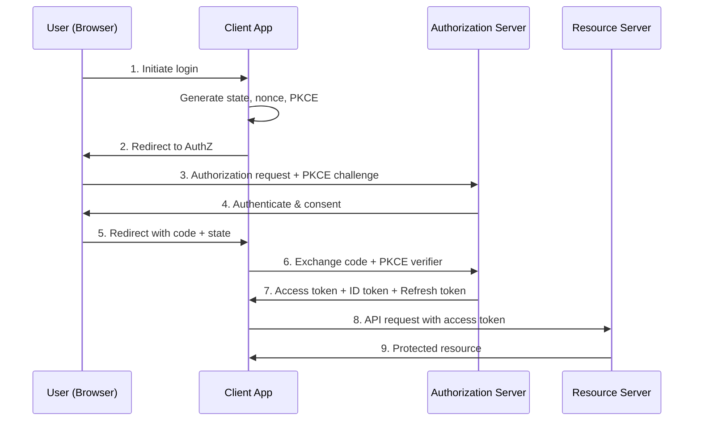
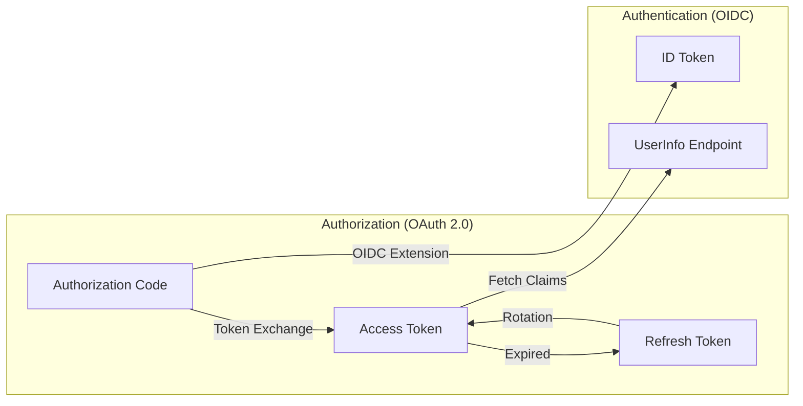
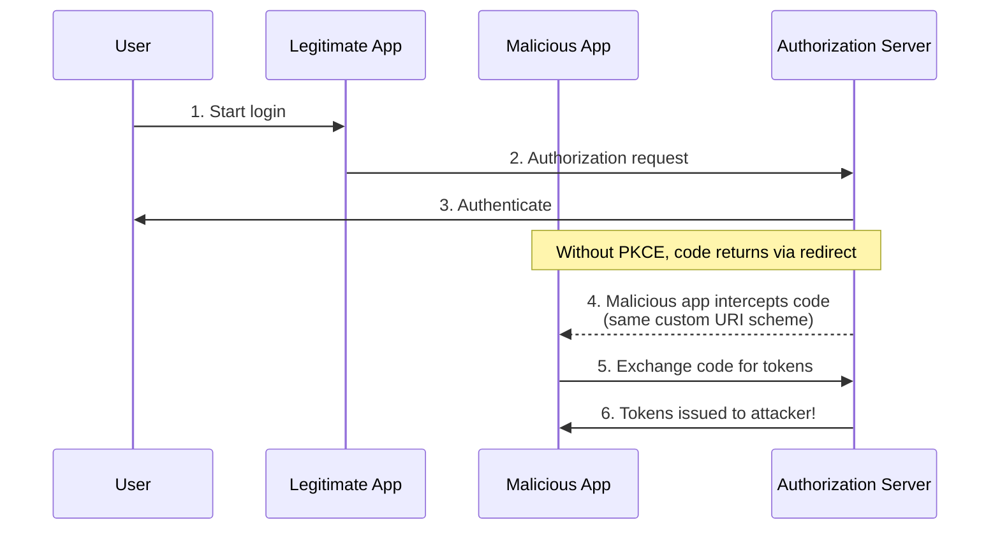
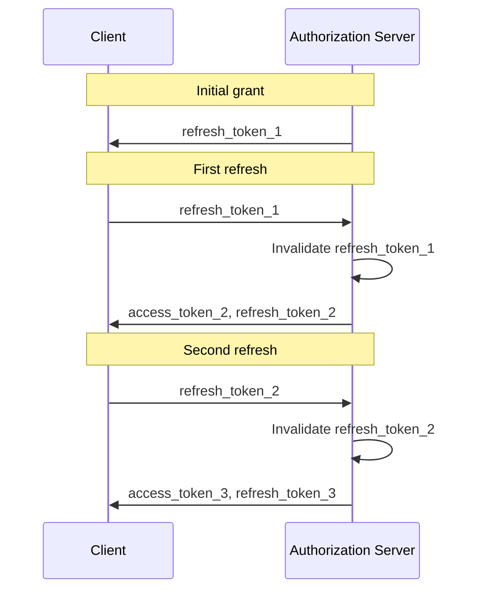
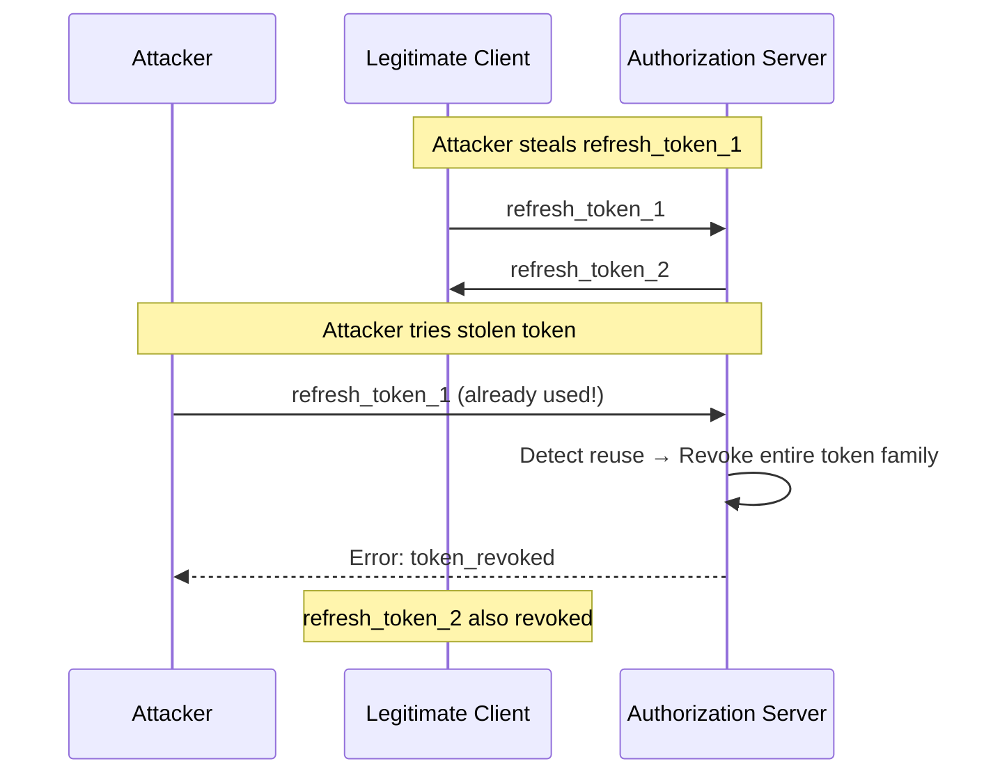
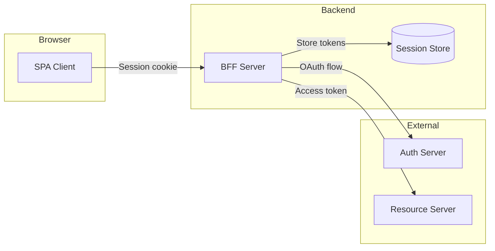
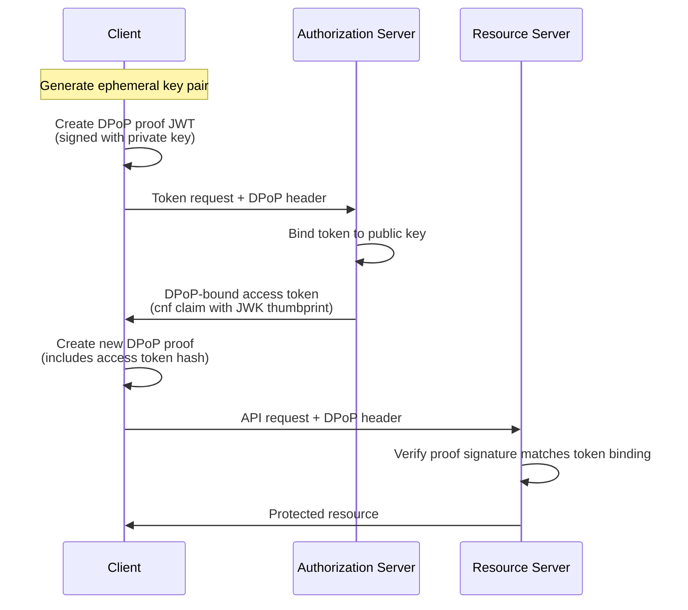

# OAuth 2.0 and OIDC Flows: Authorization Code to PKCE

A comprehensive technical analysis of OAuth 2.0 authorization flows, OpenID Connect (OIDC) identity layer, PKCE security mechanism, and token lifecycle management for secure authentication and authorization implementations.

<figure>



<figcaption>Complete OAuth 2.0 Authorization Code flow with PKCE and OIDC, showing the interaction between user, client, authorization server, and resource server.</figcaption>

</figure>

## Abstract

OAuth 2.0 is an **authorization delegation framework**—it lets users grant applications limited access to their resources without sharing credentials. OIDC (OpenID Connect) is an **identity layer on top of OAuth**—it proves _who_ the user is via ID tokens. The core security model relies on:



| Component              | Purpose                                     | Lifetime     | Audience              |
| ---------------------- | ------------------------------------------- | ------------ | --------------------- |
| **Authorization Code** | One-time credential for token exchange      | ~10 minutes  | Authorization server  |
| **Access Token**       | Resource access credential                  | 5-60 minutes | Resource server (API) |
| **Refresh Token**      | Long-lived credential for new access tokens | Days/weeks   | Authorization server  |
| **ID Token**           | Identity proof (JWT with user claims)       | Minutes      | Client application    |

### Key Design Principles

- **PKCE is mandatory** for all clients (OAuth 2.1)—prevents authorization code interception
- **Tokens are bearer credentials**—possession equals authorization; protect accordingly
- **State prevents CSRF**; **nonce prevents replay**; **PKCE prevents interception**—all three are required
- **Implicit flow is deprecated**—tokens in URLs leak via history, referrer, logs
- **Access tokens are for APIs; ID tokens are for clients**—never use ID tokens to call APIs

## OAuth 2.0 Core Architecture

### Four Defined Roles

OAuth 2.0 (RFC 6749) defines four roles that interact during authorization:

| Role                     | Description                                                 | Example               |
| ------------------------ | ----------------------------------------------------------- | --------------------- |
| **Resource Owner**       | Entity granting access to protected resources               | End user              |
| **Resource Server**      | Server hosting protected resources, validates access tokens | API server            |
| **Client**               | Application requesting access on behalf of resource owner   | Web/mobile app        |
| **Authorization Server** | Issues tokens after authenticating the resource owner       | Auth0, Okta, Keycloak |

**Design rationale**: OAuth separates the client from the resource owner. Instead of the client storing user credentials (the pre-OAuth antipattern), the client obtains tokens with specific scope and lifetime. This enables revocable, scoped access without credential exposure.

### Client Types

Clients are classified by their ability to maintain credential confidentiality:

| Type             | Can Store Secrets? | Examples                | Token Strategy        |
| ---------------- | ------------------ | ----------------------- | --------------------- |
| **Confidential** | Yes                | Server-side web apps    | Client secret + PKCE  |
| **Public**       | No                 | SPAs, mobile apps, CLIs | PKCE only (no secret) |

> **OAuth 2.1 (draft-14)**: The distinction matters less now—PKCE is mandatory for all clients. Confidential clients still use secrets for additional security, but secrets alone are insufficient.

### Protocol Endpoints

| Endpoint            | Purpose                          | HTTP Method |
| ------------------- | -------------------------------- | ----------- |
| **Authorization**   | Obtain user consent via redirect | GET         |
| **Token**           | Exchange grants for tokens       | POST        |
| **Revocation**      | Invalidate tokens                | POST        |
| **Introspection**   | Validate token metadata          | POST        |
| **UserInfo** (OIDC) | Fetch user profile claims        | GET/POST    |

---

## Authorization Code Flow with PKCE

The Authorization Code flow with PKCE (Proof Key for Code Exchange) is the **only recommended flow** for all client types as of OAuth 2.1.

### Step 1: Generate Security Parameters

Before initiating the flow, the client generates three security parameters:

```javascript title="pkce-generation.js"
import crypto from "crypto"

// PKCE: code_verifier (43-128 chars, cryptographically random)
const codeVerifier = crypto.randomBytes(32).toString("base64url")
// e.g., "dBjftJeZ4CVP-mB92K27uhbUJU1p1r_wW1gFWFOEjXk"

// PKCE: code_challenge (SHA256 hash of verifier)
const codeChallenge = crypto.createHash("sha256").update(codeVerifier).digest("base64url")
// e.g., "E9Melhoa2OwvFrEMTJguCHaoeK1t8URWbuGJSstw-cM"

// CSRF protection
const state = crypto.randomBytes(16).toString("hex")

// OIDC replay protection
const nonce = crypto.randomBytes(16).toString("hex")

// Store in session for validation
session.oauthParams = { codeVerifier, state, nonce }
```

**Why three parameters?**

| Parameter                        | Protects Against                              | Validated By                          |
| -------------------------------- | --------------------------------------------- | ------------------------------------- |
| `state`                          | CSRF attacks (forged authorization responses) | Client (callback)                     |
| `nonce`                          | ID token replay attacks                       | Client (ID token validation)          |
| `code_verifier`/`code_challenge` | Authorization code interception               | Authorization server (token endpoint) |

### Step 2: Authorization Request

The client redirects the user to the authorization server:

```http
GET /authorize?
  response_type=code
  &client_id=CLIENT_ID
  &redirect_uri=https://client.example/callback
  &scope=openid profile email
  &state=abc123xyz
  &nonce=def456uvw
  &code_challenge=E9Melhoa2OwvFrEMTJguCHaoeK1t8URWbuGJSstw-cM
  &code_challenge_method=S256
HTTP/1.1
Host: auth.example.com
```

**Required parameters:**

| Parameter               | Purpose                             | Requirement                   |
| ----------------------- | ----------------------------------- | ----------------------------- |
| `response_type=code`    | Request authorization code          | REQUIRED                      |
| `client_id`             | Client identifier                   | REQUIRED                      |
| `redirect_uri`          | Callback URL (exact match required) | REQUIRED in OAuth 2.1         |
| `code_challenge`        | PKCE challenge                      | REQUIRED in OAuth 2.1         |
| `code_challenge_method` | `S256` (SHA256) or `plain`          | REQUIRED if challenge present |
| `state`                 | CSRF protection                     | REQUIRED                      |
| `scope`                 | Requested permissions               | RECOMMENDED                   |
| `nonce`                 | Replay protection (OIDC)            | REQUIRED for OIDC             |

### Step 3: User Authentication and Consent

The authorization server:

1. Authenticates the user (login if no session)
2. Displays consent screen with requested scopes
3. Records user's decision

### Step 4: Authorization Response

On approval, the authorization server redirects back with the authorization code:

```http
HTTP/1.1 302 Found
Location: https://client.example/callback?
  code=SplxlOBeZQQYbYS6WxSbIA
  &state=abc123xyz
  &iss=https://auth.example.com
```

**Security validation (client-side):**

```javascript title="callback-validation.js" collapse={1-3, 20-25}
// Express callback handler
app.get("/callback", async (req, res) => {
  const { code, state, iss, error } = req.query

  // Check for error response
  if (error) {
    return res.status(400).json({ error: req.query.error_description })
  }

  // Validate state (CSRF protection)
  if (state !== req.session.oauthParams.state) {
    return res.status(400).json({ error: "State mismatch - CSRF detected" })
  }

  // Validate issuer (mix-up attack protection, RFC 9207)
  if (iss !== EXPECTED_ISSUER) {
    return res.status(400).json({ error: "Issuer mismatch" })
  }

  // Proceed to token exchange...
  const tokens = await exchangeCodeForTokens(code)
  res.json(tokens)
})
```

> **RFC 9207**: The `iss` parameter in the authorization response prevents mix-up attacks when clients use multiple authorization servers. Always validate it matches the expected issuer.

### Step 5: Token Exchange

The client exchanges the authorization code for tokens at the token endpoint:

```http
POST /token HTTP/1.1
Host: auth.example.com
Content-Type: application/x-www-form-urlencoded

grant_type=authorization_code
&code=SplxlOBeZQQYbYS6WxSbIA
&redirect_uri=https://client.example/callback
&client_id=CLIENT_ID
&code_verifier=dBjftJeZ4CVP-mB92K27uhbUJU1p1r_wW1gFWFOEjXk
```

**For confidential clients**, add client authentication:

```http
POST /token HTTP/1.1
Host: auth.example.com
Content-Type: application/x-www-form-urlencoded
Authorization: Basic base64(client_id:client_secret)

grant_type=authorization_code
&code=SplxlOBeZQQYbYS6WxSbIA
&redirect_uri=https://client.example/callback
&code_verifier=dBjftJeZ4CVP-mB92K27uhbUJU1p1r_wW1gFWFOEjXk
```

**PKCE server validation:**

```javascript title="pkce-validation.js"
// Authorization server validates PKCE
function validatePKCE(codeChallenge, codeVerifier, method) {
  if (method === "S256") {
    const computedChallenge = crypto.createHash("sha256").update(codeVerifier).digest("base64url")
    return computedChallenge === codeChallenge
  }
  // 'plain' method (SHOULD NOT be used)
  return codeVerifier === codeChallenge
}
```

### Step 6: Token Response

```json
{
  "access_token": "eyJhbGciOiJSUzI1NiIsInR5cCI6ImF0K2p3dCJ9...",
  "token_type": "Bearer",
  "expires_in": 900,
  "refresh_token": "8xLOxBtZp8",
  "scope": "openid profile email",
  "id_token": "eyJhbGciOiJSUzI1NiIsInR5cCI6IkpXVCJ9..."
}
```

---

## PKCE Deep Dive

PKCE (Proof Key for Code Exchange, RFC 7636) prevents authorization code interception attacks.

### The Attack PKCE Prevents



**Attack scenario**: On mobile platforms, multiple apps can register the same custom URI scheme (`com.example.app://`). A malicious app intercepts the redirect containing the authorization code and exchanges it for tokens.

**With PKCE**: The authorization server binds the code to the `code_challenge`. Without the `code_verifier` (which only the legitimate app possesses), the malicious app cannot complete the exchange.

### Code Verifier Requirements (RFC 7636)

| Requirement       | Value                                           |
| ----------------- | ----------------------------------------------- |
| **Entropy**       | Minimum 256 bits (32 bytes)                     |
| **Character set** | `[A-Z] / [a-z] / [0-9] / "-" / "." / "_" / "~"` |
| **Length**        | 43-128 characters                               |
| **Generation**    | Cryptographic random number generator           |

### Challenge Methods

| Method  | Algorithm                          | Recommendation                 |
| ------- | ---------------------------------- | ------------------------------ |
| `S256`  | `BASE64URL(SHA256(code_verifier))` | MUST support; SHOULD use       |
| `plain` | `code_challenge = code_verifier`   | SHOULD NOT use (fallback only) |

**Design rationale**: `S256` is preferred because even if the `code_challenge` is leaked (e.g., in browser history), the original `code_verifier` cannot be derived. With `plain`, leaking the challenge equals leaking the verifier.

### PKCE in OAuth 2.1

> **OAuth 2.1 draft-14, Section 7.6**: "Clients MUST use code_challenge and code_verifier and authorization servers MUST enforce their use."

OAuth 2.1 makes PKCE mandatory for all clients—public and confidential. This acknowledges that:

1. Client secrets can leak (supply chain attacks, compromised dependencies)
2. PKCE provides defense-in-depth even when secrets are used
3. A single secure pattern simplifies implementation

---

## OpenID Connect (OIDC) Identity Layer

OIDC extends OAuth 2.0 to provide **authentication** (proving _who_ the user is) in addition to OAuth's **authorization** (proving _what_ the user can access).

### ID Token Structure

The ID token is a JWT containing identity claims about the authenticated user:

```json
{
  "iss": "https://auth.example.com",
  "sub": "user_12345",
  "aud": "CLIENT_ID",
  "exp": 1704153600,
  "iat": 1704150000,
  "auth_time": 1704149900,
  "nonce": "def456uvw",
  "acr": "urn:mace:incommon:iap:silver",
  "amr": ["pwd", "mfa"],
  "at_hash": "x4Q8HQ2_VFbP...",
  "name": "Jane Doe",
  "email": "jane@example.com",
  "email_verified": true
}
```

### ID Token Claims

**Required claims (per OIDC Core 1.0):**

| Claim | Description                                        | Validation                      |
| ----- | -------------------------------------------------- | ------------------------------- |
| `iss` | Issuer identifier (HTTPS URL)                      | MUST match expected issuer      |
| `sub` | Subject identifier (max 255 chars, locally unique) | Unique user ID within issuer    |
| `aud` | Audience—MUST contain `client_id`                  | Reject if client_id not present |
| `exp` | Expiration time                                    | Reject if current time > exp    |
| `iat` | Issued at time                                     | Used for clock validation       |

**Contextually required claims:**

| Claim       | Description                            | When Required                           |
| ----------- | -------------------------------------- | --------------------------------------- |
| `nonce`     | Replay protection value                | MUST be present if sent in request      |
| `auth_time` | Time of authentication                 | When `max_age` requested                |
| `acr`       | Authentication Context Class Reference | When requested as Essential             |
| `amr`       | Authentication Methods References      | Indicates methods used (pwd, otp, etc.) |
| `at_hash`   | Access token hash                      | When token issued with ID token         |
| `azp`       | Authorized party                       | When aud contains multiple values       |

### ID Token Validation (Mandatory Steps)

```javascript title="id-token-validation.js" collapse={1-5, 40-55}
import jwt from "jsonwebtoken"
import jwksClient from "jwks-rsa"

async function validateIdToken(idToken, expectedIssuer, clientId, nonce) {
  // 1. Decode header to get key ID
  const decoded = jwt.decode(idToken, { complete: true })
  const { kid, alg } = decoded.header

  // 2. Fetch signing key from JWKS endpoint
  const client = jwksClient({ jwksUri: `${expectedIssuer}/.well-known/jwks.json` })
  const key = await client.getSigningKey(kid)

  // 3. Verify signature and decode claims
  const claims = jwt.verify(idToken, key.getPublicKey(), {
    algorithms: [alg], // Explicitly allowlist algorithm
    issuer: expectedIssuer,
    audience: clientId,
  })

  // 4. Validate nonce (replay protection)
  if (claims.nonce !== nonce) {
    throw new Error("Nonce mismatch - potential replay attack")
  }

  // 5. Validate auth_time if max_age was used
  if (claims.auth_time && maxAgeUsed) {
    const authAge = Math.floor(Date.now() / 1000) - claims.auth_time
    if (authAge > maxAge) {
      throw new Error("Authentication too old - re-authentication required")
    }
  }

  // 6. Validate at_hash if present (binds ID token to access token)
  if (claims.at_hash) {
    const expectedHash = computeAtHash(accessToken, alg)
    if (claims.at_hash !== expectedHash) {
      throw new Error("Access token hash mismatch")
    }
  }

  return claims
}

// Compute at_hash per OIDC Core 3.1.3.6
function computeAtHash(accessToken, alg) {
  const hashAlg = alg === "RS256" ? "sha256" : "sha512"
  const hash = crypto.createHash(hashAlg).update(accessToken).digest()
  const halfHash = hash.slice(0, hash.length / 2)
  return halfHash.toString("base64url")
}
```

### ID Token vs Access Token vs Refresh Token

| Aspect         | ID Token                 | Access Token              | Refresh Token            |
| -------------- | ------------------------ | ------------------------- | ------------------------ |
| **Protocol**   | OIDC only                | OAuth 2.0 / OIDC          | OAuth 2.0 / OIDC         |
| **Purpose**    | Prove user identity      | Authorize API access      | Obtain new access tokens |
| **Format**     | Always JWT               | JWT or opaque             | Typically opaque         |
| **Audience**   | Client application       | Resource server (API)     | Authorization server     |
| **Validation** | Client validates locally | Resource server validates | Auth server only         |
| **Lifetime**   | Short (minutes)          | Short (5-60 min)          | Long (days/weeks)        |
| **Contains**   | User identity claims     | Scopes, permissions       | Token family reference   |

**Critical distinction**: ID tokens prove _who_ the user is (for the client). Access tokens prove _what_ the user can do (for the API). Never use an ID token to call APIs—it's semantically wrong and often insecure (audience mismatch).

### UserInfo Endpoint

The UserInfo endpoint returns claims about the authenticated user:

```http
GET /userinfo HTTP/1.1
Host: auth.example.com
Authorization: Bearer <access_token>
```

```json
{
  "sub": "user_12345",
  "name": "Jane Doe",
  "given_name": "Jane",
  "family_name": "Doe",
  "email": "jane@example.com",
  "email_verified": true,
  "picture": "https://example.com/jane.jpg"
}
```

**When to use UserInfo vs ID Token**:

- **ID Token**: Get claims at authentication time (single request)
- **UserInfo**: Fetch additional claims later, refresh claims without re-authentication

---

## Refresh Tokens and Rotation

Refresh tokens enable long-lived sessions without long-lived access tokens.

### Refresh Token Grant

```http
POST /token HTTP/1.1
Host: auth.example.com
Content-Type: application/x-www-form-urlencoded

grant_type=refresh_token
&refresh_token=8xLOxBtZp8
&client_id=CLIENT_ID
&scope=openid profile
```

**Response (with rotation):**

```json
{
  "access_token": "new_access_token...",
  "token_type": "Bearer",
  "expires_in": 900,
  "refresh_token": "new_refresh_token",
  "scope": "openid profile"
}
```

### Refresh Token Rotation

Rotation issues a new refresh token with each use, invalidating the previous one:



### Reuse Detection

If a previously-used refresh token is presented, it indicates token theft:



**Implementation considerations:**

```javascript title="refresh-reuse-detection.js" collapse={1-8, 30-45}
const GRACE_PERIOD_MS = 5000 // 5 seconds for network retries

async function handleRefreshToken(refreshToken) {
  const tokenRecord = await db.findRefreshToken(refreshToken)

  if (!tokenRecord) {
    throw new OAuthError("invalid_grant", "Unknown refresh token")
  }

  // Check if token was already used
  if (tokenRecord.usedAt) {
    const timeSinceUse = Date.now() - tokenRecord.usedAt

    // Grace period for legitimate retries (network failures)
    if (timeSinceUse < GRACE_PERIOD_MS) {
      // Return same tokens issued during grace period
      return tokenRecord.issuedTokens
    }

    // Outside grace period - potential theft!
    await db.revokeTokenFamily(tokenRecord.familyId)
    throw new OAuthError("invalid_grant", "Token reuse detected")
  }

  // Mark as used and issue new tokens
  await db.markTokenUsed(refreshToken, Date.now())

  const newTokens = await issueTokens(tokenRecord.userId, tokenRecord.scopes)
  await db.storeIssuedTokens(refreshToken, newTokens)

  return newTokens
}
```

**Trade-offs of rotation:**

| Benefit                     | Cost                                |
| --------------------------- | ----------------------------------- |
| Stolen tokens expire faster | Database write on every refresh     |
| Reuse detection possible    | Network failures can lock out users |
| Limits attacker window      | More complex state management       |

**Alternative: Sender-constrained tokens (DPoP/mTLS)** avoid rotation overhead by binding tokens to cryptographic keys.

---

## Token Storage by Platform

### Web Applications (Browser-Based)

| Storage            | XSS Vulnerable? | Recommendation                 |
| ------------------ | --------------- | ------------------------------ |
| `localStorage`     | Yes             | MUST NOT use for tokens        |
| `sessionStorage`   | Yes             | MUST NOT use for tokens        |
| JavaScript memory  | No (unless XSS) | RECOMMENDED for access tokens  |
| `HttpOnly` cookies | No              | RECOMMENDED for refresh tokens |

**Backend-for-Frontend (BFF) Pattern** (most secure for SPAs):



- Browser never sees OAuth tokens
- BFF maintains server-side session
- Session ID in `HttpOnly`, `Secure`, `SameSite=Strict` cookie
- BFF proxies API requests with access token

### Mobile Applications

| Platform    | Recommended Storage        | Notes                               |
| ----------- | -------------------------- | ----------------------------------- |
| **iOS**     | Keychain Services          | Encrypted, hardware-backed          |
| **Android** | EncryptedSharedPreferences | Uses Android Keystore               |
| **Both**    | Secure Enclave/TEE         | Strongest protection when available |

```swift title="ios-keychain-storage.swift" collapse={1-4, 20-35}
// iOS: Store refresh token in Keychain
import Security

func storeRefreshToken(_ token: String, for userId: String) -> Bool {
    let query: [String: Any] = [
        kSecClass as String: kSecClassGenericPassword,
        kSecAttrAccount as String: userId,
        kSecAttrService as String: "oauth-refresh-token",
        kSecValueData as String: token.data(using: .utf8)!,
        kSecAttrAccessible as String: kSecAttrAccessibleWhenUnlockedThisDeviceOnly
    ]

    // Delete existing item first
    SecItemDelete(query as CFDictionary)

    // Add new item
    let status = SecItemAdd(query as CFDictionary, nil)
    return status == errSecSuccess
}
```

### Native Apps (RFC 8252)

RFC 8252 defines OAuth for native applications:

| Requirement                              | Rationale                               |
| ---------------------------------------- | --------------------------------------- |
| Use external user-agent (system browser) | Enables SSO, prevents credential theft  |
| MUST NOT use embedded WebViews           | Host app can inject JS, capture cookies |
| PKCE is mandatory                        | Multiple apps can claim same URI scheme |

**Redirect URI options:**

| Type               | Format                             | Platform                               |
| ------------------ | ---------------------------------- | -------------------------------------- |
| Claimed HTTPS      | `https://app.example.com/oauth`    | iOS Universal Links, Android App Links |
| Loopback           | `http://127.0.0.1:{port}/callback` | Desktop apps (any port)                |
| Private URI scheme | `com.example.app:/callback`        | Mobile apps                            |

---

## DPoP: Demonstrating Proof of Possession

DPoP (RFC 9449) sender-constrains tokens to prevent stolen tokens from being usable by attackers.

### How DPoP Works



### DPoP Proof JWT Structure

**Header:**

```json
{
  "typ": "dpop+jwt",
  "alg": "ES256",
  "jwk": {
    "kty": "EC",
    "crv": "P-256",
    "x": "l8tFrhx-34tV3hRICRDY9zCkDlpBhF42UQUfWVAWBFs",
    "y": "9VE4jf_Ok_o64tbkMYAPVS-9hQp9A7v9oy_A9C1_2RY"
  }
}
```

**Payload (for token request):**

```json
{
  "jti": "e7d7c7a9-1234-5678-abcd-ef0123456789",
  "htm": "POST",
  "htu": "https://auth.example.com/token",
  "iat": 1704150000
}
```

**Payload (for resource request):**

```json
{
  "jti": "f8e8d8b9-2345-6789-bcde-f01234567890",
  "htm": "GET",
  "htu": "https://api.example.com/resource",
  "iat": 1704150100,
  "ath": "fUHyO2r2Z3DZ53EsNrWBb0xWXoaNy59IiKCAqksmQEo"
}
```

### DPoP Claims

| Claim   | Description                         | When Required           |
| ------- | ----------------------------------- | ----------------------- |
| `jti`   | Unique identifier (UUID v4)         | Always                  |
| `htm`   | HTTP method                         | Always                  |
| `htu`   | HTTP target URI (no query/fragment) | Always                  |
| `iat`   | Issued at timestamp                 | Always                  |
| `ath`   | Access token hash                   | For resource requests   |
| `nonce` | Server-provided nonce               | When required by server |

**Security benefit**: Even if an attacker steals the access token, they cannot use it without the private key that signed the DPoP proofs.

---

## Security Pitfalls and Mitigations

### Authorization Code Interception

**Attack**: Malicious app intercepts authorization code via shared redirect URI.

**Mitigation**: PKCE (mandatory in OAuth 2.1).

### CSRF via Forged Authorization Response

**Attack**: Attacker tricks user into completing OAuth flow with attacker's account.

**Mitigation**: `state` parameter—validate it matches the value sent in the request.

### ID Token Replay

**Attack**: Attacker replays captured ID token to authenticate as victim.

**Mitigation**: `nonce` parameter—include in request, validate in ID token.

### Mix-Up Attack

**Attack**: When client supports multiple authorization servers, attacker tricks client into sending tokens to wrong server.

**Mitigation**:

- Validate `iss` parameter in authorization response (RFC 9207)
- Validate `iss` claim in ID token matches expected issuer
- Use distinct `redirect_uri` per authorization server

### Open Redirect via redirect_uri

**Attack**: Attacker crafts authorization request with malicious `redirect_uri` to steal authorization code.

**Mitigation**: Exact string matching for `redirect_uri` validation (no wildcards, no patterns).

```javascript title="redirect-uri-validation.js"
// Registration: Store exact URIs only
const registeredRedirectUris = ["https://client.example.com/callback", "https://client.example.com/oauth/callback"]

// Validation: Exact string match
function validateRedirectUri(requestedUri) {
  // MUST be exact match - no wildcards, patterns, or normalization
  return registeredRedirectUris.includes(requestedUri)
}

// MUST NOT allow:
// - https://client.example.com/* (wildcard)
// - https://*.example.com/callback (subdomain wildcard)
// - Pattern matching or regex
```

### Token Leakage via Referrer

**Attack**: Access tokens in URL fragments leak via `Referer` header.

**Mitigation**:

- Use Authorization Code flow (not Implicit)
- Set `Referrer-Policy: no-referrer` header
- Use `response_mode=form_post` (OIDC)

### Insufficient Redirect URI Validation

**Attack**: Authorization server accepts partial URI matches, enabling redirect to attacker-controlled subdomain.

**Mitigation**: Per RFC 9700 (OAuth Security BCP): "Authorization servers MUST utilize exact string matching" for redirect URI validation.

---

## OAuth 2.1 Key Changes

OAuth 2.1 (currently draft-14, expected RFC in 2026) consolidates OAuth 2.0 with security best practices from RFC 9700.

### Removed Flows

| Flow                                    | Reason for Removal                                                         |
| --------------------------------------- | -------------------------------------------------------------------------- |
| **Implicit** (`response_type=token`)    | Tokens in URL fragments leak via history, referrer, logs                   |
| **Resource Owner Password Credentials** | Violates OAuth's core principle—never share credentials with third parties |

### Mandatory Requirements

| Requirement                                 | OAuth 2.0     | OAuth 2.1              |
| ------------------------------------------- | ------------- | ---------------------- |
| PKCE for public clients                     | RECOMMENDED   | MUST                   |
| PKCE for confidential clients               | Not mentioned | SHOULD                 |
| Exact redirect URI matching                 | SHOULD        | MUST                   |
| Bearer tokens in query strings              | Allowed       | MUST NOT               |
| Refresh token sender-constraint or rotation | Not specified | MUST (public clients)  |
| HTTPS for all endpoints                     | SHOULD        | MUST (except loopback) |

### Migration Checklist

1. **Implement PKCE** for all clients, including confidential
2. **Remove Implicit flow** support; migrate to Authorization Code + PKCE
3. **Remove ROPC** if implemented; migrate to proper redirect flow
4. **Enforce exact redirect URI matching**—no wildcards
5. **Implement refresh token rotation** or DPoP for public clients
6. **Never send tokens in query strings**—use headers or POST body

---

## Conclusion

OAuth 2.0 and OIDC provide a robust framework for authorization and authentication, but secure implementation requires understanding the threat model and applying defense-in-depth:

1. **Authorization Code + PKCE** is the only recommended flow—use it for all clients
2. **ID tokens prove identity** (for clients); **access tokens prove authorization** (for APIs)—never confuse them
3. **State, nonce, and PKCE** work together—all three are required
4. **Token storage** must match platform capabilities—HttpOnly cookies for web, Keychain/Keystore for mobile
5. **Refresh token rotation** or sender-constraining (DPoP) limits the blast radius of token theft
6. **OAuth 2.1** codifies best practices—adopt its requirements now

The complexity exists because the threat model is real. Authorization code interception, CSRF, replay attacks, and token theft are documented, exploited vulnerabilities. Every security parameter exists because of a specific attack it prevents.

## Appendix

### Prerequisites

- HTTP fundamentals (cookies, headers, redirects, CORS)
- Cryptographic basics (symmetric vs asymmetric, hashing, JWTs)
- Session management patterns

### Terminology

| Term                   | Definition                                                                            |
| ---------------------- | ------------------------------------------------------------------------------------- |
| **Authorization Code** | Short-lived credential exchanged for tokens; single-use, bound to client and PKCE     |
| **CSRF**               | Cross-Site Request Forgery—attack forcing user to execute unwanted actions            |
| **DPoP**               | Demonstrating Proof of Possession—mechanism for sender-constraining tokens (RFC 9449) |
| **ID Token**           | JWT containing identity claims about the authenticated user (OIDC)                    |
| **OIDC**               | OpenID Connect—identity layer on OAuth 2.0 for authentication                         |
| **PKCE**               | Proof Key for Code Exchange—prevents authorization code interception (RFC 7636)       |
| **Refresh Token**      | Long-lived credential for obtaining new access tokens without user interaction        |
| **Sender-Constraint**  | Binding a token to the client that requested it, preventing use by others             |

### Summary

- OAuth 2.0 is authorization (what you can access); OIDC is authentication (who you are)
- Authorization Code + PKCE is mandatory for all clients in OAuth 2.1
- `state` prevents CSRF; `nonce` prevents replay; PKCE prevents code interception—use all three
- ID tokens are for clients; access tokens are for APIs—never interchange them
- Refresh token rotation detects theft; DPoP prevents stolen token use
- Store tokens appropriately: memory/HttpOnly cookies for web; Keychain/Keystore for mobile
- OAuth 2.1 removes Implicit and ROPC flows; mandates PKCE and exact redirect URI matching

### References

**Core Specifications:**

- [RFC 6749: OAuth 2.0 Authorization Framework](https://datatracker.ietf.org/doc/html/rfc6749) - Core OAuth 2.0 specification
- [RFC 7636: PKCE](https://datatracker.ietf.org/doc/html/rfc7636) - Proof Key for Code Exchange
- [OpenID Connect Core 1.0](https://openid.net/specs/openid-connect-core-1_0.html) - OIDC specification (also ISO/IEC 26131:2024)
- [OAuth 2.1 Draft](https://datatracker.ietf.org/doc/html/draft-ietf-oauth-v2-1-14) - IETF Draft 14 (October 2025)

**Security Specifications:**

- [RFC 6819: OAuth 2.0 Threat Model](https://datatracker.ietf.org/doc/html/rfc6819) - Security considerations
- [RFC 9700: OAuth Security BCP](https://datatracker.ietf.org/doc/rfc9700/) - Best Current Practice (January 2025)
- [RFC 9449: DPoP](https://www.rfc-editor.org/rfc/rfc9449.html) - Demonstrating Proof of Possession
- [RFC 9207: Authorization Server Issuer Identification](https://datatracker.ietf.org/doc/html/rfc9207) - Mix-up attack prevention

**Implementation Guidance:**

- [RFC 8252: OAuth for Native Apps](https://datatracker.ietf.org/doc/html/rfc8252) - BCP 212 for mobile/desktop apps
- [OWASP OAuth2 Cheat Sheet](https://cheatsheetseries.owasp.org/cheatsheets/OAuth2_Cheat_Sheet.html) - Implementation security guidance
- [Auth0 Token Best Practices](https://auth0.com/docs/secure/tokens/token-best-practices) - Practical implementation advice
