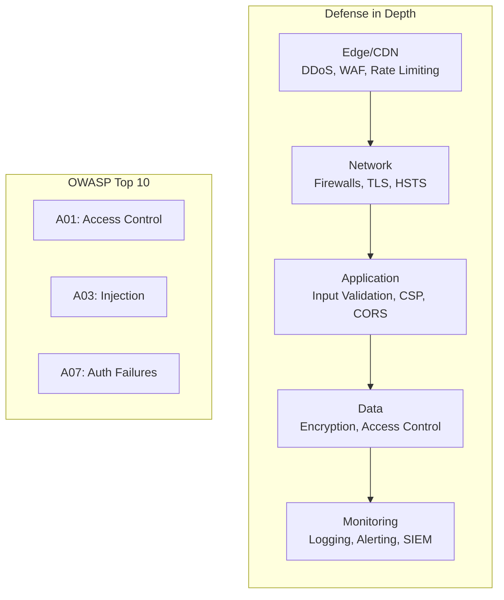

# OWASP Top 10 (2021): Risks and Mitigations

Master web application security from OWASP Top 10 vulnerabilities to production implementation, covering authentication, authorization, input validation, and security headers for building secure applications.

<figure>

<figcaption>Defense in depth layers and OWASP Top 10 vulnerability categories</figcaption>

</figure>

## TLDR

**Web Security** is a comprehensive discipline encompassing OWASP Top 10 vulnerabilities, secure development practices, authentication systems, and defense-in-depth strategies for building resilient web applications.

### Foundational Security Principles

- **Secure SDLC**: Security integrated throughout development lifecycle (requirements, design, implementation, testing, deployment, maintenance)
- **Defense in Depth**: Multiple security layers (physical, network, application, data, monitoring)
- **Principle of Least Privilege**: Minimum necessary access rights for users, programs, and processes
- **Fail Securely**: Systems default to secure state during errors or failures

### OWASP Top 10 2021 Vulnerabilities

- **A01: Broken Access Control**: Unauthorized access, privilege escalation, IDOR vulnerabilities
- **A02: Cryptographic Failures**: Weak encryption, poor key management, insecure transmission
- **A03: Injection**: SQL injection, XSS, command injection, NoSQL injection
- **A04: Insecure Design**: Flaws in architecture, missing security controls, design weaknesses
- **A05: Security Misconfiguration**: Default configurations, exposed services, unnecessary features
- **A06: Vulnerable Components**: Outdated dependencies, known vulnerabilities, supply chain attacks
- **A07: Authentication Failures**: Weak authentication, session management, credential stuffing
- **A08: Software and Data Integrity**: Untrusted data sources, CI/CD vulnerabilities, insecure updates
- **A09: Security Logging Failures**: Insufficient logging, missing monitoring, inadequate incident response
- **A10: Server-Side Request Forgery**: SSRF attacks, unauthorized resource access, internal network exposure

## Conclusion

The OWASP Top 10 is a practical checklist for prioritizing the most common and costly application risks. Use it as a baseline for threat modeling, secure coding standards, and continuous security testing.
