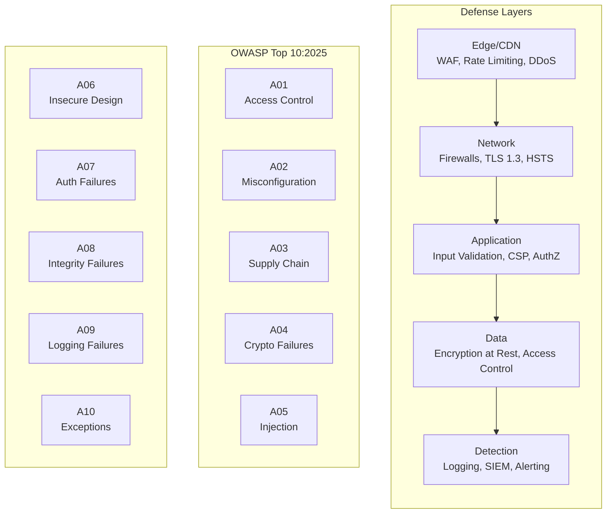

# OWASP Top 10: Web Application Security Risks

The OWASP Top 10 is a ranked list of the most critical web application security risks, derived from real-world vulnerability data. The 2025 edition analyzed 2.8 million applications with 589 CWE (Common Weakness Enumeration) mappings across 248 categories, making it the definitive baseline for application security priorities.

<figure>



<figcaption>Defense-in-depth model mapped to OWASP Top 10:2025 vulnerability categories</figcaption>

</figure>

## Abstract

The OWASP Top 10 represents a data-driven consensus on application security priorities. The 2025 edition introduced two new categories (Software Supply Chain Failures, Mishandling of Exceptional Conditions), consolidated SSRF (Server-Side Request Forgery) into Broken Access Control, and elevated Security Misconfiguration to #2 based on 100% incidence rates.

**Core mental model:**

| Category | Root Cause                         | Primary Control                              |
| -------- | ---------------------------------- | -------------------------------------------- |
| A01-A02  | Missing enforcement/configuration  | Deny-by-default, secure defaults             |
| A03-A04  | Untrusted sources, weak crypto     | Supply chain verification, modern algorithms |
| A05-A06  | Untrusted input, design flaws      | Parameterized queries, threat modeling       |
| A07-A08  | Identity/integrity assumptions     | MFA, signed artifacts                        |
| A09-A10  | Insufficient visibility/resilience | Centralized logging, fail-closed             |

**Key shift in 2025:** Security Misconfiguration rose from #5 to #2, reflecting that 100% of tested applications had some form of misconfiguration. Supply chain attacks (SolarWinds, Log4Shell, npm worms) drove the addition of a dedicated category.

> **Version history:** The 2021 edition introduced root-cause categorization (e.g., "Cryptographic Failures" instead of "Sensitive Data Exposure"). The 2025 edition expanded scope from ~400 to 589 CWEs and added community-driven categories for emerging threats.

## A01: Broken Access Control

Broken Access Control maintains #1 with 100% of applications tested showing some vulnerability. With 40 mapped CWEs, 1.8M+ occurrences, and 32,654 CVEs, it's the most prevalent risk. SSRF was consolidated into this category since it fundamentally bypasses access boundaries.

### Why It's #1

Access control enforces policy so users cannot act outside their intended permissions. API-first architectures expanded attack surface—every endpoint is a potential authorization decision point. The consolidation of SSRF acknowledges that forging requests to internal resources is an access control bypass.

### Vulnerability Patterns

| Pattern                                 | Example                                   | CWE     |
| --------------------------------------- | ----------------------------------------- | ------- |
| Privilege escalation                    | Regular user accesses admin endpoints     | CWE-269 |
| IDOR (Insecure Direct Object Reference) | `/api/users/123` → `/api/users/456`       | CWE-639 |
| Missing function-level controls         | POST/PUT/DELETE endpoints lack authz      | CWE-285 |
| CORS misconfiguration                   | Wildcard origin with credentials          | CWE-942 |
| SSRF (now consolidated here)            | `http://169.254.169.254/` metadata access | CWE-918 |
| Path traversal                          | `../../../etc/passwd`                     | CWE-22  |

### Prevention

```ts title="access-control.ts" collapse={1-4, 18-25}
import { Request, Response, NextFunction } from "express"
import { verify } from "jsonwebtoken"
import { hasPermission } from "./rbac"

// Middleware: deny-by-default, explicit allow
export function authorize(resource: string, action: string) {
  return async (req: Request, res: Response, next: NextFunction) => {
    const token = req.headers.authorization?.split(" ")[1]
    if (!token) return res.status(401).json({ error: "No token" })

    const payload = verify(token, process.env.JWT_SECRET!)
    const allowed = await hasPermission(payload.sub, resource, action)

    if (!allowed) return res.status(403).json({ error: "Forbidden" })
    next()
  }
}

// Route: explicit authorization on every endpoint
app.get("/api/users/:id", authorize("users", "read"), getUser)
app.put("/api/users/:id", authorize("users", "update"), updateUser)
app.delete("/api/users/:id", authorize("users", "delete"), deleteUser)
```

**Critical controls:**

1. **Deny by default**—require explicit grants for every resource
2. **Server-side enforcement**—never trust client-side state
3. **Record ownership validation**—verify the requesting user owns the resource
4. **Centralized access control**—one module, consistent enforcement
5. **SSRF prevention**—allowlist outbound destinations, validate resolved IPs
6. **Rate limiting**—slow automated attacks

### SSRF-Specific Prevention

```ts title="ssrf-prevention.ts" collapse={1-5, 20-25}
import { URL } from "url"
import dns from "dns/promises"
import ipaddr from "ipaddr.js"

const ALLOWED_HOSTS = ["api.example.com", "cdn.example.com"]

async function fetchSafely(userUrl: string): Promise<Response> {
  const url = new URL(userUrl)

  // Protocol allowlist (no file://, gopher://, etc.)
  if (!["https:"].includes(url.protocol)) {
    throw new Error("Only HTTPS allowed")
  }

  // DNS rebinding protection: resolve and check before fetch
  const addresses = await dns.resolve4(url.hostname)
  for (const addr of addresses) {
    const parsed = ipaddr.parse(addr)
    if (parsed.range() !== "unicast") {
      throw new Error("Private IP not allowed")
    }
  }

  return fetch(url.toString(), { redirect: "error" })
}
```

**Network controls:** Disable cloud metadata endpoints (IMDSv2 or block `169.254.169.254`), segment internal services from web tier.

## A02: Security Misconfiguration

Security Misconfiguration rose from #5 (2021) to #2 (2025), with 100% of tested applications showing some misconfiguration. The 27.70% max incidence rate and 16 mapped CWEs reflect that secure defaults are rare, and every stack layer can be misconfigured.

### Why It Rose

Cloud infrastructure complexity multiplied configuration surfaces. XXE (XML External Entities) remains consolidated here—it's fundamentally a parser misconfiguration. The shift to infrastructure-as-code made misconfigurations reproducible at scale.

### Common Misconfigurations

| Layer     | Misconfiguration            | Impact                |
| --------- | --------------------------- | --------------------- |
| Cloud     | S3 bucket public by default | Data breach           |
| Container | Root user in Docker         | Container escape      |
| Framework | Debug mode in production    | Stack traces leak     |
| Server    | Directory listing enabled   | Source exposure       |
| Headers   | Missing security headers    | XSS, clickjacking     |
| Defaults  | Unchanged admin credentials | Full compromise       |
| Parser    | XXE enabled in XML parser   | File disclosure, SSRF |

### Security Headers

```http
Strict-Transport-Security: max-age=31536000; includeSubDomains; preload
X-Content-Type-Options: nosniff
X-Frame-Options: DENY
Referrer-Policy: strict-origin-when-cross-origin
Permissions-Policy: geolocation=(), microphone=(), camera=()
Content-Security-Policy: default-src 'self'; script-src 'self' 'nonce-{random}';
```

### Configuration Hardening

```ts title="xml-parser.ts" collapse={1-2}
import { XMLParser } from "fast-xml-parser"

// SAFE: external entities disabled (default in modern parsers)
const parser = new XMLParser({
  ignoreAttributes: false,
  // These enable XXE - never enable without explicit need:
  // processEntities: true,
  // allowBooleanAttributes: true,
})
```

**Hardening workflow:**

1. **Minimal installation**—remove sample apps, documentation, unused features
2. **Identical environments**—dev/staging/prod differ only in secrets
3. **Automated verification**—config checks in CI/CD pipeline
4. **Short-lived credentials**—identity federation, not hardcoded secrets
5. **Regular audits**—quarterly review of cloud IAM, firewall rules

## A03: Software Supply Chain Failures

New in 2025, Software Supply Chain Failures expanded from "Vulnerable and Outdated Components" to address the entire software supply chain. It ranked #1 in community surveys (50% of respondents), with a 5.72% average incidence rate—the highest of any category.

### Why It Was Added

SolarWinds (18,000+ organizations compromised), Log4Shell (CVE-2021-44228 affecting millions of systems), and Shai-Hulud (2025's first self-propagating npm worm harvesting tokens and auto-propagating to 500+ package versions) demonstrated that supply chain attacks scale catastrophically. Your application is only as secure as its least secure dependency.

### Supply Chain Risk Vectors

| Risk                    | Example                      | Control                        |
| ----------------------- | ---------------------------- | ------------------------------ |
| Known vulnerabilities   | Log4Shell (CVE-2021-44228)   | Dependency scanning            |
| Typosquatting           | `lodahs` instead of `lodash` | Package verification           |
| Maintainer compromise   | event-stream incident (2018) | Audit upstream changes         |
| Build system compromise | SolarWinds Orion             | Signed builds, reproducibility |
| Malicious packages      | npm worms harvesting tokens  | Private registry, allowlisting |

### Dependency Management

```json title="package.json" collapse={1-5, 15-20}
{
  "name": "secure-app",
  "version": "1.0.0",
  "scripts": {
    "audit": "npm audit --production",
    "audit:fix": "npm audit fix",
    "sbom": "npx @cyclonedx/cyclonedx-npm --output-file sbom.json"
  },
  "dependencies": {
    "express": "^4.18.2"
  },
  "overrides": {
    "lodash": "4.17.21"
  }
}
```

**Supply chain hygiene:**

1. **SBOM (Software Bill of Materials)**—generate with CycloneDX or SPDX
2. **Automated scanning**—OWASP Dependency-Check, Snyk, npm audit in CI
3. **Version pinning**—lock files, avoid floating versions in production
4. **Private registry**—proxy public packages, scan before allowing
5. **SRI (Subresource Integrity)**—hash verification for CDN scripts
6. **Staged rollouts**—canary deployments, not simultaneous updates

### SRI Example

```html
<script
  src="https://cdn.example.com/lib.js"
  integrity="sha384-oqVuAfXRKap7fdgcCY5uykM6+R9GqQ8K/uxy9rx7HNQlGYl1kPzQho1wx4JwY8wC"
  crossorigin="anonymous"
></script>
```

If the CDN script changes, the browser refuses execution.

## A04: Cryptographic Failures

Cryptographic Failures moved from #2 (2021) to #4 (2025), with 32 mapped CWEs and 1.6M+ occurrences. The category focuses on root causes—broken algorithms, weak keys, insufficient entropy—rather than the symptom of data exposure.

### Vulnerability Patterns

| Pattern                          | Weakness                      | Impact                |
| -------------------------------- | ----------------------------- | --------------------- |
| Cleartext transmission           | No TLS, HTTP fallback         | MITM credential theft |
| Weak algorithms                  | MD5/SHA1 for passwords, DES   | Offline cracking      |
| Insufficient entropy             | Predictable tokens, weak PRNG | Session hijacking     |
| Hardcoded secrets                | API keys in source            | Credential compromise |
| Missing authenticated encryption | AES-CBC without HMAC          | Padding oracle        |

### Password Storage

```ts title="password.ts" collapse={1-3}
import { hash, verify } from "argon2"

// Argon2id: OWASP-recommended for password hashing
const PASSWORD_OPTIONS = {
  type: 2, // argon2id (hybrid: side-channel + time-memory tradeoff resistant)
  memoryCost: 65536, // 64MB
  timeCost: 3,
  parallelism: 4,
}

export async function hashPassword(password: string): Promise<string> {
  return hash(password, PASSWORD_OPTIONS)
}

export async function verifyPassword(password: string, stored: string): Promise<boolean> {
  return verify(stored, password)
}
```

**Why Argon2id:** Memory-hard functions resist GPU/ASIC cracking. Argon2id combines side-channel resistance (Argon2i) with time-memory tradeoff resistance (Argon2d). NIST recommends preparation for post-quantum cryptography by 2030 for high-value systems.

### Data Classification

1. **Identify sensitive data** per PCI-DSS, GDPR, HIPAA
2. **Encrypt at rest** using AES-256-GCM (authenticated)
3. **Encrypt in transit** via TLS 1.3 with forward secrecy
4. **Key management**: HSM or cloud KMS, never in source
5. **Rotate keys** on schedule and after compromise

## A05: Injection

Injection dropped from #3 (2021) to #5 (2025), but remains critical with 37 mapped CWEs, 62,445 CVEs, and 100% of applications showing some vulnerability. XSS (Cross-Site Scripting) remains consolidated here—it's HTML/JavaScript injection.

### Attack Surface

| Injection Type | Entry Point           | Prevention                 |
| -------------- | --------------------- | -------------------------- |
| SQL            | Database queries      | Parameterized queries, ORM |
| XSS            | HTML output           | Output encoding, CSP       |
| Command        | OS shell calls        | Avoid shell; use safe APIs |
| NoSQL          | Document queries      | Schema validation          |
| Template       | Server-side templates | Sandbox, restricted syntax |
| LDAP           | Directory queries     | Escape special characters  |

### SQL Injection Prevention

```ts title="query.ts" collapse={1-3, 18-22}
import { Pool } from "pg"

const pool = new Pool()

// VULNERABLE: string concatenation
async function getUserUnsafe(id: string) {
  // Attacker: "1; DROP TABLE users;--"
  return pool.query(`SELECT * FROM accounts WHERE id = ${id}`)
}

// SAFE: parameterized query
async function getUserSafe(id: string) {
  return pool.query("SELECT * FROM accounts WHERE id = $1", [id])
}

// SAFE: ORM with typed parameters
async function getUserORM(id: number) {
  return prisma.user.findUnique({ where: { id } })
}
```

### Content Security Policy

CSP is the primary XSS defense—it tells browsers which sources can execute scripts:

```http
Content-Security-Policy:
  default-src 'self';
  script-src 'self' 'nonce-abc123';
  style-src 'self' 'unsafe-inline';
  img-src 'self' data: https:;
  connect-src 'self' https://api.example.com;
  frame-ancestors 'none';
  base-uri 'self';
  form-action 'self';
```

**CSP deployment:** Start with `Content-Security-Policy-Report-Only`, analyze violations, then enforce.

## A06: Insecure Design

Insecure Design dropped from #4 (2021) to #6 (2025), with 39 mapped CWEs. It targets architectural flaws that cannot be fixed by secure implementation—an insecure design cannot be saved by secure code.

### Design vs Implementation

| Insecure Design                    | Implementation Bug                     |
| ---------------------------------- | -------------------------------------- |
| No rate limiting on password reset | Rate limit bypassed via header         |
| Security questions for recovery    | SQL injection in security handler      |
| Trust boundary violation           | JWT validation missing on one endpoint |
| No business logic validation       | Off-by-one in quantity check           |

### Prevention

1. **Secure development lifecycle** with threat modeling
2. **Security requirements** in user stories
3. **Design pattern library** for authentication, authorization
4. **Plausibility checks** at all tiers (can one user really order 10,000 items?)
5. **Rate limits** on expensive operations

### Example: Cinema Attack

A cinema allowed unlimited seat reservations. Attackers reserved all seats, preventing legitimate sales, then released them last-minute.

**Design fix:** Maximum seats per session, escalating hold costs, bot detection.

## A07: Authentication Failures

Authentication Failures maintains #7 with 36 mapped CWEs, 1.1M+ occurrences, and 7,147 CVEs. The name shortened from "Identification and Authentication Failures" to emphasize the authentication focus.

### Vulnerability Patterns

| Weakness            | Exploitation                            | Control                    |
| ------------------- | --------------------------------------- | -------------------------- |
| Credential stuffing | Automated login with breached passwords | MFA, rate limiting         |
| Weak passwords      | Dictionary attacks                      | Min 12 chars, breach check |
| Session fixation    | Attacker sets session ID pre-login      | Regenerate on auth         |
| Missing logout      | Sessions persist indefinitely           | Server-side invalidation   |
| Exposed session IDs | IDs in URLs                             | Cookie-only, HttpOnly      |

### Session Management

```ts title="session.ts" collapse={1-5, 22-28}
import session from "express-session"
import RedisStore from "connect-redis"
import { createClient } from "redis"

const redisClient = createClient()

app.use(
  session({
    store: new RedisStore({ client: redisClient }),
    secret: process.env.SESSION_SECRET!,
    name: "__Host-session", // Cookie prefix binding
    resave: false,
    saveUninitialized: false,
    cookie: {
      secure: true, // HTTPS only
      httpOnly: true, // No JS access
      sameSite: "strict", // CSRF protection
      maxAge: 15 * 60 * 1000, // 15 minutes
    },
  }),
)

// Regenerate session on login (prevent fixation)
app.post("/login", async (req, res) => {
  const user = await authenticate(req.body)
  req.session.regenerate(() => {
    req.session.userId = user.id
    res.json({ success: true })
  })
})
```

### NIST 800-63B Guidelines

NIST reversed decades of password theater:

- **No complexity requirements**—users create worse passwords with forced symbols
- **No periodic rotation**—change only on evidence of compromise
- **Minimum 8 characters** (12+ recommended), max at least 64
- **Check against breached passwords**—haveibeenpwned integration
- **Allow paste**—password managers are the primary defense

## A08: Software and Data Integrity Failures

Software and Data Integrity Failures remains #8, addressing assumptions about updates, critical data, and CI/CD pipelines without verifying integrity. Distinct from A03: this category focuses on runtime integrity checks (deserialization, auto-updates), while A03 focuses on supply chain provenance.

### Integrity Patterns

| Pattern                  | Example                               | Impact              |
| ------------------------ | ------------------------------------- | ------------------- |
| Unsigned updates         | Auto-update without verification      | Malicious code      |
| Insecure deserialization | Untrusted data → object instantiation | RCE                 |
| CI/CD compromise         | Build server access                   | Supply chain attack |
| CDN modification         | JavaScript changed at CDN             | Client attacks      |

### Deserialization Safety

```ts title="deserialize.ts" collapse={1-3}
import Ajv from "ajv"

// SAFE: schema validation before use
const ajv = new Ajv()
const schema = {
  type: "object",
  properties: {
    userId: { type: "integer" },
    action: { type: "string", enum: ["read", "write"] },
  },
  required: ["userId", "action"],
  additionalProperties: false,
}

const validate = ajv.compile(schema)

function processInput(untrusted: string) {
  const data = JSON.parse(untrusted)
  if (!validate(data)) {
    throw new Error("Invalid input schema")
  }
  // Now safe to use data.userId, data.action
}
```

### CI/CD Security

1. **Signed commits**—GPG signatures on protected branches
2. **Reproducible builds**—same source → same binary
3. **Artifact signing**—verify packages before deployment
4. **Least privilege runners**—CI jobs run with minimal permissions
5. **Secret scanning**—no credentials in logs or artifacts

## A09: Logging and Alerting Failures

Renamed from "Security Logging and Monitoring Failures" to emphasize alerting—logging without alerting provides minimal value. With only 5 mapped CWEs, it's community-driven rather than data-driven, reflecting that breaches averaging 287 days undetected (IBM 2021) demonstrate detection failures.

### What to Log

| Event                    | Required Fields                 | Alert Threshold        |
| ------------------------ | ------------------------------- | ---------------------- |
| Login failure            | User, IP, timestamp, user-agent | 5 failures/minute      |
| Access denied            | User, resource, action          | Any sensitive resource |
| Input validation failure | Input (sanitized), endpoint     | 10/minute same IP      |
| Admin action             | User, action, target            | All                    |
| Rate limit triggered     | IP, endpoint, count             | All                    |

### Log Injection Prevention

```ts title="logging.ts" collapse={1-3}
import pino from "pino"

const logger = pino({
  formatters: {
    level: (label) => ({ level: label }),
  },
})

// SAFE: structured logging (not string concatenation)
logger.info({ userId: user.id, action: "login" }, "User authenticated")

// UNSAFE: user input in log string enables injection
// logger.info(`User ${username} logged in`);
// username = "admin\n[ALERT] Breach"
```

### Alerting Strategy

1. **Real-time alerts** for auth failures, privilege changes
2. **Anomaly detection** for unusual access patterns
3. **Tamper-evident storage** for logs
4. **Incident response playbook** per NIST 800-61r2
5. **Regular testing** of detection capabilities

## A10: Mishandling of Exceptional Conditions

New in 2025, this category addresses failures to prevent, detect, and respond to unusual situations—crashes, unexpected behavior, and exploitable states. With 24 mapped CWEs and 3,416 CVEs, it replaces vague "code quality" categories with specific guidance.

### Failure Modes

| Failure                | Example                          | Impact              |
| ---------------------- | -------------------------------- | ------------------- |
| Resource exhaustion    | Unhandled upload exception       | DoS                 |
| Data exposure          | Database error reveals internals | Reconnaissance      |
| Fail-open              | Exception bypasses auth check    | Unauthorized access |
| Incomplete transaction | Transfer interrupted mid-process | Financial fraud     |

### Prevention

```ts title="error-handling.ts" collapse={1-3}
import { Transaction } from "sequelize"

// SAFE: transactional rollback on any failure
async function transferFunds(from: number, to: number, amount: number) {
  const t = await sequelize.transaction()
  try {
    await Account.decrement("balance", { by: amount, where: { id: from }, transaction: t })
    await Account.increment("balance", { by: amount, where: { id: to }, transaction: t })
    await t.commit()
  } catch (error) {
    await t.rollback() // Fail closed: no partial state
    logger.error({ from, to, amount, error: error.message }, "Transfer failed")
    throw new Error("Transfer failed") // Don't leak internals
  }
}
```

**Key controls:**

1. **Local error handling**—catch at occurrence point with meaningful recovery
2. **Global exception handler**—backup for uncaught exceptions
3. **Fail closed**—transactional rollback, deny access on error
4. **Resource quotas**—rate limiting, memory limits
5. **Sanitized error messages**—no stack traces to users

## Conclusion

The OWASP Top 10:2025 reflects the evolved threat landscape based on data from 2.8M applications:

1. **Access control remains #1**—SSRF consolidated here, every endpoint needs explicit authz
2. **Misconfiguration rose to #2**—100% incidence, secure defaults are rare
3. **Supply chain is critical**—new category driven by SolarWinds, Log4Shell, npm worms
4. **Exception handling matters**—new category for fail-closed patterns
5. **Detection enables response**—logging without alerting is ineffective

Use the Top 10 as a baseline for threat modeling, code review checklists, and security testing. For high-assurance applications, ASVS (Application Security Verification Standard) provides deeper coverage.

## Appendix

### Prerequisites

- HTTP request/response model
- Web application architecture (client/server, APIs)
- Authentication flows (sessions, tokens)

### Summary

- **A01-A02** (Access Control, Misconfiguration): Deny-by-default, secure defaults
- **A03-A04** (Supply Chain, Crypto): Verify dependencies, use modern algorithms
- **A05-A06** (Injection, Design): Parameterized queries, threat modeling
- **A07-A08** (Auth, Integrity): MFA, signed artifacts
- **A09-A10** (Logging, Exceptions): Centralized alerting, fail-closed
- 2025 added Supply Chain Failures and Mishandling Exceptional Conditions
- SSRF consolidated into Broken Access Control

### References

- [OWASP Top 10:2025](https://owasp.org/Top10/) - Official specification and methodology
- [OWASP Top 10:2025 Introduction](https://owasp.org/Top10/2025/0x00_2025-Introduction/) - Methodology and data sources
- [OWASP Application Security Verification Standard (ASVS)](https://owasp.org/www-project-application-security-verification-standard/) - Comprehensive security requirements
- [OWASP Cheat Sheet Series](https://cheatsheetseries.owasp.org/) - Implementation guidance per category
- [CWE Top 25 Most Dangerous Software Weaknesses](https://cwe.mitre.org/top25/) - Complementary ranking
- [NIST SP 800-63B Digital Identity Guidelines](https://pages.nist.gov/800-63-3/sp800-63b.html) - Authentication requirements
- [NIST SP 800-61r2 Incident Handling](https://csrc.nist.gov/publications/detail/sp/800-61/rev-2/final) - Logging and response
- [RFC 6749 OAuth 2.0](https://datatracker.ietf.org/doc/html/rfc6749) - Authorization framework
- [RFC 8446 TLS 1.3](https://datatracker.ietf.org/doc/html/rfc8446) - Transport security
