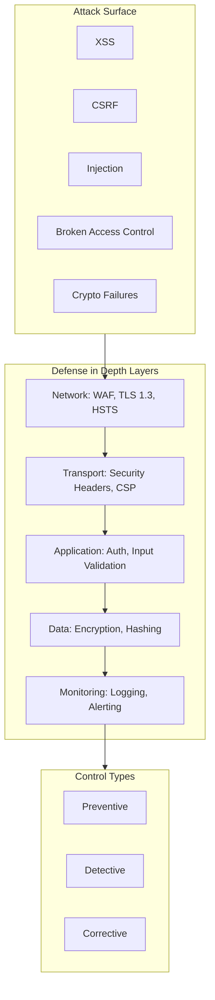

# Web Application Security Architecture

A defense-in-depth guide to security controls, threat mitigation strategies, and implementation patterns for modern web applications—covering security headers, authentication, cryptography, and the OWASP Top 10:2025.

<figure>



<figcaption>Defense in depth: multiple security layers where each compensates for potential failures in others. Attackers must bypass all layers to compromise the system.</figcaption>
</figure>

## Abstract

Web security operates on a layered defense model where controls at each layer compensate for potential failures in others:

- **Network layer**: TLS 1.3 encrypts transport; HSTS prevents downgrade; WAF filters malicious requests
- **Browser layer**: CSP restricts resource origins and blocks inline scripts; security headers disable dangerous features
- **Application layer**: Authentication verifies identity; authorization enforces access boundaries; input validation rejects malformed data
- **Data layer**: Argon2id hashes passwords; AES-256-GCM encrypts sensitive data; secure random generation prevents predictability

The OWASP Top 10:2025 identifies Broken Access Control as the primary threat—not because it's technically sophisticated, but because authorization logic is scattered throughout applications and easy to miss. CSP's shift from domain allowlists to nonce-based validation represents a similar evolution: cryptographic proof of trust replaces reputation-based assumptions.

## Foundational Security Principles

Security architecture rests on principles that, when consistently applied, prevent entire vulnerability classes rather than patching individual instances.

### Defense in Depth

No single control is infallible. Defense in depth layers multiple independent controls so that one failure doesn't compromise the system.

**Why this design**: Military fortification theory—breaching outer walls doesn't grant access to inner keeps. Applied to software: a Cross-Site Scripting (XSS) attack that bypasses input validation still fails against a properly configured Content Security Policy (CSP).

**Layer interaction**:

| Layer       | Control                           | Compensates For                     |
| ----------- | --------------------------------- | ----------------------------------- |
| Network     | WAF rules                         | Unknown application vulnerabilities |
| Transport   | TLS 1.3, HSTS                     | Network interception                |
| Browser     | CSP, security headers             | XSS, clickjacking                   |
| Application | Input validation, output encoding | Injection attacks                   |
| Data        | Encryption at rest                | Database compromise                 |
| Monitoring  | Anomaly detection                 | Undetected breaches                 |

**Failure mode**: Over-reliance on a single layer. A common antipattern is treating WAF as the sole XSS defense—attackers craft payloads that bypass WAF signatures but execute in browsers.

### Principle of Least Privilege

Grant minimum permissions required for a specific function, nothing more.

**Why this design**: Limits blast radius. A compromised service account with read-only database access can't exfiltrate data via `DELETE` statements or modify records.

**Implementation pattern**:

```javascript collapse={1-3}
// Least privilege: service accounts scoped to specific operations
const servicePermissions = {
  "api-read-service": {
    database: ["SELECT"],
    tables: ["users", "products"],
    columns: { users: ["id", "name", "email"] }, // No password_hash
  },
  "api-write-service": {
    database: ["INSERT", "UPDATE"],
    tables: ["orders", "cart"],
    // Cannot access users table at all
  },
}
```

**Edge case**: Temporary privilege elevation. When a user needs admin access for a specific task, grant time-bounded permissions that auto-revoke. Never grant persistent elevated access for occasional needs.

### Fail Secure

Systems must default to a secure state when errors occur. Ambiguous conditions should deny access, not grant it.

**Why this design**: Attackers deliberately trigger error conditions to bypass controls. If authentication errors result in access granted, every exception becomes an attack vector.

**Secure vs insecure failure**:

```javascript
// INSECURE: Fails open - errors grant access
async function checkAccess(userId, resource) {
  try {
    const allowed = await authService.check(userId, resource)
    return allowed
  } catch (error) {
    console.error("Auth check failed:", error)
    return true // Dangerous: failure grants access
  }
}

// SECURE: Fails closed - errors deny access
async function checkAccessSecure(userId, resource) {
  try {
    const allowed = await authService.check(userId, resource)
    return allowed === true // Explicit true check
  } catch (error) {
    logger.error("Auth check failed", { userId, resource, error: error.message })
    return false // Safe: failure denies access
  }
}
```

**Gotcha**: Error messages must not leak information. "Invalid username" vs "Invalid password" tells attackers which half of the credential pair is correct. Always use generic messages: "Invalid credentials."

## OWASP Top 10:2025

The OWASP Top 10:2025 represents a shift from symptom-based to root-cause categorization. Server-Side Request Forgery (SSRF), previously standalone, now rolls into Broken Access Control. Two new categories address supply chain and exception handling—reflecting real-world breach patterns.

### A01: Broken Access Control

**Position**: #1 (unchanged from 2021)

**Root cause**: Authorization logic scattered across application code, inconsistently enforced. 3.73% of tested applications contain at least one of the 40 related CWEs (Common Weakness Enumerations).

**Attack patterns**:

- **Insecure Direct Object Reference (IDOR)**: Manipulating resource identifiers (`/api/users/123` → `/api/users/124`)
- **Privilege escalation**: Accessing admin endpoints without role verification
- **SSRF** (now consolidated here): Inducing server-side requests to internal resources

**Vulnerable pattern**:

```javascript
// VULNERABLE: No authorization check - IDOR exploitable
app.get("/api/users/:id/documents", async (req, res) => {
  const documents = await db.documents.findByUserId(req.params.id)
  res.json(documents) // Anyone can access any user's documents
})
```

**Secure implementation**:

```javascript collapse={1-2, 20-25}
// Authorization middleware
const requireOwnership = (resourceType) => async (req, res, next) => {
  const resourceId = req.params.id
  const userId = req.user.id

  const isOwner = await checkOwnership(userId, resourceType, resourceId)
  const isAdmin = req.user.roles.includes("admin")

  if (!isOwner && !isAdmin) {
    logger.warn("Access denied", { userId, resourceType, resourceId })
    return res.status(403).json({ error: "Access denied" })
  }
  next()
}

// SECURE: Ownership verified before data access
app.get("/api/users/:id/documents", authenticate, requireOwnership("user"), async (req, res) => {
  const documents = await db.documents.findByUserId(req.params.id)
  res.json(documents)
})
```

**Design principle**: Centralize authorization in middleware or decorators. Scattered inline checks inevitably have gaps.

### A02: Security Misconfiguration

**Position**: #2 (up from #5 in 2021)

**Root cause**: Default configurations optimized for developer convenience, not production security. Debug endpoints exposed, default credentials unchanged, unnecessary features enabled.

**Common misconfigurations**:

| Component      | Misconfiguration                      | Exploit                       |
| -------------- | ------------------------------------- | ----------------------------- |
| Express.js     | Missing `helmet()` middleware         | XSS via missing headers       |
| Database       | Default `root`/`password` credentials | Full database access          |
| Cloud storage  | Public bucket ACLs                    | Data exfiltration             |
| Error handling | Stack traces in production            | Internal structure disclosure |

**Secure Express configuration**:

```javascript collapse={1-5, 25-35}
import express from "express"
import helmet from "helmet"
import rateLimit from "express-rate-limit"

const app = express()

// Security headers via helmet
app.use(
  helmet({
    contentSecurityPolicy: {
      directives: {
        defaultSrc: ["'self'"],
        scriptSrc: ["'self'"],
        styleSrc: ["'self'", "'unsafe-inline'"], // Review for Trusted Types
        imgSrc: ["'self'", "data:", "https:"],
        objectSrc: ["'none'"],
        frameAncestors: ["'none'"],
      },
    },
    hsts: { maxAge: 31536000, includeSubDomains: true, preload: true },
  }),
)

// Rate limiting
app.use(
  rateLimit({
    windowMs: 15 * 60 * 1000,
    max: 100,
    standardHeaders: true,
    legacyHeaders: false,
  }),
)

// Body parsing with size limits
app.use(express.json({ limit: "100kb" }))

// Production error handler - no stack traces
app.use((err, req, res, next) => {
  logger.error("Request error", { error: err.message, requestId: req.id })
  res.status(500).json({ error: "Internal error", requestId: req.id })
})
```

### A03: Software Supply Chain Failures (New)

**Position**: #3 (evolved from "Vulnerable and Outdated Components")

**Root cause**: Transitive dependencies introduce unknown vulnerabilities. A direct dependency on package A pulls in packages B, C, D—each with their own vulnerability surface.

**Attack vectors**:

- **Typosquatting**: `lodahs` instead of `lodash`
- **Dependency confusion**: Internal package names shadowed by public registry
- **Compromised maintainer accounts**: Legitimate packages injected with malicious code
- **Build pipeline compromise**: CI/CD artifacts modified post-compilation

**Mitigation strategy**:

```json
{
  "scripts": {
    "preinstall": "npm audit --audit-level=high",
    "postinstall": "npm audit signatures",
    "security:sbom": "npx @cyclonedx/cyclonedx-npm --output-file sbom.json"
  }
}
```

**Subresource Integrity (SRI)** for CDN resources:

```html
<script
  src="https://cdn.example.com/lib.js"
  integrity="sha384-oqVuAfXRKap7fdgcCY5uykM6+R9GqQ8K/uxy9rx7HNQlGYl1kPzQho1wx4JwY8wC"
  crossorigin="anonymous"
></script>
```

**Design reasoning**: SRI provides cryptographic proof that CDN-served content matches expected hashes. If the CDN is compromised, browsers reject modified files.

### A04: Cryptographic Failures

**Position**: #4 (down from #2 in 2021)

**Root cause**: Using deprecated algorithms (MD5, SHA-1 for passwords), improper key management, or skipping encryption entirely.

**Algorithm selection** (OWASP Password Storage Cheat Sheet, 2025):

| Use Case                  | Algorithm   | Configuration                                   |
| ------------------------- | ----------- | ----------------------------------------------- |
| Password hashing          | Argon2id    | m=47104 (46 MiB), t=1, p=1 or m=19456, t=2, p=1 |
| Password hashing (legacy) | bcrypt      | Cost factor ≥10, max 72 bytes input             |
| Symmetric encryption      | AES-256-GCM | 256-bit key, random 96-bit IV per operation     |
| Asymmetric encryption     | RSA-OAEP    | 2048-bit minimum, 4096-bit recommended          |
| Digital signatures        | Ed25519     | 256-bit keys, deterministic signatures          |

**Secure password hashing**:

```javascript collapse={1-2}
import { hash, verify } from "@node-rs/argon2"

async function hashPassword(password) {
  // Argon2id with OWASP-recommended parameters
  return await hash(password, {
    memoryCost: 47104, // 46 MiB
    timeCost: 1, // 1 iteration
    parallelism: 1,
  })
}

async function verifyPassword(password, hashedPassword) {
  return await verify(hashedPassword, password)
}
```

**Why Argon2id over bcrypt**: Argon2 is memory-hard, resisting GPU/ASIC attacks. bcrypt is CPU-hard only—modern GPUs can parallelize bcrypt attacks efficiently. Argon2's memory requirements force sequential memory access patterns that GPUs cannot parallelize.

> **Prior to 2015**: bcrypt was the gold standard. Argon2 won the Password Hashing Competition in 2015, designed specifically to resist hardware-accelerated attacks. OWASP now recommends Argon2id as primary, bcrypt only for legacy systems.

### A05: Injection

**Position**: #5 (down from #3 in 2021)

**Root cause**: Untrusted data concatenated into commands or queries, interpreted as code rather than data.

**Injection types**:

| Type     | Vector                        | Defense                           |
| -------- | ----------------------------- | --------------------------------- |
| SQL      | Query string concatenation    | Parameterized queries             |
| NoSQL    | Object property injection     | Schema validation                 |
| Command  | Shell argument concatenation  | Avoid shell; use `execFile`       |
| LDAP     | Filter string manipulation    | Escape special characters         |
| Template | Template syntax in user input | Sandbox or disable user templates |

**SQL injection defense**:

```javascript
// VULNERABLE: String concatenation
const query = `SELECT * FROM users WHERE email = '${email}'`

// SECURE: Parameterized query
const [rows] = await db.execute("SELECT * FROM users WHERE email = ?", [email])
```

**Command injection defense**:

```javascript collapse={1-2}
import { execFile } from "child_process"
import { promisify } from "util"

const execFileAsync = promisify(execFile)

// VULNERABLE: Shell interpretation
// exec(`ping -c 4 ${host}`) // Attacker: "google.com; rm -rf /"

// SECURE: No shell, arguments as array
async function ping(host) {
  // Validate input first
  if (!/^[a-zA-Z0-9.-]+$/.test(host)) {
    throw new Error("Invalid hostname")
  }
  const { stdout } = await execFileAsync("ping", ["-c", "4", host])
  return stdout
}
```

### A06–A10: Summary

| Rank | Category                           | Key Mitigation                                        |
| ---- | ---------------------------------- | ----------------------------------------------------- |
| A06  | Insecure Design                    | Threat modeling during design phase                   |
| A07  | Authentication Failures            | MFA, rate limiting, secure session management         |
| A08  | Software/Data Integrity Failures   | Signed artifacts, CI/CD pipeline security             |
| A09  | Logging & Alerting Failures        | Centralized logging, real-time alerting, audit trails |
| A10  | Mishandling Exceptional Conditions | Fail-secure defaults, structured error handling       |

## Security Headers

HTTP security headers instruct browsers to enforce security policies. They operate at the protocol level, providing defense-in-depth against entire vulnerability classes.

### Content Security Policy (CSP)

**Specification**: W3C CSP Level 3 (Working Draft, June 2025)

CSP restricts resource origins, blocking XSS and data exfiltration by preventing unauthorized script execution.

**Why domain allowlists fail**: If `script-src` includes `cdn.example.com` and that CDN is compromised, attackers serve malicious scripts from the allowlisted domain. Google research found that 94.72% of CSP policies could be bypassed due to allowlist-based configurations.

**Nonce-based CSP** (modern approach):

```
Content-Security-Policy:
  default-src 'self';
  script-src 'self' 'nonce-R4nd0mN0nc3' 'strict-dynamic';
  style-src 'self' 'nonce-R4nd0mN0nc3';
  object-src 'none';
  base-uri 'self';
  frame-ancestors 'none';
  report-to csp-endpoint
```

**How nonces work**:

1. Server generates cryptographically random nonce per response
2. Nonce included in CSP header and legitimate `<script>` tags
3. Browser executes only scripts with matching nonces
4. `'strict-dynamic'` propagates trust to dynamically loaded scripts

```javascript collapse={1-3}
import crypto from "crypto"

function generateCSP(req, res, next) {
  const nonce = crypto.randomBytes(16).toString("base64")
  res.locals.nonce = nonce

  res.setHeader(
    "Content-Security-Policy",
    `
    default-src 'self';
    script-src 'self' 'nonce-${nonce}' 'strict-dynamic';
    style-src 'self' 'nonce-${nonce}';
    object-src 'none';
    base-uri 'self';
    frame-ancestors 'none';
  `
      .replace(/\s+/g, " ")
      .trim(),
  )

  next()
}
```

**HTML with nonce**:

```html
<script nonce="R4nd0mN0nc3">
  // This script executes
</script>
<script>
  // This script blocked - no matching nonce
</script>
```

### Trusted Types

**Specification**: W3C Trusted Types (integrated with CSP)

Trusted Types prevent DOM-based XSS by requiring type-safe objects for dangerous DOM sinks like `innerHTML`.

**Browser support**: Chrome 83+, Edge 83+. Firefox and Safari require polyfills.

**Enforcement**:

```
Content-Security-Policy: require-trusted-types-for 'script'; trusted-types myPolicy
```

```javascript
// Create a policy that sanitizes HTML
const policy = trustedTypes.createPolicy("myPolicy", {
  createHTML: (input) => DOMPurify.sanitize(input),
  createScript: (input) => {
    throw new Error("Scripts not allowed")
  },
  createScriptURL: (input) => {
    const url = new URL(input, location.origin)
    if (url.origin !== location.origin) {
      throw new Error("Cross-origin scripts not allowed")
    }
    return url.toString()
  },
})

// Usage - raw strings rejected, TrustedHTML required
element.innerHTML = policy.createHTML(userInput)
```

**Design reasoning**: Trusted Types shift XSS prevention from "hope developers remember to sanitize" to "browser rejects unsanitized input." Google reports 60% reduction in DOM XSS after deployment.

### HTTP Strict Transport Security (HSTS)

**Specification**: RFC 6797

HSTS instructs browsers to only connect via HTTPS, preventing protocol downgrade attacks.

```
Strict-Transport-Security: max-age=31536000; includeSubDomains; preload
```

| Directive           | Purpose                                        |
| ------------------- | ---------------------------------------------- |
| `max-age`           | Policy duration in seconds (31536000 = 1 year) |
| `includeSubDomains` | Applies to all subdomains                      |
| `preload`           | Eligible for browser preload lists             |

**HSTS preload**: Browsers ship with hardcoded lists of HSTS-enabled domains. First-visit protection—users never make insecure requests to preloaded sites.

**Gotcha**: Once preloaded, removal takes months. Ensure all subdomains support HTTPS before enabling `includeSubDomains`.

### Other Essential Headers

```
X-Content-Type-Options: nosniff
X-Frame-Options: DENY
Referrer-Policy: strict-origin-when-cross-origin
Permissions-Policy: camera=(), microphone=(), geolocation=()
Cross-Origin-Opener-Policy: same-origin
Cross-Origin-Embedder-Policy: require-corp
```

| Header                         | Mitigates                                       |
| ------------------------------ | ----------------------------------------------- |
| `X-Content-Type-Options`       | MIME-sniffing attacks                           |
| `X-Frame-Options`              | Clickjacking (legacy; prefer `frame-ancestors`) |
| `Referrer-Policy`              | URL leakage to third parties                    |
| `Permissions-Policy`           | Feature abuse (camera, microphone)              |
| `Cross-Origin-Opener-Policy`   | Spectre-style side-channel attacks              |
| `Cross-Origin-Embedder-Policy` | Cross-origin resource leaks                     |

## Authentication and Session Security

### WebAuthn (Passkeys)

**Specification**: W3C WebAuthn Level 3 (Candidate Recommendation, January 2026)

WebAuthn enables passwordless authentication using public-key cryptography. The private key never leaves the authenticator device.

**Registration flow**:

```javascript collapse={1-5}
// Client-side registration
async function registerPasskey(userId, userName) {
  const challenge = await fetch("/api/webauthn/challenge").then((r) => r.json())

  const credential = await navigator.credentials.create({
    publicKey: {
      challenge: Uint8Array.from(challenge.value, (c) => c.charCodeAt(0)),
      rp: { name: "Example Corp", id: "example.com" },
      user: {
        id: Uint8Array.from(userId, (c) => c.charCodeAt(0)),
        name: userName,
        displayName: userName,
      },
      pubKeyCredParams: [
        { alg: -7, type: "public-key" }, // ES256
        { alg: -257, type: "public-key" }, // RS256
      ],
      authenticatorSelection: {
        authenticatorAttachment: "platform",
        userVerification: "required",
        residentKey: "required", // Discoverable credential for passkeys
      },
      timeout: 60000,
    },
  })

  await fetch("/api/webauthn/register", {
    method: "POST",
    body: JSON.stringify({
      id: credential.id,
      rawId: btoa(String.fromCharCode(...new Uint8Array(credential.rawId))),
      response: {
        clientDataJSON: btoa(String.fromCharCode(...new Uint8Array(credential.response.clientDataJSON))),
        attestationObject: btoa(String.fromCharCode(...new Uint8Array(credential.response.attestationObject))),
      },
    }),
  })
}
```

**Why passkeys over passwords**: Phishing-resistant by design. The authenticator verifies the relying party's origin—users cannot accidentally authenticate to attacker-controlled sites. No shared secrets to steal from server databases.

### Secure Session Management

**Cookie configuration**:

```javascript
const sessionOptions = {
  name: "__Host-session", // __Host- prefix enforces Secure + no Domain
  secret: process.env.SESSION_SECRET,
  cookie: {
    httpOnly: true, // Inaccessible to JavaScript
    secure: true, // HTTPS only
    sameSite: "strict", // No cross-site requests
    maxAge: 15 * 60 * 1000, // 15 minutes
    path: "/",
  },
  resave: false,
  saveUninitialized: false,
}
```

**SameSite attribute** (RFC 6265bis):

| Value    | Behavior                                               |
| -------- | ------------------------------------------------------ |
| `Strict` | Cookie sent only in first-party context                |
| `Lax`    | Sent with same-site requests and top-level navigations |
| `None`   | Sent in all contexts (requires `Secure`)               |

> **Default behavior change**: Modern browsers treat cookies without `SameSite` as `Lax` by default. Explicit `SameSite=None; Secure` required for legitimate cross-site use cases.

### Token Storage Security

| Method               | XSS Risk | CSRF Risk | Recommendation                 |
| -------------------- | -------- | --------- | ------------------------------ |
| `localStorage`       | High     | None      | Never for auth tokens          |
| `sessionStorage`     | High     | None      | Never for auth tokens          |
| HttpOnly cookie      | None     | Mitigated | Preferred with SameSite=Strict |
| Memory (JS variable) | Medium   | None      | Short-lived tokens only        |

**Design reasoning**: HttpOnly cookies are inaccessible to JavaScript, eliminating XSS-based token theft. `SameSite=Strict` prevents CSRF by blocking cross-origin requests from including the cookie.

## Attack Vectors and Defenses

### Cross-Site Scripting (XSS)

XSS injects malicious scripts into web pages, executing in victims' browser contexts.

**Types**:

| Type      | Vector                    | Persistence | Detection             |
| --------- | ------------------------- | ----------- | --------------------- |
| Stored    | Database → rendered page  | Permanent   | Server-side scanning  |
| Reflected | URL parameter → response  | None        | WAF, input validation |
| DOM-based | Client-side JS → DOM sink | None        | Trusted Types, CSP    |

**DOM XSS defense with Trusted Types**:

```javascript
// Without Trusted Types - vulnerable
document.getElementById("output").innerHTML = userInput

// With Trusted Types - safe
const policy = trustedTypes.createPolicy("sanitizer", {
  createHTML: (input) => DOMPurify.sanitize(input),
})
document.getElementById("output").innerHTML = policy.createHTML(userInput)
```

### Cross-Site Request Forgery (CSRF)

CSRF tricks authenticated users into performing unintended actions.

**Defense layers**:

1. **SameSite cookies**: Prevents cross-origin cookie inclusion
2. **CSRF tokens**: Synchronizer token pattern for state-changing requests
3. **Origin/Referer validation**: Verify request source

```javascript collapse={1-4}
import csrf from "csurf"

const csrfProtection = csrf({ cookie: { sameSite: "strict", httpOnly: true } })

app.get("/form", csrfProtection, (req, res) => {
  res.render("form", { csrfToken: req.csrfToken() })
})

app.post("/transfer", csrfProtection, (req, res) => {
  // Token automatically validated by middleware
  processTransfer(req.body)
})
```

### Server-Side Request Forgery (SSRF)

SSRF induces servers to make requests to unintended destinations, often internal networks or cloud metadata services.

**High-value targets**:

- `169.254.169.254` - AWS/GCP metadata (credentials, tokens)
- `localhost:6379` - Redis
- `10.0.0.0/8`, `172.16.0.0/12`, `192.168.0.0/16` - Internal networks

**Defense**:

```javascript collapse={1-3}
import { URL } from "url"
import dns from "dns/promises"

const BLOCKED_HOSTS = new Set(["169.254.169.254", "metadata.google.internal", "localhost", "127.0.0.1"])

const PRIVATE_RANGES = [
  { start: 0x0a000000, end: 0x0affffff }, // 10.0.0.0/8
  { start: 0xac100000, end: 0xac1fffff }, // 172.16.0.0/12
  { start: 0xc0a80000, end: 0xc0a8ffff }, // 192.168.0.0/16
]

async function isAllowedUrl(urlString) {
  const url = new URL(urlString)

  // Protocol check
  if (!["http:", "https:"].includes(url.protocol)) return false

  // Hostname blocklist
  if (BLOCKED_HOSTS.has(url.hostname)) return false

  // DNS resolution to catch rebinding
  const addresses = await dns.resolve4(url.hostname)
  for (const addr of addresses) {
    const ip = addr.split(".").reduce((acc, oct) => (acc << 8) + parseInt(oct), 0)
    if (PRIVATE_RANGES.some((r) => ip >= r.start && ip <= r.end)) {
      return false
    }
  }

  return true
}
```

## Security by Rendering Strategy

Rendering strategy determines attack surface and appropriate defenses.

### Server-Side Rendering (SSR)

**Attack surface**: Template injection, SSRF, session fixation, CSRF

**Key defenses**:

- Automatic template escaping
- CSRF tokens for state changes
- Session regeneration on authentication
- Request origin validation

### Static Site Generation (SSG)

**Attack surface**: Build-time supply chain, DOM XSS in client JS, cached vulnerabilities

**Key defenses**:

- Dependency scanning in CI/CD
- SRI for external resources
- Hash-based CSP (stable content allows pre-computed hashes)
- Immutable deployments

### Client-Side Rendering (CSR)

**Attack surface**: DOM XSS, token leakage, open redirects

**Key defenses**:

- Trusted Types
- HttpOnly cookie tokens
- Strict CSP with nonces
- Client-side input validation (defense in depth, not primary)

## Conclusion

Security architecture prioritizes controls that eliminate vulnerability classes over those that patch individual instances. Nonce-based CSP eliminates entire categories of XSS. Argon2id eliminates password cracking as a practical attack vector. HttpOnly cookies eliminate JavaScript-based token theft.

The OWASP Top 10:2025 reflects this shift—Broken Access Control remains #1 not because it's technically sophisticated, but because it requires consistent enforcement across every endpoint. The solution is architectural: centralized authorization middleware, not scattered inline checks.

Defense in depth assumes every layer will fail. Design accordingly.

## Appendix

### Prerequisites

- HTTP protocol fundamentals (headers, methods, status codes)
- Basic cryptography concepts (symmetric vs asymmetric, hashing)
- JavaScript/Node.js familiarity
- Web application architecture (client-server model)

### Terminology

- **CSP**: Content Security Policy—browser-enforced resource loading restrictions
- **CSRF**: Cross-Site Request Forgery—attacks that trick users into unintended actions
- **HSTS**: HTTP Strict Transport Security—forces HTTPS connections
- **IDOR**: Insecure Direct Object Reference—unauthorized resource access via ID manipulation
- **OWASP**: Open Worldwide Application Security Project
- **SRI**: Subresource Integrity—cryptographic verification of external resources
- **SSRF**: Server-Side Request Forgery—inducing servers to make unintended requests
- **XSS**: Cross-Site Scripting—malicious script injection
- **WAF**: Web Application Firewall—HTTP traffic filtering

### Summary

- OWASP Top 10:2025 prioritizes Broken Access Control (#1) and introduces Supply Chain Failures (#3) and Mishandling Exceptional Conditions (#10)
- CSP Level 3 shifts from domain allowlists to nonce-based validation for XSS prevention
- Argon2id replaces bcrypt as the recommended password hashing algorithm
- WebAuthn Level 3 enables phishing-resistant passwordless authentication
- SameSite cookies default to `Lax`, mitigating CSRF by default
- Trusted Types prevent DOM XSS by requiring type-safe DOM operations
- Defense in depth: layer controls so single failures don't compromise systems

### References

**Specifications**

- [OWASP Top 10:2025](https://owasp.org/Top10/2025/) - Current web application security risks
- [W3C Content Security Policy Level 3](https://www.w3.org/TR/CSP3/) - CSP specification (Working Draft, June 2025)
- [W3C WebAuthn Level 3](https://www.w3.org/TR/webauthn-3/) - Web Authentication API (Candidate Recommendation, January 2026)
- [RFC 6797 - HTTP Strict Transport Security](https://datatracker.ietf.org/doc/html/rfc6797) - HSTS specification
- [RFC 6265bis - Cookies](https://datatracker.ietf.org/doc/draft-ietf-httpbis-rfc6265bis/) - HTTP State Management (includes SameSite)

**Official Documentation**

- [OWASP Password Storage Cheat Sheet](https://cheatsheetseries.owasp.org/cheatsheets/Password_Storage_Cheat_Sheet.html) - Password hashing recommendations
- [OWASP CSP Cheat Sheet](https://cheatsheetseries.owasp.org/cheatsheets/Content_Security_Policy_Cheat_Sheet.html) - CSP implementation guidance
- [MDN Content Security Policy](https://developer.mozilla.org/en-US/docs/Web/HTTP/CSP) - CSP documentation
- [MDN Trusted Types API](https://developer.mozilla.org/en-US/docs/Web/API/Trusted_Types_API) - Trusted Types documentation
- [web.dev Trusted Types](https://web.dev/articles/trusted-types) - DOM XSS prevention guide

**Tools**

- [Security Headers](https://securityheaders.com/) - Header analysis
- [Mozilla Observatory](https://observatory.mozilla.org/) - Web security scanning
- [SSL Labs Server Test](https://www.ssllabs.com/ssltest/) - TLS configuration analysis
