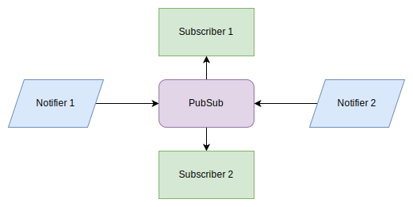

# Draft: Pub Sub Pattern Loose Decoupling

This pattern allows for better modularity and scalability by decoupling the event producers from the event consumers.

<figure>



<figcaption>Pub-Sub data flow</figcaption>
</figure>

## Table of Contents

## Intro

The Publish-Subscribe (Pub/Sub) pattern is a software design pattern that facilitates communication between different parts of your application without tight coupling. It establishes a central communication hub, often called a "message broker" or "event bus," that enables components to:

- Publish (Emit) messages (events) to notify interested parties about something that has happened.
- Subscribe (Listen) to specific messages (events) to receive notifications and react accordingly.

## Implementation

```ts
type Task<T> = (data: T) => void;

export class PubSub<T> {
  #subscriber = new Set<Task<T>>();
  constructor() {}

  subscribe(task: Task<T>) {
    this.#subscriber.add(task);
    return () => {
      this.#subscriber.delete(task);
    };
  }

  notify(data: T) {
    for (const subscriber of this.#subscriber) {
      subscriber(data);
    }
  }
}
```

## Usages

```ts
const pubSub = new PubSub<string>();

// Can have one or more subscriber
const unsubscribe = pubSub.subscribe((data) => {
  console.log(data);
});

// Event Emitted by some other part of the code
pubSub.notify("message1");
pubSub.notify("message2");
pubSub.notify("message3");

// In future, on certain condition: all the subscribers will unsubscribe
unsubscribe();
```

## Comparison DOM CustomEvent

We can achieve similar functionality using `CustomEvent` dispatched over any DOM Node.

The primary bottleneck for this is the dom dependency which makes the code non-usable outside the main thread on the browser environment (not even on worker).

As compared to PubSub, which has extra 16 lines of code for creating the abstraction,
makes your code work on all the runtime.

```js
// Publisher -> Similar to pubSub.notify
const myEvent = new CustomEvent("myCustomEvent", { detail: { message: "Some data" } });
document.dispatchEvent(myEvent);

// Consumer
document.addEventListener("myCustomEvent", (event) => {
  console.log(event.detail.message);
});
```
