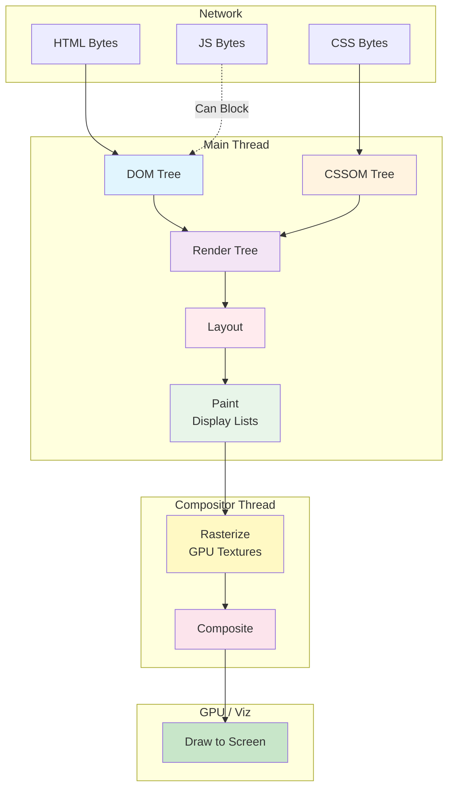
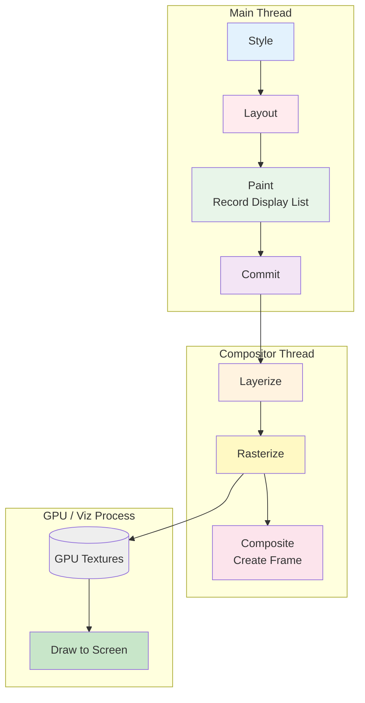
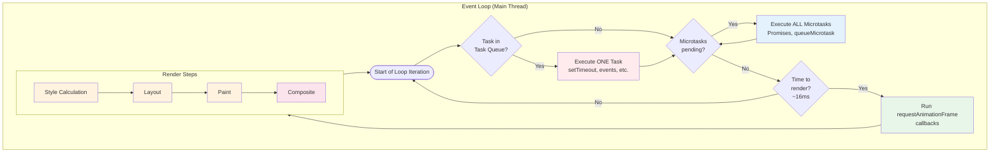

# Critical Rendering Path

Learn how browsers convert HTML, CSS, and JavaScript into pixels—understanding not just what happens at each stage, but why browsers were designed this way and how to optimize for each constraint.

<figure>



<figcaption>The Critical Rendering Path: HTML and CSS are parsed into trees, combined into a render tree, laid out, painted (recorded as display lists), rasterized into GPU textures, composited, and drawn to screen</figcaption>

</figure>

## TLDR

**Critical Rendering Path (CRP)** is the browser's process of converting HTML, CSS, and JavaScript into visual pixels. Understanding *why* each stage exists and *why* certain resources block rendering is essential for building fast web experiences.

### The Rendering Pipeline

- **DOM Construction**: Incremental HTML parsing into tree structure—designed for early resource discovery
- **CSSOM Construction**: CSS parsing with full cascade resolution—cannot be incremental because later rules override earlier ones
- **Render Tree**: Combination of DOM and CSSOM containing only visible elements
- **Layout (Reflow)**: Box model calculations determining exact size and position—the most expensive stage
- **Paint**: Records drawing commands into display lists (not pixels yet!)
- **Rasterize**: Executes display lists to produce GPU texture tiles—actual pixels created here
- **Composite**: Assembles rasterized layers with transforms/effects applied
- **Draw**: GPU sends final composited image to the screen

### What Blocks What

- **CSS blocks Rendering**: Prevents Flash of Unstyled Content (FOUC); partial CSSOM cannot be used because later CSS rules override earlier ones
- **JS blocks HTML Parsing**: Scripts can inject HTML via `document.write()`, so parser must wait for script execution
- **CSS blocks JS Execution**: Scripts using `getComputedStyle()` need complete CSSOM for accurate values

### Browser Design Philosophy

- **Incremental DOM**: Parse and build progressively for early resource discovery via preload scanner
- **Complete CSSOM**: Cannot render with partial styles because later rules override earlier ones
- **Thread Separation**: Compositor thread enables 60fps animations even when main thread is busy
- **Two-Tree Architecture**: Main thread and compositor each maintain layer trees; main can block compositor, never reverse

### Event Loop & Rendering

- **Single Thread**: JavaScript and rendering share the main thread via the event loop
- **Task Queue**: One macrotask (setTimeout, events) executes per loop iteration
- **Microtask Queue**: ALL microtasks (Promises) run after each task, before rendering
- **Render Steps**: Run only when browser decides (~16ms); includes rAF → Style → Layout → Paint → Rasterize → Composite → Draw
- **Long Tasks Block Rendering**: A 100ms task = 100ms of no visual updates or input response

### Box Model & Layout

- **Box Anatomy**: Content → Padding → Border → Margin (margin never included in width calculations)
- **Box Sizing**: `content-box` (default) vs `border-box` affects what `width` property controls
- **Formatting Contexts**: BFC, IFC, FFC, GFC provide layout isolation and predictable element placement
- **Why Layout is Expensive**: Requires traversing entire render tree; changes cascade to descendants

### Compositor & Layers

- **Render Layers**: Manage stacking context and z-ordering for 2D rendering
- **Graphics Layers**: GPU-accelerated layers for transforms, opacity, video, canvas
- **Compositor-Only Properties**: `transform` and `opacity` skip main thread entirely for smooth animations

### JavaScript Loading Strategies

| Mode | Parser Blocking | Order Preserved | When Executes | Best For |
|------|-----------------|-----------------|---------------|----------|
| Default | Yes | Yes | Immediately | Legacy scripts |
| `async` | No | No | When downloaded | Analytics, ads |
| `defer` | No | Yes | After DOM parsed | App scripts |
| `module` | No | Yes | After DOM parsed | Modern apps |

> **Note**: Module scripts are deferred by default and preserve document order like `defer`. Adding `async` to a module makes it execute as soon as downloaded, losing order guarantees.

### Modern Optimization APIs

- **`content-visibility: auto`**: Skip rendering off-screen content (up to 7x faster initial render)
- **CSS Containment**: `contain: layout style paint` isolates subtrees from rest of document
- **`will-change`**: Hints browser to create compositor layer ahead of time

### Performance Patterns

- **Avoid Layout Thrashing**: Don't interleave reads (`offsetWidth`) and writes (`style.width`) in loops
- **Batch DOM Updates**: Use `DocumentFragment` or `requestAnimationFrame` for grouped changes
- **Compositor Animations**: Use `transform`/`opacity` instead of `top`/`left`/`width`/`height`
- **Declarative Resources**: Use `` tags and SSR/SSG so preload scanner can discover resources

---

## Part I: The Rendering Pipeline

Understanding the rendering pipeline requires knowing not just *what* each stage does, but *why* it exists and what constraints shaped its design.

### Design Philosophy: Why Browsers Render This Way

Browsers face a fundamental tension: users want to see content immediately, but rendering requires complete information about styles and layout. The rendering pipeline represents decades of optimization around this tension:

1. **Incremental where possible**: DOM parsing happens progressively so resources can be discovered early
2. **Complete where necessary**: CSSOM must be complete because CSS cascade rules mean later declarations override earlier ones
3. **Parallelized where safe**: The compositor thread handles scrolling and animations independently from main thread work
4. **Layered for performance**: Elements that animate frequently get their own GPU-backed layers

### Stage 1: DOM Construction

The browser parses HTML bytes into a Document Object Model (DOM) tree through four steps:

1. **Conversion**: Translate bytes into characters using specified encoding (UTF-8)
2. **Tokenizing**: Break character stream into tokens (`<html>`, `<body>`, text nodes) per HTML5 spec
3. **Lexing**: Convert tokens into nodes with properties and rules
4. **Tree Construction**: Link nodes into parent-child tree structure

**Why Incremental Parsing Matters**: Unlike CSSOM, DOM construction doesn't require the complete document. The browser parses and builds incrementally, enabling:

- Early resource discovery (the preload scanner can find `<link>` and `<script>` tags)
- Progressive rendering of content above the fold
- Faster Time to First Byte → First Contentful Paint pipeline

```html
<!doctype html>
<html>
  <head>
    <meta name="viewport" content="width=device-width,initial-scale=1" />
    <link href="style.css" rel="stylesheet" />
    <title>Critical Path</title>
  </head>
  <body>
    <p>Hello <span>web performance</span> students!</p>
    <div></div>
  </body>
</html>
```

<figure>


<figcaption>DOM tree construction from HTML parsing: each element becomes a node with parent-child relationships preserved</figcaption>

</figure>

### Stage 2: CSSOM Construction

As the browser encounters `<link rel="stylesheet">` or `<style>` tags, it fetches and parses CSS into the CSS Object Model (CSSOM).

**Why CSSOM Cannot Be Incremental**: Consider this CSS:

```css
p { background: red; }
/* ... hundreds of lines later ... */
p { background: blue; }
```

If the browser rendered with a partial CSSOM after parsing the first rule, paragraphs would flash red before turning blue. The cascade—CSS's fundamental feature—requires knowing *all* rules before determining final computed styles.

**CSSOM Characteristics**:

- **Tree structure**: Mirrors DOM with computed styles at each node
- **Cascade resolution**: Later rules override earlier ones; specificity determines winners
- **NOT parser-blocking**: HTML parser continues while CSS loads
- **Render-blocking**: Browser won't paint until CSSOM is complete
- **JS-blocking**: Scripts using `getComputedStyle()` must wait for CSSOM

```css
body {
  font-size: 16px;
}
p {
  font-weight: bold;
}
span {
  color: red;
}
p span {
  display: none;
}
img {
  float: right;
}
```

<figure>


<figcaption>CSSOM tree: each node contains computed styles after cascade resolution</figcaption>

</figure>

### Stage 3: Render Tree Construction

With DOM and CSSOM ready, the browser combines them into the Render Tree:

- **Contains only visible nodes**: Excludes `<head>`, `<script>`, `<meta>`, and elements with `display: none`
- **Includes computed styles**: Each node has its final calculated styles
- **Excludes invisible content**: `display: none` removes from render tree entirely

**`display: none` vs `visibility: hidden`**:

| Property | In Render Tree? | Occupies Space? | Triggers Layout? |
|----------|-----------------|-----------------|------------------|
| `display: none` | No | No | No (when hidden) |
| `visibility: hidden` | Yes | Yes | Yes |

<figure>


<figcaption>Render tree combines DOM structure with CSSOM styles, excluding non-visual elements</figcaption>

</figure>

### Stage 4: Layout (Reflow)

Layout is where the browser calculates the exact size and position of every element. This is the most computationally expensive stage because geometry calculations cascade through the tree.

#### The Box Model

Every element in the render tree generates a box with four distinct areas:

```ascii-art
┌─────────────────────────────────────────┐
│                 MARGIN                  │
│   ┌─────────────────────────────────┐   │
│   │             BORDER              │   │
│   │   ┌─────────────────────────┐   │   │
│   │   │         PADDING         │   │   │
│   │   │   ┌─────────────────┐   │   │   │
│   │   │   │     CONTENT     │   │   │   │
│   │   │   └─────────────────┘   │   │   │
│   │   └─────────────────────────┘   │   │
│   └─────────────────────────────────┘   │
└─────────────────────────────────────────┘
```

- **Content Box**: Contains actual content (text, images, child elements)
- **Padding Box**: Space between content and border
- **Border Box**: Contains border, padding, and content
- **Margin Box**: External space outside the border—never included in element width calculations

#### Box Sizing: Why It Matters

The `box-sizing` property determines what the `width` and `height` properties control:

**`box-sizing: content-box`** (default):

```css
.element {
  box-sizing: content-box;
  width: 100px;
  padding: 10px;
  border: 5px solid;
}
/* Content width: 100px */
/* Total rendered width: 5 + 10 + 100 + 10 + 5 = 130px */
```

**`box-sizing: border-box`**:

```css
.element {
  box-sizing: border-box;
  width: 100px;
  padding: 10px;
  border: 5px solid;
}
/* Total rendered width: 100px */
/* Content width: 100 - 5 - 10 - 10 - 5 = 70px */
```

**Why `border-box` is Often Preferred**: When you set `width: 100%`, you typically want the element to fit its container exactly. With `content-box`, adding padding or border causes overflow. With `border-box`, the element stays within bounds.

#### Block vs Inline Boxes

Elements generate different box types that follow different layout rules:

**Block-Level Boxes** (`display: block`, `flex`, `grid`, `table`, etc.):

- Width: 100% of containing block by default
- Height: Intrinsic (determined by content)
- Stack vertically, top to bottom
- Participate in Block Formatting Context (BFC)
- Examples: `<div>`, `<p>`, `<section>`, `<header>`, `<ul>`, `<h1>`-`<h6>`

**Inline-Level Boxes** (`display: inline`):

- Flow horizontally, left to right (in LTR languages)
- Wrap to next line when container width exceeded
- **Ignore `width` and `height` properties completely**
- **Ignore vertical margins** (horizontal margins work)
- Padding applies but doesn't affect line height
- Participate in Inline Formatting Context (IFC)
- Examples: `<span>`, `<a>`, `<strong>`, `<em>`, `` (replaced inline)

**Anonymous Boxes**: When text exists outside any element, the browser creates anonymous boxes to contain it:

```html
<div>
  <p>Wrapped in paragraph</p>
  This text gets an anonymous block box
</div>
```

#### Formatting Contexts: Layout Isolation

Formatting contexts are regions where elements follow specific layout rules. Understanding them explains many "CSS quirks":

**Block Formatting Context (BFC)**:

A BFC is a mini-layout environment where:
- Block boxes stack vertically
- Margins collapse between adjacent blocks *within the same BFC*
- Floats are contained (don't escape)
- The BFC doesn't overlap with floats

**What Creates a BFC**:
- Root `<html>` element
- Floats (`float: left/right`)
- Absolutely positioned elements (`position: absolute/fixed`)
- `display: inline-block`, `table-cell`, `table-caption`
- `overflow` other than `visible` (e.g., `overflow: hidden`)
- `display: flow-root` (modern, explicit BFC creation)
- Flex/Grid items
- `contain: layout` or `contain: paint`

**Why BFC Matters for Performance**: A BFC isolates layout calculations. Changes inside a BFC don't require recalculating layout outside it, reducing the scope of expensive reflows.

**Inline Formatting Context (IFC)**:

- Boxes flow horizontally, wrap at container edge
- Vertical alignment via `vertical-align`
- Line boxes contain inline content for each line

**Flex Formatting Context (FFC)** and **Grid Formatting Context (GFC)**:

- Created by `display: flex` and `display: grid`
- Children become flex/grid items with special layout rules
- Provide powerful alignment and distribution capabilities

#### The Containing Block

The containing block determines the reference point for percentage-based sizes and positioning:

- **For `position: static/relative`**: The content box of nearest block-level ancestor
- **For `position: absolute`**: The padding box of nearest ancestor with `position` other than `static` (i.e., `relative`, `absolute`, `fixed`, or `sticky`). If no positioned ancestor exists, the initial containing block (viewport) is used.
- **For `position: fixed`**: Normally the viewport. However, if any ancestor has `transform`, `perspective`, `filter`, `backdrop-filter`, `contain` (layout/paint/strict/content), or `will-change` with transform/filter, that ancestor's padding box becomes the containing block instead.

**Note**: The same properties that affect `position: fixed` (transform, filter, etc.) also create containing blocks for `position: absolute` elements, in addition to positioned ancestors.

#### Why Layout is Expensive

Layout requires traversing the render tree because:

1. **Parent-child dependencies**: A child's percentage width depends on parent's computed width
2. **Sibling relationships**: Floats and inline elements affect adjacent element positions
3. **Cascade effects**: Changing one element's size can force repositioning of many others
4. **Text reflow**: Font changes or container resizing requires re-wrapping all text

**Layout Triggers**: Any change to geometry forces layout recalculation:
- Adding/removing elements
- Changing `width`, `height`, `padding`, `margin`, `border`
- Changing `font-size`, `font-family`
- Changing `position`, `display`, `float`
- Reading layout properties: `offsetWidth`, `offsetHeight`, `getBoundingClientRect()`

### Stage 5: Paint

With geometry calculated, the browser **records** drawing instructions into a **display list**:

- **Paint records**: Instructions like "draw rectangle at (x,y) with color #fff"
- **Paint order**: Background → border → content → outline (per stacking context)
- **Output**: Display lists (not pixels yet!)—these are vector instructions describing *what* to draw

**Important distinction**: Paint does NOT produce pixels. It produces a list of drawing commands that will be executed later during rasterization.

#### Render Layers (Paint Layers)

The browser organizes content into render layers before painting:

- **Purpose**: Manage stacking context, z-ordering, and determine what needs separate display lists
- **Created by**: Root element, positioned elements with z-index, opacity < 1, CSS filters, transforms, `will-change`

**What Creates a Render Layer**:
- Root element
- `position: relative/absolute/fixed` with `z-index` other than `auto`
- `opacity` less than 1
- CSS `filter`, `mask`, `clip-path`
- `transform` other than `none`
- `will-change` with compositing properties

### Stage 6: Layerize & Rasterize

After paint, the compositor thread takes over:

#### Layerization

The compositor decides how to split display lists into **composited layers** (graphics layers):

- **Tiling**: Large layers are broken into tiles—~256×256px for software raster, or approximately viewport-width × ¼ viewport-height for GPU raster
- **Prioritization**: Tiles near the viewport are rasterized first
- **Graphics layers**: Layers promoted for GPU acceleration

**What Promotes to Graphics Layer**:
- 3D transforms (`translate3d`, `rotate3d`, `perspective`)
- `<video>`, `<canvas>`, `<iframe>`
- `position: fixed` (in some browsers)
- `will-change: transform` or `will-change: opacity`
- Animating `transform` or `opacity`
- Overlapping another compositor layer

#### Rasterization

Rasterization **executes** the display list commands to produce actual pixels:

- **GPU raster** (default in modern Chrome): Display list commands execute on the GPU, producing textures
- **Software raster**: CPU fills in pixels into bitmaps (fallback)
- **Output**: GPU texture tiles containing actual pixel data

### Stage 7: Composite & Draw

The final stages assemble everything and display it:

#### Compositing

The compositor thread assembles all rasterized tiles/layers:

- **Compositor frame**: Describes where each tile should appear, with transforms and effects applied
- **No main thread needed**: This runs on the compositor thread, independent of JavaScript
- **Visual effects**: Applies `transform`, `opacity`, filters at this stage (very cheap!)

#### Draw

The **Viz process** (in Chromium) executes the compositor frame on the GPU:

- **Aggregate**: Combines compositor frames from all render processes (tabs, iframes)
- **Draw**: GPU sends the final image to the display buffer
- **Screen update**: Monitor displays the pixels

### The Complete Pixel Pipeline



#### Why This Architecture Matters

| Stage | Thread | Can Skip? | Cost |
|-------|--------|-----------|------|
| Style | Main | No | Medium |
| Layout | Main | If only transform/opacity | High |
| Paint | Main | If only transform/opacity | Medium |
| Rasterize | Compositor/GPU | If tiles cached | Medium |
| Composite | Compositor | No | Low |
| Draw | GPU | No | Very Low |

**Why Graphics Layers Enable 60fps**: When you animate `transform` or `opacity`, the compositor thread can update the layer's position/transparency without involving the main thread. No style recalculation, no layout, no paint, no re-rasterization—just recompositing existing GPU textures with new transforms.

#### The Cost of Layers

Each graphics layer consumes GPU memory. A 1000×1000 pixel layer at 4 bytes per pixel = 4MB. Layer explosion (too many layers) can cause:
- Memory pressure, especially on mobile
- Increased rasterization time
- Texture upload delays

**Best Practice**: Use `will-change` sparingly and remove it after animations complete.

---

## Part II: Browser Design Choices

Understanding *why* browsers block at certain points explains seemingly arbitrary behavior and informs optimization strategies.

### Why CSS is Render-Blocking

CSS blocks rendering—not parsing—for a fundamental reason: **the cascade cannot be resolved incrementally**.

Consider what would happen if browsers rendered with partial CSSOM:

```css
/* styles.css - loaded in chunks */

/* Chunk 1 arrives first */
h1 { color: red; font-size: 48px; }
.hero { background: blue; }

/* User sees: red headings, blue hero */

/* Chunk 2 arrives */
h1 { color: green; }  /* Override! */
.hero { background: white; }  /* Override! */

/* User sees: jarring flash as colors change */
```

This "Flash of Unstyled Content" (FOUC) or "Flash of Wrong Styles" creates a poor user experience. Browsers wait for complete CSSOM to ensure:

1. **Correct final styles**: All cascade rules resolved
2. **No layout shifts**: Elements positioned correctly from first paint
3. **Visual stability**: Users see intended design immediately

**The Trade-off**: Waiting for CSS delays First Contentful Paint, but prevents jarring visual changes.

### Why JavaScript is Parser-Blocking

By default, `<script>` tags block HTML parsing because scripts might:

1. **Modify the DOM being parsed**: `document.write()` can inject HTML
2. **Query DOM state**: Script may expect certain elements to exist
3. **Access computed styles**: May need CSSOM for `getComputedStyle()`

```html
<head>
  <link rel="stylesheet" href="styles.css">
  <script>
    // This script blocks on CSS because it accesses computed styles
    const color = getComputedStyle(document.body).backgroundColor;
  </script>
</head>
```

**The Blocking Chain**:
1. HTML parser encounters `<script>`
2. Download script (if external)—this happens in parallel with CSS loading
3. Wait for CSSOM to complete (if CSS is still loading)—scripts might access computed styles
4. Execute script
5. Resume HTML parsing

**Important**: CSS blocks JavaScript **execution**, not **download**. The browser downloads scripts in parallel with CSS, but won't execute them until CSSOM is ready. This prevents race conditions where scripts might read incorrect or incomplete style information.

### The Threading Model: Why Compositor Exists

The compositor thread exists to solve a fundamental problem: **the main thread can't do two things at once**.

When JavaScript runs a long task, the main thread can't:
- Respond to scroll events
- Update animations
- Process user input

**The Solution**: Move certain operations to a separate thread that never waits on the main thread.

#### Two-Tree Architecture

Chromium maintains two layer trees:

- **Main Thread Tree**: Authoritative source, updated by JavaScript and style changes
- **Compositor Thread Tree**: Copy used for rendering, updated asynchronously

**The Critical Rule**: The main thread can make blocking calls to the compositor thread, but the compositor thread **never** makes blocking calls to the main thread. This prevents deadlocks and ensures the compositor always remains responsive.

**What This Enables**:
- Smooth scrolling during JavaScript execution
- 60fps `transform`/`opacity` animations during heavy computation
- Input responsiveness even with main thread work

#### Compositor Thread Responsibilities

- **Input routing**: Handle scroll and touch events
- **Layer compositing**: Assemble graphics layers into final frame
- **Animations**: Update `transform`/`opacity` without main thread
- **Scrolling**: Smooth scroll with checkerboard prevention
- **Tile management**: Prioritize visible tiles for rasterization

#### What Stays Responsive During Long JavaScript Tasks

The compositor thread handles these operations **independently of the main thread**, meaning they continue working even during heavy JavaScript execution:

```javascript
// This blocks the main thread for 3 seconds
button.addEventListener('click', () => {
  const start = Date.now();
  while (Date.now() - start < 3000) {
    // Busy loop - main thread completely blocked
  }
  console.log('Done!');
});
```

**Still works during the 3-second block:**

| Behavior | Why It Works | Caveat |
|----------|--------------|--------|
| **Page scrolling** | Compositor handles scroll position independently | Scroll event listeners won't fire until main thread is free |
| **Pinch-to-zoom** | GPU handles viewport scaling | — |
| **`transform` animations** | Compositor applies transforms to cached GPU textures | Only for elements already on compositor layers |
| **`opacity` animations** | Compositor adjusts layer transparency | Only for elements already on compositor layers |
| **Touch feedback** (native) | OS handles touch highlighting | Custom `:active` styles need main thread |
| **Video playback** | Decoded in separate process, composited by GPU | Seeking may stutter if it needs main thread |
| **`<canvas>` with OffscreenCanvas** | Rendering happens on worker thread | Requires explicit setup |

**Does NOT work during the block:**

| Behavior | Why It's Blocked |
|----------|-----------------|
| **Click handlers** | Events queue on main thread |
| **Hover state changes** | Requires style recalculation |
| **`left`/`top`/`width` animations** | Requires layout on main thread |
| **Text selection** | Requires main thread hit testing |
| **Form input** | Requires main thread event handling |
| **Scroll event callbacks** | JavaScript runs on main thread |
| **`requestAnimationFrame`** | Callbacks run on main thread |

**Example: Compositor-Only Animation Survives Main Thread Work**

```html
<style>
  .spinner {
    width: 50px;
    height: 50px;
    background: blue;
    /* Compositor-only: keeps spinning during JS execution */
    animation: spin 1s linear infinite;
  }
  @keyframes spin {
    to { transform: rotate(360deg); }
  }

  .spinner-bad {
    /* Main thread required: freezes during JS execution */
    animation: spin-bad 1s linear infinite;
  }
  @keyframes spin-bad {
    to { margin-left: 100px; } /* Layout property! */
  }
</style>

<div class="spinner"></div>      <!-- Keeps spinning -->
<div class="spinner-bad"></div>  <!-- Freezes -->

<button onclick="blockMainThread()">Block for 3s</button>
```

The first spinner uses `transform: rotate()`, which the compositor handles. The second uses `margin-left`, which requires layout—so it freezes when JavaScript blocks the main thread.

### The Event Loop and Rendering

The main thread runs a single **event loop** that orchestrates both JavaScript execution and rendering. Understanding this loop explains why long-running JavaScript blocks rendering and how to schedule work efficiently.

<figure>



<figcaption>The browser event loop: one task executes, then ALL microtasks, then (if ~16ms elapsed) rendering occurs. Long tasks delay rendering.</figcaption>

</figure>

#### The Three Queues

The event loop processes work from three distinct queues, each with different scheduling rules:

**1. Task Queue (Macrotasks)**

- Contains: `setTimeout`, `setInterval`, DOM events, `fetch` callbacks, `postMessage`
- Processing: **One task per loop iteration**
- After each task, the loop checks for microtasks and potentially renders

**2. Microtask Queue**

- Contains: Promise `.then()/.catch()/.finally()`, `queueMicrotask()`, `MutationObserver`
- Processing: **ALL microtasks until queue is empty**
- Runs after each task, before rendering
- New microtasks added during processing run in the same cycle

**3. Animation Frame Queue**

- Contains: `requestAnimationFrame` callbacks
- Processing: **All callbacks queued before this frame** (new ones wait for next frame)
- Runs only when browser decides to render (~60fps / every ~16ms)
- Executes just before Style/Layout/Paint

#### Why This Matters for Performance

**Long Tasks Block Rendering**

```javascript
// ❌ BAD: 100ms task blocks rendering for 100ms
button.addEventListener('click', () => {
  // User sees no visual feedback for 100ms
  expensiveCalculation(); // Takes 100ms
  updateUI();
});
```

Since rendering only happens after a task completes, a 100ms task means:
- No visual updates for 100ms
- No response to user input for 100ms
- Potential frame drops and jank

**Microtasks Can Also Block**

```javascript
// ❌ BAD: Infinite microtask loop blocks forever
function loop() {
  Promise.resolve().then(loop);
}
loop(); // Rendering NEVER happens
```

Because all microtasks must complete before rendering, an infinite microtask loop prevents any rendering indefinitely.

**requestAnimationFrame for Visual Updates**

```javascript
// ✅ GOOD: Schedule visual work right before render
function animate() {
  element.style.transform = `translateX(${position}px)`;
  position += 1;
  requestAnimationFrame(animate);
}
requestAnimationFrame(animate);
```

`requestAnimationFrame` is ideal for animations because:
- Callbacks run right before the browser renders
- Automatically synced to display refresh rate (~60fps)
- Pauses when tab is in background (saves battery/CPU)
- Multiple calls in same frame are batched

#### Yielding to the Render Pipeline

To keep rendering smooth, break long tasks into smaller chunks:

```javascript
// ✅ GOOD: Yield to browser between chunks
async function processLargeArray(items) {
  const CHUNK_SIZE = 100;

  for (let i = 0; i < items.length; i += CHUNK_SIZE) {
    const chunk = items.slice(i, i + CHUNK_SIZE);
    processChunk(chunk);

    // Yield to allow rendering
    await new Promise(resolve => setTimeout(resolve, 0));
  }
}
```

Using `setTimeout(fn, 0)` schedules a new task, allowing the event loop to:
1. Finish current task
2. Process any microtasks
3. Potentially render a frame
4. Then process the next chunk

#### scheduler.yield() (Modern API)

The `scheduler.yield()` API provides a cleaner way to yield:

```javascript
// ✅ BEST: Modern yielding (where supported)
async function processLargeArray(items) {
  for (const item of items) {
    processItem(item);

    if (needsToYield()) {
      await scheduler.yield(); // Yields but stays high priority
    }
  }
}
```

Unlike `setTimeout`, `scheduler.yield()` keeps your continuation at the front of the task queue, preventing other lower-priority work from jumping ahead.

**Browser Support**: Chromium 129+, Firefox 142+. Not supported in Safari—use a fallback for cross-browser compatibility:

```javascript
async function yieldToMain() {
  if ('scheduler' in globalThis && 'yield' in scheduler) {
    return scheduler.yield();
  }
  return new Promise(resolve => setTimeout(resolve, 0));
}
```

### The Preload Scanner: Speculative Resource Discovery

The **preload scanner** is a secondary, lightweight HTML parser that runs ahead of the main parser to discover resources:

```html
<!doctype html>
<html>
<head>
  <link rel="stylesheet" href="styles.css">  <!-- Preload scanner finds this -->
  <script src="blocking.js"></script>         <!-- Main parser blocks here -->
  <link rel="stylesheet" href="more.css">    <!-- Preload scanner already found this! -->
  <script src="another.js"></script>          <!-- And this! -->
</head>
```

While the main parser is blocked waiting for `blocking.js`, the preload scanner has already discovered and started fetching `more.css` and `another.js`.

**What Preload Scanner Can Find**:
- `<link rel="stylesheet">` href
- `<script>` src
- `` src and srcset
- `<link rel="preload">` href
- `<link rel="modulepreload">` href

**What Defeats the Preload Scanner**:
- Resources loaded via JavaScript (`document.createElement('script')`)
- CSS `background-image` URLs
- JavaScript-injected `` tags
- Fully client-side rendered content (SPA without SSR)
- Lazy-loaded above-the-fold images

**Best Practice**: Declare critical resources in HTML markup so the preload scanner can discover them. Use SSR/SSG for critical content paths.

---

## Part III: Developer Optimizations

Armed with understanding of *why* the browser works this way, here are targeted optimizations for each constraint.

### JavaScript Loading Strategies

<figure>


<figcaption>Timeline comparison: default scripts block parsing; async/defer enable parallel download</figcaption>

</figure>

#### Default (Parser-Blocking)

```html
<script src="app.js"></script>
```

- Blocks HTML parsing until download and execution complete
- Order preserved for multiple scripts
- Blocks on CSS if script accesses computed styles
- **Use for**: Legacy scripts that use `document.write()` (avoid if possible)

> **Parser-Blocking vs Render-Blocking**: Default scripts block *parsing*, not *rendering*. This distinction matters: parser-blocking prevents the browser from building more of the DOM, while render-blocking prevents painting to the screen.

**Example: Parser-Blocking Without Render-Blocking**

```html
<!doctype html>
<html>
<head>
  <style>
    .hero { background: blue; height: 100vh; }
    .hero:hover { background: red; }
    @keyframes pulse { 0%, 100% { opacity: 1; } 50% { opacity: 0.5; } }
    .animated { animation: pulse 1s infinite; }
  </style>
</head>
<body>
  <div class="hero animated">Hover me! Animation runs!</div>

  <!-- Parser blocks here waiting for slow-script.js -->
  <script src="slow-script.js"></script>

  <div class="footer">This won't appear until script executes</div>
</body>
</html>
```

While `slow-script.js` downloads (parser blocked), the browser **continues rendering**:
- The CSS animation keeps running smoothly
- Hovering the hero changes its background to red
- Scrolling works, text can be selected
- The compositor thread handles these updates independently

If the script were **render-blocking** (like CSS in `<head>`), none of this would happen—the screen would stay blank until the resource loaded.

**When scripts ARE render-blocking**: A script in `<head>` before any `<body>` content effectively blocks rendering because there's no DOM to render yet. Scripts added dynamically don't block rendering unless you set `blocking="render"`.

#### Async

```html
<script src="analytics.js" async></script>
```

- Downloads in parallel with HTML parsing
- Executes immediately when download completes
- **Order NOT preserved**—executes in download-completion order
- Still blocks on CSS if accessing computed styles
- **Use for**: Independent scripts (analytics, ads, social widgets)

#### Defer

```html
<script src="app.js" defer></script>
```

- Downloads in parallel with HTML parsing
- Executes after DOM is fully parsed, before `DOMContentLoaded`
- **Order preserved**—executes in document order
- **Use for**: Application scripts that need the DOM

#### Module

```html
<script type="module" src="app.js"></script>
```

- **Deferred by default**—no need to add `defer` attribute
- **Order preserved**—executes in document order (same as `defer`)
- Supports `import`/`export` syntax
- Supports top-level `await`
- Each module executes once (cached)
- Adding `async` makes it execute immediately when downloaded (losing order guarantees)
- **Use for**: Modern applications with ES modules

#### Priority Hints

```html
<script src="critical.js" fetchpriority="high"></script>
<script src="analytics.js" fetchpriority="low" async></script>
```

- `fetchpriority="high"`: Increase priority for critical scripts
- `fetchpriority="low"`: Decrease priority for non-essential scripts
- Works with `async` and `defer`

### CSS Optimization Strategies

#### Critical CSS Inlining

Inline styles needed for above-the-fold content to eliminate render-blocking request:

```html
<head>
  <style>
    /* Critical CSS for above-the-fold content */
    .header { /* ... */ }
    .hero { /* ... */ }
  </style>
  <link rel="stylesheet" href="full.css" media="print" onload="this.media='all'">
</head>
```

#### Non-Blocking CSS with Media Queries

```html
<!-- Render-blocking: needed for initial render -->
<link rel="stylesheet" href="critical.css">

<!-- Non-render-blocking: only for print -->
<link rel="stylesheet" href="print.css" media="print">

<!-- Non-render-blocking: only for large screens -->
<link rel="stylesheet" href="desktop.css" media="(min-width: 1024px)">
```

CSS with non-matching media queries still downloads but doesn't block rendering.

#### `content-visibility`: Skip Off-Screen Rendering

The `content-visibility` property tells browsers to skip rendering for off-screen content:

```css
.below-fold-section {
  content-visibility: auto;
  contain-intrinsic-size: auto 500px; /* Placeholder height */
}
```

**How It Works**:
- `content-visibility: auto`: Render only when near viewport
- Browser skips style, layout, and paint for hidden content
- `contain-intrinsic-size`: Provides placeholder dimensions for scrollbar accuracy

**Performance Impact**: Can reduce initial rendering time by 7x for long pages with many sections.

**Values**:
- `visible` (default): Normal rendering
- `hidden`: Never render (like `display: none` but preserves state)
- `auto`: Render when needed (approaching viewport)

**Caveats**:
- Safari: "Find in page" doesn't search `content-visibility: auto` content (see [WebKit Bug 283846](https://bugs.webkit.org/show_bug.cgi?id=283846) for status)
- Requires `contain-intrinsic-size` for stable scrolling

#### CSS Containment

The `contain` property isolates subtrees from the rest of the document:

```css
.widget {
  contain: layout style paint;
}

/* Or use the shorthand */
.widget {
  contain: strict; /* size + layout + style + paint */
}

/* Or the content value */
.widget {
  contain: content; /* layout + style + paint */
}
```

**Containment Types**:
- `layout`: Element's layout is independent; internal changes don't affect external layout
- `style`: Style scoping—counters and quotes don't escape
- `paint`: Element acts as containing block; contents don't paint outside bounds
- `size`: Element's size is independent of contents (requires explicit sizing)

**Why It Helps Performance**: When the browser knows a subtree is contained, it can skip recalculating layout/style/paint outside that subtree.

### Avoiding Layout Thrashing

Layout thrashing occurs when JavaScript repeatedly forces synchronous layout calculations:

```javascript
// ❌ BAD: Layout thrashing
const elements = document.querySelectorAll('.item');
for (const el of elements) {
  const width = el.offsetWidth;    // Forces layout
  el.style.width = (width * 2) + 'px';  // Invalidates layout
  // Next iteration forces layout again!
}

// ✅ GOOD: Batch reads, then batch writes
const elements = document.querySelectorAll('.item');
const widths = Array.from(elements).map(el => el.offsetWidth);  // All reads
elements.forEach((el, i) => {
  el.style.width = (widths[i] * 2) + 'px';  // All writes
});
```

#### Properties That Force Layout

Reading any of these properties forces the browser to calculate current layout:

**Element Dimensions**:
- `offsetWidth`, `offsetHeight`, `offsetTop`, `offsetLeft`, `offsetParent`
- `clientWidth`, `clientHeight`, `clientTop`, `clientLeft`
- `scrollWidth`, `scrollHeight`, `scrollTop`, `scrollLeft`

**Computed Styles**:
- `getComputedStyle()`
- `getBoundingClientRect()`

**Scroll Operations**:
- `scrollTo()`, `scrollBy()`, `scrollIntoView()`
- `focus()` (if it causes scroll)

**Window**:
- `innerWidth`, `innerHeight`
- `getComputedStyle()`

For a comprehensive list, see [What Forces Layout/Reflow](https://gist.github.com/paulirish/5d52fb081b3570c81e3a).

#### Using `requestAnimationFrame` for Batching

```javascript
// ✅ GOOD: Defer layout-triggering work to animation frame
function updateElements(elements) {
  requestAnimationFrame(() => {
    // Batch all reads
    const measurements = elements.map(el => el.getBoundingClientRect());

    // Batch all writes
    requestAnimationFrame(() => {
      elements.forEach((el, i) => {
        el.style.transform = `translateX(${measurements[i].width}px)`;
      });
    });
  });
}
```

### Compositor-Only Animations

For smooth 60fps animations, use properties the compositor can handle without main thread involvement:

**Compositor-Only Properties**:
- `transform` (translate, rotate, scale, skew)
- `opacity`

```css
/* ❌ BAD: Triggers layout + paint + composite */
.animate-bad {
  transition: left 0.3s, top 0.3s, width 0.3s;
}
.animate-bad:hover {
  left: 100px;
  top: 50px;
  width: 200px;
}

/* ✅ GOOD: Compositor-only, 60fps */
.animate-good {
  transition: transform 0.3s, opacity 0.3s;
}
.animate-good:hover {
  transform: translate(100px, 50px) scale(1.5);
  opacity: 0.8;
}
```

#### Using `will-change` Judiciously

```css
/* Hint to browser: this element will animate */
.will-animate {
  will-change: transform;
}

/* Remove after animation to free GPU memory */
.animation-complete {
  will-change: auto;
}
```

**Best Practices for `will-change`**:
- Apply just before animation starts, remove after
- Don't apply to too many elements (memory cost)
- Don't use `will-change: all` (creates too many layers)
- Consider applying via JavaScript when animation is imminent

```javascript
element.addEventListener('mouseenter', () => {
  element.style.willChange = 'transform';
});

element.addEventListener('animationend', () => {
  element.style.willChange = 'auto';
});
```

### Resource Loading Optimization

#### Preload Critical Resources

```html
<!-- Preload critical CSS -->
<link rel="preload" href="critical.css" as="style">

<!-- Preload critical font -->
<link rel="preload" href="font.woff2" as="font" type="font/woff2" crossorigin>

<!-- Preload critical image -->
<link rel="preload" href="hero.webp" as="image">
```

#### Prefetch Future Resources

```html
<!-- Prefetch resources for likely next navigation -->
<link rel="prefetch" href="/next-page.html">
<link rel="prefetch" href="/next-page-styles.css">
```

#### Preconnect to Origins

```html
<!-- Establish early connection to critical third-party origin -->
<link rel="preconnect" href="https://fonts.googleapis.com">
<link rel="preconnect" href="https://cdn.example.com" crossorigin>
```

---

## Diagnostic Tools

### Chrome DevTools Performance Panel

- **Main thread timeline**: Visualize parsing, scripting, rendering, painting
- **Long tasks**: Red triangles indicate tasks > 50ms blocking main thread
- **Frames**: Green bars show frame timing; red indicates dropped frames
- **Summary**: Breakdown of time spent in each category

### Network Panel Waterfall

- **Initiator column**: Shows what triggered each request
- **Priority column**: Shows browser's fetch priority
- **Timing breakdown**: DNS, TCP, TLS, TTFB, Content Download
- **Blocking chains**: Identify sequential dependencies

### Lighthouse Panel

- **Eliminate render-blocking resources**: Lists CSS/JS delaying FCP
- **Reduce unused CSS/JavaScript**: Identifies code coverage opportunities
- **Avoid large layout shifts**: Flags CLS issues
- **Critical request chains**: Visualizes blocking resource chains

### Layers Panel

Enable via DevTools → More tools → Layers:

- **Layer count**: Monitor for layer explosion
- **Memory estimate**: See GPU memory per layer
- **Compositing reasons**: Why each layer was created
- **Slow scroll regions**: Areas requiring main thread for scrolling

### Coverage Tab

Enable via DevTools → More tools → Coverage:

- **Unused CSS**: Percentage of CSS not used on current page
- **Unused JavaScript**: Code downloaded but not executed
- **Per-file breakdown**: Identify candidates for code splitting

---

## Network Protocols and CRP

The protocol used to deliver resources impacts how quickly the browser can construct DOM and CSSOM:

| Feature | HTTP/1.1 | HTTP/2 | HTTP/3 (QUIC) |
|---------|----------|--------|---------------|
| **Connections** | Multiple TCP (6 per origin) | Single TCP, multiplexed | Single QUIC (UDP) |
| **Head-of-line blocking** | Per connection | Per TCP connection | Per stream only |
| **Header compression** | None | HPACK | QPACK |
| **Handshake** | TCP + TLS (2-3 RTT) | TCP + TLS (2-3 RTT) | 0-1 RTT |
| **Connection migration** | No | No | Yes |

**HTTP/2 Multiplexing**: Multiple requests share one TCP connection, eliminating connection overhead. However, TCP head-of-line blocking means one lost packet blocks all streams.

**HTTP/3 (QUIC)**: Built on UDP, each stream is independent. Lost packets only block their own stream, enabling better performance on lossy networks.

---

## Conclusions

The Critical Rendering Path represents carefully considered design trade-offs:

1. **CSS blocks rendering** because the cascade requires complete information—showing wrong styles is worse than waiting

2. **JavaScript can block parsing** because scripts might modify the DOM being parsed or need to query its current state

3. **The compositor thread exists** to maintain visual responsiveness even when JavaScript monopolizes the main thread

4. **Layout is expensive** because geometry changes cascade through parent-child-sibling relationships

5. **Graphics layers enable 60fps** by letting the GPU handle transform/opacity without main thread involvement

Understanding these design choices transforms CRP from a list of rules to memorize into a coherent system where each constraint has a reason.

### Key Optimization Principles

- **Declare resources in HTML** so the preload scanner can find them
- **Use defer/async** appropriately based on script dependencies
- **Inline critical CSS** for above-the-fold content
- **Avoid layout thrashing** by batching DOM reads and writes
- **Animate transform/opacity** for compositor-only 60fps animations
- **Use content-visibility** to skip rendering off-screen content
- **Apply CSS containment** to isolate expensive subtrees

---

## References

### Core Documentation

- [MDN: Critical Rendering Path](https://developer.mozilla.org/en-US/docs/Web/Performance/Critical_rendering_path)
- [web.dev: Understanding the Critical Path](https://web.dev/learn/performance/understanding-the-critical-path)
- [web.dev: Render-Blocking CSS](https://web.dev/articles/critical-rendering-path/render-blocking-css)
- [web.dev: Constructing the Object Model](https://web.dev/articles/critical-rendering-path/constructing-the-object-model)

### Browser Architecture

- [Chromium: Compositor Thread Architecture](https://www.chromium.org/developers/design-documents/compositor-thread-architecture/)
- [Chrome Developers: RenderingNG Architecture](https://developer.chrome.com/docs/chromium/renderingng-architecture)
- [Chromium: GPU Accelerated Compositing](https://www.chromium.org/developers/design-documents/gpu-accelerated-compositing-in-chrome/)
- [Chromium: How cc Works](https://chromium.googlesource.com/chromium/src/+/master/docs/how_cc_works.md)

### Layout and Box Model

- [MDN: Block Formatting Context](https://developer.mozilla.org/en-US/docs/Web/CSS/Guides/Display/Block_formatting_context)
- [MDN: Introduction to Formatting Contexts](https://developer.mozilla.org/en-US/docs/Web/CSS/CSS_display/Introduction_to_formatting_contexts)
- [What Forces Layout/Reflow](https://gist.github.com/paulirish/5d52fb081b3570c81e3a) - Paul Irish's comprehensive list

### Modern Optimization APIs

- [web.dev: content-visibility](https://web.dev/articles/content-visibility)
- [MDN: CSS Containment](https://developer.mozilla.org/en-US/docs/Web/CSS/Guides/Containment/Using)
- [web.dev: Rendering Performance](https://web.dev/articles/rendering-performance)

### JavaScript Loading

- [HTML Spec: Blocking Attributes](https://html.spec.whatwg.org/multipage/urls-and-fetching.html#blocking-attributes)
- [HTML Living Standard: Scripting](https://html.spec.whatwg.org/multipage/scripting.html)
- [You Don't Need the DOM Ready Event](https://thanpol.as/javascript/you-dont-need-dom-ready)

### Additional Resources

- [web.dev: Optimizing Resource Loading](https://web.dev/learn/performance/optimize-resource-loading)
- [web.dev: Analyzing CRP](https://web.dev/articles/critical-rendering-path/analyzing-crp?hl=en)
- [DebugBear: How To Fix Forced Reflows](https://www.debugbear.com/blog/forced-reflows)

#### From ByteByteGo

- Downloaded from [Alex Xu](https://twitter.com/alexxubyte/status/1534201523713867777) Twitter post.

<figure>


<figcaption>Comprehensive critical rendering path diagram from ByteByteGo showing the complete browser rendering pipeline</figcaption>

</figure>

<iframe
  width='560'
  height='315'
  class='yt-embed'
  src='https://www.youtube.com/embed/25fkjIIk2_o?si=3cxf1u6rv_7UK_MU'
  title='YouTube video player'
  frameborder='0'
  allow='accelerometer; autoplay; clipboard-write; encrypted-media; gyroscope; picture-in-picture; web-share'
  referrerpolicy='strict-origin-when-cross-origin'
  allowfullscreen
></iframe>
