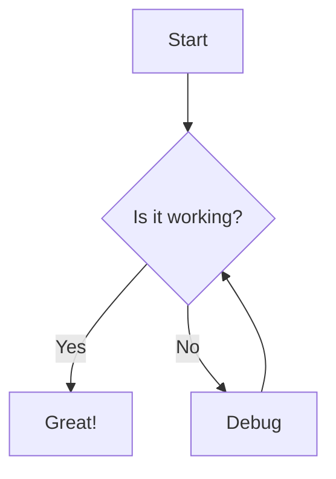
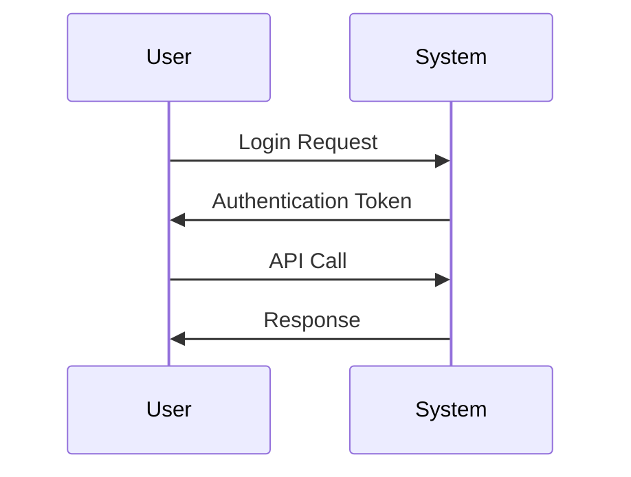
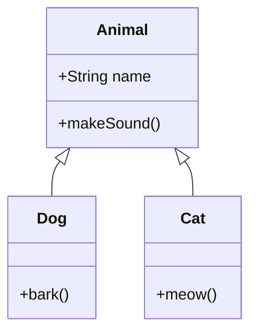

# Markdown Features Showcase

This repository demonstrates comprehensive support for GitHub Flavored Markdown (GFM) with advanced features including Expressive Code highlighting and Mermaid diagrams.

## Table of Contents

- [Basic Markdown](#basic-markdown)
- [Advanced Features](#advanced-features)
- [Expressive Code](#expressive-code)
- [Mermaid Diagrams](#mermaid-diagrams)

---

## Basic Markdown

### Headings

Six levels of headings using `#` symbols:

```markdown
# H1 Heading

## H2 Heading

### H3 Heading

#### H4 Heading

##### H5 Heading

###### H6 Heading
```

### Text Styling

**Bold text** using `**text**` or `__text__`
_Italic text_ using `*text*` or `_text_`
**_Bold and italic_** using `***text***`
~~Strikethrough~~ using `~~text~~`

### Lists

**Unordered lists:**

- Item 1
- Item 2
  - Nested item
  - Another nested item

**Ordered lists:**

1. First item
2. Second item
   1. Nested item
   2. Another nested item

**Task lists:**

- [x] Completed task
- [ ] Pending task
- [ ] Another task

### Links and Images

[Basic link](https://github.com)


### Code Formatting

**Inline code:** `git status`

**Code blocks with syntax highlighting:**

```javascript
function greet(name) {
  console.log(`Hello, ${name}!`);
  return `Welcome to GitHub, ${name}`;
}
```

### Blockquotes

> This is a blockquote
>
> It can span multiple lines
>
> > And be nested

### Tables

| Feature | Syntax       | Example       |
| ------- | ------------ | ------------- |
| Bold    | `**text**`   | **Bold text** |
| Italic  | `*text*`     | _Italic text_ |
| Code    | `` `code` `` | `Inline code` |

### Mathematical Expressions

```math
C_L
```

**Inline math:** $x = \frac{-b \pm \sqrt{b^2 - 4ac}}{2a}$

**Block math:**

$$
\int_{-\infty}^{\infty} e^{-x^2} dx = \sqrt{\pi}
$$

$$
L = \frac{1}{2} \rho v^2 S C_L
$$

```math
L = \frac{1}{2} \rho v^2 S C_L
```

### Footnotes

You can add footnotes[^1] to provide additional information.

[^1]: This is a footnote reference.

---

## Advanced Features

### Emojis

Common emojis: :+1: :heart: :smile: :rocket: :star: :tada:

### Color Models

- **Hex:** `#FF0000`
- **RGB:** `rgb(255, 0, 0)`
- **HSL:** `hsl(0, 100%, 50%)`

### Alerts

> **Note:** Useful information that users should know.

> **Tip:** Helpful advice for doing things better.

> **Important:** Key information users need to know.

> **Warning:** Urgent info that needs immediate attention.

> **Caution:** Advises about risks or negative outcomes.

---

## Expressive Code

This repository supports [Expressive Code](https://expressive-code.com/) for advanced code highlighting with full VS Code theme support, accurate syntax highlighting, and plugin features.

### Line Numbers

```javascript showLineNumbers
function calculateFibonacci(n) {
  if (n <= 1) {
    return n;
  }
  return calculateFibonacci(n - 1) + calculateFibonacci(n - 2);
}
```

### Editor Frames

```typescript title="TypeScript Interface"
interface User {
  id: number;
  name: string;
  email: string;
  isActive: boolean;
}

class UserService {
  private users: User[] = [];

  addUser(user: User): void {
    this.users.push(user);
  }

  getUserById(id: number): User | undefined {
    return this.users.find((user) => user.id === id);
  }
}
```

### Terminal Frames

```bash terminal
$ npm install expressive-code
$ npm run build
$ npm start
```

### Text and Line Markers

```js "given text" del={2} ins={3-4}
function demo() {
  console.log("this line is marked as deleted");
  // These lines are marked as inserted
  console.log("this is the second inserted line");
  return "Multiple matches of the given text are supported";
}
```

### Word Wrap

```css wrap
.container {
  display: flex;
  flex-direction: column;
  justify-content: center;
  align-items: center;
  min-height: 100vh;
  background: linear-gradient(135deg, #667eea 0%, #764ba2 100%);
  font-family: "Segoe UI", Tahoma, Geneva, Verdana, sans-serif;
}
```

### Collapsible Sections

```html collapse={1-5, 12-14}
<!DOCTYPE html>
<html lang="en">
  <head>
    <meta charset="UTF-8" />
    <title>Advanced Web Application</title>
  </head>
  <body>
    <header>
      <nav>
        <ul>
          <li><a href="#home">Home</a></li>
          <li><a href="#about">About</a></li>
        </ul>
      </nav>
    </header>
    <main>
      <section id="hero">
        <h1>Welcome to Our Platform</h1>
        <p>Discover amazing features</p>
      </section>
    </main>
  </body>
</html>
```

### Combined Features

```typescript editor 1-15 mark=3,7,11
interface ApiResponse<T> {
  data: T;
  status: number;
  message: string;
}

async function fetchUserData(userId: number): Promise<ApiResponse<User>> {
  try {
    const response = await fetch(`/api/users/${userId}`);
    const data = await response.json();

    return {
      data,
      status: response.status,
      message: "Success",
    };
  } catch (error) {
    throw new Error(`Failed to fetch user data: ${error.message}`);
  }
}
```

### Theme Support

```json theme="GitHub Dark"
{
  "editor.theme": "github-dark",
  "workbench.colorTheme": "GitHub Dark",
  "terminal.integrated.colorScheme": "github-dark"
}
```

---

## Mermaid Diagrams

This repository supports Mermaid diagrams for creating various types of visual diagrams.

### Flowchart



### Sequence Diagram



### Class Diagram



### Error Diagram


---

## Best Practices

1. **Use headings for structure** - Create a clear hierarchy
2. **Keep it readable** - Use appropriate formatting without overdoing it
3. **Test your markdown** - Preview before committing
4. **Use descriptive link text** - Instead of "click here"
5. **Include alt text for images** - For accessibility
6. **Use task lists for progress tracking** - Great for project management
7. **Leverage alerts for important information** - But use sparingly

## Best Practices

Another one

---

_This showcase demonstrates all the major GitHub Flavored Markdown features supported by this repository, including advanced Expressive Code highlighting and Mermaid diagram support._
