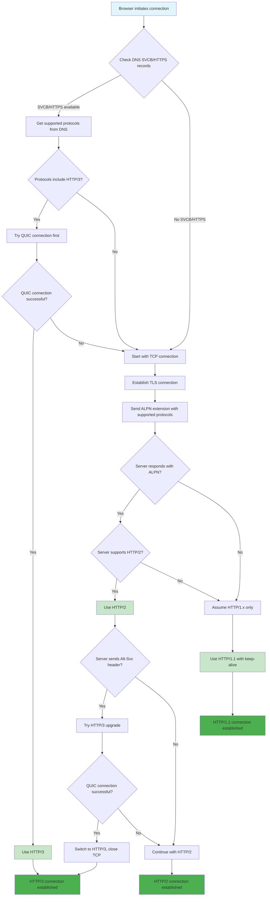
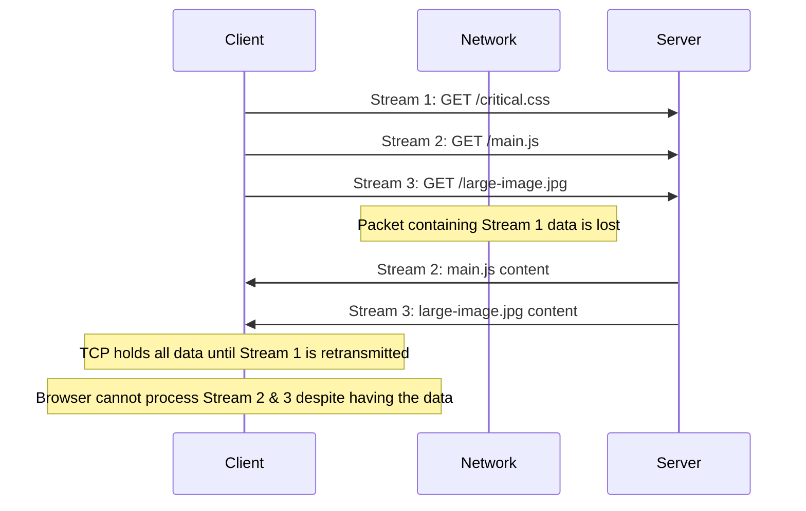
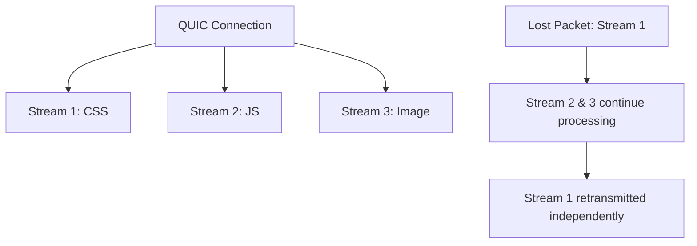

# Switching HTTP Versions: A Deep Dive into Browser Protocol Negotiation

How browsers intelligently switch between HTTP/1.1, HTTP/2, and HTTP/3 based on server capabilities, network conditions, and performance characteristics.



## Table of Contents

- [Protocol Evolution and Architectural Foundations](#protocol-evolution-and-architectural-foundations)
- [HTTP/1.1: The Foundation and Its Inherent Bottlenecks](#http11-the-foundation-and-its-inherent-bottlenecks)
- [HTTP/2: Multiplexing and Its Transport-Layer Limitations](#http2-multiplexing-and-its-transport-layer-limitations)
- [HTTP/3: The QUIC Revolution](#http3-the-quic-revolution)
- [Browser Protocol Negotiation Mechanisms](#browser-protocol-negotiation-mechanisms)
- [Performance Characteristics and Decision Factors](#performance-characteristics-and-decision-factors)
- [Security Implications and Network Visibility](#security-implications-and-network-visibility)
- [Strategic Implementation Considerations](#strategic-implementation-considerations)

## Protocol Evolution and Architectural Foundations

The evolution of HTTP from version 1.1 to 3 represents a systematic approach to solving performance bottlenecks at successive layers of the network stack. Each iteration addresses specific limitations while introducing new architectural paradigms that fundamentally change how browsers and servers communicate.

### The Bottleneck Shifting Principle

A fundamental principle in protocol design is that solving a performance issue at one layer often reveals a new constraint at a lower layer. This is precisely what happened in the HTTP evolution:

1. **HTTP/1.1**: Application-layer Head-of-Line (HOL) blocking
2. **HTTP/2**: Transport-layer HOL blocking (TCP-level)
3. **HTTP/3**: Eliminates transport-layer blocking entirely

## HTTP/1.1: The Foundation and Its Inherent Bottlenecks

Standardized in 1997, HTTP/1.1 has been the workhorse of the web for decades. Its core mechanism is a text-based, sequential request-response protocol over TCP.

### Architectural Limitations

**Head-of-Line Blocking at Application Layer**: The most significant architectural flaw is that a single TCP connection acts as a single-lane road. If a large resource (e.g., a 5MB image) is being transmitted, all subsequent requests for smaller resources (CSS, JS, small images) are blocked until the large transfer completes.

**Connection Overhead**: To circumvent HOL blocking, browsers open multiple parallel TCP connections (typically 6 per hostname). Each connection incurs:

- TCP 3-way handshake overhead
- TLS handshake overhead (for HTTPS)
- Slow-start algorithm penalties
- Memory and CPU overhead on both client and server

**Inefficient Resource Utilization**: Multiple connections often close before reaching maximum throughput, leaving substantial bandwidth unused.

### Browser Workarounds

```javascript
// HTTP/1.1 era optimizations that browsers and developers used:
// 1. Domain sharding
const domains = ["cdn1.example.com", "cdn2.example.com", "cdn3.example.com"]

// 2. File concatenation
const megaBundle = css1 + css2 + css3 + js1 + js2 + js3

// 3. Image spriting
const spriteSheet = combineImages([icon1, icon2, icon3, icon4])
```

### Protocol Negotiation in HTTP/1.1

HTTP/1.1 uses a simple, text-based negotiation mechanism:

```http
GET /index.html HTTP/1.1
Host: example.com
Connection: keep-alive
```

The server responds with its supported version and features:

```http
HTTP/1.1 200 OK
Connection: keep-alive
Content-Type: text/html
```

**Key Points**:

- Both HTTP/1.1 and HTTP/1.0 use compatible request formats
- The server's response indicates the version it supports
- Headers like "Connection: keep-alive" indicate available features
- No complex negotiation - the server simply responds with its capabilities

## HTTP/2: Multiplexing and Its Transport-Layer Limitations

Finalized in 2015, HTTP/2 introduced a binary framing layer that fundamentally changed data exchange patterns.

### Core Innovations

**Binary Framing Layer**: Replaces text-based messages with binary-encoded frames, enabling:

- **True Multiplexing**: Multiple request-response pairs can be interleaved over a single TCP connection
- **Header Compression (HPACK)**: Reduces protocol overhead through static and dynamic tables
- **Stream Prioritization**: Allows clients to signal relative importance of resources

**Server Push**: Enables proactive resource delivery, though implementation maturity has been inconsistent.

### The TCP Bottleneck Emerges

While HTTP/2 solved application-layer HOL blocking, it exposed a more fundamental issue: **TCP-level Head-of-Line Blocking**.



**The Problem**: TCP guarantees in-order delivery. If a single packet is lost, all subsequent packets (even those containing data for different HTTP/2 streams) are held back until the lost packet is retransmitted and received.

### HTTP/2 Upgrade Mechanism

Browsers have standardized on using HTTP/2 exclusively over TLS connections, leveraging the **ALPN (Application-Layer Protocol Negotiation)** extension.

#### TLS ALPN Negotiation Process

```javascript
// Browser initiates TLS connection with ALPN extension
const tlsConnection = {
  clientHello: {
    supportedProtocols: ["h2", "http/1.1"],
    alpnExtension: true,
  },
}

// Server responds with its preferred protocol
const serverResponse = {
  serverHello: {
    selectedProtocol: "h2", // Server chooses HTTP/2
    alpnExtension: true,
  },
}
```

#### HTTP Upgrade Mechanism (Theoretical)

While browsers don't use it, HTTP/2 does support plaintext connections via the HTTP Upgrade mechanism:

```http
GET /index.html HTTP/1.1
Host: example.com
Connection: Upgrade, HTTP2-Settings
Upgrade: h2c
HTTP2-Settings: <base64url encoding of HTTP/2 SETTINGS payload>
```

**Server Response Options**:

```http
# Accepts upgrade
HTTP/1.1 101 Switching Protocols
Connection: Upgrade
Upgrade: h2c

# Rejects upgrade
HTTP/1.1 200 OK
Content-Type: text/html
# ... normal HTTP/1.1 response
```

**Key Points**:

- Browsers require TLS for HTTP/2 (no plaintext support)
- ALPN provides seamless protocol negotiation during TLS handshake
- HTTP Upgrade mechanism exists but is unused by browsers
- Server must support ALPN extension for HTTP/2 to work

## HTTP/3: The QUIC Revolution

HTTP/3 represents a fundamental paradigm shift by abandoning TCP entirely in favor of QUIC (Quick UDP Internet Connections), a new transport protocol built on UDP.

### QUIC Architecture: User-Space Transport

**Key Innovation**: QUIC implements transport logic in user space rather than the OS kernel, enabling:

- **Rapid Evolution**: New features can be deployed with browser/server updates
- **Protocol Ossification Resistance**: No dependency on network middlebox updates
- **Integrated Security**: TLS 1.3 is built into the transport layer

### Core QUIC Mechanisms

#### 1. Stream Independence



**Elimination of HOL Blocking**: Each QUIC stream is independent at the transport layer. Packet loss on one stream doesn't affect others.

#### 2. Connection Migration

```javascript
// QUIC enables seamless connection migration
const quicConnection = {
  connectionId: "unique-cid-12345",
  migrateToNewPath: (newIP, newPort) => {
    // Connection persists across network changes
    // No re-handshake required
    return true
  },
}
```

**Session Continuity**: Connections persist across IP/port changes (e.g., WiFi to cellular), enabling uninterrupted sessions.

#### 3. Advanced Handshakes

- **1-RTT Handshake**: Combined transport and cryptographic setup
- **0-RTT Resumption**: Immediate data transmission for returning visitors

### Congestion Control Evolution

QUIC's user-space implementation enables pluggable congestion control algorithms:

```javascript
// CUBIC vs BBR performance characteristics
const congestionControl = {
  CUBIC: {
    type: "loss-based",
    behavior: "aggressive increase, drastic reduction on loss",
    bestFor: "stable, wired networks",
  },
  BBR: {
    type: "model-based",
    behavior: "probes network, maintains optimal pacing",
    bestFor: "lossy networks, mobile connections",
  },
}
```

## Browser Protocol Negotiation Mechanisms

Browsers employ sophisticated mechanisms to determine the optimal HTTP version for each connection.

### 1. DNS-Based Protocol Discovery (SVCB/HTTPS Records)

```bash
; Modern DNS records for protocol negotiation
example.com. 3600 IN HTTPS 1 . alpn="h3,h2" port=443
example.com. 3600 IN SVCB 1 . alpn="h3,h2" port=443
```

**Benefits**:

- Eliminates initial TCP connection for HTTP/3-capable servers
- Reduces connection establishment latency
- Enables parallel connection attempts

#### DNS Load Balancing Considerations

When using multiple CDNs or load balancers, DNS responses might come from different sources:

```bash
; A record from CDN A
example.com. 300 IN A 192.0.2.1

; HTTPS record from CDN B
example.com. 3600 IN HTTPS 1 . alpn="h3,h2"
```

**Problem**: If the HTTPS record advertises HTTP/3 support but the client connects to a CDN that doesn't support it, the connection will fail.

**Solution**: Include IP hints in the HTTPS record:

```bash
example.com. 3600 IN HTTPS 1 . alpn="h3,h2" ipv4hint="192.0.2.1" ipv6hint="2001:db8::1"
```

#### Alternative Service Endpoints

SVCB and HTTPS records can also define alternative endpoints:

```bash
; Primary endpoint with HTTP/3 support
example.com. 3600 IN HTTPS 1 example.net alpn="h3,h2"

; Fallback endpoint with HTTP/2 only
example.com. 3600 IN HTTPS 2 example.org alpn="h2"
```

### 2. TLS ALPN (Application-Layer Protocol Negotiation)

```javascript
// TLS handshake with ALPN extension
const tlsHandshake = {
  clientHello: {
    supportedProtocols: ["h2", "http/1.1"],
    alpnExtension: true,
  },
  serverHello: {
    selectedProtocol: "h2", // Server chooses HTTP/2
    alpnExtension: true,
  },
}
```

**Fallback Mechanism**: If ALPN is unavailable, browsers assume HTTP/1.1 support.

### 3. Alt-Svc Header for HTTP/3 Upgrade

```http
HTTP/2 200 OK
Alt-Svc: h3=":443"; ma=86400
```

**Server-Initiated Upgrade**: Servers advertise HTTP/3 availability, allowing browsers to attempt QUIC connections.

### HTTP/3 Upgrade Mechanism

HTTP/3 uses a fundamentally different transport protocol (QUIC over UDP), making inline upgrades impossible. The upgrade process is server-initiated and requires multiple steps.

#### Initial TCP Connection

Since browsers can't know a priori if a server supports QUIC, they must establish an initial TCP connection:

```javascript
// Browser always starts with TCP + TLS
const initialConnection = {
  transport: "TCP",
  protocol: "TLS 1.3",
  alpn: ["h2", "http/1.1"], // Note: no h3 in initial ALPN
  purpose: "discover HTTP/3 support",
}
```

#### Server-Initiated HTTP/3 Advertisement

The server advertises HTTP/3 support through HTTP headers:

```http
# HTTP/1.1 response with Alt-Svc header
HTTP/1.1 200 OK
Content-Type: text/html
Alt-Svc: h3=":443"; ma=86400

# HTTP/2 response with ALTSVC frame
HTTP/2 200 OK
ALTSVC: h3=":443"; ma=86400
```

#### Browser QUIC Connection Attempt

Upon receiving the Alt-Svc header, the browser attempts a QUIC connection:

```javascript
// Browser protocol upgrade logic
const upgradeToHTTP3 = async (altSvcHeader) => {
  const quicConfig = parseAltSvc(altSvcHeader)

  try {
    // Attempt QUIC connection to same hostname
    const quicConnection = await establishQUIC(quicConfig.host, quicConfig.port)

    if (quicConnection.successful) {
      // Close TCP connection, use QUIC
      closeTCPConnection()
      return "HTTP/3"
    }
  } catch (error) {
    // Fallback to existing TCP connection
    console.log("QUIC connection failed, continuing with TCP")
  }

  return "HTTP/2" // or HTTP/1.1
}
```

#### DNS-Based HTTP/3 Discovery

Modern browsers can discover HTTP/3 support through DNS records, eliminating the need for initial TCP connections:

```bash
; SVCB record for HTTP/3 discovery
example.com. 3600 IN SVCB 1 . alpn="h3,h2" port=443

; HTTPS record (alternative format)
example.com. 3600 IN HTTPS 1 . alpn="h3,h2" port=443
```

**Key Points**:

- HTTP/3 upgrade is server-initiated, not client-initiated
- Requires initial TCP connection for discovery (unless DNS records are used)
- Alt-Svc header or ALTSVC frame advertises QUIC support
- Browser attempts QUIC connection and falls back to TCP if it fails
- DNS-based discovery can eliminate the initial TCP connection requirement

## Performance Characteristics and Decision Factors

### Quantitative Performance Analysis

**Latency Improvements**:

- **HTTP/2 vs HTTP/1.1**: 200-400ms improvement for typical web pages
- **HTTP/3 vs HTTP/2**: 200-1200ms improvement, scaling with network latency
- **0-RTT Resumption**: Additional 100-300ms improvement for returning visitors

**Throughput Characteristics**:

```javascript
const performanceProfile = {
  "stable-broadband": {
    http1: "baseline",
    http2: "significant improvement",
    http3: "minimal additional benefit",
  },
  "mobile-lossy": {
    http1: "baseline",
    http2: "moderate improvement",
    http3: "dramatic improvement",
  },
  "high-latency": {
    http1: "baseline",
    http2: "good improvement",
    http3: "excellent improvement",
  },
}
```

### Browser Decision Logic

```javascript
// Simplified browser protocol selection logic
class ProtocolSelector {
  async selectProtocol(hostname) {
    // 1. Check DNS SVCB/HTTPS records
    const dnsInfo = await this.queryDNS(hostname)
    if (dnsInfo.supportsHTTP3) {
      const quicSuccess = await this.tryQUIC(hostname)
      if (quicSuccess) return "HTTP/3"
    }

    // 2. Fallback to TCP + TLS ALPN
    const tlsInfo = await this.establishTLS(hostname)
    if (tlsInfo.supportsHTTP2) {
      // 3. Check for Alt-Svc upgrade
      const altSvc = await this.checkAltSvc(hostname)
      if (altSvc && (await this.tryQUIC(hostname))) {
        return "HTTP/3"
      }
      return "HTTP/2"
    }

    return "HTTP/1.1"
  }
}
```

## Security Implications and Network Visibility

### The Encryption Paradigm Shift

HTTP/3's pervasive encryption challenges traditional network security models:

```javascript
// Traditional network inspection vs HTTP/3
const securityModel = {
  traditional: {
    inspection: "deep packet inspection",
    visibility: "full protocol metadata",
    filtering: "SNI-based, header-based",
  },
  http3: {
    inspection: "endpoint-based only",
    visibility: "minimal transport metadata",
    filtering: "application-layer required",
  },
}
```

### 0-RTT Security Considerations

```javascript
// 0-RTT replay attack mitigation
const zeroRTTPolicy = {
  allowedMethods: ["GET", "HEAD", "OPTIONS"], // Idempotent only
  forbiddenMethods: ["POST", "PUT", "DELETE"],
  replayDetection: "application-level nonces required",
}
```

## Strategic Implementation Considerations

### Server Support Matrix

| Server | HTTP/2     | HTTP/3      | Configuration Complexity |
| ------ | ---------- | ----------- | ------------------------ |
| Nginx  | ✅ Mature  | ✅ v1.25.0+ | 🔴 High (custom build)   |
| Caddy  | ✅ Default | ✅ Default  | 🟢 Minimal               |
| Apache | ✅ Mature  | ❌ None     | 🟡 CDN-dependent         |

### CDN Strategy

```javascript
// CDN-based HTTP/3 adoption
const cdnStrategy = {
  benefits: [
    "no server configuration required",
    "automatic protocol negotiation",
    "built-in security and optimization",
  ],
  considerations: [
    "reduced visibility into origin connection",
    "potential for suboptimal routing",
    "dependency on CDN provider capabilities",
  ],
}
```

### Performance Monitoring

```javascript
// Key metrics for protocol performance analysis
const performanceMetrics = {
  userCentric: ["LCP", "TTFB", "PLT", "CLS"],
  networkLevel: ["RTT", "packetLoss", "bandwidth"],
  serverSide: ["CPU utilization", "memory usage", "connection count"],
}
```

## Conclusion

The browser's HTTP version selection process represents a sophisticated balance of performance optimization, security requirements, and network adaptability. Understanding this process is crucial for:

1. **Infrastructure Planning**: Choosing appropriate server configurations and CDN strategies
2. **Performance Optimization**: Implementing protocol-specific optimizations
3. **Security Architecture**: Adapting to the new encrypted transport paradigm
4. **Monitoring Strategy**: Developing appropriate observability for each protocol

The evolution from HTTP/1.1 to HTTP/3 demonstrates how protocol design must address both immediate performance bottlenecks and long-term architectural constraints. For expert engineers, this knowledge enables informed decisions about when and how to adopt new protocols based on specific use cases, user demographics, and technical capabilities.

## References

- [Speeding up HTTPS and HTTP/3 negotiation with... DNS](https://blog.cloudflare.com/speeding-up-https-and-http-3-negotiation-with-dns/)
- [How does browser know which version of HTTP it should use when sending a request?](https://superuser.com/questions/1659248/how-does-browser-know-which-version-of-http-it-should-use-when-sending-a-request)
- [How is the HTTP version of a browser request and the HTTP version of a server response determined?](https://superuser.com/questions/670889/how-is-the-http-version-of-a-browser-request-and-the-http-version-of-a-server-re)
- [Service binding and parameter specification via the DNS (DNS SVCB and HTTPS RRs)](https://datatracker.ietf.org/doc/html/draft-ietf-dnsop-svcb-https-12)
- [QUIC: A UDP-Based Multiplexed and Secure Transport](https://datatracker.ietf.org/doc/html/rfc9000)
- [HTTP/3](https://datatracker.ietf.org/doc/html/rfc9114)
