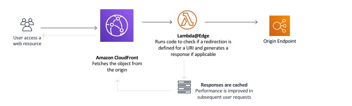

# Implementing Redirection for Static Sites

This blogs talks about handling redirects in Static Sites


## Table of Contents

This approach is a two fold implementation

- Generating pages which redirects the user on client side using JavaScript
- Implementing Redirects with CDN (This talks about cloudfront)

## Generating `index.html` for redirects

We generate an index.html page for the redirected paths. This has the below components

- `http-equiv="refresh"`: The number of seconds until the page should redirect to another - only if the content attribute contains a non-negative integer followed by the string `';url='`, and a valid URL.
  - `0;url==https://path/to/redirect`: redirects to the given url after 0 seconds.
- `robots` meta tag, asks the crawlers to not index the page.
- `canonical` link tag: it defines the preferred URL for the current document, which helps search engines reduce duplicate content.
- body has a anchor tag, which points to the redirected page

### Sample Code

```html
<!doctype html>
<html>
  <head>
    <title>Redirecting to https://path/to/redirect</title>
    <meta http-equiv="refresh" content="0;url=https://path/to/redirect" />
    <meta name="robots" content="noindex" />
    <link rel="canonical" href="https://path/to/redirect" />
  </head>
  <body>
    <a href="https://path/to/redirect"> Redirect to https://path/to/redirect </a>
  </body>
</html>
```

## Configuring Redirects with \_redirects for supported hosting provider

A lot of hosting providers, supports redirection using `_redirects` file.
E.g. For `sujeet.pro`, I use cloudflare pages which supports redirection in this way.

The contents of this file is space separated values in format of `redirect-from redirect-to`.

Below is the snippet from the redirection configuration used for `sujeet.pro`

```txt
/gh https://github.com/sujeet-pro
/in https://www.linkedin.com/in/sujeetkrjaiswal/
/linkedin https://www.linkedin.com/in/sujeetkrjaiswal/
/twitter https://twitter.com/sujeetpro
/x https://twitter.com/sujeetpro
```

## Configuring Redirection for Cloudfront with lambda@edge

> If your static site is in S3 and is backed by a Cloudfront CDN, you can use this approach.

Cloudfront supports interceptors using lambda@edge and cloudfront funtions.

- Viewer Request Interceptor (lambda@edge or Cloufront Functions)
- Origin Request Interceptor (only lambda@edge)
- Origin Response Interceptor (only lambda@edge)
- Viewer Response Interceptor (lambda@edge or Cloufront Functions)



We can use lambda@edge function to redirect the users.
For data on what urls to redirect and where to redirect, we can deploy a json configuration along with the code.

```js
"use strict"

exports.handler = (event, context, callback) => {
  let request = event.Records[0].cf.request
  //if URI matches to 'pretty-url' then redirect to a different URI
  if (request.uri == "/pretty-url") {
    //Generate HTTP redirect response to a different landing page.
    const redirectResponse = {
      status: "301",
      statusDescription: "Moved Permanently",
      headers: {
        location: [
          {
            key: "Location",
            value: "/somecampaign/index.html",
          },
        ],
        "cache-control": [
          {
            key: "Cache-Control",
            value: "max-age=3600",
          },
        ],
      },
    }
    callback(null, redirectResponse)
  } else {
    // for all other requests proceed to fetch the resources
    callback(null, request)
  }
}
```

## Redirection using Web Server

If you serve your static files via your won web servers, all the web servers supports redirections.

### Configuring Nginx

```nginx
server {
 # Temporary redirect to an individual page
 rewrite ^/oldpage1$ http://www.domain.com/newpage1 redirect;

 # Permanent redirect to an individual page
 rewrite ^/oldpage2$ http://www.domain.com/newpage2 permanent;
 }
```

## References

- [Redirection - MDN](https://developer.mozilla.org/en-US/docs/Web/HTTP/Redirections)
- [http-equiv - MDN](https://developer.mozilla.org/en-US/docs/Web/HTML/Element/meta#http-equiv)
- [canonical - MDN](https://developer.mozilla.org/en-US/docs/Web/HTML/Attributes/rel#canonical)
- [robots - MDN](https://developer.mozilla.org/en-US/docs/Web/HTML/Element/meta/name#other_metadata_names)
- [lambda@edge redirection](https://aws.amazon.com/blogs/networking-and-content-delivery/handling-redirectsedge-part1/)
- [Nginx Rewrite Rules](https://www.nginx.com/blog/creating-nginx-rewrite-rules/)
