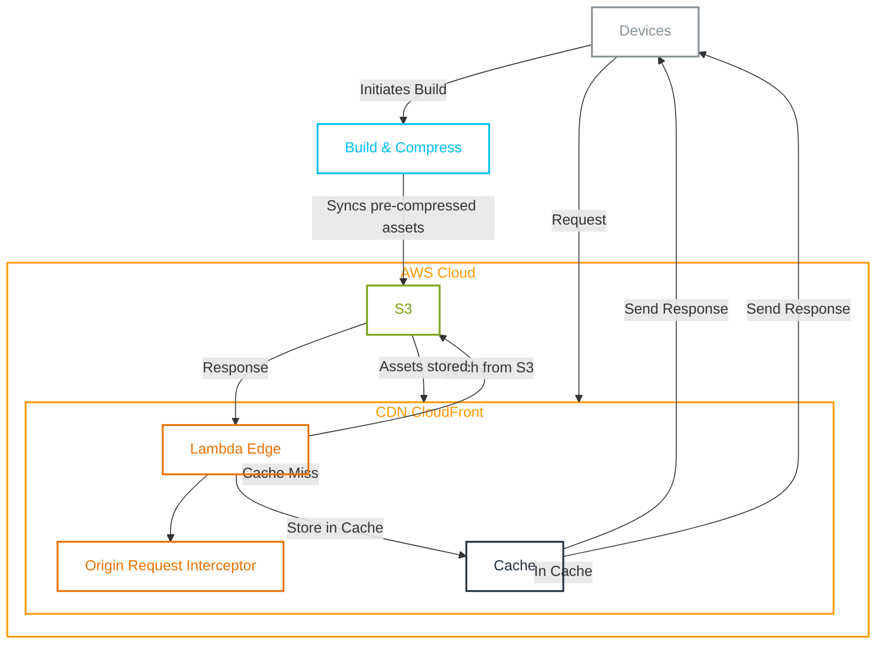

# Optimizing Content Delivery by Serving Pre-compressed content

Serving Pre-compressed content from CDN

## Table of Contents

At our organization, we leverage Amazon CloudFront to distribute content globally, ensuring low-latency access to our web assets. However, we encountered challenges with automatic compression settings that led to unexpected cost spikes and suboptimal compression results.

## Understanding Compression in CloudFront

Compression is a key technique to reduce the size of web assets, resulting in faster load times and decreased bandwidth consumption. Enabling compression in CloudFront involves configuring cache behaviors, cache policies, and setting appropriate Time-To-Live (TTL) values.

### Enable compression

- Set the "Compress objects automatically" option to Yes.
- Use a cache policy with Gzip and Brotli settings enabled.
- Ensure TTL values in the cache policy are greater than zero.

### Serving Auto-Compressed Files

When a viewer requests an object, CloudFront checks the cache for a compressed copy. If present, it's sent to the viewer; otherwise, the request proceeds to the origin server. If the object is compressible, CloudFront compresses it, caches the result, and then serves it to the viewer.

However, there are cases where compression is skipped or not optimal:

- Objects below 1,000 bytes or exceeding 10,000,000 bytes are not compressed.
- If an uncompressed copy is already in the cache, CloudFront may serve it without re-compressing.
- CloudFront compresses objects on a best-effort basis, occasionally skipping compression based on various factors.

## Identifying the Problem

Our specific challenges stemmed from the size of our page data for collection SSG pages (SSG), which approached 10MB. When this size exceeded the limit, automatic compression was skipped, leading to bandwidth spikes and increased costs.

Additionally, we observed CloudFront favoring Gzip over Brotli, even on browsers supporting Brotli. This occurred due to occasional compression skipping and subsequent caching of uncompressed objects.

### The Solution: Dual Compression Strategy

To address these issues, we implemented a dual compression strategy using both Gzip and Brotli at the highest compression levels. Despite the slower compression time of Brotli, the bandwidth reduction outweighed the trade-off. Users experienced faster downloads, contributing to an improved overall experience.

### Implementation Details

- **Extended Build Process:** We modified our build process to produce three versions of each asset: original, Gzip, and Brotli.
- **S3 Storage:** The compressed assets were synced to Amazon S3 with appropriate meta tags for content type.
- **Lambda@Edge Integration:** We implemented an Origin Request Interceptor using Lambda@Edge for CloudFront. This interceptor dynamically modified the request URI based on the "Accept-Encoding" header, ensuring the appropriate compressed version was served.

## Conclusion

By strategically implementing dual compression and optimizing our content delivery pipeline, we achieved significant bandwidth savings and enhanced user experience. CloudFront, when configured thoughtfully, can be a powerful tool for global content delivery, striking the right balance between network optimization and computational efficiency.

## Appendix

For [Quince's New Arrival Page](https://www.quince.com/all/new-arrivals), as on Jan 21st 2024, below tables show the compression at different quality

- Total Uncompressed Content Length (for html file only): 3710512
- Ratio - Referes to the compression ratio = Un Compressed / Compressed
- Improvmeent - % of improvement over Gzip

## References

- [CloudFront Serving Compressed Files](https://docs.aws.amazon.com/AmazonCloudFront/latest/DeveloperGuide/ServingCompressedFiles.html)
- [Compression benchmark](https://quixdb.github.io/squash-benchmark/#results)
- [Compression Comparision](https://projects.sujeet.pro/compression-comparision/)
