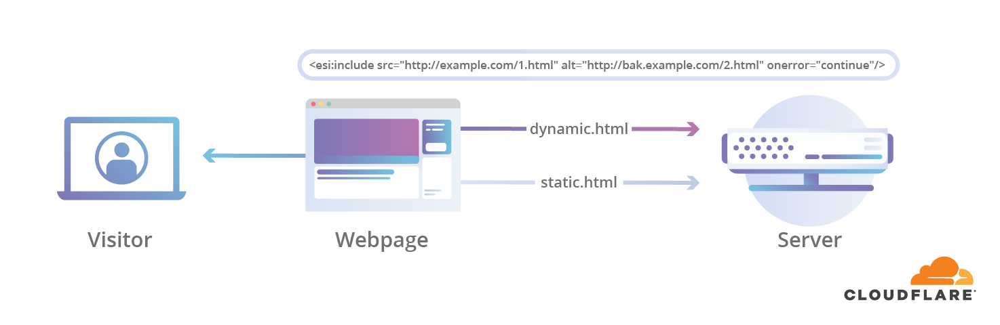
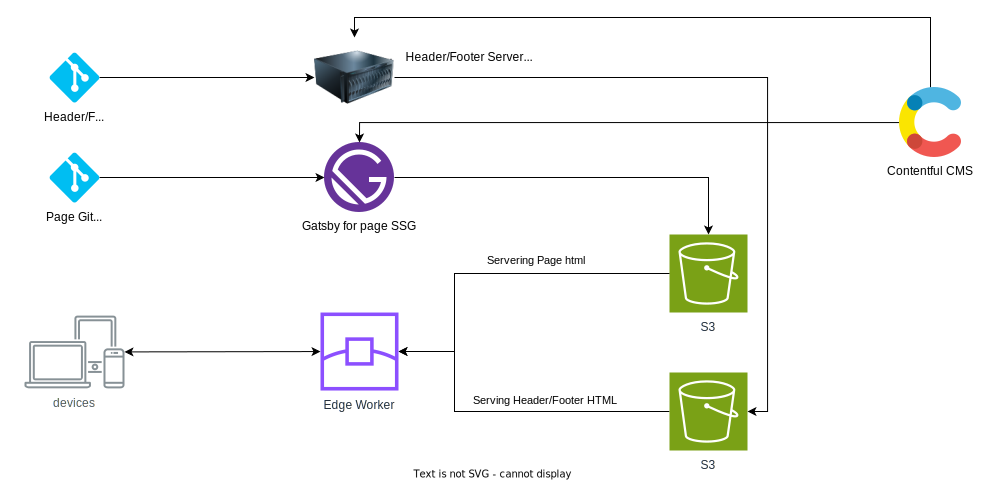

# Micro-frontend with Cloudflare ESI

Explores ESI for dynamic injection of header and footer (as microfrontent) in a microsite architecture implemented with SSG

## Table of Contents

This blog delves into how Vistaprint overcame challenges in synchronizing common components like headers and footers across a microsite architecture. It explores the implementation of Edge-Side Includes (ESI) with Cloudflare Workers to achieve dynamic injection and content updates without compromising user experience.

## Microsite Pain Points: Centralized vs. Independent Deployment

In a microsite architecture, each page can be built and deployed independently. This fosters agility but introduces the challenge of synchronizing shared components like headers and footers. Vistaprint initially used a shared React library for these elements. While this centralized approach simplified code updates, it required synchronized deployments for all pages to avoid inconsistencies and bad user experience. Moreover, statically generated pages needed rebuilds even for header/footer changes, impacting performance.

Basically, we wanted somthing similar to webpack module federation (microfrontend), but it should not be limited to using the latest code but the content as well.
This solution should allow us to use the latest code, and inject the latest content in a Server Side Generated Static pages.

## ESI to the Rescue: Dynamic Injection at the Edge

To address these challenges, Vistaprint turned to ESI, a mechanism for dynamically injecting content at the edge, specifically before serving the page to users. This eliminated the need for client-side injection, which can lead to poor UX.

Here's how ESI with Cloudflare Workers works in this context:

### Edge Worker Actions

- Fetch static content: The Cloudflare worker retrieves the static HTML page.
- Parse for ESI tags: It searches for any `<esi:include/>` tags within the payload.
- Fetch ESI blocks: Each identified `<esi:include/>` block triggers a separate request to the ESI server.
- Merge content: The worker merges the static content with the dynamically fetched ESI blocks.
- Deliver the final payload: The combined content is served to the visitor.

### Header/Footer Injection

The shared React library was modified to inject `<esi:include/>` tags instead of rendering the actual header and footer content.
Cloudflare workers were configured to inject HTML fragments containing inlined scripts for dynamically fetching the header and footer from the ESI server.

### ESI Server and Caching

- A separate server managed the header and footer content, updating it with fresh content every few minutes and uploading to S3
- Cloudflare worker requests for ESI blocks were served from S3 to minimize response times.

### Advantages of this Approach

- Centralized updates: Header and footer content changes require updates only on the ESI server, eliminating synchronized page deployments.
- Improved performance: Dynamic injection avoids unnecessary page rebuilds, enhancing performance for static content updates.
- Consistent user experience: All users receive the same up-to-date headers and footers regardless of individual page deployments.
- This implementation of ESI with Cloudflare Workers demonstrates an effective solution for managing dynamic components in a microservices architecture. By leveraging edge injection and caching, Vistaprint achieved centralized control, improved performance, and a consistent user experience across its pages.

## Implementation with SSG

## Reference

- [Edge-Side-Includes with Cloudflare Workers](https://blog.cloudflare.com/edge-side-includes-with-cloudflare-workers)
- [Making Edge Side Includes (ESI) Automatic and Easy](https://blog.cloudflare.com/making-edge-side-includes-esi-automatic-and-e)
