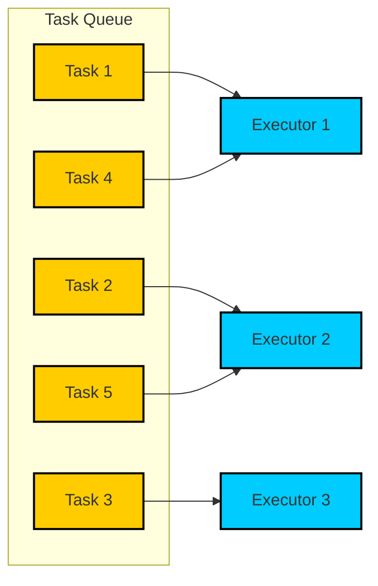
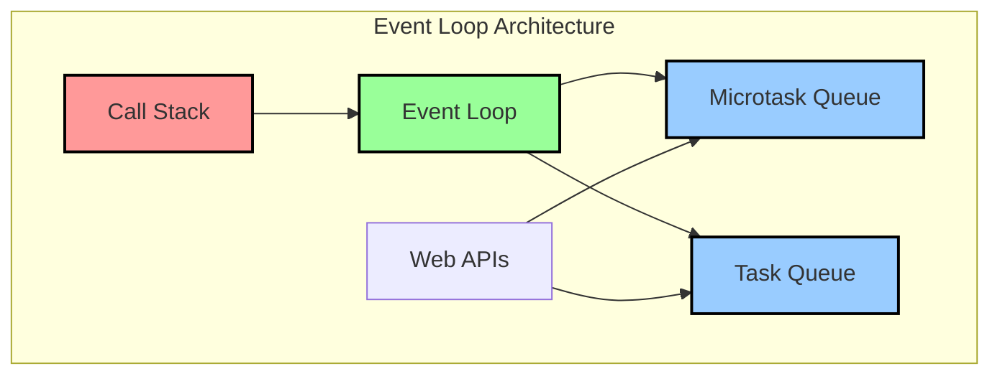
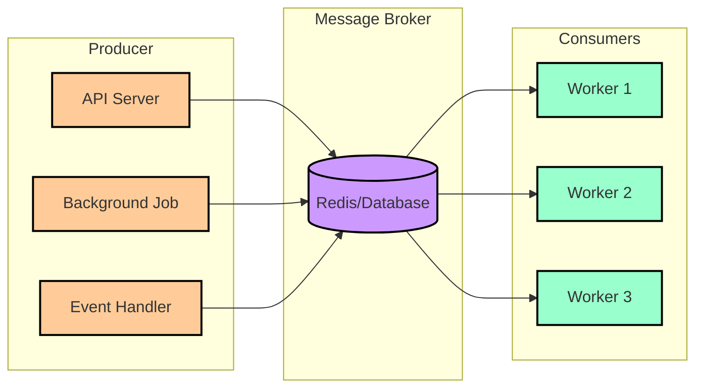
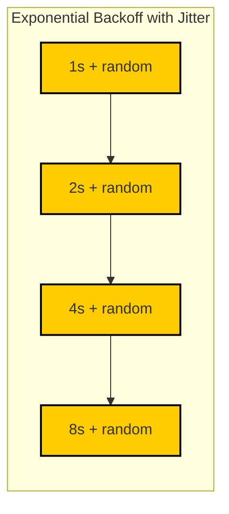
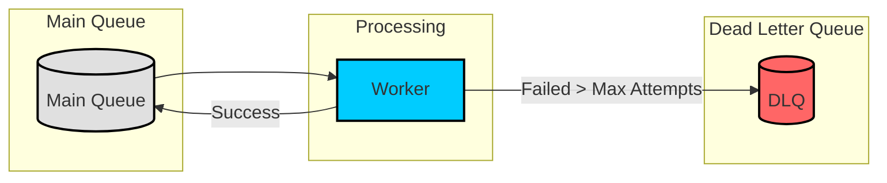
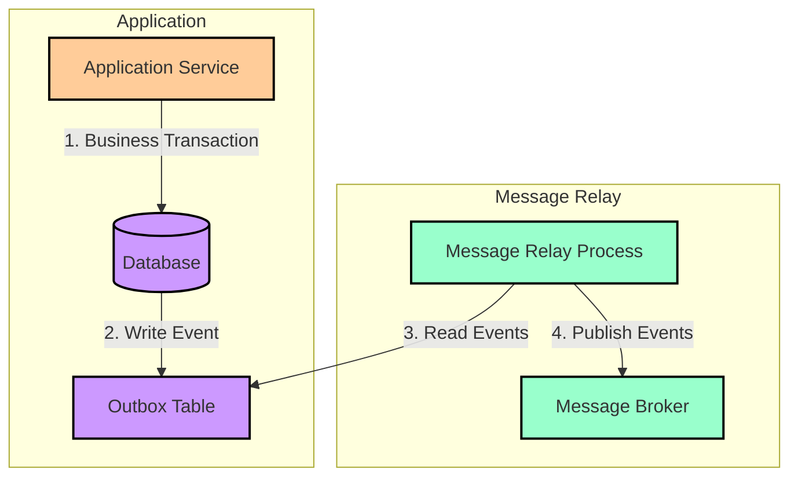
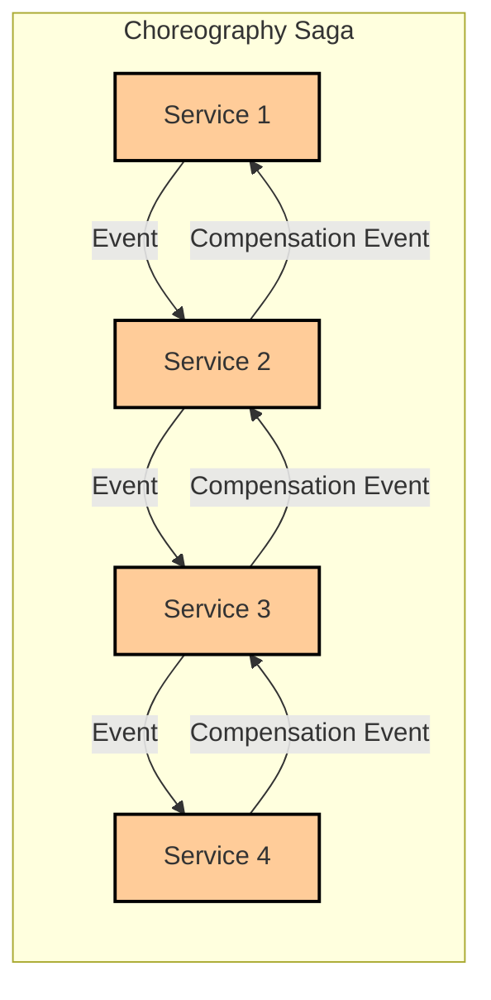
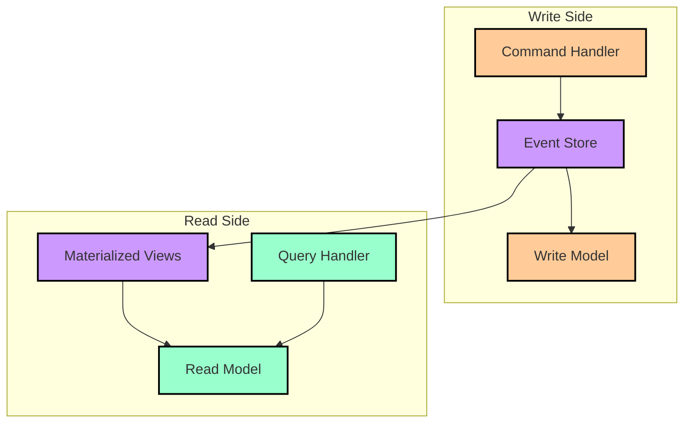

# Asynchronous Task Processing in Node.js

Build resilient, scalable asynchronous task processing systems from basic in-memory queues to advanced distributed patterns using Node.js.



## Table of Contents

- [Part 1: The Foundation of Asynchronous Execution](#part-1-the-foundation-of-asynchronous-execution)
  - [1.1 The Event Loop and In-Process Concurrency](#11-the-event-loop-and-in-process-concurrency)
  - [1.2 In-Memory Task Queues: Controlling Local Concurrency](#12-in-memory-task-queues-controlling-local-concurrency)
- [Part 2: The Ideology of Distributed Async Task Queues](#part-2-the-ideology-of-distributed-async-task-queues)
  - [2.1 Distributed Architecture Components](#21-distributed-architecture-components)
  - [2.2 Node.js Task Queue Libraries Comparison](#22-nodejs-task-queue-libraries-comparison)
  - [2.3 Implementing with BullMQ](#23-implementing-with-bullmq)
- [Part 3: Engineering for Failure: Adding Resilience](#part-3-engineering-for-failure-adding-resilience)
  - [3.1 Retries with Exponential Backoff and Jitter](#31-retries-with-exponential-backoff-and-jitter)
  - [3.2 Dead Letter Queue Pattern](#32-dead-letter-queue-pattern)
  - [3.3 Idempotent Consumers](#33-idempotent-consumers)
- [Part 4: Advanced Architectural Patterns](#part-4-advanced-architectural-patterns)
  - [4.1 Transactional Outbox Pattern](#41-transactional-outbox-pattern)
  - [4.2 Saga Pattern for Distributed Transactions](#42-saga-pattern-for-distributed-transactions)
  - [4.3 Event Sourcing and CQRS with Kafka](#43-event-sourcing-and-cqrs-with-kafka)

## Part 1: The Foundation of Asynchronous Execution

### 1.1 The Event Loop and In-Process Concurrency

At the core of Node.js is a single-threaded, event-driven architecture. This model is highly efficient for I/O-bound operations but presents a challenge for long-running or CPU-intensive tasks, which can block the main thread and render an application unresponsive.



The Event Loop orchestrates execution between the Call Stack, where synchronous code runs, and various queues that hold callbacks for asynchronous operations. When an async operation completes, its callback is placed in a queue. The Event Loop monitors the Call Stack and processes tasks from these queues when it becomes empty.

**Queue Types:**

- **Task Queue (Macrotask Queue)**: Holds callbacks from I/O operations, `setTimeout`, and `setInterval`
- **Microtask Queue**: Holds callbacks from Promises (`.then()`, `.catch()`) and `process.nextTick()`. This queue has higher priority - all microtasks are executed to completion before the Event Loop processes the next task from the macrotask queue.

### 1.2 In-Memory Task Queues: Controlling Local Concurrency

For many applications, the first step beyond simple callbacks is an in-memory task queue. The goal is to manage and throttle the execution of asynchronous tasks within a single process, such as controlling concurrent requests to a third-party API to avoid rate limiting.

```ts file=./2025-01-24-code-sample.ts collapse={47-52, 56-64, 67-75, 80-89, 101-106, 110-112}

```

This implementation provides basic control over local asynchronous operations. However, it has critical limitations for production systems:

- **No Persistence**: Jobs are lost if the process crashes
- **No Distribution**: Cannot be shared across multiple processes or servers
- **Limited Features**: Lacks advanced features like retries, prioritization, or detailed monitoring

## Part 2: The Ideology of Distributed Async Task Queues

To build scalable and reliable Node.js applications, especially in a microservices architecture, tasks must be offloaded from the main application thread and managed by a system that is both persistent and distributed.

### 2.1 Distributed Architecture Components



A distributed task queue system consists of three main components:

1. **Producers**: Application components that create jobs and add them to a queue
2. **Message Broker**: A central, persistent data store (like Redis or a database) that holds the queue of jobs
3. **Consumers (Workers)**: Separate processes that pull jobs from the queue and execute them

**Key Benefits:**

- **Decoupling**: Producers and consumers operate independently
- **Reliability**: Jobs are persisted in the message broker
- **Scalability**: Multiple worker processes can handle increased load (Competing Consumers pattern)

### 2.2 Node.js Task Queue Libraries Comparison

| Library       | Backend | Core Philosophy & Strengths                               | Key Features                                                                                    |
| ------------- | ------- | --------------------------------------------------------- | ----------------------------------------------------------------------------------------------- |
| **BullMQ**    | Redis   | Modern, robust, high-performance queue system             | Job dependencies (flows), rate limiting, repeatable jobs, priority queues, sandboxed processors |
| **Bee-Queue** | Redis   | Simple, fast, lightweight for real-time, short-lived jobs | Atomic operations, job timeouts, configurable retry strategies, scheduled jobs                  |
| **Agenda**    | MongoDB | Flexible job scheduling with cron-based intervals         | Cron scheduling, concurrency control per job, job priorities, web UI (Agendash)                 |

### 2.3 Implementing with BullMQ

**Producer: Adding a Job to the Queue**

```typescript
// producer.ts
import { Queue } from "bullmq"

// Connect to a local Redis instance
const emailQueue = new Queue("email-processing")

async function queueEmailJob(userId: number, template: string) {
  await emailQueue.add("send-email", { userId, template })
  console.log(`Job queued for user ${userId}`)
}

queueEmailJob(123, "welcome-email")
```

**Worker: Processing the Job**

```typescript
// worker.ts
import { Worker } from "bullmq"

const emailWorker = new Worker(
  "email-processing",
  async (job) => {
    const { userId, template } = job.data
    console.log(`Processing email for user ${userId} with template ${template}`)

    // Simulate sending an email
    await new Promise((resolve) => setTimeout(resolve, 2000))
    console.log(`Email sent to user ${userId}`)
  },
  {
    // Concurrency defines how many jobs this worker can process in parallel
    concurrency: 5,
  },
)

console.log("Email worker started...")
```

## Part 3: Engineering for Failure: Adding Resilience

In any distributed system, failures are not an exception but an expected part of operations. A resilient system must anticipate and gracefully handle these failures.

### 3.1 Retries with Exponential Backoff and Jitter

When a task fails due to a transient issue, the simplest solution is to retry it. However, naive immediate retries can create a "thundering herd" problem that worsens the situation.



**Exponential Backoff Strategy:**

- Delay increases exponentially: 1s, 2s, 4s, 8s
- Retries quickly for brief disruptions
- Gives overwhelmed systems meaningful recovery periods

**Jitter Implementation:**

- Adds random time to backoff delay
- Desynchronizes retry attempts from different clients
- Smooths load on downstream services

```typescript
// producer.ts - adding a job with a backoff strategy
await apiCallQueue.add(
  "call-flaky-api",
  { some: "data" },
  {
    attempts: 5, // Retry up to 4 times (5 attempts total)
    backoff: {
      type: "exponential",
      delay: 1000, // 1000ms, 2000ms, 4000ms, 8000ms
    },
  },
)
```

### 3.2 Dead Letter Queue Pattern

Some messages are inherently unprocessable due to malformed data or persistent bugs in consumer logic. These "poison messages" can get stuck in infinite retry loops.



The Dead Letter Queue (DLQ) pattern moves messages to a separate queue after a configured number of processing attempts have failed. This isolates problematic messages, allowing the main queue to continue functioning.

### 3.3 Idempotent Consumers

Most distributed messaging systems offer at-least-once delivery guarantees, meaning messages might be delivered more than once under certain failure conditions.

```typescript
// idempotent-consumer.ts
import { Worker } from "bullmq"
import { db } from "./database"

const idempotentWorker = new Worker("user-registration", async (job) => {
  const { userId, userData } = job.data

  // Check if already processed
  const existingUser = await db.users.findByPk(userId)
  if (existingUser) {
    console.log(`User ${userId} already exists, skipping`)
    return
  }

  // Process in transaction to ensure atomicity
  await db.transaction(async (t) => {
    await db.users.create(userData, { transaction: t })
    await db.processedJobs.create(
      {
        jobId: job.id,
        processedAt: new Date(),
      },
      { transaction: t },
    )
  })

  console.log(`User ${userId} registered successfully`)
})
```

## Part 4: Advanced Architectural Patterns

### 4.1 Transactional Outbox Pattern

A common challenge in event-driven architectures is ensuring that database updates and event publishing happen atomically.



The Transactional Outbox pattern writes events to an "outbox" table within the same database transaction as business data. A separate message relay process then reads from this table and publishes events to the message broker.

```typescript
// transactional-outbox.ts
async function createUserWithEvent(userData: UserData) {
  return await db.transaction(async (t) => {
    // 1. Create user
    const user = await db.users.create(userData, { transaction: t })

    // 2. Write event to outbox in same transaction
    await db.outbox.create(
      {
        eventType: "USER_CREATED",
        eventData: { userId: user.id, ...userData },
        status: "PENDING",
      },
      { transaction: t },
    )

    return user
  })
}
```

### 4.2 Saga Pattern for Distributed Transactions

In microservices architecture, coordinating updates across multiple services requires the Saga pattern.



**Saga Implementation Types:**

1. **Choreography**: Services communicate via events without central controller
   - Highly decoupled
   - Harder to debug (workflow logic distributed)

2. **Orchestration**: Central orchestrator manages workflow
   - Centralized logic, easier to monitor
   - Potential single point of failure

```typescript
// saga-orchestrator.ts
class OrderSagaOrchestrator {
  async executeOrderSaga(orderData: OrderData) {
    try {
      // Step 1: Reserve inventory
      await this.reserveInventory(orderData.items)

      // Step 2: Process payment
      await this.processPayment(orderData.payment)

      // Step 3: Create shipping label
      await this.createShippingLabel(orderData.shipping)

      // Step 4: Confirm order
      await this.confirmOrder(orderData.id)
    } catch (error) {
      // Execute compensating transactions
      await this.compensateOrderSaga(orderData, error)
    }
  }

  private async compensateOrderSaga(orderData: OrderData, error: Error) {
    // Reverse operations in reverse order
    await this.cancelShippingLabel(orderData.shipping)
    await this.refundPayment(orderData.payment)
    await this.releaseInventory(orderData.items)
  }
}
```

### 4.3 Event Sourcing and CQRS with Kafka

For applications requiring full audit history, Event Sourcing stores immutable sequences of state-changing events.



Apache Kafka's durable, replayable log is ideal for event stores. Key features include log compaction, which retains the last known value for each message key.

```typescript
// event-sourcing-example.ts
class UserEventStore {
  async appendEvent(userId: string, event: UserEvent) {
    await kafka.produce({
      topic: "user-events",
      key: userId,
      value: JSON.stringify({
        eventId: uuid(),
        userId,
        eventType: event.type,
        eventData: event.data,
        timestamp: new Date().toISOString(),
      }),
    })
  }

  async getUserEvents(userId: string): Promise<UserEvent[]> {
    const events = await kafka.consume({
      topic: "user-events",
      key: userId,
    })

    return events.map((event) => JSON.parse(event.value))
  }

  async getUserState(userId: string): Promise<UserState> {
    const events = await this.getUserEvents(userId)
    return events.reduce(this.applyEvent, {})
  }
}
```

## References

- [MDN With Resolvers](https://developer.mozilla.org/en-US/docs/Web/JavaScript/Reference/Global_Objects/Promise/withResolvers)
- [BullMQ Documentation](https://docs.bullmq.io/)
- [Node.js Event Loop](https://nodejs.org/en/docs/guides/event-loop-timers-and-nexttick/)
- [Saga Pattern](https://microservices.io/patterns/data/saga.html)
- [Event Sourcing](https://martinfowler.com/eaaDev/EventSourcing.html)
- [Transactional Outbox](https://microservices.io/patterns/data/transactional-outbox.html)
