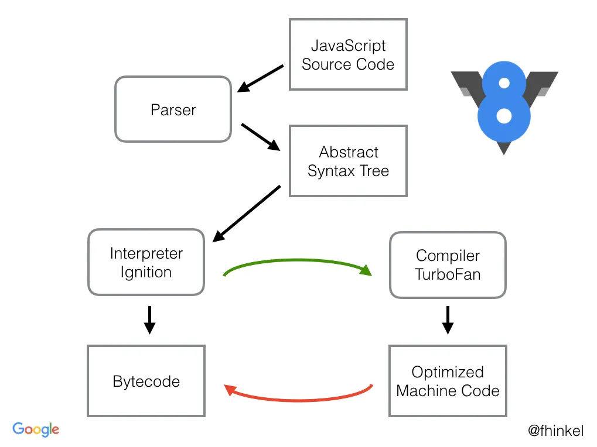

# Deconstructing Node.js: An In-Depth Analysis of Architecture, Evolution, and Performance

Node.js is frequently categorized as a "JavaScript runtime," a label that, while accurate, fails to capture the sophistication of its design and the profound impact it has had on server-side software development. Conceived by Ryan Dahl in 2009, Node.js presented a radical departure from the prevailing multi-threaded, thread-per-request server architectures of the time. Its core proposition was to leverage JavaScript, a language previously confined to web browsers, for building scalable network applications.

The platform's remarkable performance and scalability do not stem from JavaScript alone but from a unique and deliberate architectural synthesis of Google's high-performance V8 JavaScript engine and libuv, a C-based library dedicated to asynchronous I/O. This event-driven, non-blocking model was engineered to optimize throughput and scalability for applications with numerous I/O operations, such as web servers, APIs, and real-time communication systems.

This architectural model, while powerful, is not without its inherent limitations. The single-threaded nature that makes it so efficient for I/O-bound tasks simultaneously renders it ill-suited for CPU-intensive computations. Over its history, Node.js has undergone a significant and continuous evolution to address these limitations, adapt to a changing technological landscape, and align with the broader JavaScript ecosystem.

## Table of Contents

- [The Pillars of the Node.js Runtime](#the-pillars-of-the-nodejs-runtime)
- [The V8 Engine: High-Performance JavaScript Execution](#the-v8-engine-high-performance-javascript-execution)
- [Libuv: The Asynchronous I/O Engine](#libuv-the-asynchronous-io-engine)
- [Architectural Evolution: Key Shifts in the Node.js Paradigm](#architectural-evolution-key-shifts-in-the-nodejs-paradigm)
- [Core Primitives: Buffers and Streams](#core-primitives-buffers-and-streams)
- [Comparative Analysis of Concurrency Architectures](#comparative-analysis-of-concurrency-architectures)
- [Future Directions and Conclusion](#future-directions-and-conclusion)

## The Pillars of the Node.js Runtime

To comprehend the inner workings of Node.js, one must first recognize that it is not a monolithic entity. It is a composite system, an elegant orchestration of several distinct components, each with a clearly defined and specialized role. The architecture is founded on a deliberate separation of concerns, which is the very mechanism that enables its signature non-blocking, asynchronous behavior.

The primary components are Google's V8 engine, the libuv library, a set of C++ bindings that act as an intermediary, and the high-level Node.js Core API that developers interact with.

```asciidoc
+-----------------------------------------------------------------+
|                               User code (JS)                    |
+-----------------------------------------------------------------+
|                                                                 |
|       Node.js Core API (http, fs, crypto, net, buffer, etc...)  |
|                                                                 |
+-----------------------------------------------------------------+
|                                                                 |
|       C++ Bindings (JS/C++)                 C++ Add-ons         |
|                                                                 |
+-----------------------------------------------------------------+
|                                                                 |
|   +-----------------+     +---------------------------------+   |
|   |       V8        |     |  Libuv (Event loop, thread pool,|   |
|   |    (JS VM)      |     |       async IO)                 |   |
|   +-----------------+     +---------------------------------+   |
|                                                                 |
|     c-ares        llhttp        OpenSSL        zlib            |
|                                                                 |
+-----------------------------------------------------------------+
|                                                                 |
|                           Operating System                      |
|                                                                 |
+-----------------------------------------------------------------+
```

### The V8 Engine

At the heart of every Node.js process is the V8 engine, the open-source, high-performance JavaScript and WebAssembly engine developed by Google. V8's role within the Node.js architecture is specific and strictly defined: it is responsible for executing the JavaScript code written by the developer. Its domain is confined to the logic defined by the ECMAScript standard.

This includes parsing JavaScript source into an Abstract Syntax Tree (AST), compiling that code into optimized machine code via its Just-In-Time (JIT) compiler, managing the call stack for function execution, and handling memory allocation and reclamation through its sophisticated garbage collector. Critically, V8 has no intrinsic knowledge of concepts outside the JavaScript language itself; it is unaware of file systems, network sockets, or any other form of I/O. Its world begins and ends with JavaScript execution.



### Libuv

The asynchronous capabilities that define Node.js are provided by libuv, a multi-platform support library written in C. Originally developed for Node.js, libuv is the engine that powers the non-blocking I/O model. Its primary responsibilities include:

- **The Event Loop**: Libuv implements the central event loop, which is the core mechanism that allows Node.js to handle concurrency despite being single-threaded.
- **Asynchronous I/O Abstraction**: It provides a unified, cross-platform API for non-blocking I/O operations. It abstracts over the most efficient I/O notification mechanisms available on the host operating system, such as epoll on Linux, kqueue on macOS and other BSDs, I/O Completion Ports (IOCP) on Windows, and event ports on SunOS.
- **The Thread Pool**: For operations that are inherently blocking at the OS level (like most file system operations and some cryptographic functions) and lack a non-blocking primitive, libuv maintains a pool of worker threads to execute these tasks without blocking the main event loop.

Like V8, libuv's scope is specialized. It knows how to interact with the operating system to handle I/O, timers, and other system-level tasks, but it has no understanding of JavaScript objects or functions.

### C++ Bindings

The C++ bindings are the crucial "glue" layer that bridges the gap between the JavaScript world of V8 and the C-based world of libuv and other low-level system APIs. When a developer calls a Node.js function like `fs.readFile()`, they are not directly invoking libuv. Instead, the call first enters a C++ binding function.

This C++ code acts as a translator: it uses V8 APIs to unpack the JavaScript arguments (like the file path and callback function) and then makes the corresponding C-level call to a libuv function (e.g., `uv_fs_read`). When the libuv operation completes, it is again a C++ function that is responsible for taking the result from libuv, packaging it into a JavaScript-compatible format using V8 APIs, and arranging for the user's JavaScript callback to be invoked.

### Node.js Core API

The final pillar is the Node.js Core API itself. This is the collection of built-in modules, written in JavaScript, that developers use to build applications (e.g., `fs`, `http`, `crypto`, `path`). These modules provide a high-level, idiomatic JavaScript interface that abstracts away the complexity of the underlying C++ bindings and libuv operations.

The architectural design of Node.js is a masterclass in the separation of concerns. It deliberately isolates the execution of JavaScript from the handling of I/O. This decoupling is not an incidental detail but the core innovation that underpins the entire platform.

## The V8 Engine: High-Performance JavaScript Execution

While libuv provides the asynchronous capabilities, the raw speed of JavaScript execution within Node.js is entirely the domain of the V8 engine. V8's constant innovation has been a primary driver of Node.js's performance improvements over the years. Understanding its internal mechanisms, particularly its sophisticated Just-In-Time (JIT) compilation pipeline and its highly optimized memory management system, is critical for any expert-level analysis of Node.js.

### The Modern JIT Compilation Pipeline: From Fast Starts to Peak Performance

V8 does not simply interpret JavaScript. Instead, it employs a complex, multi-tiered JIT compilation pipeline designed to balance two competing goals: fast application startup and high peak execution performance. The journey from JavaScript source code to optimized machine code involves several distinct stages and compilers.

The process begins when JavaScript source code is fed into the V8 parser, which performs lexical and syntax analysis to generate an Abstract Syntax Tree (AST)—a tree-like representation of the code's logical structure. This AST is then passed to the first stage of the execution pipeline: the Ignition interpreter.

**Ignition (Interpreter)**: Ignition takes the AST and compiles it into a concise, cross-platform bytecode. This bytecode is then executed by the Ignition interpreter. The primary advantage of this approach is extremely fast startup. Generating bytecode is significantly faster than compiling directly to machine code, allowing the application to begin executing almost immediately.

While the interpreter is running the bytecode, V8's profiler is simultaneously collecting feedback data, such as which functions are called frequently ("hot" functions) and what types of data are being passed to them. This profiling data is essential for the next stages of optimization.

**The Multi-Tiered Compiler Evolution**: The architecture of V8's optimizing compilers has evolved significantly to improve performance and handle the complexities of modern JavaScript.

- **Early Model (Full-Codegen & Crankshaft)**: In its earlier days, V8 used a pipeline consisting of the Full-Codegen compiler and the Crankshaft optimizing compiler. Full-Codegen was a simple, fast compiler that generated unoptimized machine code directly from the AST. Hot functions were then re-compiled by Crankshaft, which produced highly optimized code.

- **The Ignition/TurboFan Revolution**: Around V8 version 5.9, the pipeline was redesigned around Ignition and TurboFan. This created a cleaner separation of concerns. Ignition provides a consistent bytecode baseline for all code, which is far more maintainable and less complex than the old Full-Codegen output. TurboFan acts as the new top-tier optimizing compiler.

- **Sparkplug (The "Fast" Compiler)**: A significant performance gap existed between the Ignition interpreter and the TurboFan optimizing compiler. To bridge this gap, V8 version 9.1 introduced Sparkplug, a very fast, non-optimizing JIT compiler. Sparkplug's key design feature is that it compiles directly from bytecode to machine code in a single, linear pass, without generating any intermediate representation (IR).

- **Maglev (The "Mid-Tier" Optimizing Compiler)**: The latest addition to the pipeline, introduced in Chrome M117, is Maglev. It sits between Sparkplug and TurboFan, filling the role of a mid-tier optimizing compiler. Unlike Sparkplug, Maglev is an SSA (Static Single-Assignment) based compiler that uses an IR, allowing it to perform optimizations that Sparkplug cannot.

### Memory Management and Generational Garbage Collection

Alongside JIT compilation, V8's other critical function is automatic memory management. It frees developers from the burden of manual memory allocation and deallocation, but its internal workings have a profound impact on application performance, particularly latency.

The entire system is built upon a simple but powerful observation known as the Generational Hypothesis: most objects allocated by a program have very short lifetimes ("die young"), while objects that survive for some time are likely to persist for much longer.

To capitalize on this behavior, V8 divides its memory heap into distinct generations, primarily the New Space and the Old Space, each managed by a different garbage collection (GC) algorithm tailored to the expected lifetime of the objects within it.

**The Heap Structure**:

- **New Space (Young Generation)**: This is where all newly created JavaScript objects are initially allocated. The New Space is kept relatively small (e.g., 1-8 MB by default) and is optimized for frequent, very fast garbage collection cycles. To facilitate this, it is further divided into two equal-sized "semi-spaces," often referred to as "From-Space" and "To-Space".

- **Old Space (Old Generation)**: This area is for long-lived objects. Objects that survive one or more garbage collection cycles in the New Space are "promoted" and moved into the Old Space. This space is much larger than the New Space, and garbage collection here is performed less frequently because it is a more resource-intensive process.

**Garbage Collection Algorithms**:

- **Scavenge (Minor GC)**: This algorithm operates exclusively on the New Space and is a type of "copying collector." The process works as follows:

  1. New objects are allocated sequentially in the active semi-space (let's call it From-Space).
  2. When From-Space fills up, a Scavenge cycle is triggered. This is a "stop-the-world" event, but it is extremely fast.
  3. The collector starts from the root set (global objects, stack variables) and traverses the object graph to identify all live objects within From-Space.
  4. All identified live objects are copied (evacuated) to the other, currently empty, semi-space (To-Space).
  5. Once all live objects have been copied, the From-Space is known to contain only garbage. The entire From-Space is then cleared in a single, efficient operation.
  6. The roles of the semi-spaces are swapped: To-Space becomes the new active From-Space, and the old From-Space becomes the new empty To-Space.
  7. Objects that survive a second Scavenge cycle are promoted to the Old Space instead of being copied to the new To-Space.

- **Mark-Sweep-Compact (Major GC)**: This algorithm is responsible for cleaning the Old Space. It is a more involved and time-consuming process, which is why it runs less frequently. While also a "stop-the-world" process, V8 employs numerous parallel and incremental techniques to minimize the pause time felt by the application.

## Libuv: The Asynchronous I/O Engine

If V8 is the brain of Node.js, executing JavaScript with remarkable speed, then libuv is its heart and nervous system, pumping events and enabling communication with the outside world. It is this C library that provides the asynchronous, non-blocking I/O model that is the hallmark of the platform.

### The Event Loop in Detail: A Phase-by-Phase Walkthrough

The core of Node.js's concurrency model is the event loop. It is a semi-infinite loop that runs in a single thread, responsible for processing events and executing their associated callbacks. One of libuv's most critical functions is to provide a consistent event loop API across different operating systems.

A common misconception is that the event loop manages a single callback queue. In reality, the loop is a multi-stage process. Within each "tick" or iteration of the loop, it progresses through a series of distinct phases in a strict order. Each phase has its own FIFO (First-In, First-Out) queue of callbacks to execute.


The phases of a single event loop iteration are as follows:

1. **timers**: This phase executes callbacks that have been scheduled by `setTimeout()` and `setInterval()`. The event loop checks the current time against the scheduled timers and runs the callbacks of any that have expired.

2. **pending callbacks**: This phase executes I/O callbacks that were deferred to the next loop iteration. These are for certain system operations, such as specific types of TCP errors.

3. **idle, prepare**: These phases are used internally by libuv and Node.js for housekeeping purposes and are not directly exposed to developers.

4. **poll**: This is arguably the most important phase and has two primary functions. First, it calculates how long it should block and wait ("poll") for new I/O events. Second, it processes events in the poll queue. This is where callbacks for completed I/O operations, such as data arriving on a network socket or a file read finishing, are executed.

5. **check**: This phase is specifically for executing callbacks scheduled with `setImmediate()`. These callbacks run immediately after the poll phase has completed.

6. **close callbacks**: This final phase executes callbacks for closed handles, such as a socket's 'close' event. This is where cleanup logic for asynchronous resources is typically run.

### Beyond the Loop: The Priority of Microtasks

Crucially, not all asynchronous operations are handled within the event loop's phased queues. A special class of tasks, known as microtasks, are processed in separate queues with higher priority. In Node.js, there are two primary sources of microtasks: callbacks scheduled with `process.nextTick()` and the resolution handlers of Promises (`.then()`, `.catch()`, `.finally()`).

These microtask queues are not part of the event loop's phases. Instead, they are processed immediately after the current JavaScript operation completes and before the event loop is allowed to proceed to its next phase.

Furthermore, there is a strict priority order between the two microtask queues:

1. **The process.nextTick queue**: This queue has the highest priority. All callbacks currently in the nextTick queue will be executed.
2. **The Promise microtask queue**: After the nextTick queue is completely empty, the event loop will then process all callbacks in the Promise microtask queue.

### The Illusion of Non-Blocking: The Libuv Thread Pool

While libuv uses the OS's native non-blocking mechanisms for network I/O, many other common operations do not have non-blocking equivalents at the system level. Standard file system operations (read, write), DNS lookups (`getaddrinfo`), and some cryptographic functions are inherently blocking system calls.

To solve this, libuv implements a thread pool. When a Node.js API that corresponds to a blocking system call is invoked (e.g., `fs.readFile`), the request is not handled on the main event loop thread. Instead, the Node.js C++ binding passes the request to libuv, which then delegates the blocking task to one of the worker threads in its pool.


**Size and Configuration**: By default, the libuv thread pool consists of 4 threads. This number is intentionally small to limit resource consumption but can be a bottleneck for applications performing many concurrent blocking operations. The size can be configured via the `UV_THREADPOOL_SIZE` environment variable.

**Operations Handled**: The thread pool is used for most functions in the `fs` module, DNS functions like `dns.lookup`, and CPU-intensive crypto functions like `crypto.pbkdf2` and `crypto.scrypt`. It is critical to reiterate that network I/O (e.g., from the `net` or `http` modules) does not use the thread pool; it is handled asynchronously on the main thread.

This architecture creates a subtle but critical performance dichotomy within Node.js. An application's I/O performance is not governed by a single bottleneck but by two separate and distinct resource constraints: the main event loop thread and the libuv thread pool.

## Architectural Evolution: Key Shifts in the Node.js Paradigm

Node.js is not a static platform. Since its inception, its architecture has undergone significant evolution to address its inherent limitations, adapt to new standards in the JavaScript language, and meet the growing demands of its user base.

### Concurrency: From Process Isolation (child_process) to True Multithreading (worker_threads)

The most significant architectural limitation of Node.js has always been its single-threaded execution model. While ideal for I/O-bound workloads, it makes the platform inherently unsuitable for CPU-bound tasks. A long-running, synchronous computation will monopolize the single thread, blocking the event loop and preventing it from processing any other requests.

**The Original Solution (child_process)**: The initial and long-standing solution for handling CPU-intensive work was the `child_process` module. Using `child_process.fork()`, a developer could spawn an entirely new Node.js process. This is a heavyweight approach with distinct characteristics:

- **Mechanism**: It creates a completely separate operating system process. Each forked child has its own independent V8 instance, its own event loop, and its own isolated memory space.
- **Communication**: Communication between the parent and child process relies on an Inter-Process Communication (IPC) channel established by Node.js. Data sent over this channel must be serialized (e.g., to JSON) on one side and deserialized on the other, which introduces performance overhead.
- **Overhead**: Spawning a new OS process is resource-intensive. It consumes more memory and has a slower startup time compared to creating a thread within an existing process.

**The Modern Solution (worker_threads)**: Recognizing the limitations of `child_process` for high-performance computation, Node.js introduced the `worker_threads` module, first as an experimental feature in version 10.5.0 and later stabilized in version 12. This module provides true, in-process multithreading.

- **Mechanism**: It creates lightweight threads that execute in parallel within the same process as the main thread. Each worker thread gets its own V8 instance and event loop, allowing for true parallel execution of JavaScript, but they exist within the parent's process boundary.
- **Communication**: Workers support the same IPC-style message passing as child processes. However, their key advantage is the ability to share memory directly using `SharedArrayBuffer` objects. When data is shared this way, no serialization or copying is required, allowing multiple threads to access and manipulate the same block of memory with very low latency.
- **Overhead**: Because threads are much more lightweight than processes, `worker_threads` have significantly lower memory and startup overhead, making them better suited for creating and destroying computational workers on demand.

### Native Extensibility: From V8-Coupled Abstractions (Nan) to ABI Stability (N-API)

Many Node.js applications rely on native addons—libraries written in C or C++—to achieve high performance for certain tasks or to interface with existing C/C++ codebases. Historically, developing and maintaining these addons was a significant challenge.

**The Problem with V8 Coupling**: Early native addons were written directly against the V8 C++ API. The V8 team does not guarantee API or Application Binary Interface (ABI) stability between major versions of the engine. This forced addon authors to recompile and release new versions of their packages for every major Node.js release.

**The Nan Stopgap**: To ease this pain, the Native Abstractions for Node.js (Nan) library was created. Nan is a C++ header-only library that provides a set of macros and helper functions that wrap the underlying V8 APIs. While Nan made addon maintenance easier, it did not solve the fundamental problem of ABI instability.

**The N-API Revolution**: The true solution arrived with N-API (now officially named Node-API), introduced in Node.js v8.0.0. Node-API is a C-based API that is completely independent of the underlying JavaScript engine.

- **ABI Stability**: This is the core promise and most important benefit of Node-API. A native addon compiled once against a specific Node-API version will continue to run on any later version of Node.js that supports that Node-API version, without needing to be recompiled.
- **Engine Agnostic**: Because Node-API is a pure C API that abstracts away all V8-specific details, it makes addons independent of the JavaScript engine.

### Module Systems: The Contentious Transition from CommonJS to ECMAScript Modules

When Node.js was created in 2009, the JavaScript language had no built-in module system. To manage code organization in large server-side applications, Node.js adopted the emerging CommonJS (CJS) standard, which is defined by the synchronous `require()` function and the `module.exports` object.

In 2015, the ECMAScript 2015 (ES6) specification was finalized, and it introduced an official, standard module system for JavaScript: ECMAScript Modules (ESM), defined by the `import` and `export` keywords. ESM was designed with the web in mind, featuring static analysis capabilities and, crucially, asynchronous loading.

This created a major architectural clash for Node.js. The entire existing ecosystem of thousands of npm packages was built on the synchronous nature of CommonJS. ESM's asynchronous nature was fundamentally incompatible with this expectation.

The implementation journey was long and complex:

- Initial experimental support for ESM was introduced in Node.js v8.5.0. It was hidden behind an `--experimental-modules` flag and required files to use a new `.mjs` extension.
- After years of refinement and community feedback, stable support for ESM finally arrived in Node.js v13.2.0.
- Interoperability was achieved through a set of carefully designed rules. A package can declare itself as ESM-by-default by adding `"type": "module"` to its `package.json`.

## Core Primitives: Buffers and Streams

Beyond the high-level architectural components, Node.js provides a set of low-level data primitives that are direct consequences of its focus on I/O and binary data processing. Buffer and Stream are two of the most fundamental concepts in Node.js, providing the foundational tools for managing raw data and controlling its flow through the system efficiently.

### Buffer: Managing Raw Binary Data Outside the V8 Heap

JavaScript's native String type is optimized for UTF-16 encoded text and is ill-suited for handling raw binary data, such as that received from a TCP stream or read from a binary file format. To address this gap, Node.js introduced the Buffer class.

**Purpose and Internal Implementation**: A Buffer represents a fixed-size region of physical memory that stores a sequence of bytes. Architecturally, the most critical detail of Buffers is that their memory is allocated outside the V8 heap. This is a deliberate design choice with significant performance implications.

The V8 garbage collector is highly optimized for managing a large number of small, interconnected JavaScript objects. It is not designed to efficiently manage large, contiguous blocks of binary data. By allocating Buffer memory externally, Node.js prevents these large binary chunks from putting pressure on the V8 GC, which could otherwise lead to more frequent and longer GC pauses.

**Evolution and Safety**: The API for creating Buffers has evolved to promote safer coding practices. Initially, the `new Buffer(size)` constructor was used to allocate memory. For performance reasons, this constructor did not zero-fill the allocated memory, meaning it could contain old, potentially sensitive data from previous memory usage.

In response, the Buffer constructor was deprecated and replaced by a set of more explicit and safer static methods:

- `Buffer.alloc(size)`: Allocates a new Buffer of the specified size and zero-fills it. This is the recommended safe method for creating a new buffer.
- `Buffer.allocUnsafe(size)`: Allocates a new, uninitialized Buffer. This is faster but carries the same risks as the old constructor and should only be used when performance is critical and the buffer is guaranteed to be overwritten immediately.
- `Buffer.from(data)`: Creates a new Buffer containing a copy of the provided data (e.g., from a string, array, or another buffer).

### Stream: The Abstract Foundation for Efficient Data Flow and Backpressure

Streams are an abstract interface for working with streaming data in Node.js. They are a powerful mechanism for handling I/O, allowing an application to process data in manageable chunks as it arrives, rather than buffering the entire dataset into memory at once.

**Internal Implementation and Types**: At their core, all streams in Node.js are instances of the EventEmitter class, which enables their event-driven nature. They operate on an internal buffer to hold data temporarily. The size of this internal buffer is controlled by the `highWaterMark` option, which specifies the number of bytes (or objects, in object mode) the buffer can hold before it is considered "full".

There are four main types of streams, each serving a different purpose:

- **Readable**: A source of data (e.g., `fs.createReadStream`, an incoming HTTP request).
- **Writable**: A destination for data (e.g., `fs.createWriteStream`, an outgoing HTTP response).
- **Duplex**: Both readable and writable (e.g., a TCP socket).
- **Transform**: A duplex stream that can modify or transform data as it passes through (e.g., a zlib compression stream).

**Flow Control and Backpressure**: The most critical and sophisticated concept in the Node.js stream implementation is backpressure. This is the mechanism that controls the flow of data between a fast Readable stream and a slower Writable stream to prevent the writer from being overwhelmed and memory usage from exploding.

The process works as follows:

1. A Readable stream is piped to a Writable stream using `readable.pipe(writable)`.
2. The Readable stream begins reading data from its source and pushing it into the Writable stream by calling `writable.write(chunk)`.
3. The Writable stream buffers this incoming data. If the amount of data in its internal buffer exceeds its `highWaterMark`, the call to `writable.write()` will return `false`.
4. This `false` return value is a signal to the Readable stream. Upon receiving this signal, the Readable stream will stop reading data from its underlying source, effectively pausing the flow.
5. The Writable stream continues to process the data in its buffer. Once its buffer has been drained below the `highWaterMark`, it emits a 'drain' event.
6. The Readable stream listens for this 'drain' event. Upon receiving it, the Readable stream knows it is safe to resume reading data from its source and pushing it to the writer.

This automatic flow control mechanism is the essence of backpressure. It ensures that data is only produced at the rate it can be consumed, creating a stable, memory-efficient data pipeline.

## Comparative Analysis of Concurrency Architectures

Node.js's event-driven, single-threaded concurrency model was a significant departure from the predominant server architectures of its time. To fully appreciate its design trade-offs, it is essential to place it in the broader context of other major concurrency models.

### Node.js vs. Thread-Per-Request (Classic Java/Tomcat)

The traditional model for handling concurrency in web servers, exemplified by platforms like Java EE with servlet containers like Apache Tomcat, is the thread-per-request model.

**Thread-Per-Request Model**: In this architecture, the server maintains a pool of operating system (OS) threads. When a new client request arrives, it is dispatched to an available thread from this pool. That single thread is responsible for handling the entire lifecycle of the request. If the request handler needs to perform a blocking I/O operation, such as querying a database, the thread enters a waiting state.

**Performance and Resource Comparison**:

- **I/O-Bound Workloads**: For workloads characterized by many concurrent connections that spend most of their time waiting for I/O (e.g., APIs, real-time notification servers), the Node.js event-driven model generally demonstrates superior performance and resource efficiency. It can handle thousands of simultaneous connections on a single thread with minimal memory overhead because the event loop is never blocked.

- **CPU-Bound Workloads**: The thread-per-request model holds a distinct advantage for CPU-intensive workloads. A computationally heavy task can be executed on its own thread, and the JVM's scheduler can distribute multiple such threads across all available CPU cores, achieving true parallelism.

- **Programming Model**: The thread-per-request model allows for a simple, synchronous, blocking style of programming. The code for handling a request can be written as a straightforward sequence of instructions, which many developers find easier to write, read, and debug.

### Node.js vs. Lightweight Threads (Go Goroutines & Java Virtual Threads)

A more modern approach to concurrency has emerged with languages like Go and its goroutines, and more recently with Java's Virtual Threads (introduced as part of Project Loom). These models use lightweight, user-space threads instead of expensive OS threads.

**Lightweight Threading (M:N Model)**: This is known as an M:N threading model. The language runtime manages a large number (M) of lightweight threads (goroutines or virtual threads) and schedules their execution onto a small number (N) of OS threads, which are typically pinned to the number of available CPU cores.

**Key Differences and Trade-offs**:

- **Programming Model**: The most significant advantage of goroutines and virtual threads is that they allow developers to write simple, sequential, blocking-style code. The complexity of asynchronous scheduling is handled entirely by the runtime. This eliminates the need for explicit async/await syntax or callback-based patterns that are pervasive in Node.js.

- **Stackfulness and Memory**: Goroutines and virtual threads are "stackful." Each one has its own small, resizable stack (a goroutine's stack starts at only 2 KB). This stack is used to store local variables and function call information. When a lightweight thread is descheduled, its stack is saved.

- **Preemption vs. Cooperation**: The Go runtime scheduler is preemptive. It can interrupt a goroutine that has been running for too long (e.g., in a tight computation loop) to give other goroutines a chance to run. The Node.js event loop, on the other hand, is purely cooperative. A single piece of JavaScript code, once it starts executing, will run to completion (or until it yields via await).

- **Performance**: For I/O-bound tasks, the performance of the lightweight threading model is often comparable to Node.js, as both are designed to avoid blocking on I/O. For CPU-bound tasks, Go has a natural advantage due to its compiled nature and its ability to seamlessly execute goroutines in parallel across all CPU cores.

## Future Directions and Conclusion

The Node.js platform, while rooted in the architectural principles established in 2009, is far from static. Its trajectory is actively shaped by a formal governance structure, a set of strategic initiatives, and the potent influence of a competitive landscape.

### Governance, Strategic Initiatives, and the Influence of Competition

The technical direction of the Node.js project is guided by its Technical Steering Committee (TSC). The TSC is the technical governing body, responsible for high-level guidance, managing contributions, and overseeing releases. It operates on a consensus-seeking decision-making model, ensuring that major changes have broad support from core contributors.

The future direction of the project is often articulated through a series of formal and informal strategic initiatives. Analysis of recent releases, TSC meeting notes, and community discussions reveals several clear strategic thrusts:

**Performance**: Performance remains a paramount concern. The emergence of highly competitive runtimes like Bun and Deno has spurred the creation of a dedicated Node.js performance team. This focus manifests in the continuous integration of the latest V8 engine updates, which bring improvements to the JIT and GC, as well as targeted optimizations in the Node.js core modules themselves.

**Web Standards Alignment**: There is a strong and accelerating trend towards adopting web-standard APIs directly into the Node.js runtime. The goal is to reduce the ecosystem's reliance on third-party packages for common tasks, improve interoperability with browser and edge computing environments, and provide a more consistent JavaScript experience.

**Modernizing the Developer Experience (DX)**: In direct response to the "all-in-one" toolchains offered by competitors, Node.js has been progressively incorporating features that reduce tooling fatigue. This includes a built-in test runner, native support for .env files, and a --watch mode for automatic server restarts.

**Improved TypeScript Support**: Recognizing the immense popularity of TypeScript, Node.js is actively working on improving its native support. An experimental feature allows Node.js to run .ts files directly by stripping the type annotations, a feature heavily inspired by the native TypeScript support in Deno and Bun.

### Synthesis: The Enduring Principles and Future Trajectory of Node.js Architecture

The comprehensive analysis presented in this report demonstrates that the architecture of Node.js, while founded on the 2009 decision to pair a single-threaded JavaScript engine with an event loop, has proven to be remarkably adaptable and resilient. Its core value proposition—exceptional performance and resource efficiency for I/O-bound applications—remains as relevant today as it was at its inception.

The introduction of `worker_threads` was a pivotal moment, providing a robust and performant solution to the platform's primary architectural weakness: handling CPU-bound tasks. This transformed Node.js from a specialized I/O tool into a more capable general-purpose backend platform.

The transition from the fragile, V8-coupled native addon model to the stable ABI provided by Node-API was a crucial step in maturing the ecosystem, fostering stability and reducing maintenance burdens for both library authors and users.

The future trajectory of Node.js is clear. Driven by a healthy competitive landscape and guided by its governance process, the platform is moving decisively towards a future defined by:

- **Greater Web Compatibility**: Natively implementing more web-standard APIs will make Node.js a more seamless environment for developers working across the full stack and on edge platforms.
- **Enhanced Performance**: A relentless focus on performance, through both V8 and libuv upgrades and core optimizations, will ensure Node.js remains competitive in terms of speed and efficiency.
- **Superior Developer Experience**: By integrating essential tooling directly into the runtime, Node.js aims to simplify the development workflow and lower the barrier to entry.

In conclusion, Node.js has evolved far beyond its initial design. It has addressed its key architectural limitations while carefully preserving the event-driven model that is its greatest strength. The platform is on a clear path of modernization, absorbing the best ideas from its competitors and the broader web platform.

For the expert engineer and systems architect, a deep and nuanced understanding of this layered, evolving architecture—from the V8 JIT pipeline and the libuv event loop to the historical shifts in its concurrency and module systems—is not merely academic. It is the essential foundation for building, optimizing, and deploying sophisticated, high-performance applications and for contributing to the future of this influential platform.

## References

- [Ryan Dahl: Node.js](https://youtu.be/EeYvFl7li9E?si=Imf9EhxC_5QjQQX-)
- [Node.js: The Documentary | An origin story](https://youtu.be/LB8KwiiUGy0?si=AVDR9sP1AeG7dQDO)
- [Node Interactive 2016 Talk - Everything You Need to Know About Node.js Event Loop - Bert Belder, IBM](https://youtu.be/PNa9OMajw9w?si=CFxugIEBeZTGIHrD)
- [Node Interactive 2016 Talk Presentation](https://drive.google.com/file/d/0B1ENiZwmJ_J2a09DUmZROV9oSGc/view?resourcekey=0-lR-GaBV1Bmjy086Fp3J4Uw)
- [llhttp - new HTTP 1.1 parser for Node.js by Fedor Indutny | JSConf EU 2019](https://youtu.be/x3k_5Mi66sY?si=yxn1b7aLkiKTX6go)
- [Javascript Engines by Franziska Hinkelmann](https://youtu.be/p-iiEDtpy6I?si=dSPAO3YcAvksJRpy&t=727)
- [Node.js Event Loop Example Diagram by Tyler Hawkins as presented in UtahJS Conf](https://youtu.be/KKM_4-uQpow?si=ih-K1_2iI38Gv1TT&t=1498)
