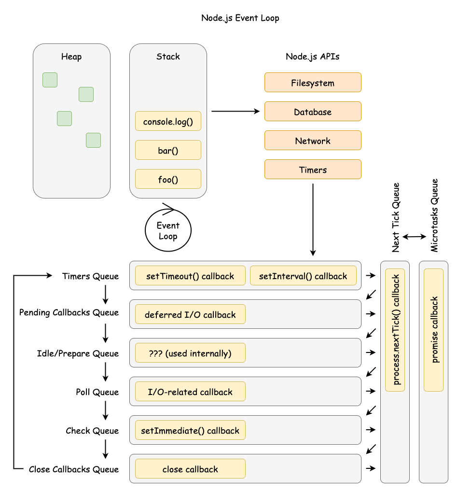

# The Node.js Architecture

Node.js's single-threaded event loop and non-blocking I/O model, makes it a powerful platform for building scalable, high-performance, and real-time applications.

## Table of Contents

## What is Node.js

Node.js is a powerful, open-source, and cross-platform JavaScript
runtime environment
that allows you to execute JavaScript code outside of a web browser.

Node.js follows event-driven, non-blocking I/O Architecture.

> From the Initial Talk at JSConf.eu by Ryan Dahl on Node.js
>
> - I/O needs to be done differently
> - Threaded concurrency is a leaky abstraction

## Key features of Node.js

### Single-Threaded Event Loop:

- Node.js operates on a single-threaded event loop architecture. This means that it uses a single thread to handle all incoming requests.
- The event loop continuously monitors for events (like incoming requests or completed I/O operations) and dispatches them to the appropriate handlers.
- This approach avoids the overhead of creating and managing multiple threads, making Node.js lightweight and efficient.

### Asynchronous and Non-Blocking I/O:

- Node.js utilizes an asynchronous and non-blocking I/O model. This means that when an I/O operation (like reading a file or making a network request) is initiated, Node.js doesn't wait for it to complete.
- Instead, it continues processing other requests and relies on callbacks or events to be notified when the I/O operation is finished.
- This allows Node.js to handle a large number of concurrent requests without blocking the main thread.

### Terminology

- **Synchronous (Blocking) I/O**: In synchronous I/O, when a program initiates an I/O operation, it blocks (waits)
  until that operation is fully completed. The program's execution pauses, and no other tasks can be performed
  during this waiting period. Think of it like waiting in line at the post office – you can't do anything else
  until it's your turn.

- **Asynchronous (Non-Blocking) I/O**: In asynchronous I/O, when a program starts an I/O operation,
  it doesn't wait for it to finish. Instead, it continues executing other code. When the I/O operation eventually completes,
  the program is notified (often through a callback function or an event), and it can then process the result of the I/O operation.
  It's like ordering a pizza online – you don't wait at the restaurant; you get a notification when it's ready.

## Node.js Components

```asciidoc
+-----------------------------------------------------------------+
|                               User code (JS)                    |
+-----------------------------------------------------------------+
|                                                                 |
|       Node.js API (http, fs, crypto, net, buffer, etc...) (JS)  |
|                                                                 |
+-----------------------------------------------------------------+
|                                                                 |
|       Bindings (JS/C++)                 C++ Add-ons (JS/C++)    |
|                                                                 |
+-----------------------------------------------------------------+
|                                                                 |
|   +-----------------+     +---------------------------------+   |
|   |       V8        |     |  Libuv (Event loop, thread pool,|   |
|   |    (JS VM)      |     |       async IO)                 |   |
|   +-----------------+     +---------------------------------+   |
|                                                                 |
|     C-Ares        HTTP-parser        OpenSSL        zlib        |
|                                                                 |
+-----------------------------------------------------------------+
|                                                                 |
|                           Operating System                      |
|                                                                 |
+-----------------------------------------------------------------+
```

### V8

This is the high-performance JavaScript engine developed by Google for Chrome. Node.js uses V8 to execute JavaScript code. It's a core component that significantly impacts Node.js's speed and efficiency.

> More details @ [V8 Javascript Engine - Internals](./v8-javascript-engine-internals)


> View [Javascript Engines by Franziska Hinkelmann](https://youtu.be/p-iiEDtpy6I?si=dSPAO3YcAvksJRpy&t=727)

### libuv

This library provides asynchronous I/O support in Node.js. It handles file system operations, networking, and other system-level tasks in a non-blocking way. libuv is crucial for Node.js's event-driven architecture and its ability to handle concurrent operations.

#### Libuv's Role in node.js

- **Asynchronous I/O** : Libuv handles all the asynchronous operations, like file system access, network I/O, and child processes. It offloads these tasks to the operating system whenever possible, preventing them from blocking the main thread.
- **Event Loop** : Libuv implements the event loop, which is the core of Node.js's concurrency model. The event loop continuously monitors for events (like completed I/O operations) and dispatches them to the appropriate callbacks.
- **Cross-Platform Compatibility** : Libuv provides a consistent API across different operating systems (Windows, macOS, Linux, etc.), abstracting away the platform-specific details of asynchronous operations. This makes it easier to write Node.js applications that can run on any supported platform.

### OpenSSL

Node.js uses OpenSSL for cryptographic operations, including SSL/TLS for secure networking. This is essential for building applications that require secure communication.

- The [node:crypto](https://nodejs.org/api/crypto.html#crypto) module provides cryptographic functionality that includes a set of wrappers for OpenSSL's hash, HMAC, cipher, decipher, sign, and verify functions.
- [node:https](https://nodejs.org/api/https.html#https) modules (indirectly): When you make HTTPS requests or create HTTPS servers in Node.js, the underlying implementation often uses OpenSSL for the TLS/SSL handshake and encryption of data. While you don't directly call OpenSSL functions in your https code, it's working behind the scenes.

### c-ares

This library is used for asynchronous DNS resolution. It allows Node.js to perform DNS lookups without blocking the main thread, which is important for network-dependent applications.

> Node.js utilizes c-ares for asynchronous DNS resolution,
> except for the dns.lookup method, which relies on getaddrinfo within a thread pool.

- [c-ares](https://github.com/c-ares/c-ares) is node directly exposed as a node model
- [node:dns](https://nodejs.org/api/dns.html#dns) provides an interface for working with DNS.
  While some functions in the dns module might use the system's resolver, others, particularly those designed for asynchronous lookups, leverage c-ares under the hood.

### llhttp

This project is a port of [http_parser](https://github.com/nodejs/http-parser) to TypeScript. [llparse](https://github.com/nodejs/llhttp) is used to generate the output C source file, which could be compiled and linked with the embedder's program (like Node.js).

This library parses HTTP requests and responses. It's used for handling network communication in web servers and other HTTP-based applications.

- Since version 12.0.0, llhttp has been the default HTTP parser in Node.js.
- http_parser is archived on Nov 2022
- Node.js now uses `llhttp` instead of `http_parser`
- llhttp is faster by approximately 156%.

### zlib

Node.js uses [zlib](https://github.com/madler/zlib) for compression and decompression. This is useful for handling data efficiently, especially in network applications.

The [node:zlib](https://nodejs.org/api/zlib.html#zlib) module provides compression functionality implemented using Gzip, Deflate/Inflate, Brotli, and Zstd.

## Is Node Single or Multi threaded?


> taken from Async Operations Slide by [Bert Belder at Node Interactive-2016](https://youtu.be/PNa9OMajw9w?si=VDodCKJ_Xok7YEZY&t=707)

It's both! - few things are multi threaded, few things are not.

- The user code runs on the single thread (main thread)
- Event loop runs on the single thread.
- File Operations runs on a separate thread (using the Thread-pool)
- Network operations happens using the system kernel directly

> The libuv event loop (or any other API involving the loop or handles, for that matter)
> is not thread-safe except where stated otherwise. - Libuv Design Doc

So, it's multi-threaded, but then the user code doesn't have the control to decide which part does or doesn't use the thread-pool.

### What about Worker Threads

Node.js workers leverage the worker_threads module. Each worker runs in its own process. This means they do not share memory directly.

## Node.js Event Loop (Simplified)

> This is an over-simplified explanation. Read more @ [The Node.js Event Loop](./nodejs-event-loop)

- **Initiate I/O**: The program starts an asynchronous I/O operation (e.g., reading data from a file).
- **Continue Execution**: The program doesn't wait. It moves on to execute other code.
- **Operating System Handles I/O**: The operating system takes over the I/O operation. It might use techniques like interrupts or polling to monitor the status of the I/O.
- **Notification/Callback**: When the I/O operation is complete (e.g., the data has been read from the file), the operating system notifies the program. This notification might trigger a callback function that was associated with the I/O operation.
- **Process Result**: The program now executes the callback function to process the data or result of the I/O operation.



> Node.js Event Loop Example Diagram by Tyler Hawkins as presented in [UtahJS
> Conf](https://youtu.be/KKM_4-uQpow?si=ih-K1_2iI38Gv1TT&t=1498)

## References

- [Ryan Dahl: Node.js](https://youtu.be/EeYvFl7li9E?si=Imf9EhxC_5QjQQX-)
- [Node.js: The Documentary | An origin story](https://youtu.be/LB8KwiiUGy0?si=AVDR9sP1AeG7dQDO)
- [Node Interactive 2016 Talk - Everything You Need to Know About Node.js Event Loop - Bert Belder, IBM](https://youtu.be/PNa9OMajw9w?si=CFxugIEBeZTGIHrD)
- [Node Interactive 2016 Talk Presentation](https://drive.google.com/file/d/0B1ENiZwmJ_J2a09DUmZROV9oSGc/view?resourcekey=0-lR-GaBV1Bmjy086Fp3J4Uw)
- [llhttp - new HTTP 1.1 parser for Node.js by Fedor Indutny | JSConf EU 2019](https://youtu.be/x3k_5Mi66sY?si=yxn1b7aLkiKTX6go)
