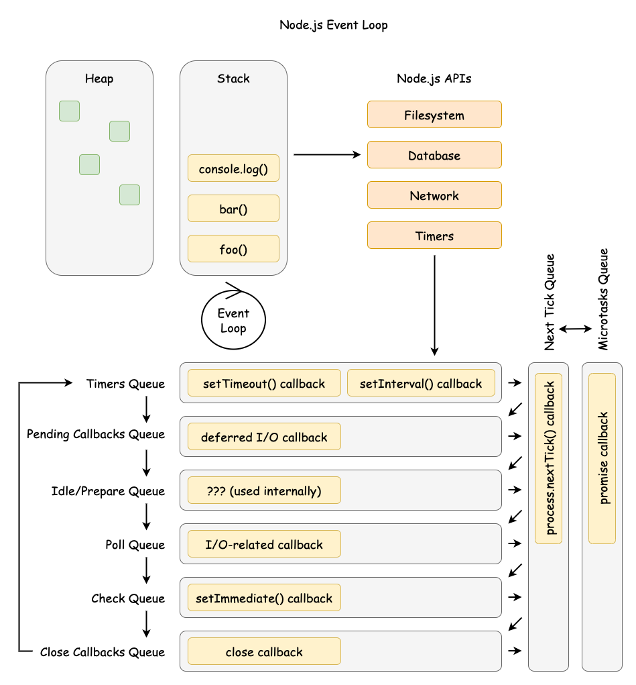

# The JavaScript Event Loop: A Unified, Cross-Environment Technical Analysis

A comprehensive deep-dive into the JavaScript event loop architecture across browser and Node.js environments, examining the abstract concurrency model, implementation differences, and performance implications for expert developers.



## Table of Contents

1. [The Abstract Concurrency Model](#the-abstract-concurrency-model)
2. [Universal Priority System: Tasks and Microtasks](#universal-priority-system-tasks-and-microtasks)
3. [Browser Event Loop Architecture](#browser-event-loop-architecture)
4. [Node.js Event Loop: libuv Integration](#nodejs-event-loop-libuv-integration)
5. [Node.js-Specific Scheduling](#nodejs-specific-scheduling)
6. [True Parallelism: Worker Threads](#true-parallelism-worker-threads)
7. [Best Practices and Performance Optimization](#best-practices-and-performance-optimization)

## The Abstract Concurrency Model

JavaScript's characterization as a "single-threaded, non-blocking, asynchronous, concurrent language" obscures the sophisticated interplay between the JavaScript engine and its host environment. The event loop is not a language feature but the central mechanism provided by the host to orchestrate asynchronous operations around the engine's single-threaded execution.

### Runtime Architecture


### Core Execution Primitives

The ECMAScript specification defines three fundamental primitives:

1. **Call Stack**: LIFO data structure tracking execution context
2. **Heap**: Unstructured memory region for object allocation
3. **Run-to-Completion Guarantee**: Functions execute without preemption


### Specification Hierarchy


## Universal Priority System: Tasks and Microtasks

All modern JavaScript environments implement a two-tiered priority system governing asynchronous operation scheduling.

### Queue Processing Model


### Priority Hierarchy


### Microtask Starvation Pattern

```javascript
// Pathological microtask starvation
function microtaskFlood() {
  Promise.resolve().then(microtaskFlood)
}
microtaskFlood()

// This macrotask will never execute
setTimeout(() => {
  console.log("Starved macrotask")
}, 1000)
```

## Browser Event Loop Architecture

The browser event loop is optimized for UI responsiveness, integrating directly with the rendering pipeline.

### WHATWG Processing Model


### Rendering Pipeline Integration


### Task Source Prioritization


## Node.js Event Loop: libuv Integration

Node.js implements a phased event loop architecture optimized for high-throughput I/O operations.

### libuv Architecture


### Phased Event Loop Structure


### Poll Phase Logic


### Thread Pool vs Direct I/O


## Node.js-Specific Scheduling

Node.js provides unique scheduling primitives with distinct priority levels.

### Priority Hierarchy


### nextTick vs setImmediate Execution


### setTimeout vs setImmediate Ordering


## True Parallelism: Worker Threads

Worker threads provide true parallelism by creating independent event loops.

### Worker Architecture


### Memory Sharing Patterns


## Best Practices and Performance Optimization

### Environment-Agnostic Principles


### Browser-Specific Optimization


### Node.js-Specific Optimization


### Performance Monitoring

```mermaid
graph LR
    subgraph "Bottleneck Identification"
        A[Event Loop Lag] --> B[CPU-Bound]
        C[I/O Wait Time] --> D[Network/File I/O]
        E[Thread Pool Queue] --> F[Blocking Operations]
    end

    subgraph "Monitoring Tools"
        G[Event Loop Metrics] --> H[Lag Detection]
        I[Memory Usage] --> J[Leak Detection]
        K[CPU Profiling] --> L[Hot Paths]
    end
```

## Conclusion

The JavaScript event loop is not a monolithic entity but an abstract concurrency model with environment-specific implementations. Expert developers must understand both the universal principles (call stack, run-to-completion, microtask/macrotask hierarchy) and the divergent implementations (browser's rendering-centric model vs Node.js's I/O-centric phased architecture).

Key takeaways for expert-level development:

1. **Environment Awareness**: Choose scheduling primitives based on the target environment
2. **Performance Profiling**: Identify bottlenecks in the appropriate layer (event loop, thread pool, OS I/O)
3. **Parallelism Strategy**: Use worker threads for CPU-intensive tasks while maintaining event loop responsiveness
4. **Scheduling Mastery**: Understand when to use microtasks vs macrotasks for optimal performance

The unified mental model requires appreciating common foundations while recognizing environment-specific mechanics that dictate performance and behavior across the JavaScript ecosystem.

## References

- [The Node.js Event Loop Official Docs](https://nodejs.org/en/learn/asynchronous-work/event-loop-timers-and-nexttick)
- [Libuv Design - The I/O Loop](https://docs.libuv.org/en/v1.x/design.html#the-i-o-loop)
- [Node Interactive 2016 Talk - Everything You Need to Know About Node.js Event Loop - Bert Belder, IBM](https://youtu.be/PNa9OMajw9w?si=CFxugIEBeZTGIHrD)
- [Node Interactive 2016 Talk Presentation](https://drive.google.com/file/d/0B1ENiZwmJ_J2a09DUmZROV9oSGc/view?resourcekey=0-lR-GaBV1Bmjy086Fp3J4Uw)
- [A Deep Dive Into the Node js Event Loop - Tyler Hawkins](https://youtu.be/KKM_4-uQpow?si=zlsK2g3p1TkQGE3l)
- [A Deep Dive Into the Node js Event Loop - Code & Slides](https://github.com/thawkin3/nodejs-event-loop-presentation)
- [Node's Event Loop From the Inside Out by Sam Roberts, IBM](https://youtu.be/P9csgxBgaZ8?si=sU_LGUgWYAT-yFTR)
- [WHATWG HTML Living Standard - Event Loops](https://html.spec.whatwg.org/multipage/webappapis.html#event-loops)
- [ECMAScript 2024 - Jobs and Job Queues](https://tc39.es/ecma262/#sec-jobs-and-job-queues)
