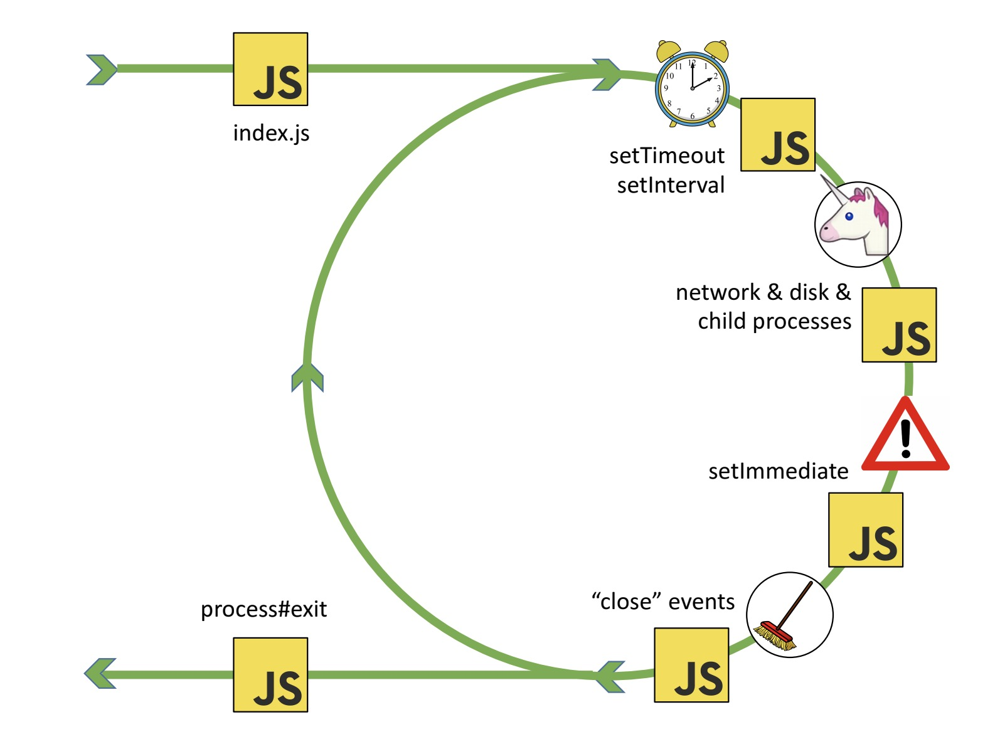
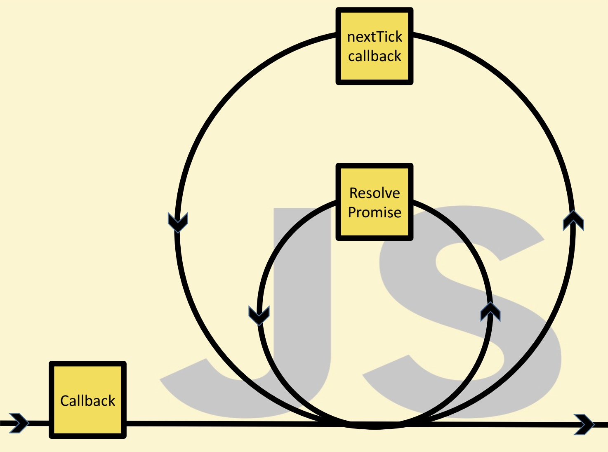

# The Node.js Event Loop

Deep dive into nodejs event loop internals


## Table of Contents

## What is Event Loop in Node.js?

The event loop in Node.js is a mechanism that manages asynchronous
operations, allowing the single-threaded language to handle long-running
tasks (like network requests or timers) without blocking the main thread.

- Node.js uses asynchronous, non-blocking I/O Operations. When it needs to perform I/O, it doesn't wait for the operation to complete.
- Libuv is a C library originally written for Node.js to abstract non-blocking I/O Operations.
- Libuv has Full-featured event loop backed by epoll (Linux), kqueue (OSX), IOCP (Windows), event ports (SunOS).

### Bird eye view for event loop

- The event loop operates in phases(timers, pending callbacks, idle, prepare, poll, check, close callbacks). Each phase handles specific type of events.
- The poll phase waits for the OS to tell it when I/O is ready
- When an I/O operation finishes, its corresponding callback function is places in the callback queue
- The event loop's job is to continuously check the callback queue, and execute them.
- If there are no ongoing async operations and no callbacks, the event loop exits.

### Order of operations (Phases)

The below diagram shows simplified overview of event loop's order of operation.

```asciidoc
   ┌───────────────────────────┐
┌─>│           timers          │
│  └─────────────┬─────────────┘
│  ┌─────────────┴─────────────┐
│  │     pending callbacks     │
│  └─────────────┬─────────────┘
│  ┌─────────────┴─────────────┐
│  │       idle, prepare       │
│  └─────────────┬─────────────┘      ┌───────────────┐
│  ┌─────────────┴─────────────┐      │   incoming:   │
│  │           poll            │<─────┤  connections, │
│  └─────────────┬─────────────┘      │   data, etc.  │
│  ┌─────────────┴─────────────┐      └───────────────┘
│  │           check           │
│  └─────────────┬─────────────┘
│  ┌─────────────┴─────────────┐
└──┤      close callbacks      │
   └───────────────────────────┘
```

- Each box will be referred to as a "phase" of the event loop
- In a single loop, event loops moves from one phase to another
- Each phase has a FIFO queue of callbacks to execute.
- When the event loop enters a phase, it will execute callbacks

## Phases in Node.js Event Loop

### Overview



- **timers**: this phase executes callbacks scheduled by `setTimeout()` and `setInterval()`.
- **pending callbacks**: executes I/O callbacks deferred to the next loop iteration.
- **idle, prepare**: only used internally.
- **poll**: retrieve new I/O events; execute I/O related callbacks (almost all with the exception of close callbacks, the ones scheduled by timers, and setImmediate()); node will block here when appropriate.
- **check**: setImmediate() callbacks are invoked here.
- **close callbacks**: some close callbacks, e.g. socket.on('close', ...).

### timers

A timer specifies the threshold after which a provided callback may be executed rather than the exact time a person wants it to be executed.

- It checks for any timers that have expired
- Expired timer callbacks are placed in a queue, ordered by their creation time
- Event loop iterate through this queue and executes each timer callback one by one

> Technically, the poll phase controls when timers are executed.

- Timers callbacks will run as early as they can be scheduled after the specified amount of time has passed.
- OS scheduling or the running of other callbacks may delay them

### pending callbacks

- This phase executes callbacks for some system operations such as types of TCP errors.
- `SIGINT` (Ctrl + C) and `SIGTERM` (termination signal) are handled by this phase.

For example if a TCP socket receives `ECONNREFUSED` when attempting to connect, some \*nix systems want to wait to report the error. This will be queued to execute in the pending callbacks phase.

### poll

The poll phase has two main functions:

- Calculating how long it should block or poll for I/O
- Processing events in the poll queue

> More details @ [Libuv Internals(Poll timeout is calculated.)](#poll-timeout-is-calculated)

#### Calculating poll timeout

- Are there any `setImmediate()` callbacks waiting? If so, the poll phase won't block at all and immediately proceed to the check phase
- Are there any pending `setTimeout()` or `setInterval()` timers that are about to expire?, If yes, poll phase will wait only until the nearest timer expires.
- Are there any async operation - handles/request going on? If no, move on, otherwise wait for it.

#### Waiting for I/O events

- The event loop enters a waiting state, polling the OS for new I/O events
- When an I/O is detected, the corresponding callback is executed.
- Exits the poll phase after the timeout, or after I/O callbacks is executed.

#### Execution of Poll Queue Callbacks

If the poll queue is not empty, the event loop will iterate through its queue of callbacks executing them synchronously until either the queue has been exhausted, or the system-dependent hard limit is reached.

### check

- Allows event loop to execute callback immediately after the poll phase has completed
- If poll phase becomes idle and scripts have been queued with `setImmediate()`, the event loop may continue to the check phase rather than waiting

### close callbacks

If a socket or handle is closed abruptly (e.g. socket.destroy()), the `'close'` event will be emitted in this phase. Otherwise it will be emitted via `process.nextTick()`

## nextTick & Promises

- Both `process.nextTick` and promises' callback (microtask queue) are not part of Event loop.
- These queue will be processed after the current operation is completed, irrespective of the current phase
  - An operation is defined as a transition from the underlying C/C++ handler, and handling the JavaScript that needs to be executed.
- Both of these can be called between callbacks within the same phase or while moving from one phase to another.

### Execution of callbacks

- nextTick has a higher priority than microtask queue.

#### If you have callbacks for both nextTick and promises

- All the callbacks of nextTick is executed, then
- All the callbacks of promises are executed.

#### What if nextTick itself adds promises callbacks?

- unless all the nextTick callbacks are exhausted, promise's callback will not be picked.

#### What if a promise adds a nextTick?

- Once the event loop, starts processing callbacks from micro-tasks, nextTick will not be executed.



## References

- [The Node.js Event Loop Official Docs](https://nodejs.org/en/learn/asynchronous-work/event-loop-timers-and-nexttick)
- [Libuv Design - The I/O Loop](https://docs.libuv.org/en/v1.x/design.html#the-i-o-loop)
- [Node Interactive 2016 Talk - Everything You Need to Know About Node.js Event Loop - Bert Belder, IBM](https://youtu.be/PNa9OMajw9w?si=CFxugIEBeZTGIHrD)
- [Node Interactive 2016 Talk Presentation](https://drive.google.com/file/d/0B1ENiZwmJ_J2a09DUmZROV9oSGc/view?resourcekey=0-lR-GaBV1Bmjy086Fp3J4Uw)
- [A Deep Dive Into the Node js Event Loop - Tyler Hawkins](https://youtu.be/KKM_4-uQpow?si=zlsK2g3p1TkQGE3l)
- [A Deep Dive Into the Node js Event Loop - Code & Slides](https://github.com/thawkin3/nodejs-event-loop-presentation)
- [Node's Event Loop From the Inside Out by Sam Roberts, IBM](https://youtu.be/P9csgxBgaZ8?si=sU_LGUgWYAT-yFTR)
