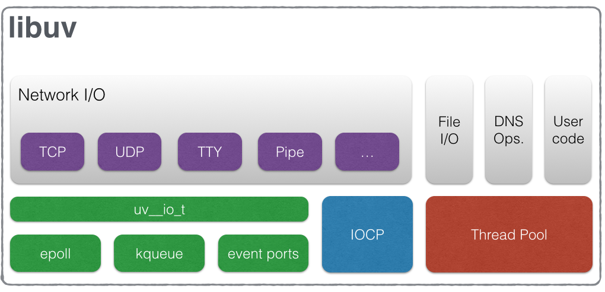
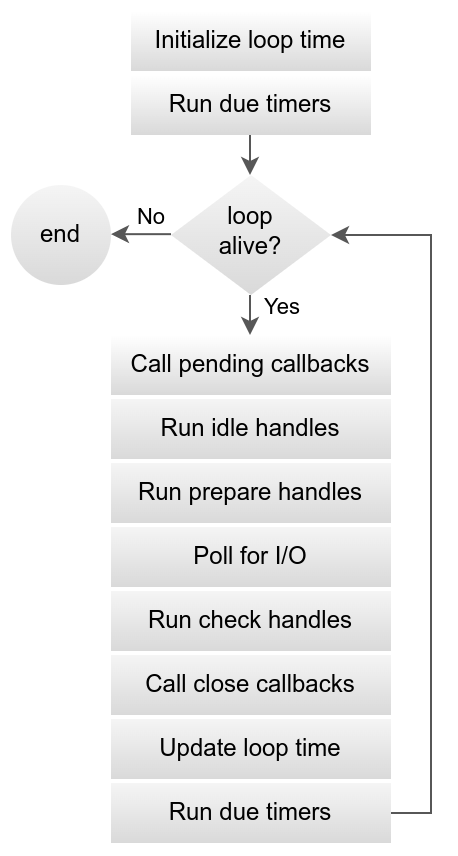

# Libuv Internals

libuv is a multi-platform support library with a focus on asynchronous I/O



## Table of Contents

## What is Libuv

`libuv` is a multi-platform support library with a focus on asynchronous I/O. It was primarily developed for use by Node.js, but it’s also used by Luvit, Julia, uvloop, and others.

### Features

- Full-featured **event loop** backed by epoll, kqueue, IOCP, event ports.
- Asynchronous TCP and UDP sockets
- Asynchronous DNS resolution
- Asynchronous file and file system operations
- File system events
- ANSI escape code controlled TTY
- IPC with socket sharing, using Unix domain sockets or named pipes (Windows)
- Child processes
- Thread pool
- Signal handling
- High resolution clock
- Threading and synchronization primitives

### Design Overview

### Handles

- Abstraction for (typically) long-lived resources
- Eg: TCP and UDP sockets, TTYs, timers, signals, child processes
- For working with event loop: idle, prepare, check, async handle types
- Active handles keep the event loop alive
  - Handles can be unref'd so they don't keep loop alive

Some examples:

- A prepare handle gets its callback called once every loop iteration when active.
- A TCP server handle that gets its connection callback called every time there is a new connection.

### Requests

- Abstraction for (typically) short-lived operations
- Eg: file I/O, socket connections, stream operations, getaddrinfo(), user defined work
- Some requests operates on handles, but not all
- Active requests keep the event loop alive (similar to handles)

### Thread Pool

- Used to move computations off of the main thread
- Work runs on worker thread
- Callback runs on the main thread
- Size controlled by `UV_THREADPOOL_SIZE` environment variable
  - defaults to 4
  - can be increased to max. of 1024
- Only file I/O, getaddrinfo(), getnameinfo(), custom work runs on thread pool

## Async operations


### Network I/O

- all network I/O is performed on non-blocking sockets (native)
- Sockets are polled using the best mechanisms available for a given platform
  - epoll on Linux, kqueue on OSX and other BSDs, event ports on SunOS and IOCP on Windows

### File I/O

- File operations are handled using native blocking file operations
- Uses the global thread pool, to make them async
- the `..Sync` functions exposed by `fs` modules, does not run a thread pool

> Unlike network I/O, there are no platform-specific file I/O primitives libuv could rely on,
> so the current approach is to run blocking file I/O operations in a thread pool.

### DNS functions (`getaddrinfo` and `getnameinfo`)

- libuv provides async versions of these functions [getaddrinfo(3)](https://man7.org/linux/man-pages/man3/getaddrinfo.3.html)
- Uses the global thread pool, to make them async

```c
int uv_getaddrinfo(
  uv_loop_t *loop,
  uv_getaddrinfo_t *req,
  uv_getaddrinfo_cb getaddrinfo_cb,
  const char *node,
  const char *service,
  const struct addrinfo *hints
  )
```

### User specified code via uv_queue_work()

- Uses the global thread pool

## The I/O Loop

### Overview

- It follows the usual single threaded asynchronous I/O approach
- The Event Loop runs on a single thread. Technically, you can run multiple event loops, but on a different threads. Node.js has one event loop that runs on the main thread.
- Event loop is not thread safe

> The libuv event loop (or any other API involving the loop or handles, for that matter)
> is not thread-safe except where stated otherwise.

### Starting the Event Loop

```c
int uv_run(uv_loop_t *loop, uv_run_mode mode)
```

This function runs the event loop. It will act differently depending on the specified mode:

- **UV_RUN_DEFAULT**: Runs the event loop until there are no more active and referenced handles or requests. Returns non-zero if uv_stop() was called and there are still active handles or requests. Returns zero in all other cases.
- **UV_RUN_ONCE**: Poll for i/o once. Note that this function blocks if there are no pending callbacks. Returns zero when done (no active handles or requests left), or non-zero if more callbacks are expected (meaning you should run the event loop again sometime in the future).
- **UV_RUN_NOWAIT**: Poll for i/o once but don’t block if there are no pending callbacks. Returns zero if done (no active handles or requests left), or non-zero if more callbacks are expected (meaning you should run the event loop again sometime in the future).

uv_run() is not reentrant. It must not be called from a callback.

## Loop Iteration



### Initialize loop time

The loop concept of ‘now’ is initially set.

```c
void uv_update_time(uv_loop_t *loop)
```

- `uv_update_time` updates the event loop’s concept of “now”.
- Libuv caches the current time at the start of the event loop tick in order to reduce the number of time-related system calls.

### Run due timers

Due timers are run if the loop was run with UV_RUN_DEFAULT.
All active timers scheduled for a time before the loop’s concept of now get their callbacks called.

#### Can a due timer exist, when loop has just started?

Yes.

Node.js will execute the main script (synchronous functions) before starting the event loop.

### loop alive?

If the loop is alive, an iteration is started, otherwise the loop will exit immediately.

#### So, when is a loop considered to be alive?

If a loop has active and ref’d handles, active requests or closing handles it’s considered to be alive.

#### Event loop reference count

The event loop only runs as long as there are active handles.
This system works by having every handle increase the reference count of the event loop when it is started and decreasing the reference count when stopped.
It is also possible to manually change the reference count of handles using:

```c
void uv_ref(uv_handle_t*);
void uv_unref(uv_handle_t*);
```

### Call pending callbacks

Pending callbacks are called. All I/O callbacks are called right after polling for I/O, for the most part. There are cases, however, in which calling such a callback is deferred for the next loop iteration. If the previous iteration deferred any I/O callback it will be run at this point.

### Run idle handles

- Internally used by libuv for managing its own operations and state.

Despite the unfortunate name, idle handles are run on every loop iteration, if they are active.

### Run prepare handles

- Internally used by libuv for managing its own operations and state.

Prepare handles get their callbacks called right before the loop will block for I/O.

### Poll for IO

#### Poll timeout is calculated.

Before blocking for I/O the loop calculates for how long it should block. These are the rules when calculating the timeout:

- If the loop was run with the UV_RUN_NOWAIT flag, the timeout is 0.
- If the loop is going to be stopped (uv_stop() was called), the timeout is 0.
- If there are no active handles or requests, the timeout is 0.
- If there are any idle handles active, the timeout is 0.
- If there are any handles pending to be closed, the timeout is 0.
- If none of the above cases matches, the timeout of the closest timer is taken, or if there are no active timers, infinity.

#### Blocks for IO

The loop blocks for I/O. At this point the loop will block for I/O for the duration calculated in the previous step. All I/O related handles that were monitoring a given file descriptor for a read or write operation get their callbacks called at this point.

### Run check handles

Check handle callbacks are called. Check handles get their callbacks called right after the loop has blocked for I/O. Check handles are essentially the counterpart of prepare handles.

### Call close callbacks

Close callbacks are called. If a handle was closed by calling uv_close() it will get the close callback called.

### Update loop time

The loop concept of ‘now’ is updated.

### Run due timers

Due timers are run. Note that ‘now’ is not updated again until the next loop iteration. So if a timer became due while other timers were being processed, it won’t be run until the following event loop iteration.

### Iteration ends.

- If the `uv_run_mode` was: `UV_RUN_NOWAIT` or `UV_RUN_ONCE`
  - Iterations Ends, and `uv_run()` will return
- If the `uv_run_mode` was `UV_RUN_DEFAULT`
  - continue from the start, if alive else end

## References

- [Libuv - Design overview](https://docs.libuv.org/en/v1.x/design.html)
- [Libuv - DNS utility functions](https://docs.libuv.org/en/v1.x/dns.html)
- [Libuv - Event Loop](https://docs.libuv.org/en/v1.x/loop.html)
- [Libuv - Timer Handle](https://docs.libuv.org/en/v1.x/timer.html)
- [Introduction to libuv: What's a Unicorn Velociraptor? - Colin Ihrig, Joyent](https://youtu.be/_c51fcXRLGw?si=fd2PzWWoG53Cjaxo)
