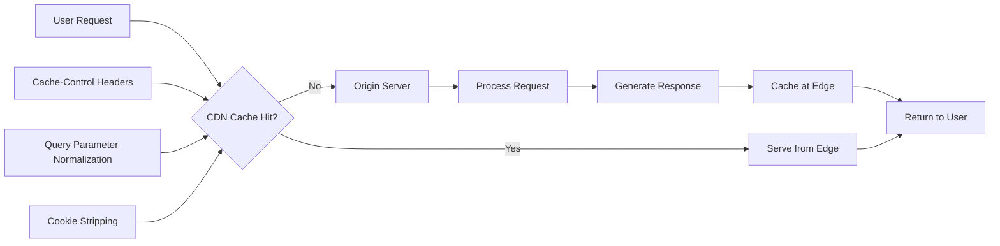
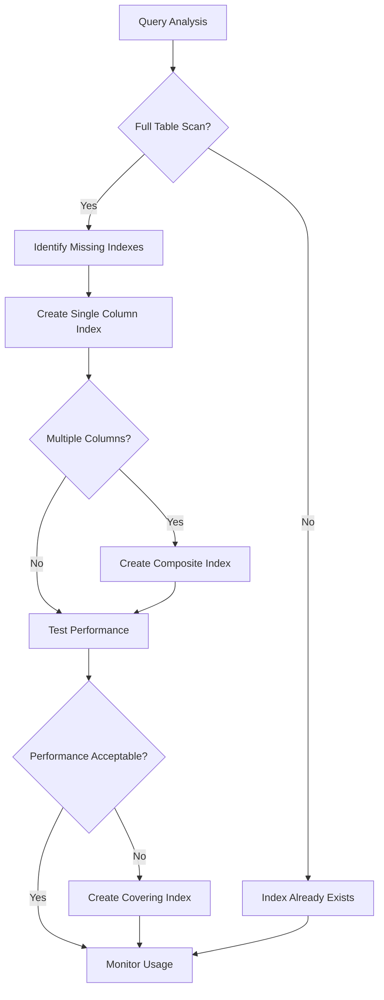
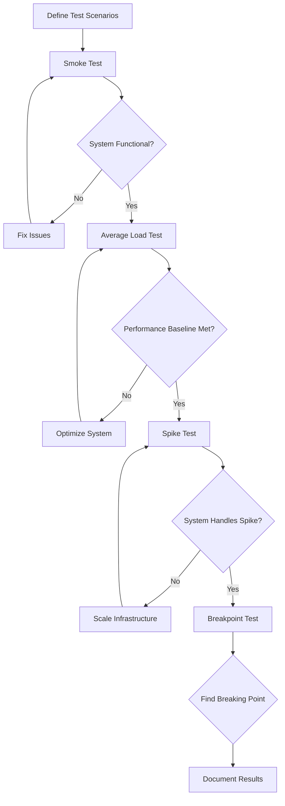

# A Systematic Guide to Full-Stack Web Performance Optimization

A holistic and systematic approach is paramount for achieving and maintaining high levels of web performance. Optimization is not a single action but a continuous process that spans the entire technology stack, from the intricate details of client-side rendering to the foundational server infrastructure. This guide provides a detailed technical roadmap for expert practitioners to identify, fix, and measure performance bottlenecks across the full stack.

## Section 1: Client-Side Asset and Rendering Optimization

After the server has responded and the content has been delivered, the browser begins the work of parsing, processing, and rendering the assets. This client-side phase is where user-perceived performance is most directly impacted. Optimizing JavaScript, CSS, images, and fonts is critical for achieving fast load times, smooth interactivity, and visual stability.

### 1.1. Advanced JavaScript Bundle Analysis and Optimization

Large, monolithic JavaScript bundles are a primary cause of slow page interactivity. They must be downloaded, parsed, compiled, and executed on the browser's main thread, blocking its ability to respond to user input.

#### Identify the Blocker

- **Bundle Composition Analysis**: Use a bundle analyzer tool like `webpack-bundle-analyzer` or `vite-bundle-visualizer` to generate an interactive treemap visualization of the final JS bundle, showing the size contribution of each module and dependency.
- **Unused Code Analysis**: Use the Chrome DevTools Coverage tab to identify dead code or functionality that is loaded but never used on a particular page.

#### How to Fix It

- **Code Splitting**: Break the application into smaller, logical "chunks" that can be loaded on demand. Use route-based and component-based splitting. Example (React):

```javascript
import React, { Suspense, lazy } from "react"
const AboutComponent = lazy(() => import("./AboutComponent"))
const HomeComponent = lazy(() => import("./HomeComponent"))
function App() {
  return (
    <div>
      <Suspense fallback={<div>Loading...</div>}>
        <Route path="/about" component={AboutComponent} />
        <Route path="/" component={HomeComponent} />
      </Suspense>
    </div>
  )
}
```

- **Webpack SplitChunks**:

```javascript
module.exports = {
  optimization: {
    splitChunks: {
      chunks: "all",
      cacheGroups: {
        vendor: {
          test: /[\\/]node_modules[\\/]/,
          name: "vendors",
          chunks: "all",
        },
      },
    },
  },
}
```

- **Tree Shaking**: Eliminate unused exports from modules. Ensure code uses ES Module syntax.

```javascript
module.exports = {
  mode: "production",
  optimization: {
    usedExports: true,
  },
}
```

- **Dependency Auditing**: Replace large dependencies with smaller, modern alternatives (e.g., dayjs for moment.js, zustand for redux).
- **Avoid Over-Splitting**: Group modules that are likely to be needed together into reasonably sized chunks to avoid excessive HTTP requests.

#### How to Measure It

- **Bundle Size**: Track gzipped size of generated JS files over time.
- **Execution Time**: Use Chrome DevTools Performance panel to record and analyze main thread activity.
- **Core Web Vitals**: Focus on INP and TBT improvements.

### 1.2. Mitigating Runtime Bottlenecks: Long Tasks and Web Workers

Long-running JavaScript tasks can block the main thread, causing the UI to freeze. Any task >50ms is a "Long Task" and a primary cause of poor INP.

#### Identify the Blocker

- Use Chrome DevTools Performance panel to record and analyze long tasks and correlate with user input.

#### How to Fix It

- **Yielding to the Main Thread**: Break long synchronous tasks into smaller, asynchronous chunks. Use `scheduler.yield()` for explicit yielding.

```javascript
async function processQueue(queue) {
  for (const item of queue) {
    processItem(item)
    if (navigator.scheduling.isInputPending()) {
      await scheduler.yield()
    }
  }
}
```

- **Web Workers**: Offload computationally intensive operations to a background thread.

```javascript
// main.js
const worker = new Worker("image-worker.js")
const canvas = document.getElementById("canvas")
const ctx = canvas.getContext("2d")
const imageData = ctx.getImageData(0, 0, canvas.width, canvas.height)
worker.postMessage(imageData)
worker.onmessage = (e) => {
  ctx.putImageData(e.data, 0, 0)
}
// image-worker.js
self.onmessage = (e) => {
  const imageData = e.data
  for (let i = 0; i < imageData.data.length; i += 4) {
    const avg = (imageData.data[i] + imageData.data[i + 1] + imageData.data[i + 2]) / 3
    imageData.data[i] = avg
    imageData.data[i + 1] = avg
    imageData.data[i + 2] = avg
  }
  self.postMessage(imageData)
}
```

- **React Memoization**: Use `useMemo` and `useCallback` to prevent expensive re-renders.

```javascript
const expensiveValue = useMemo(() => computeSomething(dep1, dep2), [dep1, dep2])
const memoizedCallback = useCallback(() => doSomething(a, b), [a, b])
```

- **Profile Before Optimizing**: Only apply these techniques after profiling confirms a significant bottleneck.

#### How to Measure It

- Re-record user interactions in the Performance panel. All tasks should be <50ms.
- INP score should be ≤200ms (75th percentile).

### 1.3. Strategic Image and Media Delivery

Images/media are often the largest contributors to page weight and slow LCP. Optimize delivery with:

- **Modern Formats**: Use WebP/AVIF for better compression.
- **<picture> for Art Direction**:

```html
<picture>
  <source srcset="photo.avif" type="image/avif" />
  <source srcset="photo.webp" type="image/webp" />
  
</picture>
```

- **Responsive Images**: Use `srcset` and `sizes` to serve appropriately sized images.
- **Explicit Dimensions**: Always set `width` and `height` on `` and `<video>` to prevent CLS.
- **Lazy Loading**: Use `loading="lazy"` for offscreen images only (never for LCP element).
- **Async Decoding**: Use `decoding="async"` on ``.
- **Progressive JPEGs**: Use progressive encoding for perceived speed.

#### How to Measure It

- Lighthouse audits, LCP time, and total page weight in DevTools.

### 1.4. Advanced Font Optimization

Web fonts are render-blocking and can impact LCP/CLS.

- **WOFF2 Format**: Use modern, self-hosted WOFF2 fonts.
- **Font Subsetting**: Use tools like `pyftsubset` to include only needed glyphs.

```bash
pyftsubset original-font.ttf --text="Hello World" --output-file=subset-font.woff2 --flavor=woff2
```

- **font-display: swap**: Prevent FOIT, prefer FOUT.

```css
@font-face {
  font-family: "MyCustomFont";
  src: url("/fonts/my-custom-font.woff2") format("woff2");
  font-weight: 400;
  font-style: normal;
  font-display: swap;
}
```

- **Preload Critical Fonts**:

```html
<link rel="preload" href="/fonts/critical-font.woff2" as="font" type="font/woff2" crossorigin />
```

#### How to Measure It

- Font file size, Lighthouse audits, and DevTools waterfall for early font download.

### 1.5. Optimizing the Critical Rendering Path with Resource and Priority Hints

- **Resource Hints**: Use `<link rel="dns-prefetch">`, `<link rel="preconnect">`, and `<link rel="preload">` for critical resources.
- **Priority Hints**: Use `fetchpriority="high"` for LCP images.
- **Inline Critical CSS**: Place minimal above-the-fold CSS in a `<style>` in `<head>`, preload the rest.
- **Tools**: Use `critical` to extract critical CSS.

#### How to Measure It

- DevTools waterfall for resource order, Lighthouse for FCP/LCP.

### 1.6. Mastering User-Centric Metrics: Core Web Vitals

| Metric | Good    | Needs Improvement   | Poor    |
| ------ | ------- | ------------------- | ------- |
| LCP    | ≤ 2.5s  | > 2.5s and ≤ 4.0s   | > 4.0s  |
| INP    | ≤ 200ms | > 200ms and ≤ 500ms | > 500ms |
| CLS    | ≤ 0.1   | > 0.1 and ≤ 0.25    | > 0.25  |

#### LCP: Optimize server TTFB, critical rendering path, and LCP element (image: optimize, preload, no lazy; text: fast font loading).

#### INP: Minimize main thread blocking, break up long handlers, use Web Workers, memoization, and simplify DOM updates.

#### CLS: Always set dimensions, reserve space for dynamic content, use `font-display: swap`, and preload fonts.

## Section 2: Infrastructure and Delivery Optimization

The performance of a web application is fundamentally constrained by its server-side architecture and delivery network.

### 2.1. Optimizing Time to First Byte (TTFB)

Time to First Byte (TTFB) is a foundational metric that measures the responsiveness of a web server.

#### Identify the Blocker

To analyze TTFB, open Chrome DevTools, navigate to the Network tab, and load the target webpage. The "Waiting (TTFB)" value represents the time the browser spent waiting for the server to process the request and send back the initial byte of the response.

**Performance Thresholds**: A TTFB under 800 milliseconds is considered "good".

#### How to Fix It

**Hosting and Infrastructure**: Migrate to a more performant hosting provider, upgrade server resources.

**Server-Side Caching**: Implement robust caching strategies.

**Database Optimization**: Ensure proper database indexing, optimize complex queries.

**Content Delivery Network (CDN) Implementation**: Distribute static assets across a global network of servers.

### 2.2. Maximizing CDN Effectiveness Through Cache Hit Ratio Analysis

A CDN's primary function is to cache content at edge locations around the world. The single most important metric for measuring a CDN's effectiveness is the Cache Hit Ratio (CHR).

#### Identify the Blocker

A low CHR indicates that the CDN is frequently unable to serve requests from its cache, forcing it to forward them to the origin server.

**Tooling and Diagnosis**: Use the analytics dashboard provided by the CDN vendor. A "good" CHR for a site with mostly static content is typically in the 95-99% range.

#### How to Fix It

**Optimize Cache-Control Headers**: Ensure the origin server is sending appropriate Cache-Control headers for all assets.

```http
# Example Cache-Control headers
Cache-Control: public, max-age=31536000, s-maxage=31536000
Cache-Control: private, max-age=300
Cache-Control: no-cache, must-revalidate
```

**Ignore Unnecessary Query Parameters**: Configure the CDN to ignore non-essential query parameters.

**Normalize Request Headers**: Ensure that requests are normalized to prevent the creation of unnecessary cache variations.

**Ignore Cookies on Static Assets**: Configure the CDN to strip the Cookie header for requests to static assets.

#### CDN Cache Hit Ratio Optimization



### 2.3. Executing Logic at the Edge with Serverless Functions

Modern edge architectures have transformed CDNs into programmable platforms, allowing developers to deploy and execute serverless functions at the network edge.

#### Identify the Blocker

The blocker is high latency for any dynamic functionality that requires a round-trip to a centralized origin server.

#### How to Fix It

**Use Cases for Edge Functions**:

1. **A/B Testing**: Serve different versions of a page or component directly from the edge
2. **Authentication**: Validate tokens at the edge
3. **Dynamic Content Assembly**: Fetch data from multiple microservices and assemble responses
4. **URL Rewrites and Redirects**: Handle complex routing logic with low latency

**Example Cloudflare Worker for A/B Testing**:

```javascript
const CONTROL_URL = "https://control-version.example.com"
const TEST_URL = "https://test-version.example.com"

addEventListener("fetch", (event) => {
  event.respondWith(handleRequest(event.request))
})

async function handleRequest(request) {
  const url = new URL(request.url)
  const cookie = request.headers.get("cookie")

  // Check if the user is already in a group
  if (cookie && cookie.includes("ab-test=control")) {
    return fetch(CONTROL_URL + url.pathname, request)
  }
  if (cookie && cookie.includes("ab-test=test")) {
    return fetch(TEST_URL + url.pathname, request)
  }

  // Assign a new user to a group
  const group = Math.random() < 0.5 ? "control" : "test"
  const destinationURL = group === "control" ? CONTROL_URL : TEST_URL

  const response = await fetch(destinationURL + url.pathname, request)
  const newResponse = new Response(response.body, response)

  // Set a cookie for session affinity
  newResponse.headers.append("Set-Cookie", `ab-test=${group}; path=/`)
  return newResponse
}
```

### 2.4. DNS and TLS Optimization

Before a browser can even request content, it must perform a DNS lookup and a TLS handshake.

#### How to Fix It

**Use a High-Performance DNS Provider**: Premium DNS providers often have a globally distributed network of servers.

**Optimize Time to Live (TTL)**: DNS records have a TTL value that tells resolvers how long to cache the record.

**Enable OCSP Stapling**: Allows the web server to periodically fetch the revocation status from the CA and "staple" it to the TLS handshake.

### 2.5. Leveraging Modern Protocols: Implementing HTTP/3

HTTP/3, the latest version, offers substantial performance benefits over its predecessors, especially under non-ideal network conditions.

#### Identify the Blocker

The primary blocker that HTTP/3 addresses is Head-of-Line (HOL) blocking inherent in TCP, the transport protocol used by HTTP/1.1 and HTTP/2.

#### How to Fix It

**QUIC Benefits**:

1. **Elimination of HOL Blocking**: QUIC provides stream-level multiplexing
2. **Faster Connection Establishment**: QUIC combines transport and encryption handshakes
3. **Connection Migration**: QUIC connections can seamlessly migrate between networks

**Implementation (NGINX)**:

```nginx
# nginx.conf http block
http {
    log_format quic '$remote_addr - $remote_user [$time_local] '
                    '"$request" $status $body_bytes_sent '
                    '"$http_referer" "$http_user_agent" "$http3"';

    access_log logs/access.log quic;

    # Required for HTTP/3
    quic_retry on;
}

# sites-available/example.com
server {
    # Listen on TCP for HTTP/1.1 and HTTP/2
    listen 443 ssl http2;
    listen [::]:443 ssl http2;

    # Listen on UDP for HTTP/3
    listen 443 quic reuseport;
    listen [::]:443 quic reuseport;

    server_name example.com;

    ssl_certificate /path/to/fullchain.pem;
    ssl_certificate_key /path/to/privkey.pem;
    ssl_protocols TLSv1.3;

    # Advertise HTTP/3 availability to browsers
    add_header Alt-Svc 'h3=":$server_port"; ma=86400';
}
```

## Section 3: Backend Throughput and Database Optimization

The backend is the engine of any dynamic web application. Its ability to handle high request volumes (throughput) and retrieve data efficiently is critical for overall performance and scalability.

### 3.1. Database Performance Tuning via Advanced Indexing

For data-driven applications, the database is often the primary bottleneck affecting server response times.

#### Identify the Blocker

Database-induced latency is typically identified through server-side monitoring rather than browser tools. Use Application Performance Monitoring (APM) tools or database slow query logs.

#### How to Fix It

**Column Selection**: Indexes should be created on columns that are frequently used in WHERE clauses, JOIN conditions, and ORDER BY clauses.

**Composite Indexes**: When queries filter on multiple columns simultaneously.

```sql
-- Example of creating a composite index in SQL Server
CREATE INDEX IX_Sales_CustomerID_Status
ON Sales.SalesOrderHeader (CustomerID, Status);
```

**Covering Indexes**: An advanced technique where the index itself contains all the columns required to satisfy a query.

**Partial Indexes**: For very large tables where queries frequently target a small, well-defined subset of rows.

```sql
-- PostgreSQL partial index example
CREATE INDEX idx_active_users ON users (email) WHERE is_active = true;
```

#### How to Measure It

**Execution Plan Analysis**: Before and after creating an index, use the database's execution plan analyzer.

**Index Usage Statistics**: Monitor how indexes are used, including the number of seeks versus scans.

#### Database Indexing Strategy



### 3.2. High-Performance Caching Strategies: In-Memory and HTTP

Caching is the practice of storing copies of files or data in a temporary storage location so they can be accessed more quickly.

#### Identify the Blocker

Identifying the need for caching involves looking for repeated, high-latency operations.

#### How to Fix It

**In-Memory Cache (Redis)**: For backend bottlenecks, an in-memory data store like Redis provides extremely fast data retrieval.

**Example (Python with Flask and Flask-Caching)**:

```python
from flask import Flask
from flask_caching import Cache
import random

app = Flask(__name__)
# Configure Redis as the cache backend
cache = Cache(app, config={
    'CACHE_TYPE': 'redis',
    'CACHE_REDIS_URL': 'redis://localhost:6379/0'
})

@app.route("/get-data")
@cache.cached(timeout=60) # Cache this response for 60 seconds
def get_data():
    # This function will only execute if the result is not in the cache
    # Simulate an expensive database call
    data = "Data fetched at " + str(random.randint(0,100000))
    return data

if __name__ == '__main__':
    app.run()
```

**HTTP Cache (Cache-Control)**: To enable browser and CDN caching, configure appropriate Cache-Control headers.

| Directive         | Target           | Description & Use Case                                                    |
| ----------------- | ---------------- | ------------------------------------------------------------------------- |
| `public`          | Shared & Private | Indicates the response can be stored by any cache                         |
| `private`         | Private Only     | Response is user-specific and must not be stored by a shared cache        |
| `max-age=N`       | Shared & Private | Specifies the maximum time in seconds that a response is considered fresh |
| `s-maxage=N`      | Shared Only      | Overrides max-age for shared caches (CDNs)                                |
| `no-store`        | Shared & Private | Forbids the cache from storing the response under any circumstances       |
| `no-cache`        | Shared & Private | Allows storage, but forces revalidation with the origin server            |
| `must-revalidate` | Shared & Private | Similar to no-cache but only applies once the response becomes stale      |
| `immutable`       | Shared & Private | Indicates the response body will not change over time                     |

#### How to Measure It

**In-Memory Cache**: Track the latency of the targeted endpoint using APM or load testing tools.

**HTTP Cache**: Use the DevTools Network tab to verify cached assets show "(from memory cache)" or "(from disk cache)".

### 3.3. Proactive Bottleneck Discovery with Load Testing (k6)

Load testing is a proactive performance engineering practice designed to identify system bottlenecks, limitations, and failure modes before they affect users in a production environment.

#### Identify the Blocker

The "blocker" is the unknown performance ceiling of the application. The goal is to proactively discover the point at which the system's performance degrades or fails.

#### How to Fix It (The Process)

**Test Types**: A comprehensive load testing strategy includes several types of tests:

1. **Smoke Tests**: A very low-load test to verify that the system is functional
2. **Average Load Tests**: Simulates typical, day-to-day production traffic
3. **Spike Tests**: Simulates sudden, massive increases in user traffic
4. **Breakpoint Tests**: Gradually increases the load to find the absolute maximum capacity

**Example k6 Test Script (Average Load Test)**:

```javascript
import http from "k6/http"
import { check, sleep } from "k6"

export const options = {
  stages: [
    { duration: "2m", target: 100 }, // Ramp up to 100 users
    { duration: "5m", target: 100 }, // Stay at 100 users
    { duration: "2m", target: 0 }, // Ramp down to 0 users
  ],
  thresholds: {
    http_req_failed: ["rate<0.01"], // HTTP errors should be less than 1%
    http_req_duration: ["p(95)<500"], // 95% of requests should be below 500ms
  },
}

export default function () {
  const res = http.get("https://test.k6.io")
  check(res, { "status was 200": (r) => r.status == 200 })
  sleep(1)
}
```

**CI/CD Integration**: Load tests should be integrated into the continuous integration and deployment pipeline.

#### How to Measure It

**The Four Golden Signals**: Analyze output through the lens of the four golden signals of monitoring:

1. **Latency**: The time it takes to serve a request
2. **Traffic**: The demand on the system, measured as requests per second
3. **Errors**: The rate of failed requests
4. **Saturation**: How "full" the system is

#### Load Testing Strategy



## Conclusion

A holistic and systematic approach is paramount for achieving and maintaining high levels of web performance. Optimization is not a single action but a continuous process that spans the entire technology stack, from the foundational server infrastructure to the intricate details of client-side rendering.

The analysis reveals a clear hierarchy and interdependence among performance metrics. Client-side optimizations directly impact user-centric metrics like Core Web Vitals, but their effectiveness is ultimately capped by the performance of the underlying infrastructure.

The modern performance engineer must therefore adopt a multi-layered strategy:

1. **Optimize the Client**: Prioritize the critical rendering path, aggressively optimize assets like JavaScript, CSS, and media, and focus on user-centric metrics like LCP, INP, and CLS as the ultimate measure of success.

2. **Accelerate Delivery**: Leverage the global scale of CDNs and the computational power of edge functions to minimize latency and move dynamic logic closer to the user. Ensure foundational protocols like DNS and TLS are tuned for speed.

3. **Fortify the Backend**: Ensure the server is fast and responsive through robust infrastructure, intelligent database indexing, and multi-tiered caching strategies. Proactively use load testing to find and eliminate throughput bottlenecks before they impact users.

By systematically applying the **Identify → Fix → Measure** methodology at each layer of the stack, development teams can move beyond reactive bug-fixing and build a proactive culture of performance, resulting in applications that are not only technically sound but also fast, responsive, and engaging for all users.
