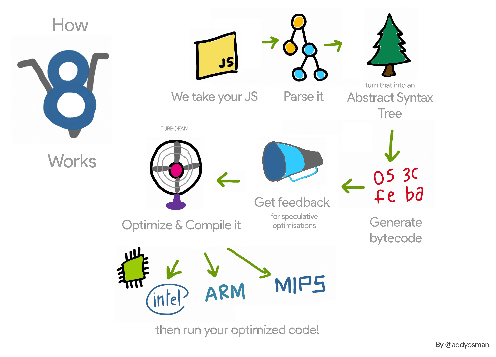
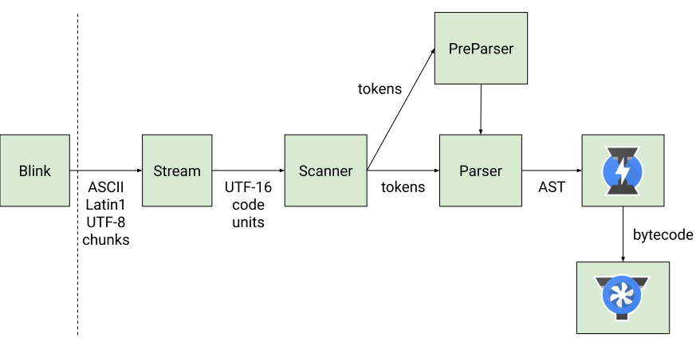

# V8 JavaScript Engine - Internals

JS Engine used by Chrome, Node.js, etc

## Table of Contents

## Introduction

### What is V8

V8 is Google's open source high-performance JavaScript and WebAssembly engine, written in C++.
It is used in Chrome and in Node.js, among others.

For this blog, we will focus on the JavaScript engine.

## How your js runs?

Here is a simplified view of how V8 works.

- **Parsing** : The JavaScript file is parsed, creating an Abstract Syntax Tree (AST).
- **Bytecode Generation** : V8 generates unoptimized bytecode from the AST.
- **Optimization** : V8 gathers feedback during execution and uses it to optimize and compile the bytecode into machine code.
- **Execution** : The optimized machine code is then executed.

[Javascript Engines by Franziska Hinkelmann](https://youtu.be/p-iiEDtpy6I?si=dSPAO3YcAvksJRpy&t=727)

## Balancing Performance in JavaScript Execution

> This tries to answer, why do we have both - an interpreter as well as a Compiler in V8?

When designing a JavaScript execution engine, several key performance factors must be considered:

- **Peak Performance** : How fast can the generated machine code execute a function?
- **Startup Time** : How quickly does the JavaScript code begin execution?
- **Memory Consumption** : How much memory is required for a given startup time and execution speed? This is especially crucial in resource-constrained environments.

These factors often conflict. More aggressive optimization leads to faster execution (peak performance) but also increases compilation time (impacting startup time) and memory usage. A single approach rarely optimizes all three.

### The Trade-offs

- **Interpreters**: Offer fast startup times and low memory consumption, ideal for initial execution. However, they suffer from slower execution speeds compared to compiled code.
- **Ahead-of-Time (AOT) Compilation**: While common in languages like C/C++, AOT compilation isn't suitable for JavaScript due to its dynamic nature. JavaScript's flexibility (e.g., runtime type changes) would be lost with traditional AOT compilation.

### The JIT Compilation Solution

Just-In-Time (JIT) compilation strikes a balance. Modern JavaScript engines, like V8, use JIT compilers:

- **Initial Interpretation** : The code is initially executed by an interpreter, providing a fast startup.
- **Profiling and Optimization** : During execution, the engine profiles the code, identifying frequently used sections. These "hot paths" are then compiled into optimized machine code by the JIT compiler.
- **Optimized Execution** : Subsequent executions of the optimized code are significantly faster.

This approach offers the best of both worlds:

- **Fast Startup** : The interpreter handles the initial execution quickly.
- **High Peak Performance** : The JIT compiler generates optimized machine code for frequently used parts of the program.
- **Reasonable Memory Usage** : While JIT compilation uses more memory than pure interpretation, the performance gains make it a worthwhile trade-off.

Therefore, the combination of an interpreter for initial execution and a JIT compiler for subsequent optimization is a well-suited design choice for balancing the competing demands of performance in dynamic languages like JavaScript.

## V8 Architecture

> V8's JS Code Flow from [Blazingly fast parsing](https://v8.dev/blog/scanner)

- **Source Code Loading** : V8 begins by loading the JavaScript source code. - **Parsing and AST Generation** : The
  loaded code is parsed, creating an Abstract Syntax Tree (AST), which represents the code's structure. - Scanner
  generates tokens from the source code. - Parser constructs the AST from these tokens. Not everything is parsed. -
  Preparser performs a lightweight parsing to identify functions and other declarations. - **Bytecode Generation
  (Ignition)** : An interpreter called Ignition takes the AST and generates bytecode. This bytecode is used for the
  initial execution of the code. - **Initial Execution and Feedback Collection** : The bytecode is executed, and during
  this process, V8 collects feedback on the code's behavior (e.g., data types used). - **Just-In-Time (JIT) Compilation
  (TurboFan)** : Based on the collected feedback, V8's JIT compiler (TurboFan) performs speculative optimizations and
  generates optimized machine code. This optimized code is significantly faster than bytecode. - **Optimized Code
  Execution** : For subsequent executions of the same code, the optimized machine code is used. - **Deoptimization** : If
  the speculative optimizations made by the JIT compiler prove incorrect (e.g., due to a change in data types at runtime),
  V8 performs deoptimization. This means the optimized code is discarded, and execution falls back to the original
  bytecode generated by the interpreter. This ensures correctness even with dynamic JavaScript behavior.

## Scanner

> Tokens are blocks of one or more characters that have a single semantic meaning:
> a string, an identifier, an operator like `++`.

- V8's parser consumes 'tokens' provided by the 'scanner'
- The scanner constructs these tokens by combining consecutive characters in an underlying character stream.
- The scanner consumes a stream of Unicode characters which are decoded from a stream of UTF-16 code units.
- UTF-16 cannot encode every Unicode character in a single code unit, so some characters are encoded as a surrogate pair of two code units.
- The scanner uses a 4-character lookahead to choose the appropriate scanning method for a token.

The [UTF16CharacterStream](https://source.chromium.org/chromium/v8/v8.git/+/edf3dab4660ed6273e5d46bd2b0eae9f3210157d:src/scanner.h;l=46)
provides a (possibly buffered) UTF-16 view over the underlying Latin1, UTF-8, or UTF-16 encoding that V8 receives from Chrome, which Chrome in turn received from the network.

> Only single encoding is supported by v8 to avoid branching or specializing the scanner for different encodings.
> UTF-16 is used as it is the encoding used by JavaScript strings.

### Whitespace

- Tokens can be separated by various types of whitespace. e.g. newline, space, tab, single line comments, multi-line comments, etc.
- One type of whitespace can be followed by other types of whitespace
- Whitespace adds meaning if it causes a line break between two tokens: that possibly results in [automatic semicolon insertion](https://tc39.es/ecma262/#sec-automatic-semicolon-insertion).
- So before scanning the next token, all whitespace is skipped keeping track of whether a newline occurred.

Most real-world production JavaScript code is minified, and so multi-character whitespace luckily isn't very common.
For that reason V8 uniformly scans each type of whitespace independently as if they were regular tokens.

### Identifier scanning

The most complicated, but also most common token, is the [identifier](https://tc39.es/ecma262/#prod-Identifier) token,
which is used for variable names (among other things) in JavaScript.

- Identifiers start with a Unicode character with the property ID_Start, optionally followed by a sequence of characters with the property ID_Continue.
- Looking up whether a Unicode character has the property ID_Start or ID_Continue is quite expensive.
- For ASCII characters, V8 uses a lookup table to determine whether a character is an identifier start or continue character.
  - `a-z`, `A-Z`, `$`, `_` -> ID_Start, ID_Continue
  - `0-9` -> ID_Continue (but not ID_Start)

### Keywords

Keywords are a special subset of identifiers defined by the language, e.g., if, else, and function.
V8's scanner returns different tokens for keywords than for identifiers.

- After scanning an identifier we need to recognize whether the identifier is a keyword.
- Since all keywords in JavaScript only contain lowercase characters `a-z`, V8 keeps flags indicating whether ASCII characters are possible keyword start and continue characters.
- V8 uses the GNU perfect hash function generator (gperf) to generate a perfect hash function for the list of keywords.
- Since the list of keywords is static, V8 can use a perfect hash function to map the first few characters of an identifier to a keyword token.
- A hash from the length and first two identifier character is used to find the single candidate keyword.

## Pre-parser

Preparsing is a technique used by JavaScript engines like V8 to speed up the parsing of code. Here's how it works:

### The Problem

- Parsing JavaScript code (turning it into an understandable structure for the computer) can be time-consuming, especially for large files.
- Not all functions in a JavaScript file are necessarily needed immediately, especially during initial page load.

### The Solution: Lazy Parsing

JavaScript engines use "lazy parsing". This means they don't fully parse every function right away.

Instead, they "pre-parse" functions. This is a lighter-weight process that does the bare minimum to understand the function's structure.
The pre-parser checks for syntax errors and gathers essential information about the function.
When a pre-parsed function is actually called later in the code, it is then fully parsed and compiled.

### Benefits of Pre-parsing

- **Faster Startup**: By not fully parsing everything upfront, the browser can start executing the necessary code more quickly.
- **Reduced Memory Usage**: Pre-parsing uses less memory than full parsing, which is important for performance, especially on devices with limited resources.

## Ignition: The Interpreter

- **A bytecode interpreter** : Ignition sits between the JavaScript code you write and the highly optimized machine code that your computer's processor understands. It takes the JavaScript and translates it into an intermediate language called bytecode. Think of bytecode as a set of instructions that Ignition can understand and execute.
- **Fast and efficient** : Ignition is designed to be a fast and efficient interpreter. It's not the absolute fastest way to run code (that's where TurboFan, another V8 component, comes in), but it's very good at quickly executing code that doesn't need extreme optimization.
- **Memory-conscious** : One of Ignition's main goals is to reduce memory usage. This is especially important for devices with limited memory, like mobile phones.

## Turbofan: The Compiler

TurboFan is the optimizing compiler in the V8 JavaScript engine.
It's responsible for taking the bytecode generated by Ignition (V8's interpreter) and
turning it into highly optimized machine code that can run directly on your computer's processor.
This results in significantly faster execution of JavaScript code.

Here's a breakdown of how TurboFan works:

### Profiling

- TurboFan doesn't optimize all code equally.
- It focuses on "hot" code, which is the code that is executed frequently.
- To identify hot code, V8 uses profiling.
- It monitors the execution of the bytecode and keeps track of how often different parts of the code are being run.

### Compilation

Once TurboFan identifies hot code, it takes the bytecode and compiles it into machine code. This is a complex process that involves many optimizations.

### Optimizations

TurboFan employs a wide range of optimization techniques to make the machine code as efficient as possible.
These include:

- **Inlining** : Replacing function calls with the actual code of the function to reduce overhead.
- **Loop optimization** : Transforming loops to make them run faster.
- **Type specialization** : Generating different versions of the code based on the types of variables to eliminate type checks at runtime.
- **Register allocation** : Assigning variables to registers in the CPU to minimize memory accesses.

### De-optimization

Sometimes, TurboFan makes assumptions about the types of variables to perform optimizations.
If these assumptions turn out to be incorrect (e.g., a variable changes type), the optimized code may become invalid.
In such cases, V8 has a mechanism called "de-optimization" to fall back to the interpreter (Ignition)
and recompile the code with the correct assumptions.

### Key Benefits of TurboFan

- **Significant performance boost**: By generating highly optimized machine code, TurboFan can dramatically improve the speed of JavaScript execution.
- **Dynamic optimization**: TurboFan can adapt to changes in the code at runtime, ensuring that the most frequently executed code is always optimized.

## Orinoco: The Garbage Collection

Orinoco is the name of V8's project to improve garbage collection, particularly by reducing pause times

### How V8's GC Works (Simplified)

- **Marking**: V8 identifies which objects are still being used by your code ("live objects") and which are no longer needed ("dead objects").
- **Sweeping**: It reclaims the memory occupied by the dead objects, making it available for new objects.
- **Compacting (Sometimes)**: V8 might rearrange the live objects in memory to reduce fragmentation and improve performance.

### Key Techniques

A mostly parallel & concurrent compacting GC

- Parallel compaction
- parallel pointer updates
- fast page promotion from young to old generation to avoid copying overhead
- concurrent sweeping
- concurrent marking

## References

- [Blog: Blazingly fast parsing, part 1: optimizing the scanner](https://v8.dev/blog/scanner)
- [Blog: Blazingly fast parsing, part 2: lazy parsing](https://v8.dev/blog/preparser)

- [Video: V8, Advanced JavaScript, & the Next Performance Frontier (Google I/O '17)](https://youtu.be/EdFDJANJJLs?si=r53Gg3SqaGtsEQ-W)

- [Blog: JavaScript Start-up Performance by @addyosmani](https://medium.com/reloading/javascript-start-up-performance-69200f43b201)
- [Video: Franziska Hinkelmann: JavaScript engines - how do they even? | JSConf EU](https://youtu.be/p-iiEDtpy6I?si=3pp_sdppQV49IDUe)

- [Blog: V8: Behind the Scenes (February Edition feat. A tale of TurboFan)](https://benediktmeurer.de/2017/03/01/v8-behind-the-scenes-february-edition/)
- [Video: V8 and How It Listens to You - Michael Stanton](https://youtu.be/u7zRSm8jzvA?si=hli9DbYLKS1uVjDb)
- [Blog: Understanding V8's Bytecode by Franziska Hinkelmann](https://medium.com/dailyjs/understanding-v8s-bytecode-317d46c94775)
- [BlinkOn 6 Day 1 Talk 2: Ignition - an interpreter for V8](https://youtu.be/r5OWCtuKiAk?si=LYVeIJpVr2muOeKW),
  [Slides](https://docs.google.com/presentation/d/1OqjVqRhtwlKeKfvMdX6HaCIu9wpZsrzqpIVIwQSuiXQ/edit#slide=id.g1357e6d1a4_0_58),
  [Slides PDF](https://github.com/sujeet-pro/learning-resources/blob/main/deep-dives/v8-internals/Ignition_%20An%20Interpreter%20for%20V8%20%5BBlinkOn%5D.pdf)

### Suggested Reads

- [Video: Mathias Bynens - V8 internals for JavaScript developers](https://youtu.be/m9cTaYI95Zc?si=INnxoUiKDW-DJ1YD)
- [Basic Multilingual Plane](<https://en.wikipedia.org/wiki/Plane_(Unicode)#Basic_Multilingual_Plane>)

### Tools

- [gperf - GNU perfect hash function generator](https://www.gnu.org/software/gperf/)
