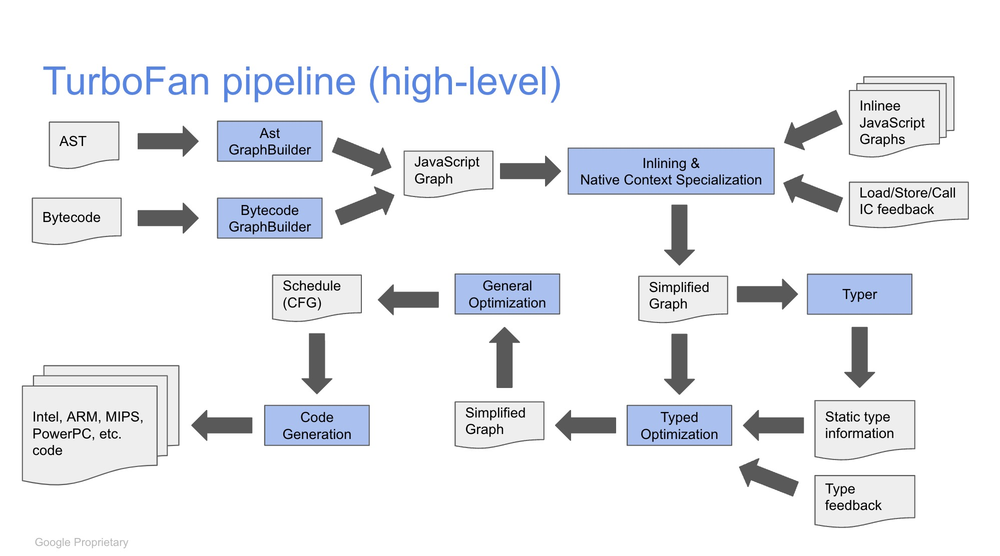

# Draft: TurboFan - V8's JavaScript JIT Compiler

A JIT Compiler used within V8 for JavaScript

## Table of Contents

## TurboFan pipeline

## References

- [Slides: TurboFan: A new code generation architecture for V8 - 2017](https://docs.google.com/presentation/d/1_eLlVzcj94_G4r9j9d_Lj5HRKFnq6jgpuPJtnmIBs88/edit#slide=id.p),
  [PDF Copy](https://github.com/sujeet-pro/learning-resources/blob/main/deep-dives/v8-internals/TurboFan_%20A%20new%20code%20generation%20architecture%20for%20V8.pdf)
- [Slides: An overview of the TurboFan compiler - 2016](https://docs.google.com/presentation/d/1H1lLsbclvzyOF3IUR05ZUaZcqDxo7_-8f4yJoxdMooU/edit#slide=id.p),
  [PDF Copy](https://github.com/sujeet-pro/learning-resources/blob/main/deep-dives/v8-internals/An%20overview%20of%20the%20TurboFan%20compiler.pdf)
- [Slides: TurboFan JIT Design - 2016](https://docs.google.com/presentation/d/1sOEF4MlF7LeO7uq-uThJSulJlTh--wgLeaVibsbb3tc/edit#slide=id.p),
  [PDF Copy](https://github.com/sujeet-pro/learning-resources/blob/main/deep-dives/v8-internals/TurboFan%20TechTalk%20presentation.pdf)

## Suggested Reads

- [Blog: Sea of Nodes - Compiler Concept](https://darksi.de/d.sea-of-nodes/)
