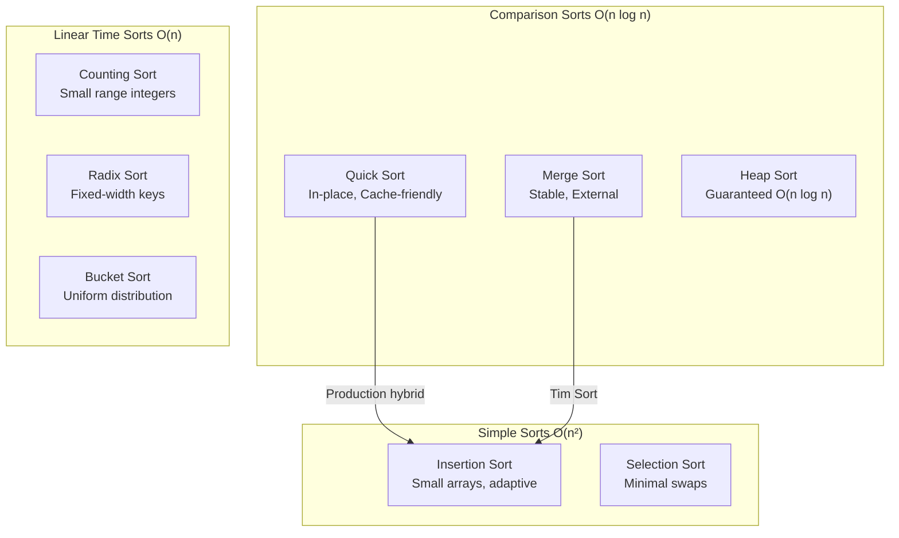

# Sorting Algorithms - Deep Dive into Theory and Practice

A comprehensive guide to sorting algorithms covering fundamental concepts, implementation details, performance characteristics, and real-world applications. Learn when to use each algorithm and understand the engineering trade-offs behind production sorting implementations.

<figure>



<figcaption>Sorting algorithm taxonomy showing complexity classes and key characteristics</figcaption>

</figure>

## TLDR

**Sorting algorithms** organize data with different trade-offs between time complexity, space usage, stability, and cache efficiency.

### Algorithm Selection

- **General purpose**: Quick Sort (randomized pivot) offers best practical performance
- **Stability required**: Merge Sort maintains relative order of equal elements
- **Small arrays (n < 50)**: Insertion Sort beats complex algorithms due to lower overhead
- **Guaranteed worst-case**: Heap Sort provides O(n log n) with O(1) space

### Linear-Time Alternatives

- **Counting Sort**: O(n + k) for integers with small range k; stable and fast
- **Radix Sort**: O(d × n) for d-digit integers; sorts digit-by-digit
- **Bucket Sort**: O(n) average for uniformly distributed data; degrades to O(n²) if skewed

### Production Realities

- **Tim Sort**: Python/Java hybrid of Merge Sort + Insertion Sort; exploits existing order
- **Introsort**: C++ STL uses Quick Sort + Heap Sort + Insertion Sort; guarantees O(n log n)
- **Cache locality**: Quick Sort's sequential access pattern is 2-3× faster than Heap Sort in practice
- **The O(n log n) barrier**: Comparison-based sorting cannot do better (log₂(n!) comparisons needed)

### Key Trade-offs

- **Time vs Space**: Merge Sort uses O(n) extra space for guaranteed O(n log n)
- **Stability vs Speed**: Quick Sort is faster but unstable; Merge Sort is stable but uses more memory
- **Worst case vs Average**: Quick Sort O(n²) worst but randomization makes it practically impossible

## Core Philosophies

### The Fundamental Trade-offs

1. **Time vs Space**: Merge Sort uses O(n) extra space for O(n log n) guaranteed time. Quick Sort uses O(log n) stack space but has O(n²) worst case.

2. **Stability vs Performance**: Stable sorts preserve relative order of equal elements. Sometimes you sacrifice stability for speed.

3. **Adaptivity**: Some algorithms (Insertion Sort, Tim Sort) perform better on partially sorted data.

4. **In-place vs Out-of-place**: In-place algorithms modify the original array; out-of-place need extra memory.

### The O(n log n) Barrier

**Key insight**: Comparison-based sorting cannot do better than O(n log n) in the average/worst case ([CLRS, Chapter 8.1](https://mitpress.mit.edu/9780262046305/introduction-to-algorithms/)).

**Why?** There are n! permutations of n elements. A comparison tree needs log₂(n!) ≈ n log n comparisons to distinguish all permutations.

**Breaking the barrier**: Non-comparison sorts (Counting, Radix, Bucket) can achieve O(n) but have constraints on input.

---

## Comparison-Based Sorting

### 1. Bubble Sort

**Philosophy**: Repeatedly swap adjacent elements if they're in the wrong order. Largest elements "bubble up" to the end.

```typescript
function bubbleSort(arr: number[]): number[] {
  const n = arr.length
  for (let i = 0; i < n - 1; i++) {
    let swapped = false
    for (let j = 0; j < n - i - 1; j++) {
      if (arr[j] > arr[j + 1]) {
        ;[arr[j], arr[j + 1]] = [arr[j + 1], arr[j]]
        swapped = true
      }
    }
    if (!swapped) break // Optimization: already sorted
  }
  return arr
}
```

| Property | Value                                |
| -------- | ------------------------------------ |
| Time     | O(n²) worst/avg, O(n) best (sorted)  |
| Space    | O(1)                                 |
| Stable   | Yes                                  |
| In-place | Yes                                  |
| Use case | Educational, detecting sorted arrays |

**Optimization**: The `swapped` flag gives O(n) for already-sorted arrays.

**Practical applications**: While rarely used in production due to poor performance, Bubble Sort serves well in educational contexts and can efficiently detect if an array is already sorted. In some embedded systems with severe memory constraints and very small datasets (n < 10), its simplicity can outweigh performance concerns.

---

### 2. Selection Sort

**Philosophy**: Find the minimum element and put it at the beginning. Repeat for remaining elements.

```typescript
function selectionSort(arr: number[]): number[] {
  const n = arr.length
  for (let i = 0; i < n - 1; i++) {
    let minIdx = i
    for (let j = i + 1; j < n; j++) {
      if (arr[j] < arr[minIdx]) {
        minIdx = j
      }
    }
    if (minIdx !== i) {
      ;[arr[i], arr[minIdx]] = [arr[minIdx], arr[i]]
    }
  }
  return arr
}
```

| Property | Value                            |
| -------- | -------------------------------- |
| Time     | O(n²) always                     |
| Space    | O(1)                             |
| Stable   | No (swapping breaks stability)   |
| In-place | Yes                              |
| Use case | Minimizing swaps (memory writes) |

**Key insight**: Always does exactly n-1 swaps. Useful when writes are expensive.

**Practical applications**: Selection Sort excels in scenarios where write operations are costly—flash memory (EEPROM, NAND) with limited write cycles, or when physically moving objects is expensive (robotics, warehouse automation). The predictable number of swaps makes it valuable for hardware where write operations must be minimized. It's also used in certain database systems when updating index pointers is expensive but comparisons are cheap.

---

### 3. Insertion Sort

**Philosophy**: Build the sorted array one element at a time by inserting each element into its correct position.

```typescript
function insertionSort(arr: number[]): number[] {
  const n = arr.length
  for (let i = 1; i < n; i++) {
    const key = arr[i]
    let j = i - 1
    while (j >= 0 && arr[j] > key) {
      arr[j + 1] = arr[j]
      j--
    }
    arr[j + 1] = key
  }
  return arr
}
```

| Property | Value                                    |
| -------- | ---------------------------------------- |
| Time     | O(n²) worst/avg, O(n) best               |
| Space    | O(1)                                     |
| Stable   | Yes                                      |
| In-place | Yes                                      |
| Adaptive | Yes - O(n) for nearly sorted             |
| Use case | Small arrays, nearly sorted data, online |

**Key characteristics**:

- Used as the base case in hybrid sorts (Tim Sort, Introsort)
- Optimal for small arrays (n < 10-20) due to low overhead
- Online algorithm: can sort data as it arrives in real-time
- Excellent cache locality due to sequential access pattern

---

### 4. Merge Sort

**Philosophy**: Divide and conquer. Split array in half, recursively sort each half, merge the sorted halves.

```typescript collapse={12-26}
function mergeSort(arr: number[]): number[] {
  if (arr.length <= 1) return arr

  const mid = Math.floor(arr.length / 2)
  const left = mergeSort(arr.slice(0, mid))
  const right = mergeSort(arr.slice(mid))

  return merge(left, right)
}

// Merge helper: combines two sorted arrays
function merge(left: number[], right: number[]): number[] {
  const result: number[] = []
  let i = 0,
    j = 0

  while (i < left.length && j < right.length) {
    if (left[i] <= right[j]) {
      result.push(left[i++])
    } else {
      result.push(right[j++])
    }
  }

  return result.concat(left.slice(i)).concat(right.slice(j))
}
```

| Property       | Value                                            |
| -------------- | ------------------------------------------------ |
| Time           | O(n log n) always                                |
| Space          | O(n)                                             |
| Stable         | Yes                                              |
| In-place       | No                                               |
| Parallelizable | Yes - independent subproblems                    |
| Use case       | Linked lists, external sorting, stability needed |

**Critical insights**:

1. **Guaranteed O(n log n)** - No worst case degradation
2. **Stable** - Critical for multi-key sorting
3. **External sorting** - Natural for disk-based sorting
4. **Linked lists** - Merge is O(1) space for linked lists

**Optimization**: Bottom-up merge sort avoids recursion overhead.

**Practical applications**: Merge Sort is widely used in production systems:
- **Database systems**: External sorting for large datasets that don't fit in memory (PostgreSQL, MySQL use merge-based algorithms)
- **Version control systems**: Merging file changes in Git relies on merge-like algorithms
- **E-commerce platforms**: Multi-criteria product sorting (price within category) requires stable sorting
- **Log aggregation**: Merging pre-sorted log files from multiple servers
- **Language implementations**: Java's `Arrays.sort()` for objects and Python's `sorted()` use Tim Sort (merge-based)

---

### 5. Quick Sort

**Philosophy**: Pick a pivot, partition array so elements smaller than pivot are on left, larger on right. Recursively sort partitions.

```typescript collapse={1-9}
// Main quicksort - divide and conquer
function quickSort(arr: number[], low: number = 0, high: number = arr.length - 1): number[] {
  if (low < high) {
    const pivotIdx = partition(arr, low, high)
    quickSort(arr, low, pivotIdx - 1)
    quickSort(arr, pivotIdx + 1, high)
  }
  return arr
}

// Partition: the core of Quick Sort (Lomuto scheme)
function partition(arr: number[], low: number, high: number): number {
  const pivot = arr[high] // Using last element as pivot
  let i = low - 1

  for (let j = low; j < high; j++) {
    if (arr[j] < pivot) {
      i++
      ;[arr[i], arr[j]] = [arr[j], arr[i]]
    }
  }
  ;[arr[i + 1], arr[high]] = [arr[high], arr[i + 1]]
  return i + 1
}
```

| Property | Value                           |
| -------- | ------------------------------- |
| Time     | O(n log n) avg, O(n²) worst     |
| Space    | O(log n) stack space            |
| Stable   | No                              |
| In-place | Yes                             |
| Use case | General purpose, cache-friendly |

**Pivot Selection Strategies**:

1. **Last/First element**: Simple but O(n²) for sorted arrays
2. **Random pivot**: Expected O(n log n)
3. **Median-of-three**: Pick median of first, middle, last
4. **Median-of-medians**: Guaranteed O(n log n) but slower in practice

**3-Way Partition (Dutch National Flag)**:
Essential for arrays with many duplicates:

```typescript
function quickSort3Way(arr: number[], low: number, high: number): void {
  if (low >= high) return

  let lt = low   // arr[low..lt-1] < pivot
  let gt = high  // arr[gt+1..high] > pivot
  let i = low + 1
  const pivot = arr[low]

  // Partition into three regions: <pivot, ==pivot, >pivot
  while (i <= gt) {
    if (arr[i] < pivot) {
      ;[arr[lt], arr[i]] = [arr[i], arr[lt]]
      lt++
      i++
    } else if (arr[i] > pivot) {
      ;[arr[i], arr[gt]] = [arr[gt], arr[i]]
      gt--
    } else {
      i++ // Equal elements stay in middle
    }
  }

  quickSort3Way(arr, low, lt - 1)  // Sort < pivot
  quickSort3Way(arr, gt + 1, high) // Sort > pivot
}
```

**Practical applications**: Quick Sort dominates general-purpose sorting:
- **Standard libraries**: C++ `std::sort()` (Introsort), Go's `sort.Sort()`, and most language primitives use Quick Sort variants
- **In-memory databases**: Redis, Memcached use Quick Sort for range queries
- **File systems**: Sorting directory entries for fast lookup
- **Analytics engines**: Apache Spark, Hadoop use Quick Sort for in-memory shuffle operations
- **3-way partition use case**: Log processing systems with repeated severity levels (INFO, WARN, ERROR)

---

### 6. Heap Sort

**Philosophy**: Build a max-heap, repeatedly extract the maximum to build sorted array from the end.

```typescript collapse={18-31}
function heapSort(arr: number[]): number[] {
  const n = arr.length

  // Build max heap (bottom-up)
  for (let i = Math.floor(n / 2) - 1; i >= 0; i--) {
    heapify(arr, n, i)
  }

  // Extract elements from heap one by one
  for (let i = n - 1; i > 0; i--) {
    ;[arr[0], arr[i]] = [arr[i], arr[0]] // Move max to end
    heapify(arr, i, 0) // Restore heap property
  }

  return arr
}

// Heapify: maintain max-heap property
function heapify(arr: number[], n: number, i: number): void {
  let largest = i
  const left = 2 * i + 1
  const right = 2 * i + 2

  if (left < n && arr[left] > arr[largest]) largest = left
  if (right < n && arr[right] > arr[largest]) largest = right

  if (largest !== i) {
    ;[arr[i], arr[largest]] = [arr[largest], arr[i]]
    heapify(arr, n, largest)
  }
}
```

| Property       | Value                          |
| -------------- | ------------------------------ |
| Time           | O(n log n) always              |
| Space          | O(1)                           |
| Stable         | No                             |
| In-place       | Yes                            |
| Cache-friendly | No - random access pattern     |
| Use case       | Guaranteed O(n log n) in-place |

**Key insight**: Heap Sort is the only comparison sort that is both in-place AND guaranteed O(n log n).

**Practical applications**: Heap Sort and heap-based structures are essential in specific domains:
- **Real-time systems**: Avionics, medical devices where O(n²) worst-case is unacceptable and memory is severely constrained
- **Priority queues**: Task schedulers (Linux CFS), network packet routing, event-driven simulations
- **Streaming algorithms**: Finding top-K elements in data streams (YouTube trending, stock tickers)
- **Graph algorithms**: Dijkstra's shortest path, Prim's MST use min-heaps
- **Operating systems**: Kernel memory allocators use heap-based priority queues
- **Partial sorting**: When you only need the k largest elements (O(n log k) with a heap)

---

## Non-Comparison Sorting

These break the O(n log n) barrier by not comparing elements directly.

### 7. Counting Sort

**Philosophy**: Count occurrences of each value, then place elements based on counts.

```typescript collapse={1-9}
// Setup: find range and initialize arrays
function countingSort(arr: number[]): number[] {
  if (arr.length === 0) return arr

  const max = Math.max(...arr)
  const min = Math.min(...arr)
  const range = max - min + 1
  const count = new Array(range).fill(0)
  const output = new Array(arr.length)

  // Count occurrences
  for (const num of arr) {
    count[num - min]++
  }

  // Cumulative count (for stability)
  for (let i = 1; i < range; i++) {
    count[i] += count[i - 1]
  }

  // Build output (iterate backwards for stability)
  for (let i = arr.length - 1; i >= 0; i--) {
    output[count[arr[i] - min] - 1] = arr[i]
    count[arr[i] - min]--
  }

  return output
}
```

| Property | Value                          |
| -------- | ------------------------------ |
| Time     | O(n + k) where k is range      |
| Space    | O(n + k)                       |
| Stable   | Yes (if implemented correctly) |
| Use case | Small range of integers        |

**When to use**: Range of values (k) is O(n) or smaller.

**Practical applications**: Counting Sort excels when sorting bounded-range data:
- **Grading systems**: Sorting students by test scores (0-100), letter grades (A-F)
- **Age-based sorting**: Demographics analysis, customer segmentation (ages 0-120)
- **Histogram generation**: Image processing (pixel values 0-255), frequency analysis
- **Character sorting**: Text processing, anagram detection (26 lowercase letters)
- **Voting systems**: Counting ballots, survey responses with limited options
- **Gaming leaderboards**: Score sorting when scores have known maximum values

---

### 8. Radix Sort

**Philosophy**: Sort by individual digits, from least significant to most significant (LSD) or vice versa (MSD).

```typescript collapse={14-37}
function radixSort(arr: number[]): number[] {
  if (arr.length === 0) return arr

  const max = Math.max(...arr)

  // Sort by each digit using counting sort as subroutine (LSD)
  for (let exp = 1; Math.floor(max / exp) > 0; exp *= 10) {
    countingSortByDigit(arr, exp)
  }

  return arr
}

// Stable counting sort for a single digit position
function countingSortByDigit(arr: number[], exp: number): void {
  const n = arr.length
  const output = new Array(n)
  const count = new Array(10).fill(0)

  for (const num of arr) {
    const digit = Math.floor(num / exp) % 10
    count[digit]++
  }

  for (let i = 1; i < 10; i++) {
    count[i] += count[i - 1]
  }

  for (let i = n - 1; i >= 0; i--) {
    const digit = Math.floor(arr[i] / exp) % 10
    output[count[digit] - 1] = arr[i]
    count[digit]--
  }

  for (let i = 0; i < n; i++) {
    arr[i] = output[i]
  }
}
```

| Property | Value                            |
| -------- | -------------------------------- |
| Time     | O(d * (n + k)) where d = digits  |
| Space    | O(n + k)                         |
| Stable   | Yes                              |
| Use case | Fixed-length integers, strings   |

**Practical applications**: Radix Sort is optimal for fixed-width data:
- **Network routing**: Sorting IP addresses (32-bit integers), MAC addresses
- **Telecommunications**: Sorting phone numbers, IMEI numbers
- **Database indexing**: Sorting fixed-length keys (UUIDs, product codes)
- **Financial systems**: Sorting transaction IDs, account numbers
- **Bioinformatics**: Suffix array construction for DNA sequences (A, C, G, T alphabet)
- **Data compression**: Building frequency tables for Huffman coding
- **Distributed systems**: Sorting timestamps (64-bit Unix timestamps)

---

### 9. Bucket Sort

**Philosophy**: Distribute elements into buckets, sort each bucket, concatenate results.

```typescript
function bucketSort(arr: number[], bucketCount: number = 10): number[] {
  if (arr.length === 0) return arr

  const min = Math.min(...arr)
  const max = Math.max(...arr)
  const bucketSize = (max - min) / bucketCount + 1
  const buckets: number[][] = Array.from({ length: bucketCount }, () => [])

  // Distribute into buckets
  for (const num of arr) {
    const idx = Math.floor((num - min) / bucketSize)
    buckets[Math.min(idx, bucketCount - 1)].push(num)
  }

  // Sort individual buckets and concatenate
  return buckets.flatMap((bucket) => insertionSort(bucket))
}
```

| Property | Value                                |
| -------- | ------------------------------------ |
| Time     | O(n + k) avg, O(n²) worst            |
| Space    | O(n + k)                             |
| Stable   | Depends on bucket sorting algorithm  |
| Use case | Uniformly distributed floating point |

**Practical applications**: Bucket Sort is ideal for uniformly distributed numeric data:
- **Scientific computing**: Sorting sensor readings, measurement data with known ranges
- **Geospatial systems**: Sorting coordinates (latitude -90 to 90, longitude -180 to 180)
- **Financial analytics**: Sorting uniformly distributed price changes, percentage returns
- **Weather systems**: Temperature data, precipitation measurements in known ranges
- **A/B testing**: Sorting conversion rates, click-through rates (0.0 to 1.0)
- **Computer graphics**: Sorting normalized color values (0.0 to 1.0 for RGB)
- **Statistical analysis**: Sorting probability distributions, random samples

---

## Sorting Algorithm Comparison

### Quick Reference Table

| Algorithm      | Best       | Average    | Worst      | Space    | Stable | In-place |
| -------------- | ---------- | ---------- | ---------- | -------- | ------ | -------- |
| Bubble Sort    | O(n)       | O(n²)      | O(n²)      | O(1)     | Yes    | Yes      |
| Selection Sort | O(n²)      | O(n²)      | O(n²)      | O(1)     | No     | Yes      |
| Insertion Sort | O(n)       | O(n²)      | O(n²)      | O(1)     | Yes    | Yes      |
| Merge Sort     | O(n log n) | O(n log n) | O(n log n) | O(n)     | Yes    | No       |
| Quick Sort     | O(n log n) | O(n log n) | O(n²)      | O(log n) | No     | Yes      |
| Heap Sort      | O(n log n) | O(n log n) | O(n log n) | O(1)     | No     | Yes      |
| Counting Sort  | O(n + k)   | O(n + k)   | O(n + k)   | O(n + k) | Yes    | No       |
| Radix Sort     | O(nk)      | O(nk)      | O(nk)      | O(n + k) | Yes    | No       |
| Bucket Sort    | O(n + k)   | O(n + k)   | O(n²)      | O(n + k) | Yes    | No       |

### Decision Tree: Which Sort to Use?

```
Is stability required?
├── Yes
│   ├── Need guaranteed O(n log n)? → Merge Sort
│   ├── Small array (n < 20)? → Insertion Sort
│   └── Integers with small range? → Counting Sort
└── No
    ├── Need guaranteed O(n log n) + O(1) space? → Heap Sort
    ├── Practical fastest (general case)? → Quick Sort
    ├── Many duplicates? → 3-Way Quick Sort
    └── Integers with known range? → Radix Sort
```

---

## Why Quick Sort Beats Heap Sort in Practice

Both Quick Sort and Heap Sort are in-place, unstable, O(n log n) average-case algorithms. On paper, Heap Sort looks better with its O(n log n) **guaranteed** worst case. Yet Quick Sort is the preferred choice in most standard libraries. Here's why:

### 1. Cache Locality

**Quick Sort wins decisively here.**

```
Quick Sort: Sequential memory access during partition
┌───┬───┬───┬───┬───┬───┬───┬───┐
│ 3 │ 1 │ 4 │ 1 │ 5 │ 9 │ 2 │ 6 │  ← Scans left-to-right
└───┴───┴───┴───┴───┴───┴───┴───┘
  →   →   →   →   →   →   →   →

Heap Sort: Jumps between parent and children (2i+1, 2i+2)
┌───┬───┬───┬───┬───┬───┬───┬───┐
│ 0 │ 1 │ 2 │ 3 │ 4 │ 5 │ 6 │ 7 │  ← Index
└───┴───┴───┴───┴───┴───┴───┴───┘
  ↓───────↘───────↘
      ↓───────↘───────↘
          (Parent-child jumps cause cache misses)
```

- **Quick Sort**: The partition step scans the array sequentially. Adjacent elements are accessed together, maximizing L1/L2 cache hits.
- **Heap Sort**: Heapify jumps between index `i` and indices `2i+1`, `2i+2`. For large arrays, parent and children are far apart in memory, causing frequent cache misses.

**Real impact**: On modern CPUs, a cache miss costs 100-300 cycles ([Intel Optimization Manual](https://www.intel.com/content/www/us/en/developer/articles/technical/intel-sdm.html)). Quick Sort's sequential access pattern can be 2-3x faster than Heap Sort for large arrays purely due to cache behavior.

### 2. Lower Constant Factors

Quick Sort does less work per element ([Sedgewick & Wayne, Algorithms 4th Ed](https://algs4.cs.princeton.edu/)):

| Operation          | Quick Sort        | Heap Sort            |
| ------------------ | ----------------- | -------------------- |
| Comparisons        | ~1.4n log n       | ~2n log n            |
| Swaps              | ~0.3n log n       | ~n log n             |
| Pointer arithmetic | Simple (i++, j--) | Complex (2i+1, 2i+2) |

```typescript
// Quick Sort partition - simple operations
while (arr[i] < pivot) i++    // Simple increment
while (arr[j] > pivot) j--    // Simple decrement

// Heap Sort heapify - more complex
left = 2 * i + 1              // Multiplication + addition
right = 2 * i + 2             // Multiplication + addition
if (left < n && arr[left] > arr[largest]) ...
if (right < n && arr[right] > arr[largest]) ...
```

### 3. Branch Prediction

Modern CPUs predict which way branches (if statements) will go. Mispredictions are costly (~15-20 cycles).

**Quick Sort**: After a few iterations, the CPU learns the pattern. Elements mostly go one way based on their relation to the pivot.

**Heap Sort**: The comparison `arr[left] > arr[largest]` vs `arr[right] > arr[largest]` is essentially random - the CPU can't predict which child is larger, causing frequent mispredictions.

```
Branch prediction success rate (approximate):
- Quick Sort partition: 90-95%
- Heap Sort heapify:    50-60%
```

### 4. Practical Worst Case is Avoidable

Quick Sort's O(n²) worst case sounds scary, but it's easily prevented:

```typescript
// Randomized pivot - O(n²) becomes astronomically unlikely
function partition(arr: number[], low: number, high: number): number {
  // Random pivot selection
  const randomIdx = low + Math.floor(Math.random() * (high - low + 1))
  ;[arr[randomIdx], arr[high]] = [arr[high], arr[randomIdx]]

  // ... rest of partition
}
```

**Probability analysis**:

- For O(n²) to occur, you need to consistently pick the worst pivot
- With random pivots, probability of O(n²) is approximately `1/n!`
- For n = 1000: probability ≈ 1 in 10^2567 (effectively impossible)

**Median-of-three** is another practical defense:

```typescript
// Pick median of first, middle, last
const mid = Math.floor((low + high) / 2)
if (arr[low] > arr[mid]) swap(arr, low, mid)
if (arr[low] > arr[high]) swap(arr, low, high)
if (arr[mid] > arr[high]) swap(arr, mid, high)
// Use arr[mid] as pivot
```

### 5. Space Complexity: O(1) vs O(log n) is Negligible

Theoretically, Heap Sort uses O(1) space while Quick Sort uses O(log n) for the recursion stack. In practice, this difference is meaningless:

| Array Size    | Quick Sort Stack Space | Actual Memory |
| ------------- | ---------------------- | ------------- |
| 1,000         | log₂(1000) ≈ 10 frames | ~200 bytes    |
| 1,000,000     | log₂(10⁶) ≈ 20 frames  | ~400 bytes    |
| 10,000,000    | log₂(10⁷) ≈ 24 frames  | ~480 bytes    |
| 1,000,000,000 | log₂(10⁹) ≈ 30 frames  | ~600 bytes    |

**Key insight**: Even for a billion elements, Quick Sort uses only ~600 bytes of stack space. When you're sorting gigabytes of data, 600 bytes is nothing.

For comparison, the array itself for 10 million 64-bit integers takes **80 MB**. The 400 bytes of stack space is 0.0005% of that.

### 6. Benchmark Reality

Typical benchmarks show Quick Sort 2-3x faster than Heap Sort:

```
Sorting 10,000,000 random integers (typical results):
┌─────────────┬──────────────┬─────────┐
│ Algorithm   │ Time (ms)    │ Ratio   │
├─────────────┼──────────────┼─────────┤
│ Quick Sort  │ ~800         │ 1.0x    │
│ Heap Sort   │ ~2000        │ 2.5x    │
│ Merge Sort  │ ~1200        │ 1.5x    │
└─────────────┴──────────────┴─────────┘
```

### When to Actually Use Heap Sort

Despite Quick Sort's advantages, Heap Sort has its place:

1. **Hard real-time systems**: When O(n²) worst case is absolutely unacceptable and you can't use extra space for Merge Sort
2. **Embedded systems**: When stack space is truly constrained (unusual today)
3. **Security-critical code**: When adversarial input could trigger Quick Sort's worst case (though randomized pivot largely solves this)
4. **Partial sorting**: Finding top-k elements with a heap is O(n log k)

### Summary: Quick Sort vs Heap Sort

| Factor            | Quick Sort        | Heap Sort    | Winner     |
| ----------------- | ----------------- | ------------ | ---------- |
| Cache locality    | Sequential access | Random jumps | Quick Sort |
| Comparisons       | ~1.4n log n       | ~2n log n    | Quick Sort |
| Swaps             | ~0.3n log n       | ~n log n     | Quick Sort |
| Branch prediction | Predictable       | Random       | Quick Sort |
| Worst case        | O(n²) (avoidable) | O(n log n)   | Heap Sort  |
| Space             | O(log n)          | O(1)         | Tie*       |
| Practical speed   | Fast              | 2-3x slower  | Quick Sort |

*The space difference is negligible in practice

**Bottom line**: Use Quick Sort (with randomized pivot) as your default. The theoretical worst case is a non-issue in practice, and the real-world performance gains from cache efficiency and lower constant factors are substantial.

---

## Practical Usage Guide: When to Use Each Algorithm

Understanding which sorting algorithm to use in real-world scenarios is crucial. Here's a comprehensive guide based on practical constraints.

### Insertion Sort: The Small Array Champion

**Use when:**

- Array size is small (n < 20-50 elements)
- Data is nearly sorted (few inversions)
- Online sorting (elements arrive one at a time)
- Stability is required with minimal overhead

**Real-world examples:**

```typescript
// 1. Hybrid sort base case (Tim Sort, Introsort)
function hybridSort(arr: number[], low: number, high: number): void {
  if (high - low < 32) {
    insertionSort(arr, low, high) // Small subarray
    return
  }
  // ... continue with Quick Sort or Merge Sort
}

// 2. Maintaining a sorted small collection
class TopScores {
  private scores: number[] = []

  addScore(score: number): void {
    // Insert in sorted position - O(k) for k scores
    let i = this.scores.length - 1
    this.scores.push(score)
    while (i >= 0 && this.scores[i] > score) {
      this.scores[i + 1] = this.scores[i]
      i--
    }
    this.scores[i + 1] = score
  }
}

// 3. Nearly sorted data (e.g., log files with minor timestamp issues)
// If only a few elements are out of place, Insertion Sort is O(n)
```

**Why it works**: For small arrays, the overhead of divide-and-conquer (function calls, index calculations) exceeds the benefit. Insertion Sort's simplicity and cache-friendly sequential access win.

---

### Quick Sort: The General-Purpose Workhorse

**Use when:**

- General-purpose sorting needed
- Stability not required
- Average-case performance matters most
- Memory is constrained (need in-place)

**Real-world examples:**

```typescript
// 1. Sorting user-generated data
function sortUserPosts(posts: Post[]): Post[] {
  return posts.sort((a, b) => b.timestamp - a.timestamp)
  // Most languages use Quick Sort or hybrid internally
}

// 2. Database query results (when no index available)
// Quick Sort's cache efficiency makes it ideal for in-memory sorting

// 3. Competitive programming - fast and simple
function solve(arr: number[]): number {
  arr.sort((a, b) => a - b) // Quick Sort under the hood
  // ... solve problem with sorted array
}
```

**Avoid when:**

- Adversarial input possible without randomization
- Absolute worst-case guarantees needed
- Stability required

---

### Merge Sort: The Stable Guarantee

**Use when:**

- Stability is required
- Guaranteed O(n log n) is needed
- Sorting linked lists
- External sorting (disk-based)
- Parallelization is desired

**Real-world examples:**

```typescript
// 1. Multi-key sorting (stability preserves secondary order)
interface Employee {
  name: string
  department: string
  salary: number
}

function sortByDeptThenSalary(employees: Employee[]): Employee[] {
  // First sort by salary (secondary key)
  employees.sort((a, b) => b.salary - a.salary)
  // Then stable sort by department (primary key)
  // Employees within same dept remain sorted by salary
  return stableSortByDept(employees)
}

// 2. Sorting linked lists - O(1) extra space for merge
function sortLinkedList(head: ListNode | null): ListNode | null {
  // Merge Sort is optimal for linked lists
  // No random access penalty, merge is O(1) space
}

// 3. External sorting (files too large for memory)
function externalSort(inputFile: string, outputFile: string): void {
  // 1. Read chunks that fit in memory
  // 2. Sort each chunk with any algorithm
  // 3. Write sorted chunks to temp files
  // 4. K-way merge sorted chunks (Merge Sort's merge step)
}

// 4. Counting inversions (modified merge sort)
function countInversions(arr: number[]): number {
  // During merge, count pairs where left[i] > right[j]
}
```

**Why linked lists**: No random access means Quick Sort loses its cache advantage. Merge Sort's merge step only needs sequential access and can be done with O(1) extra space.

---

### Heap Sort: The Guaranteed In-Place Option

**Use when:**

- Need guaranteed O(n log n) worst case
- Need in-place sorting (O(1) extra space)
- Finding top-k elements efficiently
- Priority queue operations

**Real-world examples:**

```typescript
// 1. Real-time systems with strict timing requirements
function sortCriticalData(arr: number[]): void {
  // When O(n²) worst case could cause system failure
  heapSort(arr)
}

// 2. Finding k largest/smallest elements
function topK(arr: number[], k: number): number[] {
  // Build min-heap of size k
  // O(n log k) instead of O(n log n) for full sort
  const heap = new MinHeap()
  for (const num of arr) {
    heap.push(num)
    if (heap.size() > k) heap.pop()
  }
  return heap.toArray()
}

// 3. Priority queue / task scheduling
class TaskScheduler {
  private heap = new MaxHeap<Task>()

  addTask(task: Task): void {
    this.heap.push(task) // O(log n)
  }

  getNextTask(): Task {
    return this.heap.pop() // O(log n)
  }
}

// 4. Median maintenance (two heaps)
class MedianFinder {
  private maxHeap = new MaxHeap() // Lower half
  private minHeap = new MinHeap() // Upper half

  addNum(num: number): void {
    // Maintain balanced heaps for O(1) median access
  }
}
```

---

### Counting Sort: The Integer Speedster

**Use when:**

- Sorting integers (or data mappable to integers)
- Range of values k is O(n) or smaller
- Stability needed with O(n) time

**Real-world examples:**

```typescript
// 1. Sorting exam scores (0-100)
function sortScores(scores: number[]): number[] {
  // k = 101, so O(n + k) = O(n)
  return countingSort(scores, 0, 100)
}

// 2. Sorting characters in a string
function sortString(s: string): string {
  const count = new Array(26).fill(0)
  for (const c of s) count[c.charCodeAt(0) - 97]++

  let result = ''
  for (let i = 0; i < 26; i++) {
    result += String.fromCharCode(i + 97).repeat(count[i])
  }
  return result
}

// 3. Age-based sorting (0-150)
function sortByAge(people: Person[]): Person[] {
  // Use counting sort as subroutine for O(n) sorting
}

// 4. Histogram / frequency analysis
function getHistogram(data: number[], maxVal: number): number[] {
  const counts = new Array(maxVal + 1).fill(0)
  for (const val of data) counts[val]++
  return counts
}
```

**Avoid when:**

- Range k >> n (wastes space and time)
- Floating point numbers
- Complex objects without integer keys

---

### Radix Sort: The Fixed-Width Specialist

**Use when:**

- Sorting fixed-width integers or strings
- Large datasets with bounded value range
- Need O(n) time complexity

**Real-world examples:**

```typescript
// 1. Sorting IP addresses
function sortIPAddresses(ips: string[]): string[] {
  // Convert to 32-bit integers
  // Radix sort with base 256 (4 passes for 4 bytes)
}

// 2. Sorting phone numbers
function sortPhoneNumbers(phones: string[]): string[] {
  // Fixed 10-digit format
  // LSD radix sort: 10 passes for 10 digits
}

// 3. Sorting fixed-length strings (e.g., product codes)
function sortProductCodes(codes: string[]): string[] {
  // "ABC-12345" format
  // MSD radix sort for strings
}

// 4. Suffix arrays (specialized string algorithms)
// Radix sort is used in linear-time suffix array construction

// 5. Sorting database records by ID
function sortByID(records: Record[]): Record[] {
  // If ID is 64-bit integer: 8 passes with base 256
  // O(8n) = O(n)
}
```

---

### Bucket Sort: The Distribution Optimizer

**Use when:**

- Data is uniformly distributed
- Floating point numbers in a known range
- Can guarantee good distribution into buckets

**Real-world examples:**

```typescript
// 1. Sorting uniformly distributed floats (0 to 1)
function sortUniformFloats(arr: number[]): number[] {
  const n = arr.length
  const buckets: number[][] = Array.from({ length: n }, () => [])

  for (const num of arr) {
    const idx = Math.floor(num * n)
    buckets[Math.min(idx, n - 1)].push(num)
  }

  // Each bucket has ~1 element on average
  return buckets.flatMap((b) => insertionSort(b))
}

// 2. Geographic data (latitude/longitude)
function sortByLatitude(locations: Location[]): Location[] {
  // Latitudes are -90 to 90, fairly uniform
  // Bucket by latitude ranges
}

// 3. Sorting test scores for grading curves
function sortForCurve(scores: number[]): number[] {
  // Scores often follow normal distribution
  // Bucket sort with appropriate bucket boundaries
}
```

**Avoid when:**

- Data is highly skewed (all elements in one bucket → O(n²))
- Distribution is unknown

---

### Selection Sort: The Minimal-Write Expert

**Use when:**

- Writes are extremely expensive (flash memory, EEPROM)
- Need exactly n-1 swaps
- Educational purposes

**Real-world examples:**

```typescript
// 1. Sorting on flash memory with limited write cycles
function sortFlashMemory(arr: number[]): void {
  // Selection sort: exactly n-1 writes
  // Other sorts may do O(n log n) writes
  selectionSort(arr)
}

// 2. Physical sorting (moving physical objects)
// Minimizing moves is more important than comparisons
```

---

### Summary: Algorithm Selection Flowchart

```
Start
  │
  ▼
Is n < 50? ──Yes──→ Insertion Sort
  │
  No
  │
  ▼
Are values integers with small range? ──Yes──→ Counting Sort
  │
  No
  │
  ▼
Are values fixed-width integers? ──Yes──→ Radix Sort
  │
  No
  │
  ▼
Is data uniformly distributed floats? ──Yes──→ Bucket Sort
  │
  No
  │
  ▼
Is stability required?
  │
  ├──Yes──→ Is it a linked list? ──Yes──→ Merge Sort (O(1) space)
  │                │
  │                No
  │                │
  │                ▼
  │         Merge Sort
  │
  No
  │
  ▼
Need guaranteed O(n log n)? ──Yes──→ Need O(1) space? ──Yes──→ Heap Sort
  │                                       │
  No                                      No
  │                                       │
  ▼                                       ▼
Quick Sort (randomized)              Merge Sort
```

### Language Standard Library Choices

| Language   | Array Sort         | Notes                         |
| ---------- | ------------------ | ----------------------------- |
| JavaScript | Tim Sort (V8)      | Stable since ES2019 ([V8](https://v8.dev/features/stable-sort)) |
| Python     | Tim Sort           | Stable, hybrid                |
| Java       | Tim Sort (objects) | Dual-pivot Quick Sort (prims) |
| C++        | Introsort          | Quick + Heap + Insertion      |
| Go         | pdqsort            | Since Go 1.19 ([Go Issue](https://github.com/golang/go/issues/50154)) |
| Rust       | Tim Sort (stable)  | pdqsort (unstable)            |

**Key insight**: Production implementations are always hybrids that combine the strengths of multiple algorithms.

---

## Advanced Topics

### Tim Sort (Used in Python, Java, JavaScript)

Tim Sort is a hybrid of Merge Sort and Insertion Sort, developed by Tim Peters for Python in 2002 ([V8 Blog](https://v8.dev/blog/array-sort)):

1. Divide array into "runs" (32-64 elements)
2. Sort runs with Insertion Sort
3. Merge runs with optimized Merge Sort

Key optimizations:

- Galloping mode for large differences
- Exploit existing order in data
- Minimum run length calculation

### Introsort (Used in C++ STL)

Introsort (introspective sort) was invented by David Musser in 1997 ([Wikipedia](https://en.wikipedia.org/wiki/Introsort)). It's a hybrid of Quick Sort, Heap Sort, and Insertion Sort:

1. Start with Quick Sort
2. If recursion depth exceeds 2*log(n), switch to Heap Sort
3. For small subarrays, use Insertion Sort

Guarantees O(n log n) worst case while being practical.

### Parallel Sorting

- Merge Sort: Natural parallelism in divide step
- Quick Sort: Can parallelize recursive calls
- Sample Sort: Extension of Quick Sort for distributed systems
- Bitonic Sort: Designed for parallel architectures

---

## Key Takeaways

### Choosing the Right Algorithm

1. **General-purpose sorting**: Quick Sort (with randomized pivot) offers the best practical performance for most use cases
2. **Stability required**: Merge Sort maintains relative order of equal elements, crucial for multi-key sorting
3. **Small datasets**: Insertion Sort outperforms complex algorithms when n < 20 due to lower overhead
4. **Guaranteed performance**: Heap Sort provides O(n log n) worst case with O(1) space; Merge Sort provides the same with stability
5. **Integer-specific optimizations**: Counting and Radix Sort achieve O(n) time when value ranges are constrained
6. **Uniformly distributed data**: Bucket Sort excels with floating-point numbers in known ranges

### Understanding the Trade-offs

- **Time vs Space**: Merge Sort sacrifices O(n) extra space for guaranteed O(n log n); Quick Sort uses O(log n) stack but risks O(n²)
- **Stability vs Performance**: Stable sorts preserve order but may be slower; Quick Sort trades stability for speed
- **Cache locality matters**: Quick Sort's sequential access pattern significantly outperforms Heap Sort's random jumps
- **Production implementations**: Real-world sorting uses hybrid algorithms (Tim Sort, Introsort) that combine multiple approaches

### Practical Application Principles

1. **Know your data characteristics**: Is it nearly sorted? Uniformly distributed? Contains duplicates?
2. **Consider system constraints**: Memory limits, real-time requirements, write costs
3. **Leverage language defaults**: Modern standard libraries provide highly optimized implementations
4. **Profile before optimizing**: Measure actual performance rather than assuming based on Big-O alone
5. **Use sorting as a tool**: Many complex problems become trivial after sorting (interval merging, finding duplicates, etc.)

The best sorting algorithm isn't determined by theoretical complexity alone—it depends on data characteristics, system constraints, and practical performance requirements.

## References

- [Introduction to Algorithms (CLRS)](https://mitpress.mit.edu/9780262046305/introduction-to-algorithms/) - Comprehensive algorithm analysis including comparison sort lower bound proofs
- [Algorithms, 4th Edition (Sedgewick & Wayne)](https://algs4.cs.princeton.edu/) - Practical algorithm analysis with comparison counts
- [The Art of Computer Programming, Vol. 3](https://www-cs-faculty.stanford.edu/~knuth/taocp.html) - Knuth's definitive sorting reference
- [Tim Sort](https://en.wikipedia.org/wiki/Timsort) - Python and Java's hybrid sorting algorithm
- [Introsort](https://en.wikipedia.org/wiki/Introsort) - C++ STL's introspective sort implementation
- [Pattern-defeating Quicksort](https://github.com/orlp/pdqsort) - Go and Rust's optimized quicksort
- [V8 Array.sort() Implementation](https://v8.dev/blog/array-sort) - JavaScript engine sorting internals
- [V8 Stable Sort](https://v8.dev/features/stable-sort) - ECMAScript 2019 stable sort requirement
- [Go pdqsort Issue](https://github.com/golang/go/issues/50154) - Discussion and implementation of pdqsort in Go 1.19
- [Intel 64 and IA-32 Optimization Manual](https://www.intel.com/content/www/us/en/developer/articles/technical/intel-sdm.html) - CPU cache behavior and latency
