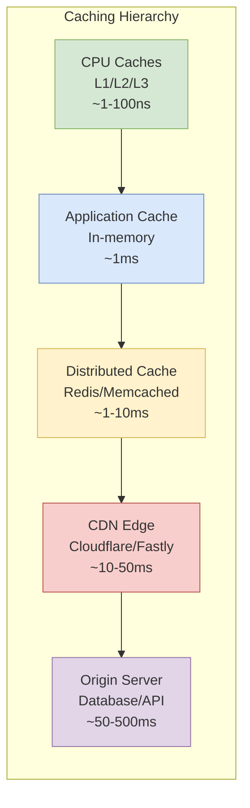

# Caching: From CPU to Distributed Systems

Explore caching fundamentals from CPU architectures to modern distributed systems, covering algorithms, mathematical principles, and practical implementations for building performant, scalable applications.

<figure>

<figcaption>The caching hierarchy from CPU to origin server, showing typical latency at each layer</figcaption>

</figure>

## TLDR

**Caching** is a fundamental performance optimization technique that stores frequently accessed data in faster storage layers, exploiting the principle of locality to reduce latency and backend load across all levels of computing—from CPU registers to globally distributed CDNs.

### Core Principles

- **Temporal Locality**: Recently accessed data is likely to be accessed again soon
- **Spatial Locality**: Data near recently accessed locations is likely to be accessed soon
- **Memory Hierarchy**: Trade-offs between speed, size, and cost create natural caching tiers
- **Cache Hit Ratio**: The primary metric for cache effectiveness; even small improvements yield significant performance gains

### Web Caching Fundamentals

- **Browser Cache**: Private cache for static assets; controlled via `Cache-Control` and `ETag` headers
- **Proxy Caches**: Shared caches (forward proxies, reverse proxies like Varnish/Nginx) serving multiple users
- **CDNs**: Geographically distributed edge caches minimizing latency for global users
- **HTTP Freshness**: `max-age`, `Expires` headers determine cache validity
- **HTTP Validation**: `ETag`/`If-None-Match` and `Last-Modified`/`If-Modified-Since` for conditional requests

### Cache Strategies

- **Write-Through**: Write to cache and database simultaneously (strong consistency, higher latency)
- **Write-Back**: Write to cache first, persist later (low latency, eventual consistency)
- **Write-Around**: Bypass cache for writes (prevents pollution from write-heavy workloads)
- **TTL-Based Invalidation**: Automatic expiration after specified time
- **Event-Driven Invalidation**: Invalidate on data change events

### Replacement Algorithms

- **FIFO**: Simple, no hit overhead, but ignores access patterns
- **LRU**: Exploits temporal locality, vulnerable to scan pollution
- **LFU**: Retains frequently accessed items, but struggles with changing popularity
- **2Q/ARC**: Scan-resistant algorithms that filter one-time accesses
- **Clock/CLOCK-Pro**: Low-overhead approximations used in operating systems

### Distributed Caching

- **Consistent Hashing**: Enables adding/removing nodes with minimal key redistribution
- **Memcached**: Simple, multi-threaded, client-side distribution; pure volatile cache
- **Redis**: Rich data structures, server-side clustering, persistence options; versatile data store
- **Replication**: Read replicas for availability; cross-region replication for disaster recovery

### Modern Architecture Patterns

- **API Gateway Caching**: Per-route caching with cache keys from URL, query params, and headers
- **Microservices Caching**: In-process, distributed, or sidecar topologies; each with trade-offs
- **Serverless/Edge**: Execution environment reuse, centralized caches, and upstream caching to handle stateless compute
- **Proactive Cache Warming**: Pre-populate caches during deployment or based on predicted access patterns

## The Genesis and Principles of Caching

### The Processor-Memory Performance Gap

The story of caching begins with a fundamental architectural crisis in computer design. As CPU clock speeds increased exponentially (following what would become known as Moore's Law), memory access times failed to keep pace. While CPU operations were occurring in nanoseconds, accessing DRAM still took tens to hundreds of nanoseconds, creating a critical bottleneck known as the "memory wall."

The solution was elegant: introduce an intermediate layer of smaller, faster memory located closer to the processor core. This cache, built using Static Random Access Memory (SRAM), was significantly faster than DRAM but more expensive and less dense. The [IBM System/360 Model 85](https://en.wikipedia.org/wiki/IBM_System/360_Model_85), announced in 1968 and shipped in 1969, became the first commercially available computer with cache memory—IBM called it "high-speed buffer storage." Earlier systems like the [Atlas computer](https://en.wikipedia.org/wiki/Atlas_(computer)) (1962) pioneered memory hierarchy concepts that would inform cache design.

### The Principle of Locality

The effectiveness of hierarchical memory systems isn't accidental—it's predicated on the **principle of locality of reference**, which states that program access patterns are highly predictable. This principle manifests in two forms:

**Temporal Locality**: If a data item is accessed, there's a high probability it will be accessed again soon. Think of a variable inside a program loop.

**Spatial Locality**: If a memory location is accessed, nearby locations are likely to be accessed soon. This occurs with sequential instruction execution or array iteration.

Caches exploit both forms by keeping recently accessed items in fast memory and fetching data in contiguous blocks (cache lines) rather than individual words. As Hennessey and Patterson note in [Computer Architecture: A Quantitative Approach](https://dl.acm.org/doi/book/10.5555/1999263), the automatic management of multi-level memory hierarchies was first proposed by Kilburn et al. in 1962 and demonstrated with the Atlas computer.

### Evolution of CPU Cache Hierarchies

Modern processors employ sophisticated multi-level cache hierarchies:

- **L1 Cache**: Smallest and fastest, located directly on the processor core, typically split into instruction (I-cache) and data (D-cache)
- **L2 Cache**: Larger and slightly slower, often shared between core pairs
- **L3 Cache**: Even larger, shared among all cores on a die
- **Last-Level Cache (LLC)**: Sometimes implemented as L4 using different memory technologies

This hierarchical structure creates a gradient of memory with varying speed, size, and cost, all managed by hardware to present a unified memory model while optimizing for performance.

### From Hardware to the Web

The same fundamental problem—a performance gap between data consumer and source—re-emerged with the World Wide Web. Here, the "processor" was the client's browser, the "main memory" was a remote server, and "latency" was measured in hundreds of milliseconds of network round-trip time.

Early web caching solutions were conceptually identical to their hardware predecessors. Forward proxy servers intercepted web requests, cached responses locally, and served subsequent requests from cache. The evolution of HTTP headers provided a standardized language for coordinating caching behavior across the network.

## Foundational Concepts in Web Caching

### The Web Caching Hierarchy

Modern web applications rely on a cascade of caches, each optimized for specific purposes:

**Browser Cache (Private Cache)**: The cache closest to users, storing static assets like images, CSS, and JavaScript. As a private cache, it can store user-specific content but isn't shared between users.

**Proxy Caches (Shared Caches)**: Intermediary servers that cache responses shared among multiple users:

- **Forward Proxies**: Deployed on the client side (corporate/ISP networks)
- **Reverse Proxies**: Deployed on the server side (Varnish, Nginx)

**Content Delivery Networks (CDNs)**: Geographically distributed networks of reverse proxy servers that minimize latency for global users.

**Application and Database Caching**: Deep within the infrastructure, storing query results and application objects to reduce backend load.

### HTTP Caching Mechanics: Freshness and Validation

The coordination between cache layers is managed through HTTP protocol rules:

**Freshness**: Determines how long a cached response is considered valid:

- `Cache-Control: max-age=N`: Response is fresh for N seconds
- `Expires`: Legacy header specifying absolute expiration date

**Validation**: When a resource becomes stale, caches can validate it with the origin server:

- `ETag`/`If-None-Match`: Opaque string identifying resource version
- `Last-Modified`/`If-Modified-Since`: Timestamp-based validation

### Cache-Control Directives

The `Cache-Control` header provides fine-grained control over caching behavior:

- `public`: May be stored by any cache (default)
- `private`: Intended for single user, not shared caches
- `no-cache`: Must revalidate with origin before use
- `no-store`: Don't store any part of request/response
- `must-revalidate`: Must successfully revalidate when stale
- `s-maxage`: Max-age for shared caches only
- `stale-while-revalidate`: Serve stale content while revalidating in background

### Cache Writing and Invalidation Strategies

**Write Policies**:

- **Write-Through**: Write to both cache and database simultaneously (strong consistency, higher latency)
- **Write-Back**: Write to cache first, persist to database later (low latency, eventual consistency)
- **Write-Around**: Bypass cache, write directly to database (prevents cache pollution)

**Invalidation Strategies**:

- **Time-To-Live (TTL)**: Automatic expiration after specified time
- **Purge/Explicit Invalidation**: Manual removal via API calls
- **Event-Driven Invalidation**: Automatic invalidation based on data change events
- **Stale-While-Revalidate**: Serve stale content while updating in background

## Cache Replacement Algorithms

When a cache reaches capacity, it must decide which item to evict. This decision is governed by cache replacement algorithms, which have evolved from simple heuristics to sophisticated adaptive policies.

### Classical Replacement Policies

#### First-In, First-Out (FIFO)

**Principle**: Evict the item that has been in the cache longest, regardless of access patterns.

**Implementation**: Uses a queue data structure with O(1) operations for all core functions.

**Analysis**:

- **Advantages**: Extremely simple, no overhead on cache hits, highly scalable
- **Disadvantages**: Ignores access patterns, can evict popular items, suffers from [Bélády's Anomaly](https://en.wikipedia.org/wiki/B%C3%A9l%C3%A1dy's_anomaly)—where increasing cache size can paradoxically increase misses
- **Use Cases**: Workloads with no locality, streaming data, where simplicity is paramount

#### Least Recently Used (LRU)

**Principle**: Evict the item that hasn't been used for the longest time, assuming temporal locality.

**Implementation**: Combines hash map and doubly-linked list for O(1) operations.

**Analysis**:

- **Advantages**: Excellent general-purpose performance, good hit rates for most workloads
- **Disadvantages**: Vulnerable to [scan-based pollution](https://www.cs.cmu.edu/~natassa/courses/15-721/papers/p297-o_neil.pdf)—sequential table scans can evict all hot data. As Chou and DeWitt noted at VLDB, "LRU is unable to differentiate between pages that have relatively frequent reference and pages that have very infrequent reference"
- **Use Cases**: Operating system page caches, database buffers, browser caches

#### Least Frequently Used (LFU)

**Principle**: Evict the item accessed the fewest times, assuming frequency-based locality.

**Implementation**: Complex O(1) implementation using hash maps and frequency-based linked lists.

**Analysis**:

- **Advantages**: Retains long-term popular items, scan-resistant
- **Disadvantages**: Suffers from historical pollution, new items easily evicted
- **Use Cases**: CDN caching of stable, popular assets (logos, libraries)

### Advanced and Adaptive Replacement Policies

#### The Clock Algorithm (Second-Chance)

**Principle**: Low-overhead approximation of LRU using a circular buffer with reference bits.

**Implementation**: Each page has a reference bit. On access, bit is set to 1. During eviction, clock hand sweeps until finding a page with bit 0.

**Analysis**: Avoids expensive linked-list manipulations while approximating LRU behavior.

#### 2Q Algorithm

**Principle**: Explicitly designed to remedy LRU's vulnerability to scans by requiring items to prove their "hotness." The golden rule: "Just because a page is accessed once does not entitle it to stay in the buffer."

**Implementation**: Uses three data structures:

- `A1in`: Small FIFO queue for first-time accesses
- `A1out`: Ghost queue storing metadata of evicted items
- `Am`: Main LRU queue for "hot" items (accessed more than once)

**Analysis**: Excellent scan resistance by filtering one-time accesses. [PostgreSQL uses 2Q](https://arpitbhayani.me/blogs/2q-cache/) as its buffer cache management algorithm. MySQL InnoDB uses a similar approach, splitting its buffer pool into young (5/8) and old (3/8) sublists.

#### Adaptive Replacement Cache (ARC)

**Principle**: Self-tuning policy that [dynamically balances recency and frequency](https://www.usenix.org/conference/fast-03/arc-self-tuning-low-overhead-replacement-cache), developed at IBM Almaden Research Center.

**Implementation**: Maintains four lists:

- `T1`: Recently seen once (recency)
- `T2`: Recently seen multiple times (frequency)
- `B1`: Ghost list of recently evicted from T1
- `B2`: Ghost list of recently evicted from T2

**Analysis**: Adapts online to workload characteristics without manual tuning. Deployed in IBM's DS6000/DS8000 storage controllers. Sun's ZFS uses an ARC variant as its filesystem cache.

#### Low Inter-reference Recency Set (LIRS)

**Principle**: Uses Inter-Reference Recency (IRR) to distinguish "hot" from "cold" blocks. [Introduced at SIGMETRICS 2002](https://dl.acm.org/doi/10.1145/511399.511340) by Jiang and Zhang.

**Implementation**: Categorizes blocks into LIR (low IRR, hot) and HIR (high IRR, cold) sets. The LIR partition holds the majority of cache space for frequently accessed data.

**Analysis**: More accurate locality prediction than LRU, extremely scan-resistant. Deployed in MySQL (since 5.1), Infinispan, and Apache Jackrabbit. An approximation (CLOCK-Pro) is used in NetBSD.

## Distributed Caching Systems

### The Need for Distributed Caching

Single-server caches are constrained by available RAM and CPU capacity. Distributed caching addresses this by creating clusters that provide:

- **Scalability**: Terabytes of cache capacity across multiple nodes
- **Performance**: Millions of operations per second across the cluster
- **Availability**: Fault tolerance through replication and redundancy

### Consistent Hashing: The Architectural Cornerstone

The critical challenge in distributed caching is determining which node stores a particular key. Simple modulo hashing (`hash(key) % N`) is fundamentally flawed for dynamic environments—adding or removing a server would remap nearly every key.

**Consistent Hashing Solution** ([Karger et al., 1997](https://www.cs.princeton.edu/courses/archive/fall09/cos518/papers/chash.pdf)):

- Maps both servers and keys onto a large conceptual circle (hash ring)
- Keys are assigned to the first server encountered clockwise from their position
- Adding/removing servers affects only a small fraction of keys (~n/m items moved, where n is total items and m is nodes)
- Virtual nodes (100-200 per physical node) smooth out distribution and ensure balanced load

### System Deep Dive: Memcached vs Redis

**[Memcached](https://memcached.org/)**:

- **Architecture**: Shared-nothing, client-side distribution
- **Data Model**: Simple key-value store
- **Threading**: Multi-threaded, efficiently utilizes multiple CPU cores for concurrent operations
- **Use Case**: Pure, volatile cache for transient data

**[Redis](https://redis.io/documentation)**:

- **Architecture**: Server-side clustering with built-in replication
- **Data Model**: Rich data structures (strings, lists, sets, hashes, sorted sets, streams)
- **Threading**: Single-threaded for command execution (ensures atomicity), with multi-threaded I/O in recent versions. Event-driven model handles ~100K ops/sec per thread without pipelining, ~500K with pipelining
- **Use Case**: Versatile in-memory data store, message broker, queue

**Key Differences**:

- Memcached embodies Unix philosophy (do one thing well)
- Redis provides "batteries-included" solution with rich features
- Choice depends on architectural fit and specific requirements

## Caching in Modern Application Architectures

### Content Delivery Networks (CDNs): Caching at the Global Edge

CDNs represent the outermost layer of web caching, purpose-built to solve global latency problems:

**Architecture**: Global network of Points of Presence (PoPs) using Anycast routing to direct users to the nearest edge location.

**Content Handling**:

- **Static Content**: Exceptionally effective with long TTLs
- **Dynamic Content**: Challenging but possible through short TTLs, Edge Side Includes (ESI), and intelligent routing

**Advanced Techniques**:

- **Tiered Caching**: Regional hubs funnel requests from edge servers
- **Cache Reserve**: Persistent object stores for extended caching
- **Edge Compute**: Running code directly on edge servers for custom logic

### API Gateway Caching

API Gateways serve as unified entry points that can act as powerful caching layers:

**Implementation**: Configured per-route, constructs cache keys from URL path, query parameters, and headers.

**GraphQL Challenges**: All queries sent to single endpoint, requiring sophisticated caching:

- Normalize and hash GraphQL queries
- Use globally unique object identifiers
- Implement client-side normalized caches

### Caching Patterns in Microservices

In microservices architectures, caching becomes critical for resilience and loose coupling:

**Caching Topologies**:

- **In-Process Cache**: Fastest but leads to data duplication
- **Distributed Cache**: Shared across instances, network overhead
- **Sidecar Cache**: Proxy alongside each service instance

**Case Study: [Netflix EVCache](https://netflixtechblog.com/announcing-evcache-distributed-in-memory-datastore-for-cloud-c26a698c27f7)**: Sophisticated asynchronous replication system ensuring global availability while tolerating entire region failures.

### Caching in Serverless and Edge Computing

Serverless platforms introduce unique challenges due to stateless, ephemeral nature:

**Cold Start Problem**: New instances incur initialization latency.

**Strategies**:

- **Execution Environment Reuse**: Leverage warm instances for caching
- **Centralized Cache**: External cache shared across all instances
- **Upstream Caching**: Prevent requests from hitting functions entirely

**Edge Computing**: Moving computation to CDN edge, blurring lines between caching and application logic.

## The Future of Caching

### Emerging Trends

#### Proactive Caching and Cache Warming

Moving from reactive to predictive models:

- **Manual Preloading**: Scripts populate cache during deployment
- **Predictive Loading**: Historical analytics predict future needs
- **Event-Driven Warming**: Events trigger cache population
- **GraphQL Query Plan Warming**: Pre-compute execution plans

#### Intelligent Caching: ML/DL-driven Policies

The evolution from human-designed heuristics to learned policies:

**Approaches**:

- **Supervised Learning**: Train models to mimic optimal offline algorithms
- **Reinforcement Learning**: Frame caching as Markov Decision Process
- **Sequence Modeling**: Use LSTM/GNN for predicting content popularity

**Challenges**: Computational overhead, large datasets, integration complexity

### Open Research Problems

#### Caching Encrypted Content

The fundamental conflict between security (end-to-end encryption) and performance (intermediate caching). Future solutions may involve:

- Privacy-preserving caching protocols
- Radical re-architecture pushing caching to endpoints

#### Hardware and Network Co-design

Tight integration of caching with 5G/6G networks:

- Caching at cellular base stations ("femtocaching")
- Cloud Radio Access Networks (C-RAN)
- Cross-layer optimization problems

#### The Economics of Caching

As caching becomes an economic decision:

- Pricing models for commercial services
- Game theory mechanisms for cooperation
- Resource sharing incentives

#### Federated Learning and Edge AI

New challenges in decentralized ML:

- Efficient model update aggregation
- Caching model parameters at edge servers
- Communication optimization

## Conclusion

The journey of caching from hardware-level innovation to cornerstone of the global internet illustrates a recurring theme in computer science: the relentless pursuit of performance through fundamental principles. The processor-memory gap of the 1960s finds its modern analogue in network latency, and the solution remains the same—introducing a proximate, high-speed storage layer that exploits locality of reference.

As we look to the future, caching continues to evolve. The shift from reactive to proactive systems, the integration of machine learning, and the challenges posed by new security and network paradigms will shape the next generation of caching technologies. However, the core principles—understanding access patterns, managing the trade-offs between performance and consistency, and designing for the specific characteristics of your workload—will remain fundamental to building performant, scalable systems.

Caching is more than an optimization technique; it's a fundamental design pattern for managing latency and data distribution in complex systems. As new performance bottlenecks emerge in future technologies, from quantum computing to interplanetary networks, the principles of caching will undoubtedly be rediscovered and reapplied, continuing their vital legacy in the evolution of computing.

## References

### Foundational Papers

- [Consistent Hashing and Random Trees - Karger et al., 1997](https://www.cs.princeton.edu/courses/archive/fall09/cos518/papers/chash.pdf) - The original consistent hashing paper from MIT
- [ARC: A Self-Tuning, Low Overhead Replacement Cache - FAST 2003](https://www.usenix.org/conference/fast-03/arc-self-tuning-low-overhead-replacement-cache) - IBM's adaptive replacement cache algorithm
- [LIRS: Low Inter-reference Recency Set - SIGMETRICS 2002](https://dl.acm.org/doi/10.1145/511399.511340) - Scan-resistant cache replacement policy
- [The LRU-K Page Replacement Algorithm - O'Neil et al.](https://www.cs.cmu.edu/~natassa/courses/15-721/papers/p297-o_neil.pdf) - Database disk buffering and scan pollution analysis

### Cache Systems Documentation

- [Redis Documentation](https://redis.io/documentation) - In-memory data structure store
- [Memcached Wiki](https://memcached.org/) - Distributed memory caching system
- [Netflix EVCache](https://netflixtechblog.com/announcing-evcache-distributed-in-memory-datastore-for-cloud-c26a698c27f7) - Netflix's distributed caching layer

### Web Caching

- [HTTP Caching - MDN Web Docs](https://developer.mozilla.org/en-US/docs/Web/HTTP/Caching) - Comprehensive HTTP caching tutorial
- [Cache-Control Header - MDN](https://developer.mozilla.org/en-US/docs/Web/HTTP/Headers/Cache-Control) - HTTP header reference

### Historical Context

- [IBM System/360 Model 85 - Wikipedia](https://en.wikipedia.org/wiki/IBM_System/360_Model_85) - First commercial computer with cache memory
- [Atlas Computer - Wikipedia](https://en.wikipedia.org/wiki/Atlas_(computer)) - Pioneer of memory hierarchy concepts
- [Bélády's Anomaly - Wikipedia](https://en.wikipedia.org/wiki/B%C3%A9l%C3%A1dy's_anomaly) - FIFO cache anomaly explanation

### Additional Resources

- [Top Caching Strategies - ByteByteGo](https://blog.bytebytego.com/p/top-caching-strategies) - Visual guide to caching strategies
- [MySQL InnoDB Buffer Pool](https://dev.mysql.com/doc/refman/8.0/en/innodb-buffer-pool.html) - MySQL's scan-resistant LRU implementation
- [2Q Algorithm Explained](https://arpitbhayani.me/blogs/2q-cache/) - Addressing LRU's sub-optimality
