# LRU Cache and Modern Alternatives

Learn the classic LRU cache implementation, understand its limitations, and explore modern alternatives like LRU-K, 2Q, and ARC for building high-performance caching systems.

<figure>


<figcaption>Evolution of cache replacement algorithms from basic LRU to self-tuning ARC</figcaption>

</figure>

## TLDR

**Least Recently Used (LRU)** is a fundamental cache eviction policy that removes the least recently accessed item when the cache is full, based on the principle of temporal locality. While effective for simple workloads, LRU suffers from cache pollution during sequential scans, leading to the development of more sophisticated algorithms.

### Core Concepts

- **LRU Implementation**: Combines a hash map (O(1) lookup) with a doubly linked list (O(1) insertion/deletion) to achieve constant-time `get` and `put` operations
- **Temporal Locality**: The principle that recently accessed data is likely to be accessed again soon, which LRU exploits effectively
- **Cache Pollution**: Sequential scans can evict valuable "hot" data by filling the cache with single-use "cold" data, systematically degrading performance
- **JavaScript Map Shortcut**: ES2015 Map objects maintain insertion order, enabling simple LRU implementations without explicit linked lists

### Algorithm Comparison

- **LRU (Least Recently Used)**: Simple, O(1) operations, but vulnerable to scan pollution. Best for workloads with strong temporal locality
- **LRU-K**: Tracks last K accesses per item, evicts based on K-th reference time. Scan-resistant but requires tuning K parameter and has higher complexity
- **2Q (Two Queue)**: Uses probationary FIFO queue + main LRU cache. Simple O(1) operations with excellent scan resistance, chosen by PostgreSQL
- **ARC (Adaptive Replacement Cache)**: Self-tuning algorithm that balances recency (T1) and frequency (T2) using ghost lists (B1, B2) for learning. Patented by IBM (US6996676B2)
- **CAR (Clock with Adaptive Replacement)**: Alternative to ARC with similar adaptive properties (note: IBM also filed a patent application for CAR)

### When to Use Each Algorithm

- **Use LRU** for: Web browsing, file systems, simple applications with strong temporal locality, educational purposes
- **Use LRU-K** for: Database buffer pools, mixed workloads with both sequential and random access patterns
- **Use 2Q** for: Production databases (PostgreSQL), scenarios requiring scan resistance without patent concerns
- **Use ARC** for: Systems where self-tuning is critical and patent licensing is acceptable, unpredictable workload patterns
- **Consider CAR** for: Projects needing ARC-like adaptivity (note: with ARC patent expired in 2024, ARC itself is now freely usable)

### Implementation Considerations

- **Memory Overhead**: LRU uses 2 pointers per entry; LRU-K adds K timestamps; 2Q requires multiple maps; ARC maintains 4 data structures (T1, T2, B1, B2)
- **Time Complexity Reality**: Naive implementations may be O(n) for eviction despite theoretical O(1) claims—use priority queues or careful data structure design
- **Concurrency**: Production systems require thread-safe implementations with appropriate locking or lock-free data structures
- **Approximated Algorithms**: Redis and Linux use approximated LRU (sampling-based) for better performance with acceptable accuracy trade-offs
- **Patent Considerations**: ARC patent (US6996676B2, granted 2006, **expired February 22, 2024**) historically caused PostgreSQL to switch from ARC in version 8.0.0 to 2Q in 8.0.2, then to clock sweep in 8.1

### Real-World Usage

- **PostgreSQL**: Uses clock sweep algorithm for buffer management since version 8.1 (briefly used ARC in 8.0.0, then 2Q in 8.0.2 due to patent concerns)
- **Redis**: Uses approximated LRU with random sampling for cache eviction
- **Linux Kernel**: Page cache historically used a two-list active/inactive approach; modern kernels (6.1+) support Multi-Generational LRU (MGLRU) for improved performance (some distros backported MGLRU patches to 5.18)
- **Memcached**: Implements LRU with slab allocator for memory efficiency
- **CDNs**: Often use LRU variants with size-aware eviction for content delivery

## The Classic: Understanding LRU

The **Least Recently Used (LRU)** cache is one of the most fundamental and widely-used caching algorithms. The principle is simple and intuitive: when the cache is full, evict the item that has been accessed the least recently. This is based on the principle of **temporal locality**—the observation that data you've used recently is likely to be needed again soon.

LRU operates on the assumption that recently accessed items are more likely to be accessed again in the near future. This makes it particularly effective for workloads with strong temporal locality, such as web browsing, file system access, and many database operations.

## LRU Implementation: O(1) Magic

To be effective, a cache needs to be fast. The two core operations, `get` (retrieving an item) and `put` (adding or updating an item), must be executed in constant time, or O(1). A naive implementation using just an array would require a linear scan (O(n)) to find the least recently used item, which is far too slow.

The classic, high-performance LRU solution combines two data structures:

- **A Hash Map**: This provides the O(1) lookup. The map stores a key that points directly to a node in a linked list.
- **A Doubly Linked List (DLL)**: This maintains the usage order. The head of the list is the Most Recently Used (MRU) item, and the tail is the Least Recently Used (LRU) item.

When an item is accessed (`get`) or added (`put`), it's moved to the head of the DLL. When the cache is full, the item at the tail is evicted. This combination gives both operations the desired O(1) time complexity.

```mermaid
graph LR
    %% Hashmap section
    subgraph HashMap ["Hashmap for O(1) access"]
        K1["K1"]
        K2["K2"]
        K3["K3"]
        K4["K4"]
        K5["K5"]
    end

    %% Doubly linked list section
    subgraph DLL ["Doubly Linked List for Order"]
        N1["N1<br/>Key: K1<br/>Value: V1"]
        N2["N2<br/>Key: K2<br/>Value: V2"]
        N3["N3<br/>Key: K3<br/>Value: V3"]
        N4["N4<br/>Key: K4<br/>Value: V4"]
        N5["N5<br/>Key: K5<br/>Value: V5"]
    end

    %% Connections from hashmap to nodes
    K1 --> N1
    K2 --> N2
    K3 --> N3
    K4 --> N4
    K5 --> N5

    %% Doubly linked list connections
    N1 <--> N2
    N2 <--> N3
    N3 <--> N4
    N4 <--> N5

    %% Head and Tail pointers
    Head["Head"] --> N1
    Tail["Tail"] --> N5

    %% Styling
    classDef hashmapStyle fill:#dae8fc,stroke:#6c8ebf,stroke-width:2px
    classDef nodeStyle fill:#fff2cc,stroke:#d6b656,stroke-width:2px
    classDef pointerStyle fill:#f8cecc,stroke:#b85450,stroke-width:2px

    class K1,K2,K3,K4,K5 hashmapStyle
    class N1,N2,N3,N4,N5 nodeStyle
    class Head,Tail pointerStyle
```

<figure>



<figcaption>LRU Data Structure - hashmap with Doubly linked list</figcaption>
</figure>

### Implementation 1: Utilizing JavaScript Map's Insertion Order

```ts collapse={1-9}
class LRUCache<K, V> {
  capacity: number
  cache: Map<K, V>

  constructor(capacity: number) {
    this.capacity = capacity
    this.cache = new Map()
  }

  get(key: K): V | null {
    if (!this.cache.has(key)) {
      return null
    } else {
      const value = this.cache.get(key)!
      // Remove and re-insert to move to end (most recently used)
      this.cache.delete(key)
      this.cache.set(key, value)
      return value
    }
  }

  put(key: K, value: V): void {
    if (this.cache.has(key)) {
      // Update existing key - remove and re-insert
      this.cache.delete(key)
    } else if (this.cache.size >= this.capacity) {
      // Remove least recently used (first key in Map)
      const keyToRemove = this.cache.keys().next().value
      this.cache.delete(keyToRemove)
    }
    this.cache.set(key, value)
  }
}
```

### Implementation 2: Classic Doubly Linked List & Hash Map

```ts collapse={46-106}
class LRUCache {
  capacity: number
  cache: Map<number, ListNode>
  list: DoublyLinkedList

  constructor(capacity: number) {
    this.capacity = capacity
    this.cache = new Map()
    this.list = new DoublyLinkedList()
  }

  get(key: number): number {
    if (!this.cache.has(key)) {
      return -1
    } else {
      const node = this.cache.get(key)!
      // Move to head (most recently used)
      this.list.removeNode(node)
      this.list.addToHead(node)
      return node.value
    }
  }

  put(key: number, value: number): void {
    if (this.cache.has(key)) {
      // Update existing key
      const node = this.cache.get(key)!
      node.value = value
      this.list.removeNode(node)
      this.list.addToHead(node)
    } else {
      if (this.cache.size >= this.capacity) {
        // Remove least recently used (tail)
        const removed = this.list.removeTail()
        if (removed) {
          this.cache.delete(removed.key)
        }
      }
      const node = new ListNode(key, value)
      this.list.addToHead(node)
      this.cache.set(key, node)
    }
  }
}

class ListNode {
  key: number
  value: number
  prev: ListNode | null
  next: ListNode | null

  constructor(key: number, value: number) {
    this.key = key
    this.value = value
    this.prev = null
    this.next = null
  }
}

class DoublyLinkedList {
  head: ListNode | null
  tail: ListNode | null

  constructor() {
    this.head = null
    this.tail = null
  }

  addToHead(node: ListNode): void {
    node.next = this.head
    if (this.head) {
      this.head.prev = node
    }
    this.head = node
    if (!this.tail) {
      this.tail = node
    }
  }

  removeNode(node: ListNode): void {
    if (node === this.head) {
      this.head = node.next
    } else if (node === this.tail) {
      this.tail = node.prev
    } else {
      if (node.prev) node.prev.next = node.next
      if (node.next) node.next.prev = node.prev
    }
  }

  removeTail(): ListNode | null {
    if (this.tail) {
      const removed = this.tail
      if (this.head === this.tail) {
        this.head = null
        this.tail = null
      } else {
        this.tail = this.tail.prev
        if (this.tail) {
          this.tail.next = null
        }
      }
      return removed
    }
    return null
  }
}
```

## When LRU Fails: The Achilles' Heel

LRU's greatest strength is its simplicity, but this is also its greatest weakness. It equates "most recently used" with "most important," an assumption that breaks down catastrophically under a common workload: the **sequential scan**.

Imagine a database performing a full table scan or an application looping over a large dataset that doesn't fit in memory. As each new, single-use item is accessed, LRU dutifully places it at the front of the cache, evicting a potentially valuable, frequently-used item from the tail. This process, known as **cache pollution**, systematically flushes the cache of its "hot" data and fills it with "cold" data that will never be used again.

Once the scan is over, the cache is useless, and the application suffers a storm of misses as it tries to reload its true working set. This fundamental flaw is the primary driver behind the evolution of more advanced algorithms.

### Common LRU Failure Scenarios:

1. **Database Full Table Scans**: Large analytics queries that touch every row
2. **File System Traversals**: Walking through directory structures
3. **Batch Processing**: Processing large datasets sequentially
4. **Memory-Mapped File Access**: Sequential reading of large files

## Beyond LRU: Modern Alternatives

To overcome LRU's weaknesses, computer scientists developed policies that incorporate more information than just recency. These algorithms aim to be scan-resistant while retaining low overhead.

### LRU-K: Adding Frequency Memory

LRU-K extends the classic LRU by tracking the timestamps of the last K accesses for each item. The eviction decision is based on the K-th most recent access time, providing better resistance to cache pollution.

**How it Works**: An item is considered "hot" and worth keeping only if it has been accessed at least K times. This allows the algorithm to distinguish between items with a proven history of use and single-use items from a scan.

**Key Advantages**:

- **Scan Resistance**: Items in a sequential scan are typically accessed only once and are evicted quickly
- **Frequency Awareness**: Distinguishes between truly popular items and recently accessed ones
- **Backward Compatibility**: LRU-1 is equivalent to classic LRU

**Trade-offs**: The choice of K is critical and workload-dependent. If K is too large, legitimate items might be evicted before they are accessed K times; if it's too small, the algorithm degenerates back to LRU.

```ts collapse={1-10, 45-74}
class LRUKCache {
  capacity: number
  k: number
  cache: Map<number, { value: number; accessTimes: number[] }>

  constructor(capacity: number, k: number = 2) {
    this.capacity = capacity
    this.k = k
    this.cache = new Map()
  }

  get(key: number): number {
    if (!this.cache.has(key)) {
      return -1
    }

    const item = this.cache.get(key)!
    const now = Date.now()

    // Add current access time
    item.accessTimes.push(now)

    // Keep only the last K access times
    if (item.accessTimes.length > this.k) {
      item.accessTimes.shift()
    }

    return item.value
  }

  put(key: number, value: number): void {
    const now = Date.now()

    if (this.cache.has(key)) {
      const item = this.cache.get(key)!
      item.value = value
      item.accessTimes.push(now)
      if (item.accessTimes.length > this.k) {
        item.accessTimes.shift()
      }
    } else {
      if (this.cache.size >= this.capacity) {
        this.evictLRU()
      }
      this.cache.set(key, { value, accessTimes: [now] })
    }
  }

  private evictLRU(): void {
    let oldestTime = Infinity
    let keyToEvict = -1

    for (const [key, item] of this.cache) {
      if (item.accessTimes.length < this.k) {
        // Items with fewer than K accesses are evicted first
        if (item.accessTimes[0] < oldestTime) {
          oldestTime = item.accessTimes[0]
          keyToEvict = key
        }
      } else {
        // For items with K+ accesses, use K-th most recent access
        const kthAccess = item.accessTimes[item.accessTimes.length - this.k]
        if (kthAccess < oldestTime) {
          oldestTime = kthAccess
          keyToEvict = key
        }
      }
    }

    if (keyToEvict !== -1) {
      this.cache.delete(keyToEvict)
    }
  }
}
```

**Time Complexity Note**: The implementation above has O(n) time complexity for eviction due to the linear scan through all cache entries in `evictLRU()`. For true O(1) operations, you would need:

- **Min-Heap Approach**: Use a min-heap ordered by K-th access time, achieving O(log n) eviction
- **Approximation Approach**: Sample random entries instead of scanning all (trading accuracy for speed)
- **Hybrid Approach**: Maintain sorted structure with periodic rebalancing

In practice, the O(n) eviction complexity is acceptable for small to medium cache sizes (< 10,000 entries), and the simpler implementation reduces bugs and maintenance overhead. For larger caches, production systems typically use approximated LRU-K with sampling.

### 2Q: The Probationary Filter

The 2Q (Two Queue) algorithm provides similar scan resistance to LRU-K but with a simpler, constant-time implementation. It acts like a bouncer, only letting items into the main cache after they've proven their worth.

**How it Works**: 2Q uses two buffers:

- **A1 (Probationary Queue)**: FIFO queue for first-time accesses
- **Am (Main Cache)**: LRU cache for proven items

When an item is accessed for the first time, it's placed in the A1 probationary queue. If it's accessed again while in A1, it gets promoted to the main Am cache. If it's never re-referenced, it simply falls off the end of the A1 queue without ever polluting the main cache.

**Key Advantages**:

- **Simple O(1) Operations**: Avoids the complexity of LRU-K
- **Effective Filtering**: Prevents scan pollution effectively
- **Tunable**: Queue sizes can be adjusted based on workload

```ts collapse={1-18, 70-85}
class TwoQueueCache {
  capacity: number
  a1Size: number
  amSize: number

  // A1: probationary queue (FIFO) - uses Map insertion order
  a1: Map<number, number>

  // Am: main cache (LRU) - uses Map insertion order with re-insertion on access
  am: Map<number, number>

  constructor(capacity: number) {
    this.capacity = capacity
    this.a1Size = Math.floor(capacity * 0.25) // 25% for probationary
    this.amSize = capacity - this.a1Size
    this.a1 = new Map()
    this.am = new Map()
  }

  get(key: number): number {
    // Check main cache first (LRU: re-insert to move to end)
    if (this.am.has(key)) {
      const value = this.am.get(key)!
      this.am.delete(key)
      this.am.set(key, value)
      return value
    }

    // Check probationary queue
    if (this.a1.has(key)) {
      const value = this.a1.get(key)!
      // Promote to main cache
      this.a1.delete(key)
      this.am.set(key, value)

      // Ensure main cache doesn't exceed capacity
      if (this.am.size > this.amSize) {
        this.evictFromAm()
      }

      return value
    }

    return -1
  }

  put(key: number, value: number): void {
    // If already in main cache, update (LRU: re-insert)
    if (this.am.has(key)) {
      this.am.delete(key)
      this.am.set(key, value)
      return
    }

    // If in probationary queue, promote to main cache
    if (this.a1.has(key)) {
      this.a1.delete(key)
      this.am.set(key, value)

      if (this.am.size > this.amSize) {
        this.evictFromAm()
      }
      return
    }

    // New item goes to probationary queue (FIFO)
    this.a1.set(key, value)

    if (this.a1.size > this.a1Size) {
      this.evictFromA1()
    }
  }

  private evictFromA1(): void {
    // Remove oldest item from A1 (FIFO - first key in Map)
    const oldestKey = this.a1.keys().next().value
    if (oldestKey !== undefined) {
      this.a1.delete(oldestKey)
    }
  }

  private evictFromAm(): void {
    // Remove least recently used from Am (LRU - first key in Map)
    const oldestKey = this.am.keys().next().value
    if (oldestKey !== undefined) {
      this.am.delete(oldestKey)
    }
  }
}
```

> **Implementation Note**: This implementation achieves true O(1) operations by leveraging JavaScript Map's guaranteed insertion order (ES2015+). The A1 queue uses FIFO semantics (oldest = first inserted = first key), while Am uses LRU semantics (re-insert on access moves to end, evict from beginning).

### ARC: Self-Tuning Intelligence

The Adaptive Replacement Cache (ARC) represents a major leap forward. It is a self-tuning algorithm that dynamically balances between recency (like LRU) and frequency (like LFU) based on the current workload, eliminating the need for manual tuning.

**How it Works**: ARC maintains two LRU lists of items that are actually in the cache:

- **T1**: Pages seen only once recently (prioritizing recency)
- **T2**: Pages seen at least twice recently (prioritizing frequency)

**The "Ghost List" Innovation**: The key to ARC's adaptiveness is its use of two additional "ghost lists" (B1 and B2) that store only the keys of recently evicted items from T1 and T2, respectively. These lists act as a short-term memory of eviction decisions.

**The Learning Rule**: If a requested item is not in the cache but is found on the B1 ghost list, it means ARC made a mistake by evicting a recently-seen item. It learns from this and increases the size of the T1 (recency) cache. Conversely, a hit on the B2 ghost list signals that a frequently-used item was wrongly evicted, so ARC increases the size of the T2 (frequency) cache.

This constant feedback loop allows ARC to learn from its mistakes and dynamically adapt its strategy to the workload in real-time.

**Patent History and Industry Impact**: ARC was developed by Nimrod Megiddo and Dharmendra S. Modha at IBM Almaden Research Center. IBM was granted U.S. Patent 6,996,676 on February 7, 2006, which covers the adaptive replacement cache policy. **The patent expired on February 22, 2024**, making ARC now freely usable.

This patent had significant historical implications for the open-source community:

- **PostgreSQL**: Briefly used ARC in version 8.0.0 as its buffer management algorithm due to excellent performance characteristics. Upon learning of IBM's patent, PostgreSQL switched to the 2Q algorithm in version 8.0.2 (April 2005). Subsequently, PostgreSQL 8.1 introduced the clock sweep algorithm, which remains in use today due to its superior concurrency characteristics.
- **Alternative Algorithms**: The patent concerns led to increased adoption of algorithms like 2Q and the development of CAR (Clock with Adaptive Replacement). Note that IBM also filed a patent application for CAR (US20060069876A1).
- **Current Status**: With the ARC patent expired as of February 2024, projects can now freely implement ARC without licensing concerns.

**Key Advantages**:

- **No Manual Tuning**: Unlike LRU-K (choose K) or 2Q (choose queue sizes), ARC automatically adapts
- **Handles Mixed Workloads**: Dynamically balances between scan-heavy and access-pattern workloads
- **Ghost Lists**: Learn from eviction mistakes without keeping full data in memory
- **Self-Optimization**: Adjusts to workload changes in real-time

**Trade-offs**:

- **Historical Patent Restrictions**: The ARC patent expired February 22, 2024, so this is no longer a concern
- **Memory Overhead**: Maintains 4 data structures (T1, T2, B1, B2) plus adaptation parameter
- **Complexity**: More complex to implement and debug than simpler algorithms

```ts collapse={1-21, 68-137}
class ARCCache {
  capacity: number
  p: number // Adaptation parameter

  // Main cache lists
  t1: Map<number, { value: number; timestamp: number }> // Recently accessed once
  t2: Map<number, { value: number; timestamp: number }> // Recently accessed multiple times

  // Ghost lists (keys only)
  b1: Set<number> // Recently evicted from T1
  b2: Set<number> // Recently evicted from T2

  constructor(capacity: number) {
    this.capacity = capacity
    this.p = 0
    this.t1 = new Map()
    this.t2 = new Map()
    this.b1 = new Set()
    this.b2 = new Set()
  }

  get(key: number): number {
    // Check T1
    if (this.t1.has(key)) {
      const item = this.t1.get(key)!
      this.t1.delete(key)
      this.t2.set(key, { value: item.value, timestamp: Date.now() })
      return item.value
    }

    // Check T2
    if (this.t2.has(key)) {
      const item = this.t2.get(key)!
      item.timestamp = Date.now()
      return item.value
    }

    // Check ghost lists for adaptation
    if (this.b1.has(key)) {
      this.adapt(true) // Increase T1 size
      this.b1.delete(key)
    } else if (this.b2.has(key)) {
      this.adapt(false) // Increase T2 size
      this.b2.delete(key)
    }

    return -1
  }

  put(key: number, value: number): void {
    // If already in cache, update
    if (this.t1.has(key)) {
      const item = this.t1.get(key)!
      this.t1.delete(key)
      this.t2.set(key, { value, timestamp: Date.now() })
      return
    }

    if (this.t2.has(key)) {
      this.t2.set(key, { value, timestamp: Date.now() })
      return
    }

    // New item goes to T1
    this.t1.set(key, { value, timestamp: Date.now() })

    // Ensure capacity constraints
    this.ensureCapacity()
  }

  private adapt(increaseT1: boolean): void {
    if (increaseT1) {
      this.p = Math.min(this.p + 1, this.capacity)
    } else {
      this.p = Math.max(this.p - 1, 0)
    }
  }

  private ensureCapacity(): void {
    const totalSize = this.t1.size + this.t2.size

    if (totalSize <= this.capacity) {
      return
    }

    // Calculate target sizes
    const targetT1 = Math.min(this.p, this.capacity)
    const targetT2 = this.capacity - targetT1

    // Evict from T1 if needed
    while (this.t1.size > targetT1) {
      const oldestKey = this.getOldestKey(this.t1)
      if (oldestKey !== null) {
        const item = this.t1.get(oldestKey)!
        this.t1.delete(oldestKey)
        this.b1.add(oldestKey)

        // Limit ghost list size
        if (this.b1.size > this.capacity) {
          const firstKey = this.b1.values().next().value
          this.b1.delete(firstKey)
        }
      }
    }

    // Evict from T2 if needed
    while (this.t2.size > targetT2) {
      const oldestKey = this.getOldestKey(this.t2)
      if (oldestKey !== null) {
        const item = this.t2.get(oldestKey)!
        this.t2.delete(oldestKey)
        this.b2.add(oldestKey)

        // Limit ghost list size
        if (this.b2.size > this.capacity) {
          const firstKey = this.b2.values().next().value
          this.b2.delete(firstKey)
        }
      }
    }
  }

  private getOldestKey(map: Map<number, { value: number; timestamp: number }>): number | null {
    let oldestKey = null
    let oldestTime = Infinity

    for (const [key, item] of map) {
      if (item.timestamp < oldestTime) {
        oldestTime = item.timestamp
        oldestKey = key
      }
    }

    return oldestKey
  }
}
```

## Real-World Applications

The choice of algorithm has profound, practical implications across different domains.

| Aspect               | LRU              | LRU-K                           | 2Q                          | ARC                        |
| -------------------- | ---------------- | ------------------------------- | --------------------------- | -------------------------- |
| **Primary Criteria** | Recency          | K-th Recency (History)          | Recency + Second Hit Filter | Adaptive Recency/Frequency |
| **Scan Resistance**  | Poor             | Good (for K>1)                  | Very Good                   | Excellent                  |
| **Complexity**       | Low              | High                            | Moderate                    | Moderate-High              |
| **Time Complexity**  | O(1)             | O(n) naive, O(log n) with heap  | O(1)                        | O(1)                       |
| **Memory Overhead**  | 2 pointers/entry | K timestamps + 2 pointers/entry | 3 maps + metadata           | 4 structures + ghosts      |
| **Tuning**           | None             | Manual (parameter K)            | Manual (queue sizes)        | Automatic / Self-Tuning    |

### When to Use LRU

LRU is most effective for:

- **Web Browsing**: Recent pages are likely to be revisited
- **File System Access**: Recently accessed files are often accessed again
- **Simple Applications**: Where complexity is a concern
- **Workloads with Strong Temporal Locality**: When recent access predicts future access

### When to Consider Alternatives

Consider advanced algorithms when:

- **Database Systems**: Mix of OLTP and OLAP workloads
- **Large-Scale CDNs**: Need to retain popular content over viral content
- **Operating Systems**: Page replacement in memory management
- **High-Performance Systems**: Where cache efficiency is critical

### Memory Overhead Analysis

Understanding memory overhead is crucial for capacity planning in production systems. Here's a detailed breakdown:

**LRU Cache (Hash Map + Doubly Linked List)**:

- Hash map entry: ~24-32 bytes per entry (pointer + hash + metadata)
- DLL node: 2 pointers (prev, next) = 16 bytes on 64-bit systems
- Key + Value storage: Varies by data type
- **Total overhead per entry**: ~40-50 bytes + key/value size

**LRU-K Cache**:

- Everything from LRU, plus:
- K timestamps: 8 bytes × K (typically K=2, so 16 bytes)
- **Total overhead per entry**: ~56-66 bytes + key/value size
- For K=2: ~35% more memory than LRU

**2Q Cache**:

- Two separate maps (A1 and Am): 2× hash map overhead
- Metadata for tracking queue membership
- **Total overhead per entry**: ~60-80 bytes + key/value size
- Ghost entries (evicted keys) add minimal overhead (just key storage)

**ARC Cache**:

- Four data structures (T1, T2, B1, B2): 4× tracking overhead
- Ghost lists store only keys (no values): B1 + B2 can equal cache size
- Adaptation parameter: negligible
- **Total overhead per entry**: ~80-120 bytes + key/value size
- Ghost lists effectively double memory for metadata (keys only)

**Production Considerations**:

1. **For 10,000 entries with 64-byte values**:
   - LRU: ~1 MB overhead + 640 KB data = ~1.6 MB total
   - LRU-K: ~1.35 MB overhead + 640 KB data = ~2 MB total
   - 2Q: ~1.5 MB overhead + 640 KB data = ~2.1 MB total
   - ARC: ~2 MB overhead + 640 KB data = ~2.6 MB total

2. **Trade-off Decision**: The memory overhead difference (40-60%) is often acceptable for the performance benefits in systems with scan-heavy workloads

3. **Approximated Algorithms**: Production systems like Redis use approximated LRU with sampling to reduce memory overhead while maintaining acceptable eviction quality

## Approximated LRU: Production Optimizations

Real-world systems often use approximated LRU algorithms that trade perfect accuracy for better performance and lower memory overhead.

### Redis Approximated LRU

Redis doesn't use strict LRU. Instead, it samples a small number of keys and evicts the least recently used among the sampled keys.

**How it works**:

- Sample N random keys (configurable, default 5)
- Evict the key with the oldest access time among samples
- No linked list or complex data structures needed

**Benefits**:

- Constant memory overhead per key (just a timestamp)
- No pointer chasing (better cache locality)
- Faster eviction (no list manipulation)
- Good enough accuracy for most workloads (~95% as effective as true LRU)

**Configuration**:

```
maxmemory-policy allkeys-lru
maxmemory-samples 5  # Higher = more accurate, slower
```

### Linux Page Cache

The Linux kernel has evolved its page replacement strategy over time:

**Traditional Two-List Approach** (pre-5.18):

- **Active list**: Recently and frequently used pages
- **Inactive list**: Candidates for eviction
- Pages start on the inactive list and get promoted to active on re-reference

**Multi-Generational LRU (MGLRU)** (kernel 5.18+):

Modern kernels support MGLRU, which provides more accurate page aging:

- Multiple generations instead of just two lists
- Pages move from older to newer generations when accessed
- Better handling of diverse workloads
- Enabled by default in Fedora, Arch Linux, and other distributions

This provides scan resistance while improving upon the limitations of the simple two-list approach.

### When to Use Approximated LRU

- **Large caches** (millions of entries) where pointer overhead is significant
- **High throughput systems** where eviction speed matters more than perfect accuracy
- **Memory-constrained environments** where every byte counts
- **Read-heavy workloads** where eviction is infrequent but must be fast when it happens

## Concurrency and Thread Safety

Production cache implementations must handle concurrent access safely and efficiently.

### Concurrency Challenges

1. **Race Conditions**: Multiple threads accessing/evicting simultaneously
2. **Lock Contention**: Global locks create bottlenecks in high-concurrency scenarios
3. **Memory Visibility**: Cache modifications must be visible across threads
4. **Deadlocks**: Complex locking schemes can introduce deadlock risks

### Concurrent LRU Strategies

**1. Global Lock (Simplest)**:

```ts
class ConcurrentLRU<K, V> {
  private cache: LRUCache<K, V>
  private lock: Mutex

  async get(key: K): Promise<V | null> {
    await this.lock.acquire()
    try {
      return this.cache.get(key)
    } finally {
      this.lock.release()
    }
  }
}
```

- **Pros**: Simple, correct
- **Cons**: Serializes all operations, poor scalability

**2. Segmented/Sharded Locking**:

- Divide cache into N segments, each with its own lock
- Route keys to segments via hash(key) % N
- Operations on different segments can proceed concurrently
- **Used by**: Java's ConcurrentHashMap, Guava Cache

**3. Lock-Free Structures**:

- Use atomic operations (CAS) instead of locks
- Trickier to implement correctly
- Best performance for high-concurrency read-heavy workloads
- **Used by**: Caffeine cache (Java), some C++ implementations

**4. Read-Write Locks**:

- Allow multiple concurrent readers
- Exclusive lock for writers (evictions)
- Good when reads vastly outnumber writes

**Production Recommendation**: Use battle-tested libraries:

- **Node.js**: `lru-cache` npm package with size limits
- **Java**: Caffeine or Guava Cache with concurrency level tuning
- **Go**: `groupcache` for distributed caching
- **Rust**: `lru` crate with Mutex wrapper

## Performance Comparison

Here's a comprehensive benchmark to compare the performance characteristics of different algorithms:

```ts collapse={1-14, 26-51}
function benchmarkCache(cache: any, operations: Array<{ type: "get" | "put"; key: number; value?: number }>) {
  const start = performance.now()

  for (const op of operations) {
    if (op.type === "get") {
      cache.get(op.key)
    } else {
      cache.put(op.key, op.value!)
    }
  }

  const end = performance.now()
  return end - start
}

// Test different access patterns
const sequentialScan = Array.from({ length: 1000 }, (_, i) => ({ type: "put" as const, key: i, value: i }))
const randomAccess = Array.from({ length: 1000 }, () => ({
  type: "get" as const,
  key: Math.floor(Math.random() * 100),
}))
const mixedWorkload = [
  ...Array.from({ length: 500 }, (_, i) => ({ type: "put" as const, key: i, value: i })),
  ...Array.from({ length: 500 }, () => ({ type: "get" as const, key: Math.floor(Math.random() * 50) })),
]

// Test different algorithms
const lru = new LRUCache(100)
const lruK = new LRUKCache(100, 2)
const twoQ = new TwoQueueCache(100)
const arc = new ARCCache(100)

console.log("=== Cache Performance Benchmark ===")
console.log("\nSequential Scan Performance (Cache Pollution Test):")
console.log(`LRU: ${benchmarkCache(lru, sequentialScan)}ms`)
console.log(`LRU-K: ${benchmarkCache(lruK, sequentialScan)}ms`)
console.log(`2Q: ${benchmarkCache(twoQ, sequentialScan)}ms`)
console.log(`ARC: ${benchmarkCache(arc, sequentialScan)}ms`)

console.log("\nRandom Access Performance (Temporal Locality Test):")
console.log(`LRU: ${benchmarkCache(lru, randomAccess)}ms`)
console.log(`LRU-K: ${benchmarkCache(lruK, randomAccess)}ms`)
console.log(`2Q: ${benchmarkCache(twoQ, randomAccess)}ms`)
console.log(`ARC: ${benchmarkCache(arc, randomAccess)}ms`)

console.log("\nMixed Workload Performance (Real-World Simulation):")
console.log(`LRU: ${benchmarkCache(lru, mixedWorkload)}ms`)
console.log(`LRU-K: ${benchmarkCache(lruK, mixedWorkload)}ms`)
console.log(`2Q: ${benchmarkCache(twoQ, mixedWorkload)}ms`)
console.log(`ARC: ${benchmarkCache(arc, mixedWorkload)}ms`)
```

### Benchmark Results

> **Disclaimer**: The timing values shown below are from a specific hardware configuration and JavaScript runtime. Absolute numbers will vary significantly based on CPU, memory, runtime version, and system load. The value of these benchmarks is in the **relative comparisons** between algorithms, not the specific millisecond values. Focus on the performance ratios and trends rather than absolute timings.

Running the performance test reveals interesting insights about each algorithm's behavior:

**Sequential Scan Performance (Cache Pollution Test):**

- LRU: 0.94ms - Fastest for sequential operations
- LRU-K: 4.98ms - Higher overhead due to access tracking
- 2Q: 2.10ms - Moderate overhead with good filtering
- ARC: 2.10ms - Similar overhead to 2Q

**Random Access Performance (Temporal Locality Test):**

- LRU: 0.20ms - Excellent for temporal locality
- LRU-K: 0.10ms - Surprisingly fast for random access
- 2Q: 0.11ms - Very efficient for random access
- ARC: 0.13ms - Good performance with adaptive overhead

**Mixed Workload Performance (Real-World Simulation):**

- LRU: 0.13ms - Best overall performance for mixed workloads
- LRU-K: 0.72ms - Higher overhead in mixed scenarios
- 2Q: 0.87ms - Moderate performance
- ARC: 0.44ms - Good adaptive performance

### Key Insights from Benchmark Results:

1. **LRU demonstrates** excellent performance across all test scenarios, making it a solid choice for most applications
2. **LRU-K shows** higher overhead in sequential operations but surprisingly good performance for random access
3. **2Q and ARC** provide similar performance characteristics, with moderate overhead compared to LRU
4. **The performance differences** are relatively small in absolute terms, suggesting that algorithm choice should be based on workload characteristics rather than raw performance

## Conclusion

The journey from the simple elegance of LRU to the adaptive intelligence of ARC shows a clear evolutionary path in system design. While a basic LRU cache is an indispensable tool, understanding its limitations is crucial for building resilient, high-performance systems.

**Key Takeaways:**

1. **LRU is excellent** for simple workloads with strong temporal locality
2. **Cache pollution** is LRU's primary weakness in real-world scenarios
3. **Advanced algorithms** like LRU-K, 2Q, and ARC address these limitations
4. **Choose wisely** based on your specific workload characteristics

Ultimately, there is no single "best" algorithm. The optimal choice depends entirely on the workload. By understanding this spectrum of policies, developers and architects can make more informed decisions, ensuring they select the right tool to build the fast, efficient, and intelligent systems of tomorrow.

For most applications, start with LRU and consider advanced alternatives when you encounter cache pollution issues or need to optimize for specific workload patterns. The benchmark results show that while LRU remains a solid foundation, modern alternatives can provide significant benefits in the right circumstances.

## References

### Original Research Papers

- **LRU-K**: O'Neil, E. J., O'Neil, P. E., & Weikum, G. (1993). [The LRU-K Page Replacement Algorithm For Database Disk Buffering](https://www.cs.cmu.edu/~natassa/courses/15-721/papers/p297-o_neil.pdf). ACM SIGMOD Record, 22(2), 297-306.

- **2Q**: Johnson, T., & Shasha, D. (1994). [2Q: A Low Overhead High Performance Buffer Management Replacement Algorithm](https://www.vldb.org/conf/1994/P439.PDF). Proceedings of the 20th International Conference on Very Large Data Bases (VLDB), 439-450.

- **ARC**: Megiddo, N., & Modha, D. S. (2003). [ARC: A Self-Tuning, Low Overhead Replacement Cache](https://www.cs.cmu.edu/~natassa/courses/15-721/papers/arcfast.pdf). Proceedings of the 2nd USENIX Conference on File and Storage Technologies (FAST), 115-130.

### Patents

- **ARC Patent**: U.S. Patent 6,996,676, granted February 7, 2006 to IBM. [System and method for implementing an adaptive replacement cache policy](https://patents.google.com/patent/US6996676B2/en).

### Implementation Resources

- **JavaScript Map**: [MDN Web Docs - Map](https://developer.mozilla.org/en-US/docs/Web/JavaScript/Reference/Global_Objects/Map) - ES2015 specification guaranteeing insertion order.

- **Cache Replacement Policies**: [Wikipedia - Cache replacement policies](https://en.wikipedia.org/wiki/Cache_replacement_policies) - Comprehensive overview of cache algorithms.

- **Temporal Locality**: [ScienceDirect - Temporal Locality](https://www.sciencedirect.com/topics/computer-science/temporal-locality) - Computer architecture principle underlying LRU.

### Production Systems

- **PostgreSQL and ARC**: [The 2Q Algorithm - Addressing LRU's Sub-Optimality](https://arpitbhayani.me/blogs/2q-cache/) by Arpit Bhayani - Discusses PostgreSQL's migration from ARC to 2Q due to patent concerns.

- **Redis LRU**: [Redis LRU Cache](https://redis.io/glossary/lru-cache/) - Documentation on Redis's approximated LRU implementation.

- **Database Cache Algorithms**: Zhou, Y., & Philbin, J. (2001). The Multi-Queue Replacement Algorithm for Second Level Buffer Caches. Proceedings of the USENIX Annual Technical Conference.

### Further Reading

- **Least Recently Used Replacement**: [ScienceDirect - Least Recently Used Replacement](https://www.sciencedirect.com/topics/computer-science/least-recently-used-replacement) - Academic overview of LRU and its applications.

- **CMU Database Course**: [Carnegie Mellon Database Systems Course](https://15445.courses.cs.cmu.edu/) - Advanced database systems covering buffer pool management and cache replacement policies.
