# Statsig Under the Hood: A Deep Dive into Internal Architecture and Implementation

Statsig is a unified experimentation platform that combines feature flags, A/B testing, and product analytics into a single, cohesive system. This post explores the internal architecture, SDK integration patterns, and implementation strategies for both browser and server-side environments.

## TLDR

• **Unified Platform**: Statsig integrates feature flags, experimentation, and analytics through a single data pipeline, eliminating data silos and ensuring statistical integrity

• **Dual SDK Architecture**: Server SDKs download full config specs and evaluate locally (sub-1ms), while client SDKs receive pre-evaluated results during initialization

• **Deterministic Assignment**: SHA-256 hashing with unique salts ensures consistent user bucketing across platforms and sessions

• **High-Performance Design**: Global CDN distribution for configs, multi-stage event pipeline for durability, and hybrid data processing (Spark + BigQuery)

• **Flexible Deployment**: Supports cloud-hosted, warehouse-native, and hybrid models for different compliance and data sovereignty requirements

• **Advanced Caching**: Sophisticated caching strategies including bootstrap initialization, local storage, and edge integration patterns

• **Override System**: Multi-layered override capabilities for development, testing, and debugging workflows

## Core Architecture Principles

Statsig's architecture is built on several fundamental principles that enable its high-performance, scalable feature flagging and experimentation platform:

• **Deterministic Evaluation**: Every evaluation produces consistent results across different platforms and SDK implementations. Given the same user object and experiment state, Statsig always returns identical results whether evaluated on client or server SDKs.

• **Stateless SDK Model**: SDKs don't maintain user assignment state or remember previous evaluations. Instead, they rely on deterministic algorithms to compute assignments in real-time, eliminating the need for distributed state management.

• **Local Evaluation**: After initialization, virtually all SDK operations execute without network requests, typically completing in under 1ms. Server SDKs maintain complete rulesets in memory, while client SDKs receive pre-computed evaluations during initialization.

• **Unified Data Pipeline**: Feature flags, experimentation, and analytics share a single data pipeline, ensuring data consistency and eliminating silos.

• **High-Performance Design**: Optimized for sub-millisecond evaluation latencies with global CDN distribution and sophisticated caching strategies.

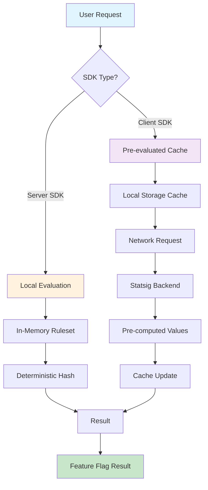
```mermaid
graph TB
    A[User Request] --> B{SDK Type?}
    B -->|Server SDK| C[Local Evaluation]
    B -->|Client SDK| D[Pre-evaluated Cache]

    C --> E[In-Memory Ruleset]
    E --> F[Deterministic Hash]
    F --> G[Result]

    D --> H[Local Storage Cache]
    H --> I[Network Request]
    I --> J[Statsig Backend]
    J --> K[Pre-computed Values]
    K --> L[Cache Update]
    L --> G

    G --> M[Feature Flag Result]

    style A fill:#e1f5fe
    style M fill:#c8e6c9
    style C fill:#fff3e0
    style D fill:#f3e5f5
```

<figcaption>Figure 1: Statsig SDK Evaluation Flow - Server SDKs perform local evaluation while client SDKs use pre-computed cache</figcaption>

## Unified Platform Philosophy

Statsig's most fundamental design tenet is its "unified system" approach where feature flags, experimentation, product analytics, and session replay all share a single, common data pipeline. This directly addresses the prevalent industry problem of "tool sprawl" where organizations employ disparate services for different functions.

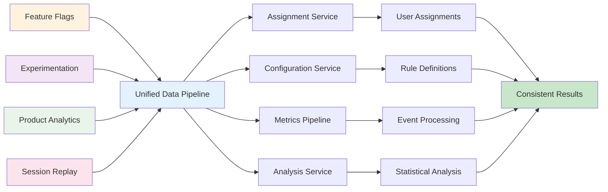
```mermaid
graph LR
    A[Feature Flags] --> E[Unified Data Pipeline]
    B[Experimentation] --> E
    C[Product Analytics] --> E
    D[Session Replay] --> E

    E --> F[Assignment Service]
    E --> G[Configuration Service]
    E --> H[Metrics Pipeline]
    E --> I[Analysis Service]

    F --> J[User Assignments]
    G --> K[Rule Definitions]
    H --> L[Event Processing]
    I --> M[Statistical Analysis]

    J --> N[Consistent Results]
    K --> N
    L --> N
    M --> N

    style E fill:#e3f2fd
    style N fill:#c8e6c9
    style A fill:#fff3e0
    style B fill:#f3e5f5
    style C fill:#e8f5e8
    style D fill:#fce4ec
```

<figcaption>Figure 2: Unified Platform Architecture - All components share a single data pipeline ensuring consistency</figcaption>

### Data Consistency Guarantees

When a feature flag exposure and a subsequent conversion event are processed through the same pipeline, using the same user identity model and metric definitions, the causal link between them becomes inherently trustworthy. This architectural choice fundamentally increases the statistical integrity and reliability of experiment results.

### Core Service Components

The platform is composed of distinct, decoupled microservices:

- **Assignment Service**: Determines user assignments to experiment variations and feature rollouts
- **Feature Flag/Configuration Service**: Manages rule definitions and config specs
- **Metrics Pipeline**: High-throughput system for event ingestion, processing, and analysis
- **Analysis Service**: Statistical engine computing experiment results using methods like CUPED and sequential testing

## SDK Architecture Deep Dive

### Server vs. Client SDK Dichotomy

Statsig employs two fundamentally different models for configuration synchronization and evaluation:

#### Server SDK Architecture

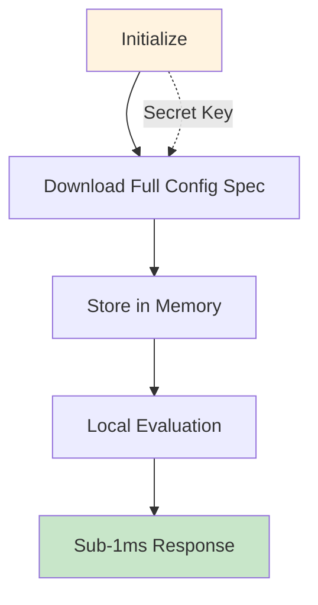
```mermaid
graph TB
    A1[Initialize] --> A2[Download Full Config Spec]
    A2 --> A3[Store in Memory]
    A3 --> A4[Local Evaluation]
    A4 --> A5[Sub-1ms Response]

    A1 -.->|Secret Key| A2

    style A1 fill:#fff3e0
    style A5 fill:#c8e6c9
```

<figcaption>Figure 3a: Server SDK Architecture - Downloads full config and evaluates locally</figcaption>

#### Client SDK Architecture

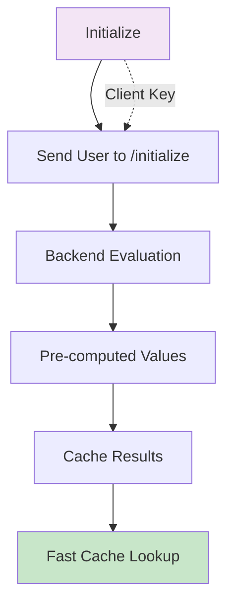
```mermaid
graph TB
    B1[Initialize] --> B2[Send User to /initialize]
    B2 --> B3[Backend Evaluation]
    B3 --> B4[Pre-computed Values]
    B4 --> B5[Cache Results]
    B5 --> B6[Fast Cache Lookup]

    B1 -.->|Client Key| B2

    style B1 fill:#f3e5f5
    style B6 fill:#c8e6c9
```

<figcaption>Figure 3b: Client SDK Architecture - Receives pre-computed values and caches them</figcaption>

#### Server SDKs (Node.js, Python, Go, Java)

```typescript
// Download & Evaluate Locally Model
import { Statsig } from "@statsig/statsig-node-core"

// Initialize with full config download
const statsig = await Statsig.initialize("secret-key", {
  environment: { tier: "production" },
  rulesetsSyncIntervalMs: 10000,
})

// Synchronous, in-memory evaluation
function evaluateUserFeatures(user: StatsigUser) {
  const isFeatureEnabled = statsig.checkGate(user, "new_ui_feature")
  const config = statsig.getConfig(user, "pricing_tier")
  const experiment = statsig.getExperiment(user, "recommendation_algorithm")

  return {
    newUI: isFeatureEnabled,
    pricing: config.value,
    experiment: experiment.value,
  }
}

// Sub-1ms evaluation, no network calls
const result = evaluateUserFeatures({
  userID: "user123",
  email: "user@example.com",
  custom: { plan: "premium" },
})
```

**Characteristics:**

- Downloads entire config spec during initialization
- Performs evaluation logic locally, in-memory
- Synchronous, sub-millisecond operations
- No network calls for individual checks

#### Client SDKs (JavaScript, React, iOS, Android)

```typescript
// Pre-evaluated on Initialize Model
import { StatsigClient } from "@statsig/js-client"

// Initialize with user context
const client = new StatsigClient("client-key")
await client.initializeAsync({
  userID: "user123",
  email: "user@example.com",
  custom: { plan: "premium" },
})

// Synchronous cache lookup
function getFeatureFlags() {
  const isFeatureEnabled = client.checkGate("new_ui_feature")
  const config = client.getConfig("pricing_tier")
  const experiment = client.getExperiment("recommendation_algorithm")

  return {
    newUI: isFeatureEnabled,
    pricing: config.value,
    experiment: experiment.value,
  }
}

// Fast cache lookup, no network calls
const result = getFeatureFlags()
```

**Characteristics:**

- Sends user object to `/initialize` endpoint during startup
- Receives pre-computed, tailored JSON payload
- Subsequent checks are fast, synchronous cache lookups
- No exposure of business logic to client

## Configuration Synchronization

### Server-Side Configuration Management

Server SDKs maintain authoritative configuration state by downloading complete rule definitions:

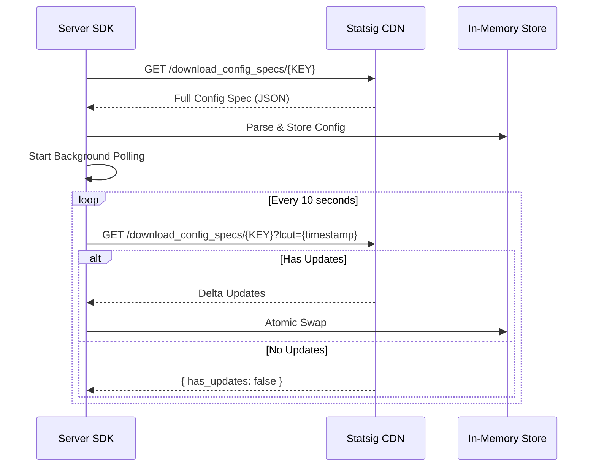
```mermaid
sequenceDiagram
    participant SDK as Server SDK
    participant CDN as Statsig CDN
    participant Memory as In-Memory Store

    SDK->>CDN: GET /download_config_specs/{KEY}
    CDN-->>SDK: Full Config Spec (JSON)
    SDK->>Memory: Parse & Store Config
    SDK->>SDK: Start Background Polling

    loop Every 10 seconds
        SDK->>CDN: GET /download_config_specs/{KEY}?lcut={timestamp}
        alt Has Updates
            CDN-->>SDK: Delta Updates
            SDK->>Memory: Atomic Swap
        else No Updates
            CDN-->>SDK: { has_updates: false }
        end
    end
```

<figcaption>Figure 4: Server-Side Configuration Synchronization - Continuous polling with delta updates</figcaption>

```typescript
interface ConfigSpecs {
  feature_gates: Record<string, FeatureGateSpec>
  dynamic_configs: Record<string, DynamicConfigSpec>
  layer_configs: Record<string, LayerSpec>
  id_lists: Record<string, string[]>
  has_updates: boolean
  time: number
}
```

**Synchronization Process:**

1. Initial download from CDN endpoint: `https://api.statsigcdn.com/v1/download_config_specs/{SDK_KEY}.json`
2. Background polling every 10 seconds (configurable)
3. Delta updates when possible using `company_lcut` timestamp
4. Atomic swaps of in-memory store for consistency

### Client-Side Evaluation Caching

Client SDKs receive pre-evaluated results rather than raw configuration rules:

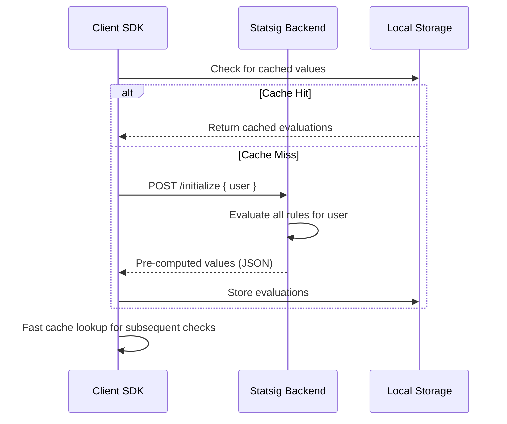
```mermaid
sequenceDiagram
    participant Client as Client SDK
    participant Backend as Statsig Backend
    participant Cache as Local Storage

    Client->>Cache: Check for cached values
    alt Cache Hit
        Cache-->>Client: Return cached evaluations
    else Cache Miss
        Client->>Backend: POST /initialize { user }
        Backend->>Backend: Evaluate all rules for user
        Backend-->>Client: Pre-computed values (JSON)
        Client->>Cache: Store evaluations
    end

    Client->>Client: Fast cache lookup for subsequent checks
```

<figcaption>Figure 5: Client-Side Evaluation Caching - Pre-computed values with local storage fallback</figcaption>

```json
{
  "feature_gates": {
    "gate_name": {
      "name": "gate_name",
      "value": true,
      "rule_id": "rule_123",
      "secondary_exposures": [...]
    }
  },
  "dynamic_configs": {
    "config_name": {
      "name": "config_name",
      "value": {"param1": "value1"},
      "rule_id": "rule_456",
      "group": "treatment"
    }
  }
}
```

## Deterministic Assignment Algorithm

### Hashing Implementation

Statsig's bucket assignment algorithm ensures consistent, deterministic user allocation:

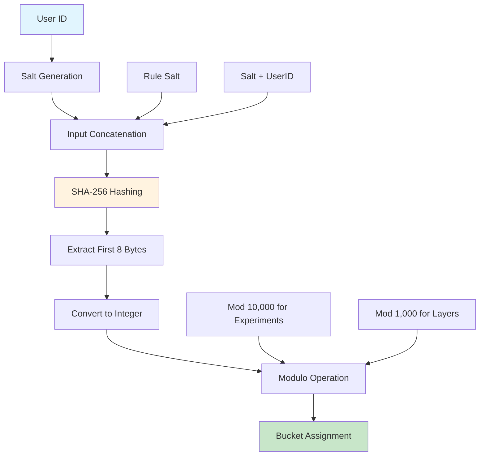
```mermaid
flowchart TD
    A[User ID] --> B[Salt Generation]
    B --> C[Input Concatenation]
    C --> D[SHA-256 Hashing]
    D --> E[Extract First 8 Bytes]
    E --> F[Convert to Integer]
    F --> G[Modulo Operation]
    G --> H[Bucket Assignment]

    B1[Rule Salt] --> C
    C1[Salt + UserID] --> C

    G1[Mod 10,000 for Experiments] --> G
    G2[Mod 1,000 for Layers] --> G

    style A fill:#e1f5fe
    style H fill:#c8e6c9
    style D fill:#fff3e0
```

<figcaption>Figure 6: Deterministic Assignment Algorithm - SHA-256 hashing with salt ensures consistent user bucketing</figcaption>

```typescript
// Enhanced algorithm implementation
import { createHash } from "crypto"

interface AssignmentResult {
  bucket: number
  assigned: boolean
  group?: string
}

function assignUser(userId: string, salt: string, allocation: number = 10000): AssignmentResult {
  // Input concatenation
  const input = salt + userId

  // SHA-256 hashing
  const hash = createHash("sha256").update(input).digest("hex")

  // Extract first 8 bytes and convert to integer
  const first8Bytes = hash.substring(0, 8)
  const hashInt = parseInt(first8Bytes, 16)

  // Modulo operation for bucket assignment
  const bucket = hashInt % allocation

  // Determine if user is assigned based on allocation percentage
  const assigned = bucket < allocation * 0.1 // 10% allocation example

  return {
    bucket,
    assigned,
    group: assigned ? "treatment" : "control",
  }
}

// Usage example
const result = assignUser("user123", "experiment_salt_abc123", 10000)
console.log(`User assigned to bucket ${result.bucket}, group: ${result.group}`)
```

**Process:**

1. **Salt Creation**: Each rule generates a unique, stable salt
2. **Input Concatenation**: Salt + user identifier (userID, stableID, or customID)
3. **Hashing**: SHA-256 hashing for cryptographic security and uniform distribution
4. **Bucket Assignment**: First 8 bytes converted to integer, then modulo 10,000 (experiments) or 1,000 (layers)

### Assignment Consistency Guarantees

- **Cross-platform consistency**: Identical assignments across client/server SDKs
- **Temporal consistency**: Maintains assignments across rule modifications
- **User attribute independence**: Assignment depends only on user identifier and salt

## Browser SDK Implementation

### Multi-Strategy Initialization Framework

The browser SDK implements four distinct initialization strategies:

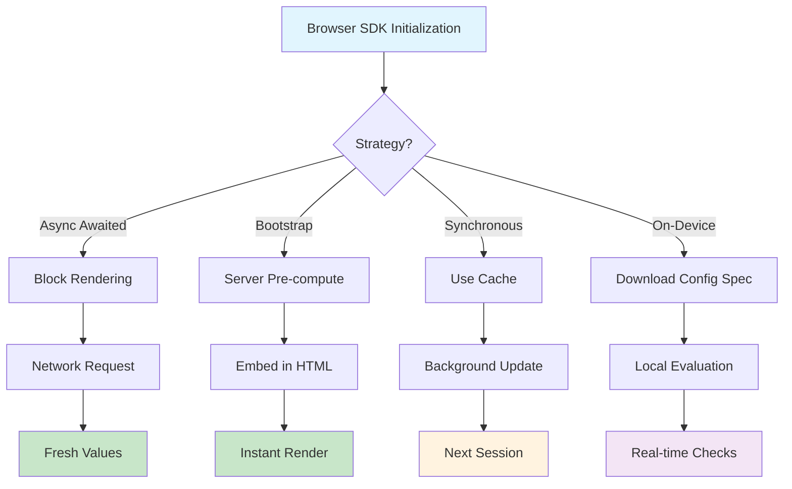
```mermaid
graph TB
    A[Browser SDK Initialization] --> B{Strategy?}

    B -->|Async Awaited| C[Block Rendering]
    C --> D[Network Request]
    D --> E[Fresh Values]

    B -->|Bootstrap| F[Server Pre-compute]
    F --> G[Embed in HTML]
    G --> H[Instant Render]

    B -->|Synchronous| I[Use Cache]
    I --> J[Background Update]
    J --> K[Next Session]

    B -->|On-Device| L[Download Config Spec]
    L --> M[Local Evaluation]
    M --> N[Real-time Checks]

    style A fill:#e1f5fe
    style E fill:#c8e6c9
    style H fill:#c8e6c9
    style K fill:#fff3e0
    style N fill:#f3e5f5
```

<figcaption>Figure 7: Browser SDK Initialization Strategies - Four different approaches for balancing performance and freshness</figcaption>

#### 1. Asynchronous Awaited Initialization

```typescript
const client = new StatsigClient("client-key")
await client.initializeAsync(user) // Blocks rendering until complete
```

**Use Case**: When data freshness is critical and some rendering delay is acceptable.

#### 2. Bootstrap Initialization (Recommended)

```typescript
// Server-side (Node.js/Next.js)
const serverStatsig = await Statsig.initialize("secret-key")
const bootstrapValues = serverStatsig.getClientInitializeResponse(user)

// Client-side
const client = new StatsigClient("client-key")
client.initializeSync({ initializeValues: bootstrapValues })
```

**Use Case**: Optimal balance between performance and freshness, eliminates UI flicker.

#### 3. Synchronous Initialization

```typescript
const client = new StatsigClient("client-key")
client.initializeSync(user) // Uses cache, fetches updates in background
```

**Use Case**: Progressive web applications where some staleness is acceptable.

### Cache Management and Storage

The browser SDK employs sophisticated caching mechanisms:

```typescript
interface CachedEvaluations {
  feature_gates: Record<string, FeatureGateResult>
  dynamic_configs: Record<string, DynamicConfigResult>
  layer_configs: Record<string, LayerResult>
  time: number
  company_lcut: number
  hash_used: string
  evaluated_keys: EvaluatedKeys
}
```

**Cache Invalidation**: Occurs when `company_lcut` timestamp changes, indicating configuration updates.

## Node.js Server SDK Integration

### Server-Side Architecture Patterns

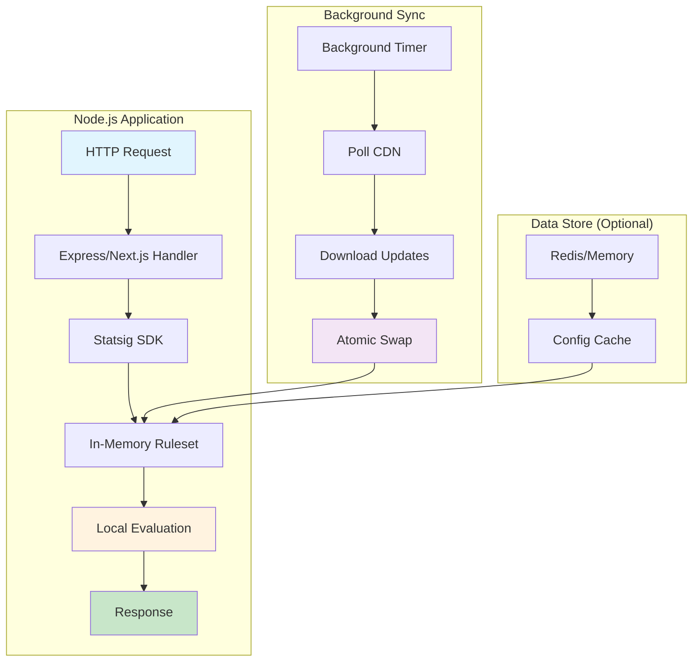
```mermaid
graph TB
    subgraph "Node.js Application"
        A[HTTP Request] --> B[Express/Next.js Handler]
        B --> C[Statsig SDK]
        C --> D[In-Memory Ruleset]
        D --> E[Local Evaluation]
        E --> F[Response]
    end

    subgraph "Background Sync"
        G[Background Timer] --> H[Poll CDN]
        H --> I[Download Updates]
        I --> J[Atomic Swap]
        J --> D
    end

    subgraph "Data Store (Optional)"
        K[Redis/Memory] --> L[Config Cache]
        L --> D
    end

    style A fill:#e1f5fe
    style F fill:#c8e6c9
    style E fill:#fff3e0
    style J fill:#f3e5f5
```

<figcaption>Figure 8: Node.js Server SDK Architecture - In-memory evaluation with background synchronization</figcaption>

```typescript
import { Statsig } from "@statsig/statsig-node-core"

// Initialization
const statsig = await Statsig.initialize("secret-key", {
  environment: { tier: "production" },
  rulesetsSyncIntervalMs: 10000, // 10 seconds
})

// Synchronous evaluation
function handleRequest(req: Request, res: Response) {
  const user = {
    userID: req.user.id,
    email: req.user.email,
    custom: { plan: req.user.plan },
  }

  const isFeatureEnabled = statsig.checkGate(user, "new_feature")
  const config = statsig.getConfig(user, "pricing_config")

  // Sub-1ms evaluation, no network calls
  res.json({ feature: isFeatureEnabled, pricing: config.value })
}
```

### Background Synchronization

Server SDKs implement continuous background synchronization:

```typescript
// Configurable polling interval
const statsig = await Statsig.initialize("secret-key", {
  rulesetsSyncIntervalMs: 30000, // 30 seconds for less critical updates
})

// Delta updates when possible
// Atomic swaps ensure consistency
```

### Data Adapter Ecosystem

For enhanced resilience, Statsig supports pluggable data adapters:

```typescript
// Redis Data Adapter
import { RedisDataAdapter } from "@statsig/redis-data-adapter"

const redisAdapter = new RedisDataAdapter({
  host: "localhost",
  port: 6379,
  password: "password",
})

const statsig = await Statsig.initialize("secret-key", {
  dataStore: redisAdapter,
})
```

## Performance Optimization Strategies

### Bootstrap Initialization for Next.js

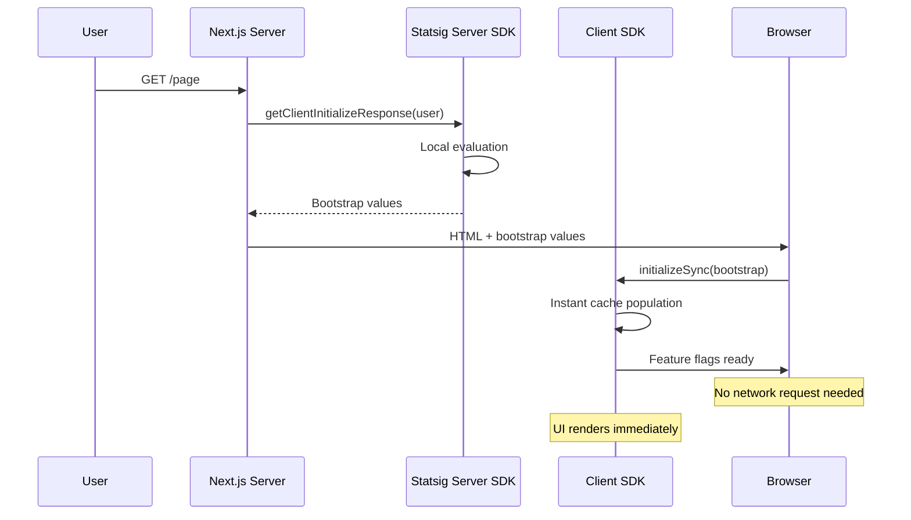
```mermaid
sequenceDiagram
    participant User as User
    participant Next as Next.js Server
    participant Statsig as Statsig Server SDK
    participant Client as Client SDK
    participant Browser as Browser

    User->>Next: GET /page
    Next->>Statsig: getClientInitializeResponse(user)
    Statsig->>Statsig: Local evaluation
    Statsig-->>Next: Bootstrap values
    Next->>Browser: HTML + bootstrap values
    Browser->>Client: initializeSync(bootstrap)
    Client->>Client: Instant cache population
    Client->>Browser: Feature flags ready

    Note over Browser: No network request needed
    Note over Client: UI renders immediately
```

<figcaption>Figure 9: Bootstrap Initialization Flow - Server pre-computes values for instant client-side rendering</figcaption>

```typescript
// pages/api/features.ts
import { Statsig } from "@statsig/statsig-node-core"

const statsig = await Statsig.initialize("secret-key")

export default async function handler(req: NextApiRequest, res: NextApiResponse) {
  const user = {
    userID: req.headers["x-user-id"] as string,
    email: req.headers["x-user-email"] as string,
  }

  const bootstrapValues = statsig.getClientInitializeResponse(user)
  res.json(bootstrapValues)
}
```

```typescript
// pages/_app.tsx
import { StatsigClient } from '@statsig/js-client';

function MyApp({ Component, pageProps, bootstrapValues }) {
  const [statsig, setStatsig] = useState(null);

  useEffect(() => {
    const client = new StatsigClient('client-key');
    client.initializeSync({ initializeValues: bootstrapValues });
    setStatsig(client);
  }, []);

  return <Component {...pageProps} statsig={statsig} />;
}
```

### Edge Integration Patterns

```typescript
// Vercel Edge Config Integration
import { VercelDataAdapter } from "@statsig/vercel-data-adapter"

const vercelAdapter = new VercelDataAdapter({
  edgeConfig: process.env.EDGE_CONFIG,
})

const statsig = await Statsig.initialize("secret-key", {
  dataStore: vercelAdapter,
})
```

## Override System Architecture

### Feature Gate Overrides

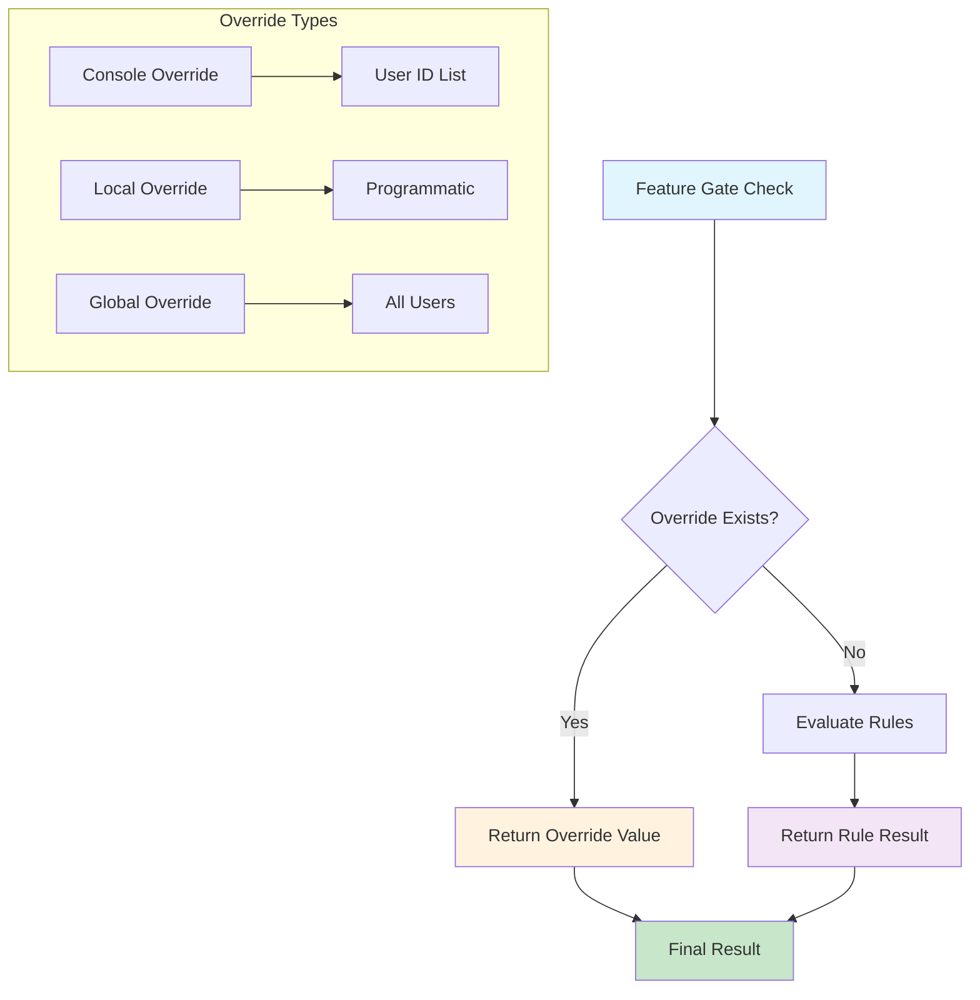
```mermaid
flowchart TD
    A[Feature Gate Check] --> B{Override Exists?}
    B -->|Yes| C[Return Override Value]
    B -->|No| D[Evaluate Rules]
    D --> E[Return Rule Result]

    C --> F[Final Result]
    E --> F

    subgraph "Override Types"
        G[Console Override] --> H[User ID List]
        I[Local Override] --> J[Programmatic]
        K[Global Override] --> L[All Users]
    end

    style A fill:#e1f5fe
    style F fill:#c8e6c9
    style C fill:#fff3e0
    style E fill:#f3e5f5
```

<figcaption>Figure 10: Override System Hierarchy - Overrides take precedence over normal rule evaluation</figcaption>

```typescript
// Console-based overrides (highest precedence)
// Configured in Statsig console for specific userIDs

// Local SDK overrides (for testing)
statsig.overrideGate("my_gate", true, "user123")
statsig.overrideGate("my_gate", false) // Global override
```

### Experiment Overrides

```typescript
// Layer-level overrides for experiments
statsig.overrideExperiment("my_experiment", "treatment", "user123")

// Local mode for testing
const statsig = await Statsig.initialize("secret-key", {
  localMode: true, // Disables network requests
})
```

## Advanced Integration Patterns

### Microservices Integration

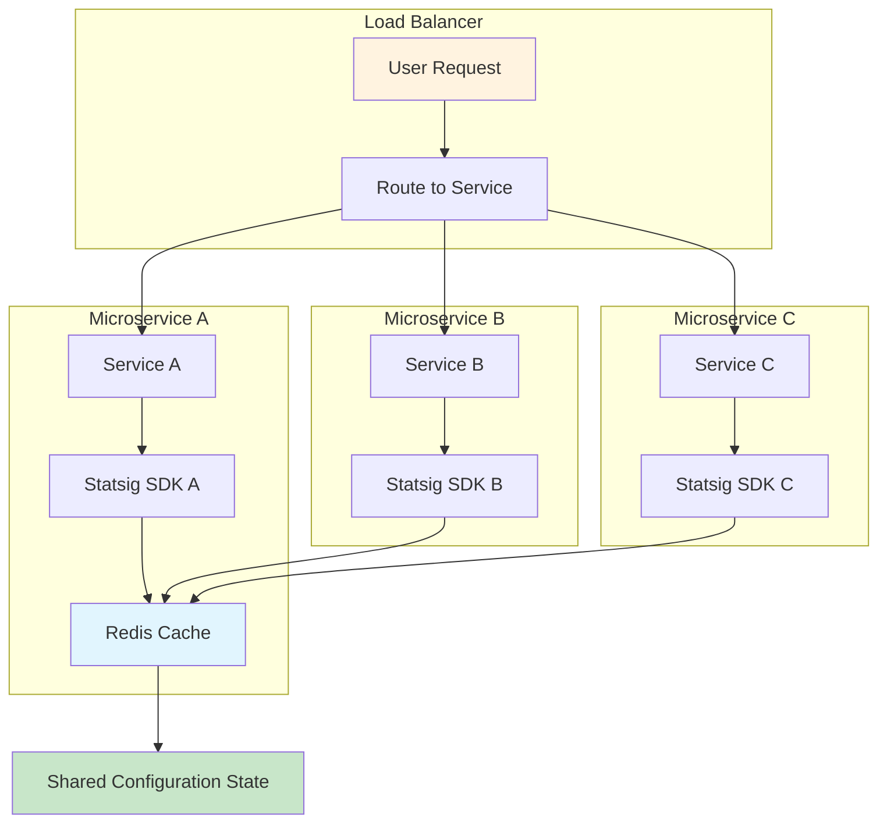
```mermaid
graph TB
    subgraph "Microservice A"
        A1[Service A] --> A2[Statsig SDK A]
        A2 --> A3[Redis Cache]
    end

    subgraph "Microservice B"
        B1[Service B] --> B2[Statsig SDK B]
        B2 --> A3
    end

    subgraph "Microservice C"
        C1[Service C] --> C2[Statsig SDK C]
        C2 --> A3
    end

    A3 --> D[Shared Configuration State]

    subgraph "Load Balancer"
        E[User Request] --> F[Route to Service]
        F --> A1
        F --> B1
        F --> C1
    end

    style A3 fill:#e1f5fe
    style D fill:#c8e6c9
    style E fill:#fff3e0
```

<figcaption>Figure 11: Microservices Integration - Shared Redis cache ensures consistent configuration across services</figcaption>

```typescript
// Shared configuration state across services
const redisAdapter = new RedisDataAdapter({
  host: process.env.REDIS_HOST,
  port: parseInt(process.env.REDIS_PORT),
  password: process.env.REDIS_PASSWORD,
})

// All services use the same Redis instance for config sharing
const statsig = await Statsig.initialize("secret-key", {
  dataStore: redisAdapter,
})
```

### Serverless Architecture Considerations

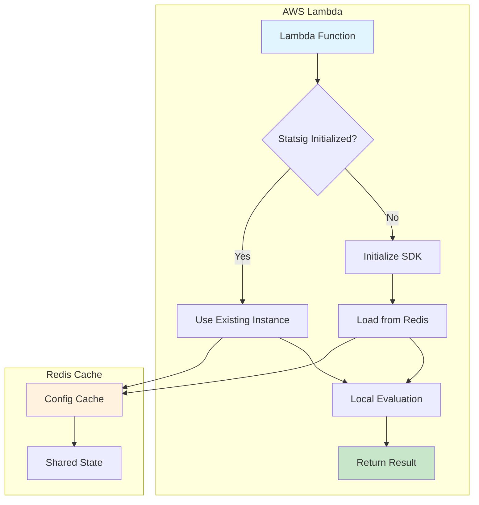
```mermaid
graph TB
    subgraph "AWS Lambda"
        A[Lambda Function] --> B{Statsig Initialized?}
        B -->|No| C[Initialize SDK]
        B -->|Yes| D[Use Existing Instance]
        C --> E[Load from Redis]
        D --> F[Local Evaluation]
        E --> F
        F --> G[Return Result]
    end

    subgraph "Redis Cache"
        H[Config Cache] --> I[Shared State]
    end

    E --> H
    D --> H

    style A fill:#e1f5fe
    style G fill:#c8e6c9
    style H fill:#fff3e0
```

<figcaption>Figure 12: Serverless Architecture - Cold start optimization with shared Redis cache</figcaption>

```typescript
// Cold start optimization for serverless environments
let statsigInstance: Statsig | null = null

export async function handler(event: APIGatewayEvent) {
  // Initialize SDK only once per container
  if (!statsigInstance) {
    statsigInstance = await Statsig.initialize("secret-key", {
      dataStore: new RedisDataAdapter({
        host: process.env.REDIS_HOST,
        port: parseInt(process.env.REDIS_PORT),
        password: process.env.REDIS_PASSWORD,
      }),
    })
  }

  const user = { userID: event.requestContext.authorizer.userId }
  const result = statsigInstance.checkGate(user, "feature_flag")

  return {
    statusCode: 200,
    body: JSON.stringify({ feature: result }),
  }
}
```

## Practical Implementation Examples

### Next.js with Bootstrap Initialization

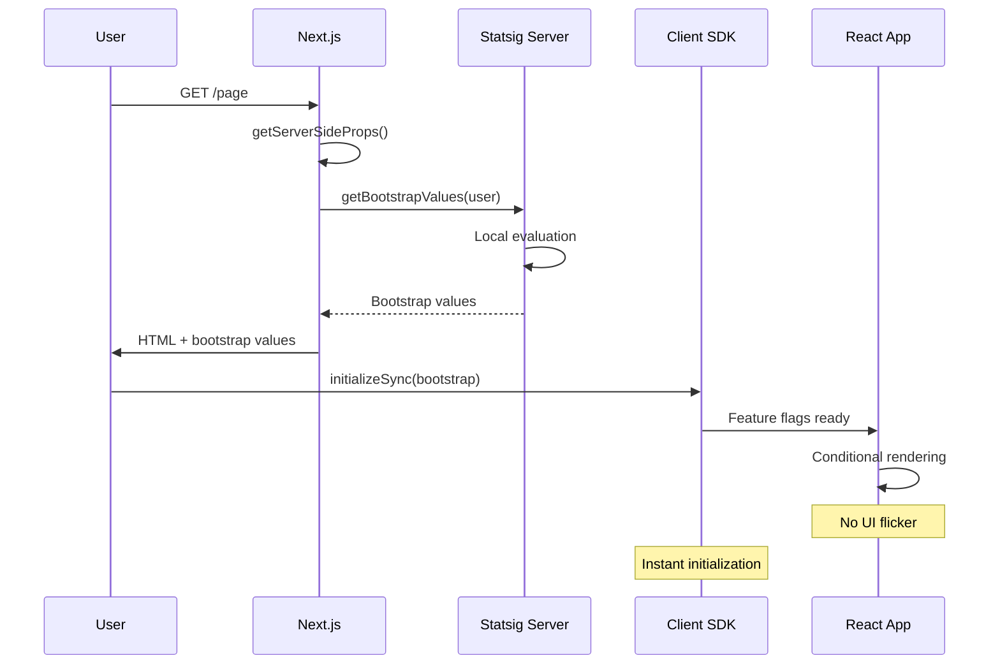
```mermaid
sequenceDiagram
    participant User as User
    participant Next as Next.js
    participant Statsig as Statsig Server
    participant Client as Client SDK
    participant React as React App

    User->>Next: GET /page
    Next->>Next: getServerSideProps()
    Next->>Statsig: getBootstrapValues(user)
    Statsig->>Statsig: Local evaluation
    Statsig-->>Next: Bootstrap values
    Next->>User: HTML + bootstrap values

    User->>Client: initializeSync(bootstrap)
    Client->>React: Feature flags ready
    React->>React: Conditional rendering

    Note over React: No UI flicker
    Note over Client: Instant initialization
```

<figcaption>Figure 13: Next.js Bootstrap Implementation - Server-side pre-computation eliminates client-side network requests</figcaption>

```typescript
// lib/statsig.ts
import { Statsig } from "@statsig/statsig-node-core"

let statsigInstance: Statsig | null = null

export async function getStatsig() {
  if (!statsigInstance) {
    statsigInstance = await Statsig.initialize(process.env.STATSIG_SECRET_KEY!)
  }
  return statsigInstance
}

export async function getBootstrapValues(user: StatsigUser) {
  const statsig = await getStatsig()
  return statsig.getClientInitializeResponse(user)
}
```

```typescript
// pages/index.tsx
import { GetServerSideProps } from 'next';
import { StatsigClient } from '@statsig/js-client';
import { getBootstrapValues } from '../lib/statsig';

export const getServerSideProps: GetServerSideProps = async (context) => {
  const user = {
    userID: context.req.headers['x-user-id'] as string || 'anonymous',
    custom: { source: 'web' }
  };

  const bootstrapValues = await getBootstrapValues(user);

  return {
    props: {
      bootstrapValues,
      user
    }
  };
};

export default function Home({ bootstrapValues, user }) {
  const [statsig, setStatsig] = useState<StatsigClient | null>(null);

  useEffect(() => {
    const client = new StatsigClient(process.env.NEXT_PUBLIC_STATSIG_CLIENT_KEY!);
    client.initializeSync({ initializeValues: bootstrapValues });
    setStatsig(client);
  }, [bootstrapValues]);

  const isFeatureEnabled = statsig?.checkGate('new_feature') || false;

  return (
    <div>
      {isFeatureEnabled && <NewFeatureComponent />}
      <ExistingComponent />
    </div>
  );
}
```

### Node.js BFF (Backend for Frontend) Pattern

```typescript
// services/feature-service.ts
import { Statsig } from "@statsig/statsig-node-core"

export class FeatureService {
  private statsig: Statsig

  constructor() {
    this.initialize()
  }

  private async initialize() {
    this.statsig = await Statsig.initialize(process.env.STATSIG_SECRET_KEY!)
  }

  async evaluateFeatures(user: StatsigUser) {
    const features = {
      newUI: this.statsig.checkGate(user, "new_ui"),
      pricing: this.statsig.getConfig(user, "pricing_tier"),
      experiment: this.statsig.getExperiment(user, "recommendation_algorithm"),
    }

    return features
  }

  async getBootstrapValues(user: StatsigUser) {
    return this.statsig.getClientInitializeResponse(user)
  }
}
```

```typescript
// routes/features.ts
import { FeatureService } from "../services/feature-service"

const featureService = new FeatureService()

router.get("/features/:userId", async (req, res) => {
  const user = {
    userID: req.params.userId,
    email: req.headers["x-user-email"] as string,
    custom: { plan: req.headers["x-user-plan"] as string },
  }

  const features = await featureService.evaluateFeatures(user)
  res.json(features)
})

router.get("/bootstrap/:userId", async (req, res) => {
  const user = { userID: req.params.userId }
  const bootstrapValues = await featureService.getBootstrapValues(user)
  res.json(bootstrapValues)
})
```

## Conclusion

Statsig's internal architecture demonstrates a sophisticated understanding of modern distributed systems challenges. Its unified platform approach, deterministic evaluation algorithms, and flexible SDK architecture make it well-suited for high-scale, data-driven product development.

The key architectural decisions—separating client and server evaluation models, implementing robust caching strategies, and providing comprehensive override systems—reflect a mature approach to building experimentation platforms that can scale from startup to enterprise.

For engineering teams implementing Statsig, the choice between bootstrap initialization and asynchronous patterns, the decision to use data adapters for resilience, and the configuration of override systems should be driven by specific performance, security, and operational requirements.

The platform's commitment to transparency in its assignment algorithms and the availability of warehouse-native deployment options further positions it as a solution that can grow with an organization's data maturity and compliance requirements.

## Error Handling and Resilience

### Network Failure Scenarios

Statsig SDKs are designed to handle various network failure scenarios gracefully:

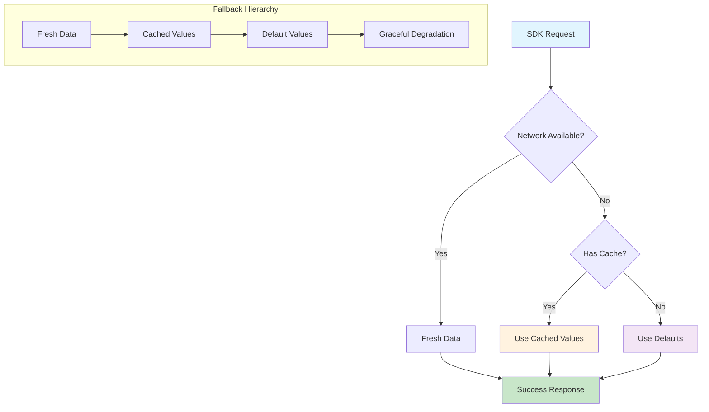
```mermaid
flowchart TD
    A[SDK Request] --> B{Network Available?}
    B -->|Yes| C[Fresh Data]
    B -->|No| D{Has Cache?}
    D -->|Yes| E[Use Cached Values]
    D -->|No| F[Use Defaults]

    C --> G[Success Response]
    E --> G
    F --> G

    subgraph "Fallback Hierarchy"
        H[Fresh Data] --> I[Cached Values]
        I --> J[Default Values]
        J --> K[Graceful Degradation]
    end

    style A fill:#e1f5fe
    style G fill:#c8e6c9
    style E fill:#fff3e0
    style F fill:#f3e5f5
```

<figcaption>Figure 14: Error Handling and Resilience - Multi-layered fallback mechanisms ensure system reliability</figcaption>

```typescript
// Client SDK error handling with enhanced fallbacks
const client = new StatsigClient("client-key")

try {
  await client.initializeAsync(user)
} catch (error) {
  // SDK automatically falls back to cached values or defaults
  console.warn("Statsig initialization failed, using cached values:", error)

  // Custom fallback logic
  if (error.code === "NETWORK_ERROR") {
    // Use cached values
    client.initializeSync(user)
  } else if (error.code === "AUTH_ERROR") {
    // Use defaults
    console.error("Authentication failed, using default values")
  }
}

// Server SDK error handling with data store fallback
const statsig = await Statsig.initialize("secret-key", {
  dataStore: new RedisDataAdapter({
    host: process.env.REDIS_HOST,
    port: parseInt(process.env.REDIS_PORT),
    password: process.env.REDIS_PASSWORD,
  }),
  rulesetsSyncIntervalMs: 10000,
  // SDK will retry failed downloads with exponential backoff
  retryAttempts: 3,
  retryDelayMs: 1000,
})
```

### Fallback Mechanisms

**Client SDK Fallbacks:**

1. **Cached Values**: Uses previously cached evaluations from localStorage
2. **Default Values**: Falls back to code-defined defaults
3. **Graceful Degradation**: Continues operation with stale data

**Server SDK Fallbacks:**

1. **Data Store**: Loads configurations from Redis/other data stores
2. **In-Memory Cache**: Uses last successfully downloaded config
3. **Health Checks**: Monitors SDK health and reports issues

## Monitoring and Observability

### SDK Health Monitoring

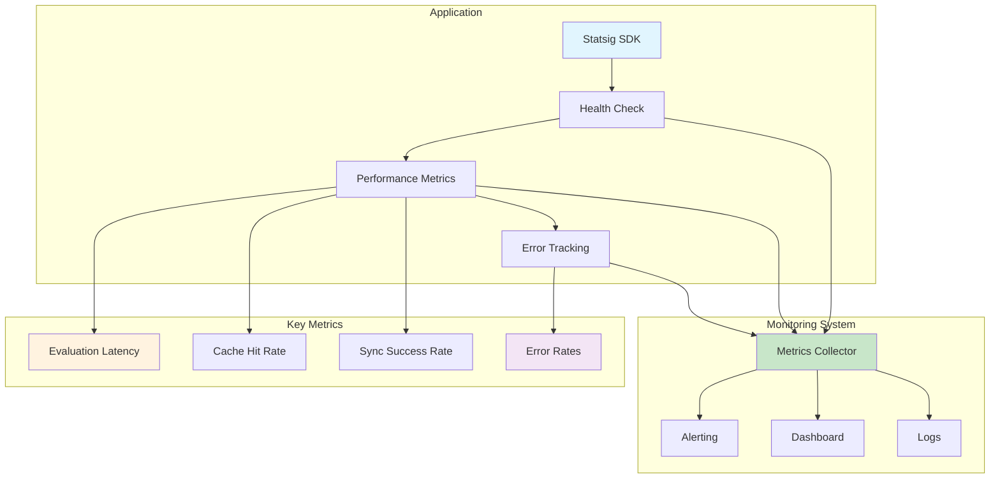
```mermaid
graph TB
    subgraph "Application"
        A[Statsig SDK] --> B[Health Check]
        B --> C[Performance Metrics]
        C --> D[Error Tracking]
    end

    subgraph "Monitoring System"
        E[Metrics Collector] --> F[Alerting]
        E --> G[Dashboard]
        E --> H[Logs]
    end

    B --> E
    C --> E
    D --> E

    subgraph "Key Metrics"
        I[Evaluation Latency]
        J[Cache Hit Rate]
        K[Sync Success Rate]
        L[Error Rates]
    end

    C --> I
    C --> J
    C --> K
    D --> L

    style A fill:#e1f5fe
    style E fill:#c8e6c9
    style I fill:#fff3e0
    style L fill:#f3e5f5
```

<figcaption>Figure 15: Monitoring and Observability - Comprehensive metrics collection and alerting system</figcaption>

```typescript
// Server SDK monitoring with enhanced health checks
const statsig = await Statsig.initialize("secret-key", {
  environment: { tier: "production" },
  // Enable detailed logging
  logLevel: "info",
})

// Monitor SDK health with custom alerting
setInterval(() => {
  const health = statsig.getHealth()
  if (health.status !== "healthy") {
    // Alert or log health issues
    console.error("Statsig SDK health issue:", health)

    // Send to monitoring system
    metrics.increment("statsig.health.issues", {
      status: health.status,
      error: health.error,
    })
  }
}, 60000)

// Custom metrics collection
const startTime = performance.now()
const result = statsig.checkGate(user, "feature_flag")
const latency = performance.now() - startTime

// Send to your monitoring system
metrics.histogram("statsig.evaluation.latency", latency)
metrics.increment("statsig.evaluation.count")
```

### Performance Metrics

**Key Metrics to Monitor:**

- **Evaluation Latency**: Should be <1ms for server SDKs
- **Cache Hit Rate**: Percentage of evaluations using cached configs
- **Sync Success Rate**: Percentage of successful config downloads
- **Error Rates**: Network failures, parsing errors, evaluation errors

## Security Considerations

### API Key Management

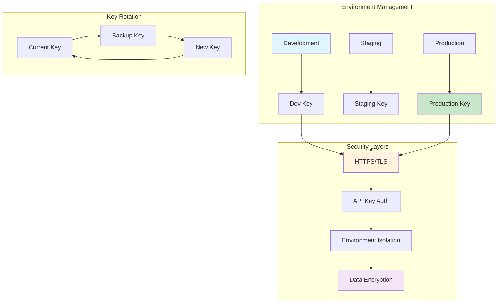
```mermaid
graph TB
    subgraph "Environment Management"
        A[Development] --> B[Dev Key]
        C[Staging] --> D[Staging Key]
        E[Production] --> F[Production Key]
    end

    subgraph "Key Rotation"
        G[Current Key] --> H[Backup Key]
        H --> I[New Key]
        I --> G
    end

    subgraph "Security Layers"
        J[HTTPS/TLS] --> K[API Key Auth]
        K --> L[Environment Isolation]
        L --> M[Data Encryption]
    end

    B --> J
    D --> J
    F --> J

    style A fill:#e1f5fe
    style F fill:#c8e6c9
    style J fill:#fff3e0
    style M fill:#f3e5f5
```

<figcaption>Figure 16: Security Considerations - Multi-layered security approach with environment isolation</figcaption>

```typescript
// Environment-specific keys
const statsigKey = process.env.NODE_ENV === "production" ? process.env.STATSIG_SECRET_KEY : process.env.STATSIG_DEV_KEY

// Key rotation strategy
const statsig = await Statsig.initialize(statsigKey, {
  // Support for multiple keys during rotation
  backupKeys: [process.env.STATSIG_BACKUP_KEY],
})
```

### Data Privacy

**User Data Handling:**

- **PII Protection**: Never log sensitive user data
- **Data Minimization**: Only send necessary user attributes
- **Encryption**: All data transmitted over HTTPS/TLS

```typescript
// Sanitize user data before sending to Statsig
const sanitizedUser = {
  userID: user.id,
  email: user.email ? hashEmail(user.email) : undefined,
  custom: {
    plan: user.plan,
    region: user.region,
    // Exclude sensitive fields like SSN, credit card info
  },
}
```

## Performance Benchmarks

### Evaluation Performance

**Server SDK Benchmarks:**

- **Cold Start**: ~50-100ms (first evaluation after initialization)
- **Warm Evaluation**: <1ms (subsequent evaluations)
- **Memory Usage**: ~10-50MB (depending on config size)
- **Throughput**: 10,000+ evaluations/second per instance

**Client SDK Benchmarks:**

- **Bootstrap Initialization**: <5ms (with pre-computed values)
- **Async Initialization**: 100-500ms (network dependent)
- **Cache Lookup**: <0.1ms
- **Bundle Size**: ~50-100KB (gzipped)

### Scalability Considerations

```typescript
// Horizontal scaling with shared state
const redisAdapter = new RedisDataAdapter({
  host: process.env.REDIS_HOST,
  port: parseInt(process.env.REDIS_PORT),
  password: process.env.REDIS_PASSWORD,
  // Enable clustering for high availability
  enableOfflineMode: true,
})

// Load balancing considerations
const statsig = await Statsig.initialize("secret-key", {
  dataStore: redisAdapter,
  // Ensure consistent evaluation across instances
  rulesetsSyncIntervalMs: 5000,
})
```

## Best Practices and Recommendations

### 1. Initialization Strategy Selection

**Choose Bootstrap Initialization When:**

- UI flicker is unacceptable
- Server-side rendering is available
- Performance is critical

**Choose Async Initialization When:**

- Real-time updates are required
- Server-side rendering isn't available
- Some rendering delay is acceptable

### 2. Configuration Management

```typescript
// Centralized configuration management
class StatsigConfig {
  private static instance: StatsigConfig
  private statsig: Statsig | null = null

  static async getInstance(): Promise<StatsigConfig> {
    if (!StatsigConfig.instance) {
      StatsigConfig.instance = new StatsigConfig()
      await StatsigConfig.instance.initialize()
    }
    return StatsigConfig.instance
  }

  private async initialize() {
    this.statsig = await Statsig.initialize(process.env.STATSIG_SECRET_KEY!, {
      environment: { tier: process.env.NODE_ENV },
      dataStore: new RedisDataAdapter({
        /* config */
      }),
    })
  }

  getStatsig(): Statsig {
    if (!this.statsig) {
      throw new Error("Statsig not initialized")
    }
    return this.statsig
  }
}
```

### 3. Testing Strategies

```typescript
// Unit testing with local mode
describe("Feature Flag Tests", () => {
  let statsig: Statsig

  beforeEach(async () => {
    statsig = await Statsig.initialize("secret-key", {
      localMode: true, // Disable network requests
    })
  })

  test("should enable feature for specific user", () => {
    statsig.overrideGate("new_feature", true, "test-user")

    const user = { userID: "test-user" }
    const result = statsig.checkGate(user, "new_feature")

    expect(result).toBe(true)
  })
})
```

### 4. Production Deployment

**Pre-deployment Checklist:**

- [ ] Configure appropriate data stores (Redis, etc.)
- [ ] Set up monitoring and alerting
- [ ] Implement proper error handling
- [ ] Test override systems
- [ ] Validate configuration synchronization
- [ ] Performance testing under load

**Rollout Strategy:**

1. **Development**: Use local mode and overrides
2. **Staging**: Connect to staging Statsig project
3. **Production**: Gradual rollout with monitoring
4. **Monitoring**: Watch error rates and performance metrics

## Future Considerations

### Upcoming Features

Statsig continues to evolve with new capabilities:

- **Real-time Streaming**: WebSocket-based config updates
- **Advanced Analytics**: Machine learning-powered insights
- **Multi-environment Support**: Enhanced environment management
- **Custom Assignment Algorithms**: Support for custom bucketing logic

### Migration Strategies

**From Other Platforms:**

- **LaunchDarkly**: Gradual migration with dual evaluation
- **Optimizely**: Feature-by-feature migration
- **Custom Solutions**: Incremental adoption approach

```typescript
// Migration helper for dual evaluation
class MigrationHelper {
  constructor(
    private statsig: Statsig,
    private legacySystem: LegacyFeatureFlags,
  ) {}

  async evaluateFeature(user: StatsigUser, featureName: string) {
    const statsigResult = this.statsig.checkGate(user, featureName)
    const legacyResult = this.legacySystem.checkFeature(user.id, featureName)

    // Log discrepancies for analysis
    if (statsigResult !== legacyResult) {
      console.warn(`Feature ${featureName} mismatch for user ${user.userID}`)
    }

    return statsigResult // Use Statsig as source of truth
  }
}
```

## Conclusion

Statsig's internal architecture represents a mature, well-thought-out approach to building experimentation platforms at scale. Its unified data pipeline, deterministic evaluation algorithms, and flexible SDK architecture make it an excellent choice for organizations looking to implement robust feature flagging and A/B testing capabilities.

The platform's commitment to performance, transparency, and developer experience is evident in every architectural decision. From the sophisticated caching strategies to the comprehensive override systems, Statsig provides the tools necessary for building reliable, high-performance applications.

For engineering teams, the key is to understand the trade-offs between different initialization strategies, choose appropriate data stores for resilience, and implement proper monitoring and error handling. With these considerations in mind, Statsig can serve as a solid foundation for data-driven product development at any scale.

The platform's continued evolution and commitment to enterprise-grade features position it well for organizations looking to grow their experimentation capabilities alongside their business needs.
