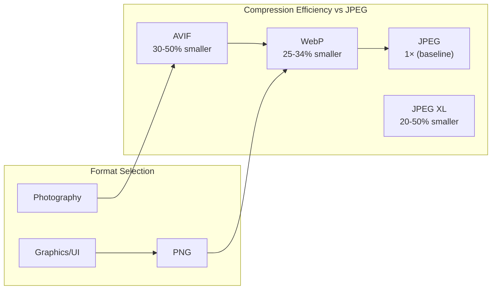

# Image Formats for Web Performance

Master modern image formats including JPEG, WebP, AVIF, and PNG, understanding compression algorithms, color spaces, HDR support, and optimal deployment strategies for balancing quality, file size, and browser compatibility.

<figure>

<figcaption>Modern image format compression efficiency and fallback chain for web delivery</figcaption>

</figure>

## TLDR

**Image format selection** balances compression efficiency, feature support (alpha, HDR, animation), browser compatibility, and encoding cost—modern formats like AVIF and WebP offer 25-50% smaller files than JPEG with progressive fallback strategies.

### Format Comparison

- **JPEG**: Universal support, 8-bit only, no alpha, lossy DCT compression, progressive loading via spectral selection
- **PNG**: Lossless, alpha support, 1-16 bit depth, larger files, best for graphics/text/screenshots
- **WebP**: 25-34% smaller than JPEG, lossy/lossless modes, 8-bit alpha, animation support, 95%+ browser support
- **AVIF**: 30-50% smaller than JPEG, HDR (PQ/HLG BT.2100), 8-12 bit depth, but 8-10× slower encoding

### HDR and Wide Gamut Support

- **JPEG/PNG/WebP**: 8-bit sRGB only, no true HDR capability
- **AVIF**: PQ/HLG transfer functions, BT.2100 wide gamut, film-grain synthesis
- **JPEG XL**: Up to 32-bit depth, full Rec.2100 HDR, lossless JPEG transcoding with 20% size reduction
- **HEIF/HEIC**: iOS default, 50% smaller than JPEG, but limited non-Apple support

### Compression Algorithms

- **JPEG**: 8×8 DCT blocks → quantization → Huffman coding, blocking artifacts at high compression
- **WebP Lossy**: VP8 intra-frame, 16×16 macroblocks, prediction + residual DCT
- **AVIF**: AV1 intra-frame with tiles, transforms, CDEF, loop filters, CABAC entropy coding
- **PNG**: Predictive filtering → DEFLATE (LZ77 + Huffman), lossless but larger

### Deployment Strategy

- **Photography Stack**: `<picture>` with AVIF → WebP → JPEG fallback chain
- **Graphics/Logos**: WebP lossless → PNG, or SVG for vector graphics
- **Animation**: WebP animation → MP4 fallback (avoid GIF for quality/size)
- **Responsive Images**: `srcset` with width descriptors, `sizes` for layout hints

### Performance Trade-offs

- **Encoding Cost**: JPEG (fast) < WebP (2-3×) < AVIF (8-10×) ≈ JPEG XL (moderate)
- **Decoding Cost**: All modern formats decode efficiently; AVIF benefits from multi-threaded decoding
- **Progressive Loading**: JPEG progressive, PNG Adam7 interlace, JPEG XL saliency-based
- **Browser Support**: JPEG/PNG (universal), WebP (95%+), AVIF (90%+), JPEG XL (experimental)

## Digital Image Format Analysis: Compression Algorithms, Color Spaces, and Web Delivery Optimization

| Format        | Compression Factor vs JPEG | Lossy/Lossless | Color Depth (bits/chan) | HDR & Wide Gamut | Alpha Support | Progressive/Interlace | Best Use Case                | Fallback     |
| ------------- | -------------------------- | -------------- | ----------------------- | ---------------- | ------------- | --------------------- | ---------------------------- | ------------ |
| **JPEG**      | 1×                         | Lossy          | 8                       | No               | No            | Progressive JPEG      | Photographs, ubiquity        | JPEG         |
| **PNG-1.3**   | n/a (lossless)             | Lossless       | 1,2,4,8,16              | No               | Yes           | Adam7 interlace       | Graphics, logos, screenshots | PNG          |
| **WebP**      | 1.25–1.34× smaller         | Both           | 8, (10 via ICC)         | No               | Yes           | None (in-band frames) | Web delivery of photos & UI  | JPEG/PNG     |
| **AVIF**      | 1.3–1.5× smaller           | Both           | 8,10,12                 | PQ/HLG BT.2100   | Yes           | AV1 tile‐based        | HDR photography, rich media  | WebP → JPEG  |
| **JPEG XL**   | 1.2–1.5× smaller           | Both           | up to 32                | Full Rec.2100    | Yes           | Saliency‐based prog.  | Web migration, archiving     | JPEG/WebP    |
| **HEIF/HEIC** | ~2× smaller vs JPEG        | Lossy/Lossless | up to 16                | Yes              | Yes           | None                  | iOS/macOS photos, bursts     | JPEG/PNG     |
| **JPEG 2000** | ~1.2× better vs JPEG       | Both           | 8–16                    | Yes              | Yes           | Resolution + quality  | Print, medical imaging       | JPEG         |
| **GIF**       | Limited                    | Lossless       | 8-color palette         | No               | 1-bit         | 4-pass interlace      | Simple animations            | Animated PNG |
| **TIFF**      | Varies                     | Both           | up to 32                | Yes              | Yes           | Tiles/pyramids        | Archival, professional       | JPEG/PNG     |
| **BMP**       | None                       | None (raw/RLE) | up to 24                | No               | No            | None                  | Legacy, universal support    | PNG/JPEG     |

# 1. Introduction

Digital imaging formats trade off between **compression efficiency**, **color fidelity**, **dynamic range**, **feature support**, and **computational cost**. Understanding their internal mechanisms—how data is stored, compressed, and decoded—empowers experts to select optimal formats for web delivery, professional workflows, or archival storage.

# 2. JPEG (ISO/IEC 10918-1)

**Storage:** 8×8 pixel blocks → DCT → quantization → zig-zag scan → Huffman coding.
**Compression:** Lossy; quality factor 0–100 scales quantization matrices.
**Color:** YCbCr with 4:2:0 subsampling reduces chroma resolution.
**Progressive:** Spectral selection → successive approximation passes.
**Limitations:** Blocking artifacts at high compression; no alpha; 8 bit only.
**Use Case:** Ubiquitous photographic delivery; fallback for modern formats.

# 3. PNG 1.3 (ISO/IEC 15948)

**Storage:** Raw pixel data pre-filtered by one of five filter types → DEFLATE (LZ77+Huffman).
**Bit Depth:** 1,2,4,8,16 bits per channel; truecolor, grayscale, indexed, alpha.
**Interlacing:** Adam7 seven-pass for progressive detail.
**Alpha:** 8 or 16 bit transparency.
**Limitation:** Lossless means larger files; no HDR.
**Use Case:** Graphics, text overlays, scientific data; transparency.

# 4. WebP (IETF RFC 6386/6387)

**Architecture:**

- _Lossy:_ VP8 intra-frame: 16×16 macroblocks → prediction → residual DCT → VP8 entropy.
- _Lossless:_ VP8L: predictive coding + local palette + Huffman.
  **Color:** YUV420; RGBA support via VP8L.
  **Alpha/Animation:** 8 bit alpha; frame differencing for animation.
  **Compression:** 25–34% smaller than JPEG at equal SSIM.
  **Limitation:** No HDR; moderate encoding complexity.
  **Use Case:** Immediate web adoption for mixed photo/UI assets.

# 5. AVIF (AV1 in HEIF, ISO/IEC 23008-12)

**Container:** ISOBMFF HEIF.
**Codec:** AV1 intra-frame: tiles, transforms, CDEF, loop filters, entropy (CABAC).
**Color:** 4:2:0/2/4:4:4; RGB; 8–12 bit depth.
**HDR:** PQ/HLG BT.2100; film-grain synthesis.
**Compression:** 30–50% smaller vs JPEG; ~10% better vs WebP.
**Trade-off:** 8–10× slower encode; multi-threaded decoding.
**Use Case:** HDR photography, immersive media; progressive web where encoding time is secondary.

# 6. JPEG XL (ISO/IEC 18181)

**Modes:**

- _VarDCT:_ Variable block-size DCT (2–256), XYB color quantization.
- _Modular:_ FLIF-inspired lossless; adaptive quantization.
  **Features:**
- Lossless JPEG transcoding (20% size reduction).
- Up to 32 bit/channel; HDR; ultra-high resolutions.
- Saliency-based progressive decode using EBCOT.
  **Performance:** Decode >132 MP/s; encode ~50 MP/s in reference libjxl.
  **Limitation:** Experimental browser support.
  **Use Case:** Future-proof web, archival, layered editing.

# 7. HEIF/HEIC (ISO/IEC 23008-12)

**Container:** ISOBMFF; multiple images, sequences, metadata.
**Codec:** HEVC Intra frames; Main/Main10 profiles.
**Color Depth:** Up to 16 bit; HDR support.
**Features:** Non-destructive edits, depth maps, image bursts.
**Compression:** ~50% smaller vs JPEG.
**Limitation:** Limited non-Apple support; licensing concerns.
**Use Case:** Mobile photography (iOS default), computational photography.

# 8. JPEG 2000 (ISO/IEC 15444-1)

**Core:** Tiling → DWT (CDF 9/7 for lossy, 5/3 for lossless) → quantization → EBCOT entropy.
**Features:**

- Resolution & quality progression; ROIs; alpha; metadata.
- Lossless & lossy in one codestream.
  **Compression:** ~20% better PSNR than JPEG at same bitrate.
  **Limitation:** High complexity; poor web support.
  **Use Case:** Digital cinema, medical imaging, archival.

# 9. GIF (RFC 7946)

**Core:** LZW dictionary; 8 bit palette max.
**Animation:** Frame differencing; disposal methods.
**Interlace:** 4-pass pattern.
**Limitation:** 256 colors; no HDR; crude transparency.
**Use Case:** Simple animations, low-color graphics.

# 10. TIFF (ISO/IEC 16684)

**Container:** Tag-based; supports LZW, ZIP, JPEG, PackBits.
**Features:** Multi-page, tiling, pyramids, custom metadata.
**Use Case:** Scanning, pro photography, geo-TIFF.

# 11. BMP

**Storage:** Uncompressed scanlines (bottom-up); optional RLE for 4/8 bit.
**Limitation:** Very large; no compression.
**Use Case:** Legacy Windows graphics.

# 12. PNG 2.0 Community Proposal

**Motivation:** Native 10-bit/channel without 16-bit overhead.
**Packing:**

- Bytes 0–2: MS 8 bits of RGB.
- Byte 3 bits 0–5: 2 LSBs of RGB; bits 6–7: 2 bit alpha.
  **Compatibility:** IHDR uses 8 bit flag + tEXt "segmented10bit" + sBIT "8 8 8 2."
  **Limitation:** Non-standard; decoder updates required.
  **Use Case:** Future high-fidelity web graphics.

# 13. Evolution, Trade-offs & Constraints

- **Legacy vs Next-Gen:** JPEG/PNG universal but inefficient; WebP/HEIF/AVIF modern but require fallbacks.
- **Lossy vs Lossless:** Lossy sacrifices data for size; lossless preserves fidelity at higher cost.
- **HDR & Gamut:** Only HEIF, AVIF, JPEG XL, JPEG 2000 support true HDR & wide gamut.
- **Progressive Loading:** Essential for perceived performance; supported variably.
- **Computational Cost:** JPEG < WebP (2–3×) < AVIF (8–10×) ≈ JPEG XL moderate; JPEG 2000 high.

# 14. Deployment Strategy

**Format Stack:**

1. **Photography:** AVIF → WebP → JPEG
2. **Graphics/Logos:** PNG 2.0 → WebP lossless → PNG 1.3
3. **Animation:** WebP animation → MP4 fallback
4. **Archival:** TIFF/JPEG XL lossless
   **Implementation:** Use `<picture>` & `srcset` for responsive, progressive enhancement with fallbacks.

# 15. Conclusion

Selecting an image format requires balancing compression, fidelity, feature support, and compatibility. Today's experts should adopt **WebP** and **AVIF** for immediate web performance gains, plan for **JPEG XL** & **PNG 2.0** as future standards, and maintain legacy **JPEG/PNG** support to ensure universal accessibility. Continuous monitoring of browser support and encoder optimizations will guide optimal format strategies.

## References

- [WebP Compression Study](https://developers.google.com/speed/webp/docs/webp_study) - Google's WebP vs JPEG analysis
- [AVIF Specification (AV1 Image File Format)](https://aomediacodec.github.io/av1-avif/) - Alliance for Open Media
- [JPEG XL Reference Implementation (libjxl)](https://github.com/libjxl/libjxl) - Official codec with benchmarks
- [Can I Use: Image Formats](https://caniuse.com/?search=image%20format) - Browser support tables for WebP, AVIF, JPEG XL
- [Squoosh](https://squoosh.app/) - Google's image compression comparison tool
- [JPEG Standard (ISO/IEC 10918-1)](https://www.w3.org/Graphics/JPEG/itu-t81.pdf) - ITU-T Recommendation T.81
- [PNG Specification (ISO/IEC 15948)](https://www.w3.org/TR/PNG/) - W3C Recommendation
