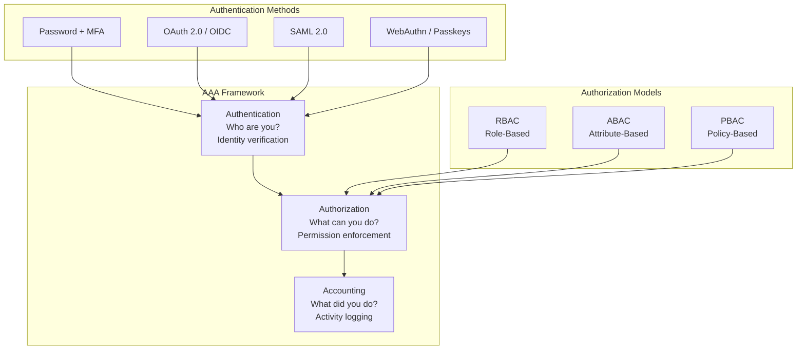

# Authentication, Authorization, and Access Control

An in-depth technical analysis of AAA frameworks for expert practitioners, exploring modern authentication mechanisms, authorization models, access control paradigms, and their implementation patterns with Node.js examples.

<figure>



<figcaption>AAA (Authentication, Authorization, Accounting) framework with authentication methods and authorization models</figcaption>

</figure>

## TLDR

**Authentication, Authorization, and Access Control (AAA)** forms the security foundation of every application, determining who can access what resources through identity verification, permission enforcement, and activity auditing.

### Core Concepts

- **Authentication (AuthN)**: Verifies identity—"Who are you?" through credentials, tokens, or biometrics
- **Authorization (AuthZ)**: Enforces permissions—"What can you do?" based on roles, attributes, or policies
- **Accounting/Auditing**: Records activity—"What did you do?" for compliance and forensics
- **Principle of Least Privilege**: Grant minimum necessary permissions, revoke promptly when no longer needed

### Authentication Mechanisms

- **Password + MFA**: Bcrypt/Argon2 hashing with TOTP/WebAuthn second factor; 12+ salt rounds recommended
- **OAuth 2.0**: Authorization framework for delegated access; Authorization Code flow for web apps, PKCE for SPAs/mobile
- **OpenID Connect (OIDC)**: Identity layer on OAuth 2.0; provides ID tokens with user claims
- **SAML 2.0**: Enterprise SSO standard; XML-based, common in B2B; IdP-initiated vs SP-initiated flows
- **WebAuthn/Passkeys**: Phishing-resistant passwordless authentication using public key cryptography

### Authorization Models

- **RBAC (Role-Based)**: Permissions assigned to roles, roles assigned to users; simple hierarchy, works for most apps
- **ABAC (Attribute-Based)**: Dynamic permissions based on subject/resource/environment attributes; flexible but complex
- **Policy-Based**: Externalized policies (OPA, Cedar); separation of policy and code; audit-friendly
- **Zero Trust**: "Never trust, always verify"—continuous authentication based on device, location, behavior

### JWT Best Practices

- **Short-lived access tokens**: 15-30 minutes; forces regular refresh and reduces exposure window
- **Refresh token rotation**: Issue new refresh token on each use; detect reuse attacks
- **Secure storage**: HttpOnly cookies for web; Keychain/Keystore for mobile; never localStorage
- **Algorithm pinning**: Explicitly verify `alg` header; reject `none` algorithm; prefer RS256 over HS256

### Implementation Security

- **Token validation**: Verify signature, issuer, audience, expiration on every request
- **Session management**: Secure session IDs, absolute timeout, re-authenticate for sensitive operations
- **Password policies**: Minimum length (12+), check against breach databases, no composition rules
- **Rate limiting**: Exponential backoff on failed attempts, account lockout with recovery

## Core Concepts and Definitions

### Authentication vs Authorization vs Access Control

**Authentication** is the process of verifying the identity of a user, device, or system to ensure they are who they claim to be. It answers the question "Who are you?" and involves validating credentials such as passwords, biometric data, or cryptographic tokens.

**Authorization** determines what an authenticated entity is permitted to access or what actions they can perform within a system. It answers the question "What are you allowed to do?" and occurs after successful authentication.

**Access Control** encompasses the broader framework that combines authentication and authorization policies to enforce security decisions. It includes the mechanisms, policies, and technologies used to manage and control access to resources.

### The AAA Framework

The AAA framework extends beyond basic authentication and authorization:

- **Authentication**: Identity verification
- **Authorization**: Permission enforcement
- **Accounting/Auditing**: Activity logging and monitoring

This framework ensures comprehensive security coverage from initial identity verification through ongoing activity monitoring.

---

## Authentication Mechanisms

### Password-Based Authentication

Traditional username/password authentication remains prevalent despite inherent vulnerabilities. Modern implementations require secure password storage using adaptive hashing functions.

#### Bcrypt Implementation in Node.js

```javascript
const bcrypt = require("bcrypt")

class PasswordManager {
  constructor() {
    this.saltRounds = 12 // Adjust based on security requirements
  }

  async hashPassword(plainPassword) {
    try {
      const salt = await bcrypt.genSalt(this.saltRounds)
      const hashedPassword = await bcrypt.hash(plainPassword, salt)
      return hashedPassword
    } catch (error) {
      throw new Error("Password hashing failed")
    }
  }

  async verifyPassword(plainPassword, hashedPassword) {
    try {
      return await bcrypt.compare(plainPassword, hashedPassword)
    } catch (error) {
      throw new Error("Password verification failed")
    }
  }
}

// Usage example
const passwordManager = new PasswordManager()

// During registration
const hashedPassword = await passwordManager.hashPassword("userPassword123")

// During login
const isValid = await passwordManager.verifyPassword("userPassword123", hashedPassword)
```

### Multi-Factor Authentication (MFA)

MFA implementations leverage multiple authentication factors categorized into:

1. **Something You Know** (Knowledge): Passwords, PINs, security questions
2. **Something You Have** (Possession): Hardware tokens, mobile devices, smart cards
3. **Something You Are** (Inherence): Biometric traits like fingerprints, facial recognition

#### Time-based One-Time Password (TOTP) Implementation

```javascript
const speakeasy = require("speakeasy")
const QRCode = require("qrcode")

class TOTPManager {
  generateSecret(userEmail, serviceName) {
    return speakeasy.generateSecret({
      name: userEmail,
      issuer: serviceName,
      length: 32,
    })
  }

  async generateQRCode(secret) {
    const otpauthURL = speakeasy.otpauthURL({
      secret: secret.ascii,
      label: secret.name,
      issuer: secret.issuer,
      algorithm: "sha1",
    })

    return await QRCode.toDataURL(otpauthURL)
  }

  verifyTOTP(token, secret) {
    return speakeasy.totp.verify({
      secret: secret,
      encoding: "ascii",
      token: token,
      window: 2, // Allow 2-step tolerance
    })
  }
}

// Usage in Express middleware
const totpManager = new TOTPManager()

app.post("/enable-mfa", async (req, res) => {
  const { userId } = req.body
  const secret = totpManager.generateSecret(req.user.email, "YourServiceName")

  // Store secret in database associated with user
  await User.updateOne({ _id: userId }, { totpSecret: secret.base32, mfaEnabled: false })

  const qrCode = await totpManager.generateQRCode(secret)
  res.json({ qrCode, secret: secret.base32 })
})

app.post("/verify-mfa", async (req, res) => {
  const { token } = req.body
  const user = await User.findById(req.user.id)

  const verified = totpManager.verifyTOTP(token, user.totpSecret)

  if (verified) {
    await User.updateOne({ _id: req.user.id }, { mfaEnabled: true })
    res.json({ success: true })
  } else {
    res.status(400).json({ error: "Invalid token" })
  }
})
```

### Biometric Authentication

Biometric authentication leverages unique physiological or behavioral characteristics:

#### Web Authentication API (WebAuthn) Implementation

```javascript
// Client-side WebAuthn registration
class WebAuthnManager {
  async registerCredential(userInfo) {
    try {
      // Get challenge from server
      const challengeResponse = await fetch("/webauthn/register/begin", {
        method: "POST",
        headers: { "Content-Type": "application/json" },
        body: JSON.stringify({ username: userInfo.username }),
      })

      const challenge = await challengeResponse.json()

      // Create credential
      const credential = await navigator.credentials.create({
        publicKey: {
          challenge: new Uint8Array(challenge.challenge),
          rp: { name: "Your Service" },
          user: {
            id: new TextEncoder().encode(userInfo.username),
            name: userInfo.username,
            displayName: userInfo.displayName,
          },
          pubKeyCredParams: [{ alg: -7, type: "public-key" }],
          authenticatorSelection: {
            authenticatorAttachment: "platform",
            userVerification: "required",
          },
        },
      })

      // Send credential to server
      const registrationResponse = await fetch("/webauthn/register/finish", {
        method: "POST",
        headers: { "Content-Type": "application/json" },
        body: JSON.stringify({
          id: credential.id,
          rawId: Array.from(new Uint8Array(credential.rawId)),
          response: {
            clientDataJSON: Array.from(new Uint8Array(credential.response.clientDataJSON)),
            attestationObject: Array.from(new Uint8Array(credential.response.attestationObject)),
          },
        }),
      })

      return await registrationResponse.json()
    } catch (error) {
      console.error("WebAuthn registration failed:", error)
      throw error
    }
  }
}
```

---

## Authorization Models and Frameworks

### Role-Based Access Control (RBAC)

RBAC assigns permissions to roles rather than individual users, simplifying permission management in large organizations.

#### RBAC Implementation in Node.js

```javascript
class RBACManager {
  constructor() {
    this.roles = new Map()
    this.userRoles = new Map()
    this.permissions = new Map()
  }

  defineRole(roleName, permissions = []) {
    this.roles.set(roleName, new Set(permissions))
    return this
  }

  assignRoleToUser(userId, roleName) {
    if (!this.userRoles.has(userId)) {
      this.userRoles.set(userId, new Set())
    }
    this.userRoles.get(userId).add(roleName)
    return this
  }

  getUserPermissions(userId) {
    const userRoles = this.userRoles.get(userId) || new Set()
    const permissions = new Set()

    for (const role of userRoles) {
      const rolePermissions = this.roles.get(role) || new Set()
      for (const permission of rolePermissions) {
        permissions.add(permission)
      }
    }

    return permissions
  }

  hasPermission(userId, requiredPermission) {
    const userPermissions = this.getUserPermissions(userId)
    return userPermissions.has(requiredPermission)
  }

  middleware(requiredPermission) {
    return (req, res, next) => {
      const userId = req.user?.id

      if (!userId) {
        return res.status(401).json({ error: "Authentication required" })
      }

      if (!this.hasPermission(userId, requiredPermission)) {
        return res.status(403).json({ error: "Insufficient permissions" })
      }

      next()
    }
  }
}

// Usage example
const rbac = new RBACManager()

// Define roles and permissions
rbac
  .defineRole("admin", ["user:create", "user:read", "user:update", "user:delete"])
  .defineRole("moderator", ["user:read", "user:update"])
  .defineRole("user", ["user:read"])

// Assign roles to users
rbac.assignRoleToUser("user123", "admin").assignRoleToUser("user456", "moderator")

// Use in Express routes
app.get("/admin/users", rbac.middleware("user:read"), (req, res) => {
  // Handle admin user listing
})

app.delete("/admin/users/:id", rbac.middleware("user:delete"), (req, res) => {
  // Handle user deletion
})
```

### Attribute-Based Access Control (ABAC)

ABAC provides fine-grained access control using attributes of users, resources, and environmental factors.

#### ABAC Policy Engine Implementation

```javascript
class ABACPolicyEngine {
  constructor() {
    this.policies = []
  }

  addPolicy(policy) {
    this.policies.push(policy)
    return this
  }

  evaluate(subject, resource, action, environment = {}) {
    for (const policy of this.policies) {
      const result = this.evaluatePolicy(policy, subject, resource, action, environment)
      if (result === "PERMIT") return true
      if (result === "DENY") return false
    }
    return false // Default deny
  }

  evaluatePolicy(policy, subject, resource, action, environment) {
    try {
      // Evaluate policy conditions
      const context = {
        subject,
        resource,
        action,
        environment,
        time: new Date(),
        // Helper functions
        hasAttribute: (obj, attr) => obj && obj[attr] !== undefined,
        inRange: (value, min, max) => value >= min && value <= max,
      }

      return policy.condition(context) ? policy.effect : "NOT_APPLICABLE"
    } catch (error) {
      console.error("Policy evaluation error:", error)
      return "DENY"
    }
  }

  middleware() {
    return (req, res, next) => {
      const subject = {
        id: req.user?.id,
        role: req.user?.role,
        department: req.user?.department,
        clearanceLevel: req.user?.clearanceLevel,
      }

      const resource = {
        type: req.route?.path,
        owner: req.params?.userId,
        classification: req.body?.classification,
      }

      const action = req.method.toLowerCase()

      const environment = {
        ipAddress: req.ip,
        time: new Date(),
        userAgent: req.get("User-Agent"),
      }

      if (this.evaluate(subject, resource, action, environment)) {
        next()
      } else {
        res.status(403).json({ error: "Access denied by policy" })
      }
    }
  }
}

// Usage example
const abac = new ABACPolicyEngine()

// Define policies
abac.addPolicy({
  name: "AdminFullAccess",
  condition: ({ subject }) => subject.role === "admin",
  effect: "PERMIT",
})

abac.addPolicy({
  name: "UserSelfAccess",
  condition: ({ subject, resource, action }) =>
    subject.role === "user" && resource.owner === subject.id && ["get", "put"].includes(action),
  effect: "PERMIT",
})

abac.addPolicy({
  name: "WorkingHoursOnly",
  condition: ({ environment }) => {
    const hour = environment.time.getHours()
    return hour >= 9 && hour <= 17
  },
  effect: "DENY",
})

// Apply to routes
app.use("/api/sensitive", abac.middleware())
```

---

## Access Control Models

### Bell-LaPadula Model

Focuses on confidentiality with rules:

- **No Read Up**: Users cannot read data at higher classification levels
- **No Write Down**: Users cannot write data to lower classification levels

### Biba Integrity Model

Focuses on data integrity with rules:

- **No Read Down**: Users cannot read data at lower integrity levels
- **No Write Up**: Users cannot write data to higher integrity levels

### Clark-Wilson Model

Enforces integrity through well-formed transactions and separation of duties.

---

## Modern Authentication Protocols

### JSON Web Tokens (JWT)

JWT provides a compact, URL-safe means of representing claims between parties.

#### JWT Implementation with Advanced Features

```javascript
const jwt = require("jsonwebtoken")
const crypto = require("crypto")

class JWTManager {
  constructor(options = {}) {
    this.accessTokenSecret = options.accessTokenSecret || process.env.JWT_ACCESS_SECRET
    this.refreshTokenSecret = options.refreshTokenSecret || process.env.JWT_REFRESH_SECRET
    this.accessTokenExpiry = options.accessTokenExpiry || "15m"
    this.refreshTokenExpiry = options.refreshTokenExpiry || "7d"
    this.issuer = options.issuer || "your-service"
    this.audience = options.audience || "your-app"
  }

  generateTokenPair(payload) {
    const jti = crypto.randomUUID()
    const now = Math.floor(Date.now() / 1000)

    const accessToken = jwt.sign(
      {
        ...payload,
        type: "access",
        jti,
        iat: now,
        iss: this.issuer,
        aud: this.audience,
      },
      this.accessTokenSecret,
      {
        expiresIn: this.accessTokenExpiry,
        algorithm: "HS256",
      },
    )

    const refreshToken = jwt.sign(
      {
        userId: payload.userId,
        type: "refresh",
        jti,
        iat: now,
        iss: this.issuer,
        aud: this.audience,
      },
      this.refreshTokenSecret,
      {
        expiresIn: this.refreshTokenExpiry,
        algorithm: "HS256",
      },
    )

    return { accessToken, refreshToken, jti }
  }

  verifyAccessToken(token) {
    try {
      const decoded = jwt.verify(token, this.accessTokenSecret, {
        issuer: this.issuer,
        audience: this.audience,
      })

      if (decoded.type !== "access") {
        throw new Error("Invalid token type")
      }

      return decoded
    } catch (error) {
      throw new Error("Invalid access token")
    }
  }

  middleware() {
    return (req, res, next) => {
      const authHeader = req.headers.authorization

      if (!authHeader || !authHeader.startsWith("Bearer ")) {
        return res.status(401).json({ error: "No token provided" })
      }

      const token = authHeader.substring(7)

      try {
        const decoded = this.verifyAccessToken(token)
        req.user = decoded
        next()
      } catch (error) {
        return res.status(401).json({ error: "Invalid token" })
      }
    }
  }
}

// Token refresh endpoint
const jwtManager = new JWTManager()

app.post("/auth/refresh", async (req, res) => {
  const { refreshToken } = req.body

  if (!refreshToken) {
    return res.status(401).json({ error: "Refresh token required" })
  }

  try {
    const decoded = jwtManager.verifyRefreshToken(refreshToken)

    // Check if refresh token is revoked (implement token blacklist)
    const isRevoked = await checkTokenRevocation(decoded.jti)
    if (isRevoked) {
      return res.status(401).json({ error: "Token revoked" })
    }

    // Get user data and generate new tokens
    const user = await User.findById(decoded.userId)
    if (!user) {
      return res.status(401).json({ error: "User not found" })
    }

    const { accessToken, refreshToken: newRefreshToken } = jwtManager.generateTokenPair({
      userId: user._id,
      email: user.email,
      role: user.role,
    })

    // Revoke old refresh token
    await revokeToken(decoded.jti)

    res.json({
      accessToken,
      refreshToken: newRefreshToken,
    })
  } catch (error) {
    res.status(401).json({ error: "Invalid refresh token" })
  }
})
```

### OAuth 2.0 Implementation

OAuth 2.0 provides authorization framework enabling third-party applications to obtain limited access to user accounts.

#### OAuth 2.0 Authorization Code Flow

```javascript
const express = require("express")
const crypto = require("crypto")
const axios = require("axios")

class OAuth2Provider {
  constructor(options) {
    this.clientId = options.clientId
    this.clientSecret = options.clientSecret
    this.redirectUri = options.redirectUri
    this.authorizationEndpoint = options.authorizationEndpoint
    this.tokenEndpoint = options.tokenEndpoint
    this.userInfoEndpoint = options.userInfoEndpoint
    this.scope = options.scope || "openid profile email"
  }

  generateAuthorizationUrl() {
    const state = crypto.randomBytes(16).toString("hex")
    const nonce = crypto.randomBytes(16).toString("hex")

    const params = new URLSearchParams({
      response_type: "code",
      client_id: this.clientId,
      redirect_uri: this.redirectUri,
      scope: this.scope,
      state,
      nonce,
    })

    return {
      url: `${this.authorizationEndpoint}?${params}`,
      state,
      nonce,
    }
  }

  async exchangeCodeForTokens(code, state, savedState) {
    if (state !== savedState) {
      throw new Error("Invalid state parameter")
    }

    try {
      const response = await axios.post(
        this.tokenEndpoint,
        {
          grant_type: "authorization_code",
          client_id: this.clientId,
          client_secret: this.clientSecret,
          code,
          redirect_uri: this.redirectUri,
        },
        {
          headers: {
            "Content-Type": "application/x-www-form-urlencoded",
          },
        },
      )

      return response.data
    } catch (error) {
      throw new Error("Token exchange failed")
    }
  }
}

// Express routes for OAuth flow
const oauth2 = new OAuth2Provider({
  clientId: process.env.OAUTH_CLIENT_ID,
  clientSecret: process.env.OAUTH_CLIENT_SECRET,
  redirectUri: process.env.OAUTH_REDIRECT_URI,
  authorizationEndpoint: "https://accounts.google.com/o/oauth2/v2/auth",
  tokenEndpoint: "https://oauth2.googleapis.com/token",
  userInfoEndpoint: "https://www.googleapis.com/oauth2/v2/userinfo",
})

app.get("/auth/oauth/login", (req, res) => {
  const { url, state, nonce } = oauth2.generateAuthorizationUrl()

  // Store state and nonce in session
  req.session.oauthState = state
  req.session.oauthNonce = nonce

  res.redirect(url)
})
```

---

## Implementation Patterns with Node.js

### Comprehensive Authentication Middleware

```javascript
const passport = require("passport")
const LocalStrategy = require("passport-local").Strategy
const JwtStrategy = require("passport-jwt").Strategy
const ExtractJwt = require("passport-jwt").ExtractJwt

class AuthenticationManager {
  constructor(options = {}) {
    this.jwtManager = options.jwtManager
    this.rbacManager = options.rbacManager
    this.setupStrategies()
  }

  setupStrategies() {
    // Local Strategy
    passport.use(
      new LocalStrategy(
        {
          usernameField: "email",
          passwordField: "password",
        },
        async (email, password, done) => {
          try {
            const user = await User.findOne({ email }).select("+password")
            if (!user) {
              return done(null, false, { message: "Invalid credentials" })
            }

            const isValid = await user.comparePassword(password)
            if (!isValid) {
              return done(null, false, { message: "Invalid credentials" })
            }

            return done(null, user)
          } catch (error) {
            return done(error)
          }
        },
      ),
    )

    // JWT Strategy
    passport.use(
      new JwtStrategy(
        {
          jwtFromRequest: ExtractJwt.fromExtractors([
            ExtractJwt.fromAuthHeaderAsBearerToken(),
            ExtractJwt.fromBodyField("token"),
            this.extractFromCookie,
          ]),
          secretOrKey: process.env.JWT_ACCESS_SECRET,
          issuer: "your-service",
          audience: "your-app",
        },
        async (payload, done) => {
          try {
            const user = await User.findById(payload.userId)
            if (user) {
              return done(null, user)
            }
            return done(null, false)
          } catch (error) {
            return done(error, false)
          }
        },
      ),
    )
  }

  extractFromCookie(req) {
    return req.cookies?.accessToken || null
  }

  requireAuth(strategy = "jwt") {
    return passport.authenticate(strategy, { session: false })
  }

  requirePermission(permission) {
    return [
      this.requireAuth(),
      (req, res, next) => {
        if (this.rbacManager.hasPermission(req.user.id, permission)) {
          next()
        } else {
          res.status(403).json({ error: "Insufficient permissions" })
        }
      },
    ]
  }
}
```

### API Security Middleware Stack

```javascript
const helmet = require("helmet")
const cors = require("cors")
const compression = require("compression")

class SecurityMiddleware {
  static getStack(options = {}) {
    return [
      // Security headers
      helmet({
        contentSecurityPolicy: {
          directives: {
            defaultSrc: ["'self'"],
            styleSrc: ["'self'", "'unsafe-inline'"],
            scriptSrc: ["'self'"],
            imgSrc: ["'self'", "data:", "https:"],
          },
        },
        hsts: {
          maxAge: 31536000,
          includeSubDomains: true,
          preload: true,
        },
      }),

      // CORS configuration
      cors({
        origin: options.allowedOrigins || ["http://localhost:3000"],
        credentials: true,
        optionsSuccessStatus: 200,
      }),

      // Request compression
      compression(),

      // Request size limits
      express.json({ limit: options.jsonLimit || "10mb" }),
      express.urlencoded({
        extended: false,
        limit: options.urlEncodedLimit || "10mb",
      }),

      // Custom security middleware
      this.xssProtection(),
      this.sqlInjectionProtection(),
      this.requestLogging(),
      this.errorHandling(),
    ]
  }

  static xssProtection() {
    return (req, res, next) => {
      const xss = require("xss")

      if (req.body && typeof req.body === "object") {
        req.body = this.sanitizeObject(req.body, xss)
      }

      if (req.query && typeof req.query === "object") {
        req.query = this.sanitizeObject(req.query, xss)
      }

      next()
    }
  }

  static sanitizeObject(obj, xss) {
    const sanitized = {}
    for (const [key, value] of Object.entries(obj)) {
      if (typeof value === "string") {
        sanitized[key] = xss(value)
      } else if (typeof value === "object" && value !== null) {
        sanitized[key] = this.sanitizeObject(value, xss)
      } else {
        sanitized[key] = value
      }
    }
    return sanitized
  }
}
```

---

## Security Best Practices

### Password Security

1. **Use Adaptive Hashing**: Implement bcrypt, scrypt, or Argon2 with appropriate cost factors
2. **Enforce Strong Passwords**: Minimum complexity requirements and length
3. **Password History**: Prevent reuse of recent passwords
4. **Account Lockout**: Temporary lockout after failed attempts

### Token Security

1. **Short-lived Access Tokens**: 15-30 minutes expiration
2. **Secure Refresh Tokens**: Long-lived but revocable
3. **Token Rotation**: Issue new refresh token on each use
4. **Secure Storage**: HttpOnly cookies for web, Keychain/Keystore for mobile

### Transport Security

1. **TLS/SSL Encryption**: HTTPS everywhere with HSTS
2. **Certificate Pinning**: For mobile applications
3. **Perfect Forward Secrecy**: Use ECDHE cipher suites

### Input Validation and Sanitization

```javascript
const joi = require("joi")

class ValidationMiddleware {
  static validate(schema, property = "body") {
    return (req, res, next) => {
      const { error, value } = schema.validate(req[property])

      if (error) {
        const details = error.details.map((detail) => ({
          field: detail.path.join("."),
          message: detail.message,
        }))

        return res.status(400).json({
          error: "Validation failed",
          details,
        })
      }

      req[property] = value
      next()
    }
  }
}

// Usage schemas
const schemas = {
  login: joi.object({
    email: joi.string().email().required(),
    password: joi.string().min(8).required(),
    rememberMe: joi.boolean().optional(),
  }),

  register: joi.object({
    email: joi.string().email().required(),
    password: joi
      .string()
      .min(8)
      .pattern(/^(?=.*[a-z])(?=.*[A-Z])(?=.*\d)(?=.*[@$!%*?&])[A-Za-z\d@$!%*?&]/)
      .required(),
    confirmPassword: joi.ref("password"),
    name: joi.string().min(2).max(50).required(),
  }),
}

// Apply validation
app.post("/auth/login", ValidationMiddleware.validate(schemas.login), authController.login)
```

---

## Emerging Paradigms and Zero Trust

### Zero Trust Architecture Principles

1. **Never Trust, Always Verify**: Authenticate and authorize every request
2. **Least Privilege Access**: Minimum required permissions
3. **Assume Breach**: Design for compromise scenarios
4. **Verify Explicitly**: Use all available data points for decisions

### Zero Trust Implementation

```javascript
class ZeroTrustGateway {
  constructor(options = {}) {
    this.riskEngine = options.riskEngine
    this.policyEngine = options.policyEngine
    this.contextAnalyzer = options.contextAnalyzer
  }

  async evaluateRequest(req, res, next) {
    try {
      // Collect request context
      const context = await this.contextAnalyzer.analyze(req)

      // Calculate risk score
      const riskScore = await this.riskEngine.calculate(context)

      // Apply policies
      const policyDecision = await this.policyEngine.evaluate(context, riskScore)

      // Enforce decision
      switch (policyDecision.action) {
        case "allow":
          req.zeroTrust = { riskScore, context }
          next()
          break

        case "challenge":
          this.requireAdditionalAuth(req, res, policyDecision)
          break

        case "deny":
          res.status(403).json({
            error: "Access denied",
            reason: policyDecision.reason,
          })
          break

        default:
          res.status(500).json({ error: "Policy evaluation failed" })
      }
    } catch (error) {
      console.error("Zero Trust evaluation error:", error)
      res.status(500).json({ error: "Security evaluation failed" })
    }
  }
}

class RiskEngine {
  async calculate(context) {
    let riskScore = 0

    // Location-based risk
    if (context.geolocation?.isUnusualLocation) {
      riskScore += 30
    }

    // Device-based risk
    if (!context.device?.isRecognized) {
      riskScore += 25
    }

    // Behavioral risk
    if (context.behavior?.isAnomalous) {
      riskScore += 35
    }

    // Network-based risk
    if (context.network?.isSuspicious) {
      riskScore += 40
    }

    return Math.min(riskScore, 100)
  }
}
```

---

## Conclusion

This comprehensive guide has explored the multifaceted landscape of Authentication, Authorization, and Access Control in modern applications. As cyber threats continue to evolve and organizational security requirements become more stringent, implementing robust AAA frameworks is no longer optional but essential.

### Key Takeaways

1. **Defense in Depth**: No single authentication mechanism is sufficient; layer multiple approaches for comprehensive security
2. **Context-Aware Security**: Modern applications must consider user context, device trust, and behavioral patterns
3. **Zero Trust Principles**: Assume breach scenarios and verify every access attempt
4. **Adaptive Authentication**: Adjust security measures based on risk assessment
5. **Continuous Monitoring**: Security is an ongoing process requiring constant vigilance

### Future Trends

- **Passwordless Authentication**: Growing adoption of biometric and hardware-based authentication
- **AI-Driven Risk Assessment**: Machine learning for behavioral analysis and threat detection
- **Decentralized Identity**: Blockchain-based identity management and self-sovereign identity
- **Privacy-Preserving Authentication**: Zero-knowledge proofs and homomorphic encryption

### Implementation Recommendations

1. Start with strong foundations: secure password storage, HTTPS everywhere, and proper session management
2. Implement MFA for all privileged accounts and sensitive operations
3. Design with Zero Trust principles from the beginning
4. Use established protocols (OAuth 2.0, SAML, OpenID Connect) rather than custom solutions
5. Regularly audit and update authentication mechanisms
6. Plan for incident response and account recovery procedures
7. Educate users about security best practices

The landscape of authentication and authorization continues to evolve rapidly. Organizations must balance security, usability, and privacy while staying current with emerging threats and technologies. By implementing the patterns and practices outlined in this document, development teams can build robust, scalable, and secure authentication systems that protect users and organizational assets.

Remember that security is not a destination but a journey. Continuous improvement, regular security assessments, and staying informed about emerging threats and technologies are essential for maintaining effective authentication, authorization, and access control systems.

## References

- [OAuth 2.0 RFC 6749](https://datatracker.ietf.org/doc/html/rfc6749) - IETF Authorization Framework specification
- [OpenID Connect Core 1.0](https://openid.net/specs/openid-connect-core-1_0.html) - Identity layer on OAuth 2.0
- [SAML 2.0 Technical Overview](https://docs.oasis-open.org/security/saml/Post2.0/sstc-saml-tech-overview-2.0.html) - OASIS Security Assertion Markup Language
- [JWT RFC 7519](https://datatracker.ietf.org/doc/html/rfc7519) - JSON Web Token specification
- [NIST Digital Identity Guidelines (SP 800-63)](https://pages.nist.gov/800-63-3/) - Authentication assurance levels and requirements
- [WebAuthn Specification](https://www.w3.org/TR/webauthn-2/) - W3C Web Authentication API
- [OWASP Authentication Cheat Sheet](https://cheatsheetseries.owasp.org/cheatsheets/Authentication_Cheat_Sheet.html) - Security best practices
- [OWASP Authorization Cheat Sheet](https://cheatsheetseries.owasp.org/cheatsheets/Authorization_Cheat_Sheet.html) - Access control guidelines
- [Zero Trust Architecture (NIST SP 800-207)](https://csrc.nist.gov/publications/detail/sp/800-207/final) - NIST Zero Trust framework
