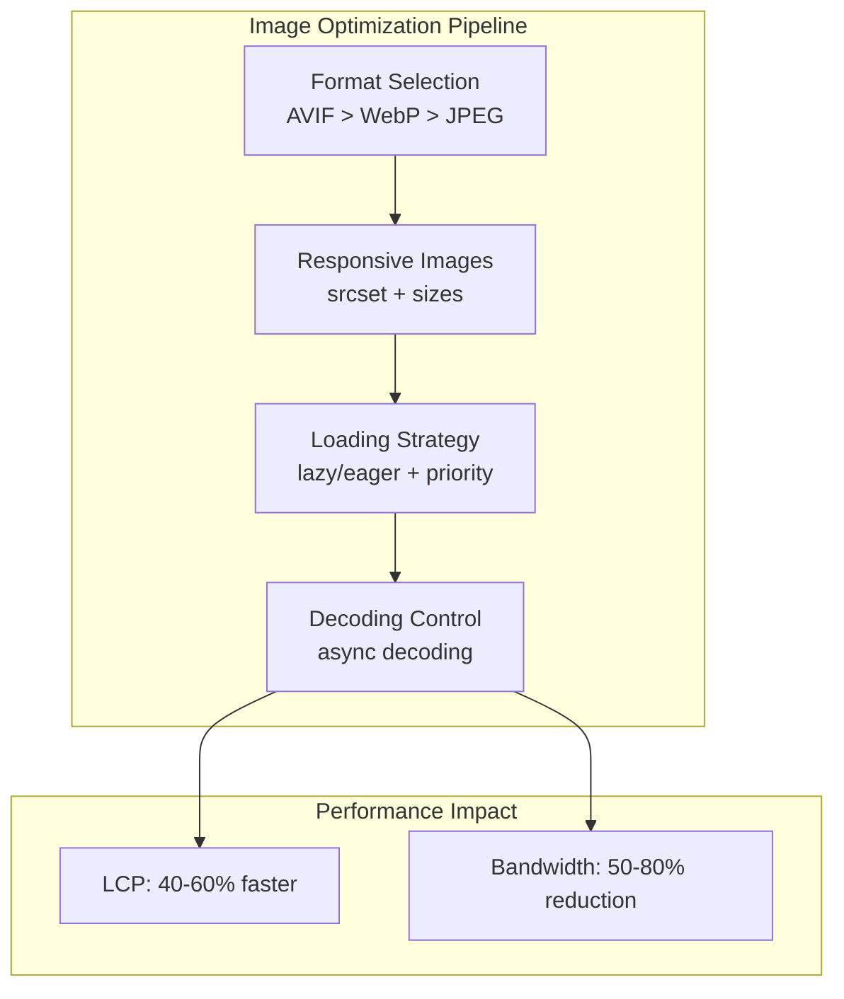

# Image Optimization for Web Performance

Master responsive image techniques, modern formats like AVIF and WebP, lazy loading strategies, and compression algorithms to reduce bandwidth by 50-80% and dramatically improve Core Web Vitals.

<figure>



<figcaption>Image optimization pipeline showing format selection, responsive sizing, loading strategies, and their impact on Core Web Vitals</figcaption>

</figure>

## TLDR

**Image optimization** delivers 50-80% bandwidth reduction through modern formats (AVIF, WebP), responsive sizing, and strategic loading patterns while significantly improving LCP.

### Format Selection

- **AVIF**: 1.5-2× smaller than JPEG, supports HDR and alpha; 90%+ browser support
- **WebP**: 1.25-1.34× smaller than JPEG; 96% browser support
- **JPEG/PNG**: Universal fallback for older browsers
- **Progressive enhancement**: Use `<picture>` element for format negotiation

### Responsive Images

- **srcset with width descriptors**: Provide multiple image sizes for browser selection
- **sizes attribute**: Tell browser the rendered size at different viewports
- **Art direction**: Different crops for mobile vs desktop using `<source media="...">`
- **DPR handling**: Browser automatically selects appropriate image for device pixel ratio

### Loading Strategies

- **loading="lazy"**: Defer offscreen images; saves ~50-100KB initial payload
- **loading="eager"**: Load immediately for above-the-fold images
- **fetchpriority="high"**: Prioritize LCP images; improves LCP by 10-25%
- **decoding="async"**: Offload decode work; improves LCP by up to 20%

### Best Practices

- **Above-the-fold**: Use `loading="eager"`, `fetchpriority="high"`, `decoding="async"`
- **Below-the-fold**: Use `loading="lazy"`, `decoding="async"`, `fetchpriority="auto"`
- **Preload LCP images**: `<link rel="preload" as="image" href="..." fetchpriority="high">`
- **Always set dimensions**: Prevent CLS with explicit width/height attributes

## Part 1: Image Formats Deep-Dive

### 1.1 Format Comparison Table

| Format        | Compression vs JPEG | Lossy/Lossless | Color Depth (bits/chan) | HDR & Wide Gamut | Alpha Support | Progressive/Interlace | Best Use Case                | Fallback     |
| ------------- | ------------------- | -------------- | ----------------------- | ---------------- | ------------- | --------------------- | ---------------------------- | ------------ |
| **JPEG**      | 1×                  | Lossy          | 8                       | No               | No            | Progressive JPEG      | Photographs, ubiquity        | JPEG         |
| **PNG-1.3**   | n/a (lossless)      | Lossless       | 1,2,4,8,16              | No               | Yes           | Adam7 interlace       | Graphics, logos, screenshots | PNG          |
| **WebP**      | 1.25–1.34× smaller  | Both           | 8, (10 via ICC)         | No               | Yes           | None (in-band frames) | Web delivery of photos & UI  | JPEG/PNG     |
| **AVIF**      | 1.3–1.5× smaller    | Both           | 8,10,12                 | PQ/HLG BT.2100   | Yes           | AV1 tile‐based        | HDR photography, rich media  | WebP → JPEG  |
| **JPEG XL**   | 1.2–1.5× smaller    | Both           | up to 32                | Full Rec.2100    | Yes           | Saliency‐based prog.  | Web migration, archiving     | JPEG/WebP    |
| **HEIF/HEIC** | ~2× smaller vs JPEG | Lossy/Lossless | up to 16                | Yes              | Yes           | None                  | iOS/macOS photos, bursts     | JPEG/PNG     |
| **GIF**       | Limited             | Lossless       | 8-color palette         | No               | 1-bit         | 4-pass interlace      | Simple animations            | Animated PNG |

### 1.2 JPEG (ISO/IEC 10918-1)

JPEG remains the most widely supported image format, making it the universal fallback for web delivery.

**Compression Pipeline:**
1. **Color Space Conversion**: RGB → YCbCr with 4:2:0 chroma subsampling
2. **Block Division**: 8×8 pixel blocks
3. **DCT Transform**: Discrete Cosine Transform on each block
4. **Quantization**: Quality factor (0-100) scales quantization matrices
5. **Entropy Coding**: Zig-zag scan → Huffman coding

**Progressive JPEG:** Uses spectral selection and successive approximation for incremental rendering. First pass shows blurry full image, subsequent passes add detail.

**Trade-offs:**
- Blocking artifacts at high compression ratios
- No alpha channel support
- Limited to 8-bit color depth
- Universal browser support (100%)

**Use Case:** Photographic images requiring maximum compatibility.

### 1.3 PNG 1.3 (ISO/IEC 15948)

PNG provides lossless compression with transparency support, making it ideal for graphics, logos, and screenshots.

**Compression Pipeline:**
1. **Filtering**: One of five prediction filters per scanline
2. **DEFLATE**: LZ77 + Huffman coding

**Key Features:**
- **Bit Depth**: 1, 2, 4, 8, or 16 bits per channel
- **Color Types**: Grayscale, truecolor, indexed, grayscale+alpha, truecolor+alpha
- **Adam7 Interlacing**: Seven-pass progressive display
- **Full Alpha**: 8 or 16-bit transparency channel

**Trade-offs:**
- Larger files than lossy formats for photographs
- No HDR support
- No animation support (use APNG for animation)

**Use Case:** Graphics with transparency, text overlays, screenshots, logos.

### 1.4 WebP (IETF RFC 6386/6387)

WebP offers both lossy and lossless modes with excellent compression, making it the primary modern format for web delivery.

**Architecture:**

**Lossy Mode (VP8):**
- 16×16 macroblocks with intra-frame prediction
- Residual DCT transformation
- VP8-style entropy coding
- 25-34% smaller than JPEG at equivalent SSIM

**Lossless Mode (VP8L):**
- Predictive coding with local palettes
- Huffman entropy coding
- Superior to PNG for most use cases

**Key Features:**
- Full 8-bit alpha channel support
- Animation support via frame differencing
- Both lossy and lossless in single format

**Trade-offs:**
- No HDR support
- No progressive loading (loads frame-by-frame)
- 96%+ browser support

**Use Case:** General web delivery for photos and UI elements.

### 1.5 AVIF (AV1 in HEIF)

AVIF leverages AV1 video codec technology to achieve the highest compression efficiency currently available for web images.

**Architecture:**
- **Container**: ISOBMFF HEIF container
- **Codec**: AV1 intra-frame encoding
- **Features**: Tiles, transforms, CDEF, loop restoration, CABAC entropy coding

**Key Features:**
- **Color Depth**: 8, 10, or 12 bits per channel
- **HDR Support**: PQ/HLG transfer functions, BT.2100 wide gamut
- **Film Grain Synthesis**: Preserve film-like texture at lower bitrates
- **30-50% smaller** than JPEG at equivalent quality

**Trade-offs:**
- Encoding is 8-10× slower than JPEG
- Multi-threaded decoding available
- 90%+ browser support

**Use Case:** HDR photography, immersive media, highest quality web delivery.

### 1.6 JPEG XL (ISO/IEC 18181)

JPEG XL is designed as the next-generation format with unique features like lossless JPEG transcoding.

**Modes:**
- **VarDCT**: Variable block-size DCT (2-256 pixels), XYB color quantization
- **Modular**: FLIF-inspired lossless with adaptive quantization

**Key Features:**
- Lossless JPEG transcoding with 20% size reduction
- Up to 32 bits per channel
- Full Rec.2100 HDR support
- Saliency-based progressive decoding

**Performance:**
- Decode: >132 MP/s
- Encode: ~50 MP/s (libjxl reference)

**Trade-offs:**
- Limited browser support (experimental in some browsers)
- Licensing fully open (royalty-free)

**Use Case:** Future-proof archival, web migration from JPEG legacy.

### 1.7 Other Formats

**HEIF/HEIC:**
- iOS/macOS default format
- ~50% smaller than JPEG
- HEVC-based (licensing concerns)
- Limited non-Apple browser support

**JPEG 2000:**
- DWT-based compression
- Resolution and quality progressive
- High computational complexity
- Used in digital cinema, medical imaging

**GIF:**
- LZW compression, 256-color palette
- Frame animation support
- Largely superseded by WebP/MP4 for animation

### 1.8 Compression Algorithm Comparison

| Algorithm | Typical Compression | Encoding Speed | Decoding Speed | Progressive Support |
|-----------|---------------------|----------------|----------------|---------------------|
| **JPEG DCT** | Moderate | Fast | Fast | Spectral selection |
| **PNG DEFLATE** | Good (lossless) | Moderate | Fast | Adam7 interlace |
| **WebP VP8** | Good | 2-3× JPEG | Fast | None |
| **AVIF AV1** | Excellent | 8-10× JPEG | Moderate | Tile-based |
| **JPEG XL** | Excellent | Moderate | Fast | Saliency-based |

## Part 2: Responsive Image Implementation

### 2.1 srcset and Width Descriptors

The `srcset` attribute provides the browser with multiple image candidates for selection based on viewport and device characteristics.

**Width descriptors (`w`)** specify intrinsic pixel widths:

```html

```

**How the browser selects:**
1. Calculate display size: CSS size × device pixel ratio (DPR)
2. Find candidates in srcset ≥ calculated size
3. Select smallest candidate that meets requirement

**Example calculation:**
- CSS width: 400px, DPR: 2x
- Required: 400px × 2 = 800px
- Selected: `medium.jpg` (800w)

### 2.2 sizes Media Conditions

The `sizes` attribute tells the browser what size the image will be displayed at different viewport widths:

```html

```

**Selection examples:**
- Viewport 400px → 100vw = 400px → `hero-400.jpg`
- Viewport 800px → 50vw = 400px → `hero-400.jpg`
- Viewport 1400px → 33vw = 467px → `hero-800.jpg`

### 2.3 picture Element and Source Selection

The `<picture>` element enables format negotiation and art direction:

```html
<picture>
  <!-- Art direction: different crop for mobile -->
  <source
    media="(max-width: 768px)"
    srcset="hero-mobile-400.jpg 400w, hero-mobile-600.jpg 600w"
    type="image/jpeg"
  />

  <!-- Format negotiation: AVIF for supported browsers -->
  <source srcset="hero-800.avif 800w, hero-1200.avif 1200w" type="image/avif" />

  <!-- Format negotiation: WebP fallback -->
  <source srcset="hero-800.webp 800w, hero-1200.webp 1200w" type="image/webp" />

  <!-- Final fallback -->
  
</picture>
```

**Selection algorithm:**
1. Evaluate each `<source>`'s `media` attribute
2. Check each `<source>`'s `type` for format support
3. First matching source wins
4. Use srcset to select appropriate size
5. Fall back to `` if no sources match

**Selection matrix:**

| Viewport | AVIF Support | WebP Support | Selected Format |
|----------|--------------|--------------|-----------------|
| Mobile   | Yes          | -            | AVIF            |
| Mobile   | No           | Yes          | WebP            |
| Mobile   | No           | No           | JPEG            |
| Desktop  | Yes          | -            | AVIF            |
| Desktop  | No           | Yes          | WebP            |
| Desktop  | No           | No           | JPEG            |

## Part 3: Loading Strategies

### 3.1 Browser Hints (loading, decoding, fetchpriority)

| Attribute | Purpose | Typical Benefit |
|-----------|---------|-----------------|
| `loading="lazy"/"eager"` | Defer offscreen fetch vs immediate | ↓ Initial bytes ~50-100KB |
| `decoding="async"/"sync"` | Offload decode vs main-thread blocking | ↑ LCP by up to 20% |
| `fetchpriority="high"` | Signal importance to fetch scheduler | ↑ LCP by 10-25% |

```html
<!-- Critical above-the-fold image -->


<!-- Below-the-fold image -->

```

### 3.2 Lazy Loading with Intersection Observer

For enhanced control over lazy loading behavior:

```javascript
const io = new IntersectionObserver(
  (entries, obs) => {
    entries.forEach(({ isIntersecting, target }) => {
      if (!isIntersecting) return

      const img = target
      img.src = img.dataset.src

      // Decode image asynchronously
      img.decode()
        .then(() => img.classList.add("loaded"))
        .catch((err) => console.error("Image decode failed:", err))

      obs.unobserve(img)
    })
  },
  {
    rootMargin: "200px", // Start loading 200px before entering viewport
    threshold: 0.1,
  }
)

document.querySelectorAll("img.lazy").forEach((img) => io.observe(img))
```

**Performance gains:**
- Initial payload ↓ ~75KB
- LCP on long pages ↓ 15%

### 3.3 Decoding Control

**HTML hint:**
```html

```

**Programmatic decode:**
```javascript
async function loadDecoded(url) {
  const img = new Image()
  img.src = url

  try {
    await img.decode()
    document.body.append(img)
  } catch (error) {
    console.error("Failed to decode image:", error)
  }
}
```

**Benefit:** Eliminates render-blocking jank, improving LCP by up to 20%.

### 3.4 Fetch Priority for LCP

```html

```

**Benefit:** Pushes LCP image ahead in HTTP/2 queues—LCP ↓ 10-25%.

## Part 4: Advanced Optimization

### 4.1 Server-Side Image Generation

```javascript
// Node.js with Sharp
const sharp = require("sharp")

async function generateResponsiveImages(inputPath, outputDir) {
  const sizes = [400, 800, 1200, 1600]
  const formats = ["webp", "avif"]

  for (const size of sizes) {
    for (const format of formats) {
      await sharp(inputPath)
        .resize(size)
        .toFormat(format)
        .toFile(`${outputDir}/image-${size}.${format}`)
    }
  }
}
```

### 4.2 Client-Side Resizing

```javascript
function resizeImage(file, maxWidth, maxHeight) {
  return new Promise((resolve) => {
    const canvas = document.createElement("canvas")
    const ctx = canvas.getContext("2d")
    const img = new Image()

    img.onload = () => {
      const { width, height } = calculateDimensions(img.width, img.height, maxWidth, maxHeight)

      canvas.width = width
      canvas.height = height
      ctx.drawImage(img, 0, 0, width, height)

      canvas.toBlob(resolve, "image/webp", 0.8)
    }

    img.src = URL.createObjectURL(file)
  })
}
```

### 4.3 Progressive Enhancement for HDR

```html
<picture>
  <!-- High-end devices: AVIF with HDR -->
  <source
    media="(min-width: 1200px) and (color-gamut: p3)"
    srcset="hero-hdr.avif"
    type="image/avif"
  />

  <!-- Standard devices: WebP -->
  <source srcset="hero.webp" type="image/webp" />

  <!-- Fallback: JPEG -->
  
</picture>
```

### 4.4 Network-Aware Loading

```javascript
class NetworkAwareImageLoader {
  constructor() {
    this.connection = navigator.connection || navigator.mozConnection || navigator.webkitConnection
    this.setupOptimization()
  }

  getOptimalQuality() {
    if (!this.connection) return 80

    const { effectiveType, downlink } = this.connection

    if (effectiveType === "slow-2g" || downlink < 1) return 60
    if (effectiveType === "2g" || downlink < 2) return 70
    if (effectiveType === "3g" || downlink < 5) return 80
    return 90
  }

  getOptimalFormat() {
    if (!this.connection) return "webp"

    const { effectiveType } = this.connection

    if (effectiveType === "slow-2g" || effectiveType === "2g") return "jpeg"
    return "webp"
  }

  setupOptimization() {
    const images = document.querySelectorAll("img[data-network-aware]")

    images.forEach((img) => {
      const quality = this.getOptimalQuality()
      const format = this.getOptimalFormat()
      img.src = this.updateImageUrl(img.dataset.src, quality, format)
    })
  }

  updateImageUrl(url, quality, format) {
    const urlObj = new URL(url)
    urlObj.searchParams.set("q", quality.toString())
    urlObj.searchParams.set("f", format)
    return urlObj.toString()
  }
}
```

### 4.5 Preloading Strategies

```html
<!-- Critical above-the-fold images -->
<link rel="preload" as="image" href="hero.avif" type="image/avif" />
<link rel="preload" as="image" href="hero.webp" type="image/webp" />

<!-- LCP image with high priority -->
<link rel="preload" as="image" href="lcp-image.avif" fetchpriority="high" />
```

## Part 5: Performance Monitoring

### 5.1 Image Loading Metrics

```javascript
const imageObserver = new PerformanceObserver((list) => {
  for (const entry of list.getEntries()) {
    if (entry.initiatorType === "img") {
      console.log(`Image loaded: ${entry.name}`)
      console.log(`Load time: ${entry.responseEnd - entry.startTime}ms`)
      console.log(`Size: ${entry.transferSize} bytes`)
    }
  }
})

imageObserver.observe({ type: "resource" })
```

### 5.2 LCP Tracking for Images

```javascript
const lcpObserver = new PerformanceObserver((list) => {
  const entries = list.getEntries()
  const lastEntry = entries[entries.length - 1]

  if (lastEntry.element && lastEntry.element.tagName === "IMG") {
    console.log(`LCP image: ${lastEntry.element.src}`)
    console.log(`LCP time: ${lastEntry.startTime}ms`)
  }
})

lcpObserver.observe({ type: "largest-contentful-paint" })
```

## Part 6: Smart Image Optimizer Implementation

```javascript
class SmartImageOptimizer {
  constructor(options = {}) {
    this.options = {
      defaultQuality: 80,
      enableAVIF: true,
      enableWebP: true,
      lazyLoadThreshold: 200,
      ...options,
    }

    this.networkQuality = this.getNetworkQuality()
    this.userPreference = this.getUserPreference()
    this.setupOptimization()
  }

  getNetworkQuality() {
    if (!navigator.connection) return "unknown"

    const { effectiveType, downlink } = navigator.connection

    if (effectiveType === "slow-2g" || downlink < 1) return "low"
    if (effectiveType === "2g" || downlink < 2) return "medium"
    if (effectiveType === "3g" || downlink < 5) return "medium-high"
    return "high"
  }

  getUserPreference() {
    if (window.matchMedia("(prefers-reduced-data: reduce)").matches) {
      return "data-saver"
    }
    return "normal"
  }

  setupOptimization() {
    this.optimizeExistingImages()
    this.setupLazyLoading()
    this.setupMediaQueryListeners()
  }

  optimizeExistingImages() {
    const images = document.querySelectorAll("img:not([data-optimized])")

    images.forEach((img) => {
      this.optimizeImage(img)
      img.setAttribute("data-optimized", "true")
    })
  }

  optimizeImage(img) {
    const strategy = this.getOptimizationStrategy(img)
    this.applyLoadingAttributes(img, strategy)
  }

  getOptimizationStrategy(img) {
    const isAboveFold = this.isAboveFold(img)
    const isCritical = img.hasAttribute("data-critical")

    if (isAboveFold || isCritical) return "above-fold"
    if (this.userPreference === "data-saver" || this.networkQuality === "low") {
      return "data-saver"
    }
    return this.networkQuality
  }

  applyLoadingAttributes(img, strategy) {
    if (strategy === "above-fold") {
      img.loading = "eager"
      img.decoding = "async"
      img.fetchPriority = "high"
    } else {
      img.loading = "lazy"
      img.decoding = "async"
      img.fetchPriority = "auto"
    }
  }

  isAboveFold(element) {
    const rect = element.getBoundingClientRect()
    return rect.top < window.innerHeight && rect.bottom > 0
  }

  setupLazyLoading() {
    const lazyImages = document.querySelectorAll('img[loading="lazy"]')

    if ("IntersectionObserver" in window) {
      const imageObserver = new IntersectionObserver(
        (entries, observer) => {
          entries.forEach((entry) => {
            if (entry.isIntersecting) {
              const img = entry.target
              if (img.dataset.src) {
                img.src = img.dataset.src
                img.removeAttribute("data-src")
              }
              observer.unobserve(img)
            }
          })
        },
        { rootMargin: `${this.options.lazyLoadThreshold}px` }
      )

      lazyImages.forEach((img) => imageObserver.observe(img))
    }
  }

  setupMediaQueryListeners() {
    // Listen for data saver preference changes
    const dataSaverQuery = window.matchMedia("(prefers-reduced-data: reduce)")
    dataSaverQuery.addEventListener("change", (e) => {
      this.userPreference = e.matches ? "data-saver" : "normal"
      this.setupOptimization()
    })

    // Listen for connection changes
    if (navigator.connection) {
      navigator.connection.addEventListener("change", () => {
        this.networkQuality = this.getNetworkQuality()
        this.setupOptimization()
      })
    }
  }
}
```

## Implementation Checklist

### Format Optimization
- [ ] Convert all images to WebP/AVIF with JPEG/PNG fallbacks
- [ ] Use `<picture>` element for format negotiation
- [ ] Implement progressive enhancement for HDR displays
- [ ] Optimize quality settings based on content type

### Responsive Images
- [ ] Generate multiple sizes for each image
- [ ] Use `srcset` with width descriptors
- [ ] Implement `sizes` attribute for accurate selection
- [ ] Test across different viewport sizes and DPRs

### Loading Optimization
- [ ] Use `loading="lazy"` for below-the-fold images
- [ ] Implement `decoding="async"` for non-critical images
- [ ] Use `fetchpriority="high"` for LCP images
- [ ] Preload critical above-the-fold images

### Performance Monitoring
- [ ] Track image loading times
- [ ] Monitor LCP impact
- [ ] Measure bandwidth savings
- [ ] Test across different network conditions

## Deployment Strategy

**Format Stack:**
1. **Photography**: AVIF → WebP → JPEG
2. **Graphics/Logos**: WebP lossless → PNG
3. **Animation**: WebP animation → MP4 fallback
4. **Archival**: JPEG XL lossless

**Implementation:** Use `<picture>` and `srcset` for responsive, progressive enhancement with fallbacks.

## Performance Summary

| Optimization Feature | Performance Impact | Complexity | Support |
|---------------------|-------------------|------------|---------|
| **Responsive Sizing** | 30-60% bandwidth savings | Medium | 95%+ |
| **Format Optimization** | 25-70% file size reduction | Medium | 72-96% |
| **Lazy Loading** | 50-100KB initial savings | Low | 95%+ |
| **Network Awareness** | 20-40% adaptive improvement | High | 75%+ |
| **Priority Hints** | 10-25% LCP improvement | Low | 90%+ |

**Total Performance Improvement:**
- **LCP**: 40-60% faster
- **Bandwidth**: 50-80% reduction
- **User Experience**: Context-aware optimization

## References

- [Responsive Images - MDN](https://developer.mozilla.org/en-US/docs/Learn/HTML/Multimedia_and_embedding/Responsive_images) - Comprehensive guide to srcset and sizes
- [Image Optimization - web.dev](https://web.dev/articles/fast#optimize_your_images) - Google's image optimization guidance
- [AVIF Format](https://web.dev/articles/avif) - AVIF format benefits and implementation
- [WebP Format](https://developers.google.com/speed/webp) - WebP compression and features
- [AVIF Specification](https://aomediacodec.github.io/av1-avif/) - Alliance for Open Media
- [JPEG XL Reference (libjxl)](https://github.com/libjxl/libjxl) - Official codec with benchmarks
- [Intersection Observer API](https://developer.mozilla.org/en-US/docs/Web/API/Intersection_Observer_API) - For implementing lazy loading
- [Image decode() method](https://developer.mozilla.org/en-US/docs/Web/API/HTMLImageElement/decode) - Programmatic image decoding
- [Network Information API](https://developer.mozilla.org/en-US/docs/Web/API/Network_Information_API) - For network-aware loading
- [Squoosh](https://squoosh.app/) - Google's image compression comparison tool
