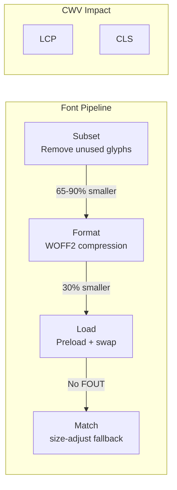

# Font Optimization for Web Performance

Master font optimization techniques including WOFF2 compression, subsetting, variable fonts, and strategic loading to reduce payload by 65-90% and achieve optimal Core Web Vitals scores.

<figure>



<figcaption>Font optimization pipeline: subset → WOFF2 → preload → fallback matching for CWV improvement</figcaption>

</figure>

## TLDR

**Font optimization** reduces payload by 65-90% through subsetting and WOFF2 compression, while strategic loading with fallback matching eliminates CLS (layout shift) and improves LCP (largest paint).

### Asset Preparation

- **WOFF2 format**: 30% smaller than WOFF, 50% smaller than TTF; use for all modern browsers
- **Subsetting**: Remove unused glyphs with tools like `glyphhanger` or `pyftsubset`; typical 65-90% reduction
- **Variable fonts**: Single file with multiple weights/widths; smaller than separate files for 3+ variants
- **Unicode-range splitting**: Load Latin characters immediately, defer extended character sets

### Loading Strategy

- **Preload critical fonts**: `<link rel="preload" href="font.woff2" as="font" type="font/woff2" crossorigin>`
- **font-display: swap**: Show fallback immediately, swap when custom font loads (prevents FOIT)
- **font-display: optional**: Skip custom font if not cached; best for poor connections
- **Self-host**: More control than Google Fonts; eliminates third-party connection overhead

### CLS Prevention

- **size-adjust**: Scale fallback font metrics to match custom font dimensions
- **ascent-override / descent-override**: Fine-tune vertical metrics alignment
- **@font-face descriptors**: `size-adjust: 106%; ascent-override: 92%; descent-override: 22%`
- **Tools**: Fontaine, Capsize calculate override values automatically

### Format Delivery

```css
@font-face {
  font-family: 'CustomFont';
  src: url('font.woff2') format('woff2'),
       url('font.woff') format('woff');
  font-display: swap;
  unicode-range: U+0000-00FF; /* Latin subset */
}
```

### Variable Font Benefits

- **Single request**: All weights/styles in one file (~150KB vs 400KB+ for 4 separate files)
- **Intermediate values**: Access any weight (e.g., 450) not just predefined weights
- **Animation**: Smooth weight transitions possible
- **Support**: 95%+ browser support; use static fallback for older browsers

### Performance Budget

- **Target**: ≤100KB total font payload for critical fonts
- **Max fonts**: 2-3 font families maximum
- **Measure**: Font loading time visible in DevTools Network panel and Lighthouse

## Introduction: The Dichotomy of Web Fonts

Web fonts are a foundational element of modern web design, providing the typographic nuance necessary to establish brand identity, enhance readability, and create visually compelling user experiences. However, this aesthetic and branding power comes at a significant performance cost. As external resources, web fonts introduce network latency, processing overhead, and, if managed improperly, can become a primary source of performance degradation.

This inherent conflict between design fidelity and performance optimization places web fonts at the center of many web development challenges. Unoptimized font loading can lead to slower page rendering, frustrating layout shifts, and a diminished user experience, which in turn can negatively impact user engagement, conversion rates, and even search engine rankings.

## The Core Web Vitals Nexus

Google's Core Web Vitals (CWV) initiative has provided a standardized set of metrics to quantify user experience, focusing on three key areas: loading performance, interactivity, and visual stability. Web fonts have a direct and profound impact on two of these three core metrics:

### Largest Contentful Paint (LCP)

This metric measures the time it takes for the largest visible element (often a text block or an image) to render within the viewport. A good LCP is considered to be 2.5 seconds or less. Delayed font loading is a common cause of poor LCP scores, as the browser may be forced to wait for a font file to download before it can render a critical headline or paragraph. This delay is often referred to as a "render-blocking" behavior.

### Cumulative Layout Shift (CLS)

This metric quantifies the visual stability of a page by measuring the unexpected movement of elements during the loading process. A good CLS score is 0.1 or less. The most common font-related cause of CLS is the "Flash of Unstyled Text" (FOUT), where text is initially rendered in a fallback system font and then swapped with the custom web font once it loads. If the two fonts have different dimensions, this swap causes a disruptive reflow of page content.

Furthermore, fonts also impact First Contentful Paint (FCP), which measures the time until any content is painted. A "Flash of Invisible Text" (FOIT), where the browser hides text while waiting for a font, directly delays FCP. Consequently, a comprehensive font optimization strategy is not merely a performance tweak but a fundamental requirement for achieving good Core Web Vitals scores.

## A Holistic Optimization Framework

Addressing the multifaceted performance challenges posed by web fonts requires a systematic, multi-layered approach. There is no single technique that can resolve all potential issues; rather, a successful strategy integrates optimizations across the entire font lifecycle. This document presents a holistic framework divided into three distinct but interconnected sections:

1. **Font Asset Preparation and Optimization**: Pre-emptive optimizations applied directly to the font files themselves
2. **Strategic Font Loading and Delivery**: Mechanisms for delivering optimized font assets to the browser
3. **Eliminating Font-Induced Cumulative Layout Shift**: Advanced techniques for visual stability

## Section 1: Font Asset Preparation and Optimization

The foundation of any effective font optimization strategy lies in the preparation of the font asset itself. Before a font is ever requested by a browser, significant performance gains can be realized by ensuring the file is in the most efficient format, contains only the necessary data, and leverages modern technologies to reduce overhead.

### 1.1 The Modern Web Font Format: WOFF2

The choice of font format has a direct and immediate impact on file size and, consequently, on download time. While several formats have been used on the web over the years, the modern standard is unequivocally the Web Open Font Format 2.0 (WOFF2).

#### Technical Deep Dive

WOFF2 is not a new type of font outline but rather a highly optimized container format, or "wrapper," specifically designed for web use. It typically encapsulates SFNT-based fonts, such as TrueType (TTF) or OpenType (OTF), which define the actual glyph shapes. The defining characteristic and primary advantage of WOFF2 over its predecessor, WOFF, is its use of the Brotli compression algorithm.

Brotli, developed by Google, offers a significantly higher compression ratio than the zlib algorithm used by WOFF. This superior compression results in WOFF2 files that are, on average, 30% smaller than their WOFF counterparts and can be over 50% smaller than the original TTF or OTF files. For example, a test converting the Montserrat font from TTF (225 KB) to WOFF resulted in a 94 KB file, while converting to WOFF2 produced an even smaller 83 KB file.

#### Implementation Strategy

Given the current landscape of browser technology, the implementation strategy for font formats should be one of radical simplification. WOFF2 enjoys near-universal support across all modern desktop and mobile browsers, with global usage statistics exceeding 96%. Legacy formats such as WOFF, TrueType (TTF), Embedded OpenType (EOT), and SVG fonts are now largely obsolete for web delivery.

Therefore, the recommended best practice for any new web project is to serve only the WOFF2 format. Including fallbacks for WOFF or TTF adds unnecessary complexity to the CSS and should only be considered if there is a strict, documented requirement to support archaic browsers (e.g., Internet Explorer 11, which does not support WOFF2).

A modern, streamlined `@font-face` declaration should look as follows:

```css
@font-face {
  font-family: "MyOptimizedFont";
  font-style: normal;
  font-weight: 400;
  font-display: swap; /* font-display is discussed in Section 2 */
  /* The WOFF2 format is sufficient for all modern browsers. */
  src: url("/fonts/my-optimized-font.woff2") format("woff2");
}
```

#### Format Comparison

| Format  | Compression Algorithm | Typical File Size Reduction (vs. TTF) | Browser Support             | Recommendation         |
| ------- | --------------------- | ------------------------------------- | --------------------------- | ---------------------- |
| WOFF2   | Brotli                | 50-60%                                | All modern browsers (>96%)  | Primary Choice         |
| WOFF    | zlib/Flate            | ~40%                                  | Wide legacy support         | Legacy Fallback Only   |
| TTF/OTF | None                  | Base (Uncompressed)                   | Legacy                      | Avoid for Web Delivery |
| EOT     | Proprietary           | Varies                                | Internet Explorer 6-11 only | Avoid (Obsolete)       |
| SVG     | None                  | Very Large (5-8x TTF)                 | Obsolete for fonts          | Do Not Use for Fonts   |

### 1.2 Font Subsetting: The Cornerstone of Size Reduction

While choosing the WOFF2 format provides an excellent baseline for compression, the single most impactful technique for reducing font file size is subsetting.

#### Core Principle

Font subsetting is the practice of creating a smaller, optimized font file by removing all the characters, or glyphs, that are not used on a particular website. A standard, complete font file is designed for broad utility and may contain thousands of glyphs to support numerous languages, mathematical symbols, ligatures, and other OpenType features. A typical website, especially one targeting a single language, might only use a few hundred of these glyphs. By stripping out the unused glyphs, subsetting can achieve dramatic file size reductions, often shrinking a font by 90% or more.

#### Subsetting Strategies

There are several methods for defining which glyphs to include in a subset, ranging from broad language-based approaches to highly specific, automated techniques.

**Language/Script-Based Subsetting**: This is the most common and balanced approach. It involves creating separate font files for different scripts or languages, such as Latin, Cyrillic, or Greek, and using the `unicode-range` CSS descriptor to instruct the browser to download only the subset needed for the content on the page.

```css
/* @font-face rule for the Latin subset */
@font-face {
  font-family: "MyMultilingualFont";
  src: url("/fonts/my-multilingual-font-latin.woff2") format("woff2");
  unicode-range:
    U+0000-00FF, U+0131, U+0152-0153, U+02BB-02BC, U+02C6, U+02DA, U+02DC, U+2000-206F, U+2074, U+20AC, U+2122, U+2191,
    U+2193, U+2212, U+2215, U+FEFF, U+FFFD;
}

/* @font-face rule for the Cyrillic subset */
@font-face {
  font-family: "MyMultilingualFont";
  src: url("/fonts/my-multilingual-font-cyrillic.woff2") format("woff2");
  unicode-range: U+0400-045F, U+0490-0491, U+04B0-04B1, U+2116;
}
```

**Character-Based Subsetting**: For highly specialized use cases, such as a brand logo, a unique display headline, or an icon font, it is possible to create a "pico-subset" containing only the precise characters required. Third-party services like Google Fonts facilitate this through the `text=` query parameter, which dynamically generates a subset containing only the specified characters.

**Automatic (Dynamic) Subsetting**: Advanced workflows can employ tools that "spider" or crawl a website, analyze all the text content, and compile a comprehensive list of unique characters used. This list is then used to generate a perfectly optimized subset.

#### Tooling and Implementation

**pyftsubset**: This is a powerful command-line utility from the fontTools Python library, which is considered the industry standard for font manipulation. It offers granular control over every aspect of the subsetting process.

```bash
# Example: Create a WOFF2 subset of 'SourceSansPro.ttf' containing only basic ASCII characters
# and common punctuation, while preserving all layout features.
pyftsubset SourceSansPro.ttf \
  --output-file="SourceSansPro-subset.woff2" \
  --flavor=woff2 \
  --layout-features='*' \
  --unicodes="U+0020-007E,U+2018,U+2019,U+201C,U+201D,U+2026"
```

**glyphhanger**: This tool, built on top of fontTools, specializes in automating the subsetting process. It can crawl a URL or a local directory, determine the set of characters in use, and then invoke pyftsubset to generate the optimized font files.

#### Critical Considerations

**Font Licensing**: Subsetting involves modifying the original font file, which legally constitutes the creation of a derivative work. Developers must meticulously review the font's End-User License Agreement (EULA) to confirm that subsetting is permitted.

**Dynamic Content**: The primary risk of subsetting is the "missing glyph" problem. If a website's content is dynamic (e.g., from a CMS, user comments, or an API), new content may introduce characters that were not present when the static subset was created. When the browser encounters a character that does not exist in the subsetted font file, it will render a fallback character (often a "tofu" box □) or a character from the next font in the CSS font-family stack.

### 1.3 Variable Fonts: A Paradigm Shift in Typographic Efficiency

For websites that require a rich typographic hierarchy—utilizing multiple weights, widths, or styles—variable fonts represent a fundamental evolution in font technology that offers substantial performance benefits.

#### Conceptual Overview

A traditional (or "static") font family is delivered as a collection of separate font files, one for each style (e.g., Roboto-Regular.woff2, Roboto-Bold.woff2, Roboto-Italic.woff2). A variable font, by contrast, is a single, consolidated font file that contains the entire design space of a typeface. Instead of discrete styles, it defines "axes of variation," such as weight (wght), width (wdth), slant (slnt), and italic (ital), which allow for the generation of any style within a continuous range.

#### Performance Benefits

**Reduced HTTP Requests**: The most significant benefit is the consolidation of font assets. Instead of making separate network requests for each required style, the browser makes only one request for the single variable font file. This drastically reduces network overhead, connection setup time, and request contention.

**File Size Efficiency**: The relationship between file size and variable fonts is nuanced but generally favorable. A single variable font file will be larger than any one of its static counterparts. However, it is almost always significantly smaller than the combined total size of the multiple static files it replaces. For instance, the combined OTF files for all weights of Source Sans Pro total 1,170 KB, whereas the single variable font OTF is only 405 KB. When converted to the efficient WOFF2 format, the variable font shrinks to 112 KB, nearly the same size as a single static WOFF2 weight (111 KB).

#### Implementation with CSS

Integrating variable fonts requires a slightly modified `@font-face` syntax to declare the available variation ranges.

**@font-face Declaration**: The declaration must specify the technology format (`woff2-variations` or the more modern `woff2 supports variations`) and define the continuous range for registered axes like `font-weight` and `font-stretch`.

```css
@font-face {
  font-family: "MyVariableFont";
  /* Include both syntaxes for broader compatibility */
  src:
    url("MyVariableFont.woff2") format("woff2-variations"),
    url("MyVariableFont.woff2") format("woff2 supports variations");
  /* Define the available range for the weight axis */
  font-weight: 100 900;
  /* Define the available range for the width axis (as a percentage) */
  font-stretch: 75% 125%;
  font-style: normal;
}
```

**Applying Styles**: Once declared, standard CSS properties can be used to access any value within the defined range.

```css
h1 {
  font-family: "MyVariableFont", sans-serif;
  /* Any numeric value within the 100-900 range is valid */
  font-weight: 785;
}

.condensed-text {
  font-family: "MyVariableFont", sans-serif;
  /* Any percentage within the 75%-125% range is valid */
  font-stretch: 85%;
}
```

**Browser Support and Fallbacks**: Variable fonts are now well-supported across all major modern browsers. For legacy browsers that do not support them, a robust fallback strategy can be implemented using the `@supports` CSS feature query.

```css
/* --- Static Font Fallbacks for Older Browsers --- */
@font-face {
  font-family: "MyStaticFallback";
  src: url("MyStatic-Regular.woff2") format("woff2");
  font-weight: 400;
}
@font-face {
  font-family: "MyStaticFallback";
  src: url("MyStatic-Bold.woff2") format("woff2");
  font-weight: 700;
}

body {
  font-family: "MyStaticFallback", sans-serif;
}

/* --- Variable Font for Modern Browsers --- */
@supports (font-variation-settings: normal) {
  @font-face {
    font-family: "MyVariableFont";
    src: url("MyVariableFont.woff2") format("woff2-variations");
    font-weight: 100 900;
  }

  body {
    font-family: "MyVariableFont", sans-serif;
  }
}
```

## Section 2: Strategic Font Loading and Delivery

Once the font asset has been meticulously optimized for size and efficiency, the focus shifts to the strategy for its delivery and loading. An optimized file is of little use if it is discovered late, fetched inefficiently, or rendered in a way that degrades the user experience.

### 2.1 Hosting Strategy: Self-Hosting vs. Third-Party Services

The decision of where to host font files—on one's own server infrastructure (self-hosting) or via a third-party service like Google Fonts—has significant implications for performance, control, and privacy.

#### The Old Paradigm and the Myth of the Shared Cache

For many years, a primary argument for using a service like Google Fonts was the potential for a shared, cross-site browser cache. The theory was that if a user visited website-A.com which used the font 'Roboto' from Google's CDN, the font file would be cached in their browser. When that same user later visited website-B.com, which also used 'Roboto' from the same Google CDN URL, the browser could serve the font directly from its cache, eliminating a network request entirely.

#### The New Reality: Browser Cache Partitioning

This shared cache advantage has been effectively nullified by modern browsers. For security and privacy reasons—specifically to prevent cross-site tracking via cached resources—browsers like Chrome and Safari have implemented Cache Partitioning (also known as "double key caching"). Under this model, the cache key for a resource includes not only the resource's URL but also the top-level origin that requested it.

This means that Roboto.woff2 cached for website-A.com is stored in a separate cache partition from the exact same Roboto.woff2 file requested by website-B.com. The shared cache benefit is gone. Each site must now trigger its own download of the font file on a user's first visit, regardless of whether they have encountered that font elsewhere.

#### The Modern Case for Self-Hosting

With the shared cache argument invalidated, the performance benefits of self-hosting become much clearer and more compelling.

### 2.2 Strategic Preloading and Resource Hints

Once the decision to self-host has been made, the next critical step is ensuring that the browser discovers and begins downloading the font as early as possible in the page load process.

#### The `<link rel="preload">` Directive

The most effective technique for accelerating the loading of critical fonts is the `<link rel="preload">` tag, placed within the HTML `<head>`. This declarative hint instructs the browser to begin fetching a specified resource with high priority, in parallel with other requests, without waiting for it to be discovered naturally.

A correctly formatted preload link for a font must include several key attributes:

- **href**: The path to the font file.
- **as="font"**: This is mandatory. It informs the browser of the resource's type, allowing it to be correctly prioritized in the network queue and stored in the font memory cache for immediate use when the CSS is parsed.
- **type="font/woff2"**: Specifying the MIME type allows browsers that do not support the format to ignore the preload hint, preventing an unnecessary download.
- **crossorigin** (or **crossorigin="anonymous"**): This attribute is absolutely critical for preloading fonts, even when they are self-hosted on the same origin. The specification requires that all font requests be made using anonymous-mode CORS. If the crossorigin attribute is omitted from the preload link, the preloaded resource will have a different request mode than the subsequent CSS-initiated request. This mismatch causes the browser to discard the preloaded file and initiate a second download.

```html
<head>
  <!-- ... other head elements ... -->
  <link rel="preload" href="/fonts/critical-heading-font.woff2" as="font" type="font/woff2" crossorigin="anonymous" />
  <!-- ... other head elements ... -->
</head>
```

It is crucial to use preload judiciously. Preloading tells the browser a resource is of the highest priority. Preloading too many non-critical fonts can create network contention, starving other important resources of bandwidth and potentially harming overall performance.

#### The rel="preconnect" Directive

When self-hosting is not an option and a third-party service must be used, the `rel="preconnect"` hint is vital. It instructs the browser to perform the expensive connection handshake (DNS + TCP + TLS) to a third-party origin in advance. This "warms up" the connection, so that when the actual font request is made later, the connection is already established, saving hundreds of milliseconds of latency.

For Google Fonts, which serves its CSS and font files from two different domains, both must be preconnected:

```html
<head>
  <!-- ... other head elements ... -->
  <link rel="preconnect" href="https://fonts.googleapis.com" />
  <link rel="preconnect" href="https://fonts.gstatic.com" crossorigin />
  <!-- ... other head elements ... -->
</head>
```

### 2.3 Controlling Rendering Behavior with font-display

While preloading ensures a font arrives quickly, the `font-display` CSS descriptor provides control over what the user sees while the font is in transit. When a browser needs to render text but the corresponding web font has not yet loaded, it faces a dilemma: wait and show nothing, or show something else temporarily.

This choice leads to two distinct user experiences:

- **Flash of Invisible Text (FOIT)**: The browser renders the text with an invisible placeholder, effectively hiding it until the web font loads. This maintains layout stability but delays the FCP and LCP.
- **Flash of Unstyled Text (FOUT)**: The browser immediately renders the text using a fallback system font. When the web font arrives, it is swapped in. This is excellent for FCP, as content is visible immediately, but it is the primary cause of font-related CLS if the fallback and web fonts have different dimensions.

The `font-display` descriptor allows developers to explicitly choose a strategy by defining the behavior of the browser's font loading timeline, which consists of three periods: a block period, a swap period, and a failure period.

#### font-display Values Analysis

| Value      | Block Period               | Swap Period     | Behavior Summary                                                                                                                                                                                                                  | Impact on CWV                                                                                                                                        | Recommended Use Case                                                                                                                                                |
| ---------- | -------------------------- | --------------- | --------------------------------------------------------------------------------------------------------------------------------------------------------------------------------------------------------------------------------- | ---------------------------------------------------------------------------------------------------------------------------------------------------- | ------------------------------------------------------------------------------------------------------------------------------------------------------------------- |
| `block`    | Short (~3s)                | Infinite        | FOIT. Text is invisible for up to 3s. If the font loads, it is used. If not, it swaps to the fallback and then swaps to the web font whenever it finally arrives.                                                                 | Bad for FCP/LCP. Can cause CLS if the swap occurs after the initial render.                                                                          | When the specific typeface is absolutely integral to understanding the content (e.g., an icon font) and a fallback is meaningless.                                  |
| `swap`     | Extremely Short (~0-100ms) | Infinite        | FOUT. Text is shown immediately in a fallback font. The web font is swapped in as soon as it loads, no matter how long it takes.                                                                                                  | Good for FCP. High risk of causing significant CLS if fonts are not dimensionally matched.                                                           | For critical branding elements (like logos or headlines) where immediate content visibility is paramount and CLS will be mitigated using techniques from Section 3. |
| `fallback` | Extremely Short (~100ms)   | Short (~3s)     | Compromise. A very brief FOIT, then FOUT. If the web font loads within the short swap period, it is used. If not, the fallback font is used for the lifetime of the page.                                                         | A good balance. Minimizes FCP impact while limiting the time window in which a CLS-inducing swap can occur.                                          | A reasonable default for body text or other content where the specific font is desirable but not absolutely critical.                                               |
| `optional` | Extremely Short (~100ms)   | None            | Performance First. A very brief FOIT. If the font is not available after the block period (i.e., not already cached), the fallback font is used permanently. The font may be downloaded in the background for the next page load. | Excellent for CLS (guarantees no swap-related shift). May result in the web font not being used on the first visit, which can be a design trade-off. | For body text and other non-critical content where performance and layout stability are the absolute top priorities.                                                |
| `auto`     | Browser Default            | Browser Default | Unpredictable. The browser chooses the loading strategy. Most modern browsers default to a behavior similar to `block`.                                                                                                           | Unreliable. Should generally be avoided in favor of an explicit strategy.                                                                            | Not recommended for production environments where predictable performance is required.                                                                              |

This analysis reveals a fundamental tension in font loading strategy. Techniques like preload are used to signal that a resource is critical and must be fetched with high priority. Conversely, a value like `font-display: optional` signals that a font is non-essential and can be discarded if not available almost instantly. Using these two techniques together for the same font creates a logical contradiction.

Therefore, a coherent strategy must align loading priority with rendering intent. Fonts critical enough to be preloaded (e.g., a hero heading) should use `font-display: swap` (with CLS mitigation) or `fallback`. Fonts where stability is paramount and the specific typeface is a "nice-to-have" (e.g., body text) should use `font-display: optional` and should not be preloaded.

## Section 3: Eliminating Font-Induced Cumulative Layout Shift (CLS)

The final and most sophisticated stage of font optimization addresses the challenge of visual stability. The use of `font-display: swap` is highly effective for improving FCP and LCP by ensuring text is visible to the user as quickly as possible. However, it introduces a significant risk of Cumulative Layout Shift (CLS), which occurs when the fallback font is swapped for the web font, causing a disruptive reflow of content.

### 3.1 Diagnosing the Root Cause of Font-Swap CLS

The root cause of font-induced CLS is a dimensional mismatch between the fallback font and the final web font. When the browser initially renders text using a system font like Arial, it allocates a certain amount of space for that text based on Arial's specific metrics. When the custom web font (e.g., Roboto) finishes loading, the browser replaces Arial with Roboto. If Roboto's characters are wider or narrower, or if its default line height is different, the block of text will occupy a different amount of space on the page.

This change in dimensions forces a reflow. A paragraph that previously occupied five lines might now wrap to six, or a headline that was on a single line might break into two. This pushes all subsequent content down the page, causing a visible and jarring shift that is registered by the browser as CLS.

### 3.2 The Font Metrics Override Solution

To solve this problem at its core, modern browsers have implemented a set of CSS descriptors for the `@font-face` at-rule that provide fine-grained control over a font's layout metrics. These are `size-adjust`, `ascent-override`, `descent-override`, and `line-gap-override`.

The strategy is not to alter the web font itself, but rather to create a new, virtual font-face definition for a common, locally available system font (the fallback) and use these descriptors to force its metrics to perfectly match those of the target web font. This creates a fallback font that is, from a layout perspective, a perfect dimensional clone of the web font.

#### Technical Breakdown of the Descriptors

- **size-adjust**: This is a percentage value that acts as a global multiplier for the font's glyph outlines and metrics. It effectively scales the entire font up or down. It is the primary tool for matching the overall width and x-height of the fallback font to the web font.

- **ascent-override**: This descriptor overrides the font's ascender metric, which defines the space reserved for characters above the baseline (e.g., the top of 'h' or 'd'). This ensures the top edge of the line box is consistent between the two fonts.

- **descent-override**: This overrides the font's descender metric, defining the space reserved for characters below the baseline (e.g., the bottom of 'g' or 'p'). This ensures the bottom edge of the line box is consistent.

- **line-gap-override**: This overrides the font's recommended line gap (or leading), controlling the amount of extra space between lines of text to ensure consistent line height.

By precisely calculating and applying these four values to a system font, it is possible to create a fallback that occupies the exact same vertical and horizontal space as the web font, thus reducing the layout shift upon swapping to zero.

### 3.3 Practical Implementation of a Zero-CLS Fallback Font

Implementing a metrics-adjusted fallback font involves a three-step process of selecting a fallback, calculating the override values, and constructing the necessary CSS.

#### Step 1: Choose a Reliable Local Fallback Font

The first step is to select a system font that will serve as the base for the fallback. This font should be widely available across the target operating systems to ensure consistent behavior. For sans-serif web fonts, Arial is a robust choice. For serif web fonts, Times New Roman is a common equivalent.

#### Step 2: Calculate the Override Values

This is the most technically demanding part of the process. The override percentages must be calculated by comparing the metrics of the target web font against the metrics of the chosen fallback font.

**Manual Calculation**: This involves using a font inspection tool to extract specific values from the font's metadata tables (like the OS/2 and hhea tables), such as unitsPerEm, sTypoAscender, sTypoDescender, and sTypoLineGap. These values are then plugged into specific formulas to derive the correct percentage values for size-adjust and the override descriptors.

**Automated Tools**: Manually calculating these values is complex and error-prone. Fortunately, several excellent tools have been developed to automate this process entirely:

- The Fallback Font Generator by Brian Louis Ramirez and Malte Ubl's Automatic Font Adjusting tool are web-based tools that allow you to select a Google Font and a fallback, and they will generate the complete, ready-to-use CSS @font-face rule with all the calculated override values.
- Capsize is another popular tool that provides detailed font metrics and the necessary CSS to achieve predictable text sizing.

#### Step 3: Construct the CSS

The final implementation requires two `@font-face` rules and a carefully ordered font-family stack in the main CSS.

```css
/*
 * STEP 1: Define the @font-face rule for the actual web font.
 * Use font-display: swap to ensure text is visible immediately.
 */
@font-face {
  font-family: "Inter";
  font-style: normal;
  font-weight: 400;
  font-display: swap;
  src: url("/fonts/inter-regular.woff2") format("woff2");
}

/*
 * STEP 2: Define a NEW @font-face rule for the metrics-adjusted fallback.
 * This creates a virtual font family named 'Inter-Fallback'.
 * It targets the local 'Arial' font and applies overrides to make its
 * dimensions match the 'Inter' web font.
 * The values below were generated by an automated tool.
 */
@font-face {
  font-family: "Inter-Fallback";
  src: local("Arial");
  ascent-override: 90.2%;
  descent-override: 22.48%;
  line-gap-override: 0%;
  size-adjust: 107.4%;
}

/*
 * STEP 3: Update the font-family stack in the site's CSS.
 * The web font ('Inter') is listed first.
 * The adjusted fallback ('Inter-Fallback') is listed second.
 * A generic fallback ('sans-serif') is last.
 */
body {
  font-family: "Inter", "Inter-Fallback", sans-serif;
}
```

When a page with this CSS loads, the browser attempts to use 'Inter'. While 'Inter.woff2' is downloading, the browser moves to the next font in the stack, 'Inter-Fallback'. It finds the local 'Arial' font and applies the specified metric overrides, rendering the text in a version of Arial that is dimensionally identical to Inter. When 'Inter.woff2' finally arrives, the browser swaps it in. Because the space occupied by the text does not change, no layout shift occurs.

#### Automated Framework Solutions

The complexity of this technique has led to its integration into modern web development frameworks, which can automate the entire process.

**Next.js**: The `@next/font` component, introduced in Next.js 13, automatically performs this optimization. When a font is loaded via this component, it calculates the appropriate metrics for a fallback font and injects the necessary `@font-face` rules into the generated CSS, providing zero-CLS font loading out of the box.

**Nuxt.js**: The Nuxt ecosystem offers a similar solution with the `@nuxtjs/fontaine` module, which automatically generates and inserts customized fallback fonts into the application's stylesheets.

## Conclusion: The End of Compromise

The optimization of web fonts is a complex but critical discipline in modern front-end development. It is no longer sufficient to simply link to a font file and hope for the best. Achieving a performant, stable, and visually rich user experience requires a deliberate and multi-faceted strategy that addresses every stage of a font's lifecycle, from its creation as a digital asset to its final rendering on a user's screen.

### Synthesis of the Three Pillars

A successful font optimization strategy is not a checklist of independent tasks but an integrated system where each component reinforces the others:

1. **Asset Optimization**: The process begins with the font file itself. By standardizing on the highly compressed WOFF2 format, aggressively removing unused glyphs through subsetting, and consolidating multiple styles into a single, efficient variable font, the foundational payload can be minimized.

2. **Strategic Loading**: An optimized asset must be delivered intelligently. The modern web, with its partitioned browser caches and stringent privacy regulations like GDPR, strongly favors self-hosting fonts for superior performance and control. Critical, above-the-fold fonts must be discovered early using `<link rel="preload">` to shorten the critical rendering path.

3. **Rendering Stability**: Finally, the font's integration into the page must be seamless and non-disruptive. The strategic use of the `font-display` property, particularly `swap`, ensures content is rendered to the user without delay, benefiting FCP. The once-unavoidable CLS penalty associated with this approach is now fully solvable through the use of font metric overrides to create a dimensionally identical fallback font.

### The End of Compromise

For years, web developers faced a difficult trade-off. They could prioritize fast initial rendering (`font-display: swap`), but at the cost of jarring layout shifts. Or, they could prioritize layout stability (`font-display: block`), but at the cost of invisible text and a poor LCP score. The combination of techniques detailed in this report, particularly the advent of font metric overrides, has effectively ended this compromise.

It is now possible to architect a font loading strategy that achieves excellence across all relevant Core Web Vitals simultaneously. We can have fast font delivery for a strong LCP, immediate text rendering for a strong FCP, and a perfectly stable layout for a near-zero CLS. This represents a significant maturation of web typography technology, moving beyond simple best practices to a sophisticated engineering discipline.

### Forward Outlook

The tools to achieve optimal font performance are now readily available. The primary challenge has shifted from a lack of technical capability to the need for developer awareness and correct implementation. The integration of these complex optimizations into frameworks like Next.js and Nuxt.js signals a positive trend toward automation, making high-performance typography more accessible. However, a deep understanding of the underlying principles—from Brotli compression and Unicode ranges to CORS policies and font metric tables—remains essential for debugging, custom implementation, and pushing the boundaries of web performance.

By embracing this holistic framework, developers can ensure that web fonts fulfill their intended role: to enhance a website's design and brand identity without compromising the speed, stability, and quality of the user experience.
