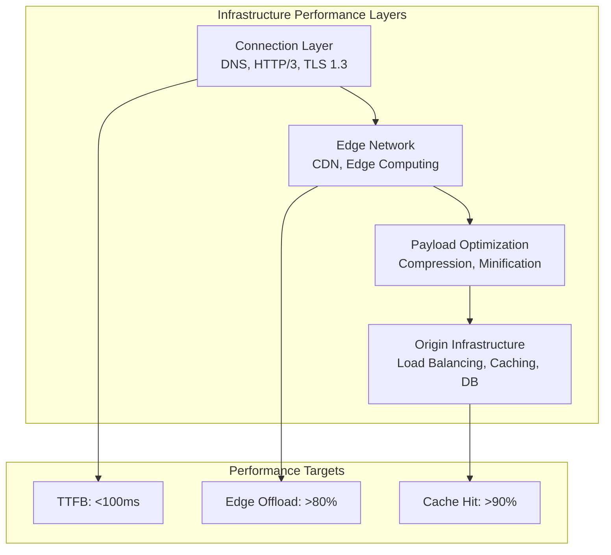
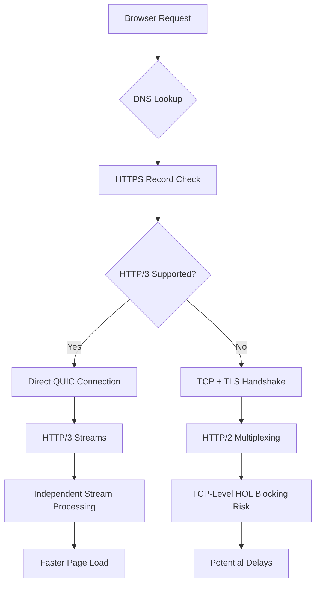
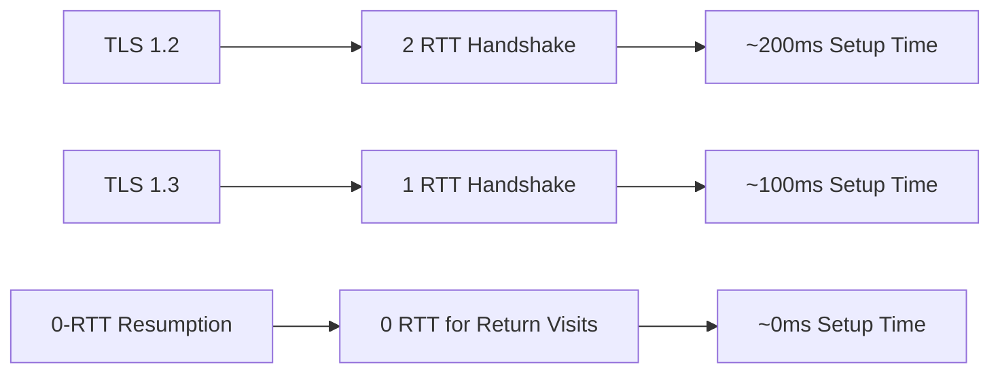
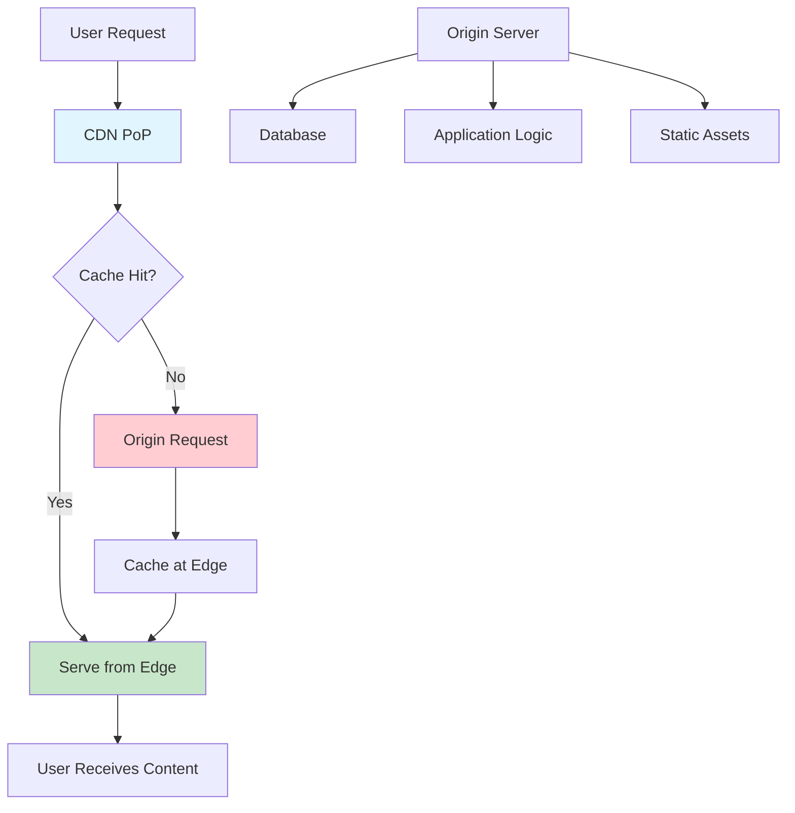
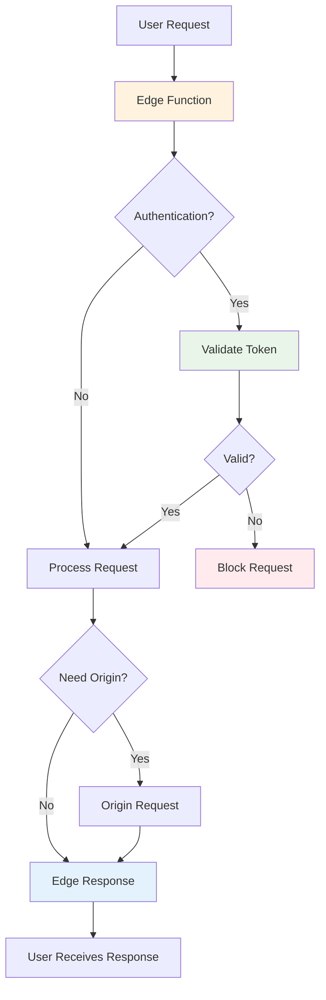
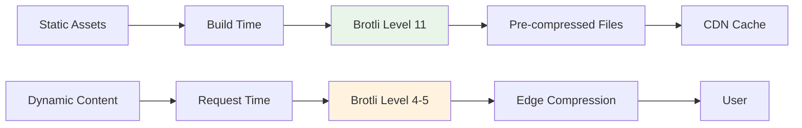
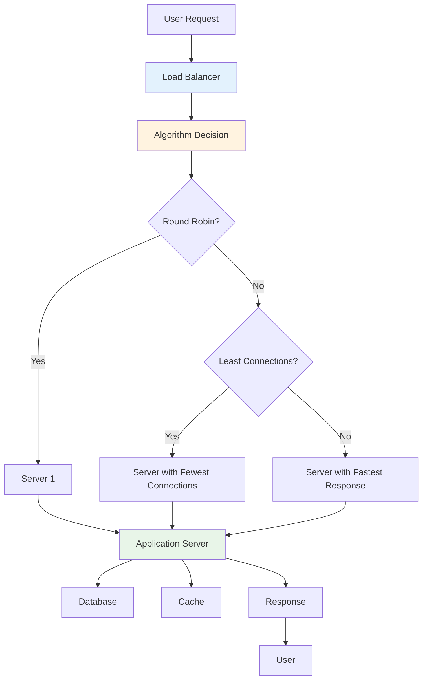
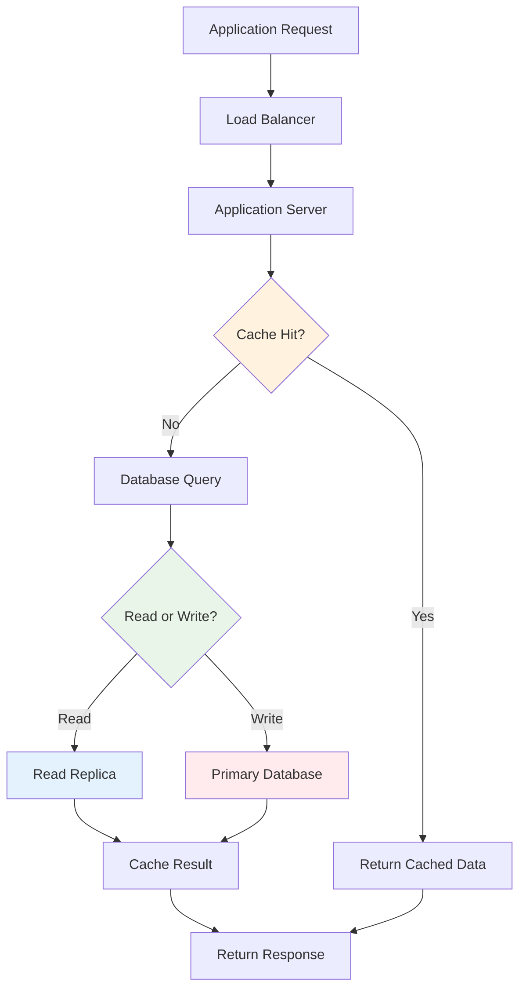
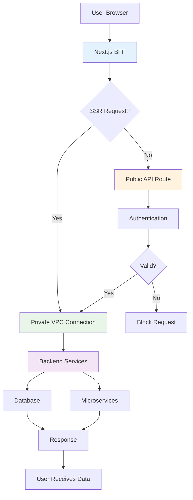

# Infrastructure Optimization for Web Performance

Master infrastructure optimization strategies including DNS optimization, HTTP/3 adoption, CDN configuration, caching, and load balancing to build high-performance websites with sub-second response times.

<figure>



<figcaption>Infrastructure optimization layers: connection, edge, payload, and origin working together for sub-100ms TTFB</figcaption>

</figure>

## Executive Summary

This document moves beyond a simple checklist of optimizations. It emphasizes that performance is not an afterthought but a foundational pillar of modern architecture, inextricably linked with security, scalability, and user satisfaction. The strategies detailed herein are designed to provide technical leaders—Solutions Architects, Senior Engineers, and CTOs—with the deep, nuanced understanding required to architect for speed in an increasingly competitive online environment.

### Key Performance Targets

- **DNS Resolution**: <50ms (good), <20ms (excellent)
- **Connection Establishment**: <100ms for HTTP/3, <200ms for HTTP/2
- **TTFB**: <100ms for excellent performance
- **Content Delivery**: <200ms for static assets via CDN
- **Origin Offload**: >80% of bytes served from edge
- **Cache Hit Ratio**: >90% for static assets

## 1. The Connection Layer - Optimizing the First Milliseconds

The initial moments of a user's interaction with a website are defined by the speed and efficiency of the network connection. Latency introduced during the Domain Name System (DNS) lookup, protocol negotiation, and security handshake can significantly delay the Time to First Byte (TTFB), negatively impacting perceived performance. This section analyzes the critical technologies that optimize these first milliseconds, transforming the connection process from a series of sequential, latency-inducing steps into a streamlined, parallelized operation.

### 1.1 DNS as a Performance Lever: Beyond Simple Name Resolution

For decades, the role of DNS in web performance was straightforward but limited: translate a human-readable domain name into a machine-readable IP address via A (IPv4) or AAAA (IPv6) records. While foundational, this process represents a mandatory round trip that adds latency before any real communication can begin.

Modern DNS, however, has evolved from a simple directory into a sophisticated signaling mechanism that can preemptively provide clients with critical connection information.

The primary innovation in this space is the introduction of the Service Binding (SVCB) and HTTPS DNS record types, standardized in RFC 9460. These records allow a server to advertise its capabilities to a client during the initial DNS query, eliminating the need for subsequent discovery steps. An HTTPS record, a specialized form of SVCB, can contain a set of key-value parameters that guide the client's connection strategy.

The most impactful of these is the `alpn` (Application-Layer Protocol Negotiation) parameter. It explicitly lists the application protocols supported by the server, such as `h3` for HTTP/3 and `h2` for HTTP/2. When a modern browser receives an HTTPS record containing `alpn="h3"`, it knows instantly that the server supports HTTP/3. It can therefore bypass the traditional protocol upgrade mechanism—which typically involves making an initial HTTP/1.1 or HTTP/2 request and receiving an `Alt-Svc` header in the response—and attempt an HTTP/3 connection directly. This proactive signaling saves an entire network round trip, a significant performance gain, especially on high-latency mobile networks.

Furthermore, HTTPS records can provide `ipv4hint` and `ipv6hint` parameters, which give the client IP addresses for the endpoint, potentially saving another DNS lookup if the target is an alias. This evolution signifies a paradigm shift: DNS is no longer just a location directory but a service capability manifest, moving performance-critical negotiation from the connection phase into the initial lookup phase.

**Performance Indicators:**

- DNS lookup times consistently exceeding 100ms
- Multiple DNS queries for the same domains
- Absence of IPv6 support affecting modern networks
- Lack of DNS-based service discovery
- Missing SVCB/HTTPS records for protocol discovery

**Measurement Techniques:**

```javascript
// DNS Timing Analysis
const measureDNSTiming = () => {
  const navigation = performance.getEntriesByType("navigation")[0]
  const dnsTime = navigation.domainLookupEnd - navigation.domainLookupStart

  return {
    timing: dnsTime,
    status: dnsTime < 20 ? "excellent" : dnsTime < 50 ? "good" : "needs-improvement",
  }
}

// SVCB/HTTPS Record Validation
const validateDNSRecords = async (domain) => {
  try {
    const response = await fetch(`https://dns.google/resolve?name=${domain}&type=HTTPS`)
    const data = await response.json()
    return {
      hasHTTPSRecord: data.Answer?.some((record) => record.type === 65),
      hasSVCBRecord: data.Answer?.some((record) => record.type === 64),
      records: data.Answer || [],
    }
  } catch (error) {
    return { error: error.message }
  }
}
```

### 1.2 The Evolution to HTTP/3: A Paradigm Shift with QUIC

HTTP/2 was a major step forward, introducing request multiplexing over a single TCP connection to solve the head-of-line (HOL) blocking problem of HTTP/1.1. However, it inadvertently created a new, more insidious bottleneck: TCP-level HOL blocking. Because TCP guarantees in-order packet delivery, a single lost packet can stall all independent HTTP streams multiplexed within that connection until the packet is retransmitted. For a modern web page loading dozens of parallel resources, this can be catastrophic to performance.

HTTP/3 fundamentally solves this by abandoning TCP as its transport layer in favor of QUIC (Quick UDP Internet Connections), a new transport protocol built on top of the connectionless User Datagram Protocol (UDP). HTTP/3 is the application mapping of HTTP semantics over QUIC. This change brings several transformative benefits:

**Elimination of Head-of-Line Blocking**: QUIC implements streams as first-class citizens at the transport layer. Each stream is independent, meaning packet loss in one stream does not impact the progress of any other. This is a monumental improvement for complex web pages, ensuring that the browser can continue processing other resources even if one is temporarily stalled.

**Faster Connection Establishment**: QUIC integrates the cryptographic handshake (using TLS 1.3 by default) with the transport handshake. This reduces the number of round trips required to establish a secure connection compared to the sequential TCP and TLS handshakes. This can result in connections that are up to 33% faster, directly lowering the TTFB and improving perceived responsiveness.

**Connection Migration**: This feature is critical for the mobile-first era. A traditional TCP connection is defined by a 4-tuple of source/destination IPs and ports. When a user switches networks (e.g., from a home Wi-Fi network to a cellular network), their IP address changes, breaking the TCP connection and forcing a disruptive reconnect. QUIC uses a unique Connection ID (CID) to identify a connection, independent of the underlying IP addresses. This allows a session to seamlessly migrate between networks without interruption, providing a far more resilient and stable experience for mobile users.

**Improved Congestion Control and Resilience**: QUIC features more advanced congestion control and error recovery mechanisms than TCP. It performs better on networks with high packet loss, a common scenario on unreliable cellular or satellite connections.

The design philosophy behind HTTP/3 and QUIC represents a fundamental acknowledgment of the modern internet's reality: it is increasingly mobile, wireless, and less reliable than the wired networks for which TCP was designed.



**DNS-Based Protocol Discovery Implementation:**

```dns
; HTTPS record enabling HTTP/3 discovery
example.com. 300 IN HTTPS 1 . alpn="h3,h2" port="443" ipv4hint="192.0.2.1"

; SVCB record for service binding
_service.example.com. 300 IN SVCB 1 svc.example.net. alpn="h3" port="8443"
```

**Performance Impact:**

- **Connection Establishment**: 100-300ms reduction in initial connection time
- **Page Load Time**: 200-500ms improvement for HTTP/3-capable connections
- **Network Efficiency**: Eliminates unnecessary TCP connections and protocol negotiation overhead
- **Mobile Performance**: 55% improvement in page load times under packet loss conditions

### 1.3 Securing the Handshake with TLS 1.3: Performance as a Feature

Transport Layer Security (TLS) is essential for web security, but older versions came with a significant performance penalty. TLS 1.2, for example, required two full round trips for its handshake before the client and server could exchange any application data.

TLS 1.3, released in 2018, was redesigned with performance as a core feature. It achieves this primarily through two mechanisms:

**1-RTT Handshake**: TLS 1.3 streamlines the negotiation process by removing obsolete cryptographic algorithms and restructuring the handshake messages. The result is that a full handshake for a new connection now requires only a single round trip (1-RTT). This halving of the handshake latency is a key contributor to the faster connection establishment seen in HTTP/3.

**0-RTT (Zero Round-Trip Time Resumption)**: For users returning to a site they have recently visited, TLS 1.3 offers a dramatic performance boost. It allows the client to send encrypted application data in its very first flight of packets to the server, based on parameters from the previous session. This feature, known as 0-RTT, effectively eliminates the handshake latency entirely for subsequent connections. For a user navigating between pages or revisiting a site, this creates a near-instantaneous connection experience, which is particularly impactful on high-latency networks.

The performance gains from these connection-layer technologies are deeply interconnected and multiplicative. To achieve the fastest possible connection, an organization should plan to implement them as a cohesive package. An HTTPS DNS record allows a client to discover HTTP/3 support without a prior connection. HTTP/3, in turn, is built on QUIC, which mandates encryption and is designed to leverage the streamlined TLS 1.3 handshake. It is this combination that delivers a truly optimized "first millisecond" experience.



### 1.4 Trade-offs and Constraints

| Optimization            | Benefits                                             | Trade-offs                                            | Constraints                          |
| ----------------------- | ---------------------------------------------------- | ----------------------------------------------------- | ------------------------------------ |
| **DNS Provider Change** | 20-50% faster resolution globally                    | User-dependent, not controllable by site owner        | Cannot be implemented at site level  |
| **DNS Prefetching**     | Eliminates DNS lookup delay                          | Additional bandwidth usage, battery drain on mobile   | Limited to 6-8 concurrent prefetches |
| **SVCB/HTTPS Records**  | Faster protocol discovery, reduced RTTs              | Limited browser support (71.4% desktop, 70.8% mobile) | Requires DNS infrastructure updates  |
| **HTTP/3 Adoption**     | 33% faster connections, 55% better under packet loss | Infrastructure overhaul, UDP configuration            | 29.8% server support                 |
| **TLS 1.3 Migration**   | 50% faster handshake, improved security              | Certificate updates, configuration changes            | High compatibility (modern browsers) |
| **0-RTT Resumption**    | Eliminates reconnection overhead                     | Replay attack mitigation complexity                   | Security considerations              |

**Performance Targets:**

- **DNS Resolution**: <50ms (good), <20ms (excellent)
- **SVCB Discovery**: 100-300ms reduction in connection establishment
- **Connection Establishment**: <100ms for HTTP/3, <200ms for HTTP/2
- **TLS Handshake**: <50ms for TLS 1.3, <100ms for TLS 1.2

## 2. The Edge Network - Your First and Fastest Line of Defense

Once a connection is established, the next critical factor in performance is the distance data must travel. The "edge"—a globally distributed network of servers located between the user and the application's origin—serves as the first and fastest line of defense. By bringing content and computation closer to the end-user, edge networks can dramatically reduce latency, absorb traffic spikes, enhance security, and improve overall application performance.

### 2.1 Content Delivery Networks (CDNs): The Cornerstone of Global Performance

A Content Delivery Network (CDN) is the foundational component of any edge strategy. It is a geographically distributed network of proxy servers, known as Points of Presence (PoPs), strategically located at Internet Exchange Points (IXPs) around the world. The primary goal of a CDN is to reduce latency and offload the origin server by serving content from a location physically closer to the user.

**Core Principles of CDN Architecture:**

**Geographic Distribution and Latency Reduction**: The single biggest factor in network latency is the speed of light. By placing PoPs globally, a CDN minimizes the physical distance data must travel. A user request from Europe is intercepted and served by a PoP in a nearby European city, rather than traversing the Atlantic to an origin server in North America. This geographic proximity is the most effective way to reduce round-trip time (RTT) and improve page load speeds.

**Caching Static Assets**: CDNs store copies (caches) of a website's static assets—such as HTML files, CSS stylesheets, JavaScript bundles, images, and videos—on their edge servers. When a user requests one of these assets, it is delivered directly from the edge cache, which is orders of magnitude faster than fetching it from the origin. This process, known as caching, not only accelerates content delivery but also significantly reduces the load on the origin server.

**Bandwidth Cost Reduction**: Every byte of data served from the CDN's cache is a byte that does not need to be served from the origin. This reduction in data egress from the origin server directly translates into lower hosting and bandwidth costs for the website owner.

Beyond raw speed, CDNs provide critical availability and security benefits. Their massive, distributed infrastructure can absorb and mitigate large-scale Distributed Denial of Service (DDoS) attacks, acting as a protective shield for the origin. Many CDNs also integrate a Web Application Firewall (WAF) at the edge, filtering malicious requests before they can reach the application. Furthermore, by distributing traffic and providing intelligent failover mechanisms, CDNs ensure high availability. If a single edge server or even an entire data center fails, traffic is automatically rerouted to the next nearest healthy location, ensuring the website remains online and accessible.



### 2.2 Advanced CDN Strategies: Beyond Static Caching

While caching static assets is the traditional role of a CDN, modern CDNs offer more sophisticated capabilities that extend these benefits to dynamic content and provide a more nuanced view of performance.

A crucial evolution in performance measurement is the shift from focusing on cache-hit ratio to origin offload. The cache-hit ratio, which measures the percentage of requests served from the cache, is an incomplete metric. It treats a request for a 1 KB tracking pixel the same as a request for a 10 MB video file. A more meaningful KPI is origin offload, which measures the percentage of bytes served from the cache versus the total bytes served. This metric better reflects the CDN's impact on reducing origin server load and infrastructure costs. A focus on origin offload encourages a more holistic strategy, such as optimizing the caching of large media files, which might not significantly move the cache-hit ratio but will dramatically reduce the burden on the origin.

This focus leads to strategies for caching "dynamic" content. While content unique to each user (like a shopping cart) cannot be cached, many types of "fresh" content (like news headlines, inventory levels, or API responses for popular products) can be cached at the edge for very short periods (e.g., 1 to 5 seconds). This "micro-caching" can absorb immense traffic spikes during flash sales or breaking news events, protecting the origin from being overwhelmed while still delivering reasonably fresh data to users.

Specialized CDN features for media are also a major performance lever. Modern CDNs can perform on-the-fly image optimizations, automatically resizing images to fit the user's device, compressing them, and converting them to next-generation formats like WebP or AVIF. This ensures that a mobile user on a 4G network isn't forced to download a massive, high-resolution image designed for a desktop display, which is a common and severe performance bottleneck.

```javascript
// Advanced CDN caching strategy
const cdnStrategy = {
  static: {
    maxAge: 31536000, // 1 year
    types: ["images", "fonts", "css", "js"],
    headers: {
      "Cache-Control": "public, max-age=31536000, immutable",
    },
  },
  dynamic: {
    maxAge: 300, // 5 minutes
    types: ["api", "html"],
    headers: {
      "Cache-Control": "public, max-age=300, stale-while-revalidate=60",
    },
  },
  micro: {
    maxAge: 5, // 5 seconds
    types: ["inventory", "pricing", "news"],
    headers: {
      "Cache-Control": "public, max-age=5, stale-while-revalidate=30",
    },
  },
}
```

### 2.3 The Next Frontier: Edge Computing

The most significant evolution of the CDN is the rise of edge computing. This paradigm extends the CDN from a content delivery network to a distributed application platform, allowing developers to run their own application logic (computation) at the edge. This is a direct response to the limitations of traditional caching for highly dynamic, personalized web applications.

While a CDN can cache a static API response, it cannot cache a response that is unique for every user. Historically, this created a performance cliff: static assets were delivered instantly from the edge, but any dynamic request required a long and costly round trip to the origin server. Edge computing bridges this gap by allowing small, fast functions (often called edge functions or serverless functions) to execute at the CDN's PoPs.

**Key Use Cases for Dynamic Applications:**

**Accelerating Dynamic Content**: For uncacheable requests, such as checking a user's authentication status or fetching personalized data, an edge function can perform this logic much closer to the user. This avoids the full round trip to the origin, dramatically improving TTFB and making the dynamic parts of an application feel as responsive as the static parts.

**Real-time Personalization and A/B Testing**: Logic for A/B testing, feature flagging, or redirecting users based on their location or device can be executed at the edge. This allows for a highly personalized experience without the latency penalty of an origin request.

**Edge Authentication**: Authentication and authorization logic can be handled at the edge. This allows invalid or unauthorized requests to be blocked immediately, preventing them from consuming any origin resources and enhancing the application's security posture.

The architecture of modern web frameworks like Next.js, Remix, and Hono is increasingly designed to integrate seamlessly with edge computing platforms such as Vercel Edge Functions, Cloudflare Workers, and Fastly Compute@Edge, making it easier than ever for developers to harness this power. This signifies a fundamental shift in web architecture: the CDN is no longer just a cache but the new application perimeter, where security, availability, and even application logic are handled first. The architectural question is evolving from "How do we make the origin faster?" to "How much of our application can we prevent from ever needing to hit the origin?".



## 3. Payload Optimization - Delivering Less, Faster

Every byte of data transferred from server to client contributes to page load time and, for users on metered connections, their data plan costs. Optimizing the size of the application's payload—its HTML, CSS, JavaScript, and media assets—is a critical layer of performance engineering. This is especially true for users on slower or less reliable mobile networks. This section details modern compression techniques and foundational asset optimizations that ensure the smallest possible payload is delivered as quickly as possible.

### 3.1 A Modern Approach to Compression: Gzip vs. Brotli vs. Zstandard

HTTP compression is a standard practice for reducing the size of text-based resources. By compressing files on the server before transmission and decompressing them in the browser, transfer times can be dramatically reduced. While Gzip has been the long-standing standard, newer algorithms offer significant improvements.

**Gzip**: The incumbent algorithm, Gzip is universally supported by browsers and servers and provides a solid balance between compression speed and effectiveness. However, many production environments use default, low-level Gzip settings (e.g., level 1), leaving significant performance gains on the table.

**Brotli**: Developed by Google, Brotli is a newer compression algorithm specifically optimized for the web. It uses a pre-defined 120 KB static dictionary containing common keywords, phrases, and substrings from a large corpus of web content. This allows it to achieve significantly higher compression ratios than Gzip, especially for text-based assets. Benchmarks show Brotli can make JavaScript files 14% smaller, CSS files 17% smaller, and HTML files 21% smaller than their Gzip-compressed counterparts. Brotli is now supported by all major browsers.

**Zstandard (zstd)**: Developed by Facebook, Zstandard is a more recent algorithm that prioritizes extremely high compression and decompression speeds. At moderate settings, it can achieve compression ratios similar to Brotli but often with faster compression times, making it a compelling option for real-time compression scenarios.

The choice of algorithm involves a crucial trade-off between compression ratio and compression speed. Higher compression levels (e.g., Brotli has levels 1-11) produce smaller files but are more computationally expensive and take longer to execute. This trade-off necessitates a bifurcated strategy that treats static and dynamic content differently. A one-size-fits-all approach is inherently suboptimal.

**Strategy for Static Content (Pre-compression)**: For static assets that are generated once during a build process (e.g., JavaScript bundles, CSS files, web fonts), the compression time is irrelevant to the end-user. The goal is to create the smallest possible file. Therefore, these assets should be pre-compressed using the most effective algorithm at its highest quality setting, such as Brotli level 11. The server is then configured to serve the appropriate pre-compressed file (.js.br) to a supporting browser, falling back to a pre-compressed Gzip file (.js.gz) or on-the-fly compression for older clients.

**Strategy for Dynamic Content (On-the-fly Compression)**: For content generated in real-time for each request (e.g., server-rendered HTML pages, JSON API responses), the compression process happens on the fly and its duration is added directly to the user's TTFB. Here, compression speed is paramount. A slow compression process can negate the benefit of a smaller payload. The recommended strategy is to use a moderate compression level that balances speed and ratio, such as Brotli at level 4 or 5, or Zstandard. These configurations typically provide better compression than Gzip at a similar or even faster speed.

Another strategic consideration is where compression occurs. While traditionally handled by the origin server (e.g., via an Nginx module), this adds CPU load that could be used for application logic. A more advanced approach is to offload this work to the edge. Modern CDNs can ingest an uncompressed or Gzip-compressed response from the origin and then perform on-the-fly Brotli compression at the edge before delivering it to the user. This frees up origin CPU resources and may leverage highly optimized, hardware-accelerated compression at the CDN, improving both performance and origin scalability.



### 3.2 Compression Algorithm Decision Matrix

| Algorithm     | Typical Compression Ratio               | Static Content Recommendation                                                                                           | Dynamic Content Recommendation                                                                                              | Key Trade-off                                                                                            |
| ------------- | --------------------------------------- | ----------------------------------------------------------------------------------------------------------------------- | --------------------------------------------------------------------------------------------------------------------------- | -------------------------------------------------------------------------------------------------------- |
| **Gzip**      | Good (e.g., ~78% reduction)             | Level 9 (pre-compressed). A solid fallback but inferior to Brotli.                                                      | Level 6. Fast compression speed but larger payload than Brotli/zstd.                                                        | Universally supported but offers the lowest compression ratio of modern options.                         |
| **Brotli**    | Excellent (e.g., ~82% reduction)        | Level 11 (pre-compressed). Produces the smallest files, maximizing bandwidth savings. Compression time is not a factor. | Level 4-5. Offers a great balance of significantly smaller payloads than Gzip with acceptable on-the-fly compression speed. | Highest compression ratio but can be slow to compress at high levels, making it ideal for static assets. |
| **Zstandard** | Very Good (similar to mid-level Brotli) | Level 19+ (pre-compressed). Very fast compression, but Brotli-11 usually yields smaller files.                          | Level 12-15. Often provides Brotli-like compression ratios at Gzip-like (or faster) speeds.                                 | Optimized for speed. An excellent choice for dynamic content where TTFB is critical.                     |

**Implementation Strategy:**

```nginx
# Advanced compression configuration
http {
    # Brotli compression
    brotli on;
    brotli_comp_level 6;
    brotli_types
        application/javascript
        application/json
        text/css
        text/html;

    # Gzip fallback
    gzip on;
    gzip_vary on;
    gzip_types
        application/javascript
        text/css
        text/html;

    # Static pre-compressed files
    gzip_static on;
    brotli_static on;
}
```

### 3.3 Foundational Asset Optimizations

Alongside advanced compression, several foundational techniques for asset optimization remain essential:

**Minification and Bundling**: Minification is the process of removing all unnecessary characters (e.g., whitespace, comments, shortening variable names) from source code (HTML, CSS, JavaScript) without changing its functionality. Bundling combines multiple source files into a single file. Together, these techniques reduce file size and, critically, reduce the number of HTTP requests a browser needs to make to render a page. Modern web development toolchains like Webpack, Vite, or Turbopack automate this process as part of the build step.

**Image and Video Optimization**: Media files are often the heaviest part of a web page's payload. Optimizing them is crucial.

- **Responsive Images**: It is vital to serve images that are appropriately sized for the user's device. Using the `<picture>` element and the `srcset` attribute on `` tags allows the browser to select the most suitable image from a set of options based on its viewport size and screen resolution. This prevents a mobile device from wastefully downloading a large desktop image.

- **Modern Formats**: Where browser support allows, images should be served in next-generation formats like WebP and, particularly, AVIF. These formats offer far superior compression and smaller file sizes compared to traditional JPEG and PNG formats for the same visual quality.

- **Video**: For videos used as background elements, audio tracks should be removed to reduce file size. Choosing efficient video formats and compression settings is also key.

By combining advanced compression algorithms tailored to specific content types with these foundational asset optimizations, an organization can significantly reduce its payload size, leading to faster load times, a better user experience, and lower bandwidth costs.

### 3.4 Trade-offs and Performance Impact

| Optimization           | Performance Benefit               | Resource Cost                                      | Compatibility Issues      |
| ---------------------- | --------------------------------- | -------------------------------------------------- | ------------------------- |
| **Brotli Compression** | 14-21% better compression         | Higher CPU usage during compression                | 95% browser support       |
| **CDN Implementation** | 40-60% latency reduction globally | Monthly hosting costs, complexity                  | Geographic coverage gaps  |
| **Aggressive Caching** | 80-95% repeat visitor speedup     | Stale content risks, cache invalidation complexity | Browser cache limitations |
| **Image Optimization** | 50-80% file size reduction        | Build-time processing overhead                     | Browser format support    |
| **Code Minification**  | 20-40% file size reduction        | Build complexity, debugging challenges             | Source map management     |

## 4. The Origin Infrastructure - The Core Powerhouse

While the edge network provides the first line of defense, the origin infrastructure—comprising application servers, caches, and databases—remains the ultimate source of truth and the engine for dynamic content. A fast, scalable, and resilient origin is non-negotiable for a high-performance consumer website. Optimizing this core powerhouse involves a synergistic approach to distributing load, caching data intelligently, and ensuring the database operates at peak efficiency.

### 4.1 Scalability and Resilience with Load Balancing

A load balancer is a critical component that sits in front of the application servers and distributes incoming network traffic across a pool of them. This prevents any single server from becoming a bottleneck, thereby improving application responsiveness, fault tolerance, and scalability. The choice of load balancing algorithm has a direct impact on how effectively the system handles traffic.

**Static Algorithms**: These algorithms distribute traffic based on a fixed configuration, without considering the current state of the servers.

- **Round Robin**: The simplest method, it cycles through the list of servers sequentially. While easy to implement, it is not "load-aware" and can send traffic to an already overloaded server if requests are not uniform. It is best suited for homogeneous server pools with predictable workloads.

- **Weighted Round Robin**: An improvement on Round Robin, this method allows an administrator to assign a "weight" to each server based on its capacity (e.g., CPU, memory). Servers with a higher weight receive a proportionally larger share of the traffic, making it suitable for environments with heterogeneous hardware.

**Dynamic Algorithms**: These algorithms make real-time distribution decisions based on the current state of the servers, offering greater resilience in unpredictable environments.

- **Least Connections**: This method directs new requests to the server with the fewest active connections at that moment. It is highly effective for workloads where session times vary, as it naturally avoids sending new requests to servers tied up with long-running processes.

- **Least Response Time**: Perhaps the most direct optimization for user-perceived latency, this algorithm routes traffic to the server that is currently responding the fastest. It combines factors like server load and network latency to make an optimal choice.

**Session Persistence Algorithms**: For stateful applications where it is critical that a user's subsequent requests land on the same server, session persistence (or "sticky sessions") is required.

- **Source IP Hash**: This algorithm creates a hash of the client's source IP address and uses it to consistently map that client to a specific server. This ensures session continuity but can lead to imbalanced load if many users are behind a single corporate NAT.

The choice of algorithm represents a strategic trade-off. Simple algorithms like Round Robin are easy to manage but less resilient. Dynamic algorithms like Least Connections are more complex to implement (requiring state tracking) but are far better suited to the variable traffic patterns of a high-traffic consumer website.



### 4.2 In-Memory Caching: Shielding the Database

The database is frequently the slowest and most resource-intensive part of the application stack. Repeatedly querying the database for the same, slow-to-generate data is a primary cause of performance degradation. An in-memory caching layer is the solution. By using a high-speed, in-memory data store like Redis or Memcached, applications can store the results of expensive queries or frequently accessed data objects. Subsequent requests for this data can be served from RAM, which is orders of magnitude faster than disk-based database access, dramatically reducing database load and improving application response times.

The choice between the two leading caching solutions, Redis and Memcached, is an important architectural decision.

**Memcached**: Is a pure, volatile, in-memory key-value cache. It is multi-threaded, making it highly efficient at handling a large number of concurrent requests for simple string or object caching. Its design philosophy is simplicity and speed for a single purpose: caching. Its simple operational model leads to a very predictable, low-latency performance profile.

**Redis**: Is often described as a "data structures server." While it excels as a cache, it is a much more versatile tool. It supports rich data structures (such as lists, sets, hashes, streams, and JSON), which allows for more complex caching patterns. Critically, Redis also offers features that Memcached lacks, including persistence (the ability to save data to disk to survive reboots), replication (for high availability and read scaling), and clustering (for horizontal scaling).

This makes the choice less about which is a "better" cache and more about the intended role of the in-memory tier. If the sole requirement is to offload a database with simple object caching, Memcached's focused simplicity and multi-threaded performance are compelling. However, if the architecture may evolve to require a session store, a real-time message broker, leaderboards, or other features, choosing Redis provides that flexibility from the start, preventing the need to add another technology to the stack later.

```javascript
// Redis caching strategy implementation
const redisCache = {
  // Cache frequently accessed user data
  userProfile: {
    key: (userId) => `user:${userId}:profile`,
    ttl: 3600, // 1 hour
    strategy: "write-through",
  },

  // Cache expensive database queries
  productCatalog: {
    key: (category) => `products:${category}`,
    ttl: 1800, // 30 minutes
    strategy: "cache-aside",
  },

  // Session storage
  userSession: {
    key: (sessionId) => `session:${sessionId}`,
    ttl: 86400, // 24 hours
    strategy: "write-behind",
  },
}

// Cache implementation example
const getCachedData = async (key, fetchFunction, ttl = 3600) => {
  try {
    const cached = await redis.get(key)
    if (cached) {
      return JSON.parse(cached)
    }

    const data = await fetchFunction()
    await redis.setex(key, ttl, JSON.stringify(data))
    return data
  } catch (error) {
    // Fallback to direct fetch on cache failure
    return await fetchFunction()
  }
}
```

### 4.3 High-Performance Database Strategies

Even with a robust caching layer, the database itself must be optimized for performance, especially to handle write traffic and cache misses efficiently.

**Query Optimization**: This is the single most impactful area of database tuning. A poorly written query can bring an entire application to its knees. Best practices are non-negotiable:

- Never use `SELECT *`. Explicitly request only the columns the application needs to reduce data transfer and processing overhead.
- Use the `EXPLAIN` (or `ANALYZE`) command to inspect the database's query execution plan. This reveals inefficiencies like full table scans, which indicate a missing or improperly used index.
- Ensure all columns used in JOIN conditions are indexed. Prefer joins over complex, nested subqueries, as the database optimizer can often handle them more efficiently.

**Strategic Indexing**: Indexes are special lookup tables that the database search engine can use to speed up data retrieval. They are essential for the performance of SELECT queries with WHERE, JOIN, or ORDER BY clauses. However, indexes come with a cost: they slow down write operations (INSERT, UPDATE, DELETE) because the index itself must be updated along with the data. Therefore, it is crucial to avoid over-indexing and to create indexes only on columns that are frequently used in query conditions.

**Scaling with Read Replicas**: For applications with a high volume of read traffic, a fundamental scaling strategy is to create one or more read-only copies (replicas) of the primary database. The application is then configured to direct all write operations to the primary database while distributing read operations across the pool of replicas. This pattern dramatically increases read capacity and protects the primary database from being overwhelmed by read queries, allowing it to focus on handling writes.

**Connection Pooling**: Establishing a new database connection for every request is a resource-intensive process. A connection pooler maintains a cache of active database connections that can be reused by the application. This significantly reduces the latency and overhead associated with handling each request, improving overall throughput.

The components of the origin stack are an interdependent system. An advanced load balancing algorithm is ineffective if the backend servers are stalled by slow database queries. A well-implemented cache reduces the pressure on the database, and read replicas act as a form of load balancing specifically for the database tier. A successful performance strategy requires optimizing each layer in concert with the others.



## 5. Application Architecture - A Deep Dive into a Secure Next.js Model

The theoretical concepts of performance optimization must ultimately be instantiated in a concrete application architecture. The user's query about using a private API in a Virtual Private Cloud (VPC) for server-side calls in Next.js, while exposing a public API for the client, describes a sophisticated and highly effective modern architecture. This section provides a deep dive into this model, framing it as a Backend-for-Frontend (BFF) pattern and detailing its significant security and performance advantages.

### 5.1 The Backend-for-Frontend (BFF) Pattern with Next.js

The proposed architecture is a prime example of the Backend-for-Frontend (BFF) pattern. In this model, the Next.js application is not merely a client-side rendering engine; it is a full-fledged server-side layer that acts as a dedicated, purpose-built backend for the user interface. This BFF has several key responsibilities:

- It handles the server-side rendering (SSR) of web pages, generating the initial HTML on the server.
- It serves as a secure proxy or gateway to downstream systems, such as a fleet of microservices or a monolithic backend API.
- It can orchestrate and aggregate data from multiple backend sources, transforming it into a shape that is optimized for consumption by the frontend components.
- It exposes a single, unified, and stable API surface for the client-side application, abstracting away the complexity and potential volatility of the underlying backend services.

This pattern is a direct response to the growing complexity of both modern frontend applications and distributed backend architectures. It provides a crucial layer of mediation that decouples the frontend from the backend, allowing teams to develop and deploy more independently.

### 5.2 Server-Side Rendering (SSR) with a Private API in a VPC

A core function of the Next.js BFF is to perform server-side rendering. When a user requests a page, the Next.js server (whether running on a VM, in a container, or as a serverless function) executes data-fetching logic, such as the `getServerSideProps` function in the Pages Router or the data fetching within a Server Component in the App Router.

In this secure architecture, this server-side data fetching logic does not call a public, internet-facing API endpoint. Instead, it communicates directly and privately with the true backend services (e.g., microservices, databases) that are isolated within a secure network perimeter, such as an Amazon Virtual Private Cloud (VPC). This approach yields profound performance and security benefits.

**Performance Benefit**: Communication between services within a VPC, or between a modern hosting platform and a VPC via a private connection like AWS PrivateLink, is characterized by extremely low latency and high bandwidth. It avoids the unpredictable latency and potential packet loss of the public internet. This means that data fetching during SSR is exceptionally fast, which directly reduces the Time to First Byte (TTFB) and results in a much faster initial page load for the user.

**Security Benefit**: This is arguably the most significant advantage. The core backend services and databases are completely isolated from the public internet; they do not have public IP addresses and are inaccessible from the outside world. This drastically reduces the application's attack surface. All sensitive credentials, such as database connection strings or internal service-to-service authentication tokens, are stored as environment variables on the Next.js server and are only ever used over this secure, private network. They are never exposed to the client-side browser. This architecture embodies a zero-trust, defense-in-depth security posture.

### 5.3 Client-Side Data Fetching via a Public API Proxy

Client-side components running in the user's browser cannot, by definition, access the private backend services within the VPC. To facilitate client-side interactivity and data fetching (e.g., after the initial page load), the Next.js BFF exposes its own set of public API endpoints. In Next.js, these are implemented using API Routes (in the `pages/api` directory) or Route Handlers (in the App Router).

These public endpoints function as a secure proxy. When a client-side component needs to fetch or update data, it makes a request to its own application's public API (e.g., `fetch('/api/cart')`). The API route handler on the Next.js server receives this request. It can then perform critical server-side logic, such as validating the user's session and authorizing the request. If the request is valid, the handler then proxies the call to the appropriate internal service over the secure, private VPC connection.

This proxy mechanism provides several advantages:

- **Single Point of Entry**: The client application only ever communicates with a single domain: the Next.js BFF itself. This simplifies security policies, firewall rules, and content security policies.
- **Authentication Gateway**: The BFF is the ideal place to manage user authentication and sessions. It can translate a user's browser cookie or token into a secure, internal service-to-service credential for the downstream call.
- **No CORS Headaches**: Since the client-side code is making API calls to the same origin it was served from, the notorious complexities of Cross-Origin Resource Sharing (CORS) are completely eliminated.

### 5.4 Securely Connecting the Next.js Host to the Backend VPC

The practical implementation of this architecture hinges on establishing a secure, private communication channel between the environment hosting the Next.js application and the backend VPC.

**Traditional IaaS/PaaS**: If the Next.js application is deployed on virtual machines (e.g., EC2) or containers (e.g., ECS) that are themselves located within the same VPC as the backend services, the connection is inherently private and simple to configure.

**Modern Serverless/Edge Platforms**: The real challenge—and where recent innovation has been focused—is connecting managed hosting platforms to a private backend.

- **Vercel Secure Compute**: This is an enterprise feature from Vercel that provisions a dedicated private network for a Next.js project. This network can then be securely connected to a customer's AWS VPC using VPC Peering. This creates a private tunnel for communication and provides static egress IP addresses that can be added to the backend's firewall allow-lists.

- **AWS Amplify Hosting and Lambda**: Cloud providers are also improving their offerings. AWS Amplify Hosting now supports VPC connectivity, allowing deployed applications to access private resources like an RDS database. Similarly, AWS Lambda functions can be configured with a VPC connector, giving them a network interface inside a specified VPC, enabling secure access to its resources.

Once the connection is established, security can be further tightened using VPC Endpoint Policies. A VPC endpoint policy is an IAM resource policy that is attached to the VPC endpoint itself. It provides granular control, specifying which authenticated principals are allowed to perform which actions on which resources, effectively locking down the traffic that can flow through the private connection.



## 6. A Culture of Performance - Monitoring and Continuous Improvement

Implementing the advanced infrastructure and architectural patterns detailed in this report is a significant step toward achieving a high-performance website. However, performance is not a one-time project; it is a continuous process that requires a cultural commitment to measurement, monitoring, and iterative improvement. Without robust monitoring, performance gains can erode over time as new features are added and codebases evolve.

### 6.1 Establishing a Performance Baseline: You Can't Improve What You Don't Measure

The foundational step in any optimization effort is to establish a clear baseline of the application's current performance. This data-driven approach is essential for identifying the most significant bottlenecks and for quantifying the impact of any changes made. There are two primary methodologies for collecting this data:

**Synthetic Monitoring**: This involves using automated tools to run performance tests against the website from a consistent, controlled environment (e.g., a specific server location with a specific network profile) at regular intervals. Synthetic monitoring is invaluable for:

- **Catching Regressions**: By integrating these tests into a CI/CD pipeline, teams can immediately detect if a new code change has negatively impacted performance before it reaches production.
- **Baseline Consistency**: It provides a stable, "lab" environment to measure performance without the noise of real-world network and device variability.
- **Uptime and Availability Monitoring**: It can be used to continuously check if the site is online and responsive from various points around the globe.

**Real User Monitoring (RUM)**: This involves collecting performance data directly from the browsers of actual users as they interact with the website. A small script on the page gathers metrics and sends them back for aggregation and analysis. RUM provides unparalleled insight into the true user experience because it captures performance across the vast spectrum of real-world conditions: different geographic locations, a wide variety of devices (from high-end desktops to low-end mobile phones), and fluctuating network qualities (from fiber to spotty 3G).

A mature performance strategy utilizes both. Synthetic monitoring provides the clean, consistent signal needed for regression testing, while RUM provides the rich, real-world data needed to understand and prioritize optimizations that will have the greatest impact on the actual user base. A team that relies only on synthetic data might optimize for an ideal scenario, while being unaware that the site is unusably slow for a key user segment in a specific region. RUM closes this gap between lab performance and real-world experience.

### 6.2 Key Metrics for Infrastructure Performance

While user-facing metrics like the Core Web Vitals are paramount, they are outcomes of underlying infrastructure performance. To diagnose and fix issues at the infrastructure level, teams must monitor specific server-side and network metrics.

**Time to First Byte (TTFB)**: This metric measures the time from when a user initiates a request to when the first byte of the HTML response is received by their browser. It is a fundamental indicator of backend and infrastructure health. A high TTFB points directly to a bottleneck somewhere in the origin stack, such as slow server-side rendering, a long-running database query, inefficient caching, or network latency between internal services. Improving TTFB is one of the most effective ways to improve the user-facing Largest Contentful Paint (LCP) metric.

**Server Response Time**: This is a component of TTFB that measures only the time the server took to process the request and generate the response, excluding the network transit time. Monitoring this helps isolate whether a high TTFB is due to network latency or slow processing on the server itself.

**Origin Offload**: As discussed in Section 2, this metric tracks the percentage of response bytes served by the CDN cache. A high origin offload indicates that the edge network is effectively shielding the origin, which is crucial for both performance and cost management.

These metrics should not just be collected; they must be actively monitored. Setting up dashboards to visualize trends and configuring automated alerts for when key metrics cross a certain threshold (e.g., "alert if p95 TTFB exceeds 800ms") is essential. This allows teams to shift from a reactive to a proactive stance, identifying and addressing performance degradation before it becomes a widespread user issue. This continuous cycle of measuring, analyzing, and optimizing is the hallmark of a true culture of performance.

## Conclusion

Achieving and maintaining elite performance for a consumer-facing website is a complex, multi-faceted endeavor that extends far beyond simple code optimization. It requires a deep and strategic approach to infrastructure architecture, treating performance as a foundational pillar alongside functionality and security.

This report has detailed a comprehensive, layered strategy that begins with the very first milliseconds of a user's connection. By leveraging modern protocols like HTTP/3 and TLS 1.3, facilitated by advanced DNS records like SVCB/HTTPS, organizations can significantly reduce initial connection latency. This creates a faster, more resilient foundation for the entire user experience.

The journey continues at the edge, where the role of the Content Delivery Network has evolved from a simple cache into a sophisticated application perimeter. Modern CDNs, through advanced caching of dynamic content and the transformative power of edge computing, can serve more content and execute more logic closer to the user, dramatically reducing the load and dependency on the origin. This "edge-first" philosophy is central to modern performance architecture.

Payload optimization remains a critical discipline. A nuanced compression strategy, using the best algorithm for the context—high-ratio Brotli for static assets and high-speed Brotli or Zstandard for dynamic content—ensures that every byte is delivered with maximum efficiency.

At the core, a resilient and powerful origin infrastructure is non-negotiable. This involves the intelligent application of load balancing algorithms, the use of in-memory caching layers like Redis or Memcached to shield the database, and a relentless focus on database performance through query optimization, strategic indexing, and scalable patterns like read replicas.

Finally, these technologies are brought together in a secure and high-performance application architecture, such as the Next.js Backend-for-Frontend pattern. By isolating core backend services in a private VPC and using the Next.js server as a secure gateway, this model achieves both an elite security posture and superior performance, with server-side data fetching occurring over ultra-low-latency private networks.

Ultimately, web performance is not a destination but a continuous process. A culture of performance, underpinned by robust monitoring of both synthetic and real-user metrics, is essential for sustained success. By embracing the interconnected strategies outlined in this report, organizations can build websites that are not only fast and responsive but also secure, scalable, and capable of delivering the superior user experience that today's consumers demand.

## References

- [RFC 9460 - SVCB and HTTPS Records](https://datatracker.ietf.org/doc/html/rfc9460) - DNS service binding specification
- [HTTP/3 Explained](https://http3-explained.haxx.se/) - Comprehensive HTTP/3 and QUIC guide
- [TLS 1.3 - RFC 8446](https://datatracker.ietf.org/doc/html/rfc8446) - TLS 1.3 specification
- [Brotli Compression](https://github.com/google/brotli) - Google's Brotli compression algorithm
- [Zstandard](https://facebook.github.io/zstd/) - Facebook's Zstandard compression
- [Cloudflare CDN](https://developers.cloudflare.com/cache/) - CDN caching strategies
- [Redis Documentation](https://redis.io/docs/) - In-memory caching and data structures
- [Vercel Edge Functions](https://vercel.com/docs/functions/edge-functions) - Edge computing platform
- [AWS VPC Connectivity](https://docs.aws.amazon.com/vpc/latest/userguide/) - VPC networking guide
