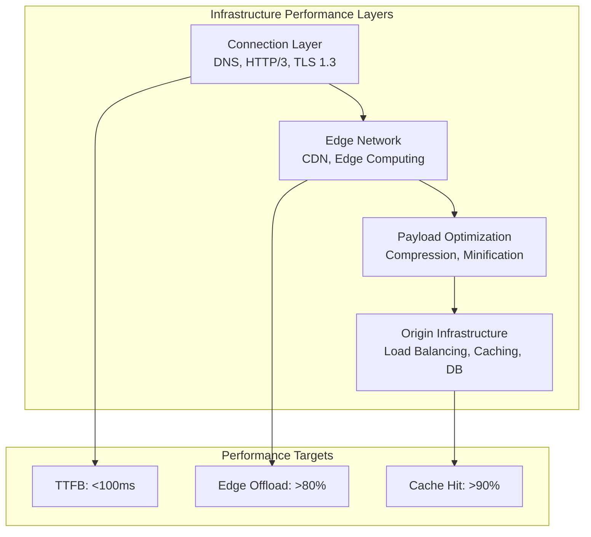
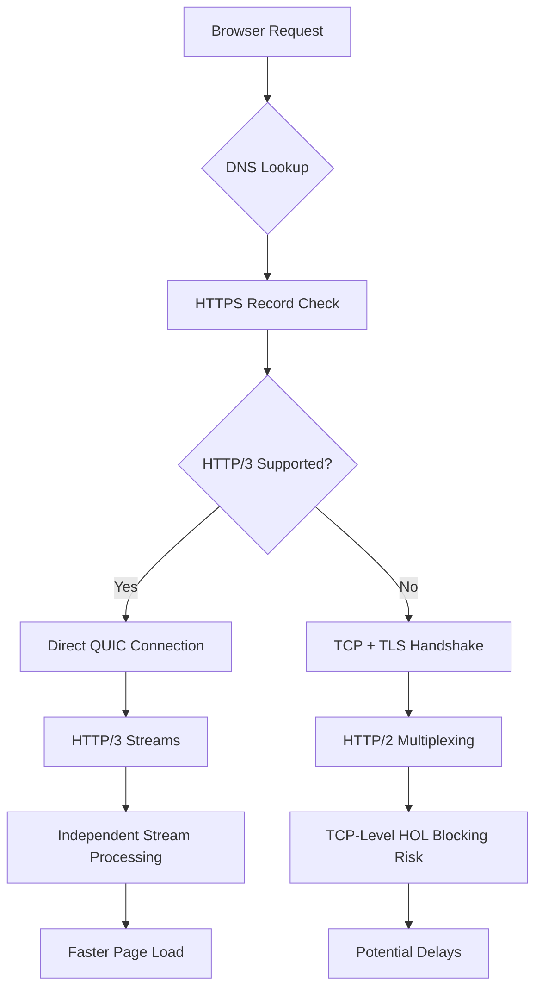
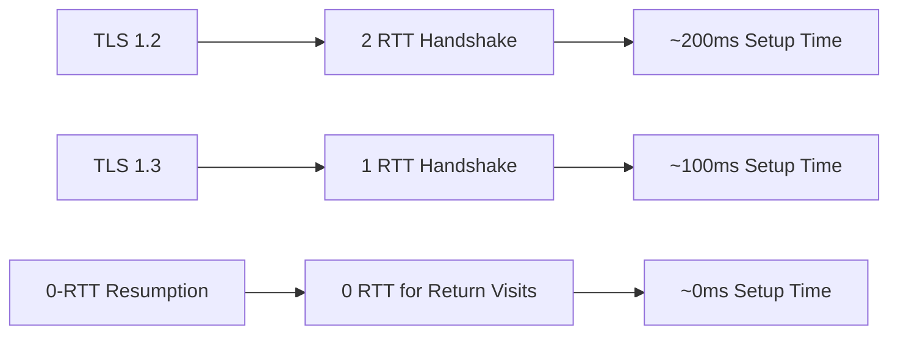

# Infrastructure Optimization for Web Performance

Master infrastructure optimization strategies including DNS optimization, HTTP/3 adoption, CDN configuration, edge computing, caching strategies, and modern architectural patterns for building high-performance web applications with sub-100ms TTFB.

> Part of the [Web Performance Optimization series](/posts/deep-dives/web-fundamentals/wpo-overview/). See also: [JavaScript](/posts/deep-dives/web-fundamentals/wpo-js/), [CSS & Typography](/posts/deep-dives/web-fundamentals/wpo-css-typography/), [Images](/posts/deep-dives/web-fundamentals/wpo-images/).

<figure>



<figcaption>Infrastructure optimization layers: connection, edge, payload, and origin working together for sub-100ms TTFB</figcaption>

</figure>

## TLDR

**Infrastructure optimization** addresses the foundation of web performance through network protocols, edge computing, caching strategies, and modern architectural patterns that can reduce TTFB by 85-95% and offload 80%+ of traffic to the edge.

### Connection Layer

- **DNS HTTPS Records**: Enable HTTP/3 discovery via `alpn="h3"`, saving 100-300ms on connection establishment
- **HTTP/3 and QUIC**: Eliminates TCP head-of-line blocking, 55% faster under packet loss, seamless connection migration
- **TLS 1.3**: 1-RTT handshake (50% faster than TLS 1.2), 0-RTT resumption for returning visitors

### Edge Network

- **CDN Configuration**: Focus on origin offload (bytes) not just cache-hit ratio (requests)
- **Edge Computing**: Run authentication, A/B testing, personalization at CDN edge
- **Micro-caching**: Cache dynamic content for 1-5 seconds to absorb traffic spikes

### Compression

- **Static Content**: Brotli level 11 pre-compression (14-21% better than Gzip)
- **Dynamic Content**: Brotli level 4-5 or Zstandard for speed/ratio balance
- **Edge Compression**: Offload compression to CDN to free origin CPU

### Architectural Patterns

- **Islands Architecture**: Static HTML with selective hydration (50-80% JS reduction)
- **BFF Pattern**: Backend aggregation (30-50% payload reduction, 60-80% fewer requests)
- **Private VPC Routing**: Server-side optimization (85-95% TTFB improvement)

### Performance Targets

- **DNS Resolution**: <50ms (good), <20ms (excellent)
- **Connection Establishment**: <100ms for HTTP/3, <200ms for HTTP/2
- **TTFB**: <100ms for excellent performance
- **Origin Offload**: >80% of bytes served from edge

## Part 1: The Connection Layer

The initial moments of a user's interaction with a website are defined by the speed and efficiency of the network connection. Latency introduced during DNS lookup, protocol negotiation, and security handshake can significantly delay TTFB.

### 1.1 DNS as a Performance Lever

Modern DNS has evolved from a simple directory into a sophisticated signaling mechanism through SVCB and HTTPS record types (RFC 9460).

**HTTPS Record Benefits:**
- **alpn parameter**: Advertises HTTP/3 support (`alpn="h3"`), allowing browsers to skip protocol upgrade negotiation
- **ipv4hint/ipv6hint**: Provides IP addresses, potentially saving additional DNS lookups
- **Saves 100-300ms**: By enabling direct HTTP/3 connection attempts

```dns
; HTTPS record enabling HTTP/3 discovery
example.com. 300 IN HTTPS 1 . alpn="h3,h2" port="443" ipv4hint="192.0.2.1"

; SVCB record for service binding
_service.example.com. 300 IN SVCB 1 svc.example.net. alpn="h3" port="8443"
```

**Measurement:**

```javascript
const measureDNSTiming = () => {
  const navigation = performance.getEntriesByType("navigation")[0]
  const dnsTime = navigation.domainLookupEnd - navigation.domainLookupStart

  return {
    timing: dnsTime,
    status: dnsTime < 20 ? "excellent" : dnsTime < 50 ? "good" : "needs-improvement",
  }
}
```

### 1.2 HTTP/3 and QUIC

HTTP/3 abandons TCP for QUIC (built on UDP), providing transformative benefits:

**Elimination of Head-of-Line Blocking**: QUIC implements streams as first-class citizens. Packet loss in one stream doesn't impact others—critical for complex web pages loading dozens of parallel resources.

**Faster Connection Establishment**: QUIC integrates cryptographic and transport handshakes, resulting in connections up to 33% faster and directly lowering TTFB.

**Connection Migration**: Uses Connection ID (CID) instead of IP/port tuple, allowing seamless network switching (Wi-Fi to cellular) without reconnection.



**Performance Impact:**
- Connection establishment: 100-300ms reduction
- Page load time: 200-500ms improvement for HTTP/3 connections
- Mobile performance: 55% improvement under packet loss

### 1.3 TLS 1.3 Optimization

TLS 1.3 was redesigned with performance as a core feature:

**1-RTT Handshake**: Streamlined negotiation requires only a single round trip (vs 2 RTT for TLS 1.2), halving handshake latency.

**0-RTT Resumption**: Returning visitors can send encrypted data in the first packet, effectively eliminating handshake latency for subsequent connections.



### 1.4 Connection Layer Trade-offs

| Optimization | Benefits | Trade-offs | Constraints |
|--------------|----------|------------|-------------|
| **SVCB/HTTPS Records** | Faster protocol discovery, reduced RTTs | 71% desktop, 71% mobile support | DNS infrastructure updates |
| **HTTP/3 Adoption** | 33% faster connections, 55% better under packet loss | UDP configuration required | 30% server support |
| **TLS 1.3 Migration** | 50% faster handshake | Certificate updates needed | High browser compatibility |
| **0-RTT Resumption** | Zero reconnection overhead | Replay attack mitigation | Security considerations |

## Part 2: The Edge Network

By bringing content and computation closer to end-users, edge networks dramatically reduce latency, absorb traffic spikes, and improve overall application performance.

### 2.1 CDN Architecture

A CDN's primary goal is to reduce latency by serving content from geographically proximate Points of Presence (PoPs).

**Core Principles:**
- **Geographic Distribution**: Minimizes physical distance, reducing round-trip time
- **Static Asset Caching**: Delivers images, CSS, JS from edge cache—orders of magnitude faster than origin
- **DDoS Protection**: Distributed infrastructure absorbs attacks

**Origin Offload vs Cache-Hit Ratio:**

Cache-hit ratio treats all requests equally. **Origin offload** measures percentage of bytes from cache—a more meaningful KPI that reflects actual infrastructure savings.

```javascript
const cdnStrategy = {
  static: {
    maxAge: 31536000, // 1 year
    types: ["images", "fonts", "css", "js"],
    headers: {
      "Cache-Control": "public, max-age=31536000, immutable",
    },
  },
  dynamic: {
    maxAge: 300, // 5 minutes
    types: ["api", "html"],
    headers: {
      "Cache-Control": "public, max-age=300, stale-while-revalidate=60",
    },
  },
  micro: {
    maxAge: 5, // 5 seconds
    types: ["inventory", "pricing", "news"],
    headers: {
      "Cache-Control": "public, max-age=5, stale-while-revalidate=30",
    },
  },
}
```

### 2.2 Edge Computing

Edge computing extends CDNs from content delivery to distributed application platforms.

**Key Use Cases:**
- **Dynamic Content Acceleration**: Perform personalization logic closer to users
- **A/B Testing**: Execute variant selection at edge without origin round-trip
- **Edge Authentication**: Block invalid requests immediately, protecting origin

```javascript
addEventListener("fetch", (event) => {
  event.respondWith(handleRequest(event.request))
})

async function handleRequest(request) {
  const url = new URL(request.url)

  // A/B testing at the edge
  if (url.pathname === "/homepage") {
    const variant = getABTestVariant(request)
    const content = await generatePersonalizedContent(request, variant)

    return new Response(content, {
      headers: {
        "content-type": "text/html",
        "cache-control": "public, max-age=300",
        "x-variant": variant,
      },
    })
  }

  // Geo-routing and localized caching
  const country = request.headers.get("cf-ipcountry")
  const localizedContent = await getLocalizedContent(country)

  return new Response(localizedContent, {
    headers: {
      "content-type": "text/html",
      "cache-control": "public, max-age=600",
    },
  })
}
```

**Architecture Shift**: The CDN evolves from cache to application perimeter. The question changes from "How do we make the origin faster?" to "How much can we prevent from ever hitting the origin?"

## Part 3: Payload Optimization

### 3.1 Compression Strategy

The choice of algorithm involves a trade-off between compression ratio and speed, requiring different strategies for static and dynamic content.

**Static Content (Pre-compression):**
Use the most effective algorithm at highest quality since compression time doesn't affect users:
- Brotli level 11 produces smallest files
- Pre-compress during build: `.js.br`, `.css.br`
- Server serves appropriate pre-compressed file

**Dynamic Content (On-the-fly):**
Compression happens in real-time, so speed matters:
- Brotli level 4-5: Better than Gzip at similar speed
- Zstandard: Brotli-like compression at Gzip-like speeds

**Edge Compression:**
Offload compression to CDN to free origin CPU.

### 3.2 Compression Algorithm Matrix

| Algorithm | Static Recommendation | Dynamic Recommendation | Trade-off |
|-----------|----------------------|------------------------|-----------|
| **Gzip** | Level 9 (fallback) | Level 6 (fast) | Universal support, lowest ratio |
| **Brotli** | Level 11 (smallest) | Level 4-5 (balanced) | Best ratio, slow at high levels |
| **Zstandard** | Level 19+ | Level 12-15 | Speed-optimized, good ratio |

**Nginx Configuration:**

```nginx
http {
    # Brotli compression
    brotli on;
    brotli_comp_level 6;
    brotli_types
        application/javascript
        application/json
        text/css
        text/html;

    # Gzip fallback
    gzip on;
    gzip_vary on;
    gzip_types
        application/javascript
        text/css
        text/html;

    # Static pre-compressed files
    gzip_static on;
    brotli_static on;
}
```

## Part 4: Origin Infrastructure

### 4.1 Load Balancing Algorithms

**Static Algorithms:**
- **Round Robin**: Simple sequential distribution; best for homogeneous servers
- **Weighted Round Robin**: Assigns weight based on server capacity

**Dynamic Algorithms:**
- **Least Connections**: Routes to server with fewest active connections
- **Least Response Time**: Routes to fastest-responding server (best for latency optimization)

**Session Persistence:**
- **Source IP Hash**: Maps client IP to specific server for session continuity

### 4.2 In-Memory Caching

An in-memory caching layer (Redis, Memcached) stores expensive query results, serving subsequent requests from RAM.

**Redis vs Memcached:**
- **Memcached**: Pure volatile cache, multi-threaded, simple and fast
- **Redis**: Data structures server, persistence, replication, clustering—more versatile

```javascript
const getCachedData = async (key, fetchFunction, ttl = 3600) => {
  try {
    const cached = await redis.get(key)
    if (cached) {
      return JSON.parse(cached)
    }

    const data = await fetchFunction()
    await redis.setex(key, ttl, JSON.stringify(data))
    return data
  } catch (error) {
    return await fetchFunction()
  }
}
```

### 4.3 Database Optimization

**Query Optimization:**
- Never use `SELECT *`; request only needed columns
- Use `EXPLAIN` to inspect execution plans
- Ensure JOIN columns are indexed

**Strategic Indexing:**
- Index columns in WHERE, JOIN, ORDER BY clauses
- Avoid over-indexing (slows writes)

**Read Replicas:**
- Direct writes to primary, distribute reads across replicas
- Dramatically increases read capacity

**Connection Pooling:**
- Maintain cache of connections for reuse
- Reduces connection establishment overhead

## Part 5: Modern Architectural Patterns

### 5.1 Islands Architecture

Renders pages as static HTML by default, hydrating only interactive components (islands) on demand.

**Core Principles:**
- **Static by Default**: No JavaScript required for initial display
- **Selective Hydration**: Interactive components hydrate based on triggers
- **Progressive Enhancement**: Functionality adds incrementally

```javascript
---
const posts = await getPosts();
---

<html>
  <body>
    <!-- Static HTML - no JavaScript -->
    <main>
      {posts.map(post => (
        <article>
          <h2>{post.title}</h2>
          <p>{post.excerpt}</p>
        </article>
      ))}
    </main>

    <!-- Interactive islands - hydrated on demand -->
    <SearchComponent client:load />
    <NewsletterSignup client:visible />
    <CommentsSection client:idle />
  </body>
</html>
```

**Performance Benefits:**
- Initial bundle size: 50-80% reduction
- Near-instant TTI for static content
- Full SSR for SEO

### 5.2 Resumability (Qwik)

Zero-hydration approach: serializes execution state into HTML and resumes exactly where server left off on user interaction.

**Key Advantages:**
- Zero JavaScript execution on initial load
- Instant interactivity on interaction
- Performance doesn't degrade with app size

### 5.3 Backend for Frontend (BFF)

Creates specialized backend services that aggregate data from multiple microservices into optimized responses.

**Performance Impact:**

| Metric | Without BFF | With BFF | Improvement |
|--------|-------------|----------|-------------|
| **Payload Size** | 150-200KB | 80-120KB | 30-50% reduction |
| **API Requests** | 5-8 requests | 1-2 requests | 60-80% reduction |
| **Response Time** | 800-1200ms | 200-400ms | 60-75% faster |
| **Cache Hit Rate** | 30-40% | 70-85% | 40-45% improvement |

```javascript
class ProductPageBFF {
  async getProductPageData(productId, userId) {
    const [product, reviews, inventory, recommendations] = await Promise.all([
      this.productService.getProduct(productId),
      this.reviewService.getReviews(productId),
      this.inventoryService.getStock(productId),
      this.recommendationService.getRecommendations(productId, userId),
    ])

    return {
      product: this.transformProduct(product),
      reviews: this.optimizeReviews(reviews),
      availability: this.formatAvailability(inventory),
      recommendations: this.filterRecommendations(recommendations),
    }
  }
}
```

### 5.4 Private VPC Routing

Differentiate network paths for client-side and server-side data fetching.

| Fetching Context | Network Path | Performance | Security |
|------------------|--------------|-------------|----------|
| **Client-Side** | Public Internet → CDN → Origin | 100-300ms | Standard |
| **Server-Side** | Private VPC → Internal Network | 5-20ms | Enhanced |

**Implementation:**

```javascript
class APIClient {
  constructor() {
    this.publicUrl = process.env.NEXT_PUBLIC_API_URL
    this.privateUrl = process.env.API_URL_PRIVATE
  }

  // Client-side API calls (public internet)
  async clientFetch(endpoint, options = {}) {
    return fetch(`${this.publicUrl}${endpoint}`, options)
  }

  // Server-side API calls (private VPC)
  async serverFetch(endpoint, options = {}) {
    return fetch(`${this.privateUrl}${endpoint}`, {
      ...options,
      headers: {
        "X-Internal-Request": "true",
        ...options.headers,
      },
    })
  }
}
```

**Performance Impact:**
- TTFB: 85-95% faster (5-20ms vs 150-300ms)
- Cost: 60-80% savings on egress
- Security: VPC isolation

## Part 6: Multi-Layer Caching

### 6.1 Service Worker Caching

```javascript
import { registerRoute } from "workbox-routing"
import { CacheFirst, NetworkFirst, StaleWhileRevalidate } from "workbox-strategies"
import { ExpirationPlugin } from "workbox-expiration"

// Cache-first for static assets
registerRoute(
  ({ request }) => request.destination === "image" || request.destination === "font",
  new CacheFirst({
    cacheName: "static-assets",
    plugins: [
      new ExpirationPlugin({
        maxEntries: 100,
        maxAgeSeconds: 30 * 24 * 60 * 60, // 30 days
      }),
    ],
  })
)

// Stale-while-revalidate for CSS/JS
registerRoute(
  ({ request }) => request.destination === "script" || request.destination === "style",
  new StaleWhileRevalidate({
    cacheName: "bundles",
  })
)

// Network-first for API responses
registerRoute(
  ({ url }) => url.pathname.startsWith("/api/"),
  new NetworkFirst({
    cacheName: "api-cache",
    networkTimeoutSeconds: 3,
    plugins: [
      new ExpirationPlugin({
        maxEntries: 50,
        maxAgeSeconds: 5 * 60,
      }),
    ],
  })
)
```

### 6.2 IndexedDB for Large Data

```javascript
class DataCache {
  async cacheApiResponse(url, data, ttl = 300000) {
    const transaction = this.db.transaction(["apiResponses"], "readwrite")
    const store = transaction.objectStore("apiResponses")

    await store.put({
      url,
      data,
      timestamp: Date.now(),
      ttl,
    })
  }

  async getCachedApiResponse(url) {
    const result = await this.db.get("apiResponses", url)

    if (result && Date.now() - result.timestamp < result.ttl) {
      return result.data
    }
    return null
  }
}
```

## Part 7: Performance Monitoring

### 7.1 RUM-Based Monitoring

```javascript
class RUMBudgetMonitor {
  constructor() {
    this.budgets = {
      lcp: 2500,
      fcp: 1800,
      inp: 200,
      cls: 0.1,
      ttfb: 600,
    }

    this.violations = []
    this.initMonitoring()
  }

  initMonitoring() {
    if ("PerformanceObserver" in window) {
      // LCP monitoring
      const lcpObserver = new PerformanceObserver((list) => {
        const entries = list.getEntries()
        const lastEntry = entries[entries.length - 1]

        if (lastEntry.startTime > this.budgets.lcp) {
          this.recordViolation("LCP", lastEntry.startTime, this.budgets.lcp)
        }
      })
      lcpObserver.observe({ entryTypes: ["largest-contentful-paint"] })

      // INP monitoring
      const inpObserver = new PerformanceObserver((list) => {
        const entries = list.getEntries()
        const maxInp = Math.max(...entries.map((entry) => entry.value))

        if (maxInp > this.budgets.inp) {
          this.recordViolation("INP", maxInp, this.budgets.inp)
        }
      })
      inpObserver.observe({ entryTypes: ["interaction"] })

      // CLS monitoring
      const clsObserver = new PerformanceObserver((list) => {
        let clsValue = 0
        for (const entry of list.getEntries()) {
          if (!entry.hadRecentInput) {
            clsValue += entry.value
          }
        }

        if (clsValue > this.budgets.cls) {
          this.recordViolation("CLS", clsValue, this.budgets.cls)
        }
      })
      clsObserver.observe({ entryTypes: ["layout-shift"] })
    }
  }

  recordViolation(metric, actual, budget) {
    this.violations.push({
      metric,
      actual,
      budget,
      timestamp: Date.now(),
      url: window.location.href,
    })

    this.sendViolation({ metric, actual, budget })
  }
}
```

### 7.2 CI/CD Integration

**Lighthouse CI:**

```yaml
# .github/workflows/performance.yml
name: Performance Audit
on: [pull_request, push]

jobs:
  lighthouse:
    runs-on: ubuntu-latest
    steps:
      - uses: actions/checkout@v3

      - name: Run Lighthouse CI
        uses: treosh/lighthouse-ci-action@v10
        with:
          configPath: "./lighthouserc.json"
          uploadArtifacts: true
```

**Bundle Size Monitoring:**

```javascript
// .size-limit.js
module.exports = [
  {
    name: "Main Bundle",
    path: "dist/main.js",
    limit: "150 KB",
    gzip: true,
  },
  {
    name: "CSS Bundle",
    path: "dist/styles.css",
    limit: "50 KB",
    gzip: true,
  },
]
```

## Implementation Checklist

### Connection Layer
- [ ] Configure HTTPS DNS records with `alpn="h3"`
- [ ] Enable HTTP/3 on CDN/origin
- [ ] Upgrade to TLS 1.3 with 0-RTT resumption
- [ ] Implement DNS prefetching for third-party domains

### Edge Network
- [ ] Configure CDN with appropriate TTLs
- [ ] Implement edge functions for dynamic personalization
- [ ] Set up micro-caching for semi-dynamic content
- [ ] Monitor origin offload percentage

### Compression
- [ ] Pre-compress static assets with Brotli level 11
- [ ] Configure dynamic compression at level 4-5
- [ ] Offload compression to CDN where possible
- [ ] Verify compression headers in responses

### Origin Infrastructure
- [ ] Implement Redis/Memcached caching layer
- [ ] Configure read replicas for databases
- [ ] Set up connection pooling
- [ ] Optimize database queries and indexes

### Architecture
- [ ] Evaluate Islands Architecture for content sites
- [ ] Implement BFF pattern for microservices aggregation
- [ ] Configure private VPC routing for server-side fetches
- [ ] Set up multi-layer caching (SW + IndexedDB + CDN)

### Monitoring
- [ ] Deploy RUM for real-user metrics
- [ ] Integrate Lighthouse CI in pipelines
- [ ] Set up performance budgets with size-limit
- [ ] Configure automated alerting

## References

- [RFC 9460 - SVCB and HTTPS Records](https://datatracker.ietf.org/doc/html/rfc9460) - DNS service binding specification
- [HTTP/3 Explained](https://http3-explained.haxx.se/) - Comprehensive HTTP/3 and QUIC guide
- [TLS 1.3 - RFC 8446](https://datatracker.ietf.org/doc/html/rfc8446) - TLS 1.3 specification
- [Brotli Compression](https://github.com/google/brotli) - Google's Brotli algorithm
- [Zstandard](https://facebook.github.io/zstd/) - Facebook's Zstandard compression
- [Redis Documentation](https://redis.io/docs/) - In-memory caching guide
- [Astro Islands Architecture](https://docs.astro.build/en/concepts/islands/) - Partial hydration
- [Qwik Resumability](https://qwik.dev/docs/concepts/resumable/) - Zero-hydration approach
- [Workbox](https://developer.chrome.com/docs/workbox) - Service worker caching
- [Lighthouse CI](https://github.com/GoogleChrome/lighthouse-ci) - Automated performance testing
- [Vercel Edge Functions](https://vercel.com/docs/functions/edge-functions) - Edge computing platform
- [Cloudflare Workers](https://developers.cloudflare.com/workers/) - Edge computing documentation
