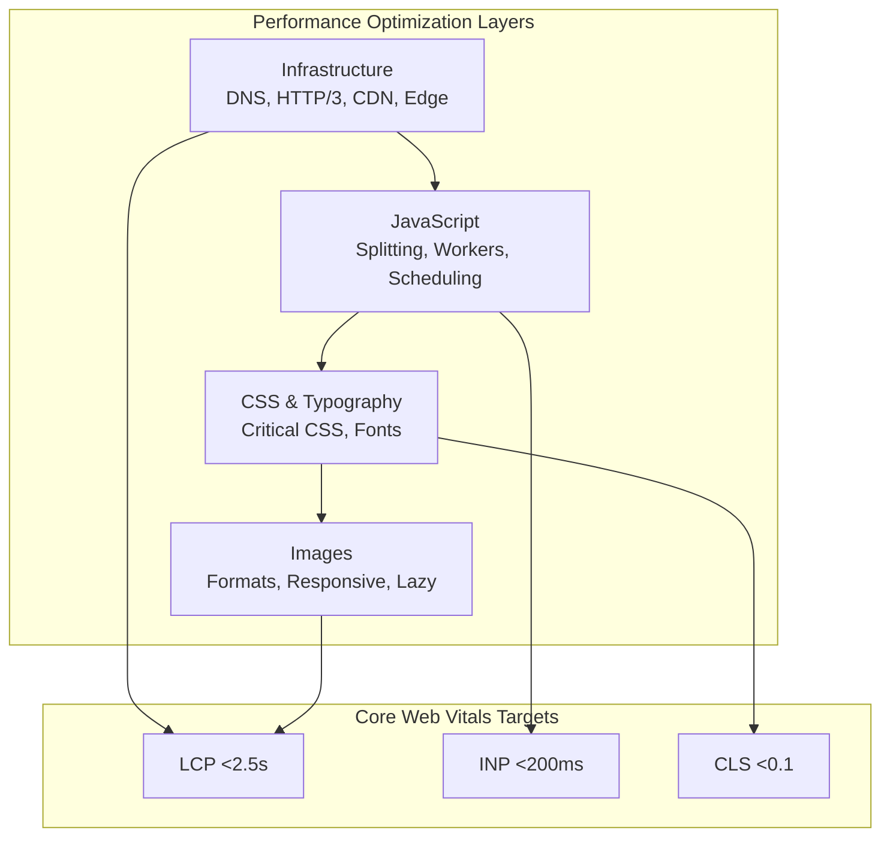

# Web Performance Optimization: Infrastructure, JavaScript, CSS, and Media

Overview of web performance optimization covering infrastructure, JavaScript, CSS, images, and fonts. Provides quick reference tables and links to detailed articles in the series.

## TLDR

**Web Performance Optimization (WPO)** maximizes user experience by reducing load times, improving responsiveness, and ensuring visual stability across four optimization layers.

### Core Web Vitals Targets

- **LCP (Largest Contentful Paint)**: ≤2.5s for good, measures perceived load speed
- **INP (Interaction to Next Paint)**: ≤200ms for good, measures interaction responsiveness
- **CLS (Cumulative Layout Shift)**: ≤0.1 for good, measures visual stability
- **TTFB**: ≤200ms for good server response (not a Core Web Vital but critical)

### Infrastructure Optimization

- **Protocol stack**: HTTP/3 + QUIC eliminates TCP head-of-line blocking, TLS 1.3 with 0-RTT
- **Edge computing**: CDN with edge functions for personalization, A/B testing, auth
- **Caching layers**: Service Worker + CDN + Redis for >80% origin offload
- **Architecture patterns**: BFF for 30-50% payload reduction, Islands for selective hydration

### JavaScript Optimization

- **Code splitting**: Route-based with `React.lazy()` + `Suspense` for 50-80% initial reduction
- **Task scheduling**: `scheduler.yield()` every 50ms to maintain INP <200ms
- **Offloading**: Web Workers for heavy computation, worker pools for parallelism
- **Tree shaking**: ES modules + `sideEffects: false` for dead code elimination

### CSS & Typography

- **Critical CSS**: Inline ≤14KB above-the-fold, defer rest with media query swap
- **Font loading**: WOFF2 + subsetting for 65-90% size reduction, metric overrides for zero-CLS
- **Compositor animations**: Only `transform` and `opacity` for 60fps rendering

### Image Optimization

- **Modern formats**: AVIF (30-50% smaller than JPEG), WebP as fallback, both have 93%+ support
- **Loading strategy**: `fetchpriority="high"` for LCP images, `loading="lazy"` for below-fold
- **Responsive delivery**: `srcset` with width descriptors, `sizes` for layout hints

<figure>



<figcaption>Web performance optimization layers and their impact on Core Web Vitals</figcaption>

</figure>

## Core Web Vitals Targets

| Metric | Good | Needs Improvement | Poor |
|--------|------|-------------------|------|
| **LCP** (Largest Contentful Paint) | ≤2.5s | 2.5s–4.0s | >4.0s |
| **INP** (Interaction to Next Paint) | ≤200ms | 200ms–500ms | >500ms |
| **CLS** (Cumulative Layout Shift) | ≤0.1 | 0.1–0.25 | >0.25 |
| **TTFB** (Time to First Byte) | ≤200ms | 200ms–500ms | >500ms |

Google evaluates Core Web Vitals at the 75th percentile of page views—a site passes only when all three metrics (LCP, INP, CLS) are "good" ([web.dev Core Web Vitals](https://web.dev/articles/vitals)).

## 1. Infrastructure & Architecture

Infrastructure optimization addresses the foundation of web performance: network protocols, edge computing, and server architecture. Proper infrastructure can reduce TTFB by 85-95% and offload 80%+ of traffic to the edge.

**Detailed coverage**: [Infrastructure Optimization for Web Performance](./2025-02-04-wpo-infrastructure.md)

### Quick Reference

| Layer | Key Technologies | Target Metrics |
|-------|------------------|----------------|
| **DNS** | SVCB/HTTPS records | <50ms resolution |
| **Protocol** | HTTP/3, TLS 1.3, QUIC | <100ms connection |
| **Edge** | CDN, Edge Functions | >80% origin offload |
| **Origin** | Load balancing, Redis | <100ms TTFB |
| **Architecture** | Islands, BFF, Resumability | 50-80% JS reduction |

### Key Techniques

- **DNS Protocol Discovery**: HTTPS records enable HTTP/3 discovery, saving 100-300ms on connection establishment
- **HTTP/3 and QUIC**: Eliminates TCP head-of-line blocking; up to 55% faster page loads in high packet loss scenarios ([Cloudflare HTTP/3 benchmarks](https://blog.cloudflare.com/http-3-vs-http-2/))
- **Edge Computing**: Run logic at CDN edge for personalization, A/B testing, auth
- **BFF Pattern**: 30-50% payload reduction, 60-80% fewer API requests
- **Multi-layer Caching**: Service Worker + IndexedDB + CDN for comprehensive caching

## 2. JavaScript Optimization

JavaScript optimization focuses on reducing bundle size, managing long tasks, and offloading computation. Proper optimization can reduce bundles by 50-80% and keep INP under 200ms.

**Detailed coverage**: [JavaScript Performance Optimization](./2025-01-09-wpo-js.md)

### Quick Reference

| Technique | Use Case | Impact |
|-----------|----------|--------|
| **async/defer** | Script loading | Unblock HTML parsing |
| **Code splitting** | Large bundles | 50-80% initial reduction |
| **scheduler.yield()** | Long tasks >50ms | Better INP, no jank |
| **Web Workers** | Heavy computation | Off main thread |
| **React.memo** | Component updates | Prevent unnecessary re-renders |

### Key Techniques

- **Script Loading**: Use `defer` for app code (preserves order), `async` for independent scripts
- **Code Splitting**: Route-based with `React.lazy()` + `Suspense`, component-level for heavy widgets
- **Task Scheduling**: `scheduler.yield()` every 50 items or 5ms to maintain responsiveness
- **Worker Pools**: Manage multiple workers for parallel computation with task queuing
- **Tree Shaking**: Mark packages `sideEffects: false`, use ES modules for dead code elimination

## 3. CSS & Typography

CSS and typography optimization targets render-blocking resources, layout stability, and font loading. Proper optimization can achieve sub-14KB critical CSS and zero-CLS font swaps.

**Detailed coverage**: [CSS and Typography Optimization](./2024-07-31-wpo-css-typography.md)

### Quick Reference

| Technique | Use Case | Impact |
|-----------|----------|--------|
| **Critical CSS** | Above-the-fold styles | Eliminate render-blocking |
| **CSS Containment** | Layout isolation | 20-40% layout savings |
| **WOFF2 + subset** | Font delivery | 65-90% smaller fonts |
| **font-display** | Loading strategy | Control FOIT/FOUT |
| **Metric overrides** | Fallback matching | Zero-CLS font swap |

### Key Techniques

- **Critical CSS**: Inline ≤14KB above-the-fold styles, defer rest with media="print" swap
- **CSS Containment**: `contain: layout paint style` isolates reflows to subtrees
- **Compositor Animations**: Only animate `transform` and `opacity` for 60fps
- **Font Subsetting**: Remove unused glyphs with pyftsubset for 65-90% reduction
- **Variable Fonts**: Single file for all weights, smaller than 3+ static files combined
- **Font Metric Overrides**: `size-adjust`, `ascent-override` for zero-CLS fallback fonts

## 4. Image Optimization

Image optimization delivers the largest bandwidth savings through modern formats, responsive sizing, and strategic loading. Proper optimization achieves 50-80% bandwidth reduction and 40-60% faster LCP.

**Detailed coverage**: [Image Optimization for Web Performance](./2024-07-05-wpo-images.md)

### Quick Reference

| Technique | Use Case | Impact |
|-----------|----------|--------|
| **AVIF/WebP** | Modern browsers | 30-50% smaller than JPEG |
| **srcset + sizes** | Responsive images | Right size per device |
| **loading="lazy"** | Below fold images | Reduce initial payload |
| **fetchpriority** | LCP images | 10-25% faster LCP |
| **decoding="async"** | Non-blocking decode | Up to 20% LCP improvement |

### Format Selection

| Format | Compression vs JPEG | Browser Support | Best Use Case |
|--------|---------------------|-----------------|---------------|
| **AVIF** | 1.5-2× smaller | ~94% | HDR photos, rich media |
| **WebP** | 1.25-1.34× smaller | ~97% | General web photos & UI |
| **JPEG** | 1× (baseline) | 100% | Universal fallback |
| **PNG** | Lossless | 100% | Graphics, transparency |

### Key Techniques

- **Picture Element**: Format negotiation with AVIF → WebP → JPEG fallback chain
- **Responsive Images**: `srcset` with width descriptors, `sizes` for layout hints
- **LCP Images**: `loading="eager"` + `fetchpriority="high"` + `decoding="async"`
- **Below-fold Images**: `loading="lazy"` with 200px rootMargin for prefetching
- **Network-aware Loading**: Adjust quality based on `navigator.connection.effectiveType`

## 5. Performance Monitoring

Continuous monitoring ensures optimizations remain effective and regressions are caught early.

### Key Metrics to Track

- **Core Web Vitals**: LCP, INP, CLS via PerformanceObserver
- **TTFB and Server Response**: Backend and infrastructure health
- **Bundle Sizes**: Track with size-limit, fail builds on regression
- **Cache Hit Rates**: CDN and service worker effectiveness

### Monitoring Tools

| Tool | Purpose | Integration |
|------|---------|-------------|
| **Lighthouse CI** | Synthetic monitoring | GitHub Actions |
| **size-limit** | Bundle size budgets | CI/CD pipeline |
| **PerformanceObserver** | Real User Monitoring | Analytics |
| **WebPageTest** | Detailed waterfall analysis | Manual testing |

## Implementation Checklist

### Infrastructure
- [ ] Enable HTTP/3 with HTTPS DNS records
- [ ] Configure TLS 1.3 with 0-RTT resumption
- [ ] Set up CDN with edge computing capabilities
- [ ] Implement multi-layer caching (CDN + Service Worker + Redis)
- [ ] Configure Brotli compression (level 11 static, level 4-5 dynamic)

### JavaScript
- [ ] Implement route-based code splitting
- [ ] Use `scheduler.yield()` for tasks >50ms
- [ ] Offload heavy computation to Web Workers
- [ ] Configure tree shaking with ES modules
- [ ] Set up bundle size budgets in CI

### CSS & Typography
- [ ] Extract and inline critical CSS (≤14KB)
- [ ] Apply CSS containment to independent sections
- [ ] Use WOFF2 format with subsetting
- [ ] Implement font metric overrides for zero-CLS
- [ ] Preload critical fonts with crossorigin attribute

### Images
- [ ] Serve AVIF/WebP with JPEG fallback via `<picture>`
- [ ] Implement responsive images with srcset and sizes
- [ ] Use `fetchpriority="high"` for LCP images
- [ ] Apply `loading="lazy"` to below-fold images
- [ ] Set explicit width/height to prevent CLS

### Monitoring
- [ ] Set up Lighthouse CI in GitHub Actions
- [ ] Configure bundle size budgets with size-limit
- [ ] Implement RUM with PerformanceObserver
- [ ] Create performance dashboards and alerts

## Performance Budget Reference

```json
{
  "resourceSizes": {
    "total": "500KB",
    "javascript": "150KB",
    "css": "50KB",
    "images": "200KB",
    "fonts": "75KB"
  },
  "metrics": {
    "lcp": "2.5s",
    "fcp": "1.8s",
    "ttfb": "200ms",
    "inp": "200ms",
    "cls": "0.1"
  }
}
```

## Series Articles

| Article | Focus Area | Key Topics |
|---------|------------|------------|
| [Infrastructure Optimization](./2025-02-04-wpo-infrastructure.md) | Network & Architecture | DNS, HTTP/3, CDN, Edge, BFF, Caching |
| [JavaScript Optimization](./2025-01-09-wpo-js.md) | Client-side Performance | Code splitting, Workers, React, Scheduling |
| [CSS & Typography](./2024-07-31-wpo-css-typography.md) | Rendering & Fonts | Critical CSS, Containment, Font loading |
| [Image Optimization](./2024-07-05-wpo-images.md) | Media Delivery | Formats, Responsive, Lazy loading |

## References

- [Core Web Vitals](https://web.dev/articles/vitals) - Google's essential metrics for user experience
- [HTTP/3 Explained](https://http3-explained.haxx.se/) - QUIC and HTTP/3 guide
- [Web Workers API - MDN](https://developer.mozilla.org/en-US/docs/Web/API/Web_Workers_API) - Background thread processing
- [CSS Containment - MDN](https://developer.mozilla.org/en-US/docs/Web/CSS/CSS_containment) - Layout optimization
- [Responsive Images - MDN](https://developer.mozilla.org/en-US/docs/Learn/HTML/Multimedia_and_embedding/Responsive_images) - Image optimization guide
- [Variable Fonts - MDN](https://developer.mozilla.org/en-US/docs/Web/CSS/CSS_fonts/Variable_fonts_guide) - Font optimization
- [Lighthouse CI](https://github.com/GoogleChrome/lighthouse-ci) - Performance testing in CI/CD
