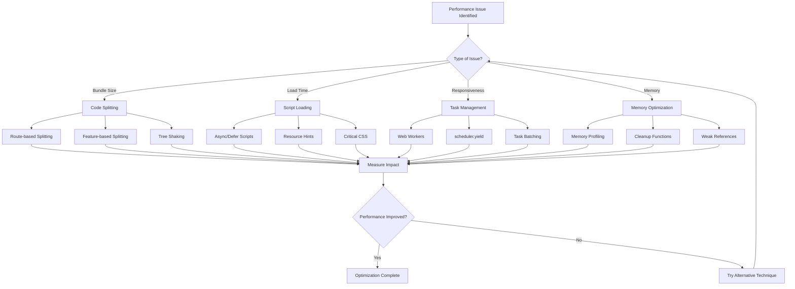

# Web Performance Optimization Overview

Advanced techniques for optimizing web application performance across infrastructure, frontend, and modern browser capabilities. Covers Islands Architecture, HTTP/3, edge computing, JavaScript optimization, CSS rendering, image formats, font loading, caching strategies, and performance monitoring.


1. [Architectural Performance Patterns](#1-architectural-performance-patterns)
2. [Infrastructure and Network Optimization](#2-infrastructure-and-network-optimization)
3. [Asset Optimization Strategies](#3-asset-optimization-strategies)
4. [JavaScript Performance Optimization](#4-javascript-performance-optimization)
5. [CSS and Rendering Optimization](#5-css-and-rendering-optimization)
6. [Image and Media Optimization](#6-image-and-media-optimization)
7. [Font Optimization](#7-font-optimization)
8. [Caching and Delivery Strategies](#8-caching-and-delivery-strategies)
9. [Performance Monitoring and Measurement](#9-performance-monitoring-and-measurement)
10. [Implementation Checklist and Best Practices](#10-implementation-checklist-and-best-practices)

## Executive Summary

Web performance optimization is a multi-layered discipline that requires expertise across infrastructure, network protocols, asset optimization, and modern browser capabilities. This comprehensive guide synthesizes advanced techniques from architectural patterns to granular optimizations, providing a complete framework for building high-performance web applications.

**Key Performance Targets:**

- **LCP**: <2.5s (excellent), <4.0s (good)
- **FID/INP**: <100ms (excellent), <200ms (good)
- **CLS**: <0.1 (excellent), <0.25 (good)
- **TTFB**: <100ms (excellent), <200ms (good)
- **Bundle Size**: <150KB JavaScript, <50KB CSS
- **Cache Hit Ratio**: >90% for static assets

## 1. Architectural Performance Patterns

### 1.1 Islands Architecture: Selective Hydration Strategy

The Islands Architecture represents a paradigm shift from traditional SPAs by rendering pages as static HTML by default and hydrating only interactive components on demand. This approach reduces initial JavaScript payload by 50-80% while maintaining rich interactivity.

**Core Principles:**

- **Static by Default**: Pages render as static HTML with no JavaScript required for initial display
- **Selective Hydration**: Interactive components are hydrated progressively based on user interaction
- **Progressive Enhancement**: Functionality is added incrementally without blocking initial render

**Implementation with Astro:**

```javascript
---
// Server-side rendering for static content
const posts = await getPosts();
---

<html>
  <body>
    <!-- Static HTML - no JavaScript required -->
    <main>
      {posts.map(post => (
        <article>
          <h2>{post.title}</h2>
          <p>{post.excerpt}</p>
        </article>
      ))}
    </main>

    <!-- Interactive islands - hydrated on demand -->
    <SearchComponent client:load />
    <NewsletterSignup client:visible />
    <CommentsSection client:idle />
  </body>
</html>
```

### 1.2 Resumability Architecture: Zero-Hydration Approach

Resumability takes hydration elimination to its logical conclusion. Qwik serializes application execution state into HTML and resumes execution exactly where the server left off, typically triggered by user interaction.

**Key Advantages:**

- **Zero Hydration**: No JavaScript execution on initial load
- **Instant Interactivity**: Resumes execution immediately on user interaction
- **Scalable Performance**: Performance doesn't degrade with application size

### 1.3 Backend for Frontend (BFF) Pattern

The BFF pattern addresses performance challenges of microservices by creating specialized backend services that aggregate data from multiple microservices into optimized responses.

**Performance Impact:**

- **Payload Size**: 30-50% reduction
- **API Requests**: 60-80% reduction
- **Response Time**: 60-75% faster

### 1.4 Edge Computing for Dynamic Content

Edge computing enables dynamic content generation, A/B testing, and personalization at the CDN edge, eliminating round trips to origin servers.

**Cloudflare Worker Implementation:**

```javascript
addEventListener("fetch", (event) => {
  event.respondWith(handleRequest(event.request))
})

async function handleRequest(request) {
  const url = new URL(request.url)

  // A/B testing at the edge
  if (url.pathname === "/homepage") {
    const variant = getABTestVariant(request)
    const content = await generatePersonalizedContent(request, variant)
    return new Response(content, {
      headers: { "cache-control": "public, max-age=300" },
    })
  }

  // Dynamic image optimization
  if (url.pathname.startsWith("/images/")) {
    const imageResponse = await fetch(request)
    const image = await imageResponse.arrayBuffer()
    const optimizedImage = await optimizeImage(image, request.headers.get("user-agent"))
    return new Response(optimizedImage, {
      headers: { "cache-control": "public, max-age=86400" },
    })
  }
}
```

### 1.5 Private VPC Routing for Server-Side Optimization

Leverage private VPC routing for server-side data fetching to achieve ultra-low latency communication between frontend and backend services.

**Network Path Optimization:**
| Fetching Context | Network Path | Performance Impact | Security Level |
|------------------|--------------|-------------------|----------------|
| **Client-Side** | Public Internet → CDN → Origin | Standard latency (100-300ms) | Standard security |
| **Server-Side** | Private VPC → Internal Network | Ultra-low latency (5-20ms) | Enhanced security |

## 2. Infrastructure and Network Optimization

### 2.1 DNS Optimization and Protocol Discovery

Modern DNS has evolved from simple name resolution to a sophisticated signaling mechanism using SVCB and HTTPS records for protocol discovery.

**HTTPS Records for HTTP/3 Discovery:**

```dns
; HTTPS record enabling HTTP/3 discovery
example.com. 300 IN HTTPS 1 . alpn="h3,h2" port="443" ipv4hint="192.0.2.1"
```

**Performance Benefits:**

- **Connection Establishment**: 100-300ms reduction in initial connection time
- **Page Load Time**: 200-500ms improvement for HTTP/3-capable connections
- **Network Efficiency**: Eliminates unnecessary TCP connections and protocol negotiation

### 2.2 HTTP/3 and QUIC Protocol

HTTP/3 fundamentally solves TCP-level head-of-line blocking by using QUIC over UDP, providing independent streams and faster connection establishment.

**Key Advantages:**

- **Elimination of HOL Blocking**: Packet loss in one stream doesn't impact others
- **Faster Connection Establishment**: Integrated cryptographic and transport handshake
- **Connection Migration**: Seamless network switching for mobile users

### 2.3 TLS 1.3 Performance Optimization

TLS 1.3 provides 1-RTT handshake and 0-RTT resumption, dramatically reducing connection overhead.

**Performance Gains:**

- **1-RTT Handshake**: 50% faster than TLS 1.2
- **0-RTT Resumption**: Near-instantaneous reconnections
- **Improved Security**: Removes obsolete cryptographic algorithms

### 2.4 Content Delivery Network (CDN) Strategy

Modern CDNs serve as application perimeters, providing caching, edge computing, and security at the edge.

**Advanced CDN Caching Strategy:**

```javascript
const cdnStrategy = {
  static: {
    maxAge: 31536000, // 1 year
    types: ["images", "fonts", "css", "js"],
    headers: {
      "Cache-Control": "public, max-age=31536000, immutable",
    },
  },
  dynamic: {
    maxAge: 300, // 5 minutes
    types: ["api", "html"],
    headers: {
      "Cache-Control": "public, max-age=300, stale-while-revalidate=60",
    },
  },
  micro: {
    maxAge: 5, // 5 seconds
    types: ["inventory", "pricing", "news"],
    headers: {
      "Cache-Control": "public, max-age=5, stale-while-revalidate=30",
    },
  },
}
```

### 2.5 Load Balancing and Origin Infrastructure

Implement intelligent load balancing with dynamic algorithms and in-memory caching to optimize origin performance.

**Load Balancing Algorithms:**

- **Least Connections**: Routes to server with fewest active connections
- **Least Response Time**: Routes to fastest responding server
- **Source IP Hash**: Ensures session persistence for stateful applications

**Redis Caching Strategy:**

```javascript
const redisCache = {
  userProfile: {
    key: (userId) => `user:${userId}:profile`,
    ttl: 3600, // 1 hour
    strategy: "write-through",
  },
  productCatalog: {
    key: (category) => `products:${category}`,
    ttl: 1800, // 30 minutes
    strategy: "cache-aside",
  },
}
```

## 3. Asset Optimization Strategies

### 3.1 Compression Algorithm Selection

Modern compression strategies use different algorithms for static and dynamic content to optimize both compression ratio and speed.

**Compression Strategy Matrix:**
| Algorithm | Static Content | Dynamic Content | Key Trade-off |
|-----------|----------------|-----------------|---------------|
| **Gzip** | Level 9 (pre-compressed) | Level 6 | Universal support, lower compression |
| **Brotli** | Level 11 (pre-compressed) | Level 4-5 | Highest compression, slower at high levels |
| **Zstandard** | Level 19+ (pre-compressed) | Level 12-15 | Fast compression, good ratios |

**Implementation:**

```nginx
# Advanced compression configuration
http {
    brotli on;
    brotli_comp_level 6;
    brotli_types application/javascript application/json text/css text/html;

    gzip on;
    gzip_vary on;
    gzip_static on;
    brotli_static on;
}
```

### 3.2 Bundle Optimization and Tree Shaking

Implement aggressive tree shaking and code splitting to minimize JavaScript payload.

**Route-Based Code Splitting:**

```javascript
// React Router with lazy loading
import { lazy, Suspense } from "react"

const Home = lazy(() => import("./pages/Home"))
const About = lazy(() => import("./pages/About"))

function App() {
  return (
    <Suspense fallback={<div>Loading...</div>}>
      <Routes>
        <Route path="/" element={<Home />} />
        <Route path="/about" element={<About />} />
      </Routes>
    </Suspense>
  )
}
```

**Tree Shaking with ES Modules:**

```javascript
// Only used exports will be included
export function add(a, b) {
  return a + b
}
export function subtract(a, b) {
  return a - b
}
export function multiply(a, b) {
  return a * b
}

// Only add and multiply will be included
import { add, multiply } from "./math.js"
```

## 4. JavaScript Performance Optimization

### 4.1 Long Task Management with scheduler.yield()

Modern JavaScript optimization focuses on preventing long tasks that block the main thread.

**scheduler.yield() Implementation:**

```javascript
async function processLargeDataset(items) {
  const results = []

  for (let i = 0; i < items.length; i++) {
    const result = await computeExpensiveOperation(items[i])
    results.push(result)

    // Yield control every 50 items
    if (i % 50 === 0) {
      await scheduler.yield()
    }
  }

  return results
}
```

### 4.2 Web Workers for Non-Splittable Tasks

Use Web Workers to offload heavy computation from the main thread.

**Worker Pool Pattern:**

```javascript
class WorkerPool {
  constructor(workerScript, poolSize = navigator.hardwareConcurrency) {
    this.workers = []
    this.queue = []
    this.availableWorkers = []

    for (let i = 0; i < poolSize; i++) {
      const worker = new Worker(workerScript)
      worker.onmessage = (event) => this.handleWorkerMessage(worker, event)
      this.workers.push(worker)
      this.availableWorkers.push(worker)
    }
  }

  executeTask(task) {
    return new Promise((resolve, reject) => {
      const taskWrapper = { task, resolve, reject }

      if (this.availableWorkers.length > 0) {
        this.executeTaskWithWorker(this.availableWorkers.pop(), taskWrapper)
      } else {
        this.queue.push(taskWrapper)
      }
    })
  }
}
```

### 4.3 React and Next.js Optimization

Implement React-specific optimizations for high-performance applications.

**React.memo and useCallback:**

```javascript
const ExpensiveComponent = React.memo(({ data, onUpdate }) => {
  const processedData = useMemo(() => {
    return expensiveProcessing(data)
  }, [data])

  return (
    <div>
      {processedData.map((item) => (
        <DataItem key={item.id} item={item} onUpdate={onUpdate} />
      ))}
    </div>
  )
})

const handleItemSelect = useCallback((id) => {
  setSelectedId(id)
  analytics.track("item_selected", { id })
}, [])
```

**Next.js Server Components:**

```javascript
// Server Component - runs on server
async function ServerComponent({ userId }) {
  const userData = await fetchUserData(userId)

  return (
    <div>
      <h1>{userData.name}</h1>
      <ClientComponent userData={userData} />
    </div>
  )
}

// Client Component - runs in browser
;("use client")
function ClientComponent({ userData }) {
  const [isEditing, setIsEditing] = useState(false)
  return <div>{isEditing ? <EditForm userData={userData} /> : <UserProfile userData={userData} />}</div>
}
```

## 5. CSS and Rendering Optimization

### 5.1 Critical CSS Extraction and Inlining

Extract and inline critical CSS to eliminate render-blocking resources.

**Critical CSS Workflow:**

```bash
npx critical index.html \
  --width 360 --height 640 \
  --inline --minify \
  --extract
```

**Implementation:**

```html
<style id="critical">
  /* minified critical rules */
  header {
    display: flex;
    align-items: center;
  }
</style>

<link rel="stylesheet" href="/static/app.css" media="print" onload="this.media='all'" />
```

### 5.2 CSS Containment and Rendering Optimization

Use CSS containment to scope layout, paint, and style computations to subtrees.

**Containment Properties:**

```css
.card {
  contain: layout paint style;
}

.section {
  content-visibility: auto;
  contain-intrinsic-size: 0 1000px; /* reserve space */
}
```

### 5.3 Compositor-Friendly Animations

Animate only opacity and transform properties to stay on the compositor thread.

**CSS Houdini Paint Worklet:**

```javascript
// checkerboard.js
registerPaint(
  "checker",
  class {
    paint(ctx, geom) {
      const s = 16
      for (let y = 0; y < geom.height; y += s) for (let x = 0; x < geom.width; x += s) ctx.fillRect(x, y, s, s)
    }
  },
)
```

```html
<script>
  CSS.paintWorklet.addModule("/checkerboard.js")
</script>
.widget { background: paint(checker); }
```

### 5.4 Animation Worklet for Off-Main Thread Animations

Use Animation Worklet for custom scripted animations decoupled from the main thread.

```javascript
// bounce.js
registerAnimator(
  "bounce",
  class {
    animate(t, fx) {
      fx.localTime = Math.abs(Math.sin(t / 300)) * 1000
    }
  },
)
CSS.animationWorklet.addModule("/bounce.js")

const effect = new KeyframeEffect(node, { transform: ["scale(.8)", "scale(1.2)"] }, { duration: 1000 })
new WorkletAnimation("bounce", effect, document.timeline).play()
```

## 6. Image and Media Optimization

### 6.1 Responsive Images with Modern Formats

Implement responsive images using the `<picture>` element with format negotiation and art direction.

**Complete Picture Element Implementation:**

```html
<picture>
  <!-- Art direction: different crop for mobile -->
  <source media="(max-width: 768px)" srcset="hero-mobile-400.jpg 400w, hero-mobile-600.jpg 600w" type="image/jpeg" />

  <!-- Format negotiation: AVIF for supported browsers -->
  <source srcset="hero-800.avif 800w, hero-1200.avif 1200w" type="image/avif" />

  <!-- Format negotiation: WebP fallback -->
  <source srcset="hero-800.webp 800w, hero-1200.webp 1200w" type="image/webp" />

  <!-- Final fallback -->
  
</picture>
```

### 6.2 Modern Image Format Comparison

| Format      | Compression vs JPEG | Best Use Case               | Browser Support | Fallback  |
| ----------- | ------------------- | --------------------------- | --------------- | --------- |
| **JPEG**    | 1×                  | Photographs, ubiquity       | 100%            | JPEG      |
| **WebP**    | 1.25–1.34× smaller  | Web delivery of photos & UI | 96%             | JPEG/PNG  |
| **AVIF**    | 1.5–2× smaller      | Next-gen photos & graphics  | 72%             | WebP/JPEG |
| **JPEG XL** | 1.2–1.5× smaller    | High-quality photos         | 0%              | JPEG      |

### 6.3 Lazy Loading and Decoding Control

Implement intelligent lazy loading with Intersection Observer and async decoding.

**Advanced Lazy Loading:**

```javascript
const io = new IntersectionObserver(
  (entries, obs) => {
    entries.forEach(({ isIntersecting, target }) => {
      if (!isIntersecting) return

      const img = target
      img.src = img.dataset.src

      // Decode image asynchronously
      img
        .decode()
        .then(() => img.classList.add("loaded"))
        .catch((err) => console.error("Image decode failed:", err))

      obs.unobserve(img)
    })
  },
  {
    rootMargin: "200px", // Start loading 200px before image enters viewport
    threshold: 0.1, // Trigger when 10% of image is visible
  },
)

document.querySelectorAll("img.lazy").forEach((img) => io.observe(img))
```

**HTML Attributes for Performance:**

```html
<!-- Critical above-the-fold image -->


<!-- Below-the-fold image -->

```

### 6.4 Network-Aware Image Loading

Implement adaptive image loading based on network conditions and user preferences.

```javascript
class NetworkAwareImageLoader {
  constructor() {
    this.connection = navigator.connection || navigator.mozConnection || navigator.webkitConnection
    this.setupOptimization()
  }

  getOptimalQuality() {
    if (!this.connection) return 80

    const { effectiveType, downlink } = this.connection

    if (effectiveType === "slow-2g" || downlink < 1) return 60
    if (effectiveType === "2g" || downlink < 2) return 70
    if (effectiveType === "3g" || downlink < 5) return 80
    return 90
  }

  getOptimalFormat() {
    if (!this.connection) return "webp"

    const { effectiveType } = this.connection

    if (effectiveType === "slow-2g" || effectiveType === "2g") return "jpeg"
    return "webp"
  }
}
```

## 7. Font Optimization

### 7.1 WOFF2 and Font Subsetting

Use WOFF2 format with aggressive subsetting to minimize font payload.

**WOFF2 Implementation:**

```css
@font-face {
  font-family: "MyOptimizedFont";
  font-style: normal;
  font-weight: 400;
  font-display: swap;
  src: url("/fonts/my-optimized-font.woff2") format("woff2");
}
```

**Subsetting with pyftsubset:**

```bash
pyftsubset SourceSansPro.ttf \
  --output-file="SourceSansPro-subset.woff2" \
  --flavor=woff2 \
  --layout-features='*' \
  --unicodes="U+0020-007E,U+2018,U+2019,U+201C,U+201D,U+2026"
```

### 7.2 Variable Fonts for Multiple Styles

Consolidate multiple font styles into a single variable font file.

**Variable Font Implementation:**

```css
@font-face {
  font-family: "MyVariableFont";
  src: url("MyVariableFont.woff2") format("woff2-variations");
  font-weight: 100 900;
  font-stretch: 75% 125%;
  font-style: normal;
}

h1 {
  font-family: "MyVariableFont", sans-serif;
  font-weight: 785; /* Any value within 100-900 range */
}

.condensed-text {
  font-family: "MyVariableFont", sans-serif;
  font-stretch: 85%; /* Any percentage within 75%-125% range */
}
```

### 7.3 Strategic Font Loading and font-display

Implement strategic font loading with preloading and appropriate font-display values.

**Preloading Critical Fonts:**

```html
<link rel="preload" href="/fonts/critical-heading-font.woff2" as="font" type="font/woff2" crossorigin="anonymous" />
```

**Font Display Strategy:**

```css
/* Critical branding elements */
@font-face {
  font-family: "BrandFont";
  font-display: swap; /* Immediate visibility, potential CLS */
  src: url("/fonts/brand-font.woff2") format("woff2");
}

/* Body text where stability is paramount */
@font-face {
  font-family: "BodyFont";
  font-display: optional; /* No CLS, may not load on slow connections */
  src: url("/fonts/body-font.woff2") format("woff2");
}
```

### 7.4 Font Metrics Override for Zero-CLS

Use font metric overrides to create dimensionally identical fallback fonts.

```css
/*
 * Define the actual web font with font-display: swap
 */
@font-face {
  font-family: "Inter";
  font-style: normal;
  font-weight: 400;
  font-display: swap;
  src: url("/fonts/inter-regular.woff2") format("woff2");
}

/*
 * Define metrics-adjusted fallback font
 */
@font-face {
  font-family: "Inter-Fallback";
  src: local("Arial");
  ascent-override: 90.2%;
  descent-override: 22.48%;
  line-gap-override: 0%;
  size-adjust: 107.4%;
}

/*
 * Use in font stack
 */
body {
  font-family: "Inter", "Inter-Fallback", sans-serif;
}
```

## 8. Caching and Delivery Strategies

### 8.1 Multi-Layer Caching Architecture

Implement sophisticated caching strategies using service workers and IndexedDB.

**Service Worker Caching with Workbox:**

```javascript
import { registerRoute } from "workbox-routing"
import { CacheFirst, NetworkFirst, StaleWhileRevalidate } from "workbox-strategies"

// Cache-first for static assets
registerRoute(
  ({ request }) => request.destination === "image" || request.destination === "font",
  new CacheFirst({
    cacheName: "static-assets",
    plugins: [
      new ExpirationPlugin({
        maxEntries: 100,
        maxAgeSeconds: 30 * 24 * 60 * 60, // 30 days
      }),
    ],
  }),
)

// Stale-while-revalidate for CSS/JS bundles
registerRoute(
  ({ request }) => request.destination === "script" || request.destination === "style",
  new StaleWhileRevalidate({
    cacheName: "bundles",
  }),
)

// Network-first for API responses
registerRoute(
  ({ url }) => url.pathname.startsWith("/api/"),
  new NetworkFirst({
    cacheName: "api-cache",
    networkTimeoutSeconds: 3,
    plugins: [
      new ExpirationPlugin({
        maxEntries: 50,
        maxAgeSeconds: 5 * 60, // 5 minutes
      }),
    ],
  }),
)
```

### 8.2 IndexedDB for Large Data Sets

Use IndexedDB for large data storage in combination with service worker caching.

```javascript
class DataCache {
  constructor() {
    this.dbName = "PerformanceCache"
    this.version = 1
    this.init()
  }

  async init() {
    return new Promise((resolve, reject) => {
      const request = indexedDB.open(this.dbName, this.version)

      request.onerror = () => reject(request.error)
      request.onsuccess = () => {
        this.db = request.result
        resolve()
      }

      request.onupgradeneeded = (event) => {
        const db = event.target.result

        if (!db.objectStoreNames.contains("apiResponses")) {
          const store = db.createObjectStore("apiResponses", { keyPath: "url" })
          store.createIndex("timestamp", "timestamp", { unique: false })
        }
      }
    })
  }

  async cacheApiResponse(url, data, ttl = 300000) {
    const transaction = this.db.transaction(["apiResponses"], "readwrite")
    const store = transaction.objectStore("apiResponses")

    await store.put({
      url,
      data,
      timestamp: Date.now(),
      ttl,
    })
  }
}
```

### 8.3 Third-Party Script Management

Implement advanced isolation strategies for third-party scripts.

**Proxying and Facades:**

```javascript
class LiteYouTubeEmbed {
  constructor(element) {
    this.element = element
    this.videoId = element.dataset.videoId
    this.setupFacade()
  }

  setupFacade() {
    // Create lightweight preview
    this.element.innerHTML = `
      <div class="youtube-preview" style="background-image: url(https://i.ytimg.com/vi/${this.videoId}/maxresdefault.jpg)">
        <button class="play-button" aria-label="Play video">
          <svg viewBox="0 0 68 48"><path d="M66.52,7.74c-0.78-2.93-2.49-5.41-5.42-6.19C55.79,.13,34,0,34,0S12.21,.13,6.9,1.55 C3.97,2.33,2.27,4.81,1.48,7.74C0.06,13.05,0,24,0,24s0.06,10.95,1.48,16.26c0.78,2.93,2.49,5.41,5.42,6.19 C12.21,47.87,34,48,34,48s21.79-0.13,27.1-1.55c2.93-0.78,4.64-3.26,5.42-6.19C67.94,34.95,68,24,68,24S67.94,13.05,66.52,7.74z"></path></svg>
        </button>
      </div>
    `

    // Load full YouTube script only on interaction
    this.element.querySelector(".play-button").addEventListener("click", () => {
      this.loadFullEmbed()
    })
  }

  loadFullEmbed() {
    const script = document.createElement("script")
    script.src = "https://www.youtube.com/iframe_api"
    document.head.appendChild(script)

    this.element.innerHTML = `<iframe src="https://www.youtube.com/embed/${this.videoId}?autoplay=1" frameborder="0" allowfullscreen></iframe>`
  }
}
```

**Off-Main Thread Execution with Partytown:**

```html
<script>
  partytown = {
    forward: ["dataLayer.push", "gtag", "fbq"],
    lib: "/~partytown/",
  }
</script>
<script src="/~partytown/partytown.js"></script>

<!-- Analytics script runs in Web Worker -->
<script type="text/partytown" src="https://www.googletagmanager.com/gtag/js?id=GA_MEASUREMENT_ID"></script>
<script type="text/partytown">
  window.dataLayer = window.dataLayer || [];
  function gtag(){dataLayer.push(arguments);}
  gtag('js', new Date());
  gtag('config', 'GA_MEASUREMENT_ID');
</script>
```

## 9. Performance Monitoring and Measurement

### 9.1 Core Web Vitals Measurement

Implement comprehensive monitoring of Core Web Vitals and performance metrics.

**Performance Observer Implementation:**

```javascript
class PerformanceMonitor {
  constructor() {
    this.metrics = {}
    this.observers = []
    this.setupObservers()
  }

  setupObservers() {
    // LCP measurement
    const lcpObserver = new PerformanceObserver((list) => {
      const entries = list.getEntries()
      const lastEntry = entries[entries.length - 1]
      this.metrics.lcp = lastEntry.startTime
    })
    lcpObserver.observe({ type: "largest-contentful-paint" })

    // INP measurement
    const inpObserver = new PerformanceObserver((list) => {
      const entries = list.getEntries()
      const maxInp = Math.max(...entries.map((entry) => entry.value))

      if (maxInp > 200) {
        this.recordViolation("INP", maxInp, 200)
      }
    })
    inpObserver.observe({ type: "interaction" })

    // CLS measurement
    let clsValue = 0
    const clsObserver = new PerformanceObserver((list) => {
      list.getEntries().forEach((entry) => {
        if (!entry.hadRecentInput) {
          clsValue += entry.value
          this.metrics.cls = clsValue
        }
      })
    })
    clsObserver.observe({ type: "layout-shift" })

    this.observers.push(lcpObserver, inpObserver, clsObserver)
  }

  recordViolation(metric, actual, budget) {
    const violation = {
      metric,
      actual,
      budget,
      timestamp: Date.now(),
      url: window.location.href,
      userAgent: navigator.userAgent,
    }

    // Send to analytics
    if (window.gtag) {
      gtag("event", "performance_violation", {
        metric: violation.metric,
        actual_value: violation.actual,
        budget_value: violation.budget,
        page_url: violation.url,
      })
    }
  }
}
```

### 9.2 Performance Budgets and Regression Prevention

Implement automated performance budgets to prevent regressions.

**Bundle Size Monitoring:**

```javascript
// .size-limit.js configuration
module.exports = [
  {
    name: "Main Bundle",
    path: "dist/main.js",
    limit: "150 KB",
    webpack: false,
    gzip: true,
  },
  {
    name: "CSS Bundle",
    path: "dist/styles.css",
    limit: "50 KB",
    webpack: false,
    gzip: true,
  },
]
```

**Lighthouse CI Integration:**

```yaml
# .github/workflows/performance.yml
name: Performance Audit
on: [pull_request, push]

jobs:
  lighthouse:
    runs-on: ubuntu-latest
    steps:
      - uses: actions/checkout@v3
      - name: Run Lighthouse CI
        uses: treosh/lighthouse-ci-action@v10
        with:
          configPath: "./lighthouserc.json"
          uploadArtifacts: true
          temporaryPublicStorage: true
```

### 9.3 Real-Time Performance Monitoring

Implement real-time monitoring with automated alerting.

```javascript
class RUMBudgetMonitor {
  constructor() {
    this.budgets = {
      lcp: 2500,
      fcp: 1800,
      inp: 200,
      cls: 0.1,
      ttfb: 600,
    }
    this.violations = []
    this.initMonitoring()
  }

  initMonitoring() {
    if ("PerformanceObserver" in window) {
      // Monitor Core Web Vitals
      const lcpObserver = new PerformanceObserver((list) => {
        const entries = list.getEntries()
        const lastEntry = entries[entries.length - 1]

        if (lastEntry.startTime > this.budgets.lcp) {
          this.recordViolation("LCP", lastEntry.startTime, this.budgets.lcp)
        }
      })
      lcpObserver.observe({ entryTypes: ["largest-contentful-paint"] })
    }
  }

  alertTeam() {
    fetch("/api/performance-alert", {
      method: "POST",
      headers: { "Content-Type": "application/json" },
      body: JSON.stringify({
        violations: this.violations.slice(-10),
        summary: this.getViolationSummary(),
      }),
    })
  }
}
```

## 10. Implementation Checklist and Best Practices

### 10.1 Performance Optimization Checklist

**Infrastructure and Network:**

- [ ] Implement DNS optimization with SVCB/HTTPS records
- [ ] Enable HTTP/3 and TLS 1.3
- [ ] Configure CDN with edge computing capabilities
- [ ] Set up load balancing with dynamic algorithms
- [ ] Implement in-memory caching (Redis/Memcached)
- [ ] Optimize database queries and indexing

**Asset Optimization:**

- [ ] Use Brotli compression for static assets (level 11)
- [ ] Use Brotli level 4-5 for dynamic content
- [ ] Implement aggressive tree shaking
- [ ] Configure code splitting by route and feature
- [ ] Optimize images with WebP/AVIF formats
- [ ] Implement responsive images with `<picture>` element
- [ ] Use WOFF2 fonts with subsetting
- [ ] Implement variable fonts where applicable

**JavaScript Performance:**

- [ ] Use scheduler.yield() for long tasks
- [ ] Implement Web Workers for heavy computation
- [ ] Use React.memo and useCallback for React apps
- [ ] Implement lazy loading for components
- [ ] Monitor and optimize bundle sizes

**CSS and Rendering:**

- [ ] Extract and inline critical CSS
- [ ] Use CSS containment for independent sections
- [ ] Implement compositor-friendly animations
- [ ] Use CSS Houdini for custom paint worklets
- [ ] Optimize font loading with font-display

**Caching and Delivery:**

- [ ] Implement service worker caching strategy
- [ ] Use IndexedDB for large data sets
- [ ] Configure third-party script isolation
- [ ] Implement consent-based loading
- [ ] Set up performance budgets and monitoring

### 10.2 Performance Budget Configuration

**Resource Size Budgets:**

```json
{
  "budgets": {
    "resourceSizes": {
      "total": "500KB",
      "javascript": "150KB",
      "css": "50KB",
      "images": "200KB",
      "fonts": "75KB",
      "other": "25KB"
    },
    "metrics": {
      "lcp": "2.5s",
      "fcp": "1.8s",
      "ttfb": "600ms",
      "inp": "200ms",
      "cls": "0.1"
    },
    "warnings": {
      "budgetUtilization": "80%",
      "metricDegradation": "10%"
    }
  }
}
```

### 10.3 Optimization Technique Selection Matrix

| Performance Issue                   | Primary Techniques                        | Secondary Techniques                   | Measurement       |
| ----------------------------------- | ----------------------------------------- | -------------------------------------- | ----------------- |
| **Large Bundle Size**               | Code Splitting, Tree Shaking              | Lazy Loading, Compression              | Bundle Analyzer   |
| **Slow Initial Load**               | Script Loading Optimization, Critical CSS | Preloading, Resource Hints             | FCP, LCP          |
| **Poor Interaction Responsiveness** | Web Workers, scheduler.yield()            | Task Batching, Memoization             | INP, Long Tasks   |
| **Memory Leaks**                    | Memory Profiling, Cleanup                 | Weak References, Event Cleanup         | Memory Timeline   |
| **React Re-renders**                | React.memo, useCallback                   | Context Splitting, State Normalization | React Profiler    |
| **Mobile Performance**              | Bundle Splitting, Image Optimization      | Service Workers, Caching               | Mobile Lighthouse |

### 10.4 Performance Optimization Decision Tree



## Conclusion

Web performance optimization is a comprehensive discipline that requires expertise across multiple domains—from infrastructure and network protocols to frontend optimization and modern browser capabilities. The techniques outlined in this guide work synergistically to create high-performance web applications that deliver exceptional user experiences.

**Key Success Factors:**

1. **Measurement-Driven Approach**: Use performance profiling tools to identify bottlenecks and measure the impact of optimizations
2. **Layered Optimization**: Address performance at every level—infrastructure, network, assets, and application code
3. **Modern Browser APIs**: Leverage emerging capabilities like scheduler.yield(), Web Workers, and CSS Houdini
4. **Continuous Monitoring**: Implement comprehensive monitoring to detect regressions and maintain performance gains
5. **Performance Budgets**: Establish and enforce performance budgets to prevent degradation over time

**Expected Performance Improvements:**

- **Page Load Time**: 40-70% improvement through comprehensive optimization
- **Bundle Size**: 50-80% reduction through tree shaking and code splitting
- **Core Web Vitals**: Significant improvements in LCP, FID/INP, and CLS scores
- **User Experience**: Enhanced responsiveness and perceived performance
- **Infrastructure Costs**: Reduced bandwidth and server costs through effective caching

The modern web performance landscape requires sophisticated understanding of browser internals, network protocols, and system architecture. By applying the techniques and patterns presented in this guide, development teams can build applications that are not just fast, but sustainably performant across diverse user conditions and device capabilities.

Remember that performance optimization is an iterative process. Start with measurement, identify the biggest bottlenecks, apply targeted optimizations, and measure again. The comprehensive checklist provided offers a systematic approach to ensuring your applications leverage all available optimization opportunities for maximum performance impact.

As web applications continue to grow in complexity, staying current with emerging browser APIs and optimization techniques becomes increasingly important. The techniques and patterns presented here provide a solid foundation for building performant web applications that deliver exceptional user experiences across all devices and network conditions.
