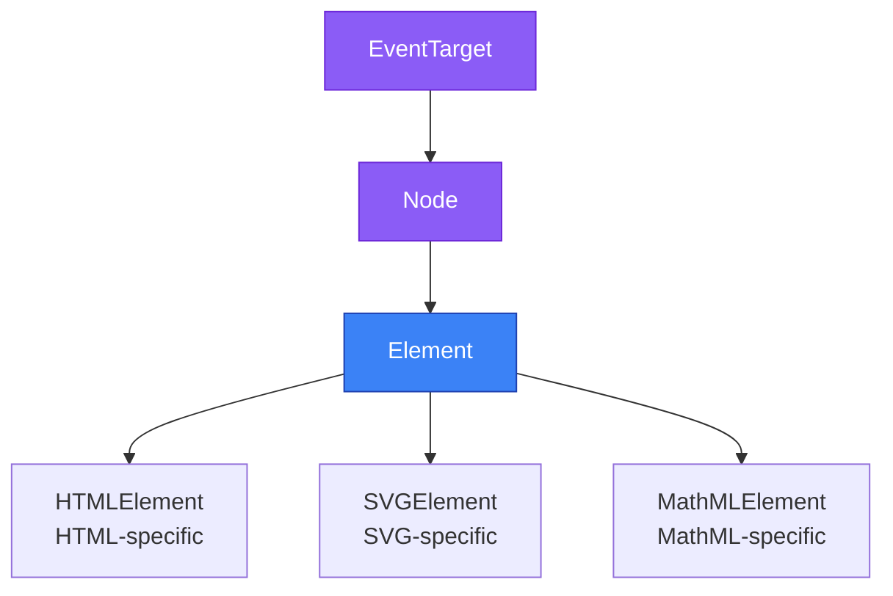
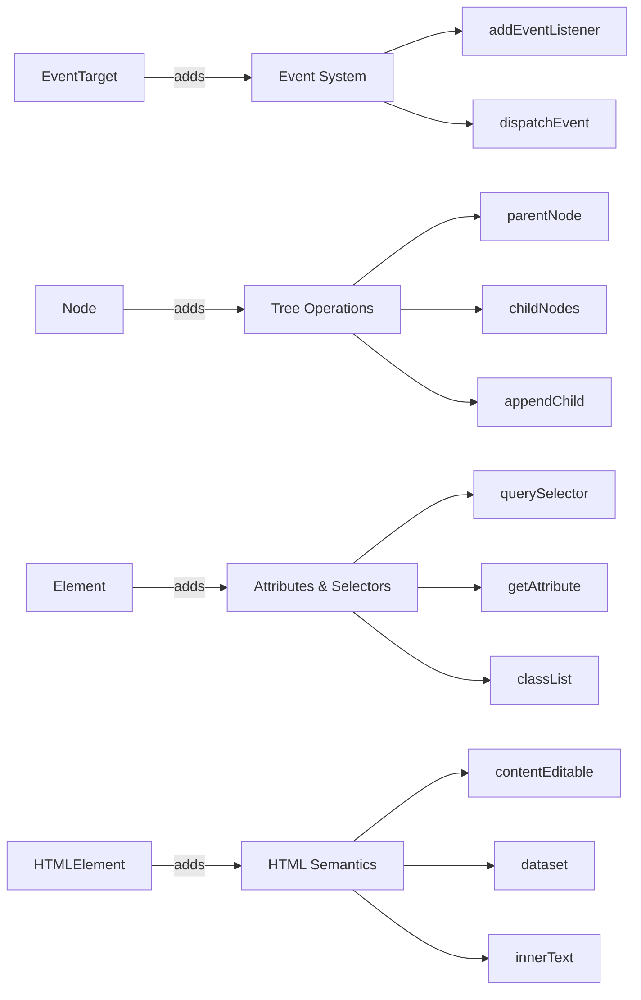
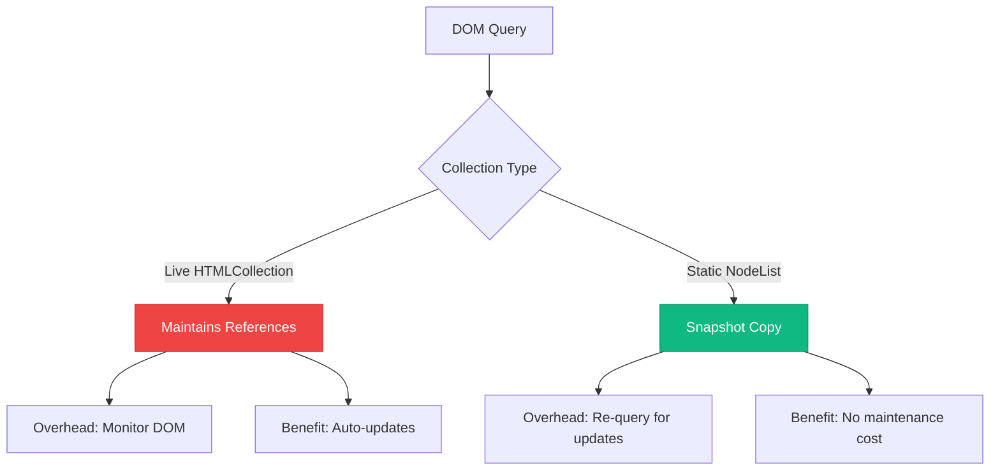
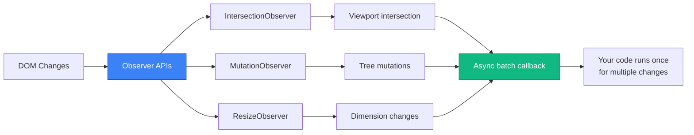

# DOM APIs: Understanding the Hierarchy, Selectors, and Observers

A comprehensive exploration of DOM APIs, examining the interface hierarchy design decisions, selector return type differences, and the modern Observer pattern for efficient DOM monitoring.

<figure>



<figcaption>DOM interface inheritance hierarchy showing Element as the universal base for all markup types</figcaption>

</figure>

## TLDR

**DOM APIs** form the programmatic interface between JavaScript and document structure, designed around a carefully layered inheritance hierarchy that separates universal tree operations from markup-specific behaviors.

### Interface Hierarchy Design

- **EventTarget** provides the foundational event system for all DOM objects through `addEventListener()`, `removeEventListener()`, and `dispatchEvent()`
- **Node** adds tree participation with parent/child relationships, enabling traversal and manipulation of document structure
- **Element** serves as the universal base for all markup elements, implementing attribute management, CSS selectors, and DOM queries applicable across HTML, SVG, and MathML
- **HTMLElement** extends Element with HTML-specific features like `contentEditable`, `dataset`, `innerText`, and form interaction properties
- **Design rationale**: Element methods like `querySelector()` work on SVG and MathML elements, not just HTML, requiring a markup-agnostic interface layer

### Selector API Return Types

- **HTMLCollection** is a live collection that auto-updates when the DOM changes, returned by `getElementsByClassName()` and `getElementsByTagName()`
- **NodeList** from `querySelectorAll()` is static, capturing a snapshot at query time that doesn't reflect subsequent DOM mutations
- **Live vs Static**: Live collections impact performance by maintaining references and updating automatically; static collections are cheaper but require re-querying
- **Array methods**: NodeList supports `forEach()` natively; HTMLCollection requires conversion via `Array.from()` or spread operator
- **Type safety**: Both are array-like with numeric indexing and `length`, but neither inherits from Array

### Observer APIs

- **IntersectionObserver** detects when elements enter or exit viewport visibility boundaries, enabling lazy loading, infinite scroll, and analytics tracking without scroll event listeners
- **MutationObserver** monitors DOM tree changes (child nodes, attributes, character data) with batched callbacks, replacing legacy Mutation Events with better performance
- **ResizeObserver** reports element dimension changes for responsive typography, adaptive layouts, and dynamic scaling independent of viewport resize events
- **Common pattern**: All three use `observe(target)`, `unobserve(target)`, `disconnect()`, and callback-based notification with entry objects describing what changed
- **Performance benefit**: Observer APIs leverage browser internals for efficient change detection, avoiding expensive polling or frequent event listener execution

---

## The DOM Interface Hierarchy

The DOM specification establishes a layered inheritance model where each interface adds capabilities while remaining backward compatible with its ancestors.

### Why Element, Not HTMLElement?

Element serves as the universal base class for all markup languages because **DOM operations must work across different document types**. Consider these scenarios:

```typescript
// This SVG circle is an Element, but NOT an HTMLElement
const circle = document.querySelector('circle');
circle.setAttribute('r', '50');  // Element method works
circle.classList.add('active');  // Element method works

// HTMLElement methods would fail on SVG elements
// circle.contentEditable // undefined - this is HTML-specific
// circle.dataset         // undefined - this is HTML-specific
```

The browser's internal class hierarchy looks like this:

```
EventTarget (base for all event-capable objects)
    ↓
Node (tree participation)
    ↓
Element (universal element operations)
    ├── HTMLElement (HTML-specific: contentEditable, dataset, innerText)
    ├── SVGElement (SVG-specific: SVG DOM properties)
    └── MathMLElement (MathML-specific: mathematical markup)
```

**Design insight**: Methods defined on Element work for HTML, SVG, and MathML elements. Methods requiring HTML-specific semantics live on HTMLElement. This separation ensures `querySelector()`, `getAttribute()`, and `classList` function identically whether you're manipulating `<div>`, `<svg>`, or `<math>` elements.

### Interface Responsibilities

<figure>



<figcaption>Each interface layer adds specific capabilities while inheriting all parent functionality</figcaption>

</figure>

**EventTarget** (`EventTarget`)
- Event registration and dispatch
- Foundation for all interactive objects
- No DOM tree awareness

**Node** (`Node extends EventTarget`)
- Tree structure participation
- Parent/child/sibling relationships
- Node types (element, text, comment, document)
- `parentNode`, `childNodes`, `firstChild`, `lastChild`
- `appendChild()`, `removeChild()`, `insertBefore()`

**Element** (`Element extends Node`)
- Attribute management: `getAttribute()`, `setAttribute()`, `hasAttribute()`
- CSS selector queries: `querySelector()`, `querySelectorAll()`, `matches()`, `closest()`
- Class manipulation: `classList`, `className`
- Geometry: `getBoundingClientRect()`, `scrollIntoView()`
- Namespace-aware operations for XML-based documents
- Works for HTML, SVG, MathML, and other XML vocabularies

**HTMLElement** (`HTMLElement extends Element`)
- HTML-specific content: `innerText`, `outerText`
- Editability: `contentEditable`, `isContentEditable`
- Data attributes: `dataset` (access to `data-*` attributes)
- Form interaction: `autofocus`, `tabIndex`, `hidden`
- Input hints: `inputMode`, `enterKeyHint`, `autocapitalize`
- Accessibility shortcuts: `accessKey`, `title`
- Internationalization: `lang`, `dir`, `translate`

### Practical Implications

The hierarchy determines method availability at compile and runtime:

```typescript
// TypeScript enforces hierarchy
const element: Element = document.querySelector('div')!;
element.classList.add('active');     // ✅ Element method
element.setAttribute('role', 'tab'); // ✅ Element method

// @ts-error: Property 'dataset' does not exist on type 'Element'
element.dataset.userId = '123';      // ❌ HTMLElement-specific

// Type narrowing required
if (element instanceof HTMLElement) {
  element.dataset.userId = '123';    // ✅ Now TypeScript knows it's HTMLElement
  element.contentEditable = 'true';  // ✅ HTML-specific property
}

// SVG elements demonstrate the distinction
const svg = document.querySelector('svg')!;
svg.classList.add('icon');           // ✅ Element method works
svg.setAttribute('viewBox', '0 0 100 100'); // ✅ Element method works
// svg.innerText = 'text';           // ❌ Would fail - innerText is HTMLElement-specific
```

**Why this matters**: When writing reusable utilities that manipulate both HTML and SVG elements, typing parameters as `Element` rather than `HTMLElement` ensures compatibility across markup types.

---

## Selector APIs: HTMLCollection vs NodeList

DOM selector methods return two distinct collection types with different liveness characteristics and capabilities.

### Return Type Matrix

| Method | Return Type | Live/Static | Node Types |
|--------|-------------|-------------|------------|
| `querySelectorAll()` | NodeList | Static | Elements only |
| `getElementsByClassName()` | HTMLCollection | Live | Elements only |
| `getElementsByTagName()` | HTMLCollection | Live | Elements only |
| `childNodes` | NodeList | Live | All nodes (text, comment, element) |
| `children` | HTMLCollection | Live | Elements only |

### HTMLCollection: Live and Limited

HTMLCollection maintains active references to matching elements, automatically reflecting DOM changes:

```typescript
const container = document.getElementById('list');
const items = container.getElementsByClassName('item');

console.log(items.length); // 3

// Add a new element with class 'item'
const newItem = document.createElement('div');
newItem.className = 'item';
container.appendChild(newItem);

console.log(items.length); // 4 - automatically updated!
```

**Liveness implications**:

```typescript
// ⚠️ Infinite loop: collection updates as you modify the DOM
const items = document.getElementsByClassName('item');
for (let i = 0; i < items.length; i++) {
  items[i].classList.remove('item'); // Removes element from collection
  // Now items.length decreased, but i increased
  // You'll only process every other element
}

// ✅ Convert to array to capture snapshot
const itemsArray = Array.from(document.getElementsByClassName('item'));
for (const item of itemsArray) {
  item.classList.remove('item'); // Safe: iterating over static array
}
```

**No array methods**:

```typescript
const items = document.getElementsByClassName('item');

// ❌ TypeError: items.forEach is not a function
items.forEach(item => console.log(item));

// ✅ Convert to array first
Array.from(items).forEach(item => console.log(item));

// ✅ Or use spread operator
[...items].forEach(item => console.log(item));

// ✅ Traditional for loop works
for (let i = 0; i < items.length; i++) {
  console.log(items[i]);
}

// ✅ for...of works (HTMLCollection is iterable)
for (const item of items) {
  console.log(item);
}
```

### NodeList: Static Snapshot with forEach

NodeList from `querySelectorAll()` captures document state at query time:

```typescript
const items = document.querySelectorAll('.item');
console.log(items.length); // 3

const newItem = document.createElement('div');
newItem.className = 'item';
document.body.appendChild(newItem);

console.log(items.length); // Still 3 - NodeList doesn't update

// Must re-query to see new elements
const updatedItems = document.querySelectorAll('.item');
console.log(updatedItems.length); // 4
```

**forEach support**:

```typescript
const items = document.querySelectorAll('.item');

// ✅ NodeList has native forEach
items.forEach((item, index) => {
  item.dataset.index = String(index);
});

// ✅ Also supports for...of
for (const item of items) {
  console.log(item);
}

// ⚠️ But still not a real Array
items.map(item => item.textContent); // ❌ TypeError: items.map is not a function

// ✅ Convert for full array methods
const texts = Array.from(items).map(item => item.textContent);
```

**Exception: Live NodeList**:

The `childNodes` property returns a **live** NodeList:

```typescript
const parent = document.getElementById('container');
const children = parent.childNodes; // Live NodeList

console.log(children.length); // Includes text nodes, comments, elements

parent.appendChild(document.createElement('div'));
console.log(children.length); // Automatically increased
```

### Performance Considerations

<figure>



<figcaption>Trade-offs between live collections that auto-update vs static snapshots</figcaption>

</figure>

**Live collections** (HTMLCollection, `childNodes`):
- **Cost**: Browser maintains internal references and updates collection on every DOM mutation
- **Benefit**: Always current without re-querying
- **Use when**: Need real-time DOM state and will access collection multiple times over time

**Static collections** (NodeList from `querySelectorAll()`):
- **Cost**: Must re-query to see DOM changes
- **Benefit**: No ongoing maintenance overhead
- **Use when**: Processing elements once or DOM is stable during iteration

**Benchmark insight**: Static `querySelectorAll()` is faster for one-time operations. Live collections amortize cost when accessed repeatedly across multiple DOM mutations.

### Practical Selector Strategy

```typescript
// ✅ Use querySelectorAll for one-time processing
function highlightAllWarnings() {
  const warnings = document.querySelectorAll('.warning');
  warnings.forEach(warning => {
    warning.style.backgroundColor = 'yellow';
  });
}

// ✅ Use getElementsByClassName when DOM changes frequently
function setupLiveCounter() {
  const items = document.getElementsByClassName('cart-item');

  function updateCount() {
    document.getElementById('count').textContent = String(items.length);
  }

  // Collection automatically reflects added/removed items
  document.addEventListener('DOMContentLoaded', updateCount);
  document.addEventListener('cartUpdate', updateCount);
}

// ✅ Convert live to static when iterating and modifying
function removeAllItems() {
  const items = document.getElementsByClassName('item');
  Array.from(items).forEach(item => item.remove());
}

// ✅ Cache length for performance in loops
function processItems() {
  const items = document.querySelectorAll('.item');
  const length = items.length; // Cache length

  for (let i = 0; i < length; i++) {
    // Process items[i]
  }
}
```

---

## Observer APIs: Efficient DOM Monitoring

Modern Observer APIs provide performant, callback-based change detection without polling or continuous event listener execution.

### Shared Observer Pattern

All Observer APIs follow the same interface design:

```typescript
// 1. Create observer with callback
const observer = new ObserverType((entries, observer) => {
  entries.forEach(entry => {
    // Handle changes
  });
});

// 2. Start observing targets
observer.observe(targetElement, options);

// 3. Stop observing specific target
observer.unobserve(targetElement);

// 4. Stop observing all targets
observer.disconnect();

// 5. Get pending notifications (some observers)
const records = observer.takeRecords();
```

### IntersectionObserver: Visibility Detection

IntersectionObserver monitors when elements enter or exit specified boundaries (typically the viewport), enabling lazy loading and scroll-based interactions without scroll event listeners.

**Core concepts**:
- **Root**: Bounding box for intersection testing (viewport by default, or ancestor element)
- **Root margin**: CSS-style margin offsets applied to root's bounding box (`"10px 20px 30px 40px"`)
- **Threshold**: Visibility ratios (0.0 to 1.0) that trigger callbacks

```typescript
const observer = new IntersectionObserver(
  (entries) => {
    entries.forEach(entry => {
      // entry.target - the observed element
      // entry.isIntersecting - whether target intersects root
      // entry.intersectionRatio - percentage of target visible (0.0 to 1.0)
      // entry.intersectionRect - visible portion dimensions
      // entry.boundingClientRect - target's full bounding box
      // entry.rootBounds - root element's bounding box
      // entry.time - timestamp when intersection changed
    });
  },
  {
    root: null,           // viewport (null) or ancestor Element
    rootMargin: '0px',    // margin around root
    threshold: [0, 0.5, 1.0] // trigger at 0%, 50%, 100% visibility
  }
);

observer.observe(document.querySelector('#target'));
```

**Use case: Lazy loading images**

```typescript
const imageObserver = new IntersectionObserver(
  (entries, observer) => {
    entries.forEach(entry => {
      if (entry.isIntersecting) {
        const img = entry.target as HTMLImageElement;

        // Load image when it enters viewport
        img.src = img.dataset.src!;
        img.onload = () => img.classList.add('loaded');

        // Stop observing this image
        observer.unobserve(img);
      }
    });
  },
  {
    // Start loading slightly before image enters viewport
    rootMargin: '50px'
  }
);

// Observe all images with data-src attribute
document.querySelectorAll('img[data-src]').forEach(img => {
  imageObserver.observe(img);
});
```

**Use case: Infinite scroll**

```typescript
function setupInfiniteScroll(loadMoreFn: () => Promise<void>) {
  const sentinel = document.createElement('div');
  sentinel.id = 'scroll-sentinel';
  sentinel.style.height = '1px';
  document.querySelector('#content-container')!.appendChild(sentinel);

  let isLoading = false;

  const observer = new IntersectionObserver(
    async (entries) => {
      const entry = entries[0];

      if (entry.isIntersecting && !isLoading) {
        isLoading = true;

        try {
          await loadMoreFn();
        } finally {
          isLoading = false;
        }
      }
    },
    {
      rootMargin: '200px' // Trigger 200px before reaching sentinel
    }
  );

  observer.observe(sentinel);

  return () => observer.disconnect();
}

// Usage
const cleanup = setupInfiniteScroll(async () => {
  const newItems = await fetchNextPage();
  renderItems(newItems);
});
```

**Use case: Scroll-triggered animations**

```typescript
const animationObserver = new IntersectionObserver(
  (entries) => {
    entries.forEach(entry => {
      if (entry.isIntersecting) {
        entry.target.classList.add('animate-in');
      } else {
        // Optional: reset animation when scrolling back up
        entry.target.classList.remove('animate-in');
      }
    });
  },
  {
    threshold: 0.1 // Trigger when 10% visible
  }
);

// Observe all elements with animation class
document.querySelectorAll('.animate-on-scroll').forEach(element => {
  animationObserver.observe(element);
});
```

**Performance benefit**: IntersectionObserver uses browser's rendering pipeline to detect intersections, avoiding expensive `getBoundingClientRect()` calls in scroll handlers.

### MutationObserver: DOM Change Detection

MutationObserver monitors DOM tree modifications, replacing legacy Mutation Events with better performance and clearer semantics.

**Observed mutation types**:
- **Child nodes**: Elements added or removed from target
- **Attributes**: Attribute values changed
- **Character data**: Text node content changed
- **Subtree**: Monitor target and all descendants

```typescript
const observer = new MutationObserver((mutations, observer) => {
  mutations.forEach(mutation => {
    // mutation.type - 'childList', 'attributes', or 'characterData'
    // mutation.target - the node that changed
    // mutation.addedNodes - NodeList of added children
    // mutation.removedNodes - NodeList of removed children
    // mutation.attributeName - changed attribute name
    // mutation.oldValue - previous value (if requested in options)
  });
});

observer.observe(targetNode, {
  // At least one of these must be true:
  childList: true,       // Watch child node additions/removals
  attributes: true,      // Watch attribute changes
  characterData: true,   // Watch text content changes

  // Optional refinements:
  subtree: true,         // Monitor all descendants too
  attributeOldValue: true,    // Include previous attribute values
  characterDataOldValue: true, // Include previous text values
  attributeFilter: ['class', 'data-state'] // Only specified attributes
});
```

**Use case: Monitoring dynamic content injection**

```typescript
function watchDynamicContent(container: Element, callback: (addedElements: Element[]) => void) {
  const observer = new MutationObserver((mutations) => {
    const addedElements: Element[] = [];

    mutations.forEach(mutation => {
      if (mutation.type === 'childList') {
        mutation.addedNodes.forEach(node => {
          if (node.nodeType === Node.ELEMENT_NODE) {
            addedElements.push(node as Element);
          }
        });
      }
    });

    if (addedElements.length > 0) {
      callback(addedElements);
    }
  });

  observer.observe(container, {
    childList: true,
    subtree: true // Watch all descendants
  });

  return () => observer.disconnect();
}

// Usage: Re-initialize tooltips when new elements are added
const cleanup = watchDynamicContent(
  document.body,
  (elements) => {
    elements.forEach(el => {
      if (el.hasAttribute('data-tooltip')) {
        initializeTooltip(el);
      }
    });
  }
);
```

**Use case: Form validation on attribute changes**

```typescript
function trackFormFieldState(form: HTMLFormElement) {
  const observer = new MutationObserver((mutations) => {
    mutations.forEach(mutation => {
      if (mutation.type === 'attributes' && mutation.attributeName === 'aria-invalid') {
        const field = mutation.target as HTMLElement;
        const isInvalid = field.getAttribute('aria-invalid') === 'true';

        // Update error message visibility
        const errorId = field.getAttribute('aria-describedby');
        if (errorId) {
          const errorElement = document.getElementById(errorId);
          if (errorElement) {
            errorElement.hidden = !isInvalid;
          }
        }
      }
    });
  });

  // Watch all form fields
  form.querySelectorAll('input, textarea, select').forEach(field => {
    observer.observe(field, {
      attributes: true,
      attributeFilter: ['aria-invalid'], // Only watch this attribute
      attributeOldValue: true
    });
  });

  return () => observer.disconnect();
}
```

**Use case: Character data monitoring**

```typescript
function watchTextChanges(editableElement: HTMLElement) {
  const observer = new MutationObserver((mutations) => {
    mutations.forEach(mutation => {
      if (mutation.type === 'characterData') {
        console.log('Text changed from:', mutation.oldValue);
        console.log('Text changed to:', mutation.target.textContent);

        // Update character count, word count, etc.
        updateTextStats(editableElement);
      }
    });
  });

  observer.observe(editableElement, {
    characterData: true,
    subtree: true, // Watch text nodes in all descendants
    characterDataOldValue: true
  });

  return () => observer.disconnect();
}
```

**Batching behavior**: MutationObserver batches multiple mutations and delivers them asynchronously, improving performance compared to synchronous Mutation Events.

```typescript
const target = document.getElementById('container')!;
const observer = new MutationObserver((mutations) => {
  // This callback receives ALL mutations in a single batch
  console.log(`Received ${mutations.length} mutations`);
});

observer.observe(target, { childList: true });

// These three operations generate three mutation records,
// but callback is invoked once with all three
target.appendChild(document.createElement('div'));
target.appendChild(document.createElement('span'));
target.appendChild(document.createElement('p'));

// Callback invoked asynchronously with 3 mutation records
```

### ResizeObserver: Element Dimension Changes

ResizeObserver reports changes to element dimensions, enabling responsive component sizing independent of viewport resize events.

**Key distinction**:
- **Content box**: Inner content area (excludes padding and border)
- **Border box**: Full element dimensions (includes padding and border)
- **Device pixel content box**: Content box in device pixels (for high-DPI displays)

```typescript
const observer = new ResizeObserver((entries) => {
  entries.forEach(entry => {
    // entry.target - the observed element
    // entry.contentRect - DOMRect with dimensions (legacy)
    // entry.contentBoxSize - ReadonlyArray of ResizeObserverSize
    // entry.borderBoxSize - ReadonlyArray of ResizeObserverSize
    // entry.devicePixelContentBoxSize - Device pixel dimensions
  });
});

observer.observe(element, {
  box: 'content-box' // 'content-box', 'border-box', or 'device-pixel-content-box'
});
```

**ResizeObserverEntry structure**:

```typescript
interface ResizeObserverEntry {
  target: Element;
  contentRect: DOMRectReadOnly; // Legacy property
  contentBoxSize: ReadonlyArray<ResizeObserverSize>;
  borderBoxSize: ReadonlyArray<ResizeObserverSize>;
  devicePixelContentBoxSize: ReadonlyArray<ResizeObserverSize>;
}

interface ResizeObserverSize {
  inlineSize: number;  // Width in horizontal writing mode
  blockSize: number;   // Height in horizontal writing mode
}
```

**Use case: Responsive typography**

```typescript
function setupResponsiveText(container: HTMLElement) {
  const heading = container.querySelector('h1')!;
  const paragraph = container.querySelector('p')!;

  const observer = new ResizeObserver((entries) => {
    entries.forEach(entry => {
      // Use contentBoxSize for modern browsers
      if (entry.contentBoxSize) {
        const contentBoxSize = Array.isArray(entry.contentBoxSize)
          ? entry.contentBoxSize[0]
          : entry.contentBoxSize;

        const width = contentBoxSize.inlineSize;

        // Scale font size based on container width
        heading.style.fontSize = `${Math.max(1.5, width / 200)}rem`;
        paragraph.style.fontSize = `${Math.max(1, width / 600)}rem`;
      } else {
        // Fallback for older browsers
        const width = entry.contentRect.width;
        heading.style.fontSize = `${Math.max(1.5, width / 200)}rem`;
        paragraph.style.fontSize = `${Math.max(1, width / 600)}rem`;
      }
    });
  });

  observer.observe(container);
  return () => observer.disconnect();
}
```

**Use case: Container-based grid layout**

```typescript
function setupAdaptiveGrid(grid: HTMLElement) {
  const observer = new ResizeObserver((entries) => {
    entries.forEach(entry => {
      const width = entry.contentBoxSize?.[0]?.inlineSize ?? entry.contentRect.width;

      // Adjust grid columns based on available width
      let columns: number;
      if (width < 400) columns = 1;
      else if (width < 800) columns = 2;
      else if (width < 1200) columns = 3;
      else columns = 4;

      grid.style.gridTemplateColumns = `repeat(${columns}, 1fr)`;
      grid.dataset.columns = String(columns);
    });
  });

  observer.observe(grid);
  return () => observer.disconnect();
}
```

**Use case: Textarea auto-resize**

```typescript
function setupAutoResize(textarea: HTMLTextAreaElement) {
  const observer = new ResizeObserver((entries) => {
    // Prevent infinite loops by checking if size actually changed
    entries.forEach(entry => {
      const target = entry.target as HTMLTextAreaElement;

      // Reset height to measure scrollHeight
      target.style.height = 'auto';

      // Set height to content height
      const newHeight = target.scrollHeight + 2; // +2 for border
      target.style.height = `${newHeight}px`;
    });
  });

  // Observe the textarea
  observer.observe(textarea);

  // Also trigger on input
  textarea.addEventListener('input', () => {
    textarea.style.height = 'auto';
    textarea.style.height = `${textarea.scrollHeight + 2}px`;
  });

  return () => observer.disconnect();
}
```

**Avoiding infinite loops**:

ResizeObserver can trigger infinite notification loops if your callback modifies observed element dimensions. The browser limits iterations and throws an error:

```typescript
// ❌ Infinite loop: callback increases size, triggering more callbacks
const observer = new ResizeObserver((entries) => {
  entries.forEach(entry => {
    const target = entry.target as HTMLElement;
    // Each resize triggers another observation
    target.style.width = `${entry.contentRect.width + 10}px`;
  });
});

observer.observe(element);
// Error: ResizeObserver loop completed with undelivered notifications
```

**Solutions**:

```typescript
// ✅ Solution 1: Use requestAnimationFrame to defer changes
const observer = new ResizeObserver((entries) => {
  requestAnimationFrame(() => {
    entries.forEach(entry => {
      const target = entry.target as HTMLElement;
      target.style.width = `${entry.contentRect.width + 10}px`;
    });
  });
});

// ✅ Solution 2: Track expected size to avoid redundant updates
const expectedSizes = new WeakMap<Element, number>();

const observer = new ResizeObserver((entries) => {
  entries.forEach(entry => {
    const expectedSize = expectedSizes.get(entry.target);
    const currentSize = entry.contentBoxSize?.[0]?.inlineSize ?? entry.contentRect.width;

    // Only update if not at expected size
    if (currentSize !== expectedSize) {
      const newSize = currentSize + 10;
      (entry.target as HTMLElement).style.width = `${newSize}px`;
      expectedSizes.set(entry.target, newSize);
    }
  });
});
```

### Observer Performance Comparison

<figure>



<figcaption>Observer APIs batch changes and invoke callbacks asynchronously for optimal performance</figcaption>

</figure>

**Compared to traditional event listeners**:

```typescript
// ❌ Expensive: scroll handler runs on every scroll event
window.addEventListener('scroll', () => {
  document.querySelectorAll('.lazy-image').forEach(img => {
    const rect = img.getBoundingClientRect();
    if (rect.top < window.innerHeight) {
      loadImage(img);
    }
  });
});

// ✅ Efficient: IntersectionObserver uses browser internals
const observer = new IntersectionObserver((entries) => {
  entries.forEach(entry => {
    if (entry.isIntersecting) {
      loadImage(entry.target);
      observer.unobserve(entry.target);
    }
  });
});

document.querySelectorAll('.lazy-image').forEach(img => {
  observer.observe(img);
});
```

**Batching example**:

```typescript
// Demonstrate batching behavior
const element = document.getElementById('container')!;
const observer = new ResizeObserver((entries) => {
  console.log(`Callback invoked with ${entries.length} entries`);
  console.log('All size changes processed in one batch');
});

observer.observe(element);

// Rapidly change size multiple times
element.style.width = '100px';
element.style.width = '200px';
element.style.width = '300px';

// Output (single callback invocation):
// "Callback invoked with 1 entries"
// "All size changes processed in one batch"
```

---

## Conclusion

DOM APIs reflect decades of web platform evolution, balancing backward compatibility with modern performance requirements. The interface hierarchy separates universal tree operations (Element) from markup-specific behaviors (HTMLElement), enabling consistent APIs across HTML, SVG, and MathML. Selector return types encode liveness semantics directly into collection objects—live HTMLCollection for real-time tracking, static NodeList for one-time queries. Observer APIs replace polling and event handler patterns with efficient, callback-based change detection integrated into the browser's rendering pipeline.

Understanding these design decisions enables you to choose the right API for each scenario: Element-typed utilities for cross-markup compatibility, querySelectorAll for one-time selections, getElementsByClassName when tracking dynamic DOM state, and Observer APIs for monitoring changes without performance overhead.

---

## References

- [DOM Standard](https://dom.spec.whatwg.org/) - WHATWG Living Standard
- [HTML Standard](https://html.spec.whatwg.org/) - WHATWG HTML Specification
- [Element - Web APIs | MDN](https://developer.mozilla.org/en-US/docs/Web/API/Element)
- [HTMLElement - Web APIs | MDN](https://developer.mozilla.org/en-US/docs/Web/API/HTMLElement)
- [SVGElement - Web APIs | MDN](https://developer.mozilla.org/en-US/docs/Web/API/SVGElement)
- [Document: querySelectorAll() - Web APIs | MDN](https://developer.mozilla.org/en-US/docs/Web/API/Document/querySelectorAll)
- [HTMLCollection vs NodeList | FreeCodeCamp](https://www.freecodecamp.org/news/dom-manipulation-htmlcollection-vs-nodelist/)
- [IntersectionObserver - Web APIs | MDN](https://developer.mozilla.org/en-US/docs/Web/API/IntersectionObserver)
- [MutationObserver - Web APIs | MDN](https://developer.mozilla.org/en-US/docs/Web/API/MutationObserver)
- [ResizeObserver - Web APIs | MDN](https://developer.mozilla.org/en-US/docs/Web/API/ResizeObserver)
- [MutationObserver, IntersectionObserver, ResizeObserver - DEV Community](https://dev.to/tkudlinski/mutationobserver-intersectionobserver-resizeobserver-what-why-how-235f)
- [Mastering Web Dynamics: Observer Guide | Medium](https://medium.com/@paul.laskar/mastering-web-dynamics-your-guide-to-mutation-resize-and-intersection-observers-ba069ad0f114)
