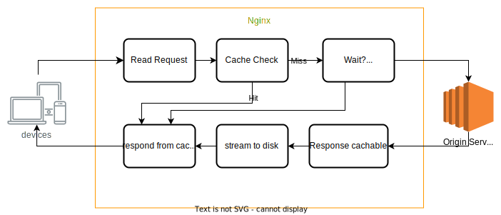

# Unveiling NGINX's Proxy Cache Lock for SSR-Generated Content

Saves compute cost by significantly reducing origin server load



## Table of Contents

## Introduction

In the complex landscape of web applications, optimizing server performance while keeping costs in check remains an ongoing challenge. Recently, I faced the task of streamlining the delivery of both static and Server-Side Rendered (SSR) content. In this blog post, I'll delve into how I harnessed the power of NGINX's Proxy Cache Lock to significantly reduce server loads and cut costs, extending its capabilities from static content to SSR-generated responses.

### Caching Process Overview

Let's briefly review the caching process facilitated by NGINX's Proxy Cache Lock:

- **Cache Key Generation:** The system reads the request and generates a cache key based on the URI and other parameters.
- **Cache Check:** It checks the cache on disk by accessing metadata in memory to determine if a valid, fresh copy of the response exists.
- **Cache Hit:** If a cached copy is available (cache hit), NGINX serves the response directly from the disk.
- **Cache Miss:** In the case of a cache miss, the request is forwarded to the origin server.
- **Caching the Response:** If the response is cacheable, it is stored on disk for future requests.
- **Client Response:** The cached or freshly fetched response is sent back to the client.

### Understanding the Challenge

Modern web applications utilizing Server-Side Rendering can lead to complex server-side computations for each user request. Without careful optimization, these computations result in redundant, resource-intensive processes, affecting server response times and operational costs.

Consider the scenario where NGINX receives multiple simultaneous requests for the same content, all resulting in cache misses. This situation could potentially overload the origin server, especially for content that takes a long time to generate, such as SSR.

### Expanding NGINX's Proxy Cache Lock

The proxy_cache_lock directive plays a pivotal role in addressing this challenge. It ensures that when a piece of content is being refreshed, only one request at a time is sent to the upstream server. This control prevents sudden overloads on the origin server when handling multiple requests for the same content.

NGINX's Proxy Cache Lock, initially designed for static content, proves to be adaptable for efficiently handling SSR-generated content. By preventing simultaneous requests for the same SSR-generated resource from reaching the origin server, NGINX optimizes server resources.

> When enabled, only one request at a time will be allowed to populate a new cache element... [Docs](https://nginx.org/en/docs/http/ngx_http_proxy_module.html#proxy_cache_lock)

### Implementation

Implementing Proxy Cache Lock for SSR-generated content requires a nuanced configuration to account for dynamic responses. Below is a simplified NGINX configuration demonstrating how to extend this feature for SSR-generated content:

```nginx
http {
    proxy_cache_path /path/to/cache levels=1:2 keys_zone=my_cache:10m max_size=10g inactive=60m use_temp_path=off;

    server {
        location / {
            proxy_cache my_cache;
            proxy_cache_lock on;
            proxy_cache_lock_age 5s;
            proxy_cache_valid 200 302 10m;
            proxy_pass http://backend_server;
        }
    }
}
```

### Benefits and Cost Savings

The implementation of NGINX's Proxy Cache Lock for SSR-generated content brings several advantages:

- **Efficient SSR Content Delivery:** By preventing simultaneous requests for the same SSR-generated resource, we observed a significant reduction in redundant server-side computations, leading to more efficient SSR content delivery.
- **Enhanced Response Times:** Directly serving cached SSR-generated content from NGINX contributed to improved response times, ensuring a smoother user experience.
- **Comprehensive Cost Optimization:** The reduction in server load, spanning both static and SSR-generated content, translated into tangible cost savings, optimizing our infrastructure economically.

## Further Enhancements (In future)

As part of ongoing developments, we plan to move the locking mechanism from the cache layer to the proxy layer. When a non-cached request is received, a mutex lock is established, and additional requests for the same file are then locked with the same mutex. Once the origin responds, all waiting requests are connected to the response stream of the origin.

> Note: The above changes are not yet deployed live and were implemented as a Proof of Concept (PoC). Active development is underway, and deployment is planned in the coming months when we go live with SSR.

## Reference

- [Lock-Free Origin Request Coalescing](https://bunny.net/blog/introducing-lock-free-request-coalescing-lower-ttfb-by-90-percent/)
- [Nginx Docs - Proxy_cache_lock](https://nginx.org/en/docs/http/ngx_http_proxy_module.html#proxy_cache_lock)
- [Nginx proxy cache policy](https://docs.nginx.com/nginx-management-suite/acm/how-to/policies/proxy-cache/)
- [High‑Performance Caching with NGINX and NGINX Plus](https://www.nginx.com/blog/nginx-high-performance-caching/)
