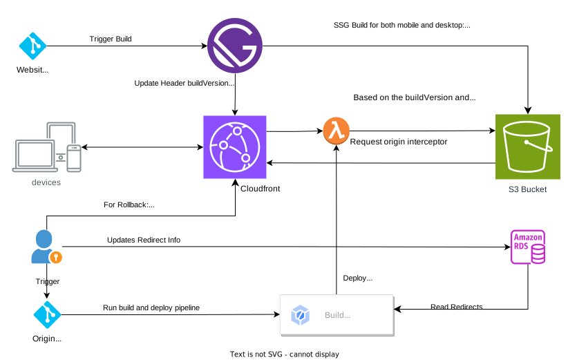

# Static Site Generation (SSG)

Static Site Generation (SSG) is a web development technique for creating websites that pre-renders all the content and HTML pages at build time. This means that when a user visits a website generated with SSG, their browser receives a complete, static HTML file that doesn't require any further processing on the server.

## Table of Contents

## Integrated Flow

