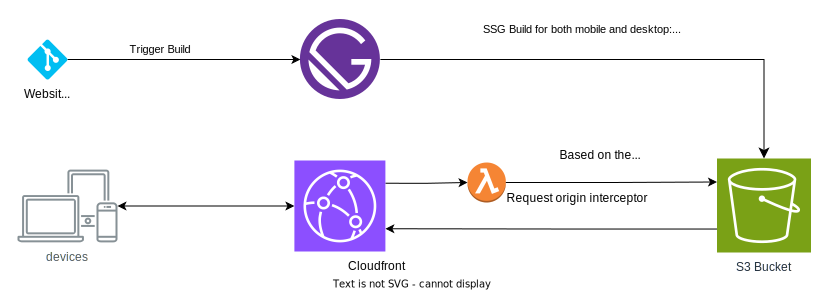

# Improving CLS

Since entire site is pre-rendered, difference in layout between mobile/desktop causes higher CLS.

## Table of Contents

## Introducing the problem

You have a page, which renderes different UI component when in mobile vs desktop, e.g header menu bar.
The page is statically generated at build time, but what do you render? For mobile or for desktop or both or nothing?

### Using CSS

This works for simpler changes like layout configuration, which can be handled with just responsive CSS.
This approach will fail, when you different DOM structures for the component.

### Render both and hide one with CSS

This is a good approach when you have few components/sections in a page. You render both the components and use CSS to hide one. In context of react, during server build and first render, you will render both the components and afterwards just 1 component.

What happens when there are too many such components? The dom size will increase resulting in larger payload and the initial hydration will also take time, resulting in poor performance as well.

## Solution: Have two build outputs

The component will render the mobile or desktop version based on the environment variable.
We will generate two build outputs, one with mobile and another with desktop.

These will go in the same S3 bucket under `mobile/*` and `desktop/*` folder.

### How do we serve these?

We use Cloudfront CDN to serve the static files.

- Cloudfront CDN's Origin is configured for `Cloudfront-Is-Mobile-Viewer` in headers
- Cloudfront will start using this header for cache key as well
- Use this header in lambda@edge origin request interceptor to add the prefix in the request uri.
