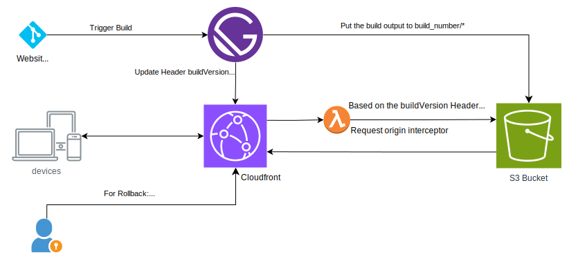
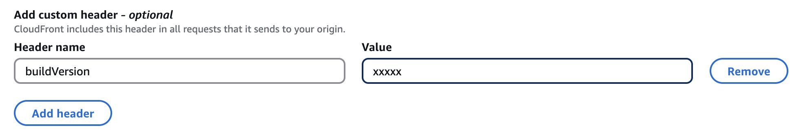

# Implementing Rollback in SSG with Cloudfront

Since entire site is pre-rendered, difference in layout between mobile/desktop causes higher CLS.

## Table of Contents

## The Problem



SSG Generates all the pages at build time, and hence with increasing pages, the build time increases.
During an incident, re-generating the entire site after a fix will take time. Since the SSG has all the static content already, rolling back to a previous build is often better while you resolve the incident.

## Solution

### Keep the previous builds

In your S3 bucket, while pushing the changes for a new build, instead of replacing the old files, we can just push into a new directory with buildNumber.

```ascii title="S3 Bucket Folder Structure"
S3 Bucket
├── build_001
│   ├── index.html
│   ├── ...
├── build_002
│   ├── ...
├── build_003
│   ├── ...
└── build_004
    ├── ...
```

### Configure a custom origin header in CF

Add a header in CDN's origin configuration. This is always updated with the new release post syncing all the files to S3

To add `buildVersion`, navigate to the CF distribution and Select Origins -> Select Origin -> Edit -> Origin Custom Headers



### Make a given version live (forward / rollback)

```sh file=./2024-01-24-implementing-rollback-in-ssg-with-cloudfront/version-deployment.sh

```

### Use lambda@edge to add prefix in request URI

The lambda@edge will receive this buildNumber header, which it can use to prefix the request URI and hence serving the right file
