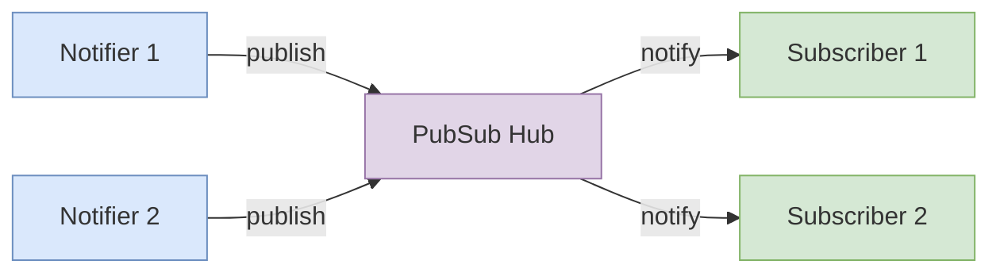

# Publish-Subscribe Pattern

Learn the architectural principles, implementation strategies, and production-grade patterns for building scalable, resilient event-driven systems using the Pub/Sub pattern.

<figure>



<figcaption>Pub-Sub data flow</figcaption>
</figure>

## Table of Contents

- [Core Philosophy](#core-philosophy)
- [Basic Implementation](#basic-implementation)
- [Production-Grade Implementation](#production-grade-implementation)
- [Advanced Capabilities](#advanced-capabilities)
- [Real-World Applications](#real-world-applications)
- [Build vs. Buy Decision](#build-vs-buy-decision)
- [Best Practices](#best-practices)

## Core Philosophy

At its heart, the Publish-Subscribe pattern is an architectural solution designed to manage and reduce coupling between software components. In any complex application, various modules or services often need to react to events or state changes occurring in other parts of the system.

A naive approach would involve direct method calls, where one object explicitly invokes a method on another. This creates tight coupling; the calling object must have a direct reference to the called object, understand its API, and often, know its location and state. This tight coupling makes systems brittle, difficult to maintain, and nearly impossible to scale or modify without creating a cascade of ripple effects.

The Pub/Sub pattern provides an elegant solution by introducing a layer of indirection. It is founded on the principle that components that are conceptually linked—a user action and a notification system, for example—should not be aware of each other's concrete implementation. Instead of direct communication, they communicate through a central, abstract channel.

### The Three Dimensions of Decoupling

The term "loose coupling" in Pub/Sub can be broken down into three distinct dimensions:

1. **Space Decoupling**: Publishers and subscribers do not need to know each other's identity, location, or existence. A component can publish an event without any knowledge of what other components, if any, will consume it.

2. **Time Decoupling**: The interacting parties do not need to be active at the same time. A publisher can emit an event, and a subscriber that is currently offline or not yet instantiated can receive that message upon coming online.

3. **Synchronization Decoupling**: The act of publishing a message is typically asynchronous and non-blocking. Once the publisher hands the message to the broker, it can immediately continue with its own processing without waiting for subscribers to receive or handle the message.

### Pub/Sub vs. Observer Pattern

One of the most common points of confusion is the difference between the Publish-Subscribe pattern and the closely related Observer pattern:

- **Observer Pattern**: Involves a direct relationship between a "Subject" and its "Observers." The Subject maintains a list of its dependent Observers and notifies them directly. This creates a one-to-many relationship that is tighter than Pub/Sub.

- **Pub/Sub Pattern**: Introduces a Broker as a mandatory intermediary. The Publisher and Subscriber are completely unaware of each other; their only connection is through the Broker and the shared topic name. This enables a many-to-many relationship and can scale to distributed systems.

## Basic Implementation

Here's a minimal, functional implementation to understand the core concepts:

```ts title="basic-pub-sub.ts"
type Task<T> = (data: T) => void

export class PubSub<T> {
  #subscriber = new Set<Task<T>>()
  constructor() {}

  subscribe(task: Task<T>) {
    this.#subscriber.add(task)
    return () => {
      this.#subscriber.delete(task)
    }
  }

  notify(data: T) {
    for (const subscriber of this.#subscriber) {
      subscriber(data)
    }
  }
}
```

**Usage Example:**

```ts title="basic-usage.ts"
const pubSub = new PubSub<string>()

// Can have one or more subscriber
const unsubscribe = pubSub.subscribe((data) => {
  console.log(data)
})

// Event Emitted by some other part of the code
pubSub.notify("message1")
pubSub.notify("message2")
pubSub.notify("message3")

// In future, on certain condition: all the subscribers will unsubscribe
unsubscribe()
```

**Comparison with DOM CustomEvent:**

We can achieve similar functionality using `CustomEvent` dispatched over any DOM Node. However, this approach has a significant limitation: DOM dependency makes the code non-usable outside the main thread in the browser environment (not even on workers).

```js
// Publisher -> Similar to pubSub.notify
const myEvent = new CustomEvent("myCustomEvent", { detail: { message: "Some data" } })
document.dispatchEvent(myEvent)

// Consumer
document.addEventListener("myCustomEvent", (event) => {
  console.log(event.detail.message)
})
```

As compared to PubSub, which has extra 16 lines of code for creating the abstraction, it makes your code work on all runtimes.

## Production-Grade Implementation

While the basic implementation demonstrates the core concept, a production system requires robust error handling, memory leak prevention, and advanced features. Here's a comprehensive implementation:

```ts title="production-pub-sub.ts"
/**
 * A robust, environment-agnostic, and production-grade implementation of the
 * Publish-Subscribe design pattern. It supports topic-based communication,
 * ensuring loose coupling between different parts of an application.
 */
class PubSub {
  private events: Record<string, Record<number, Function>> = {}
  private subscriptionId = 0

  /**
   * Subscribes a callback function to a specific topic. When the topic is published,
   * the callback will be invoked.
   *
   * @param topic - The name of the topic to subscribe to.
   * @param callback - The function to be executed when the topic is published.
   * @returns A subscription object containing the unique token and an `unsubscribe` method.
   */
  subscribe(topic: string, callback: Function) {
    if (typeof callback !== "function") {
      throw new Error("Callback must be a function.")
    }

    const id = this.subscriptionId++

    if (!this.events[topic]) {
      this.events[topic] = {}
    }

    this.events[topic][id] = callback

    return {
      token: id,
      unsubscribe: () => {
        delete this.events[topic][id]
        if (Object.keys(this.events[topic]).length === 0) {
          delete this.events[topic]
        }
      },
    }
  }

  /**
   * Publishes an event to a specific topic, notifying all registered subscribers.
   * Any additional arguments passed after the topic will be forwarded to the subscriber callbacks.
   *
   * @param topic - The name of the topic to publish to.
   * @param data - The data to pass to the subscribers' callback functions.
   * @returns Returns true if the topic has any subscribers, false otherwise.
   */
  publish(topic: string, ...data: any[]) {
    if (!this.events[topic]) {
      return false
    }

    const subscribers = this.events[topic]
    Object.values(subscribers).forEach((callback) => {
      // Using setTimeout to make the publication asynchronous,
      // preventing a slow subscriber from blocking the publisher.
      setTimeout(() => {
        try {
          callback(...data)
        } catch (error) {
          console.error(`Error in subscriber for topic "${topic}":`, error)
          // Optionally, publish to a global error topic
          // this.publish('system:error', { topic, error, data });
        }
      }, 0)
    })

    return true
  }

  /**
   * Publishes a topic and returns a Promise that resolves when all
   * Promise-returning subscribers have completed.
   *
   * @param topic - The name of the topic to publish to.
   * @param data - The data to pass to subscribers.
   * @returns A Promise that resolves with an array of results from all subscribers.
   */
  async publishAsync(topic: string, ...data: any[]): Promise<any[]> {
    if (!this.events[topic]) {
      return Promise.resolve([])
    }

    const subscribers = Object.values(this.events[topic])
    const promises = subscribers.map((callback) => {
      try {
        // We wrap the callback execution in a Promise to handle both sync and async subscribers uniformly.
        return Promise.resolve(callback(...data))
      } catch (error) {
        // If a synchronous callback throws an error, we catch it and return a rejected Promise.
        return Promise.reject(error)
      }
    })

    return Promise.all(promises)
  }
}

// Example of creating a singleton instance for global use
const globalPubSub = new PubSub()

export default globalPubSub
```

### Memory Leak Prevention

Memory leaks are one of the most insidious problems in long-running applications like Single-Page Applications (SPAs). The Pub/Sub pattern, if not handled with discipline, can be a major source of these leaks.

**React Component Example:**

```tsx title="react-usage.tsx"
import React, { useEffect, useState } from "react"
import pubSub from "./PubSubService"

function UserStatusDisplay({ userId }: { userId: string }) {
  const [isOnline, setIsOnline] = useState(false)

  useEffect(() => {
    // Define the handler for the event
    const handleStatusChange = (data: any) => {
      if (data.userId === userId) {
        setIsOnline(data.isOnline)
      }
    }

    // Subscribe when the component mounts
    const subscription = pubSub.subscribe("user:status:change", handleStatusChange)

    // Return a cleanup function to unsubscribe when the component unmounts
    return () => {
      subscription.unsubscribe()
    }
  }, [userId]) // Re-subscribe if the userId prop changes

  return (
    <div>
      User {userId} is {isOnline ? "Online" : "Offline"}
    </div>
  )
}
```

## Advanced Capabilities

### Hierarchical Topics and Wildcard Subscriptions

A flat list of topic names can quickly become unmanageable in a large application. A more sophisticated approach is to use structured, hierarchical topic names, often delimited by a character like a period (.) or a slash (/).

**Wildcard Matching Implementation:**

```ts title="wildcard-matching.ts"
/**
 * Checks if a published topic matches a subscription topic that may contain wildcards.
 * @param subscriptionTopic - The topic with potential wildcards (e.g., 'user.*.login').
 * @param publishedTopic - The concrete topic that was published (e.g., 'user.123.login').
 * @returns True if the topics match, false otherwise.
 */
function topicMatches(subscriptionTopic: string, publishedTopic: string): boolean {
  const subParts = subscriptionTopic.split(".")
  const pubParts = publishedTopic.split(".")

  if (subParts.length > pubParts.length && !subscriptionTopic.includes("#")) {
    return false
  }

  for (let i = 0; i < subParts.length; i++) {
    const subPart = subParts[i]
    const pubPart = pubParts[i]

    if (subPart === "#") {
      // Multi-level wildcard must be the last part of the subscription topic
      return i === subParts.length - 1
    }

    if (subPart !== "*" && subPart !== pubPart) {
      return false
    }
  }

  return subParts.length === pubParts.length || subParts[subParts.length - 1] === "#"
}
```

**Wildcard Types:**

- **Single-Level Wildcard (\*)**: Matches exactly one token in the topic string
- **Multi-Level Wildcard (#)**: Matches zero or more tokens and is typically only valid as the final character

### Asynchronous Workflows

The standard Pub/Sub model is "fire and forget," which falls short when a publisher needs to know if or when subscribers have completed their work. The `publishAsync` method transforms the system into a powerful tool for orchestrating complex, asynchronous workflows.

## Real-World Applications

### Frontend: Decoupling Sibling Components

In modern component-based frameworks like React, communication between sibling components or deeply nested components can lead to "prop drilling." The Pub/Sub pattern offers an excellent solution by creating a global communication channel.

**E-commerce Example:**

- `ProductListItem` publishes `cart:item:added` when "Add to Cart" is clicked
- `CartIcon` subscribes to update the cart count
- `Notification` subscribes to show success messages
- `AnalyticsTracker` subscribes to log events

### Backend: Microservice Communication

In a microservices architecture, the Pub/Sub pattern is a foundational principle for inter-service communication. Tools like Redis, RabbitMQ, or cloud services like Google Cloud Pub/Sub serve as external brokers.

**User Registration Flow:**

- `UserService` publishes `user:created` after creating a user
- `EmailService` subscribes to send welcome emails
- `AnalyticsService` subscribes to track metrics
- `OnboardingService` subscribes to initiate tutorials

## Build vs. Buy Decision

While building a Pub/Sub system from scratch is an invaluable learning experience, for most production projects, leveraging a battle-tested, open-source library is the more pragmatic choice.

**Popular Libraries Comparison:**

| Library      | Gzipped Size | Key Features                                            | API Style                                   | Wildcard Support                           | Maintained?   |
| ------------ | ------------ | ------------------------------------------------------- | ------------------------------------------- | ------------------------------------------ | ------------- |
| mitt         | ~200 bytes   | Extremely small, no dependencies, functional API        | `on()`, `off()`, `emit()`                   | No                                         | Yes           |
| tiny-emitter | < 1 KB       | Very small, simple class-based API, `once()` method     | `on()`, `once()`, `off()`, `emit()`         | No                                         | No (6+ years) |
| PubSubJS     | < 1 KB       | Hierarchical topics, sync/async publish, error handling | `subscribe()`, `publish()`, `unsubscribe()` | Hierarchical (e.g., 'a.b') but not \* or # | No (4+ years) |

**Recommendations:**

- For minimal footprint: **mitt** (tiny size, active maintenance)
- For advanced features: **PubSubJS** (despite age, still viable for specific needs)
- For learning: Build your own (invaluable experience)

## Best Practices

### Key Principles

1. **Embrace Architectural Decoupling**: The primary value is enabling scalable, maintainable, and event-driven architectures by drastically reducing coupling between components.

2. **Always Unsubscribe**: In any environment with a component lifecycle (like SPAs), failing to unsubscribe from events is a guaranteed path to memory leaks.

3. **Use Structured, Hierarchical Topics**: Adopt a consistent, hierarchical naming convention for topics (e.g., `module.entity.action`). This brings clarity, organization, and enables powerful features like wildcard subscriptions.

4. **Build for Resilience**: Isolate subscriber errors using try...catch blocks within the publish method. A single failing subscriber should never bring down the entire messaging system.

5. **Know Your Patterns**: Understand the fundamental architectural difference between the Pub/Sub and Observer patterns. Choose Observer for in-process state synchronization and Pub/Sub for systems requiring greater decoupling and potential distribution.

6. **Don't Reinvent the Wheel (Necessarily)**: While building your own Pub/Sub is a great exercise, for production systems, consider using a well-vetted, lightweight library.

7. **Avoid the "Golden Hammer"**: Pub/Sub is a powerful tool, but it's not always the right one. For simple systems or direct request/response interactions, it can be overkill.

### Error Handling Strategies

- **Subscriber-Level Isolation**: Wrap each callback execution in try...catch blocks
- **Global Error Handling**: Provide centralized error reporting mechanisms
- **Development vs. Production Mode**: Allow exceptions to be thrown in development for debugging
- **Dead-Letter Queues**: For large-scale systems, implement strategies for handling repeatedly failing messages

## Conclusion

The Publish-Subscribe pattern is an exceptionally powerful tool in a developer's arsenal, capable of transforming a tangled, monolithic codebase into a clean, flexible, and scalable system. It promotes modularity and allows applications to evolve with grace.

However, its greatest strength—extreme decoupling—can also be its greatest peril. When used without discipline, it can lead to systems where the flow of logic is difficult to trace and debug. Events are fired into the ether, and it can become challenging to understand what sequence of events led to a particular state.

Embrace the Pub/Sub pattern not as a magic bullet, but as a sharp architectural tool. Use it with intention, document your topics clearly, and build in the necessary resilience and observability from the start. By doing so, developers can harness its full power while mitigating its inherent risks, leading to the creation of truly robust and sophisticated software.
