# JavaScript Event Loop

Master the JavaScript event loop architecture across browser and Node.js environments, understanding task scheduling, microtasks, and performance optimization techniques.

<figure>


<figcaption>Detailed diagram showing the phases of the Node.js event loop and their execution order</figcaption>

</figure>

## TLDR

**JavaScript Event Loop** is the core concurrency mechanism that enables single-threaded JavaScript to handle asynchronous operations through a sophisticated task scheduling system with microtasks and macrotasks.

### Core Architecture Principles

- **Single-threaded Execution**: JavaScript runs on one thread with a call stack and run-to-completion guarantee
- **Event Loop**: Central mechanism orchestrating asynchronous operations around the engine
- **Two-tier Priority System**: Microtasks (high priority) and macrotasks (lower priority) with strict execution order
- **Host Environment Integration**: Different implementations for browsers (UI-focused) and Node.js (I/O-focused)

### Universal Priority System

- **Synchronous Code**: Executes immediately on the call stack
- **Microtasks**: Promise callbacks, queueMicrotask, MutationObserver (processed after each macrotask)
- **Macrotasks**: setTimeout, setInterval, I/O operations, user events (processed in event loop phases)
- **Execution Order**: Synchronous → nextTick → Microtasks → Macrotasks → Event Loop Phases

### Browser Event Loop

- **Rendering Integration**: Integrated with 16.7ms frame budget for 60fps
- **Task Source Prioritization**: User interaction (high) → DOM manipulation (medium) → networking (medium) → timers (low)
- **requestAnimationFrame**: Executes before repaint for smooth animations
- **Microtask Starvation**: Potential issue where microtasks block macrotasks indefinitely

### Node.js Event Loop (libuv)

- **Phased Architecture**: Six phases (timers → pending → idle → poll → check → close)
- **Poll Phase Logic**: Blocks for I/O or timers, exits early for setImmediate
- **Thread Pool**: CPU-intensive operations (fs, crypto, DNS) use worker threads
- **Direct I/O**: Network operations handled asynchronously on main thread
- **Node.js-specific APIs**: process.nextTick (highest priority), setImmediate (check phase)

### Performance Optimization

- **Keep Tasks Short**: Avoid blocking the event loop with long synchronous operations
- **Proper Scheduling**: Choose microtasks vs macrotasks based on priority needs
- **Avoid Starvation**: Prevent microtask flooding that blocks macrotasks
- **Environment-specific**: Use requestAnimationFrame for animations, worker_threads for CPU-intensive tasks

### True Parallelism

- **Worker Threads**: Independent event loops for CPU-bound tasks
- **Memory Sharing**: Structured clone, transferable objects, SharedArrayBuffer
- **Communication**: Message passing with explicit coordination
- **Safety**: Thread isolation prevents race conditions

### Monitoring & Debugging

- **Event Loop Lag**: Measure time between event loop iterations
- **Bottleneck Identification**: CPU-bound vs I/O-bound vs thread pool issues
- **Performance Tools**: Event loop metrics, memory usage, CPU profiling
- **Best Practices**: Environment-aware scheduling, proper error handling, resource management

## Table of Contents

1. [The Abstract Concurrency Model](#the-abstract-concurrency-model)
2. [Universal Priority System: Tasks and Microtasks](#universal-priority-system-tasks-and-microtasks)
3. [Browser Event Loop Architecture](#browser-event-loop-architecture)
4. [Node.js Event Loop: libuv Integration](#nodejs-event-loop-libuv-integration)
5. [Node.js-Specific Scheduling](#nodejs-specific-scheduling)
6. [True Parallelism: Worker Threads](#true-parallelism-worker-threads)
7. [Best Practices and Performance Optimization](#best-practices-and-performance-optimization)

## The Abstract Concurrency Model

JavaScript's characterization as a "single-threaded, non-blocking, asynchronous, concurrent language" obscures the sophisticated interplay between the JavaScript engine and its host environment. The event loop is not a language feature but the central mechanism provided by the host to orchestrate asynchronous operations around the engine's single-threaded execution.

### Runtime Architecture

<figure>

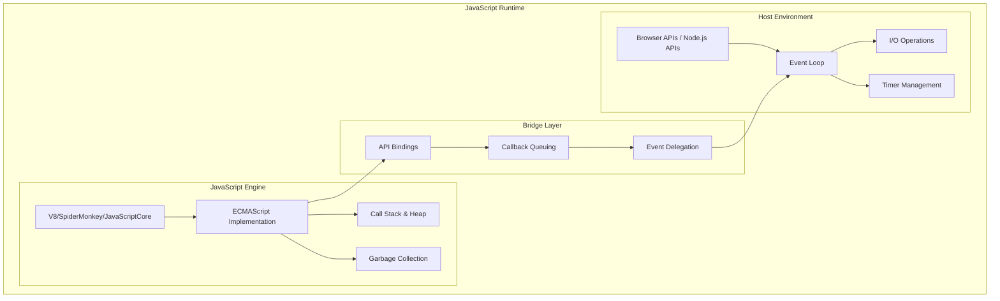

<figcaption>JavaScript runtime architecture showing the relationship between the engine, host environment, and bridge layer components</figcaption>

</figure>

### Core Execution Primitives

The ECMAScript specification defines three fundamental primitives:

1. **Call Stack**: LIFO data structure tracking execution context
2. **Heap**: Unstructured memory region for object allocation
3. **Run-to-Completion Guarantee**: Functions execute without preemption

<figure>

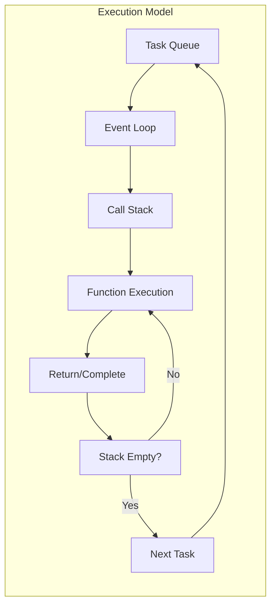

<figcaption>Core execution model showing the flow between task queue, event loop, and call stack</figcaption>

</figure>

### Specification Hierarchy

<figure>

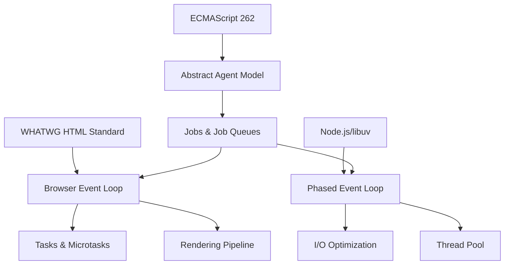

<figcaption>Specification hierarchy showing how ECMAScript, HTML standards, and Node.js/libuv define the event loop architecture</figcaption>

</figure>

## Universal Priority System: Tasks and Microtasks

All modern JavaScript environments implement a two-tiered priority system governing asynchronous operation scheduling.

### Queue Processing Model

<figure>

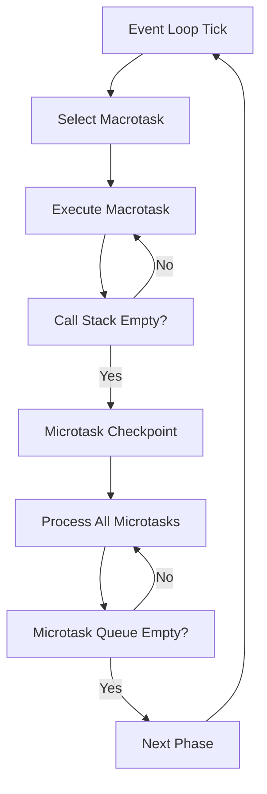

<figcaption>Queue processing model showing the priority system between macrotasks and microtasks in the event loop</figcaption>

</figure>

### Priority Hierarchy

<figure>

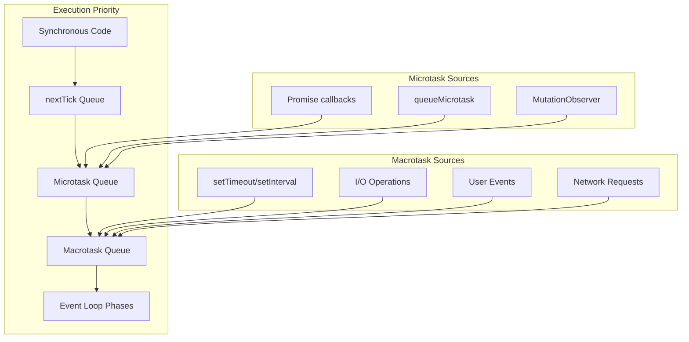

<figcaption>Priority hierarchy showing the execution order from synchronous code through microtasks to macrotasks</figcaption>

</figure>

### Microtask Starvation Pattern

```javascript
// Pathological microtask starvation
function microtaskFlood() {
  Promise.resolve().then(microtaskFlood)
}
microtaskFlood()

// This macrotask will never execute
setTimeout(() => {
  console.log("Starved macrotask")
}, 1000)
```

## Browser Event Loop Architecture

The browser event loop is optimized for UI responsiveness, integrating directly with the rendering pipeline.

### WHATWG Processing Model

<figure>

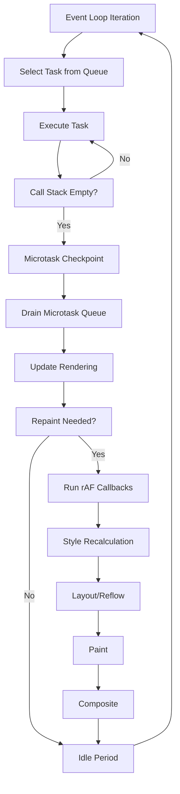

<figcaption>WHATWG processing model showing the browser event loop integration with the rendering pipeline</figcaption>

</figure>

### Rendering Pipeline Integration

<figure>

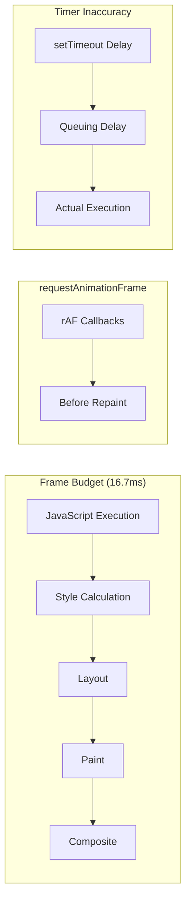

<figcaption>Rendering pipeline integration showing frame budget allocation and requestAnimationFrame timing</figcaption>

</figure>

### Task Source Prioritization

<figure>

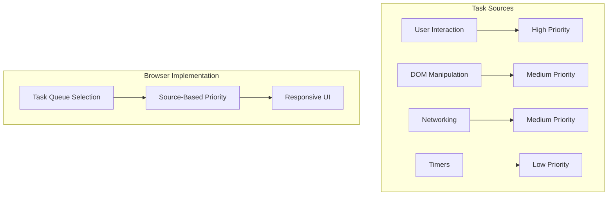

<figcaption>Task source prioritization showing how browsers prioritize different types of tasks for responsive UI</figcaption>

</figure>

## Node.js Event Loop: libuv Integration

Node.js implements a phased event loop architecture optimized for high-throughput I/O operations.

### libuv Architecture

<figure>

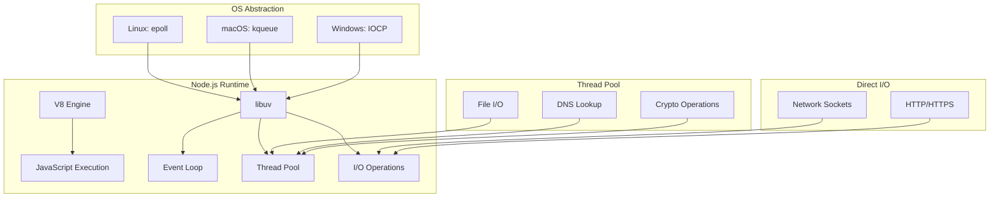

<figcaption>libuv architecture showing the integration between V8 engine, libuv event loop, and OS-specific I/O mechanisms</figcaption>

</figure>

### Phased Event Loop Structure

<figure>

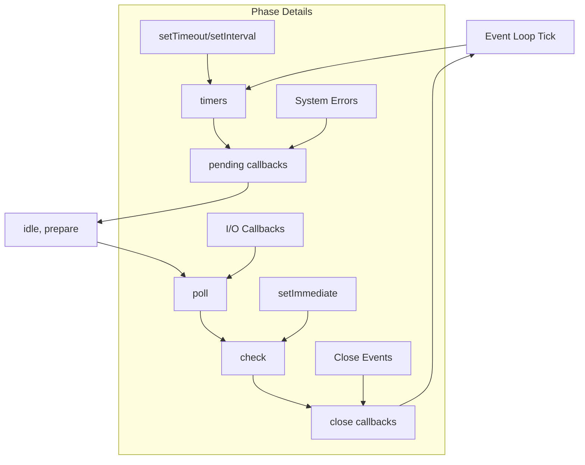

<figcaption>Phased event loop structure showing the six phases of the Node.js event loop and their execution order</figcaption>

</figure>

### Poll Phase Logic

<figure>

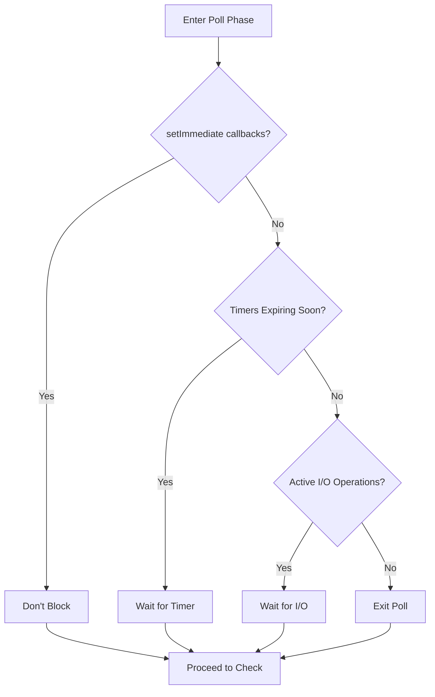

<figcaption>Poll phase logic showing the decision tree for blocking vs non-blocking behavior in the poll phase</figcaption>

</figure>

### Thread Pool vs Direct I/O

<figure>

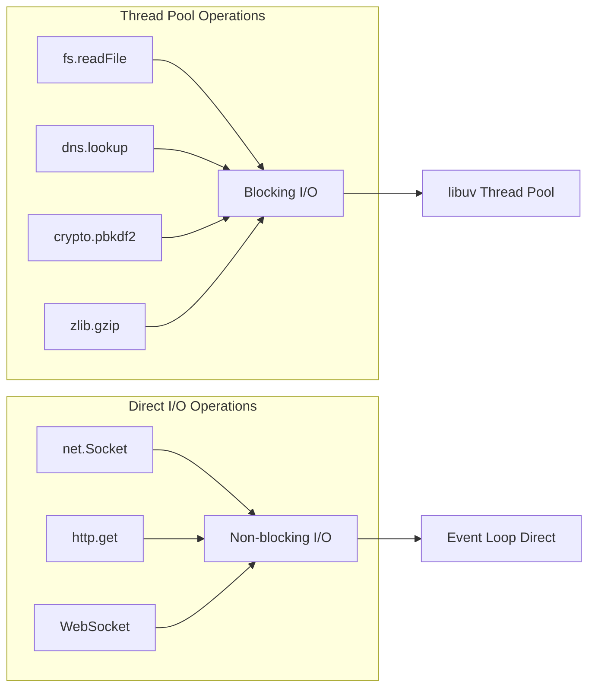

<figcaption>Thread pool vs direct I/O showing the distinction between blocking operations that use the thread pool and non-blocking operations that use the event loop directly</figcaption>

</figure>

## Node.js-Specific Scheduling

Node.js provides unique scheduling primitives with distinct priority levels.

### Priority Hierarchy

<figure>

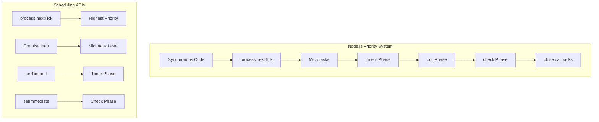

<figcaption>Node.js priority system showing the execution order from synchronous code through nextTick, microtasks, and event loop phases</figcaption>

</figure>

### nextTick vs setImmediate Execution

<figure>

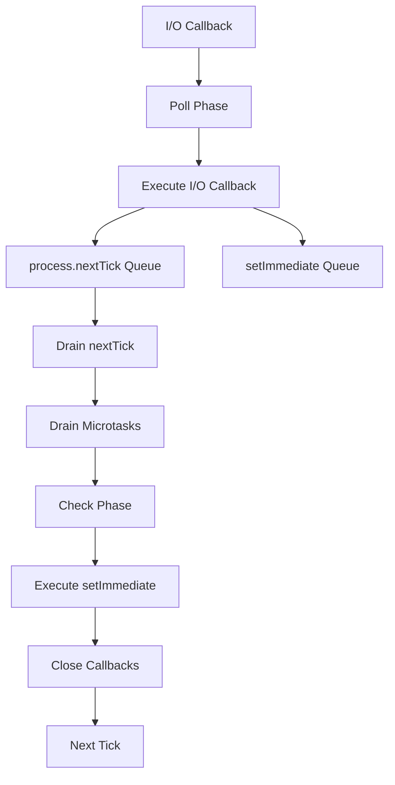

<figcaption>nextTick vs setImmediate execution showing the timing difference between these two Node.js-specific scheduling mechanisms</figcaption>

</figure>

### setTimeout vs setImmediate Ordering

<figure>

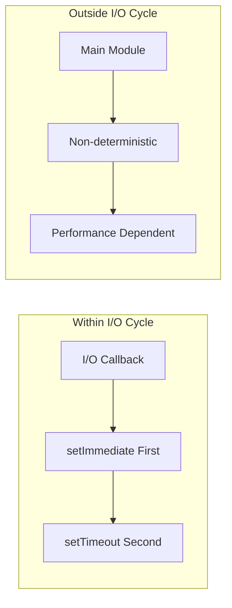

<figcaption>setTimeout vs setImmediate ordering showing the deterministic behavior within I/O cycles vs non-deterministic behavior outside I/O cycles</figcaption>

</figure>

## True Parallelism: Worker Threads

Worker threads provide true parallelism by creating independent event loops.

### Worker Architecture

<figure>

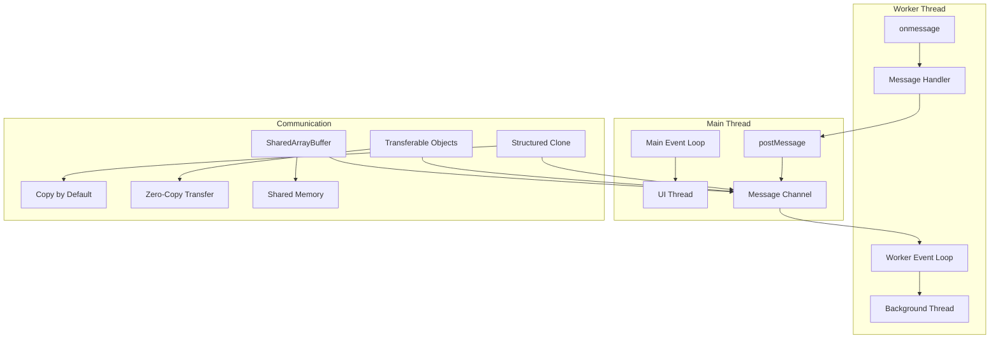

<figcaption>Worker architecture showing the communication between main thread and worker threads through message passing and shared memory</figcaption>

</figure>

### Memory Sharing Patterns

<figure>

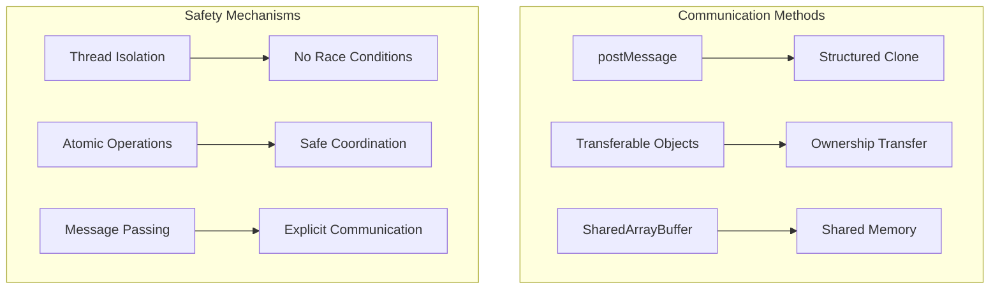

<figcaption>Memory sharing patterns showing different communication methods and safety mechanisms for worker thread coordination</figcaption>

</figure>

## Best Practices and Performance Optimization

### Environment-Agnostic Principles

<figure>

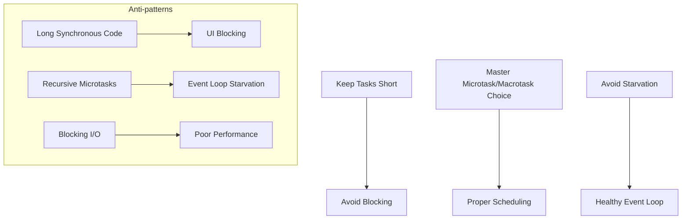

<figcaption>Environment-agnostic principles showing best practices and anti-patterns for event loop optimization</figcaption>

</figure>

### Browser-Specific Optimization

<figure>

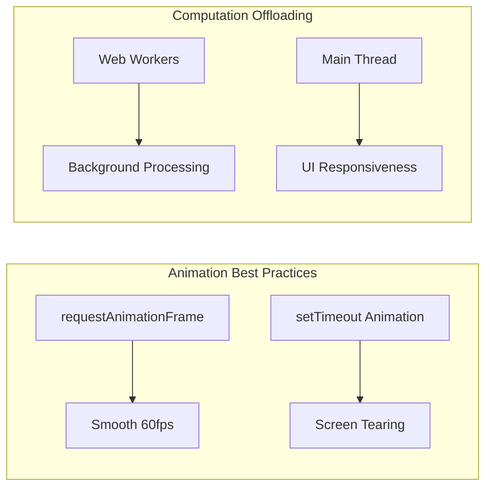

<figcaption>Browser-specific optimization showing animation best practices and computation offloading strategies</figcaption>

</figure>

### Node.js-Specific Optimization

<figure>

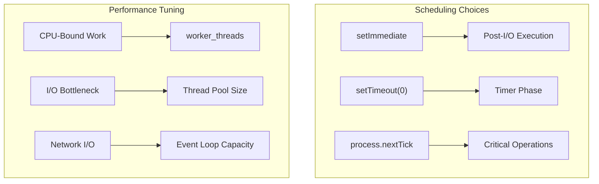

<figcaption>Node.js-specific optimization showing scheduling choices and performance tuning strategies</figcaption>

</figure>

### Performance Monitoring

<figure>

```mermaid
graph LR
    subgraph "Bottleneck Identification"
        A[Event Loop Lag] --> B[CPU-Bound]
        C[I/O Wait Time] --> D[Network/File I/O]
        E[Thread Pool Queue] --> F[Blocking Operations]
    end

    subgraph "Monitoring Tools"
        G[Event Loop Metrics] --> H[Lag Detection]
        I[Memory Usage] --> J[Leak Detection]
        K[CPU Profiling] --> L[Hot Paths]
    end
```

<figcaption>Performance monitoring showing bottleneck identification strategies and monitoring tools for event loop optimization</figcaption>

</figure>

## Conclusion

The JavaScript event loop is not a monolithic entity but an abstract concurrency model with environment-specific implementations. Expert developers must understand both the universal principles (call stack, run-to-completion, microtask/macrotask hierarchy) and the divergent implementations (browser's rendering-centric model vs Node.js's I/O-centric phased architecture).

Key takeaways for expert-level development:

1. **Environment Awareness**: Choose scheduling primitives based on the target environment
2. **Performance Profiling**: Identify bottlenecks in the appropriate layer (event loop, thread pool, OS I/O)
3. **Parallelism Strategy**: Use worker threads for CPU-intensive tasks while maintaining event loop responsiveness
4. **Scheduling Mastery**: Understand when to use microtasks vs macrotasks for optimal performance

The unified mental model requires appreciating common foundations while recognizing environment-specific mechanics that dictate performance and behavior across the JavaScript ecosystem.

## References

- [The Node.js Event Loop Official Docs](https://nodejs.org/en/learn/asynchronous-work/event-loop-timers-and-nexttick)
- [Libuv Design - The I/O Loop](https://docs.libuv.org/en/v1.x/design.html#the-i-o-loop)
- [Node Interactive 2016 Talk - Everything You Need to Know About Node.js Event Loop - Bert Belder, IBM](https://youtu.be/PNa9OMajw9w?si=CFxugIEBeZTGIHrD)
- [Node Interactive 2016 Talk Presentation](https://drive.google.com/file/d/0B1ENiZwmJ_J2a09DUmZROV9oSGc/view?resourcekey=0-lR-GaBV1Bmjy086Fp3J4Uw)
- [A Deep Dive Into the Node js Event Loop - Tyler Hawkins](https://youtu.be/KKM_4-uQpow?si=zlsK2g3p1TkQGE3l)
- [A Deep Dive Into the Node js Event Loop - Code & Slides](https://github.com/thawkin3/nodejs-event-loop-presentation)
- [Node's Event Loop From the Inside Out by Sam Roberts, IBM](https://youtu.be/P9csgxBgaZ8?si=sU_LGUgWYAT-yFTR)
- [WHATWG HTML Living Standard - Event Loops](https://html.spec.whatwg.org/multipage/webappapis.html#event-loops)
- [ECMAScript 2024 - Jobs and Job Queues](https://tc39.es/ecma262/#sec-jobs-and-job-queues)
