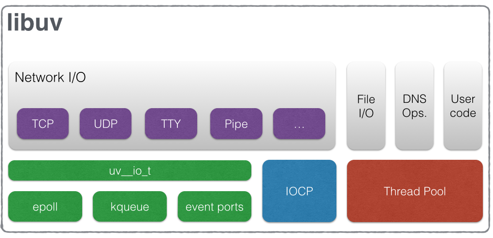
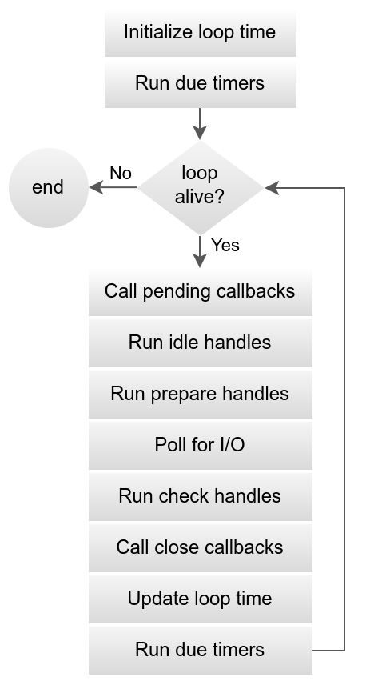

# Libuv Internals

Explore libuv's event loop architecture, asynchronous I/O capabilities, thread pool management, and how it enables Node.js's non-blocking, event-driven programming model.

<figure>

<figcaption>Libuv architecture diagram showing the core components and their relationships in the cross-platform I/O library</figcaption>

</figure>

## TLDR

**Libuv** is a cross-platform asynchronous I/O library that provides Node.js with its event-driven, non-blocking architecture through a sophisticated event loop, thread pool, and platform abstraction layer.

### Core Architecture Components

- **Event Loop**: Central orchestrator managing all I/O operations and event notifications in phases
- **Handles**: Long-lived objects representing persistent resources (TCP sockets, timers, file watchers)
- **Requests**: Short-lived operations for one-shot tasks (file I/O, DNS resolution, custom work)
- **Thread Pool**: Worker threads for blocking operations that can't be made asynchronous

### Event Loop Phases

- **Timers**: Execute expired setTimeout/setInterval callbacks
- **Pending**: Handle deferred I/O callbacks from previous iteration
- **Idle/Prepare**: Low-priority background tasks and pre-I/O preparation
- **Poll**: Block for I/O events or timers (most critical phase)
- **Check**: Execute setImmediate callbacks and post-I/O tasks
- **Close**: Handle cleanup for closed resources

### Asynchronous I/O Strategies

- **Network I/O**: True kernel-level asynchronicity using epoll (Linux), kqueue (macOS), IOCP (Windows)
- **File I/O**: Thread pool emulation for blocking filesystem operations
- **DNS Resolution**: Thread pool for getaddrinfo/getnameinfo calls
- **Custom Work**: User-defined CPU-intensive tasks via uv_queue_work

### Platform Abstraction Layer

- **Linux (epoll)**: Readiness-based model with efficient file descriptor polling
- **macOS/BSD (kqueue)**: Expressive event notification for files, signals, timers
- **Windows (IOCP)**: Completion-based model with native async file I/O support
- **Unified API**: Consistent callback-based interface across all platforms

### Thread Pool Architecture

- **Global Shared Pool**: Single pool shared across all event loops in a process
- **Configurable Size**: UV_THREADPOOL_SIZE environment variable (default: 4, max: 1024)
- **Work Distribution**: Automatic load balancing across worker threads
- **Performance Tuning**: Size optimization based on CPU cores and workload characteristics

### Advanced Features

- **Inter-thread Communication**: uv_async_send for thread-safe event loop wakeup
- **Synchronization Primitives**: Mutexes, read-write locks, semaphores, condition variables
- **Signal Handling**: Cross-platform signal abstraction with event loop integration
- **Memory Management**: Reference counting with uv_ref/uv_unref for loop lifecycle control

### Performance Characteristics

- **Network Scalability**: Single thread can handle thousands of concurrent connections
- **File I/O Bottlenecks**: Thread pool saturation can limit disk-bound applications
- **Context Switching**: Minimal overhead for network operations, higher for file operations
- **Memory Efficiency**: External buffer allocation to reduce V8 GC pressure

### Future Evolution

- **Dynamic Thread Pool**: Runtime resizing capabilities for better resource management
- **io_uring Integration**: Linux completion-based I/O for unified network and file operations
- **Performance Optimization**: Continued platform-specific enhancements and optimizations
- **API Extensions**: New primitives for emerging use cases and requirements

## Table of Contents

## What is Libuv

`libuv` is a multi-platform support library with a focus on asynchronous I/O. It was primarily developed for use by Node.js, but it’s also used by Luvit, Julia, uvloop, and others.

### Features

- Full-featured **event loop** backed by epoll, kqueue, IOCP, event ports.
- Asynchronous TCP and UDP sockets
- Asynchronous DNS resolution
- Asynchronous file and file system operations
- File system events
- ANSI escape code controlled TTY
- IPC with socket sharing, using Unix domain sockets or named pipes (Windows)
- Child processes
- Thread pool
- Signal handling
- High resolution clock
- Threading and synchronization primitives

### Design Overview

The architecture of libuv is elegantly constructed upon three primary abstractions that work in concert to manage asynchronous operations: the event loop, handles, and requests. Understanding the distinct role of each is fundamental to mastering the library.

#### The Core Abstractions: A Triad of Loop, Handles, and Requests

**The Event Loop (uv_loop_t):** This is the heart of libuv. It is the central component that orchestrates all I/O operations and event notifications. Each event loop is designed to be tied to a single thread and is explicitly not thread-safe; any interaction with a loop or its associated objects from another thread must be done through specific, thread-safe mechanisms. While an application can run multiple event loops, each must operate in its own dedicated thread.

**Handles (uv_handle_t):** Handles represent long-lived objects that are capable of performing certain operations while they are "active". They are abstractions for resources that persist over time. For instance, a uv_tcp_t handle can represent a TCP server listening for connections, and a uv_timer_t handle can be configured to fire a callback at a future time. A crucial property of active handles is that they "reference" the event loop, keeping it alive. The loop will continue to run as long as there are active, referenced handles.

**Requests (uv_req_t):** In contrast to handles, requests represent short-lived, typically one-shot operations. They serve to preserve the context of an operation from its initiation to its completion callback. Requests can be performed on a handle, such as a uv_write_t request to write data to a uv_tcp_t stream. Alternatively, they can be standalone, such as a uv_getaddrinfo_t request for asynchronous DNS resolution, which runs directly on the loop without being tied to a persistent handle. Like active handles, active requests also keep the event loop from exiting.

#### The Two Modalities of Asynchronicity: Kernel Polling vs. Thread Pool Offloading

A deep analysis of libuv reveals a pragmatic dichotomy in its approach to asynchronicity, a design choice dictated not by preference but by the practical limitations of modern operating systems. The library employs two fundamentally different strategies to achieve its non-blocking behavior.

**For network I/O**, libuv achieves true asynchronicity at the kernel level. All network operations are performed on non-blocking sockets, and the main event loop thread directly polls these sockets for readiness using the most efficient native mechanism available on the host platform. This allows a single thread to manage thousands of concurrent network connections with minimal overhead, as the thread only wakes up when there is actual work to be done.

**In stark contrast**, operations such as file I/O and certain DNS lookups are handled through a different mechanism: a worker thread pool. This is not an arbitrary decision but a direct consequence of the lack of consistent, reliable, and truly asynchronous file I/O primitives across all major operating systems. Standard filesystem functions in C libraries and at the OS level are typically blocking. If libuv were to execute a blocking read() from a disk on the main event loop thread, the entire application would freeze until the I/O operation completed, defeating the purpose of the event-driven model.

To circumvent this, libuv simulates asynchronicity for these operations. When a function like uv_fs_read() is called, the request is not executed on the main thread. Instead, it is delegated to a queue serviced by a pool of worker threads. One of these worker threads performs the blocking filesystem call. Upon completion, the worker thread communicates the result back to the main event loop, which then executes the user's callback.

This architectural split has profound performance implications. For network-bound applications, performance scales with the efficiency of the kernel's polling mechanism, and a single thread can achieve massive concurrency. For disk-bound applications, performance is ultimately constrained by the throughput of the underlying disk subsystem and, more directly, by the size and potential contention of the libuv thread pool. An application performing many simultaneous, slow disk operations can saturate the thread pool, causing subsequent file I/O requests to be queued and delayed. Understanding this dichotomy between kernel-level asynchronicity for networks and thread-pool-emulated asynchronicity for files is paramount for any expert-level performance analysis and tuning of a libuv-based application.

### Handles

- Abstraction for (typically) long-lived resources
- Eg: TCP and UDP sockets, TTYs, timers, signals, child processes
- For working with event loop: idle, prepare, check, async handle types
- Active handles keep the event loop alive
  - Handles can be unref'd so they don't keep loop alive

Some examples:

- A prepare handle gets its callback called once every loop iteration when active.
- A TCP server handle that gets its connection callback called every time there is a new connection.

### Requests

- Abstraction for (typically) short-lived operations
- Eg: file I/O, socket connections, stream operations, getaddrinfo(), user defined work
- Some requests operates on handles, but not all
- Active requests keep the event loop alive (similar to handles)

### Thread Pool

- Used to move computations off of the main thread
- Work runs on worker thread
- Callback runs on the main thread
- Size controlled by `UV_THREADPOOL_SIZE` environment variable
  - defaults to 4
  - can be increased to max. of 1024
- Only file I/O, getaddrinfo(), getnameinfo(), custom work runs on thread pool

#### Architecture of the Global Worker Thread Pool

As established previously, the thread pool is libuv's solution for emulating asynchronicity for blocking system calls, most notably for filesystem operations. Its architecture has several key characteristics:

**Global and Shared:** The thread pool is a single, global resource that is shared across all event loops within a given process. This means that if an application creates multiple event loops in separate threads, they will all submit their blocking tasks to the same pool of worker threads. This design simplifies the library's internals but can become a point of contention in complex, multi-loop applications if not managed carefully.

**Configuration and Sizing:** The number of threads in the pool is configurable via the UV_THREADPOOL_SIZE environment variable, which must be set at application startup. The default size is 4, a number chosen as a reasonable default for typical multi-core systems. The maximum size was increased from 128 to 1024 in libuv version 1.30.0, allowing for greater concurrency on systems with heavy I/O workloads.

**Performance Tuning:** Adjusting the thread pool size is a key performance tuning lever for applications that are heavily dependent on blocking operations. Increasing the number of threads can improve throughput by allowing more blocking tasks to execute in parallel. However, setting the size too high can be counterproductive, leading to excessive memory consumption (as each thread has its own stack, which defaults to 8 MB as of v1.45.0) and increased CPU overhead from frequent context switching between a large number of threads. A common heuristic is to set the thread pool size to match the number of available CPU cores, which can be a good starting point for balancing concurrency and overhead. Recognizing the need for more flexible control, libuv maintainers have noted that the ability to dynamically resize the thread pool at runtime is a planned future enhancement.

#### The uv_queue_work Lifecycle: Task Delegation and Result Passing

The primary API for submitting custom, user-defined tasks to the thread pool is uv_queue_work(). This function orchestrates a clear and robust lifecycle for offloading a task and receiving its result.

**Queuing:** A developer calls uv_queue_work(), passing it four arguments: the event loop, a pointer to a uv_work_t request structure, a work_cb function pointer, and an after_work_cb function pointer. The uv_work_t request is initialized and placed onto a queue of pending work.

**Execution:** An available worker thread from the pool dequeues the uv_work_t request and executes the work_cb function. This callback runs entirely on the worker thread, completely separate from the main event loop thread. It is within this work_cb that the blocking or CPU-intensive computation is performed. The worker thread may block for as long as necessary without affecting the responsiveness of the event loop.

**Completion and Result Passing:** Once the work_cb function completes and returns, the worker thread signals to the event loop that the task is finished. libuv then schedules the after_work_cb function to be executed back on the main event loop thread in a future iteration of the loop. The uv_work_t request structure serves as the critical context carrier between the two threads. Its void\* data member can be used to store a pointer to any custom data structure, allowing the work_cb to attach its results, which can then be safely accessed by the after_work_cb in the main thread.

**Cancellation:** libuv also provides the uv_cancel() function, which can be used to attempt to cancel a work request that has been queued but has not yet been started by a worker thread. If cancellation is successful, the after_work_cb is invoked with a status code of UV_ECANCELED, allowing the application to perform necessary cleanup for the cancelled task.

#### Workloads Handled by the Thread Pool

The thread pool is specifically reserved for operations that are known to be blocking or computationally expensive. libuv internally uses the pool for the following categories of tasks:

**All Filesystem Operations:** Every function in the uv*fs*\* family, from uv_fs_open to uv_fs_read and uv_fs_stat, is executed on the thread pool. This is the cornerstone of libuv's asynchronous file I/O capabilities.

**DNS Functions:** The standard C library functions for DNS resolution, getaddrinfo and getnameinfo, can perform blocking network I/O. libuv therefore wraps these calls and executes them on the thread pool to avoid stalling the event loop.

**User-specified Code:** As described above, developers can offload any arbitrary blocking code to the thread pool using uv_queue_work().

**Node.js-specific tasks:** In the context of Node.js, the thread pool is also leveraged for certain CPU-intensive operations, such as cryptographic functions in the crypto module (e.g., pbkdf2, scrypt) and compression/decompression tasks in the zlib module.

It is critical to reiterate that network I/O (e.g., TCP, UDP operations) is not handled by the thread pool. These operations are managed directly on the main event loop thread using the OS's native non-blocking polling mechanisms.

## The Event Loop: A Phase-by-Phase Dissection

The libuv event loop is not a simple First-In-First-Out (FIFO) queue. It is a sophisticated, multi-phase process that executes different categories of callbacks in a specific, predictable order within each iteration, or "tick," of the loop. A granular understanding of these phases is essential for comprehending the execution order of asynchronous operations and for debugging complex timing-related issues.

<figure>

<figcaption>Async operations diagram showing how libuv handles non-blocking I/O operations through the event loop</figcaption>

</figure>

### The Anatomy of a Single Loop Iteration

Each full turn of the event loop, initiated by a call to uv_run(), proceeds through the following distinct stages:

**Phase 1: Update Loop Time & Run Timers**

The iteration begins by updating the loop's internal concept of "now." To minimize the overhead of frequent, expensive system calls to get the current time, libuv caches this timestamp at the start of the tick. This cached value is used for the duration of the iteration when checking timer expirations.

Next, the timers phase is executed. The timer queue, which is efficiently implemented as a min-heap data structure, is scanned. Callbacks for all active timers whose scheduled execution time is less than or equal to the cached "now" are executed sequentially.

**Phase 2: Pending Callbacks**

This phase executes I/O callbacks that were deferred from the previous loop iteration. While most I/O callbacks are executed immediately within the I/O polling phase, there are corner cases where libuv may defer a callback to the next tick to ensure correctness. This phase handles those deferred callbacks.

**Phase 3: Idle and Prepare Handles**

- **Idle Handles (uv_idle_t)**: Callbacks associated with active idle handles are executed. Despite the name, these are not "one-time when idle" callbacks; they are invoked on every single iteration of the event loop, making them suitable for very low-priority or continuous background tasks.

- **Prepare Handles (uv_prepare_t)**: Immediately following the idle handles, callbacks for active prepare handles are executed. These are designed to run just before the loop potentially blocks for I/O polling. They provide a hook for any work that must be done right before the loop waits for external events.

**Phase 4: Poll for I/O (The Blocking Phase)**

This is arguably the most critical phase and the only one where the event loop may block.

_Poll Timeout Calculation_: First, the loop calculates for how long it should block, or "poll," for I/O events. This timeout is dynamically determined based on the loop's state:

- The timeout is 0 if the loop is being stopped (via uv_stop()), if there are active idle or closing handles, or if the loop was run with UV_RUN_NOWAIT. A zero timeout means the poll will return immediately.
- If none of the above are true, the timeout is calculated as the duration until the next closest timer is due to expire.
- If there are no active timers, the timeout is set to infinity, meaning the loop will block indefinitely until an I/O event occurs.

_Blocking for I/O_: The loop then invokes the underlying OS polling mechanism (e.g., epoll_pwait on Linux, kevent on macOS, GetQueuedCompletionStatus on Windows) and blocks for the calculated duration. This is the point where the single event loop thread efficiently yields the CPU, consuming no resources while waiting for network packets to arrive or other I/O events to complete.

_I/O Callback Execution_: When the polling call returns (either due to an I/O event or a timeout), the callbacks for all I/O-related handles that have become ready are executed. This is where, for example, the callback for a uv_read_start() would be invoked when data arrives on a TCP socket.

**Phase 5: Check Handles (uv_check_t)**

Callbacks for active check handles are executed immediately after the I/O poll completes. They are the conceptual counterparts to prepare handles, providing a hook to run code immediately after the loop has handled I/O events. In the context of Node.js, callbacks scheduled with setImmediate() are processed in this phase.

**Phase 6: Close Callbacks**

Finally, this phase executes the callbacks for any handles that were requested to be closed via uv_close(). This provides a safe, deterministic point for the user to deallocate memory associated with a handle, ensuring that no other part of the loop will attempt to access it.

It is important to note that after this phase, the loop does not immediately update its "now" time again. If a new timer becomes due while other callbacks in the current iteration are running, its callback will not be executed until the next full iteration of the event loop, starting again at Phase 1.

### Loop Lifecycle and State: Reference Counting and uv_run Modes

The event loop's execution is not infinite; its lifecycle is governed by a well-defined state machine based on the presence of active work.

**The "Alive" State**

The loop is considered "alive" and will continue to iterate as long as any of the following conditions are met:

- There are active and referenced handles.
- There are active requests (e.g., a pending uv_fs_read or uv_write).
- There are handles in the process of being closed (i.e., uv_close has been called, but the close callback has not yet executed).

This "alive" check is the fundamental mechanism that prevents a libuv-based program from exiting prematurely while asynchronous operations are still in flight.

**Reference Counting (uv_ref / uv_unref)**

By default, when a handle is started and becomes active, it is also "referenced". This means it contributes to the loop's "alive" count, preventing the loop from terminating. libuv provides two functions, uv_ref() and uv_unref(), to manually control this referencing behavior. These functions are idempotent; calling uv_ref() on an already-referenced handle has no effect, and likewise for uv_unref().

This reference counting system is more than a simple resource management tool; it is a powerful control flow primitive. A common and sophisticated pattern involves creating a handle for a background task, such as a periodic heartbeat timer, and then immediately calling uv_unref() on it. This makes the timer active but unreferenced. The timer will continue to fire at its specified interval, but it will not, by itself, keep the event loop alive. The program will exit cleanly once all other referenced work is complete, without requiring the developer to explicitly track and stop every background timer or handle. This is essential for writing robust daemons and services that can perform background maintenance while still allowing for graceful termination when their primary tasks are finished.

**uv_run Modes**

The precise behavior of the event loop's execution can be fine-tuned by the mode passed to the uv_run() function.

- **UV_RUN_DEFAULT**: This is the standard mode. The event loop runs continuously until there are no more active and referenced handles or requests. It will only stop when the loop is no longer "alive".

- **UV_RUN_ONCE**: In this mode, the loop will poll for I/O once. If there are pending events, it will execute their callbacks and then return. If there are no pending events, it will block until at least one event occurs, process it, and then return. It returns a non-zero value if there is still more work to be done, indicating that uv_run(loop, UV_RUN_ONCE) should be called again in the future.

- **UV_RUN_NOWAIT**: This mode also polls for I/O once, but it will not block if there are no pending events. It processes any immediately available events and then returns. This mode is particularly useful for integrating a libuv event loop into an external, third-party event loop (e.g., in a GUI application), allowing a single thread to "tick" both loops without one blocking the other.

## The Platform Abstraction Layer: A Comparative Analysis of I/O Backends

The most critical function of libuv is to provide a unified, high-level API that abstracts the disparate and complex I/O notification systems of major operating systems. This allows developers to write portable, high-performance asynchronous applications without needing to manage platform-specific code for epoll, kqueue, or IOCP.

### Readiness vs. Completion: The Fundamental Dichotomy

To appreciate the architectural challenge that libuv solves, it is essential to understand the two fundamental models of asynchronous I/O notification prevalent in modern operating systems: readiness-based and completion-based.

**Readiness-Based (Reactor Pattern):** In this model, the application registers interest in certain events on a resource (e.g., a socket) with the operating system. The OS then notifies the application when that resource is ready to perform a non-blocking operation. For example, the OS might signal, "Socket X is now readable." It is then the application's responsibility to make the actual read() system call to retrieve the data. The epoll interface on Linux and the kqueue interface on BSD/macOS are primarily readiness-based systems.

**Completion-Based (Proactor Pattern):** In this model, the application initiates an entire I/O operation and provides the OS with a buffer. For instance, an application might request, "Read up to 512 bytes from socket X and place the data into this buffer." The OS then performs the entire operation in the background. The application is notified only when the operation is complete and the buffer has been filled with data. Windows' I/O Completion Ports (IOCP) is a classic example of a completion-based model.

This distinction presents a significant abstraction challenge. libuv exposes a completion-style, callback-based API to the user (e.g., "call this function with the data that has been read"). On Windows, this programming model maps very naturally to the underlying IOCP system. However, on Linux and macOS, libuv must emulate a completion model on top of a readiness-based kernel interface. When epoll or kqueue signals that a socket is ready for reading, the libuv event loop itself must internally perform the read() system call to fetch the data before it can invoke the user's "completion" callback with that data. This emulation adds a layer of internal logic and introduces a subtle but important architectural difference in how libuv operates on Unix-like systems versus Windows.

### The epoll Backend (Linux)

On Linux systems, libuv leverages epoll, the standard mechanism for high-performance, scalable I/O multiplexing.

**Implementation:** For each event loop, libuv creates a single epoll instance using the epoll_create1() system call. When a user wants to monitor a file descriptor (e.g., for a TCP socket), libuv uses epoll_ctl() to add (EPOLL_CTL_ADD), modify (EPOLL_CTL_MOD), or remove (EPOLL_CTL_DEL) the file descriptor from the epoll interest set. The core of the I/O polling phase in the event loop is a single, blocking call to epoll_pwait(), which waits for events to become available on any of the monitored file descriptors or for a specified timeout to elapse. The source code containing this logic resides primarily in src/unix/linux.c.

libuv is capable of utilizing both level-triggered (LT) and edge-triggered (ET) modes of epoll, though managing ET correctly is more complex as it requires the application to completely drain the I/O buffer upon each notification to avoid missing subsequent events.

### The kqueue Backend (BSD/macOS)

On macOS and other BSD-derived operating systems like FreeBSD, libuv uses the kqueue event notification interface.

**Implementation:** A kernel event queue is created via the kqueue() system call. A key difference from epoll is that both the registration of events and the retrieval of pending events are handled by a single, versatile system call: kevent(). This function can be used to submit a "changelist" of events to add, delete, or modify, and simultaneously retrieve a list of triggered events from the kernel. The implementation of this backend is located in src/unix/kqueue.c.

**kqueue's Expressiveness:** The kqueue mechanism is generally considered more expressive and flexible than epoll. It is not limited to monitoring file descriptor readiness. kqueue can create events, known as "kevents," for a wide range of system occurrences, including file modifications (EVFILT_VNODE), POSIX signals (EVFILT_SIGNAL), and high-precision timers (EVFILT_TIMER).

libuv leverages this extended capability to implement certain features more directly and efficiently on kqueue-based systems. For example, the uv_fs_event_t handle can be implemented directly using EVFILT_VNODE without resorting to other platform-specific APIs or polling mechanisms.

### The IOCP Backend (Windows)

On the Windows platform, libuv is built upon I/O Completion Ports (IOCP), the native and most performant asynchronous I/O API available.

**Implementation:** An IOCP is a kernel object that functions as a queue for completed I/O requests. The workflow is as follows:

1. An application creates an IOCP handle using CreateIoCompletionPort().
2. It associates I/O handles (like sockets or files) with this IOCP.
3. It initiates an asynchronous operation (e.g., ReadFile or WSASend) on an I/O handle, passing a special OVERLAPPED structure. The function call returns immediately, without waiting for the I/O to finish.
4. When the I/O operation completes (successfully or with an error), the Windows kernel posts a completion packet to the associated IOCP queue.

The libuv event loop's polling phase on Windows consists of a single blocking call to GetQueuedCompletionStatus(). This function waits for a completion packet to arrive on the IOCP queue and then dequeues it. The retrieved packet contains all the necessary information about the completed operation, including its status and the number of bytes transferred.

**IOCP and the libuv Threading Model:** A core feature of IOCP is its inherent scalability across multiple CPU cores. A pool of worker threads can all call GetQueuedCompletionStatus() on the same IOCP handle. The kernel efficiently distributes the completion packets among these waiting threads, allowing for a high degree of parallel I/O processing. However, the libuv event loop is fundamentally designed around a single-threaded execution model to ensure API consistency across platforms. Therefore, libuv uses IOCP in a manner that fits this model: a single event loop thread calls GetQueuedCompletionStatus to process all I/O completions. This is a deliberate and crucial design choice. While it does not leverage IOCP's native multi-threading for a single event loop, it preserves the consistent, single-threaded, callback-driven programming paradigm that is a hallmark of libuv, making the developer's experience identical regardless of the underlying OS.

### Synthesis: How Libuv Unifies Disparate I/O Models

The primary architectural achievement of libuv is its ability to present a clean, consistent, and platform-agnostic API to the developer, despite the profound differences in the underlying I/O models of each operating system. It accomplishes this by defining its own set of high-level abstractions, such as uv_stream_t and uv_tcp_t, and meticulously mapping them to the appropriate OS-level constructs and system calls. This hides the platform-specific implementation details entirely from the end-user. The logical flow of the event loop iteration remains conceptually identical across all platforms, even though the core "Poll for I/O" phase invokes a completely different system function (epoll_pwait, kevent, or GetQueuedCompletionStatus) depending on the host OS.

| Feature             | epoll (Linux)                                                        | kqueue (BSD/macOS)                                              | IOCP (Windows)                                                      |
| ------------------- | -------------------------------------------------------------------- | --------------------------------------------------------------- | ------------------------------------------------------------------- |
| Model               | Readiness-based (Reactor)                                            | Readiness-based (Reactor)                                       | Completion-based (Proactor)                                         |
| Primary API Calls   | epoll_create, epoll_ctl, epoll_pwait                                 | kqueue, kevent                                                  | CreateIoCompletionPort, GetQueuedCompletionStatus                   |
| Notification Target | File Descriptors                                                     | "Kevents" (FDs, signals, timers, etc.)                          | I/O Operations (e.g., ReadFile, WriteFile)                          |
| Data Transfer       | Application performs read/write after notification                   | Application performs read/write after notification              | OS performs read/write; application is notified on completion       |
| File I/O Support    | Not suitable for disk I/O (can block)                                | EVFILT_VNODE for file changes, but not ideal for async data I/O | Native support for both sockets and files                           |
| Threading Model     | Single or multiple threads can call epoll_pwait on the same epoll fd | Single or multiple threads can call kevent                      | Designed for a pool of worker threads to service completion packets |

<figure>

<figcaption>Detailed view of a single libuv event loop iteration showing the sequence of phases and their execution order</figcaption>

</figure>

## In-Depth Analysis of Handles and Requests

Handles and requests are the primary abstractions through which developers interact with the libuv event loop. A precise understanding of their individual lifecycles, characteristics, and usage patterns is essential for writing correct and performant libuv applications.

### The uv_handle_t Base: Lifecycle, Activity, and Memory Management

uv_handle_t is the base type from which all other handle types inherit. This design allows any specific handle (like uv_tcp_t or uv_timer_t) to be cast to a uv_handle_t\* and operated upon by generic handle functions like uv_close() or uv_ref(). The lifecycle of every handle follows a strict and consistent pattern.

**Lifecycle Stages:**

1. **Allocation:** The memory for the handle structure itself must be allocated by the user, either on the stack for short-lived handles or on the heap for those that persist.

2. **Initialization:** The handle is initialized by calling its corresponding uv_TYPE_init() function (e.g., uv_timer_init()). This function associates the handle with a specific event loop.

3. **Activation:** To make the handle perform work, its corresponding uv_TYPE_start() function is called (e.g., uv_timer_start()). This registers the handle's callback with the event loop and marks the handle as "active". By default, an active handle is also "referenced," which prevents the event loop from exiting.

4. **Deactivation:** The corresponding uv_TYPE_stop() function can be called to make the handle inactive. This stops the handle from watching for events and unreferences the loop.

5. **Closing:** The uv_close(handle, close_cb) function must be called on every handle before its memory can be safely freed. This function schedules the handle for closing, which is an asynchronous operation. The provided close_cb callback will be invoked in a future iteration of the event loop. It is only within this callback, or after it has returned, that it is safe to deallocate the memory for the handle structure. This ensures that libuv has finished all internal cleanup related to the handle.

The state of a handle can be programmatically inspected at any time using uv_is_active() and uv_is_closing().

### Detailed Examination of Key Handle Types

While all handles share a common base, their specific APIs and lifecycles are tailored to their purpose.

#### uv_tcp_t: The Lifecycle of a Network Stream

The uv_tcp_t handle is the workhorse for TCP networking, used to represent both servers and client connections.

**Server Lifecycle:** A typical TCP server follows this sequence:

1. uv_tcp_init(): Initialize the server handle.
2. uv_tcp_bind(): Bind the handle to a specific IP address and port.
3. uv_listen(): Start listening for incoming connections. A connection callback is provided, which will be invoked for each new connection attempt.
4. uv_accept(): Inside the connection callback, uv_accept() is called to accept the new connection onto a separate, newly initialized client uv_tcp_t handle.
5. uv_read_start(): Called on the new client handle to begin reading data from the connected peer.

**Client Lifecycle:** A TCP client is simpler:

1. uv_tcp_init(): Initialize the client socket handle.
2. uv_tcp_connect(): Initiate a connection to a remote server. A connect callback is provided.
3. uv_write() / uv_read_start(): Inside the connect callback (upon successful connection), data can be written to or read from the stream.

Various socket options, such as disabling Nagle's algorithm (uv_tcp_nodelay) or enabling TCP keep-alive (uv_tcp_keepalive), can be configured on the handle after initialization.

#### uv_timer_t: Precision Timing in the Event Loop

Timer handles are used to schedule a callback for execution after a specified delay.

**Lifecycle:** The lifecycle is straightforward: uv_timer_init() followed by uv_timer_start(handle, cb, timeout, repeat).

- The timeout parameter specifies the initial delay in milliseconds. If set to 0, the callback fires on the very next iteration of the event loop.
- The repeat parameter, if non-zero, sets a recurring interval in milliseconds. The timer will automatically re-fire after each interval.

An active timer can be stopped with uv_timer_stop(). For repeating timers, uv_timer_again() provides a convenient way to stop and restart the timer using its existing repeat interval as the new initial timeout.

#### uv_fs_event_t: Filesystem Monitoring

This handle allows an application to monitor a given file or directory for changes.

**Lifecycle:** uv_fs_event_init() -> uv_fs_event_start(handle, cb, path, flags) -> uv_fs_event_stop().

The start function begins monitoring the specified path. When a change occurs, the callback cb is invoked. The callback receives the handle, the name of the file that changed (if monitoring a directory), an event mask (UV_RENAME or UV_CHANGE), and a status code. This provides a powerful, cross-platform mechanism for reacting to filesystem modifications, for example, to implement hot-reloading of configuration files.

### The uv_req_t Base: Managing Short-Lived Operations

The uv_req_t structure is the base type for all request objects in libuv. Requests are fundamentally different from handles: they represent a single, discrete, and typically short-lived operation.

Unlike handles, which represent persistent resources, requests are often allocated on the stack for a one-off asynchronous call, or embedded within a larger application-defined object. Their primary role is to carry the context of an operation from the point of its initiation to the point where its completion callback is executed. The req->data field is a void\* provided specifically for the user to attach arbitrary data, which is then accessible within the callback.

### Detailed Examination of Key Request Types

#### uv_fs_t: The Asynchronous Façade for Blocking Filesystem Calls

All asynchronous filesystem functions in libuv (the uv*fs*\* family) use a uv_fs_t request object to manage their state.

**Lifecycle:**

1. A uv_fs_t struct is allocated by the user.
2. An asynchronous filesystem function like uv_fs_open(loop, req, path, flags, mode, on_open_cb) is called. This submits the request to the libuv thread pool for execution.
3. When the operation completes in the worker thread, the provided callback (e.g., on_open_cb) is invoked on the main event loop thread. The result of the operation (e.g., a file descriptor or an error code) is available in the req->result field.
4. A critical and often overlooked step is that uv_fs_req_cleanup(req) must be called on the request object after the callback has been invoked. This function frees internal memory that libuv allocated for the request, and failing to call it will result in memory leaks.

This request-based model allows for elegant chaining of asynchronous operations. For example, the callback for uv_fs_open can initiate a uv_fs_read, whose callback can initiate a uv_fs_write, and so on, creating a non-blocking pipeline for file processing.

#### uv_shutdown_t and uv_getaddrinfo_t

These requests handle other common asynchronous tasks:

**uv_shutdown_t:** This request is used with uv_shutdown(req, stream_handle, cb). Its purpose is to gracefully shut down the write side of a duplex stream (like a TCP socket). It ensures that all pending write requests are completed before invoking the shutdown callback, cb. This is the proper way to signal the end of transmission to a peer without abruptly closing the connection.

**uv_getaddrinfo_t:** This request is used for asynchronous DNS resolution via the uv_getaddrinfo(loop, req, cb, node, service, hints) function. This operation is performed on the thread pool. Upon completion, the callback cb is invoked with a struct addrinfo linked list containing the resolved addresses. The developer is responsible for freeing this structure using uv_freeaddrinfo() to prevent memory leaks.

## Advanced Capabilities and Synchronization Primitives

Beyond its core event loop and I/O abstractions, libuv provides a rich set of advanced features for building complex, high-performance applications. These include robust mechanisms for inter-thread communication, a comprehensive suite of threading and synchronization primitives, and a cross-platform signal handling system.

### Inter-Thread Communication: The uv_async_send Wake-up Mechanism

One of the most critical design constraints of libuv is that the event loop and its associated handles are not thread-safe. Directly calling a function like uv_timer_start from a thread other than the one running the event loop will lead to race conditions and undefined behavior. To solve this, libuv provides a specific, thread-safe mechanism to communicate with an event loop from another thread: the uv_async_t handle and the uv_async_send() function.

**Internal Mechanism:** The uv_async_send() function is the only libuv function, besides the synchronization primitives, that is guaranteed to be safe to call from any thread at any time. It is also async-signal-safe, meaning it can be called from within a signal handler. Internally, libuv typically implements this mechanism using a "self-pipe" trick. An internal pipe (a pair of connected file descriptors) is created. The event loop polls on the read end of the pipe. When a thread calls uv_async_send(), it simply writes a single byte to the write end of the pipe. This write operation wakes up the event loop's polling mechanism, which then sees that the pipe is readable and proceeds to execute the callback associated with the uv_async_t handle.

**Callback Coalescing:** An important behavior to understand is that libuv may coalesce multiple, rapid calls to uv_async_send() into a single invocation of the async callback. The only guarantee is that the callback will be called at least once after uv_async_send is invoked. This means it is not a reliable mechanism for one-to-one message delivery.

**The Producer-Consumer Pattern for Inter-Thread Data Transfer:** Due to callback coalescing and the fact that the handle->data field is not thread-safe to modify concurrently, a robust pattern must be used for passing data between threads. The recommended approach is to implement the classic producer-consumer pattern. The uv_async_send call should be used purely as a "wakeup" signal.

- **Producer Thread(s):** When a producer thread has data to send to the event loop thread, it first acquires a lock on a shared, thread-safe queue (e.g., a linked list protected by a uv_mutex_t). It pushes the data onto the queue and then releases the lock. Finally, it calls uv_async_send() to notify the event loop that there is new data available.

- **Consumer (Event Loop Thread):** The uv_async_t callback, which executes on the event loop thread, is triggered. Inside this callback, it acquires the same lock, drains the entire queue of all pending data items, and then releases the lock. It can then process the batch of data items safely within the event loop thread.

This pattern ensures that no data is lost due to coalescing and that access to the shared queue is properly synchronized.

### Cross-Platform Threading and Synchronization

libuv provides a self-contained, cross-platform threading library whose API is intentionally designed to be analogous to the familiar POSIX pthreads API. This allows developers to write multi-threaded C applications that are portable across Unix and Windows.

**Thread Creation:** A new thread can be started using uv_thread_create(), and the main thread can wait for its completion using uv_thread_join().

**Synchronization Primitives:** To manage concurrent access to shared resources, libuv offers a comprehensive suite of synchronization primitives:

- **Mutexes (uv_mutex_t):** Provide mutual exclusion to protect critical sections. The API includes uv_mutex_init, uv_mutex_lock, uv_mutex_trylock, uv_mutex_unlock, and uv_mutex_destroy.

- **Read-Write Locks (uv_rwlock_t):** A more granular lock that allows for multiple concurrent readers or a single exclusive writer, improving performance in read-heavy scenarios.

- **Semaphores (uv_sem_t):** A counting semaphore for controlling access to a pool of resources, with an API including uv_sem_init, uv_sem_post (increment), uv_sem_wait (decrement, blocking), and uv_sem_trywait (decrement, non-blocking).

- **Condition Variables (uv_cond_t):** Used in conjunction with mutexes to allow threads to wait for a specific condition to become true. The API includes uv_cond_wait, uv_cond_timedwait, uv_cond_signal, and uv_cond_broadcast.

- **Barriers (uv_barrier_t):** A synchronization point that blocks a group of threads until a specified number of threads have all reached the barrier.

- **Once (uv_once_t):** A mechanism to ensure that a specific initialization function is called exactly once, even if multiple threads attempt to call it concurrently. It uses a guard initialized with UV_ONCE_INIT.

### Abstracting System Signals: The uv_signal_t Handle

The uv_signal_t handle provides a cross-platform, event-loop-integrated way to handle POSIX-style operating system signals. Instead of installing a global signal handler that could interrupt any thread at any time, uv_signal_start() associates a signal with a specific event loop. When the signal is received, its callback is safely executed as part of that loop's iteration.

**Lifecycle:** The handle is managed via uv_signal_init, uv_signal_start(handle, cb, signum), and uv_signal_stop.

**Cross-Platform Emulation:** A key feature is its emulation of common Unix signals on Windows, providing a consistent developer experience:

- SIGINT is mapped to the user pressing CTRL+C.
- SIGBREAK is mapped to CTRL+BREAK.
- SIGHUP is generated when the console window is closed.
- SIGWINCH is generated when the console is resized.

**Limitations:** The abstraction is not without its limits. Certain signals, such as SIGKILL and SIGSTOP, are uncatchable on any platform and cannot be handled by libuv. Furthermore, attempting to handle hardware-related signals like SIGSEGV (segmentation fault) or SIGFPE (floating-point exception) with a libuv watcher results in undefined behavior, as these typically indicate a critical program error that should not be caught and continued from.

## Conclusion: Synthesis and Future Outlook

### Libuv's Enduring Architectural Significance

libuv has transcended its origins as a mere dependency of Node.js to become a foundational piece of modern systems software. It stands as a testament to robust, high-performance, and portable C library design for asynchronous I/O. Its most significant achievement is the successful and consistent abstraction of the profoundly different high-performance I/O models native to major operating systems—epoll on Linux, kqueue on BSD/macOS, and IOCP on Windows. This abstraction empowers developers to build complex, event-driven applications that are portable by design, freeing them from the immense burden of writing and maintaining platform-specific I/O code.

The library's dual-modality architecture—employing efficient kernel-level polling for network I/O while pragmatically offloading blocking file I/O to a thread pool—represents an elegant and effective solution to the real-world state of operating system APIs. This design has proven to be a durable and influential blueprint for cross-platform asynchronous libraries, balancing ideal performance with practical reality.

### Current Limitations and the Path Forward

Despite its success, libuv is not without its limitations, and its continued evolution is shaped by the need to address them and adapt to new OS capabilities.

**Thread Pool Bottlenecks:** The fixed-size, globally shared thread pool, while a pragmatic solution, can become a performance bottleneck in applications with high-throughput, blocking I/O or in complex scenarios with multiple, competing event loops. The work being done to allow for dynamic resizing of the thread pool at runtime is a significant and welcome enhancement that will provide applications with greater flexibility and performance tuning capabilities.

**Context Switching Overhead:** In environments like Node.js, the bridge between the high-level language (JavaScript) and the C/C++ layer (libuv) necessarily incurs some context-switching overhead. While negligible for most applications, this can become a measurable factor in extremely I/O-intensive workloads where every microsecond counts.

**The Rise of io_uring:** Perhaps the most significant development influencing the future of libuv is the emergence of io_uring on Linux. io_uring represents a paradigm shift, offering a true completion-based (Proactor) I/O interface that is designed for extremely high throughput and low overhead, often achieving zero-syscall operation for submitting and completing I/O requests. Crucially, io_uring supports both network and file I/O under the same unified, asynchronous interface.

libuv has already begun to integrate support for io_uring. This integration has the potential to fundamentally reshape the library's internal architecture on Linux. By leveraging io_uring, libuv may eventually be able to handle file I/O on the main event loop thread with the same efficiency as network I/O, potentially eliminating the need for the thread pool for filesystem operations on modern Linux kernels. This would resolve the long-standing architectural dichotomy, simplify the internal design, and unlock new levels of performance. The continued maturation of io_uring and its deepening integration into libuv represents the next major chapter in the library's evolution, promising an even more unified and performant future for cross-platform asynchronous I/O.

## References

- [Libuv - Design overview](https://docs.libuv.org/en/v1.x/design.html)
- [Libuv - DNS utility functions](https://docs.libuv.org/en/v1.x/dns.html)
- [Libuv - Event Loop](https://docs.libuv.org/en/v1.x/loop.html)
- [Libuv - Timer Handle](https://docs.libuv.org/en/v1.x/timer.html)
- [Introduction to libuv: What's a Unicorn Velociraptor? - Colin Ihrig, Joyent](https://youtu.be/_c51fcXRLGw?si=fd2PzWWoG53Cjaxo)
